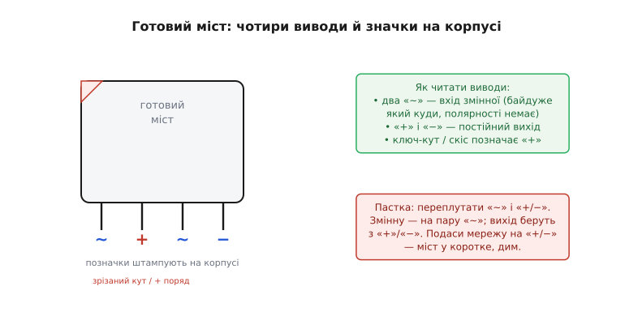
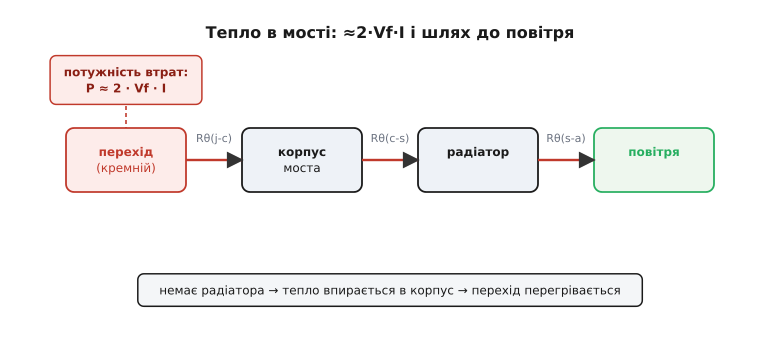
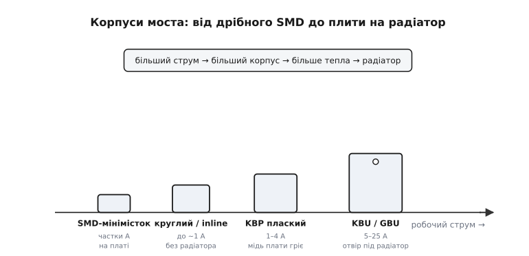

# 🔌 Готовий міст в одному корпусі: розпіновка, добір, тепло

Чотири окремі діоди, спаяні ромбом, працюють бездоганно — але на платі це чотири деталі, вісім ніжок і вісім місць, де можна помилитися полярністю. Тому в реальних блоках живлення міст майже завжди беруть **готовим**: ті самі чотири діоди вже зведені ромбом усередині одного корпусу, а назовні виведено лише **чотири** ноги. Дві з них — вхід змінної напруги, дві — постійний вихід. Це окремий **клас компонента** (англ. *bridge rectifier*, *bridge module*): хоч би хто його випускав і в якому корпусі, поводиться він однаково, заводиться однаково й кусає однаково. Розберімо його як деталь, яку треба впізнати в купі, правильно під'єднати, грамотно дібрати з даташита й не спалити.

Сам принцип — чому чотирьох діодів досить, щоб обидві півхвилі йшли в навантаження одним боком, — ми вже вивели [в основній темі](root:embedded/bridge-rectifier-design). Тут принцип не повторюємо: дивимося на міст **як на фізичну річ у корпусі** — звідки в нього стільки тепла, який корпус під який струм, і чому половина спалених мостів гине не від струму, а від трьох конкретних граблів класу.

### Що це за клас і навіщо він окремий

Готовий мостовий випрямляч — це **складка з чотирьох діодів**, з'єднаних ромбом (схемою Гретца) усередині одного корпусу, з чотирма виводами назовні. Усе. Жодної «розумної» начинки — ні керування, ні захисту, лише чотири діоди, заздалегідь спаяні правильно. Здавалося б, дрібниця — навіщо тоді цілий клас? Бо така складка дає три речі, яких чотири окремі діоди не дають.

По-перше, **economія місця й помилок**: одна деталь замість чотирьох, чотири ніжки замість восьми, і — головне — ромб уже з'єднаний правильно на заводі, тож переплутати діод місцями вже неможливо. По-друге, **підібрані діоди**: усі чотири вирізані з одного кристала чи однієї партії, тож їхні прямі падіння й теплові характеристики близькі — на відміну від чотирьох випадкових діодів із шухляди. По-третє, і це найважливіше для добору, **спільний тепловий шлях**: усі чотири діоди сидять на одній підкладці, часто з металевою основою під радіатор, і гріються в одне місце — а отже, і охолоджувати їх треба як одне ціле.

> 🔧 **Навіщо це.** Коли проєктуєш мережевий блок живлення, готовий міст — це деталь, яку ставиш не думаючи: дешево, надійно, без шансу спаяти ромб неправильно. Думати треба лише про дві речі — **який корпус** (а отже, чи треба радіатор) і **які числа з даташита** мусить витримати ця деталь у твоїй схемі. Саме цим двом питанням і присвячена ця вставка.

### Блок-схема: що всередині й що назовні

Усередині — той самий ромб із чотирьох діодів, що й у [основній темі](root:embedded/bridge-rectifier-design). Але користувачеві корпусу нутро не видно й не потрібне: він бачить лише **чорну скриньку з чотирма виводами**.

```
            ┌─────────────────────┐
   ~ ───────┤                     ├─────── +   (постійний вихід, плюс)
  (змінна)  │   ромб із 4 діодів  │
   ~ ───────┤     усередині       ├─────── −   (постійний вихід, мінус)
  (змінна)  └─────────────────────┘
```

Два виводи позначені **«~»** (символ синусоїди) — це **вхід** змінної напруги; на них приходять кінці вторинної обмотки трансформатора. Два інші позначені **«+»** і **«−»** — це **вихід** випрямленої, однобічної напруги; з них знімають струм у згладжувальний конденсатор і далі в навантаження. Жодних інших виводів у класичного моста немає: чотири ноги, дві пари.

Тут і криється перша ключова відмінність від звичайної мікросхеми, яку треба засвоїти намертво: **два виводи «~» рівноправні й не мають полярності**. На вхід приходить змінна напруга, що сто разів на секунду перевертається, — тож казати, який із «~» «плюсовий», безглуздо: вони міняються ролями кожен півперіод. Це означає, що **кінці обмотки можна чіпляти на «~» як завгодно** — від перестановки нічого не зміниться. А от виводи «+» і «−» **полярні**: переплутати їх — те саме, що переплутати полярність живлення для всієї схеми далі.

### Типова розпіновка: чотири виводи й як їх упізнати

Найчастіша фізична розкладка — **чотири виводи в один ряд** (у плаского корпусу) або по кутах квадрата (у круглого), у типовому порядку **«~ + ~ −»**: змінні входи через один, а полярні виходи розведені по краях. Але порядок виводів — **не закон**: різні корпуси розкладають ноги по-різному, тож запам'ятовувати «друга нога — плюс» не можна. Натомість виробник **штампує позначки прямо на корпусі**, і читати треба саме їх.


*Як читати готовий міст. Два виводи «~» — вхід змінної (полярності не мають, кінці обмотки чіпляй як завгодно); «+» і «−» — постійний вихід. Виробник позначає виводи символами просто на корпусі, а плюсовий вивід часто додатково виділяє зрізаним кутом або скосом. Головна пастка класу — переплутати пару «~» із полярними «+/−».*

Прикмети, за якими впізнають виводи, спільні для майже всіх корпусів — шукай будь-яку:

- **Символи біля ніжок:** хвиляста риска **~** проти змінних входів, **+** і **−** проти полярних виходів. Це найнадійніша ознака — її штампують практично завжди.
- **Скошений або зрізаний кут корпусу** (чи інша механічна мітка) поряд із **плюсовим** виводом — як «ключ», що однозначно орієнтує деталь. Якщо з символів видно лише «+», решта виводиться з порядку.
- **Колірна чи формова відмінність** одного виводу в деяких корпусів (довша ніжка, мітка фарбою) — рідше, але буває.

Якщо корпус геть стертий і символів не лишилося, пару «~» від пари «+/−» можна **дзвоном мультиметра в режимі перевірки діодів**: між двома «~» прилад покаже два діодні падіння в обидва боки (через дві гілки ромба), а між «+» і «−» — теж два падіння, але **різні** в різні боки (бо вихід полярний). Та в нормі до дзвону не доходить — символи на місці.

### Підключення: куди що

Зібрати вхідний вузол блока живлення з готовим мостом — справа кількох з'єднань, і всі вони диктуються позначками на корпусі:

```
трансформатор          готовий міст           згладжування + навантаження
  вторинна              ┌──────────┐
   обмотка   ───────────┤ ~      + ├───────┬──────────┬─────── + до схеми
   (~12 В)              │          │       │          │
             ───────────┤ ~      − ├───┐  ===  Cзгл   R навантаження
                        └──────────┘   │   │          │
                                       └───┴──────────┴─────── − (спільна земля)
```

Кінці вторинної обмотки — на **обидва «~»** (байдуже, який кінець на який «~»). Згладжувальний конденсатор — між **«+»** і **«−»**, дотримуючись полярності (електролітичний конденсатор полярний, його «+» — на «+» моста). Навантаження — паралельно конденсаторові. Вивід «−» моста зазвичай стає **спільною землею** всієї схеми далі.

Одна тонкість, яку легко проґавити: **«−» моста — це не той самий нуль, що нейтраль мережі**. Після трансформатора вторинна обмотка гальванічно відв'язана від мережі, і «земля» схеми народжується саме на виводі «−» моста — від нього й рахують усі напруги далі. Плутати цей нуль із заземленням чи нейтраллю розетки не можна.

> 🔧 **Навіщо це.** Той самий міст ставлять не лише на вихід трансформатора, а й на **вхід пристрою, що має живитися байдуже якою полярністю**: подаєш живлення на пару «~», а з «+/−» завжди знімаєш правильну полярність — переплутав провідники на вході, міст усе одно видасть плюс там, де треба плюс. Чотири діоди коштують копійки, тож цей захист «від дурня» додають часто — і тут готовий міст незамінний.

### Перший байт даташита: чотири числа добору

Коли деталь упізнано й під'єднано, лишається головне інженерне питання: **чи витримає цей конкретний міст мою схему**. Відповідь — у даташиті, і зчитується вона з чотирьох ключових чисел. Це ті самі параметри, що в одиночного діода, лише наведені для готової складки; усі позначення стандартні й однакові в будь-якого виробника.

**IF(AV) — середній прямий струм** (англ. *average rectified forward current*). Скільки **середнього** струму міст може тривало пропускати у навантаження. Це **тепловий** ліміт: не «скільки витримає кремній за струмом», а «скільки тепла зможе відвести корпус, перш ніж перехід перегріється». Тому IF(AV) у даташиті **завжди прив'язаний до температури** — корпусу або довкілля — і до того, чи є радіатор. Те саме число за гарячого корпусу й без радіатора може бути в рази меншим, ніж заявлене «за 25 °C». Бери міст, чий IF(AV) із добрим запасом перекриває твій робочий струм навантаження.

**VRRM — повторювана пікова зворотна напруга** (англ. *maximum repetitive reverse voltage*). Найбільша зворотна напруга, яку закритий діод моста витримує без пробою, у повторюваних піках кожного періоду. У [основній темі](root:embedded/bridge-rectifier-design) ми вивели, що в мості до закритого діода прикладена приблизно **пікова напруга обмотки** (Vобм·√2). VRRM деталі має перекривати цей пік — і то з великим запасом, бо на нього накладаються мережеві кидки (про них нижче).

**IFSM — ударний пусковий струм** (англ. *peak forward surge current*). Найбільший **однократний** імпульс струму, який діоди переживуть, не згорівши, — стандартно його задають як одиночну півхвилю синуса завдовжки **8.3 мс** (півперіод мережі 60 Гц; для 50 Гц беруть 10 мс). Це не робочий режим, а **аварійний-короткий**: саме він описує здатність моста пережити перший кидок заряду порожнього конденсатора при ввімкненні. IFSM завжди в рази-десятки разів більший за IF(AV) — і саме його, а не середній струм, треба звіряти з пусковим поштовхом.

**VF — пряме падіння** (англ. *forward voltage*). Скільки вольтів губиться на **одному** відкритому діоді при заданому струмі — звично близько 0.7–1.0 В для кремнію, тим більше, чим більший струм. У мості струм завжди йде крізь **два** діоди послідовно, тож від напруги губиться подвоєне падіння, ≈2·VF (це ми теж розбирали в [основній темі](root:embedded/bridge-rectifier-design)). VF важливий і для ккд (втрачена напруга), і — головне тут — для **тепла**: саме на цьому падінні струм виділяє потужність усередині корпусу.

Коротка пам'ятка добору, як її читають із даташита:

```
параметр   що означає                    як добирати
────────   ──────────────────────────    ─────────────────────────────
IF(AV)     середній прямий струм         > робочого струму, із запасом;
           (тепловий ліміт!)             дивись за СВОЄЇ T і з/без радіатора
VRRM       пікова зворотна напруга       > пік обмотки (Vобм·√2), ще й з
           закритого діода               запасом на мережеві кидки
IFSM       ударний пусковий струм        > пік заряду порожнього Cзгл
           (8.3 / 10 мс, однократно)     при ввімкненні
VF         пряме падіння на 1 діоді      менше — менше втрат і тепла;
           (×2 у мості)                  Шотткі ≈ удвічі менше
```

### Скільки тепла й чи треба радіатор

Тепер — те, що відрізняє готовий міст від «просто чотирьох діодів» і що найчастіше недооцінюють: **тепло**. Усі чотири діоди сидять в одному корпусі й гріються в одну точку, тож порахувати розсіювану потужність треба обов'язково.

На кожній півхвилі струм навантаження йде крізь **два** відкриті діоди послідовно, на кожному з яких губиться його пряме падіння VF. Потужність — це струм на падіння напруги, тож міст розсіює приблизно:

```
P ≈ 2 · VF · I
```

де I — середній струм навантаження, а VF — падіння на одному діоді при цьому струмі. Множник 2 — бо струм завжди тече крізь пару діодів; це не описка, а суть, чому міст гріється вдвічі дужче за однодіодну схему на тому самому струмі.

**Приклад (тепло й потреба в радіаторі).** Блок живлення видає 2 А у навантаження; пряме падіння одного діода моста при цьому струмі за даташитом ≈0.95 В. Скільки тепла розсіює міст і чи вистачить йому корпусу без радіатора?

```
розсіювана потужність моста:
  P ≈ 2 · VF · I
  P ≈ 2 · 0.95 · 2 = 3.8 Вт         // майже чотири вати — у малій деталі!
прикидка нагріву без радіатора:
  типовий Rθ(j-a) плаского корпусу ≈ 25 °C/Вт
  ΔT = P · Rθ(j-a) = 3.8 · 25 ≈ 95 °C   // перегрів переходу над повітрям
  Tпереходу ≈ 40 °C (довкілля) + 95 ≈ 135 °C → НЕБЕЗПЕЧНО близько до межі
з радіатором (Rθ переходу-до-повітря падає, скажімо, до 5 °C/Вт):
  ΔT = 3.8 · 5 ≈ 19 °C → Tпереходу ≈ 60 °C → спокійно
```

Висновок жорсткий: майже чотири вати в крихітному корпусі — це багато. Без тепловідводу перехід вибіг би під 135 °C, упритул до межі (зазвичай 125–150 °C), і за теплого дня деталь жила б недовго. Радіатор скидає нагрів до безпечних шістдесяти. Звідси й практичне правило класу.

Куди дівається це тепло — видно з ланцюга **теплових опорів** від кремнію до повітря:


*Куди йде тепло моста. Потужність P ≈ 2·Vf·I народжується в кремнієвих переходах і мусить дотекти до повітря крізь низку теплових опорів: перехід→корпус (Rθ j-c), корпус→радіатор (Rθ c-s), радіатор→повітря (Rθ s-a). Кожен опір додає свій перепад температури. Без радіатора останньої ланки немає — тепло впирається в малу поверхню корпусу, і перехід перегрівається.*

Теплові опори складаються послідовно, як звичайні: загальний перепад температури ΔT = P · (Rθ(j-c) + Rθ(c-s) + Rθ(s-a)). Прибравши радіатор, ти викидаєш найбільшу ланку відведення — і весь перепад лягає на малу поверхню корпусу, що віддає тепло кепсько. Тому правило просте: **прикинь P ≈ 2·VF·I; якщо вийшло більше десь ват-півтора — клади міст на радіатор**, і саме під це бери корпус із металевою основою чи отвором під гвинт.

### Типові граблі класу

Тепер — три способи спалити готовий міст, які ловлять найчастіше. Жоден із них не пов'язаний із перевищенням **середнього** струму — а саме на нього новачок дивиться першим.

**Перевищення VRRM мережевими кидками.** Здається, що порахувати зворотну напругу легко: пік обмотки — і готово. Але мережа далеко не чиста: у ній раз у раз трапляються короткі **викиди** напруги — від комутації потужних навантажень, грозових наведень, перемикань у мережі. Ці піки бувають у кілька разів вищі за номінал і пробивають діод, чий VRRM вибрано «впритул». Лік — **запас**: для випрямлення 12 В обмотки (пік ≈17 В) цілком розумно поставити міст на 100 чи 200 В, бо коштує він майже стільки ж, а кидок переживе. Запас за зворотною напругою ніколи не шкодить.

**Пусковий струм заряду конденсатора.** Це найпідступніше, бо в штатному режимі все добре, а гине деталь у **першу мить** увімкнення. Поки згладжувальний конденсатор порожній, він для джерела майже коротке замикання: напруга на ньому нуль, і струм заряду обмежений лише дрібним опором обмотки й відкритих діодів. Цей **пусковий поштовх** (англ. *inrush*) може вдесятеро й більше перевищити робочий струм — і саме його витримку описує IFSM, а не IF(AV). Чим **більший** згладжувальний конденсатор, тим лютіший перший кидок. Тому міст добирають так, щоб **IFSM перекривав пусковий струм**, а в потужніших блоках між мостом і конденсатором ставлять обмежувач пуску. Механізм поштовху й прийоми його приборкання ми розбирали в [основній темі](root:embedded/bridge-rectifier-design), а активне рішення — у кроці про [обмежувач пускового струму](root:embedded/active-inrush-limiter).

**Перегрів без радіатора.** Третя класична загибель — теплова, і ми щойно її порахували. Дивляться лише на струм («2 А — а міст на 6 А, з запасом!»), забувають про P ≈ 2·VF·I, не ставлять радіатор — і перехід тихо смажиться, поки не деградує. Підступність у тому, що міст із величезним запасом **за струмом** усе одно згорить **за теплом**, якщо тепло нема куди відвести. Правило одне: порахуй потужність і дай їй дорогу до повітря.

**Плутанина «~» і полярних виводів.** Не загибель від перевантаження, а помилка монтажу — але теж типова. Подати мережу/обмотку на пару **«+/−»** замість «~» означає прикласти змінну напругу прямо до точок, між якими стоять діоди «навстріч», — це майже коротке замикання через дві гілки ромба на піку кожної півхвилі, і міст гине миттєво. Або навпаки: зняти «вихід» із пари «~» — і отримати на виході ту саму змінну, ніби моста й нема. Лік — **читати позначки на корпусі**, а не вгадувати за порядком ніжок; орієнтуватися на знак «+» і скошений кут.

> 🔧 **Навіщо це.** Якщо зібраний блок живлення «вибиває» запобіжник при ввімкненні — підозрюй пусковий струм (IFSM, завеликий конденсатор), а не штатний режим. Якщо міст підозріло гарячий — рахуй P ≈ 2·VF·I і став радіатор. А якщо при ввімкненні відразу пішов дим — найперше перевір, чи не переплутано «~» з «+/−». Три різні симптоми — три різні грабельки класу.

### Варіації класу: корпуси під різний струм

Готовий міст — один клас, але корпусів у нього багато, і всі вони — про одне: **скільки струму, а отже, скільки тепла**, ця деталь має витримати. Що більший струм — то більший корпус і то ближче радіатор. Це і є головна вісь, уздовж якої розкладаються родини корпусів.


*Корпуси моста за робочим струмом. Зліва направо: SMD-мінімісток (частки ампера, гріється в мідь плати) → круглий або плаский вивідний корпус до ~1 А → плаский KBP на одиниці ампер → масивний KBU/GBU з отвором під гвинт на десятки ампер. Закономірність одна: більший струм → більший корпус → більше тепла → потреба в радіаторі.*

Орієнтири по родинах (назви — це **типи корпусів**, не партномери; під кожним десятки сумісних деталей різних виробників):

- **SMD-мінімістки** (типи на кшталт MB*S, DB*S, DF*S — серії поверхневого монтажу) — найдрібніші, на **частки ампера**. Окремого радіатора не мають: усе тепло йдуть у мідь і поліжки плати, тож «радіатором» їм слугує сама плата. Беруть туди, де струм невеликий, а місце дороге, — у компактні плати приладів.
- **Круглі та плоскі вивідні** (round, inline; типи на зразок WOB/WOM круглі та плаского виконання) — на струми приблизно **до ампера**, без радіатора. Класика дрібних мережевих блоків і зарядних.
- **KBP та рідня** (плаский корпус із виводами в ряд) — робочий конячок на **одиниці ампер** (звично 1–4 А). Радіатора як такого нема, але мідь плати помітно допомагає; на верхньому краю струму вже варто думати про тепловідвід.
- **KBU / GBU, KBJ / GBJ** (масивні корпуси з **отвором під гвинт**) — на **десятки ампер** (типово 5–25 А і вище). Мають металеву основу й отвір, щоб пригвинтити деталь до радіатора, — бо на таких струмах P = 2·VF·I сягає багатьох ват, і без радіатора деталь не виживе. Це вибір для потужних лінійних блоків.

Окрема варіація — **міст на діодах Шотткі** замість звичайних кремнієвих. Їхнє пряме падіння вдвічі менше (≈0.3–0.4 В замість ≈0.7–1.0 В), тож і втрачена напруга, і тепло (P = 2·VF·I) — удвічі менші. Це рятує на **низьких** вихідних напругах, де подвоєне падіння звичайного моста з'їдає надто велику частку, та коли важливий ккд. Про самі діоди Шотткі та їхній компроміс — у кроці про [Шотткі й стабілітрони](root:embedded/zener-schottky).

Як обрати корпус — диктує лише пара чисел, які ми вже маємо: **робочий струм** (звідси родина) і **розсіювана потужність** P ≈ 2·VF·I (звідси — чи треба радіатор і, отже, корпус із отвором під гвинт). Усе інше в цьому класі однакове: чотири виводи, дві пари «~» і «+/−», ті самі чотири числа добору з даташита й ті самі граблі. Упізнав розпіновку, порахував струм і тепло, дав запас за напругою й пусковим струмом — і готовий міст зробить свою непримітну, але незамінну роботу на вході твого блока живлення.
