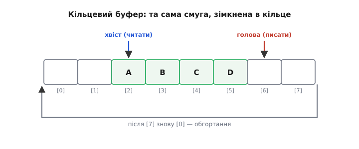
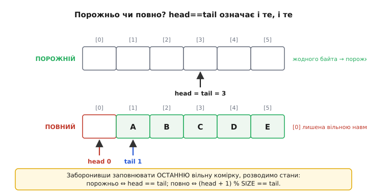
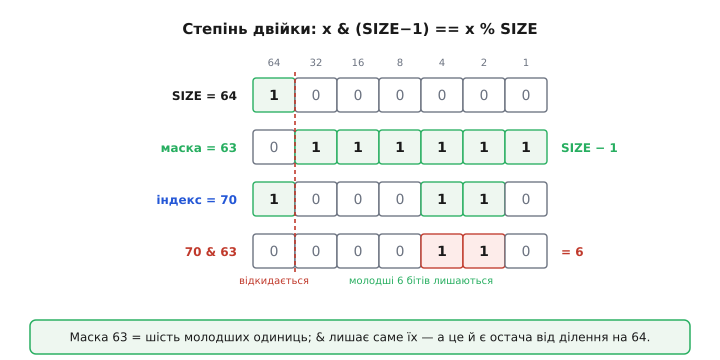

# ⚙️ Кільцевий буфер: приймати, поки руки зайняті

**Задача.** У статті масив був сховищем, у яке ти кладеш дані й потім їх обходиш. Але в прошивці часто буває навпаки: дані **приходять самі**, у свій час, і не питають, чи ти готовий. Найгостріший приклад — байти з [UART](topic:communications/uart-frame). Хай прилад слухає радіомодем: щоразу, коли на дроті з'являється повний байт, залізо смикає [переривання](topic:programming/isr) — коротко відриває процесор від того, чим він зайнятий, і каже: «ось байт, забери». Забрати треба **негайно**: приймальний регістр UART один-єдиний, і наступний байт, що прийде за 87 мікросекунд, ляже поверх старого й затре його. Прочитав вчасно — байт твій; спізнився — його немає назавжди, і жоден код цього вже не виправить.

А тепер додай сюди правду життя: основний код рідко коли вільний саме тієї миті. Він оновлює дисплей, крутить регулятор двигуна, рахує навігацію — і будь-яка з цих справ може тривати мілісекунди, поки байти цокають щодесятки мікросекунд. Виходить розрив: **приймач (переривання) породжує байти в одному ритмі, а споживач (основний цикл) вибирає їх у геть іншому**, набагато повільнішому й нерівному. Між ними потрібне буферне сховище, куди переривання вкидає байт умить і біжить далі, а основний код вичерпує накопичене, коли до нього дійдуть руки. Порядок байтів мусить зберегтися — команда, що прийшла раніше, і розібратися має раніше. Пам'яті на це в мікроконтролері мало, рости їй нікуди, `malloc` у перериванні — табу. Тобто буфер має бути **сталого розміру, наперед виділений**, і при цьому не «забиватися» назавжди: те, що прочитали, звільняє місце для нового.

Канонічна відповідь на цю задачу — **кільцевий буфер** (англ. *ring buffer*, або *circular buffer*). Це не нова структура даних, а хитрий спосіб дивитися на звичайний одновимірний масив. Розберімо його від першопричини й доведемо до робочого приймача UART, який не губить байтів, хай що робить основний код.

## Ідея: рівна смуга, зімкнена в кільце

Візьмемо звичайний масив — рівну смугу комірок, яку ми вже добре знаємо. Проблема простого масиву як черги очевидна: якщо просто складати байти від `buf[0]` і далі, то, дійшовши до останньої комірки, доведеться або спинитися, або зсувати весь уміст ліворуч, звільняючи хвіст, — а зсув сотні байтів на кожен новий символ це безглузда робота, та ще й у перериванні.

Хитрість у тому, щоб **не рухати дані, а рухати два вказівники** й дозволити їм ходити по колу. Заведемо два числа-індекси:

- **голова** (*head*) — номер комірки, куди ляже **наступний записаний** байт;
- **хвіст** (*tail*) — номер комірки, звідки візьметься **наступний прочитаний** байт.

Переривання, поклавши байт у комірку `head`, посуває голову на одну вперед. Основний цикл, забравши байт із комірки `tail`, посуває хвіст на одну вперед. Голова біжить попереду й лишає за собою свіжі байти; хвіст біжить услід і «з'їдає» їх. Проміжок між хвостом і головою — це те, що прийшло, але ще не прочитане.

А коли індекс добігає до кінця смуги? Тут і народжується «кільце»: замість спинитися, індекс **перестрибує назад на нуль** і йде далі з початку. Фізично масив лишається рівною смугою; але логічно ми домовляємося, що за останньою коміркою знову йде перша — наче смугу зігнули й склеїли кінці в кільце. Голова й хвіст просто ганяють по цьому колу одне за одним, вічно, ніколи не впираючись у «край».


*Голова кладе байт і посувається вперед, хвіст читає й наздоганяє; дійшовши до останньої комірки, обидва повертаються на початок — рівна смуга поводиться як замкнене кільце.*

> 🔧 **Навіщо це.** Уся вигода кільця — у тому, що **жоден байт нікуди не переноситься**. Запис — це «поклав у комірку `head` й додав до `head` одиницю»; читання — «узяв із комірки `tail` й додав до `tail` одиницю». Обидві дії коштують кілька інструкцій незалежно від того, скільки даних у буфері, — саме тому кільце годиться для переривання, де кожна зайва мікросекунда відбирається в основного коду. Зсув-черга з такою вимогою просто не жилець.

## Обгортання: як «+1» перестрибує з кінця на початок

Формалізуймо той стрибок через край. Нехай розмір смуги — `SIZE` комірок, з індексами `0 … SIZE−1`. Посунути індекс уперед з обгортанням — це:

```
head = (head + 1) % SIZE
```

Знак `%` — це **остача від ділення** (англ. *modulo*). Розберімо, чому саме остача робить те, що треба. Поки голова всередині смуги, `head + 1` менше за `SIZE`, і остача від ділення на `SIZE` — це просто саме число: `5 % 8 = 5`, ніщо не змінилося. Але щойно голова стоїть на останній комірці, `head = SIZE − 1`, і `head + 1 = SIZE` — а `SIZE % SIZE = 0`. Остача рівно тут «скидає» індекс на нуль, повертаючи його на початок смуги:

```
SIZE = 8

head = 6:  (6 + 1) % 8 = 7        ← звичайний крок
head = 7:  (7 + 1) % 8 = 8 % 8 = 0 ← обгортання: перестрибнули на початок
head = 0:  (0 + 1) % 8 = 1        ← і поїхали далі
```

Одна операція `% SIZE` замінює цілий `if (head == SIZE) head = 0;`. Це той самий зсув, що й індекс масиву в статті, тільки закільцьований: індекс завжди лишається в законному діапазоні `0 … SIZE−1`, скільки б до нього не додавали. Хвіст рухається точнісінько так само: `tail = (tail + 1) % SIZE`.

Далі ми побачимо, що якщо `SIZE` обрати не абияким, а **степенем двійки**, цю остачу можна замінити на одну дешеву побітову операцію. Але спершу закриємо тоншу проблему, без якої буфер не працює: як відрізнити порожній буфер від повного.

## Порожньо чи повно? Дві однакові адреси

Ось де кільцевий буфер ставить пастку, і вона не очевидна, поки не наштовхнешся. Порожній буфер — це коли **все прочитано**: хвіст наздогнав голову, читати нема чого, `head == tail`. Логічно. Тепер уяви, що ми, навпаки, **набили буфер по вінця**: голова обійшла все коло й знову вперлася хвостові в спину. Голова показує на ту саму комірку, що й хвіст, — і знову `head == tail`.

Той самий вираз `head == tail` означає **і порожньо, і повно** — два протилежні стани нерозрізнимі. Прочитавши цю рівність, код не має жодного способу дізнатися, чи буфер порожній (і треба чекати), чи вщент повний (і треба бити на сполох). Це фундаментальна двозначність, і живуть із нею двома способами.


*Порожній і повний буфер дали б однакове head == tail; лишивши одну комірку завжди незаповненою, розводимо ці стани й читаємо їх без жодного лічильника.*

**Спосіб перший — лишати одну комірку вічно вільною.** Домовмося ніколи не заповнювати останню порожню комірку: як тільки заповнення такого запису **зробило б** `head == tail`, вважаємо буфер повним і байт не беремо. Тоді стани розходяться начисто:

```
порожньо  ⇔  head == tail
повно     ⇔  (head + 1) % SIZE == tail
```

Ціна — одна невикористана комірка: у смузі на `SIZE` комірок корисних лишається `SIZE − 1`. Дрібниця. А натомість — величезна вигода, яку ми оцінимо аж наприкінці: **голову чіпає лише той, хто пише, а хвіст — лише той, хто читає**. Жодного спільного лічильника, за який билися б переривання й основний код.

**Спосіб другий — окремий лічильник заповнення.** Завести ще одну змінну `count` — скільки байтів у буфері зараз. Тоді все прямо: `count == 0` — порожньо, `count == SIZE` — повно, і жодної комірки не марнуємо. Але за цю економію доведеться заплатити дорожче, ніж здається:

```c
static volatile uint16_t count = 0;   // скільки байтів у буфері ЗАРАЗ
// запис (у перериванні):  count++;   ← лічильник збільшує ПИСЕЦЬ
// читання (в основному):  count--;   ← лічильник зменшує ЧИТАЧ
```

Бачиш проблему? `count` чіпають **обидва** боки: переривання його збільшує, основний цикл — зменшує. Це спільна змінна, яку двоє змінюють у різні, неузгоджені моменти, — а `count++` і `count--` це насправді «прочитай, зміни, запиши назад», три окремі дії. Якщо переривання втрутиться рівно посеред `count--` основного коду, одне з оновлень загубиться, і лічильник тихо збреше. Це і є **гонка** (англ. *race condition*), і щоб її уникнути, доведеться на час оновлення `count` глушити переривання — тобто ставити замок там, де перший спосіб обходився без замків зовсім. Тому в приймачах UART класичний вибір — саме перший спосіб, «одна комірка вільна». Його й напишемо.

## Робочий код: приймач UART без утрат

Складімо тепер справжній приймач. Матеріалу тут рівно стільки, скільки ми вже пройшли: масив, кілька змінних, функції — і одне нове слово `volatile`, яке зараз пояснимо. Кладемо смугу й два індекси у файлові (глобальні) змінні, бо до них дотягуються з двох місць — із переривання й з основного циклу:

```c
#include <stdint.h>
#include <stdbool.h>

#define RB_SIZE  128                   // степінь двійки — навіщо, побачимо далі
static volatile uint8_t  rb[RB_SIZE];  // сама смуга байтів
static volatile uint16_t head = 0;     // куди ПИСАТИ наступний байт (рухає переривання)
static volatile uint16_t tail = 0;     // звідки ЧИТАТИ наступний байт (рухає main)
```

Слово `volatile` (лат. *volatilis* — летючий, мінливий) каже компіляторові: **ця змінна може змінитися сама, поза видимим потоком коду** — тож не тримай її копію в регістрі, а щоразу читай і пиши по-справжньому, у пам'ять. Без нього основний цикл, чекаючи на байт, міг би один раз прочитати `head` у регістр і крутитися вічно на застарілому значенні, так і не побачивши, що переривання його вже посунуло. `volatile` тут — не перестрахування, а умова, щоб код узагалі працював. (Він, щоправда, лікує лише кешування компілятором, а не всі біди спільного доступу — до цієї тонкощі повернемось у пастках.)

Тепер сама пара дій. **Запис** викликається з переривання й кладе один байт; якщо буфер повний, байт чесно відкидається — це незрівнянно краще, ніж мовчки писати за межу масиву:

```c
// Викликається з ПЕРЕРИВАННЯ UART, коли прийшов один байт.
// Повертає false, якщо буфер повний і байт довелося відкинути.
bool rb_put(uint8_t b) {
    uint16_t next = (head + 1) % RB_SIZE;   // де голова стане ПІСЛЯ запису
    if (next == tail) {
        return false;                       // повно (одна вільна комірка — межа)
    }
    rb[head] = b;                           // 1) кладемо байт у поточну голову
    head = next;                            // 2) і ТІЛЬКИ ТЕПЕР посуваємо голову
    return true;
}
```

**Читання** викликається з основного циклу й дістає один байт, якщо він є:

```c
// Викликається з ОСНОВНОГО циклу. Дістає один байт; false — буфер порожній.
bool rb_get(uint8_t *out) {
    if (head == tail) {
        return false;                       // порожньо — нема чого читати
    }
    *out = rb[tail];                        // 1) беремо байт із хвоста
    tail = (tail + 1) % RB_SIZE;            // 2) і посуваємо хвіст услід
    return true;
}
```

Зверни пильну увагу на **порядок двох дій** у кожній функції — він не косметичний, він і робить цей код безпечним. У `rb_put` ми спершу кладемо байт у комірку й **лише потім** посуваємо голову. Чому саме так: основний цикл вирішує, чи є дані, за умовою `head != tail`. Якби ми посунули голову **раніше**, ніж поклали байт, то на цю коротку мить голова вже каже «є новий байт», а в комірці ще лежить старий мотлох — і читач, устрявши точно тут, схопив би сміття. Посунувши голову **останньою**, ми ніби піднімаємо прапорець «готово» тільки тоді, коли дані справді на місці. Симетрично в `rb_get`: спершу забираємо байт, тоді звільняємо комірку рухом хвоста, — щоб писець не вважав комірку вільною, поки ми з неї ще читаємо.

Лишилося з'єднати це з залізом. Переривання приймача UART викликає `rb_put`, а основний цикл вичерпує накопичене через `rb_get`. Ось обробник для STM32 (сучасні родини — прапорець `RXNE` у регістрі `ISR`, дані в `RDR`):

```c
// Переривання приймача UART на STM32. Прийшов байт → умить у кільце й вихід.
void USART2_IRQHandler(void) {
    if (USART2->ISR & USART_ISR_RXNE) {     // прийшов байт?
        uint8_t b = (uint8_t)USART2->RDR;   // читання RDR САМЕ ПО СОБІ гасить RXNE
        rb_put(b);                          // ховаємо байт у буфер — і все, назад до справ
    }
}
```

Тут варто знати одну особливість заліза, яку ми звірили за документацією: прапорець `RXNE` («у приймачі є непрочитаний байт») **скидається самим фактом читання** регістра даних — окремо гасити його не треба. Назви регістрів різняться між родинами STM32: новіші (F0/F3/F7/L4/G0…) мають окремі `RDR`/`TDR` і статус в `ISR`, старіші (F1/F4) — один спільний `DR` і статус в `SR`, де той самий прапорець зветься так само `RXNE`. Механізм ідентичний: побачив прапорець — прочитав байт — прапорець згас.

Основний цикл, дійшовши до обробки вводу, просто вичерпує все, що встигло накопичитись, поки він був зайнятий:

```c
// В основному циклі: коли руки дійшли — забираємо все накопичене за раз.
uint8_t b;
while (rb_get(&b)) {
    feed_parser(b);        // згодовуємо кожен байт розбирачеві команд
}
```

Зверни увагу, як гарно розчепилися два ритми. Переривання може смикнути `rb_put` хоч сто разів, поки основний код рахував навігацію; коли той нарешті дійде до `while (rb_get(...))`, він одним махом забере всі сто байтів у правильному порядку. Байти не загубилися й не переплуталися — вони спокійно чекали в кільці. Це і є те розчеплення виробника й споживача, заради якого все затівалося.

> 🔧 **Навіщо це.** Так — не навчальна вправа, а рівно те, що роблять фабричні драйвери. У ESP32 приймач UART має **128-байтовий апаратний FIFO**, а драйвер ESP-IDF, коли той назбирує близько 120 байтів, спрацьовує перериванням, перекладає їх зі свого FIFO у власний **кільцевий буфер** і будить задачу-читача. Той самий прийом — голова в перериванні, хвіст у читачі — просто зроблений за тебе. Написавши кільце руками раз, ти назавжди розумієш, що діється всередині будь-якого «серійного порту» на будь-якій платі.

## Степінь двійки: `& (SIZE−1)` замість `%`

Повернімося до обіцянки. Ми скрізь писали `% RB_SIZE`, і це чесно працює за будь-якого розміру. Але подивись на переривання: воно спрацьовує **на кожен байт**, а на швидкому потоці це десятки тисяч разів на секунду. Кожна зайва інструкція в ньому відбирається просто в корисної роботи процесора. І тут з'ясовується, що остача — операція недешева: ділення на довільне число деякі процесори роблять **програмно, за десятки тактів**.

Ключова обставина: у молодших ядрах ARM — Cortex-M0 і M0+ — **апаратного ділення взагалі немає**, тож `%` компілюється у виклик повільної бібліотечної процедури. Старші (Cortex-M3/M4/M7) команду ділення мають, але навіть вона триває довше за просту логічну операцію. Ми хочемо, щоб обгортання коштувало **одну** інструкцію. І це можливо — якщо розмір буфера обрати **степенем двійки**.

Ось у чому фокус. Для беззнакового `x` остача від ділення на степінь двійки дорівнює **побітовому І** з маскою на одиницю меншою:

```
x % SIZE  ==  x & (SIZE − 1)     ← лише коли SIZE = 2ⁿ, а x беззнаковий
```

Чому так, стане очевидно, щойно глянемо на біти. Візьмемо `SIZE = 64 = 2⁶`. Тоді `SIZE − 1 = 63`, а в двійковому це **шість молодших одиниць**: `0111111`. Побітове І (англ. *AND*, `&`) лишає біт лише там, де в обох операндів стоїть одиниця, — тобто маска `63` **пропускає молодші шість бітів числа й обнуляє всі старші**. А молодші шість бітів двійкового числа — це рівно його остача від ділення на `2⁶ = 64`. Ось приклад із числом, що вилізло за межу:

```
   70 = 1000110₂          (70 = 64 + 4 + 2)
   63 = 0111111₂          маска: шість молодших одиниць
70&63 = 0000110₂ = 6      старший біт (64) відкинуто, лишились молодші шість
                          — а це рівно 70 % 64 = 6
```


*Коли розмір — степінь двійки, обгортання (x % SIZE) стає одним побітовим І з маскою SIZE−1: воно лишає молодші біти числа, а це рівно остача від ділення.*

Побітове І — одна машинна інструкція на будь-якому процесорі, навіть на найдешевшому. Тож обгортання в нашому буфері стає таким:

```c
#define RB_SIZE  128                        // = 2⁷, тому обгортання — одна маска
// ...
uint16_t next = (head + 1) & (RB_SIZE - 1); // те саме, що % 128, але одним І
// ...
tail = (tail + 1) & (RB_SIZE - 1);
```

Механіка побітових масок та зсувів — окрема тема, і ми розберемо її ґрунтовно у кроці про [бітові операції](root:embedded/c-bit-operations); там `& (SIZE−1)` як спосіб узяти остачу за степенем двійки постане в повний зріст. Тут досить бачити головне: **вибір розміру степенем двійки — ось що дає дешеве обгортання**, а запис `& (SIZE − 1)` — лише явний спосіб його виразити.

Тут потрібна чесна засторога, щоб ти не переоцінив саму заміну знака. Сучасні компілятори не дурні: коли `RB_SIZE` — стала-степінь-двійки, а операнд беззнаковий, вони й самі перетворять `% 128` на `& 127`, і різниці в швидкості між двома записами не буде. Ручна маска по-справжньому виграє тоді, коли розмір **не** відомий на етапі компіляції, або операнд **знаковий** (там `%` мусить давати правильний знак і вже не зводиться до простої маски), або компілятор слабкий. Але навіть коли виграшу немає, `& (SIZE − 1)` цінне як **пряме проголошення наміру**: цей код вимагає, щоб розмір був степенем двійки, і той, хто його читає, одразу це бачить. А от що не оптимізується ніяким компілятором — це неправильний вибір розміру: візьми `SIZE = 100`, і жоден `%` вже не стане маскою, бо `100` не степінь двійки. Тому правило просте: **розмір кільцевого буфера завжди степінь двійки** — 32, 64, 128, 256; тоді обгортання дешеве, як його не пиши.

## Зробити багаторазовим: той самий буфер у структурі

Поки що наш буфер один на весь застосунок — глобальні `rb`, `head`, `tail`. Але приладу часто треба кілька: окреме кільце на приймач і на передавач, ще одне на другий UART. Копіювати заради цього три глобальні змінні й дві функції — погана ідея. Природний хід — скласти всі три поля буфера **під одне ім'я**, у структуру, і передавати її у функції за адресою:

```c
typedef struct {
    uint8_t  buf[RB_SIZE];
    volatile uint16_t head;
    volatile uint16_t tail;
} ring_t;

bool rb_put(ring_t *rb, uint8_t b) {
    uint16_t next = (rb->head + 1) & (RB_SIZE - 1);
    if (next == rb->tail) return false;
    rb->buf[rb->head] = b;
    rb->head = next;
    return true;
}
```

Запис `rb->head` означає «поле `head` тієї структури, на яку показує `rb`». Це вже не глобальна змінна, а **адреса** конкретного буфера, передана у функцію, — той самий механізм, за яким масив входить у функцію самою лише адресою; повністю він проясниться у кроці про [покажчики](root:embedded/c-pointers-intro). Логіка ж усередині — літера в літеру та сама, що й раніше: обчислити наступну голову, перевірити на повноту, покласти байт, посунути голову. Тепер кожен виклик просто каже, **з яким саме** кільцем працює: `rb_put(&uart1_rx, b)`. Один код — скільки завгодно незалежних буферів.

## Складність і пастки

Кільцевий буфер оманливо простий: три поля й дві коротенькі функції. Але саме на цій простоті ловляться, бо небезпеки тут не в алгоритмі, а в тому, що **дві частини програми чіпають одні дані в непередбачувані моменти**. Пройдімося по граблях поіменно.

**Гонка голови й хвоста — і чому наш варіант її уникає.** Найголовніше питання: чи безпечно, що переривання й основний код лізуть у той самий буфер без жодного замка? У нашій схемі «одна комірка вільна» — так, і ось точний доказ. Переривання (виробник) **пише лише `head`** і **читає лише `tail`**. Основний код (споживач) **пише лише `tail`** і **читає лише `head`**. Тобто в кожної спільної змінної рівно **один писець** — а що має єдиного писця, те не може постраждати від чужого недописаного оновлення. Читач бачить або старе значення індексу, або нове, але ніколи покручену суміш. Це класична **черга без замків для одного виробника й одного споживача** (англ. *single-producer single-consumer*, SPSC), і саме тому вона працює у перериванні без глушіння переривань. Варто зламати цю дисципліну — завести спільний `count`, що його чіпають обидва, — і замок стане обов'язковим. Глибше про те, коли доступ можна вважати неподільним, — у кроці про [атомарність і гонки](topic:programming/atomicity-races).

**Атомарність самого індексу.** Попередній доказ спирається на приховане припущення: що читання чи запис індексу — **неподільна** дія. На 32-бітному ядрі (STM32, ESP32) читання й запис вирівняного 16- чи 32-бітного слова справді неподільні: воно лягає або читається за один прийом. Але перенеси цей самий код на 8-бітний AVR — і `uint16_t` там уже **два** окремі байтові доступи. Якщо переривання втрутиться між читанням старшого й молодшого байта хвоста, читач схопить **напівоновлене** число — зшите зі старої й нової половин, тобто цілковите сміття. Рятунок на AVR: або тримати індекси однобайтовими (`uint8_t`, `SIZE ≤ 256`) — один байт читається неподільно, — або на короткий час глушити переривання довкола багатобайтового доступу. Мораль універсальна: **безпека кільця залежить від того, чи неподільний доступ до індексу на твоєму залізі**, і це треба знати про свій процесор.

**`volatile` необхідне, але не всесильне.** Ми поставили `volatile` на індекси недарма: без нього компілятор мав би право закешувати `head` у регістрі, і `while (rb_get(...))` крутився б вічно, не бачачи оновлень із переривання. Але `volatile` робить рівно одне — забороняє **компіляторові** кешувати й переставляти доступи до цієї змінної; він **не** робить багатобайтовий доступ неподільним (див. вище про AVR) і **не** керує порядком записів між ядрами. Плутати «volatile» з «атомарним» — поширена й дорога помилка.

**Порядок запису на багатоядерному чипі.** Ми домовились: спершу байт у комірку, тоді рух голови. На одноядерному STM32 цього досить — переривання й основний код ділять одне ядро, і `volatile`-порядок їх розводить. Але ESP32 має **два** ядра, і якщо переривання крутиться на одному, а читач — на іншому, між «записати байт» і «посунути голову» потрібен ще й **бар'єр пам'яті** (на ARM це інструкція `DMB`, у прошивці — відповідний виклик): без нього друге ядро може побачити нову голову **раніше**, ніж до нього дійде записаний байт, і прочитати стару комірку. На одному ядрі бар'єр не потрібен; на двох — обов'язковий. Це та сама тема атомарності й видимості, лише в багатоядерному вимірі.

**Переповнення при повільному читанні.** Кільце рятує від утрати байтів **лише доти, доки встигаєш вичерпувати**. Якщо основний цикл надовго загруз, голова обійде коло й дожене хвіст — буфер повний, і `rb_put` починає **відкидати** нові байти (повертати `false`). Це не збій коду, а фізична межа: даних прийшло більше, ніж поміщається. Стратегії тут дві. Наша — **відкидати нове й сигналити помилку** (підняти прапорець переповнення, щоб верхній рівень знав, що потік урвався): для команд це правильно — краще чесно втратити й помітити, ніж прийняти півкоманди. Інша — **затирати найстаріше** (посувати й хвіст, викидаючи давній байт заради свіжого): годиться для потоків, де важливі останні дані, а не історія (скажімо, безперервні відліки давача). Вибір диктує задача, але робити його треба свідомо.

**Розмір рахуй під найгірший сплеск.** Скільки комірок брати — не вгадуй, а порахуй. Візьми найшвидший потік і найдовшу паузу, на яку може зникнути основний код, і зроби буфер більшим за їхній добуток. Приклад:

**Умова.** UART на 115200 бод, кадр 8N1 (10 бітів на байт); основний цикл у найгіршому разі не заходить по байти 10 мс. Скільки їх набіжить?

```
швидкість = 115200 / 10 = 11520 байт/с
на 1 байт = 1 / 11520 ≈ 86.8 мкс
за 10 мс  = 10000 / 86.8 ≈ 115 байтів
```

За десять мілісекунд мовчання основного коду встигне прийти близько 115 байтів. Отже смуга на 115 корисних — це мінімум; беремо найближчу степінь двійки згори — `SIZE = 128` (корисних 127, одна комірка вічно вільна). Ось звідки взялося саме `128` у нашому коді, а не з голови. Заниження розміру означає втрату байтів рівно на тих сплесках, які найважче зловити на стенді.

Зібравши все: кільцевий буфер — це рівний масив, який ми навчилися бачити замкненим у кільце двома індексами, що ганяються одне за одним по колу з дешевим обгортанням за степенем двійки. Голова пише в перериванні, хвіст читає в основному циклі, а одна навмисно порожня комірка розводить «порожньо» й «повно» так, що жоден замок не потрібен — поки кожен індекс має рівно одного писця й читається неподільно. Небезпеки тут не в самій структурі, а на межі, де дві частини програми зустрічаються над спільними даними: неподільність індексу, `volatile`, порядок записів, переповнення при застої. Тримаючи ці межі, ти дістаєш те, заради чого все й будувалося, — приймач, що ловить кожен байт із ефіру, хай яким зайнятим був основний код тієї миті. Саме так серійні дані входять у будь-який справжній пристрій.
