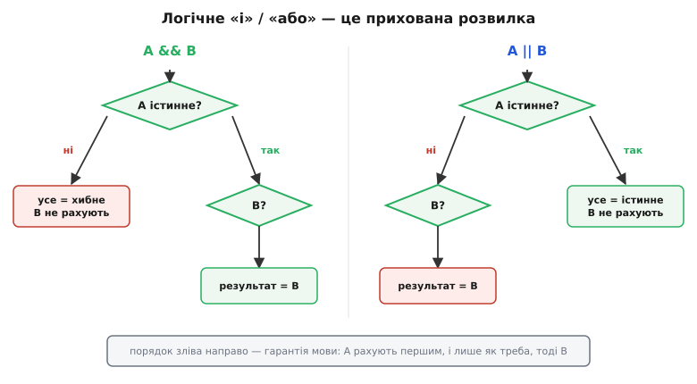
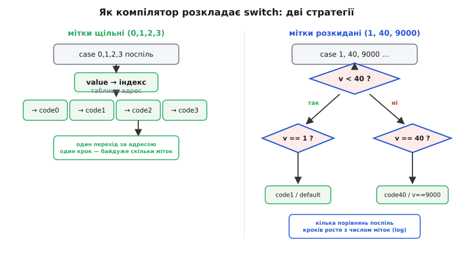
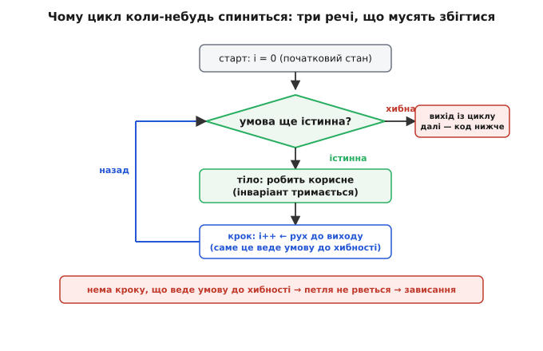

# Розгалуження й цикли — глибше

<preknowlist>
- [Переповнення й обгортання](root:sf-lang/overflow-wraparound) — беззнакове число після нуля стає не мінус-одиницею, а величезним; на цьому й ламаються умови виходу з циклів на лічильниках і робота з `millis()`.
</preknowlist>

У базовому кроці ми навчилися гнути пряму лінію виконання двома способами: **розгалуження** дає вибір, **цикл** дає повтор, а їхня спілка в суперциклі оживляє пристрій. Ми взяли ці конструкції як готові інструменти й навчилися ними користуватися. Тепер розберімо їх до дна: **що саме компілятор робить із ними внизу**, як поводяться межові випадки, звідки беруться найтонші вади й чому саме такі, а не інші, правила виявилися єдино безпечними. Мета проста — щоб, дивлячись на будь-який `if`, `switch` чи цикл, ви бачили не магічне слово мови, а точний механізм, чию поведінку можете передбачити на всіх вхідних даних, а не лише на тих, що спали на думку.

Нитку поведемо так само, як склали керування спочатку: спершу вглиб **умови** — що таке та правда/неправда фізично й де вона зраджує; тоді вглиб **розвилки** в усіх її подобах; тоді вглиб **циклу** й того, чому він завершується; і нарешті знову зберемо все в суперциклі, але цього разу з боку **часу** — бо саме час, а не логіка, ставить суперциклу природну межу.

## Умова — це число, і воно живе в регістрі прапорців

Почнімо з того, повз що базовий крок пройшов одним рядком: **у C немає окремого «логічного» світу**. Коли ви пишете `if (temperature < 20)`, процесор не оперує якимись особливими сутностями «правда» і «неправда». Він оперує **числами**. Вираз `temperature < 20` обчислюється в звичайне ціле — рівно `1`, коли менше, і рівно `0`, коли ні, — а `if` дивиться лише на одне: **нуль це чи не нуль**.

Щоб побачити це фізично, згадаймо, як [процесор виконує інструкції](root:hw-arch/fetch-decode-execute). У нього є особливий регістр — **регістр прапорців** (англ. *flags*, *status register*), кілька окремих бітів-ознак останньої арифметичної дії. Найважливіший для нас — **прапорець нуля** (англ. *zero flag*): він стає одиницею, якщо результат попередньої операції вийшов нульовий. Порівняння `a < b` на рівні заліза — це насправді **віднімання** `a − b`, виконане так, щоб не зберігати різницю, а лише виставити прапорці за її знаком і нульовістю. А `if` — це **умовний стрибок**, що дивиться на ці прапорці: «якщо прапорець нуля стоїть — стрибни через блок».

Ось чому правило C таке, яким є, а не інакшим. Мова не могла зробити «правду» чимось окремим від нуля, бо в залізі окремого нема — є лише «останній результат був нуль» проти «не нуль». C просто **виставила це апаратне розрізнення назовні** як своє означення істинності:

```c
0            // хибне  (єдине хибне значення)
будь-що ≠ 0  // істинне (1, 42, −7, 0x80, адреса — усе це «так»)
```

> 🔧 **Навіщо це.** У прошивці ви весь час читаєте регістри периферії, де сенс несе **один біт** усередині байта. `if (STATUS & TX_DONE)` не порівнює ні з чим — воно накладає маску й перевіряє, чи вийшло **ненульове** число, тобто чи стоїть біт. Розуміти, що `if` перевіряє «не-нуль», а не якесь абстрактне «істинно», — це те, що дозволяє писати такі перевірки прямо, без зайвого `== TX_DONE`, і читати чужий драйвер, де так пишуть завжди.

Звідси одразу випливає перша тонка пастка, якої базовий крок торкнувся лише краєм. Раз істинне — це «не нуль», то `if (x)` для цілого `x` спитає «чи `x` не дорівнює нулю». Але що, коли `x` — це `float`? Дробові числа мають підступність: значення `0.1 + 0.2` в двійковій комі **не дорівнює** рівно `0.3`, а різниця двох майже рівних дробів може бути крихітною, але **не абсолютним нулем**. Тому перевіряти дробове на рівність нулю через `if (!x)` — небезпечно: воно скаже «нуль» лише при точному бітовому нулі, а «майже нуль» пропустить як істину. Дробові порівнюють не з нулем, а з **малим порогом**: `if (fabsf(x) < 1e-6f)`. Це вже наслідок того, як улаштована [плаваюча кома](root:hw-arch/floating-point) — вона зберігає числа наближено, і рівність там майже завжди оманлива.

### Тип `bool`: домовленість поверх нуля

Раз істинність — це просто «не нуль», навіщо взагалі тип `bool`, який ми бачили у [змінних і типах](root:embedded/c-variables-types)? Історично його **не було**: у K&R-C 1978 року писали `int flag = 1;` і поводилися з ним як з ознакою. Окремий тип завезли аж стандартом C99 — під внутрішньою назвою `_Bool`, а звичне `bool`, `true`, `false` дав заголовок `<stdbool.h>`. Це не косметика. `bool` — це тип, який **нормалізує** будь-яке присвоєне значення до рівно `0` або рівно `1`:

```c
bool ok = 42;      // ok стане рівно 1 (не 42!) — нормалізація
bool no = 0;       // no  стане рівно 0
int  n  = 42;
if (ok == n) { … } // ХИБНО: 1 == 42 — неправда, хоч обидва «істинні»
```

Останній рядок — типова пастка новачка. `bool` каже вам «істинно/хибно», але порівнювати його **з числом** через `==` не можна: `true` це `1`, а не «будь-що ненульове». Тому правило одне: `bool`-значення перевіряють **самим фактом** — `if (ok)`, — а не зрівнюють із `true`. Порівняння `if (ok == true)` не лише зайве, а й крихке рівно з цієї причини.

## Оператори порівняння: де ховається знак

Шість операторів порівняння базовий крок перелічив. Тепер придивімося до того, про що він змовчав, бо це джерело вад, які не видно оком і які не ловить компілятор: **порівняння знакового з беззнаковим**.

Пригадаймо з [типів](root:embedded/c-variables-types), що ціле буває **знакове** (`int8_t`, від −128 до 127) і **беззнакове** (`uint8_t`, від 0 до 255). Ті самі вісім бітів, різне тлумачення старшого біта. І ось коли в одному порівнянні зустрічаються знакове й беззнакове, C застосовує **приховане перетворення** за своїми правилами (вони звуться «звичайні арифметичні перетворення»): знакове мовчки стає беззнаковим. Наслідок буває разючий:

**Умова, що бреше через знак.** Порівнюємо знакове −1 із беззнаковою одиницею.

```c
int8_t   a = -1;        // знакове: мінус один
uint8_t  b = 1;         // беззнакове: один
if (a < b) {            // здається очевидним: −1 < 1, тобто ІСТИНА?
    // …
}
```

Здоровий глузд каже: −1 менше за 1, гілка спрацює. А тепер простежмо, що зробить машина. Перед порівнянням обидва підтягуються до спільного типу; за правилами тут перемагає беззнаковість. Бітовий образ −1 у восьми бітах — це `0b11111111`. Прочитаний **як беззнакове**, цей самий образ означає не −1, а `255`. Тож фактично порівнюється `255 < 1` — і це **хибно**. Гілка `if` **не спрацює**, усупереч будь-якій інтуїції. Компілятор такий код здебільшого пропустить мовчки або кине непримітне попередження.

Це не крайова екзотика. У прошивці лічильники, розміри, індекси часто беззнакові (бо від'ємних розмірів не буває), а різниці й дельти — знакові. Класична вада: `for (unsigned i = n; i >= 0; i--)` — цикл, що **ніколи не скінчиться**, бо беззнакове `i` після нуля не стає −1, а [обгортається](root:sf-lang/overflow-wraparound) в максимум, і умова `i >= 0` істинна **завжди**. Тому правило: **не змішуйте знакове з беззнаковим в одному порівнянні**; якщо мусите — приведіть обидва до одного типу явно, щоб самому вирішити, як тлумачити біти, а не віддавати це мовчазному правилу мови.

## Логічні оператори — це насправді розгалуження

Тепер найкрасивіше про умови, і те, що базовий крок сховав за словом «зшивають». Оператори `&&` і `||` — це **не арифметика над двома вже готовими значеннями**. Це самі по собі маленькі розвилки, вбудовані в обчислення виразу. Вони працюють за правилом **короткого замикання** (англ. *short-circuit evaluation*), і це правило — не оптимізація компілятора, а **гарантія стандарту мови**.

Розгорнімо, що воно означає. Візьмімо `A && B`. Логіка «і» дає правду, лише коли **обидві** сторони правдиві. Але помітьте: якщо `A` вже хибне, то результат **однозначно хибний**, хай яке `B`. Отже, `B` рахувати **не треба** — відповідь уже відома. Стандарт C це не просто дозволяє, а **зобов'язує**: у `A && B` спочатку повністю обчислюється `A` (з усіма його побічними діями), і **лише якщо** `A` вийшло істинним, обчислюється `B`. Дзеркально для `A || B`: логіка «або» дає правду, коли **хоч одна** сторона правдива; тож якщо `A` вже істинне, результат однозначно істинний і `B` **не обчислюється**.


*Логічні `&&` і `||` — це приховані розвилки всередині виразу. Ліва сторона обчислюється завжди й першою; права — лише коли ліва не визначила відповідь сама. Порядок «зліва направо» — гарантія мови, а не примха компілятора, тож на нього можна спиратися.*

Це докорінно міняє те, як логічні оператори читати. Вони не симетричні: `A && B` — це **не те саме**, що `B && A`, коли обчислення однієї зі сторін щось **робить** або може впасти. І ось де це рятує:

**Захист від читання за неіснуючою адресою.** Спершу перевіряємо, що покажчик не порожній, і **лише тоді** читаємо за ним.

```c
if (sensor != NULL && sensor->value > LIMIT) {
    alarm();
}
```

Простежмо, чому порядок тут — питання виживання. Якщо `sensor` порожній (`NULL`), ліва сторона `sensor != NULL` хибна. За коротким замиканням права сторона `sensor->value > LIMIT` **навіть не обчислюється** — а значить, звертання за порожнім покажчиком **не відбувається**. Якби оператор рахував обидві сторони завжди (як робить побітове `&`), то `sensor->value` спробувало б прочитати пам'ять за адресою `NULL`, і на мікроконтролері це або віддало б сміття, або спричинило б апаратний виняток. Порядок операндів тут — не стиль, а щит: **спершу перевір, тоді торкайся**. Переставте сторони місцями — і щит зникне.

> 🔧 **Навіщо це.** У прошивці цим щитом ви користуєтесь постійно: `if (buf_len > 0 && buf[0] == START_BYTE)` не чіпає порожній буфер; `if (i < COUNT && table[i].valid)` не виходить за межі масиву. Ба більше, короткому замиканню можна доручати й саму дію: `ok = init_uart() && init_spi() && init_i2c();` запустить кожен наступний, лише якщо попередній удався, і зупиниться на першій невдачі. Логічний оператор тут — компактний спосіб записати «роби по черзі, доки все гаразд».

### Заперечення й закони де Моргана

Оператор `!` перевертає істинність, і базовий крок цим обмежився. Але з ним пов'язана дрібниця, що псує чимало умов, — і одразу її протиотрута. Часто треба заперечити **складену** умову, і тут спрацьовує та сама [булева алгебра](root:math-logic/boolean-algebra), закони **де Моргана**. Заперечення «і» — це «або» заперечень, і навпаки:

```
!(A && B)  ⇄  !A || !B      // «не (обидва)» = «хоч одне не»
!(A || B)  ⇄  !A && !B      // «не (хоч одне)» = «жодне не»
```

Практична вага цього ось у чому. Скажімо, «продовжувати, доки давач у робочому діапазоні» — це `while (t >= LO && t <= HI)`. А умова **виходу** з такого циклу (те, що робить `while` хибним) — це заперечення: `!(t >= LO && t <= HI)`, тобто за де Морганом `t < LO || t > HI`. Коли ви подумки шукаєте «за яких умов цикл спиниться», ви щоразу застосовуєте цей закон. Не тримати його в голові — значить помилятися в межах: писати `t < LO && t > HI` (що не істинне ніколи) там, де треба `||`. Заперечення складеної умови майже завжди міняє `&&` на `||` — це перше, що варто перевірити, коли умова «начебто правильна, а поводиться дивно».

## Пастка `=` проти `==`: чому це взагалі можливо

Базовий крок назвав цей капкан і дав захист «стала ліворуч». Тепер розберімо **чому** мова взагалі дозволяє таку описку компілюватися — бо без цього захист виглядає як забобон, а він має точну причину.

Корінь у тому, що згадувалося у [змінних і типах](root:embedded/c-variables-types): у C **присвоєння саме є виразом**, і його значення — те, що присвоїли. Це не примха, а свідоме рішення, яке дає корисне: можна писати `a = b = c = 0;` (усім трьом нуль) або `while ((c = getchar()) != EOF)` (прочитати й одразу перевірити). Але та сама властивість робить `if (x = 0)` **синтаксично законним**: це «поклади 0 у `x`, потім візьми результат присвоєння (нуль) як умову». Компілятор не бачить помилки — код граматично бездоганний, просто робить не те, що гадав автор.

Простежмо обидва отруйні випадки до кінця:

```c
if (x = 0) { … }   // присвоїли 0; умова = 0 → хибна ЗАВЖДИ; гілка мертва; x зіпсовано
if (x = 5) { … }   // присвоїли 5; умова = 5 → істинна ЗАВЖДИ; гілка спрацьовує щоразу; x зіпсовано
```

Обидва — тихі вбивці: код збирається, запускається, але поводиться геть не так, а `x` мовчки затерто. Тепер видно, чому захист працює. Прийом «сталу ліворуч» — `if (0 == x)` — спирається на **несиметричність** присвоєння: присвоїти можна **лише змінній**, зліва від `=` мусить стояти щось, куди можна писати. Стала `0` таким бути не може. Тож якщо ви за звичкою пишете сталу зліва й випадково ставите одинарне `=`, виходить `if (0 = x)` — «присвоїти в число 0», а це вже **помилка компіляції**, і машина спіймає описку замість вас. Сучасні компілятори до того ж кидають попередження на `if (x = 5)` (у gcc/clang це `-Wparentheses`), і його варто вмикати як помилку — тоді захист не потрібен, бо ловить сам інструмент.

## Розвилка вглиб: вкладеність, `else` і висячий `else`

Ланцюжок `else if` базовий крок показав як спосіб поділити числову вісь на смуги. Додам механізм, який там лишився неявним, і одну класичну неоднозначність.

Насамперед: `else if` — це **не окрема конструкція мови**. Це просто `else`, за яким іде ще один `if`. Мова дозволяє після `else` поставити будь-яку одну інструкцію, а `if` — це інструкція; коли її пишуть без обгортання в новий рівень відступу, око бачить «драбинку», хоча синтаксично це вкладені одна в одну розвилки. Тому й порядок такий строгий: кожен наступний `if` живе **всередині** `else` попереднього, тобто дійде до нього тільки той потік, що не збігся з усіма верхніми умовами. Звідси й береться те, що ми бачили: перевіряючи `temp < 25`, ми **вже точно знаємо** `temp >= 10`.

Тепер неоднозначність, яку мусить знати кожен, — **висячий `else`** (англ. *dangling else*). До якого `if` пристане `else`, коли їх два, а `else` один?

```c
if (a)
    if (b)
        foo();
else            // до ЯКОГО if цей else? до if(a) чи if(b)?
    bar();
```

Відступ підказує оку, що `else` належить до `if (a)`. Але C відступів не бачить — для неї є жорстке правило: **`else` завжди пристає до найближчого попереднього `if` без свого `else`**. Тобто насправді цей `else` належить до `if (b)`, а не до `if (a)`, як натякає відступ. Виконання розійдеться з тим, що показує форматування, — і це буде вада, яку оком не знайти. Протиотрута радикально проста й тому обов'язкова: **завжди ставте фігурні дужки** навколо тіла `if`, навіть коли воно з одного рядка. З дужками неоднозначність зникає фізично:

```c
if (a) {
    if (b) {
        foo();
    }
} else {        // тепер однозначно: else від if(a)
    bar();
}
```

Це та сама причина, з якої в поважних стилях коду (зокрема в ядрі Linux і в MISRA-C для прошивок) одинарні `if` без дужок просто заборонені: вони економлять два символи ціною цілого класу невидимих вад.

## `switch` вглиб: як він насправді працює внизу

Ось де детальний крок дає найбільше понад базовий. `switch` там подано як «стрілку на залізниці». Тепер побачмо саму стрілку — **у що компілятор перекладає `switch`**, бо це пояснює і його швидкість, і його дивацтва разом.

`switch` існує тому, що серія `if (x==A) … else if (x==B) …` для десятків значень і повільна (перевіряй по черзі), і незручна. Компілятор має для `switch` **дві принципово різні стратегії**, і вибирає між ними за тим, **як розташовані мітки `case`**.

Коли мітки **щільні й майже поспіль** (`case 0, 1, 2, 3, …`), компілятор будує **таблицю переходів** (англ. *jump table*): масив адрес, де за індексом `value` лежить адреса потрібного `case`. Тоді `switch` виконується за **один крок**, скільки б не було міток: узяв значення як індекс, дістав адресу, стрибнув. Це та сама апаратна операція «стрибни на адресу з набору інструкцій», тільки адресу беруть не з коду, а з таблиці. Час не залежить від числа міток — і десять, і тисяча гілок коштують однаково.

Коли ж мітки **розкидані** (`case 1, 40, 9000`), таблиця стала б безглуздо велика — під дев'ять тисяч комірок заради трьох гілок. Тому компілятор натомість будує **дерево порівнянь**: замість лінійного перебору він ділить діапазон навпіл (`v < 40?`), тоді ще навпіл, — двійковий пошук по мітках. Час росте не лінійно з числом гілок, а **логарифмічно**: тисяча міток — близько десяти порівнянь, а не тисячі. За даними компіляторів, gcc для таких випадків будує збалансовані дерева порівнянь, а llvm — двійкові дерева пошуку; деталі різняться, суть одна.


*Дві стратегії, які компілятор обирає сам за розташуванням міток. Щільні мітки — таблиця переходів: один стрибок за адресою, стала швидкість. Розкидані мітки — дерево порівнянь: логарифмічно мало кроків. Тому `switch` для скінченного автомата на послідовних станах — не просто читабельніший за `if`-драбинку, а й швидший.*

> 🔧 **Навіщо це.** Прошивка суцільно тримається на скінченних автоматах: розбір команд по UART, стан зарядки батареї, фази протоколу. Стани нумерують поспіль саме тому, що тоді `switch` за ними лягає в таблицю переходів — реакція на команду стала й швидка, критично для обробників, де кожна мікросекунда на рахунку. Знати, що щільні мітки дають таблицю, — привід нумерувати стани `0,1,2,…` замість випадкових констант: ви прямо впливаєте на те, як швидко ваш автомат перемикатиметься.

### Провал крізь `case` і чому він такий

Пастку `fall-through` базовий крок назвав. Тепер її **причина**, бо без неї правило «не забувай `break`» — знову забобон. `switch` під капотом — це **стрибок на адресу потрібного `case`**, і тільки. Мітка `case` — це не «початок окремого блоку», а просто **точка входу**, куди стрибнути. А що робити далі — у мові не закладено: потік просто виконує інструкції підряд, як усюди. Тому, дійшовши до кінця одного `case`, він **не знає**, що треба спинитися, — він тече в наступний, бо той фізично лежить нижче. `break` — це **явна команда «вистрибни зі `switch`»**; без неї виходу немає.

Отже, провал — не вада мови, а прямий наслідок того, що `switch` — це «стрибок + послідовне виконання». І з цього ж випливає, коли провал **корисний**: якщо кілька значень мають спільну дію, їхні мітки ставлять поспіль **без коду між ними**, і потік навмисне протікає до спільного тіла:

```c
switch (key) {
    case '0': case '1': case '2': case '3': case '4':
    case '5': case '6': case '7': case '8': case '9':
        handle_digit(key);   // сюди «протікають» усі десять міток-цифр
        break;
    case '\n':
    case '\r':
        submit();            // і Enter, і повернення каретки — те саме
        break;
    default:
        beep_error();
}
```

Щоб відрізнити **навмисний** провал від **забутого** `break`, у сучасному C прийнято позначати перший явно — коментарем `/* fall through */` або атрибутом `[[fallthrough]];`. Тоді компілятор із `-Wimplicit-fallthrough` попередить лише про **ненавмисний** провал, а помічений пропустить. Це перетворює «пам'ятай про `break`» із поради на перевірку, яку робить машина.

### Область видимості всередині `case`

Ще одна тонкість, на якій спотикаються й досвідчені. Усі `case` одного `switch` живуть в **одному спільному блоці** — тому оголосити змінну прямо під міткою й дати їй значення не можна коректно:

```c
switch (state) {
    case A:
        int x = compute();   // ПОМИЛКА/попередження: оголошення «перестрибується»
        use(x);
        break;
    case B:
        use(x);              // x тут «видно», але воно НЕ ініціалізоване — сміття
        break;
}
```

Причина знову в тому, що `switch` — це стрибок. Стрибнувши прямо на `case B`, потік **перестрибнув** рядок `int x = compute();` — оголошення відбулося (компілятор відвів місце), а **присвоєння ні**. Тож у `case B` змінна `x` існує, але містить [сміття](root:embedded/c-variables-types) — ті біти, що випадково лежали в комірці. Протиотрута — **власний блок на `case`**, що обмежує змінну своєю гілкою:

```c
switch (state) {
    case A: {                // фігурні дужки роблять окремий блок
        int x = compute();   // x живе тільки тут — стрибнути повз нього не можна
        use(x);
        break;
    }
    case B:
        do_b();
        break;
}
```

## Три форми циклу: повне виведення межових випадків

Базовий крок сказав головне: усі три форми різняться лише **місцем перевірки** відносно тіла. Тепер виведемо з цього **точну поведінку кожної на межах** — на нулі проходів, на одному, на переповненні лічильника, — бо саме на межах цикли й ламаються.

Спільний кістяк усіх трьох — це розвилка з петлею назад. Але точний порядок «перевірка → тіло → крок → назад» визначає три різні характери.

**`while` — перевірка перед тілом. Може не виконатися жодного разу.** Це його визначальна риса, і вона потрібна саме тоді, коли «нуль проходів» — законний результат:

```c
while (rx_available()) {        // якщо буфер порожній ще на вході —
    uint8_t b = rx_read();      // сюди не зайдемо жодного разу
    process(b);
}
```

Якщо на вході в буфері нічого нема, `rx_available()` хибне одразу, тіло не спрацьовує — і це правильно: обробляти нема чого. `while` природний для «оброби все, що є, можливо нічого».

**`do…while` — перевірка після тіла. Виконається щонайменше раз.** Дзеркальний випадок: коли дію треба зробити **хоч раз безумовно**, а вже тоді вирішувати про повтор:

```c
uint8_t byte;
do {
    byte = i2c_read();          // хоча б один байт прочитати треба завжди
    store(byte);
} while (byte != STOP_MARKER);  // і повторювати, доки не натрапимо на маркер кінця
```

Тут перший вимір треба зробити **до** того, як з'явиться що перевіряти, — тому перевірка стоїть **після** тіла. Поставте тут `while` з тією ж умовою — і на першій ітерації `byte` ще не прочитано, перевіряти нема чого. `do…while` — рідший гість, але незамінний, коли «нуль проходів» був би вадою.

**`for` — три частини на очах. Причесаний `while` для лічених повторів.** Розкладімо його дослівно, бо порядок виконання частин — не той, що порядок їх запису:

```c
for (int i = 0; i < 16; i++) {
    read_sensor(i);
}
//   ┌ init ──┐  один раз перед усім:            int i = 0
//            ┌ cond ┐ перед КОЖНИМ проходом:    i < 16   → хибне? вихід
//                     тіло:                     read_sensor(i)
//                   ┌ step ┐ після КОЖНОГО тіла: i++     → назад до cond
```

Тобто справжня послідовність — **init, тоді (cond → тіло → step) по колу**. Крок `i++` виконується **не** одразу після init, а **після тіла**, перед наступною перевіркою. Ця дрібниця пояснює, чому в межах `for (int i=0; i<16; i++)` тіло бачить `i` від 0 до 15 включно, а не до 16: щойно `i` доросло до 16, перевірка `i < 16` хибна й тіло вже не виконується.

Варто знати й **історичне** обмеження, бо воно досі спливає в старих проєктах. Оголошувати змінну прямо в `for (int i = 0; …)` дозволили лише стандартом **C99**. У давнішому C89 лічильник мусив бути оголошений заздалегідь, на початку блоку: `int i; for (i = 0; …)`. Тому старий компілятор у режимі C89 на `for (int i…)` видасть помилку «for loop initial declarations are allowed only in C99 mode» — і в дуже консервативних прошивках лічильники досі оголошують окремо. У нашому коді ми пишемо по-сучасному, у стилі C99, де змінна живе рівно в межах свого циклу.


*Анатомія завершення циклу. Три речі мусять зійтися: правильний **старт**, **перевірка**, що колись стане хибною, і — головне — **крок**, який на кожному оберті **наближає умову до хибності**. У `for` цей крок стоїть на видноті третьою частиною; у `while` за нього відповідає тіло, і саме там, де крок губиться, зароджуються нескінченні цикли.*

### Чому цикл завершується: інваріант і рух до виходу

Базовий крок дав золоте правило: «що саме тут наближає умову до виходу — і чи справді воно спрацює за всіх вхідних даних?» Тепер розгорнімо це в **спосіб думати**, яким користуються, коли цикл складніший за перебір.

Правильність будь-якого циклу тримається на двох речах. Перша — **інваріант циклу** (лат. *invariāns* — незмінний): твердження, істинне **перед кожною** перевіркою умови, хай на якому ми оберті. Друга — **міра просування**: величина, що на кожному оберті **невідворотно** рухається до значення, за якого умова стане хибною. Інваріант каже «тіло не псує того, на що ми спираємось»; міра просування каже «ми таки дійдемо до виходу». Розберімо на конкретному:

**Знайти індекс першого значення понад поріг.** Проходимо масив, шукаючи перший елемент, більший за межу.

```c
int find_first_over(const uint16_t *a, int n, uint16_t limit) {
    for (int i = 0; i < n; i++) {     // міра просування: i росте до n
        if (a[i] > limit) {
            return i;                 // знайшли — виходимо одразу
        }
    }
    return -1;                        // дійшли до кінця, не знайшовши
}
```

Простежмо обидві опори. **Інваріант**: перед кожною перевіркою `i < n` істинно, що «серед елементів `a[0..i-1]` жоден не перевищив `limit`» — інакше ми б уже вийшли через `return i`. Цей інваріант тримається, бо тіло або виходить, або нічого не міняє в уже пройденому. **Міра просування**: `i` збільшується на кожному оберті й обмежене згори числом `n`; отже, цикл **мусить** або натрапити на елемент і вийти раніше, або дійти до `i == n` і вийти через `return -1`. Нескінченним він бути не може: `i` не має куди рости вічно в межах `0..n`. Ось цей подвійний облік — «що зберігається» і «що невідворотно рухається до виходу» — і є те, чим перевіряють цикл, не запускаючи його.

Тепер зіставмо з класичною вадою, і вона стане очевидною:

```c
int i = 0;
while (i < 10) {
    read_sensor(i);
    // немає i++ — міри просування НЕ ІСНУЄ
}
```

Тут інваріант є, а **міри просування немає**: жодна величина не рухається до того, щоб `i < 10` стало хибним. Тому цикл не рветься ніколи. Побачити це — не «помітити описку», а виявити відсутність **обов'язкового складника**: у кожному циклі мусить бути щось, що невідворотно веде умову до виходу. Немає такого — цикл дефектний, хай як гарно виглядає.

## `break`, `continue` і єдиний виправданий `goto`

Два оператори точного керування зсередини тіла базовий крок показав. Додам, чого там бракувало для реальної прошивки: **як вони поводяться у вкладених циклах** — і де тут єдине місце, куди повертається вигнаний `goto`.

`break` виходить **лише з одного** циклу — найближчого, що його оточує. `continue` пропускає решту тіла й переходить до **кроку** найближчого циклу (у `for` — виконує `i++`, у `while` — вертається до перевірки). Тонкість `continue` у `while` варто закарбувати:

```c
int i = 0;
while (i < n) {
    if (skip(i)) continue;   // ПАСТКА: перестрибнули i++ → i застигло → зависання
    process(i);
    i++;
}
```

У `while` крок робить **тіло**, і `continue` його **перестрибує** — `i` не збільшується, умова застигає, цикл вічний. У `for` такої пастки нема: `continue` там завжди виконає `i++`, бо крок — окрема частина `for`, а не рядок тіла. Це ще один доказ, чому для лічених повторів беруть `for`: крок у ньому `continue` не омине.

Тепер про вкладеність. `break` з внутрішнього циклу виходить **тільки** з нього, а зовнішній крутиться далі. Часто ж треба вискочити з **обох** одразу — наприклад, знайшовши елемент у двовимірному масиві. Наївний спосіб — завести прапорець:

```c
bool found = false;
for (int r = 0; r < ROWS && !found; r++) {
    for (int c = 0; c < COLS; c++) {
        if (grid[r][c] == target) {
            found = true;
            break;              // виходить лише з внутрішнього
        }
    }
}
```

Працює, але громіздко: зайва змінна, зайва умова в зовнішньому `for`, зайва думка. І ось те єдине місце, де `goto`, вигнаний [структурним програмуванням](root:embedded/c-control-flow/hist-structured-programming.md), повертається як **чистіше** рішення. Пригадаймо: у тій історії ми бачили, що `goto` прибрали не тому, що він завжди поганий, а тому, що вільні стрибки плодять спагеті; сам Кнут відзначав, що для аварійного виходу з кількох вкладених циклів `goto` дає прозоріший код. Це рівно той випадок:

```c
for (int r = 0; r < ROWS; r++) {
    for (int c = 0; c < COLS; c++) {
        if (grid[r][c] == target) {
            goto found;          // один стрибок УПЕРЕД, з обох циклів разом
        }
    }
}
found:
    handle(r, c);
```

Тут `goto` стрибає **вперед і назовні** на одну мітку — це не спагеті, а строго структурований аварійний вихід, який читається легше за прапорцеву версію. Правило чітке: `goto` в C виправданий **лише** для виходу вперед із вкладених циклів чи для єдиної точки прибирання ресурсів (звідси поширений у драйверах взірець `goto cleanup;`). Стрибати `goto` **назад** чи в довільне місце — та сама спагеті, від якої відмовилися, і тут вона так само неприпустима.

## Суперцикл вглиб: коли ворог не логіка, а час

Ми повертаємось до суперциклу — того навмисного нескінченного циклу, що є кістяком прошивки. Базовий крок пояснив, **чому** він нескінченний: мікроконтролеру нема куди «завершитися», під ним нема ОС. Тепер розберімо його з боку, який там лишився за дужками, — з боку **часу**, бо саме час ставить суперциклу межу й диктує, як його писати правильно.

Пригадаймо форму: одноразове налаштування, тоді `while (1)`, у якому кожен оберт — «зчитати входи, вирішити, подіяти». Уся керувальна логіка — це **повтор** (сам цикл) із **розгалуженнями** всередині (ті `if`-и, що розводять поведінку за станом). Дві прості цеглини, а виходить жива машина. Але придивімося до одного оберту в **часі**.

Кожен оберт суперциклу триває стільки, скільки триває **найдовша** дія в ньому. І тут криється тиха біда, якої немає в логіці, але яка вбиває чуйність. Уявімо оберт, де серед іншого є `delay_ms(200)` — пасивне очікування:

```c
while (1) {
    read_buttons();       // 1 мкс
    update_display();     // 2 мс
    delay_ms(200);        // 200 мс — процесор просто стоїть і чекає
    blink_led();          // 1 мкс
}
```

Простежмо, що це означає для реакції на кнопку. Поки процесор стоїть у `delay_ms(200)`, він **нічого не читає** — ні кнопок, ні давачів. Натиснули кнопку в цей момент — прошивка помітить її **аж за 200 мс**, коли делей скінчиться й коло дійде до `read_buttons()`. Пристрій здається «гальмівним», хоча процесор здатен на мільйони операцій за ту саму п'ятину секунди — він їх просто **проспав** у делеї. Проблема не в тому, що коду забагато, а в тому, що одна дія **захопила час** усіх інших. Це вроджена межа суперциклу: усе робиться **по черзі**, тож повільна дія затримує решту.

> 🔧 **Навіщо це.** «Пристрій підвисає на секунду при оновленні екрана», «кнопка спрацьовує не одразу», «світлодіод блимає нерівно» — це майже завжди одне: у суперциклі завелася **блокувальна** дія, що з'їдає час кола. Перше вміння вбудованого програміста — навчитися **не блокувати**: замість `delay_ms` дивитися на годинник і робити дію, коли час настав, а між тим крутити коло далі. Тоді пристрій лишається чуйним, скільки б справ не було.

### Від блокувального делею до неблокувального часу

Ліки від блокування — не спати, а **звірятися з годинником**. Замість «стій 200 мс» кажемо «якщо від минулого разу минуло 200 мс — зроби й запам'ятай, коли зробив». Різниця докорінна: у першому разі процесор **стоїть**, у другому — **пролітає коло далі**, лише зрідка виконуючи дію, коли настав її час.

```c
uint32_t last_blink = 0;
while (1) {
    read_buttons();                       // тепер читається на КОЖНОМУ оберті
    update_display();

    uint32_t now = millis();              // скільки мілісекунд від старту
    if (now - last_blink >= 200) {        // минуло 200 мс від минулого блимання?
        blink_led();
        last_blink = now;                 // запам'ятали момент цього блимання
    }
    // коло не стоїть — воно летить, реагуючи на кнопки безперервно
}
```

Тут `if (now - last_blink >= 200)` — це та сама розвилка, тільки її умова питає **час**, а не давач. Коло крутиться вільно, кнопки читаються щомиті, а блимання стається рівно раз на 200 мс — і все це без жодного «стій». Ця техніка — **неблокувальний час** — виростає прямо з розгалуження над годинником, і вона настільки центральна для прошивки, що ми присвятимо їй окремий крок; тут важливо побачити її **корінь**: це `if` над лічильником часу замість пасивного делею. Дрібна деталь `now - last_blink` (а не `now >= last_blink + 200`) невипадкова — вона стійка до [обгортання лічильника](root:sf-lang/overflow-wraparound), коли `millis()` дійде до краю й почне з нуля; але це вже подробиця, до якої ми повернемось у [неблокуючому часі](root:sf-devices/nonblocking-time).

І ще один страх, що ховається в суперциклі, — **очікування апаратної події**, яке базовий крок згадав про `while (!flag)`. Розгорнімо загрозу до кінця. Такий рядок каже «крутися тут, доки залізо не виставить прапорець». А що, як залізо через несправність **ніколи** його не виставить? Тоді прошивка застрягає тут навіки — не бо в коді помилка, а бо **зовнішній світ не дотримав обіцянки**. Логіка циклу бездоганна; винен давач, що завис. Тому такі очікування ніколи не лишають голими — їх страхують межею терпіння:

```c
uint32_t start = millis();
while (!data_ready()) {
    if (millis() - start > TIMEOUT_MS) {   // терпіли досить — далі щось не так
        return ERR_TIMEOUT;                // виходимо з ознакою помилки
    }
}
value = read_data();                       // сюди — лише якщо дочекалися вчасно
```

Тепер цикл має **дві** причини завершитися: або подія настала (`data_ready()` стало істинним), або вичерпалося терпіння (тайм-аут). Друга умова — це знову розвилка, вбудована в тіло, і саме вона перетворює «зависну назавжди» на «здамся й повідомлю». А коли й тайм-аута мало — коли підвиснути може сам головний цикл цілком, — на варті стоїть окремий [сторожовий таймер](root:sf-devices/watchdog): він перезавантажить систему, якщо коло надто довго не подає ознак життя. Обидва щити виростають з однієї думки: **нескінченне очікування мусить мати запобіжник**, бо світ ненадійний.

### Куди росте суперцикл

Наприкінці варто чесно показати межу й те, що за нею, — бо суперцикл не вершина, а фундамент. Його вроджена вада, яку ми щойно бачили, — послідовність: одна повільна дія затримує всі. Доки завдань мало й вони поступливі, неблокувального часу досить — коло встигає обійти всіх. Але коли справ багато й одні критичніші за інші (мотор мусить реагувати за мікросекунди, а екран може й зачекати), рівномірне коло вже не рятує: критична справа однаково чекає своєї черги за некритичною.

Тоді суперцикл переростає в одне з двох. Або в **керування за перериваннями**: залізо саме смикає процесор, щойно стається важлива подія, і той кидає коло, щоб її обробити, — реакція стає майже миттєвою незалежно від довжини кола. Або в невеличку **операційну систему реального часу**, що розподіляє час між кількома паралельними «нитками» за пріоритетом. Але — і це головне — обидва ці поверхи **не скасовують** того, що ми склали. Усередині кожного обробника переривання, усередині кожної нитки ОС так само живуть `if`-и й цикли; сам планувальник ОС — це теж цикл із розвилками. Три цеглини нікуди не діваються; над ними лише надбудовують спосіб **ділити час** справедливіше.

Отож ми пройшли керування потоком до дна. Умова виявилася числом у регістрі прапорців, і на її знаковості та дробовості чигали тихі вади. Розвилка розгорнулась у таблиці переходів і дерева порівнянь, а її пастки — провал крізь `case`, висячий `else`, перестрибнуте оголошення — усі виявилися прямим наслідком того, що `switch` та `if` унизу — це стрибки. Цикл ми навчилися перевіряти, не запускаючи, — через інваріант і міру просування, — і побачили, що навіть вигнаний `goto` має одне чесне місце. А суперцикл повернувся до нас не з боку логіки, а з боку часу: його справжній ворог — блокування, а щити від нього (неблокувальний час, тайм-аут, сторож) — це все ті самі розвилки, тільки над годинником. Далі, коли ми навчимося різати код на іменовані [функції](root:embedded/c-functions), кожна з них усередині складатиметься рівно з цих трьох цеглин — інакшого способу керувати потоком просто немає.
