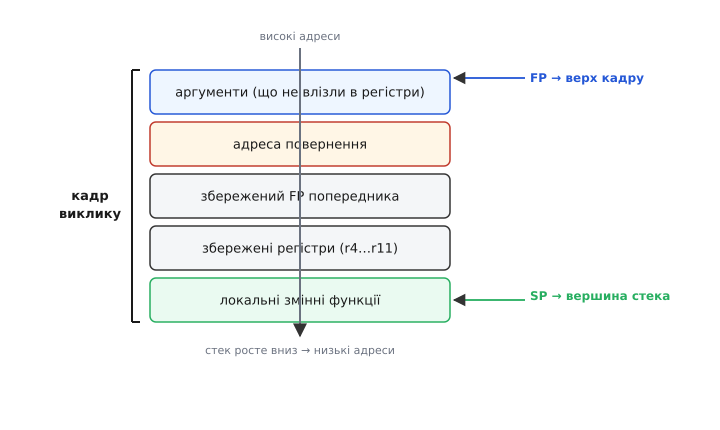
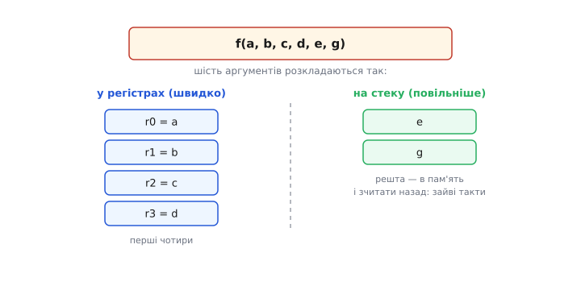
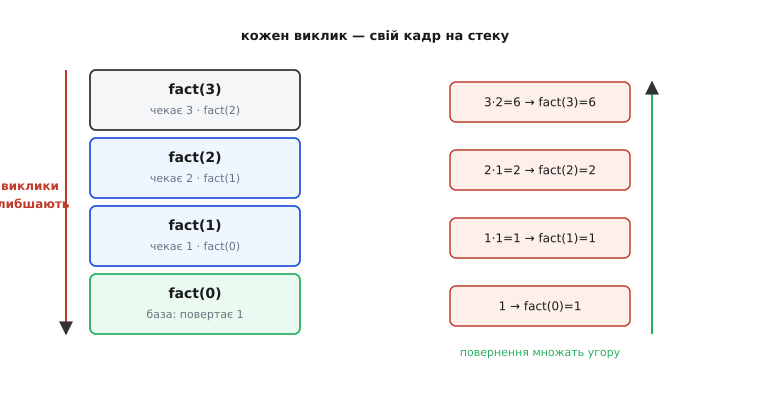
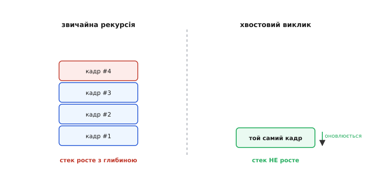

# Функції у глибину: що насправді робить процесор

<preknowlist>
- [Стек (LIFO)](topic:sf-lang/stack-lifo) — пам'ять, де останнє покладене знімається першим; на ній тримаються всі виклики й кадри.
- [Цілі типи в C](topic:sf-lang/integer-types-c) — розміри `int`, `char`, `short`, `long` у байтах: без цього не зрозуміти, що саме копіюється в аргумент.
- [Плаваюча кома](topic:hw-arch/floating-point) — як улаштований `float`/`double`; знадобиться у розмові про підвищення аргументів у `printf`.
</preknowlist>

У [базовому кроці про функції](root:embedded/c-functions) ми домовилися бачити функцію як **названий шматок роботи**: пишеш раз, кличеш іменем, передаєш **аргументи** в **параметри**, отримуєш назад **повернене значення**. Ми вже знаємо, що виклик — це «тимчасовий відхід убік і обов'язкове повернення на місце», що аргументи **копіюються**, а локальні змінні живуть на **стеку** рівно доти, доки функція працює. Цього достатньо, щоб писати робочий код. Але щойно прошивка стає серйозною — глибокі ланцюжки викликів, рекурсія, важкі структури, підрахунок кожного байта стека, — цих слів уже мало. Треба **розкрити чорну скриньку** й побачити, що процесор насправді робить за одним рядком `add(3, 4)`.

Бо саме тут ховаються найпідступніші баги embedded. Прошивка, що місяць працювала бездоганно, раптом падає в найглибшому вкладеному виклику — і причина в тому, **як** улаштований кадр на стеку. Функція, що приймає структуру «за значенням», непомітно копіює двісті байтів на кожному виклику в гарячому циклі — і ви дивуєтеся, чому все повзе. `printf("%f", x)` друкує сміття, бо ви не знали про одне тихе правило мови про аргументи. Усе це — не окремі дивацтва, а прямі наслідки одного механізму. Розберімо його до дна.

### Виклик — це насправді дві прості команди процесора

Почнімо з питання, яке в базовому кроці ми делікатно обійшли: **як** машина «стрибає всередину функції й повертається назад»? Ми казали — «разом із кадром на стек кладеться адреса повернення, записка, куди стрибнути». Це правда, але на сучасному ядрі ця «записка» найчастіше **навіть не потрапляє в пам'ять** — принаймні спершу.

Згадаймо, що процесор виконує програму, читаючи команди по черзі, і завжди тримає **лічильник команд** (*program counter*, PC) — адресу тієї команди, яку виконує зараз. «Стрибнути» — це просто записати в PC іншу адресу: наступною виконається команда вже звідти. Тепер уся хитрість виклику в одному: **перед стрибком запам'ятати, куди PC вказував би далі**, щоб потім туди вернутися.

На ядрі ARM Cortex-M (це серце більшості сучасних мікроконтролерів — від STM32 до [ESP32](root:embedded/esp32-family), хоча в ESP32 ядро інше, механізм той самий за суттю) виклик функції — це одна команда **`BL`** (*Branch with Link* — «розгалуження з запам'ятовуванням»). Вона робить рівно дві речі за один такт:

```
1. запиши адресу НАСТУПНОЇ команди в регістр LR (Link Register, r14)
2. запиши адресу функції в PC          ← стрибок усередину
```

Ось і весь «відхід убік». Адреса повернення сіла не в пам'ять, а в **спеціальний регістр LR** — надшвидку комірку прямо в ядрі. А повернення наприкінці функції — теж одна дія: узяти те, що лежить у LR, і записати назад у PC.

```
на початку:  BL  add        ; LR ← сюди+4 (наступний рядок), PC ← add
наприкінці:  BX  LR         ; PC ← LR  (повертаємось точно назад)
```

Порівняйте це зі [стрибком Вілера з історії теми](root:embedded/c-functions/hist-subroutine.md): у 1951 році адресу повернення доводилося **вписувати в тіло підпрограми вручну**, і код переписував сам себе. Сьогодні те саме робить одна апаратна команда `BL`, а «записка» лежить в окремому регістрі, недоторканна. Механізм, який Вілер винаходив як зухвалий трюк, тепер вбудований у кремній.

> 🔧 **Навіщо це.** Розуміння, що адреса повернення спершу лежить у **регістрі**, а не на стеку, пояснює одну реальну оптимізацію: **функція-листок** (*leaf function* — та, що не кличе нікого іншого) може взагалі не чіпати стек. Їй нема потреби зберігати LR у пам'ять, бо ніхто його не затре — усередині немає жодного `BL`, що переписав би LR. Тому дрібні листкові функції в C майже безкоштовні: жодного звертання до повільної пам'яті, сам стрибок і повернення. Це не абстрактна дрібниця — у гарячому циклі обробки давача різниця між «листок» і «не листок» видно на осцилографі.

### Коли адреса повернення таки лягає на стек

Проблема починається, щойно функція **сама когось кличе**. Уявіть: `main` кличе `outer`, а `outer` усередині кличе `inner`. Коли `main` кличе `outer`, команда `BL` кладе в LR адресу повернення в `main`. Але тепер `outer` виконує **свій** `BL inner` — і цей `BL` **перезаписує LR** адресою повернення в `outer`. Стара адреса (куди вертатися в `main`) щойно **загинула**.

Ось чому будь-яка не-листкова функція **першою ж дією зберігає LR на стек**, а останньою — дістає його звідти назад:

```c
void outer(void) {
    // компілятор на вході вставив: PUSH {LR}  — сховати адресу повернення
    inner();          // BL inner перепише LR — але наша копія в безпеці на стеку
    inner();          // можна кликати скільки завгодно
    // на виході: POP {PC} — дістати збережену адресу прямо в PC = повернення
}
```

Тепер стає видно, **звідки взагалі береться кадр на стеку** й чому глибина вкладення коштує пам'яті. Кожен рівень вкладених викликів мусить **зберегти свою адресу повернення**, бо спільний регістр LR один на всіх, а місць, куди вертатися, — стільки, скільки викликів у ланцюжку. Стек — це і є те місце, де ці адреси чекають своєї черги, складені стосом. «Останнім поклав — першим зняв» тут не випадкове: найглибший виклик завершується першим і першим забирає свою адресу.

### Анатомія кадру: що саме лежить у ділянці функції

У базовому кроці кадр був «тарілкою під локальні змінні». Розкриймо тарілку. Кадр (*stack frame*, ще кажуть *activation record* — «запис активації», бо він оживає на час, поки функція активна) — це неперервна ділянка стека, і в ній за строгим порядком лежить усе, що функції треба, щоб працювати й коректно повернутися:


*Один кадр — це не просто «місце під змінні». Згори (з боку високих адрес) лежать аргументи, що не влізли в регістри, і адреса повернення; далі — збережений кадровий покажчик попередника й ті робочі регістри, які функція мусить не зіпсувати для того, хто її покликав; унизу — власне локальні змінні. Покажчик стека SP завжди на самій вершині (найнижча зайнята адреса), а кадровий покажчик FP тримається за верх кадру як нерухома точка відліку. Стек росте вниз — до менших адрес.*

Пройдімося зверху вниз, бо кожен шар тут не випадковий:

- **Аргументи, що не влізли в регістри.** Перші кілька аргументів їдуть у регістрах (про це — наступний розділ), швидко. Але регістрів мало; коли аргументів багато, «зайві» кладуться на стек. Вони — найвище в кадрі, бо їх туди кладе **той, хто кличе**, ще до стрибка.
- **Адреса повернення.** Та сама збережена LR — «куди вертатися». Без неї функція не знайде дороги назад.
- **Збережений кадровий покажчик попередника.** Ланцюжок кадрів пов'язаний: кожен кадр пам'ятає, де починався кадр того, хто його покликав. Це дає змогу відладнику **розмотати стек** — показати, хто кого кликав, аж до `main`. Коли ви бачите в аварійному звіті «backtrace» — список функцій, що привів до падіння, — його зібрано саме за цим ланцюжком.
- **Збережені робочі регістри.** Тонкий, але важливий момент. Регістрів у ядрі скінченно, і функція, якій їх треба більше, ніж вільно, мусить позичити чужі — але спершу **зберегти їхній вміст**, щоб повернути незіпсованим. Домовленість, які регістри належить зберігати, — частина [угоди про виклик (ABI)](topic:hw-arch/calling-convention), і саме вона робить можливим, щоб функції, зібрані **різними компіляторами**, спокійно кликали одна одну.
- **Локальні змінні.** Нарешті — те, що ви оголосили всередині функції. Кожна займає своє місце в кадрі; масив із десяти `int` з'їдає сорок байтів кадру, і всі вони звільняться разом, щойно функція завершиться.

**Покажчик стека** (*stack pointer*, SP) завжди показує на **вершину** стека — найнижчу зайняту адресу. Виділити місце під кадр — це просто **відняти** від SP потрібну кількість байтів (стек росте вниз); звільнити — додати назад. Ось чому виділення локальної змінної **безкоштовне**: це не пошук вільної пам'яті, як у [купі](topic:sf-lang/heap-dynamic-memory), а одне віднімання від SP. Багато компіляторів тримають ще й **кадровий покажчик** (*frame pointer*, FP) — нерухому мітку на верху поточного кадру, щоб адресувати локальні змінні від сталої точки, навіть коли SP плаває під час роботи функції.

> 🔧 **Навіщо це.** У мікроконтролера [стек малий — кілька кілобайтів](topic:sf-lang/stack-overflow), і кадри — головний його споживач. Коли ви бачите в даташиті чи лінкер-скрипті `_stack_size = 4096`, це означає: **сума всіх кадрів** уздовж найглибшого ланцюжка викликів мусить уміститися в ці 4 кілобайти. Один необережний `char buffer[2048]` як локальна змінна — і половини стека вже нема. Тому в прошивці великі буфери роблять `static` (кладуть у [статичну пам'ять, не на стек](topic:hw-arch/flash-vs-ram)) або виділяють раз наперед, а кадри тримають худими.

### Чому перші аргументи їдуть у регістрах, а решта — на стеку

Ми сказали: «перші кілька аргументів — у регістрах, зайві — на стек». Розберімо, **чому саме так** і де межа.

Регістр — найшвидша пам'ять, яка є: вона **всередині** ядра, звертання до неї безкоштовне. Пам'ять же (навіть вбудований SRAM) — за кілька тактів їзди. Тож логіка проста: **найчастіші, найгарячіші дані тримай у регістрах**. Аргументи функції — саме такі: їх передають на кожному виклику. Тому [угода про виклик](topic:hw-arch/calling-convention) — домовленість, спільна для всіх, хто компілює під дану платформу, — резервує кілька регістрів **під аргументи**.

На ARM Cortex-M ця угода зветься AAPCS, і в ній перші **чотири** аргументи (кожен розміром до слова, тобто 32 біти) їдуть у регістрах **r0, r1, r2, r3**. Аргумент п'ятий і далі — «спливають» на стек:


*Шість аргументів функції розкладаються за угодою про виклик так: перші чотири сідають у регістри r0…r3 — це безкоштовно й миттєво. П'ятий і шостий не мають вільного регістра, тож той, хто кличе, кладе їх у пам'ять на стек, а функція звідти зчитує — це вже зайві такти на кожному виклику. Ось чому функція з довгим списком аргументів дорожча за компактну.*

Звідси — практичний висновок, який не написано в підручниках прямо: **функція з двома-трьома аргументами дешевша за функцію з вісьмома**. Перша повністю вкладається в регістри; друга змушує пакувати половину аргументів у пам'ять на кожному виклику. У гарячому циклі це помітно. Тому в embedded, коли аргументів багато й вони логічно пов'язані, їх часто збирають в одну **структуру** й передають **покажчик** на неї — один аргумент замість восьми (про [структури](root:embedded/c-structs-enums) й [покажчики](root:embedded/c-pointers-intro) — попереду по курсу).

Та сама угода пояснює й **де живе повернене значення**. Коли функція виконує `return x`, куди дівається `x`, щоб той, хто кликав, його підхопив? За AAPCS — знову в **r0**: результат до 32 біт кладеться в r0, ширший (64-бітний `long long` чи `double`) — у пару r0:r1. Тому `int sum = add(3, 4)` розкладається так: `add` рахує суму, кладе її в r0, повертається; той, хто кликав, бере r0 і копіює в `sum`. «Повернути значення» — це буквально «залишити його в домовленому регістрі».

### Передавання за значенням: коли копія дорога

У базовому кроці ми з'ясували головне про **передавання за значенням**: функція дістає **копію** аргумента, тож зміна параметра не чіпає оригіналу. Це захист. Але в копіюванні ховається ціна, про яку варто знати, коли пишеш прошивку, а не навчальний приклад.

Поки аргумент — це `int` чи `char`, копія коштує нуль: значення й так їде в регістрі. Але C дозволяє передавати за значенням і **цілу структуру**. І тоді копіюється **вона вся, байт за байтом**:

:::tabs
```c
typedef struct {
    float samples[64];      // 64 числа по 4 байти = 256 байтів
    uint32_t timestamp;
    uint8_t  channel;
} Reading;                   // структура ~264 байти

float average(Reading r) {  // r — КОПІЯ всіх 264 байтів!
    float sum = 0;
    for (int i = 0; i < 64; i++) sum += r.samples[i];
    return sum / 64;
}
```
```cpp
struct Reading {
    float samples[64];      // 64 числа по 4 байти = 256 байтів
    uint32_t timestamp;
    uint8_t  channel;
};                          // структура ~264 байти

float average(Reading r) {  // r — КОПІЯ всіх 264 байтів!
    float sum = 0;
    for (int i = 0; i < 64; i++) sum += r.samples[i];
    return sum / 64;
}
```
:::

Щоразу, коли ви кличете `average(reading)`, машина копіює **всі 264 байти** структури в новий кадр — виділяє під них місце на стеку й переписує туди вміст. Якщо це діється в циклі опитування давача сто разів на секунду, ви палите такти й стек на суцільне копіювання, яке нікому не потрібне: функція ж тільки читає дані, а не змінює.

Ліки — передати **адресу** структури замість самої структури:

:::tabs
```c
float average(const Reading *r) {   // передаємо покажчик — 4 байти
    float sum = 0;
    for (int i = 0; i < 64; i++) sum += r->samples[i];
    return sum / 64;
}
```
```cpp
float average(const Reading &r) {   // передаємо посилання — теж 4 байти
    float sum = 0;
    for (int i = 0; i < 64; i++) sum += r.samples[i];
    return sum / 64;
}
```
:::

Тепер у функцію їде єдиний покажчик — чотири байти в регістрі, миттєво. Слово `const` тут — обіцянка компіляторові (й читачеві): «я не змінюватиму те, на що вказую». Так ми повертаємо ту саму безпеку, що дає копіювання (функція не зіпсує оригіналу), але **без ціни копії**. Це — стандартний прийом embedded: **великі дані передавай за адресою, дрібні — за значенням**. Детально механіку покажчиків курс розбере в кроці [«Покажчики: перше знайомство»](root:embedded/c-pointers-intro); тут важливо лише побачити, **звідки росте потреба** в них — з ціни копіювання за значенням.

### Масив у аргументі: тиха підміна

Є один випадок, де C поводиться не так, як можна очікувати після розмови про копії, і на ньому спотикаються геть усі. Спробуйте передати у функцію **масив**:

```c
void process(int data[10]) {    // виглядає, ніби беремо масив із 10 чисел
    // ...
}
```

Здавалося б, за правилом «аргументи копіюються» сюди має приїхати копія всіх десяти чисел. **Але ні.** У C масив, потрапляючи в аргумент функції, **тихо перетворюється на покажчик** на свій перший елемент — це зветься *decay* («розпад» масиву до покажчика). Тобто наведене оголошення компілятор насправді читає як:

```c
void process(int *data) {       // ось що це насправді
    // ...
}
```

Число `10` у квадратних дужках компілятор **просто ігнорує** — воно тут для ока людини, а не для машини. Наслідки два, і обидва вагомі. По-перше, масив **не копіюється**: функція дістає адресу оригіналу й **може його змінювати** — на відміну від `int`, переданого за значенням. По-друге, усередині функції **зникає інформація про довжину**: `data` тепер просто покажчик, і жоден `sizeof(data)` не скаже вам, скільки там елементів — поверне розмір покажчика (4 байти), а не масиву. Тому в C **довжину масиву передають окремим аргументом**:

:::tabs
```c
void process(int *data, int count) {   // чесно: адреса + скільки елементів
    for (int i = 0; i < count; i++)
        data[i] *= 2;                  // міняємо ОРИГІНАЛ — copy не було
}
```
```cpp
void process(std::span<int> data) {    // span несе і адресу, і довжину разом
    for (int &x : data)
        x *= 2;                        // міняємо ОРИГІНАЛ — copy не було
}
```
:::

Ця «підміна» — не примха, а прямий наслідок того, як улаштована пам'ять: копіювати масив довелося б поелементно й дорого, тож C за замовчуванням передає дешеву адресу. Але саме звідси родом ціла родина багів — [вихід за межі масиву й переповнення буфера](root:embedded/c-arrays-strings), бо функція вже не знає, де масив закінчується. Курс візьметься за це у кроці про [масиви й рядки](root:embedded/c-arrays-strings); поки досить запам'ятати: **масив в аргументі — це завжди покажчик, і довжину треба нести окремо**.

### Повернути структуру: куди вона поміщається

Дзеркальне питання: а якщо функції треба **повернути** щось більше за регістр — цілу структуру? Ми з'ясували, що повернене значення кладуть у r0. Але структура з двадцяти байтів у 32-бітний регістр не влізе. Як бути?

Тут угода про виклик застосовує гарний хитрий хід. Коли функція повертає велику структуру, той, хто кличе, **заздалегідь виділяє під неї місце** у своєму кадрі й **потай передає адресу цього місця** — як **невидимий додатковий аргумент** (зазвичай у тому ж r0). Функція записує результат прямо туди, за наданою адресою:

:::tabs
```c
typedef struct { int32_t x, y, z; } Vec3;   // 12 байтів — не влазить у регістр

Vec3 make_vector(int a, int b, int c) {
    Vec3 v = { a, b, c };
    return v;               // насправді: записати {a,b,c} за схованою адресою
}

int main(void) {
    Vec3 p = make_vector(1, 2, 3);   // p — і є те місце, куди функція писала
    return p.x;
}
```
```cpp
struct Vec3 { int32_t x, y, z; };           // 12 байтів — не влазить у регістр

Vec3 make_vector(int a, int b, int c) {
    Vec3 v = { a, b, c };
    return v;               // насправді: записати {a,b,c} за схованою адресою
}

int main() {
    Vec3 p = make_vector(1, 2, 3);   // p — і є те місце, куди функція писала
    return p.x;
}
```
:::

Здавалося б, тут аж дві копії: `v` усередині функції, і потім копія `v` у `p`. Але компілятор бачить наскрізь і **прибирає зайве**: він одразу будує `v` **на місці `p`**, за тією схованою адресою, тож фізично копіювання не відбувається зовсім. Цей прийом зветься **оптимізацією поверненого значення** (*return value optimization*, RVO). Практичний висновок м'який, але корисний: у C **повертати структуру за значенням — нормально й часто дешево**, бо компілятор уміє звести копії до нуля. Панічно передавати все через вихідні покажчики не обов'язково; читабельний `return v;` часто коштує стільки ж.

### `void` і повернення, якого немає — зблизька

Ми знаємо, що `void`-функція «нічого не повертає, а просто діє». На рівні машини це означає буквально: після її роботи **r0 ніхто не читає** — там лежить сміття, і це нікого не турбує, бо той, хто кликав, і не сподівався результату. `void` — це обіцянка компіляторові: «не смій підхоплювати те, що лишиться в r0 після цієї функції».

А тепер — тонкість, що коштує людям реальних багів. Що буде, якщо функцію оголошено як таку, що **повертає** значення, але ви **забули `return`** й виконання «випало» з кінця тіла?

```c
int get_status(int code) {
    if (code == 0)
        return 100;
    // а якщо code != 0 — жодного return! що поверне функція?
}
```

Тут криється пастка. Функція обіцяла повернути `int`, тобто **залишити результат у r0**. Але шляхом `code != 0` вона до жодного `return` не дійшла — і в r0 лишилося **те випадкове, що там було** перед цим (можливо, залишок від попередніх обчислень). Той, хто кликав, слухняно візьме r0 — і дістане **сміття**. Це [невизначена поведінка](root:embedded/c-control-flow): програма не падає, але результат — випадкове число, і баг плаває від запуску до запуску. Тому правило залізне: **у функції, що повертає значення, кожен шлях виконання мусить закінчитися своїм `return`**. Компілятор із увімкненими попередженнями (`-Wreturn-type`) вас про це попередить — не глушіть це попередження.

Єдиний виняток — знайомий нам `main`. За стандартом C99 і новішими, якщо виконання доходить до **закритої дужки** `main` без явного `return`, це рівносильно `return 0;` — «програма завершилася успішно». Це послаблення діє **тільки для `main`** і ні для якої іншої функції; усі інші, що обіцяли значення, мусять його справді повернути. В embedded, утім, це майже академічна деталь: [`main` прошивки зазвичай не завершується взагалі](root:embedded/c-first-program), а вічно крутить свій цикл.

### Рекурсія: коли функція кличе саму себе

Тепер — найкрасивіший плід усього, що ми збудували. Якщо кожен виклик дістає **свій окремий кадр** зі своїми локальними змінними й своєю адресою повернення, то ніщо не забороняє функції покликати… **саму себе**. Другий виклик отримає **новий кадр**, незалежний від першого, — і машина не заплутається, бо кожен рівень має власне місце. Це — **рекурсія** (лат. *recurrere* — «бігти назад, повертатися»), і стек — саме те, що робить її можливою.

Класичний приклад — факторіал, `n! = n · (n−1) · … · 1`. Він **сам визначений через себе**: `n!` — це `n`, помножене на `(n−1)!`. А `0!` за домовленістю дорівнює 1 — це **база**, точка, де рекурсія спиняється. Перекладімо це визначення прямо в код:

:::tabs
```c
uint32_t factorial(uint32_t n) {
    if (n == 0)                    // база: далі вглиб не йдемо
        return 1;
    return n * factorial(n - 1);   // крок: кличемо себе з меншим n
}
```
```cpp
uint32_t factorial(uint32_t n) {
    if (n == 0)                    // база: далі вглиб не йдемо
        return 1;
    return n * factorial(n - 1);   // крок: кличемо себе з меншим n
}
```
```python
def factorial(n):
    if n == 0:                     # база: далі вглиб не йдемо
        return 1
    return n * factorial(n - 1)    # крок: кличемо себе з меншим n
```
:::

Прочитаймо, що діється, коли ми кличемо `factorial(3)`. Функція бачить `n = 3`, це не нуль, тож їй треба порахувати `3 * factorial(2)` — але щоб домножити, спершу треба **дізнатися `factorial(2)`**. Вона кличе себе з `n = 2`. Той виклик так само впирається у `factorial(1)`, той — у `factorial(0)`. І аж `factorial(0)` нарешті нічого не чекає: він одразу повертає **1**. Тепер обчислення, що зависли, розмотуються назад: `factorial(1)` домножує на 1, `factorial(2)` — на 2, `factorial(3)` — на 3, і назовні виходить **6**.


*Рекурсія — це стек у дії. Кожен виклик factorial кладе на стек СВІЙ кадр і «зависає», чекаючи результату глибшого виклику: fact(3) чекає fact(2), той — fact(1), той — fact(0). База fact(0) нічого не чекає — повертає 1 одразу. Тоді кадри згортаються знизу вгору, і на кожному рівні виконується відкладене множення: 1, потім 1·1, потім 2·1, потім 3·2 = 6. Стек природно тримає всі «завислі» стани — тому функція й може кликати саму себе.*

Придивіться, **чому це взагалі працює**: чотири виклики `factorial` існують **одночасно**, кожен зі своїм значенням `n` (3, 2, 1, 0), і жоден не плутає своє `n` із сусідовим — бо кожне `n` лежить у **своєму кадрі**. Приберіть стек — і рекурсія розсиплеться: не буде де тримати чотири різні «завислі» стани. Ось чому ми в базовому кроці стільки уваги дали кадрам: рекурсія — це їхнє пряме застосування.

Тут доречно згадати, що **так було не завжди**. Найперша масова мова високого рівня, Fortran (середина 1950-х), рекурсії **не мала й не могла мати**: пам'ять під локальні змінні кожної функції виділялася **раз і назавжди** ще до запуску, статично, тож для «другого виклику тієї самої функції» просто не було де взяти окреме місце — другий виклик затер би змінні першого. Можливість функції кликати саму себе з'явилася лише тоді, коли мова [ALGOL 60](root:embedded/c-functions/hist-recursion.md) уперше зробила пам'ять функцій **стековою** — виділюваною на кожен виклик наново. Рекурсія й стек народилися разом не випадково: **одне без одного не існує**. Ця історія — про те, як мисляча звичка «функція може кликати себе» коштувала окремої битви в комітеті, — заслуговує окремої розповіді, і ми винесли її [у вставку](root:embedded/c-functions/hist-recursion.md).

> 🔧 **Навіщо це.** У прошивці рекурсія — **зброя з запобіжником**. Вона елегантно виражає задачі, природно розбивані на менші такі самі (обхід дерева меню, розбір вкладеної структури пакета, каталог файлової системи). Але кожен рівень рекурсії **з'їдає кадр стека**, а стек у мікроконтролера крихітний. Рекурсія без чіткої, скоро досяжної **бази** — або з базою надто глибокою — [переповнить стек](topic:sf-lang/stack-overflow) і завалить прошивку без жодного попередження: жодного винятку, просто затерта чужа пам'ять і хаос. Тому в embedded глибоку чи некеровану рекурсію часто **свідомо переписують на цикл** з явним стеком-масивом — щоб глибина була під контролем і видимою.

### Хвостовий виклик: рекурсія, що не росте

Із «кожен рівень з'їдає кадр» є важливий виняток, і він показує, як тонко компілятор розуміє структуру виклику. Погляньмо на цю форму:

```c
uint32_t factorial_helper(uint32_t n, uint32_t acc) {
    if (n == 0)
        return acc;                          // база: віддаємо накопичене
    return factorial_helper(n - 1, acc * n); // рекурсивний виклик — САМИЙ ОСТАННІЙ
}
```

Різниця з попереднім факторіалом тонка, але вирішальна. Там після рекурсивного виклику ще треба було **домножити** (`n * factorial(...)`), тож кадр мусив дочекатися результату — він **не міг зникнути передчасно**. А тут рекурсивний виклик — **найостанніша дія** функції: щойно він поверне значення, поточна функція **нічого з ним не робить**, а віддає далі як своє власне. Такий виклик, що стоїть на самому хвості функції, звуть **хвостовим** (*tail call*).

І ось у чому краса: якщо після виклику робити більше нічого, то **навіщо взагалі зберігати поточний кадр**? Його локальні змінні вже не знадобляться. Компілятор це бачить і робить **оптимізацію хвостового виклику** (*tail call optimization*): замість того щоб класти на стек **новий** кадр, він **перевикористовує поточний** — оновлює в ньому аргументи й просто стрибає на початок функції. Стек **не росте зовсім**:


*Дві форми рекурсії коштують по-різному. Ліворуч — звичайна: після рекурсивного виклику ще є робота (множення), тож кожен кадр мусить дочекатися й лишитися на стеку — стек росте з глибиною й може переповнитися. Праворуч — хвостова: рекурсивний виклик остання дія, старий кадр більше не потрібен, тож компілятор перевикористовує той самий кадр, оновивши аргументи. Стек не росте — така рекурсія еквівалентна циклу й безпечна на будь-яку глибину.*

Це перетворення робить хвостову рекурсію **точним еквівалентом циклу**: та сама логіка, та сама швидкість, стала пам'ять. Практична обережність для embedded: оптимізацію хвостового виклику компілятор застосовує **не завжди** — вона залежить від рівня оптимізації (`-O2` радше зробить, `-O0` — ні) і від того, чи виклик справді стоїть на хвості без прихованих дій після нього. Тому **покладатися** на неї для критичної глибини рекурсії — ризиковано: те, що зникло на `-O2`, повернеться при відладці на `-O0` і переповнить стек. Надійне правило лишається: де глибина може бути велика — пиши **цикл**, а не сподівайся на оптимізатор.

### Прототип — не просто «щоб компілятор не сварився»

У базовому кроці ми познайомилися з **прототипом** (*prototype*) — анонсом функції наперед — і сказали, що він «заспокоює компілятор», який читає файл згори вниз. Це правда, але не вся: прототип виконує роботу **набагато важливішу за ввічливість**. Він — **контракт**, за яким компілятор **перевіряє** кожен виклик.

Уявіть, що прототипу нема, а ви кличете `add(3)`, забувши другий аргумент. Або передаєте туди, де чекають число, цілий рядок. Без прототипу компілятор, дійшовши до виклику **раніше** за тіло, не знає, чого `add` очікує, — і **не може вас спинити**. Помилка проскочить у зібрану програму й вистрелить у найгіршу мить. З прототипом же компілятор **звіряє** ваш виклик із оголошеною формою: неправильна кількість аргументів, несумісний тип — усе це ловиться **під час компіляції**, коштує секунди й нічого не руйнує.

У ранньому C (до стандарту 1989 року) прототипів **не було зовсім**, і мова покладалася на небезпечне правило «неоголошена функція вважається такою, що повертає `int`, і приймає що завгодно». Саме це породжувало цілий клас тихих багів, і поява прототипів була одним із головних порятунків мови. Тому сучасне правило суворе: **перед викликом функція мусить бути оголошена** — прототипом або повним тілом. Компілятор із прапорцем `-Wmissing-prototypes` вимагатиме прототип для кожної не-статичної функції — і це варто вмикати. Прототипи ж збирають у [заголовкові файли (`.h`)](root:embedded/c-preprocessor-headers), щоб контракт функції був доступний усім, хто її кличе, — але це вже тема препроцесора попереду.

### Тихе правило про аргументи, що псує `printf`

Є один наслідок «контрактної» природи прототипів, що прямо кусає новачків, — і без нього картина неповна. Ідеться про функції зі **змінним числом аргументів** (*variadic*), як `printf`: вона приймає скільки завгодно аргументів, а скільки саме й яких типів — вирішує рядок формату (`"%d %f"`).

Проблема в тому, що для «хвоста» таких аргументів **нема прототипу** — компілятор не знає їхніх типів наперед. І тут спрацьовує старе, ще від часів раннього C, правило **підвищення аргументів за замовчуванням** (*default argument promotions*). Воно каже: коли тип аргумента компіляторові невідомий (немає прототипу для цієї позиції), дрібні цілі типи (`char`, `short`) **розширюються до `int`**, а — ось ключове — **`float` розширюється до `double`**. Тобто у `printf` **фізично не існує** аргумента типу `float`: будь-який переданий `float` приїжджає туди вже як `double`.

Ось звідки славетний баг:

```c
float temp = 23.5f;
printf("%f\n", temp);    // ПРАЦЮЄ, хоч %f ніби «для float»
```

Багато хто думає, що `%f` — специфікатор «для `float`». Насправді `%f` у `printf` чекає **`double`** — і саме тому воно працює: `temp` підвищився до `double` дорогою в аргумент, а `%f` його там і виглядає. Усе сходиться. А ламається інше:

```c
printf("%d\n", temp);    // СМІТТЯ: %d чекає int, а приїхав double
```

Тут ви сказали `%d` (чекаю `int`), але передали `float`, що підвищився до `double` (8 байтів у зовсім іншому поданні). `printf` слухняно **прочитає з того місця стільки байтів, скільки треба для `int`**, витлумачить бітовий візерунок `double` як ціле — і надрукує **безглузде число**. Компілятор мовчить, бо формат — це просто рядок, який він не звіряє (хіба з увімкненим `-Wformat`, який якраз для цього й існує). Мораль подвійна: **специфікатор формату мусить точно відповідати переданому типу з поправкою на підвищення** (`%f` — під `double`, ціле — під `int`), і **вмикайте `-Wformat`**, щоб компілятор ловив розбіжності за вас. Це не примха `printf`, а прямий наслідок того, що для змінних аргументів контракту-прототипу немає, — і мова змушена підвищувати типи наосліп.

### Коли виклику немає зовсім: вбудовування

Насамкінець — оптимізація, що ставить під сумнів усе, про що ми говорили, і саме тому її треба розуміти. Ми старанно розбирали ціну виклику: зберегти LR, виділити кадр, розкласти аргументи по регістрах, стрибнути, повернутися. Для крихітної функції ця обгортка може коштувати **більше, ніж сама корисна робота**. Уявіть:

```c
int max(int a, int b) {
    return a > b ? a : b;
}
```

Корисної роботи тут — одне порівняння. А обгортка виклику — кілька команд навколо. Якщо `max` кличуть у гарячому циклі мільйон разів, обгортка з'їдає час намарно. Компілятор бачить цю невідповідність і робить **вбудовування** (*inlining*): замість того щоб генерувати виклик, він **вставляє тіло функції прямо на місце виклику**, ніби ви написали `a > b ? a : b` руками. Виклику **не стає зовсім** — ні `BL`, ні кадру, ні розкладання аргументів. Функція існує у вашому коді як окрема названа сутність (читабельно, з одним місцем правки), але у зібраній прошивці **розчиняється** в місцях, де її кличуть.

Це — розв'язок фундаментального напруження embedded: **абстракція проти ціни**. Розбивати код на дрібні названі функції корисно для людини, але кожен виклик щось коштує машині. Вбудовування дозволяє мати **і те, й те**: пишеш чисто, шарами дрібних функцій, а компілятор склеює їх назад, і в прошивці ціни абстракції немає. Саме тому в добре зібраному C дрібні функції-помічники — **безкоштовні**: вони існують лише у вихідному тексті, для очей. Керувати цим можна підказкою `inline` (і, надійніше, `static inline` у заголовках), але за розумної оптимізації компілятор здебільшого й сам приймає правильне рішення. Про те, як абстракції зводяться до нуля ціни, глибше — у книжковій статті [«Абстракції без витрат»](topic:sf-lang/zero-cost-abstractions/detail).

Тут криється й тонка асиметрія з рекурсією. Вбудувати можна те, що **скінченне**: `max` вставили — і все. А рекурсивну функцію повністю вбудувати **не можна**: невідомо наперед, на скільки рівнів вона піде, тож вставляти нема скільки разів. Компілятор може вбудувати кілька перших рівнів, але загалом рекурсія лишається **справжнім викликом** із справжніми кадрами — ще одна причина, чому вона коштує стека, а цикл — ні.

### Що ми маємо тепер

Ми розкрили чорну скриньку виклику. За рядком `add(3, 4)` стоїть команда `BL`, що за один такт кладе адресу повернення в регістр LR і стрибає у функцію; повернення — це запис LR назад у PC. Щойно функція сама когось кличе, спільний LR довелося б затерти — тому не-листкова функція **зберігає адресу повернення на стек**, і звідси росте кадр. У кадрі за строгим порядком лежать аргументи-переливки, адреса повернення, ланцюжок до попереднього кадру, збережені робочі регістри й локальні змінні; покажчик стека SP тримає вершину, а виділення локальної змінної — це одне віднімання від нього. Перші чотири аргументи їдуть у регістрах r0–r3, зайві — на стек; результат повертається в r0, а велику структуру функція пише за схованою адресою, яку їй потай передав той, хто кликав.

Передавання за значенням **копіює** — дешево для чисел, дорого для великих структур, тож їх передають за адресою з `const`; масив у аргументі **тихо стає покажчиком** і губить довжину, яку доводиться нести окремо. Кожен шлях функції, що обіцяла значення, мусить закінчитися `return` — інакше в r0 лишиться сміття. А головний плід стекових кадрів — **рекурсія**: функція кличе саму себе, бо кожен виклик має власний кадр; вона народилася разом зі стековою пам'яттю в ALGOL 60 і коштує стека на кожен рівень — крім хвостового виклику, який компілятор уміє звести до циклу. Прототип виявився не ввічливістю, а **контрактом**, що ловить помилки викликів під час компіляції; його відсутність у варіативних функціях вмикає **підвищення аргументів**, через яке `printf("%f")` чекає `double`, а не `float`. І, нарешті, дрібну функцію компілятор може **вбудувати**, стерши ціну виклику дощенту, — так абстракція в C стає безкоштовною.

Головне ж — та сама думка, що й у базовому кроці, тільки тепер із дном під ногами: функція це не магія й не безкоштовне зручне «слово», а точний механізм із відомою ціною. Знаючи цю ціну — кадр, копію, регістр, стек, — ви пишете прошивку, яка не падає в найглибшому виклику, не повзе від зайвих копій і не друкує сміття. А коли попереду курс візьметься за [масиви й рядки](root:embedded/c-arrays-strings) та [покажчики](root:embedded/c-pointers-intro), ви вже знатимете, **чому** там усе крутиться навколо адрес: бо саме адреса — це те, що дешево пролазить крізь вузьке горло виклику.
