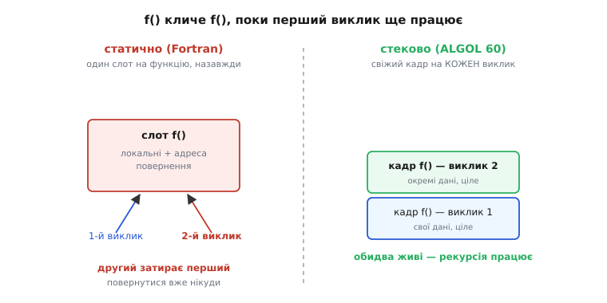

# 📜 Як рекурсія пробилася в мови програмування

Ви щойно розібрали, як виклик кладе на стек **кадр** — ділянку під локальні змінні, параметри й адресу повернення, — а завершення функції той кадр знімає. Механізм здається настільки самоочевидним, що важко уявити мову, де його немає. Але перша по-справжньому масова мова високого рівня саме такою й була: **Fortran** кадрів на стеку не мав і мати не міг. І, що найдивніше, це означало просту, приголомшливу для сьогоднішнього ока річ — **функція в ранньому Fortran не могла покликати саму себе**. Рекурсія була не «повільна» чи «незручна» — вона була **фізично неможлива**. І щоб вона стала можливою, комусь спершу довелося винайти той самий кадр на стеку, яким ви щойно навчилися користуватись як чимось цілком буденним.

Ця історія варта того, щоб її знати, бо вона розкриває глибоку правду, яку синтаксис ховає: **рекурсія і стекова пам'ять — це не дві окремі речі, а дві сторони однієї**. Одне без одного не існує. Зрозумієте, чому вони народилися разом, — і кадр на стеку перестане бути для вас довільною технічною подробицею, а стане тим, чим він є насправді: єдиним відомим способом дати функції змогу викликати саму себе.

## Чому Fortran не міг покликати функцію двічі водночас

Почнімо з машини, а не з мови. **Fortran** (від *Formula Translation* — «переклад формул») створила команда Джона Бекуса (John Backus) в IBM у середині 1950-х; перший компілятор вийшов **1957 року**. Це усталений факт, і ось важлива для нас деталь його влаштування: щоб програма працювала якнайшвидше на тодішньому кволому залізі, увесь потрібний їй обсяг пам'яті рахували **наперед, під час компіляції** — і закріплювали раз назавжди.

Що це означає на практиці? Кожна функція мала **свій, наперед виділений, нерухомий закуток пам'яті** під локальні змінні. У Fortran це було так, ніби кожна локальна змінна насправді статична: живе в одному й тому самому місці весь час роботи програми. Компілятор дивився на функцію `f`, бачив, що їй треба, скажімо, три цілі під локальні змінні й одна комірка під адресу повернення, — і відводив під це рівно один фіксований блок. Один. Назавжди.

А тепер поставте фатальне питання, до якого веде ця конструкція. Що станеться, якщо `f` покличе `f`, поки перший виклик **ще не завершився**? Другий виклик прийде по свою пам'ять — і виявить, що вона **та сама**, що й у першого виклику. Він запише свої локальні змінні поверх чужих. Він запише свою адресу повернення поверх чужої — і **затре записку про те, куди має повернутися перший виклик**. Коли внутрішній виклик скінчиться й машина захоче повернутись, вона прочитає адресу повернення — а там уже лежить адреса від *другого* виклику. Перший виклик просто нікуди не повернеться. Програма загине або зробить дурницю.


*Ліворуч — статичне розміщення Fortran: у функції один слот на всю програму, тож два одночасні виклики цілять в одну й ту саму пам'ять. Другий затирає локальні змінні й адресу повернення першого — повернутися вже нікуди. Праворуч — стекове розміщення ALGOL 60: кожен виклик кладе свій свіжий кадр зверху, дані не перетинаються, обидва виклики живі. Ось чому рекурсія неможлива без стеку: їй потрібен окремий кадр на кожен виклик, а статична пам'ять дає рівно один.*

Ось і вся розгадка. Не якась філософська заборона, не брак фантазії авторів — **суто фізична причина**. При статичній пам'яті в кожної функції рівно **один** комплект локальних змінних і **одна** комірка під адресу повернення. А рекурсія за самою своєю природою вимагає, щоб водночас існувало **кілька** активних викликів тієї самої функції, і в кожного — **свій** комплект. Одна комірка не може одночасно тримати три різні адреси повернення. Тому Fortran рекурсію не просто «не підтримував» — вона суперечила самій будові його пам'яті. Пряму й непряму рекурсію в стандарті Fortran заборонили аж до **Fortran 90** (стандарт вийшов **1991 року**), де нарешті з'явилося ключове слово `recursive` і кадри, виділювані на кожен виклик.

> 🔧 **Навіщо це.** Ця сама причина жива у вашому мікроконтролері **сьогодні**. Рекурсія в C працює лише тому, що кожен виклик бере свіжий кадр на стеку — і саме тому глибока рекурсія небезпечна: кадри накопичуються, а стек у МК малесенький (кілька кілобайтів). Коли ви обмірковуєте, чи писати рекурсивну функцію в прошивці, ви фактично зважуєте той самий компроміс, який стояв перед конструкторами мов 1950-х: гнучкість рекурсії коштує пам'яті стеку, і ця пам'ять не безкоштовна.

## Активаційний запис: наріжний камінь, якого бракувало

Щоб функція могла існувати в кількох одночасних примірниках, її пам'ять треба **відв'язати від коду** й виділяти **заново на кожен виклик**. Той окремий комплект — локальні змінні, параметри, адреса повернення — саме і є **активаційний запис** (*activation record*), він же ваш знайомий кадр на стеку. Слово «активаційний» тут точне: це запис не про *функцію*, а про одну конкретну її **активацію** — один живий виклик. Функція-код у пам'яті одна, а активаційних записів у неї в кожну мить може бути скільки завгодно, по одному на кожен незавершений виклик.

І тут стає видно, **чому рекурсія й стек — нерозлучні близнюки**. Куди складати ці записи? Придивіться до їхнього життєвого циклу. Коли `f` кличе `g`, запис `g` народжується **після** запису `f`; коли `g` завершується, її запис помирає **раніше** за запис `f`. Виклики завжди вкладаються один в одного, як матрьошки: останній народжений завершується першим. А структура, у якій «останнім поклав — першим зняв», — це рівно [**стек**](topic:sf-lang/stack-lifo). Не хтось згори наказав зберігати активаційні записи в стеку — сам **порядок народження й смерті викликів** робить стек єдиною формою, що їм пасує. Тому не можна «додати рекурсію» до мови, не додавши стекову пам'ять: рекурсія — це і є багато вкладених активаційних записів, а вкладені записи — це і є стек. Одне слово для двох боків тієї самої медалі.

Цікаво, що сам **стек як прийом** винайшли трохи раніше й зовсім для іншого — не для рекурсії, а для розбору арифметичних формул. Німці **Клаус Замельзон** (Klaus Samelson) і **Фрідріх Бауер** (Friedrich L. Bauer) назвали цей принцип «*Kellerprinzip*» (нім. *Keller* — «підвал, льох»: значення «зберігаються в льоху» й дістаються згори) і **30 березня 1957 року** подали на нього патентну заявку в німецьке патентне відомство; свій метод «послідовного перекладу формул» вони опублікували в *Communications of the ACM* 1960 року. Іронія історії в тому, що той самий льох-стек, придуманий, щоб рахувати `a + b × c`, виявиться ключем до рекурсії — треба було лише додуматися складати в нього не проміжні числа, а цілі активаційні записи. Але зробили цей крок, як ми зараз побачимо, не Замельзон із Бауером — а їхній опонент.

## ALGOL 60: рекурсію вставили в останню мить

Мова, яка **перша** офіційно впустила рекурсію, — **ALGOL 60** (від *Algorithmic Language* — «алгоритмічна мова»), плід міжнародного комітету, що зійшовся наприкінці 1950-х виробити спільну мову для запису алгоритмів. І те, як саме рекурсія туди потрапила, — одна з найкращих історій у всій царині: не тріумфальне рішення мудрого комітету, а майже змова, проведена телефоном за спиною половини учасників.

Комітет розколовся. Була сильна «німецька» фракція на чолі з тим самим **Фрідріхом Бауером** — авторами стекового принципу, — яка воліла **статичне** розміщення активаційних записів, як у Fortran: так виходив швидший, простіший компілятор. А був голландський табір — **Адріан ван Вейнгарден** (Adriaan van Wijngaarden) і молодий **Едсгер Дейкстра** (Edsger Wybe Dijkstra), — які розуміли, що рекурсія — надто глибока й природна ідея, щоб її викидати заради швидкості компіляції. Показово, що на боці рекурсії був і **Джон Маккарті** (John McCarthy), який саме тоді будував Lisp — мову, наскрізь рекурсивну від народження. Бауер згодом презирливо назве всю справу «амстердамською змовою» (*Amsterdamer Komplott*) — і, як ми побачимо, слово «змова» тут не таке вже й перебільшення.

Ключовий момент стався взимку 1959–60. Проєкт звіту про ALGOL 60 розіслали учасникам в останні тижні грудня 1959 року. Ван Вейнгарден і Дейкстра, вивчаючи його, помітили тонку річ: за буквою тексту рекурсія виходила **фактично дозволеною**, хоча прямо про неї ніде не йшлося — просто ніщо її не забороняло. Треба було закріпити це **явно**, поки не пізно. І приблизно **10 лютого 1960 року** вони зателефонували редакторові звіту — данцеві **Петеру Науру** (Peter Naur) (кажуть, то був чи не перший у житті Наура міжнародний дзвінок) — і продиктували речення, яке належало вставити до розділу 5.4.4 звіту:

```
Any other occurrence of the procedure identifier within
the procedure body denotes activation of the procedure.

(Будь-яка інша поява імені процедури в її тілі
 означає активацію цієї процедури.)
```

Прочитайте це речення повільно — воно й є легалізація рекурсії. «Будь-яка інша поява імені процедури в її власному тілі» — це буквально опис виклику функцією самої себе. «Означає активацію процедури» — тобто породжує новий активаційний запис, нову інкарнацію. Одне речення, вставлене тихо, зробило рекурсію офіційною частиною мови.

І воно **справді** пройшло тихцем. Пізніше Дейкстра сам розповідав про це без прикрас: *«That sentence has been inserted sneakily. And of all the people who sort of had to agree with the report, none saw that sentence.»* — «Це речення вставили нишком. І з усіх людей, які начебто мали погодити звіт, того речення не побачив ніхто.» Ось чому Бауерова «змова» — не така вже й метафора: суперечливе питання розв'язали в такий спосіб, що воно з великою ймовірністю мало проскочити повз увагу опонентів. І проскочило.

## Дейкстра: від сперечання до працюючого компілятора

Вставити речення в специфікацію — то лише слова на папері. Куди важче було **довести**, що рекурсію взагалі можна зібрати в робочий компілятор, — бо саме тут німецька фракція мала свій найсильніший козир: мовляв, це надто складно й надто повільно. І тут Дейкстра зробив те, що відрізняє інженера від сперечальника: він **побудував** такий компілятор.

Разом із **Якобусом Зоннефелдом** (Jacobus A. Zonneveld) Дейкстра написав **перший у світі компілятор ALGOL 60** — для нідерландської машини Electrologica X1, — і завершив його в **серпні 1960 року**, більш ніж на рік раніше за будь-який інший. Компілятор був **наскрізь стековий** і підтримував рекурсію повноцінно. Дейкстрине осяяння полягало в тому, щоб узяти той самий стек, яким Замельзон і Бауер рахували формули, і **узагальнити** його: складати в нього не проміжні числа, а активаційні записи процедур. Він сам це формулював так, що функція-підпрограма **лежить у пам'яті лише раз, але з динамічного погляду може мати кілька одночасних «інкарнацій»** (*incarnations*) — кілька живих активаційних записів на стеку, по одному на кожен незавершений виклик.

Придивіться, наскільки це та сама картина, яку ви вже засвоїли з основної теми — тарілки на стосі. Дейкстра лише побачив її раніше за всіх і зрозумів, що вона **та сама** і для обчислення виразу `P/Q`, і для виклику процедури: в обох випадках працює один спільний стек, у який кладеш роботу зверху й знімаєш зверху. Немає потреби в жодних особливих обмеженнях, у жодному окремому механізмі «для рекурсії» — рекурсія випадає **безкоштовно**, щойно пам'ять функції стає стековою. Саме за це — за введення стеку як способу організації пам'яті часу виконання й за перший його робочий компілятор — Дейкстру справедливо називають людиною, яка зробила рекурсію практичною, а не лише теоретично дозволеною.

Тут варто зупинитись на одному щодо атрибуції, щоб не збудувати чергового «героя-одинака». Рекурсія — **колективне** досягнення з чіткими, різними ролями, і кожну треба назвати точно. Була **ідея** (рекурсивні означення в математиці й логіці — старі, як сама математика; Маккарті переніс їх у Lisp). Була **специфікація** — те сховане речення в звіті ALGOL 60, за яким стоять ван Вейнгарден, Дейкстра й Наур. І була **робоча реалізація** — стековий компілятор Дейкстри й Зоннефелда. Це різні внески різних людей; жоден не «винайшов рекурсію» сам-один. Усі дійові особи — голландці (Дейкстра, ван Вейнгарден, Зоннефелд), данець (Наур), німці (Бауер, Замельзон) та американець (Маккарті); внесок західноєвропейський та американський, добре задокументований у першоджерелах, без жодних імперських домішок чи приписувань «не тим». Розрізняти ідею, специфікацію й реалізацію — не педантизм, а чесність із тим, як насправді народжуються речі в техніці.

## Іронічний хвіст: а чи потрібне було те речення?

Була б це надто гладенька історія, якби на ній і скінчилася, — та історія техніки рідко буває гладенька. Найпізніше дослідження цього епізоду (голландський інформатик **Мартен ван Емден** (Maarten van Emden) розібрав його докладно) додає несподіваний поворот: те славнозвісне «нишком вставлене» речення, найпевніше, **нічого в семантиці ALGOL 60 не змінило**. Рекурсія, як і підозрювали самі ван Вейнгарден із Дейкстрою ще в грудні 1959-го, за іншими правилами звіту виходила дозволеною **так чи так** — зокрема через механізм передавання процедур параметрами. Тобто «змова» була радше **страховкою**: вона зробила рекурсію **явною й недвозначною**, закрила лазівку для тлумачень — але, схоже, не додала мові нічого, чого в ній не було б і без неї.

Чи применшує це заслугу? Аж ніяк — і саме тому цей хвіст варто розповісти, а не замовчати. Зробити правило **явним** — окрема цінність, не менша за саму можливість: неявна, «випадково дозволена» рекурсія легко впала б жертвою першого-ліпшого компілятора німецької фракції, який просто не став би її реалізовувати. Явне речення в специфікації **зобов'язувало** реалізаторів. А Дейкстрин компілятор довів, що зобов'язання здійсненне — і не ціною жахливого сповільнення, якого боялися опоненти. Історія рекурсії — це не історія одного геніального осяяння, а історія того, як ідею **відстояли**: закріпили в тексті проти волі частини комітету й підперли працюючою реалізацією, поки її ще можна було втопити.

## Що з цього забрати

Три речі, які тепер тримають вашу картину кадру на стеку вже не як завчену механіку, а як щось, що не могло бути інакшим.

**Перше: рекурсія і стек — це одне.** Не дві незалежні можливості мови, а два боки однієї медалі. Рекурсії потрібно кілька одночасних активаційних записів тієї самої функції; кілька вкладених записів — це і є стек. Тому Fortran зі своєю статичною пам'яттю рекурсії мати не міг **у принципі**, а ALGOL 60 зі стековою пам'яттю отримав її майже задарма. Коли ви пишете рекурсивну функцію в C, ви безпосередньо користуєтеся тим самим механізмом, який Дейкстра з Зоннефелдом уперше зібрали влітку 1960-го.

**Друге: «безкоштовно» не означає «безмежно».** Кожен виклик — це живий кадр, що займає пам'ять, поки виклик не завершиться. Рекурсія глибиною в тисячу викликів — це тисяча кадрів на стеку одночасно. На великому комп'ютері це дрібниця; на вашому мікроконтролері з кількома кілобайтами стеку це може бути [переповнення стеку](topic:sf-lang/stack-overflow) й миттєва смерть прошивки. Той самий компроміс — гнучкість проти пам'яті, — через який сперечалися 1960 року, ви розв'язуєте щоразу, коли вирішуєте, писати цикл чи рекурсію в прошивці.

**Третє: речі, що здаються вічними, мають дату народження.** Кадр на стеку, який ви щойно вивчили як щось само собою зрозуміле, ще в середині 1950-х не існував як можливість — його довелося винайти, відстояти в суперечці й довести робочим кодом. Це корисно пам'ятати щоразу, коли якась риса мови видається «просто такою, як є»: майже завжди за нею стоїть конкретна проблема, конкретні люди й конкретний момент, коли могло скластися й інакше.
