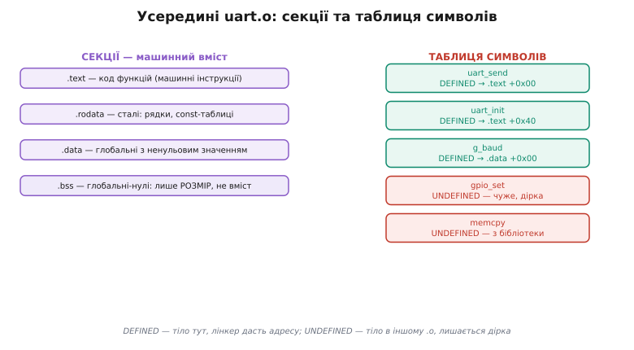

# Модулі й збірка проєкту

<preknowlist>
- [Препроцесор і заголовки](root:embedded/c-preprocessor-headers) — як `#include` вклеює `.h`, навіщо `#ifndef`-сторожа, як `-D` передає імена ззовні; без цього не зрозуміти, звідки в `.o` беруться посилання на чуже.
- [Функції](root:embedded/c-functions) — оголошення (прототип) проти визначення (тіло): саме цей поділ і дає лінкувальнику «дірки» й «тіла».
- [Перша програма: пишемо, збираємо, запускаємо](root:embedded/c-first-program) — базове «gcc бере `.c` і робить програму», яке ми тут розкладаємо на внутрішні кроки.
</preknowlist>

У базовому кроці ми склали загальну картину: багато `.c` перетворюються на прошивку двома рухами — компілятор робить із кожного файлу об'єктний `.o`, а лінкувальник зшиває всі `.o` в один образ; над цим стоїть **Make**, що звіряє час файлів і не перебудовує зайве, а ще вище — **CMake**, що з переносного опису породжує конкретні команди. Це правдива карта, і для щоденної роботи її досить. Але на ній усе цікаве заховане в чорні скриньки. Що конкретно лежить у `.o`, коли ми кажемо «машинний код із дірками»? Як саме лінкувальник закриває дірку — що він фізично вписує і куди? Чому порядок, у якому ви перелічуєте файли й бібліотеки, раптом починає вирішувати, збереться проєкт чи впаде з `undefined reference`? І як Make насправді знає, що застаріло, коли залежностей — тисячі?

Тут ми ці скриньки відкриваємо. Не заради academічної повноти, а тому, що кожна з них — джерело реальних помилок, на які ви натрапите, щойно проєкт переросте навчальний розмір. Зрозумівши механіку, ви перестанете вгадувати й почнете **знати**, куди дивитися, коли збірка поводиться дивно. Почнімо з найпершої скриньки — самого об'єктного файлу.

## Що насправді лежить в об'єктному файлі

Ми звикли казати «`.o` — це машинний код модуля з нерозв'язаними посиланнями». Це правда, але надто грубо. Насправді об'єктний файл — це маленький структурований контейнер, і в ньому чітко видно дві різні речі: **вміст** (байти, які колись опиняться в чипі) і **опис** (метадані про те, що це за байти й чого їм бракує). Розберімо обидві половини, бо саме з них випливає вся подальша логіка лінкування.

Вміст `.o` не суцільний — він поділений на **секції** (англ. *section* — розділ, ділянка), кожна зі своїм призначенням. Компілятор не звалює код і дані в одну купу; він сортує їх за природою, бо потім лінкувальнику й системі доведеться розкладати їх у різні частини пам'яті чипа. Ось головні секції, які ви бачитимете завжди:

```
.text     машинні інструкції — тіла ваших функцій
.rodata   сталі лише для читання: рядкові літерали, const-таблиці
.data     глобальні змінні з НЕнульовим початковим значенням
.bss      глобальні змінні, що стартують з нуля
```

Назви історичні й на позір загадкові, але за кожною — сенс. `.text` — «текст програми» в давньому машинному значенні (код). `.rodata` — *read-only data*, дані лише для читання. `.data` — звичайні дані, які треба десь тримати з їхнім значенням. А `.bss` — найцікавіша: скорочення *block started by symbol*, реліктова назва зі старого асемблера IBM 704 1950-х, і сьогодні її розшифровка вже нічого не пояснює. Важить інше — **що** туди кладуть і **чому це вигідно**.

Ось ключова асиметрія, яку варто зрозуміти до кінця. Уявіть дві глобальні змінні:

```c
int g_counter = 42;      // ненульове значення → .data
int g_buffer[1024];      // без ініціалізації (нуль за замовчуванням) → .bss
```

Для `g_counter` компілятор мусить десь зберегти саме число 42 — інакше звідки воно візьметься при старті. Ці чотири байти лягають у `.data` і фізично поїдуть у флеш чипа. А от `g_buffer` — цілий кілобайт нулів. Було б безглуздо тягти в образ прошивки 1024 нульові байти: нуль ні від чого не відрізняється, його не треба «зберігати», його треба лише **створити**. Тому `.bss` в об'єктному файлі не містить самих даних — вона містить **лише запис про розмір**: «зарезервуй стільки-то байтів і обнули їх при старті». Тисяча нулів у флеші перетворюється на короткий рядок метаданих «тут буде 4096 нульових байтів».

> 🔧 **Навіщо це.** На мікроконтролері флеш і RAM рахують буквально: у ESP32 сотні кілобайтів RAM, у дрібнішому чипі — одиниці. Розуміння, що `.data` займає і флеш (де лежить початкове значення), і RAM (куди його скопіюють), а `.bss` — лише RAM, безпосередньо впливає на те, чи влізе ваша прошивка. Оголосили `static uint8_t log[8192]` як глобал — це 8 КБ RAM з'їдено назавжди, ще до першого рядка `main`. Секції — не абстракція компіляторника, а те, за чим ви рахуєте пам'ять реального пристрою.

Друга половина `.o` — **таблиця символів** (англ. *symbol table*). Символ (гр. *sýmbolon* — знак, позначка) — це ім'я, прив'язане до якогось місця: функції чи глобальної змінної. Для кожного символу в таблиці записано, чи він **визначений** тут (defined — тіло лежить у якійсь секції цього ж `.o`, і вказано, у якій та за яким зсувом), чи **невизначений** (undefined — ім'я вжите, а тіла тут немає, воно десь у чужому файлі). Саме невизначені символи і є ті «дірки», про які ми говорили в базовому кроці; тепер видно, що це не метафора, а конкретні рядки таблиці з позначкою UNDEF.


*Об'єктний файл — контейнер із двох половин: секції несуть байти (причому `.bss` — лише розмір, не самі нулі), а таблиця символів каже, що модуль дає світові (DEFINED) і чого йому бракує (UNDEFINED).*

Тепер видно повну картину одного `.o`. Компілятор, опрацьовуючи `uart.c` окремо (бо, як ми пам'ятаємо, він бачить один файл за раз), розклав його інструкції по `.text`, сталі — по `.rodata`, глобали — по `.data`/`.bss`, а в таблицю символів вписав: `uart_send`, `uart_init`, `g_baud` — визначені тут, ось їхні місця; `gpio_set`, `memcpy` — вжиті, але невизначені, шукайте деінде. Цей формат контейнера — не довільний; на більшості систем, і на ARM-мікроконтролерах теж, він стандартизований і зветься [ELF](topic:sf-lang/elf-format) (executable and linkable format). Нам зараз важлива не буква формату, а те, що завдяки цій структурі наступний інструмент — лінкувальник — може взяти купу таких контейнерів і механічно позводити дірки з тілами.

## Релокація: як саме закривається дірка

У базовому кроці ми сказали: лінкувальник «шукає, у якому `.o` лежить потрібне тіло, і вписує його адресу в місця виклику». Розгорнімо це «вписує адресу», бо там ховається точний і не зовсім очевидний механізм — **релокація** (лат. *re-* — знову + *locare* — розміщувати; буквально «перерозміщення»).

Проблема, яку релокація розв'язує, така. Коли компілятор обробляв `main.c` і дійшов до рядка `uart_send(0x55)`, він мусив покласти в `.text` машинну інструкцію виклику — щось на кшталт `call <адреса>`. Але **якої адреси**? Тіло `uart_send` лежить в іншому файлі, і навіть коли обидва зберуться разом, ніхто на етапі компіляції `main.c` не знає, за яким числом воно опиниться у флеші — це вирішиться аж на лінкуванні, коли всі шматки розкладуть по місцях. Тож компілятор робить єдине, що може: кладе інструкцію виклику із **заглушкою** на місці адреси (часто просто нулі), а поряд, в окремій секції релокацій, лишає записку: «за таким-то зсувом у `.text` стоїть заглушка; коли дізнаєшся справжню адресу символу `uart_send` — впиши її сюди, ось таким способом».

Ця «записка» і є **запис релокації**. У ньому три речі: **де** латати (зсув у секції), **який символ** підставити (`uart_send`), і **як** його вписати (тип релокації — абсолютною адресою, відносною до поточної позиції тощо). Лінкувальник, розклавши всі `.o` по адресах, проходить усі записи релокацій і для кожного робить просту арифметику: бере остаточну адресу символу, за потреби віднімає адресу самої інструкції (для відносних викликів) — і вписує результат у заглушку. Дірку закрито.


*Компілятор лишає інструкцію виклику з дірою й записку-релокацію; лінкувальник знаходить тіло символу за його остаточною адресою й підставляє цю адресу в діру. «Вписати адресу» — це буквально пропатчити кілька байтів у машинній інструкції.*

Погляньмо на це живими цифрами, бо арифметика тут повчальна — і саме на ній тримається розуміння, чому та сама програма, зібрана під різні адреси, дає різні байти.

**Умова:** інструкція відносного виклику (`call rel32`, як на x86) стоїть за адресою `0x1000`; лінкувальник розмістив тіло `uart_send` за `0x1A40`. Відносний виклик кодує **зсув від наступної інструкції**, а не абсолютну ціль; сама інструкція займає 5 байтів, отже наступна починається на `0x1005`.
```
ціль             = 0x1A40
адреса після call = 0x1000 + 5 = 0x1005
зсув (rel32)     = 0x1A40 − 0x1005 = 0xA3B

у заглушку інструкції call вписується саме 0x0A3B, а не 0x1A40
```
**Висновок:** лінкувальник вписав не адресу функції, а **різницю** між нею й точкою виклику. Тому такий код можна зсунути в пам'яті цілим блоком — усі внутрішні виклики лишаться правильними, бо різниці не міняються. А от якби релокація була **абсолютною** (вписали б `0x1A40` напряму), то зсув усього блоку зламав би всі виклики. Цей поділ на відносне й абсолютне — не дрібниця стилю: він визначає, чи може прошивка виконуватися з будь-якої адреси, чи прибита до однієї. На мікроконтролері, де ви самі кажете, з якої адреси флешу стартує образ, розуміння цієї різниці рятує від класу помилок «зібралося, але не запускається, бо очікує себе за іншою адресою».

Побачити релокації на власні очі просто: `objdump -r main.o` (від *object dump* — «викид» вмісту об'єктного файлу) роздрукує таблицю записів релокацій; `objdump -t main.o` — таблицю символів із позначками `*UND*` для невизначених. Це не екзотика для гуру — це перший інструмент, коли лінкер каже щось незрозуміле: ви дивитеся, які символи справді лишилися невизначені й хто їх вимагає. Сама [компіляція](topic:sf-lang/compilation) до цих машинних інструкцій — окрема тема (як текст мови стає байтами `.text` через кілька внутрішніх фаз); нам тут досить, що на виході стоять інструкції з дірками-релокаціями, і що [лінкування](topic:sf-lang/linking) — це прохід, який ці дірки закриває.

## Одне визначення, багато оголошень: правила розв'язання символів

Тепер, коли ми бачимо символи як конкретні рядки таблиці, можна точно сформулювати правила, за якими лінкувальник вирішує, що з чим зшивати — і звідки беруться дві дзеркальні помилки, згадані в базовому кроці. Ці правила разом звуть **правилом одного визначення** (англ. *one definition rule*), і воно просте на словах, але має тонкі краї.

Суть: **кожен символ, який реально використовується, мусить мати рівно одне визначення на весь образ**. Оголошень (обіцянок «така функція десь є» — прототипів у заголовках) може бути скільки завгодно, у скількох завгодно файлах: вони лише створюють дірки, а дірки — не конфлікт. А от **тіло** — байти в секції — має бути одне. З цього єдиного принципу випливають обидві помилки лінкера:

**Нуль визначень** на вжитий символ → `undefined reference`. Хтось лишив дірку (вжив ім'я), а жоден `.o` цього символу не визначив. Ми це вже знаємо; глибша причина тепер видніша — лінкувальник обійшов таблиці символів усіх `.o` й ніде не знайшов рядка `DEFINED` для цього імені. Найчастіше: забули додати відповідний `.c` у збірку, або написали прототип, а тіло — ні, або тіло є, але його ім'я спотворене (про це нижче).

**Два визначення** одного символу → `multiple definition`. Два різні `.o` принесли по тілу з тим самим іменем. Класична пастка, яку базовий крок згадав: ви поклали визначення функції або глобальної змінної не в `.c`, а в `.h` — і `#include` вклеїв це тіло в кожен файл, що заголовок включив. Тепер у кожному `.o` є свій `DEFINED` для цього символу, і лінкер, зводячи їх, бачить конфлікт. Саме тому в заголовки кладуть **оголошення** (`extern int g_baud;`, прототипи), а визначення — у рівно один `.c`.

Є тонкий випадок, який варто знати, бо він плутає навіть досвідчених: **пробні визначення** (англ. *tentative definition*). У C глобальна змінна без ініціалізатора — `int g_state;` — це не зовсім повноцінне визначення; історично компілятор трактує її поблажливо, і два таких оголошення в різних файлах старий лінкер міг «злити» в одне замість лаятися. Це успадкована з давнини вільність, і вона — джерело підступних багів: ви думали, що маєте дві різні змінні, а насправді вони виявилися однією. Сучасні компілятори за замовчуванням це вже забороняють (прапорець став суворим), і правильна практика — та сама: змінна визначається в одному `.c`, а в заголовку стоїть `extern`.

Ще один шар — **сила символу**. Не всі визначення рівні: буває **сильне** (звичайне тіло) і **слабке** ([weak symbol](topic:sf-lang/weak-symbols) — визначення, яке навмисне позначили «поступливим»). Якщо лінкер бачить сильне й слабке визначення того самого імені, він мовчки бере сильне, без помилки про конфлікт. Це не примха, а робочий інструмент: так у прошивках роблять **перевизначувані заготовки**. Бібліотека дає слабку «затичку» обробника переривання чи функції — щоб образ гарантовано злінкувався, навіть якщо ви нічого не написали; а щойно ви визначаєте свою (сильну) версію, вона тихо витісняє заготовку. Класичний приклад — вектори переривань у стартовому коді МК: усі за замовчуванням слабко вказують на «нескінченний цикл», а ви перекриваєте лише ті, що вам потрібні. Слабкі символи — окрема тема з власними тонкощами, тут важливо саме те, що вони пояснюють, чому іноді два визначення — це помилка, а іноді — задум.

І остання причина `undefined reference`, від якої сивіють новачки в C++: **спотворення імен** (англ. *name mangling*). У чистому C ім'я функції в таблиці символів — це майже саме ім'я (`uart_send`). А в C++ через перевантаження (кілька функцій з однаковим іменем, різними аргументами) компілятор кодує в символ ще й типи аргументів — `_Z9uart_sendh` замість `uart_send`. Тому коли ви лінкуєте C++-код, що викликає C-функцію, лінкер шукає спотворене ім'я, а в C-об'єкті лежить неспотворене — і не знаходить. Ліки — обгорнути оголошення C-функцій у `extern "C" { … }`, що вимикає спотворення для них. Це вже територія [ABI й угод виклику](topic:sf-lang/abi-calling-convention) — того, як саме код домовляється про імена й передачу параметрів; згадуємо тут лише щоб ви впізнали симптом: «функція точно є, а лінкер не бачить» у C++ майже завжди означає розбіжність спотворення.

## Статичні бібліотеки і чому порядок вирішує все

Досі ми лінкували окремі `.o`. Але коли модулів стають десятки, а частина з них — спільний код, який хочеться перевикористовувати в кількох проєктах, `.o`-файли пакують у **статичну бібліотеку** (англ. *static library*) — файл із розширенням `.a` (від *archive* — архів). Розберімо, що це насправді, бо тут ховається одна з найковарніших помилок збірки, і без розуміння механіки її не перемогти.

Статична бібліотека — це не якийсь особливий формат коду. Це буквально **архів об'єктних файлів**, як `.zip` без стиснення: кілька `.o`, складених в один файл інструментом `ar` (той самий *archiver*), плюс маленький **індекс символів** — таблиця «який символ у якому `.o` архіву визначений». Створюють її так:

```sh
ar rcs libsensor.a sensor.o filter.o calib.o
```

Прапорці: `r` — додати/замінити файли в архіві, `c` — створити тихо, `s` — записати індекс символів (щоб лінкер швидко бачив, що де). Тепер замість перелічувати три `.o` ви даєте лінкеру одну `libsensor.a`.

І ось де починається неочевидне. Лінкувальник обробляє **звичайні `.o` не так, як бібліотеки**. Кожен `.o`, який ви передали прямо, він включає в образ **безумовно** — це ваш код, він потрібен увесь. А бібліотеку `.a` він чіпає **на вимогу**: не тягне з неї нічого просто так, а лише ті `.o`, що закривають **уже наявні** незакриті дірки на момент, коли лінкер дійшов до цієї бібліотеки у списку. Витягнув `.o` з архіву — той, своєю чергою, міг принести нові дірки, які лінкер теж намагається закрити з решти тієї ж бібліотеки. Що не знадобилося — лишається в архіві й в образ не потрапляє.

Тепер зрозуміла причина найпідступнішої помилки лінкування, яка виглядає як містика. Лінкувальник іде списком аргументів **зліва направо, один раз**. Розгляньмо два порядки того самого набору файлів.


*Одні й ті самі файли, різний порядок — різний результат. Лінкер бере з бібліотеки лише те, що бракує на мить, коли він до неї дійшов; поставите бібліотеку раніше за того, хто її потребує, — він мине її з порожніми руками.*

**Умова:** `main.c` викликає `sensor_read`, тіло якої лежить у `libsensor.a`.
```sh
gcc main.o libsensor.a -o app     # ПРАВИЛЬНО
# крок 1: лінкер бере main.o безумовно → з'являється дірка sensor_read
# крок 2: доходить до libsensor.a, бачить відкриту дірку sensor_read
#         → витягує sensor.o з архіву, дірку закрито ✓

gcc libsensor.a main.o -o app     # НЕПРАВИЛЬНО
# крок 1: лінкер дивиться libsensor.a — відкритих дірок ЩЕ нема
#         → не бере з неї нічого, минає порожньою
# крок 2: бере main.o безумовно → аж тепер з'являється дірка sensor_read
#         → але бібліотеку вже минули, брати нема звідки
#         → undefined reference to sensor_read ✗
```
**Висновок:** правило залізне — **бібліотека має стояти в списку ПІСЛЯ того, хто її потребує**. Спершу свої `.o`, потім бібліотеки; серед бібліотек — та, що залежить від іншої, раніше за ту, від якої залежить. Це не забаганка синтаксису, а прямий наслідок того, що лінкер робить один прохід зліва направо й тягне з архіву тільки під наявну потребу.

> 🔧 **Навіщо це.** У прошивках ви постійно лінкуєтеся зі стандартною бібліотекою C (`libc`), математичною (`libm`), бібліотеками SDK виробника. Коли новачок бачить `undefined reference to sinf`, хоч `#include <math.h>` на місці, у дев'яти випадках із десяти причина не в коді, а в тому, що `-lm` стоїть не там або відсутнє. Знаючи механіку порядку, ви не гадаєте, а зразу дивитесь у команду лінкування: хто кого потребує і в якому порядку стоїть.

Лишається один справді неприємний випадок — **взаємна залежність** двох бібліотек. Нехай `liba.a` викликає щось із `libb.a`, а `libb.a` — щось із `liba.a`. Хоч як їх упорядкуй одним проходом, друга завжди опиниться «позаду» першої для якоїсь дірки, що відкриється пізніше. Для цього лінкер має спеціальний прийом: обгорнути взаємозалежні бібліотеки в групу `-Wl,--start-group liba.a libb.a -Wl,--end-group`, і тоді він **крутить їх по колу**, доки перестануть з'являтися нові дірки. Це дорожче (кілька проходів замість одного), тому за замовчуванням лінкер так не робить — але для клубка взаємних залежностей це рятівний вихід. Знову ж: правило народилося не з примхи, а з фундаментального «один прохід зліва направо», який ми щойно розібрали.

Оскільки правильний `Makefile` для реального проєкту — з пінами компіляції, авто-залежностями й лінкуванням бібліотек у правильному порядку — сам собою вартий того, щоб мати його під рукою цілим, я виніс [готовий переносний шаблон Makefile для прошивки](root:embedded/c-modules-build/proj-generic-makefile.md) окремо: там повний робочий файл із поясненням кожного рядка, який можна взяти й пристосувати. Тут же ми розберемо не готовий рецепт, а **механіку**, з якої такі шаблони виростають.

## Make зсередини: граф залежностей і формальна застарілість

Базовий крок дав інтуїцію Make: правило «ціль ← залежності + команда», а перебудова — за часом файлів. Тепер поглянемо на це строго, бо саме тут ховається розуміння, чому Make надійний і де він ламається.

Насправді `Makefile` описує не список правил, а **граф залежностей** — точніше, орієнтований граф без циклів (кожна ціль вказує на те, з чого вона зроблена). Коли ви кажете `make firmware.elf`, Make не виконує правила згори вниз, як вам здається. Він будує цей граф від запитаної цілі вниз до листків (вихідних файлів), тоді обходить його **знизу вгору** — спершу те, що ні від чого не залежить, потім те, що спирається на вже готове. Порядок команд у файлі неважливий: важлива структура залежностей. Це принципово інша модель, ніж скрипт «зроби це, потім те».

Формальне правило застарілості таке. Мета вважається **застарілою** (потребує перебудови) тоді й лише тоді, коли або її файлу взагалі немає, або **час зміни хоча б однієї з її залежностей пізніший за час зміни самої цілі**. Make рахує це рекурсивно: перш ніж вирішити про ціль, він доводить до актуальності всі її залежності — бо якщо перебудується залежність, її час оновиться, і ціль автоматично стане застарілою відносно неї. Застарілість, отже, **тече графом угору**: зачепили листок — хвиля перебудови піднімається до кореня рівно тими шляхами, що від нього залежать.


*Змінили один заголовок — і Make підіймає застарілість графом рівно тими ребрами, що від нього залежать: обидва об'єктні файли, які включали `led.h`, треба перекомпілювати, `uart.o` не чіпати, а образ — перелінкувати. Ніде не більше й не менше, ніж потрібно.*

Ця картина одразу пояснює, чому в базовому кроці ми так наполягали виписувати залежності від заголовків (`main.o: main.c led.h uart.h`). Якщо ребро `led.h → main.o` не проведене в графі, то, змінивши `led.h`, ви не піднімете хвилю до `main.o` — Make його не перебудує, і в образ поїде застарілий об'єктний файл, зібраний зі старою «обкладинкою» модуля. Виникнуть примарні розбіжності: код нібито новий, а поводиться як старий. Тобто **правильність збірки дорівнює повноті графа залежностей**. І тут криється головна слабкість ручного `Makefile`, яку базовий крок лише назвав, а зараз ми її переможемо.

## Автоматичні залежності: як прибрати головний біль ручного графа

Виписувати руками, який `.c` який заголовок включає, — робота нудна й помилконебезпечна: файлів сотні, `#include` в них десятки, і варто забути один рядок — маєте той самий примарний баг застарілого `.o`. Гірше: заголовки включають інші заголовки, і повний список того, від чого насправді залежить `main.o`, — це все дерево вкладених `#include`, яке людина відстежити не в змозі.

Але є хтось, хто це дерево вже знає досконало — **сам компілятор**. Проходячи препроцесором `main.c`, він розкриває кожен `#include` і, отже, точно бачить повний список залучених заголовків. Лишається попросити його цей список записати — і GCC це вміє. Прапорець `-MMD` каже: скомпілювавши файл, окрім `.o` вивали ще й `.d`-файл (від *dependency* — залежність), а в ньому — готове Make-правило зі всіма заголовками, які реально включилися:

```sh
gcc -MMD -MP -c main.c -o main.o
# створює main.o І main.d, де всередині приблизно:
#   main.o: main.c led.h uart.h config.h
```

Тепер цей згенерований `.d` треба лише **втягнути** в `Makefile` директивою `include` — і граф залежностей від заголовків будується сам, точний і повний, без жодного ручного рядка. Другий прапорець, `-MP`, додає невеликий, але важливий штрих: для кожного заголовка він дописує порожнє фіктивне правило «цей заголовок ні від чого не залежить». Навіщо? Уявіть, що ви **видалили** заголовок і прибрали `#include` на нього. Старий `.d` усе ще вимагає той файл як залежність — і Make впаде з «немає правила зробити `old.h`». Порожнє правило від `-MP` каже Make: «якщо такого файлу нема — вважай, що й не треба», і збірка не ламається на видаленні заголовка.

Складімо це докупи — але вже не як конкретні три правила, а як **узагальнений** `Makefile`, що працює для будь-якого набору файлів. Тут знадобляться дві речі, яких базовий крок не торкався: **автоматичні змінні** й **шаблонні правила**.

Автоматичні змінні — це короткі імена, якими Make **у момент виконання команди** підставляє частини самого правила, щоб не повторювати імена файлів двічі:

```
$@   ім'я цілі (того, що робимо)
$<   перша залежність (зазвичай — вихідний .c)
$^   усі залежності разом
$*   «стовбур» — те, що збіглося з % у шаблоні
```

А **шаблонне правило** (англ. *pattern rule*) описує не один файл, а цілий клас: символ `%` — підстановка, що збігається з будь-яким іменем. Правило «як із будь-якого `.c` зробити однойменний `.o`» пишеться раз:

```make
CC      = arm-none-eabi-gcc
CFLAGS  = -Os -Wall -Wextra -MMD -MP -DBOARD_V2
SRCS    = main.c led.c uart.c sensor.c
OBJS    = $(SRCS:.c=.o)          # список .o, зроблений заміною .c→.o

firmware.elf: $(OBJS)            # образ залежить від УСІХ об'єктних файлів
	$(CC) $(CFLAGS) $^ -o $@    # $^ — усі .o; $@ — firmware.elf

%.o: %.c                        # ШАБЛОН: будь-який .o з однойменного .c
	$(CC) $(CFLAGS) -c $< -o $@ # $< — конкретний .c; $@ — конкретний .o

-include $(OBJS:.o=.d)          # втягнути авто-залежності (.d поряд з кожним .o)

clean:
	rm -f $(OBJS) $(OBJS:.o=.d) firmware.elf
```

Прочитаймо, що тут відбувається, бо кожен рядок несе думку. `OBJS` виводиться з `SRCS` заміною суфікса — додали новий модуль у `SRCS`, і його `.o` з'явиться в графі сам. Правило образу тепер не перелічує файли поіменно, а бере `$(OBJS)` як залежності й `$^` у команді — жодного дублювання. Шаблон `%.o: %.c` замінив три (чи триста) майже однакових правил на одне; для кожного потрібного `.o` Make сам підставить відповідний `.c` у `$<`. Рядок `-include $(OBJS:.o=.d)` затягує всі згенеровані файли залежностей — ведучий дефіс каже «не лайся, якщо `.d` ще нема» (першого разу їх справді нема, вони з'являться після першої компіляції). А `clean` — окрема ціль, що просто прибирає збудоване.

> 🔧 **Навіщо це.** Ця конструкція — не показ синтаксису заради синтаксису, а стандартний кістяк реального embedded-`Makefile`. Вона розв'язує рівно ту проблему, з якою базовий крок нас лишив: більше не можна «забути заголовок у залежностях», бо їх виписує компілятор, а не людина. Додати файл — один рядок у `SRCS`. Зібрати під іншу плату — одне слово в `CFLAGS`. Це той рівень надійності, за якого збірка перестає бути джерелом багів і стає фоном, про який не думаєш.

Лишилася одна тонкість, на якій новачки спотикаються після `clean`. Ціль `clean` не робить файлу з іменем «clean» — вона виконує дію. Але якщо у вас у теці випадково з'явиться файл із назвою `clean`, Make побачить, що «ціль `clean` існує й новіша за залежності» (їх у неї нема), вирішить, що робити нічого, і **тихо нічого не прибере**. Щоб сказати Make «ця ціль — не файл, а завжди-дія», її оголошують фіктивною:

```make
.PHONY: clean all
```

`.PHONY` (від англ. *phony* — несправжній, фіктивний) — це список цілей, які Make виконуватиме **завжди**, не звіряючи час і не плутаючи з однойменними файлами. Типово фіктивні — `clean`, `all` (зібрати все), `flash` (залити прошивку), `test`. Забути `.PHONY` — класична причина «чому `make clean` іноді не працює»: тепер ви знаєте механізм і не гадатимете.

## Ninja: коли навіть Make замало

Make чудовий, але на дуже великих проєктах у нього вилазить власна межа — не в надійності, а в **швидкості самого рішення**. Згадаймо: перш ніж щось зробити, Make мусить прочитати й розібрати всі `Makefile` (а вони на великому проєкті бувають громіздкі, з функціями, умовами, включеннями), побудувати граф і обійти його. На проєкті з десятків тисяч файлів навіть **порожня** збірка — коли міняти нема чого — витрачає відчутний час просто на це обдумування, ще до першого запуску компілятора.

Саме цей біль і породив **Ninja**. Його зробив 2011 року **Еван Мартін** (англ. *Evan Martin*), інженер Google, як побічний проєкт, щоб пришвидшити цикл «правка → збірка» для браузера Chromium — кодової бази в кілька мільйонів рядків і тисячі файлів, де Make на порожній перевірці мучив розробників секундами очікування (статус: усталено — задокументовано і в історії проєкту, і в описах самого Мартіна; відкрито опубліковано в лютому 2011-го). Ідея Ninja — радикальний мінімалізм: він **навмисне не вміє** майже нічого з того, що вміє Make. Ніяких функцій, умов, обчислень у файлі збірки. Його вхідний формат `build.ninja` — не мова, а майже готовий, розжований граф: сухий перелік «ця ціль робиться цією командою з цих входів», без жодної логіки, яку треба інтерпретувати.

Навіщо так себе обмежувати? Бо ці обмеження — і є джерело швидкості. Ninja задуманий не як інструмент, у якому людина пише збірку руками, а як **найшвидший виконавець уже готового графа**. Файл `build.ninja` не пишуть — його **генерують** (тим самим CMake, наприклад). А Ninja лишається зробити мінімум: блискавично розібрати простий формат, звірити час файлів і запустити рівно потрібні команди. Порожня збірка Chromium із десятками тисяч файлів у Ninja минає менш ніж за секунду — там, де Make думав би помітно довше. Він жодним боком не розумніший за Make концептуально; він просто зняв із себе все, крім найгарячішої роботи, і робить її дуже швидко.

Тут важливо не заплутатися в ролях, і вони лягають рівно в ту драбину, що ми будували в базовому кроці. Ninja стоїть на **тому самому щаблі**, що й Make — це нижній робочий складач, який жене компілятор і лінкер, звіряючись за часом файлів. Він Make не «переміг» і не «над ним» — він **альтернатива** Make на тому ж рівні, з іншим компромісом: Make зручніший писати руками, Ninja швидший виконувати згенероване. А над ними обома, як і раніше, стоїть генератор.

## Компонувальник і карта пам'яті: куди секції лягають у чипі

Ми розібрали, як лінкер зводить символи. Але на мікроконтролері в нього є ще одна робота, якої на звичайному ПК майже не видно, — **розкласти секції по фізичних адресах чипа**. І ось де все, що ми говорили про `.text`/`.data`/`.bss`, змикається із залізом.

На ПК операційна система сама вирішує, куди в пам'ять завантажити програму. На МК немає операційної системи — є голий чип із жорсткою [картою пам'яті](topic:hw-arch/memory-map): флеш починається з однієї відомої адреси, RAM — з іншої, і ви мусите **явно сказати** лінкеру, що куди покласти. Робить це окремий файл — **компонувальний скрипт** (англ. *linker script*), який описує ділянки пам'яті чипа й правила розкладання секцій по них. Спрощено його логіка така:

```
FLASH починається з 0x08000000, розмір 512K   (тут лежить незмінний код)
RAM   починається з 0x20000000, розмір 128K   (тут — змінні під час роботи)

.text   → у FLASH   (код нікуди не дінеться, читається з флешу)
.rodata → у FLASH   (сталі теж незмінні)
.data   → адресується в RAM, але КОПІЯ значень лежить у FLASH
.bss    → у RAM     (лише місце, вміст створюється нулями при старті)
```

Тепер стає остаточно ясна та асиметрія `.data`/`.bss`, з якої ми починали. Змінна працює в RAM (бо її можна міняти, а флеш під час роботи не переписують). Але `.data` має **ненульове** початкове значення — і це значення мусить десь пережити вимкнення живлення, тобто лежати у **флеші**. Тому лінкер розміщує `.data` двічі: саме значення — у флеші (звідки його візьмуть), а робоче місце змінної — у RAM (де вона житиме). А хто копіює значення з флешу в RAM при ввімкненні? Ніхто автоматично — це робить **стартовий код** ще до `main`: невеликий шматок, що при вмиканні чипа проходить `.data` і копіює її з флешу в RAM, а `.bss` заповнює нулями. Це і є частина [C-рантайму](topic:sf-lang/c-runtime) — тієї підготовки середовища, без якої глобальні змінні не мали б правильних значень до першого рядка вашого коду.

> 🔧 **Навіщо це.** Коли прошивка «не влазить у флеш» або «не влазить у RAM» — це повідомлення саме від лінкера, який за компонувальним скриптом порахував суму секцій і побачив, що вона більша за ділянку. «Region FLASH overflowed» означає: код + сталі + копії `.data` перевищили флеш. «Region RAM overflowed» — сума `.data` + `.bss` + стек + купа не влізла в RAM. Розуміючи, яка секція куди йде, ви знаєте, що скорочувати: забагато коду — оптимізувати за розміром чи викинути функції; забагато RAM — зменшити глобальні буфери. Без цієї картини повідомлення лінкера — незрозуміла лайка; з нею — точна вказівка, де шукати.

Це велика тема сама по собі — деталі компонувального скрипту, розкладка секцій, стек і купа в карті пам'яті, — і ми повернемося до неї, коли дійдемо до реального чипа. Тут важливо побачити, що лінкер на МК — не лише «зшивач символів», а й **розкладальник по фізичній пам'яті**, і що секції з початку статті — це не абстракція, а буквально те, що лягає в конкретні адреси вашого чипа.

## CMake зсередини: дві фази, цілі й переносність

Наостанок відкриймо верхню скриньку. Базовий крок показав CMake як генератор: із переносного `CMakeLists.txt` він породжує конкретні файли для Make чи Ninja. Тепер — трохи глибше про те, як він працює, бо на реальному embedded-проєкті ви зіткнетеся з двома його рисами, яких проста картинка не пояснює: **двофазність** і **цілі**.

Перше — CMake працює **у дві фази**, і плутанина між ними — джерело багатьох питань «чому воно так зробилося». Перша фаза, **конфігурація** (configure): CMake запускається, читає `CMakeLists.txt`, з'ясовує ваше середовище (який компілятор, які бібліотеки, яка система) і будує внутрішню модель проєкту. Друга фаза, **генерація** (generate): з цієї моделі він виписує конкретні файли збірки (`Makefile` чи `build.ninja`). І аж потім — окремо, уже не CMake, а Make/Ninja — відбувається сама збірка. Тому робота з CMake має дві сходинки: спершу один раз `cmake` (сконфігурувати й згенерувати в окрему теку), потім скільки завгодно разів `cmake --build` або прямо `ninja` (власне збирати). Конфігурувати наново треба лише коли міняється сам опис, не код.

Звідси й практика **збірки поза деревом** (англ. *out-of-source build*): усе згенероване й скомпільоване складають в окрему теку `build/`, окремо від вихідних файлів. Причина проста — згенеровані файли прив'язані до середовища й до фази конфігурації; тримати їх поряд з кодом означало б засмічувати репозиторій похідними артефактами й плутати, де джерело, а де продукт. Викинути `build/` і сконфігурувати заново — завжди чистий стан.

Друге — CMake мислить не файлами, а **цілями** (англ. *target*). `add_executable(firmware …)` створює ціль-програму; бібліотека — це ціль `add_library`. І найцінніше тут — **вимоги вжитку** (англ. *usage requirements*): до цілі можна прив'язати не лише її власні файли, а й те, що **автоматично успадкує кожен, хто цю ціль використає**. Керують цим три слова, і різниця між ними — щоденний інструмент:

```cmake
add_library(sensor sensor.c filter.c)

target_include_directories(sensor
    PUBLIC  include        # шлях до заголовків БАЧАТЬ і sensor, і всі, хто його лінкує
    PRIVATE src)           # цей шлях потрібен лише самому sensor, назовні не видно

target_link_libraries(firmware PRIVATE sensor)   # firmware лінкується з sensor
```

`PRIVATE` — потрібне лише самій цілі. `INTERFACE` — потрібне лише тим, хто цю ціль вживає (сама вона цим не користується). `PUBLIC` — і те, й те. Це не бюрократія: коли `firmware` лінкує `sensor`, він **автоматично** дістає всі `PUBLIC`-заголовки `sensor` і всі його `PUBLIC`-залежності — включно з правильним **порядком лінкування**, який ми так старанно розбирали для ручного випадку. CMake сам вибудовує граф залежностей між цілями й видає лінкеру аргументи в правильному порядку зліва направо. Та сама пастка `undefined reference` через порядок, що загрожувала в ручному `Makefile`, тут закрита автоматично — бо CMake знає, хто кого потребує, і сортує сам.

> 🔧 **Навіщо це.** Для прошивки найголовніша риса CMake — **переносність збірки на інший чип** через окремий файл інструментів (англ. *toolchain file*). У ньому ви одноразово описуєте цільове середовище: який кроскомпілятор (`arm-none-eabi-gcc` замість звичайного `gcc`), які прапорці під архітектуру, який компонувальний скрипт. Далі той самий `CMakeLists.txt`, що описує проєкт, збирається під МК простим `cmake -DCMAKE_TOOLCHAIN_FILE=arm.cmake …`. Саме тому виробники (той-таки Espressif для ESP32) дають свій SDK на CMake: уся кухня — кроскомпілятор, карта пам'яті, стартовий код, формат образу — уже налаштована в тулчейн-файлі й SDK, а ви описуєте прошивку в кількох рядках. Коли ми дійдемо до реальної плати, збиратимемо саме так — і тепер ви розумієте, що при цьому відбувається під капотом на кожному щаблі.

І тут замикається вся драбина, тепер уже з відкритими скриньками. Ви пишете **переносний опис** (`CMakeLists.txt`) → CMake у фазу конфігурації з'ясовує середовище, будує граф цілей із їхніми вимогами вжитку, а у фазу генерації видає **конкретні команди збірки** (`Makefile` або `build.ninja`) → **складач** (Make чи Ninja) звіряє час файлів і жене рівно потрібні → **компілятор** робить `.o` із секціями й релокаціями → **лінкувальник** зводить символи, закриває дірки підстановкою адрес і за компонувальним скриптом розкладає секції по флешу й RAM чипа → на виході образ, готовий залитися. Кожен щабель робить своє, і на кожному тепер видно не чорну скриньку, а зрозумілий механізм.

## Що лишити в голові

Об'єктний файл — не просто «код із дірками», а контейнер із двох половин: **секції** (`.text` — код, `.rodata` — сталі, `.data` — ненульові глобали, `.bss` — лише розмір нульових глобалів) і **таблиця символів**, де кожне ім'я позначене визначеним тут або невизначеним (дірка). Лінкувальник закриває дірку **релокацією**: компілятор лишає в інструкції заглушку й записку «сюди потрібна адреса такого символу», а лінкер, розклавши все по адресах, вписує знайдену адресу — абсолютну чи відносну, і ця різниця вирішує, чи можна зсувати код у пам'яті. Дві дзеркальні помилки лінкера випливають із **правила одного визначення**: `undefined reference` — нуль тіл на вжитий символ, `multiple definition` — два тіла (класично: визначення в `.h`); слабкі символи дозволяють навмисне перекриття заготовок, а спотворення імен у C++ лікується `extern "C"`. Статична бібліотека `.a` — архів `.o`, з якого лінкер тягне **на вимогу** й **зліва направо**, тому бібліотека мусить стояти після того, хто її потребує (взаємні залежності — у `--start-group`). Make описує не список, а **граф залежностей**, і перебудовує ціль, коли якась залежність новіша; повнота графа = правильність збірки, тому заголовкові залежності генерують автоматично (`-MMD -MP` + `include` `.d`), а шаблонні правила (`%.o: %.c`) з автоматичними змінними (`$@ $< $^`) і `.PHONY` роблять `Makefile` коротким і надійним. **Ninja** — не наступник, а швидша альтернатива Make на тому ж щаблі: мінімальний виконавець уже згенерованого графа. На МК лінкер ще й розкладає секції по фізичній карті пам'яті за **компонувальним скриптом** (`.text`/`.rodata` — у флеш, `.data` — копія у флеші плюс місце в RAM, `.bss` — нулі в RAM, які створює стартовий код), і саме звідси беруться «overflowed»-помилки. А **CMake** працює у дві фази (конфігурація → генерація) і мислить **цілями** з вимогами вжитку (`PUBLIC`/`PRIVATE`/`INTERFACE`), сам вибудовуючи правильний порядок лінкування й даючи переносність на інший чип через тулчейн-файл. Уся драбина — опис → команди → складач → компілятор → лінкер → образ — тепер стоїть перед вами не чорними скриньками, а зрозумілими механізмами, і саме нею будують реальні прошивки, до яких ми переходимо далі.
