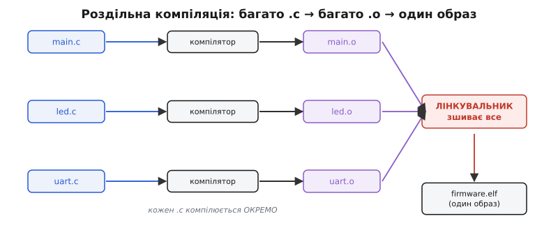
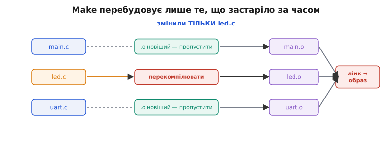
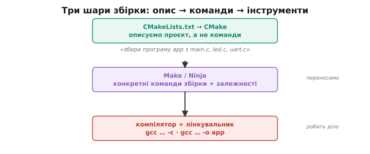

# Модулі й збірка проєкту

Ми щойно навчилися розкладати код на модулі: заголовок `.h` оголошує, що вміє модуль, а `.c` містить нутрощі. Драйвер світлодіода — окремо, робота з UART — окремо, логіка протоколу — окремо. Це гарно на папері. Але постає незручне питання, яке досі ми обходили: у нас тепер не один файл, а десяток, і всі вони мусять якось перетворитися на **один** образ прошивки, що заллється в мікроконтролер. Хто це робить і як?

Поки файл був один, відповідь була проста: одна команда `gcc main.c -o program` — і готово. Але спробуйте так само зібрати проєкт із `main.c`, `led.c`, `uart.c`, `sensor.c`. Наївно хочеться написати `gcc main.c led.c uart.c sensor.c -o firmware` — і, до речі, для навчального прикладу це навіть спрацює. Проблема не в тому, що це не працює, а в тому, що це **не масштабується** і **щоразу перемелює всю роботу наново**. Змінили один рядок в `sensor.c` — і компілятор слухняно перекомпілював усі чотири файли, хоч три з них не змінилися. На великому проєкті це хвилини очікування на кожну дрібну правку. Щоб зрозуміти, як цього уникнути, треба спершу побачити, що насправді коїться між «є файли» і «є прошивка».

## Компілятор бачить один файл за раз

Пригадаймо ключову річ із попереднього кроку: компілятор опрацьовує кожен `.c` **окремо, ізольовано**. Він не заглядає в сусідні файли. Це не обмеження, яке хочеться обійти, — це фундамент, на якому все стоїть. І з нього випливає весь подальший устрій збірки.

Раз кожен `.c` самодостатній (завдяки заголовкам, які «домальовують» йому оголошення з інших модулів), його можна перетворити на машинний код **незалежно** від решти. Результат цього перетворення — не готова програма, а проміжний **об'єктний файл** (англ. *object file* — об'єктний, у сенсі «готовий продукт обробки»), з розширенням `.o`. Це вже машинні інструкції вашого модуля, але ще не програма: у ньому лишаються «дірки» — місця, де викликається `led_on()` чи `uart_send()`, тіла яких лежать в **інших** об'єктних файлах, і компілятор поки не знає, за якою адресою вони опиняться.

> 🔧 **Навіщо це.** Саме тому, що кожен `.c` компілюється сам по собі, збірку можна зробити **інкрементною** — перекомпілювати лише те, що змінилося. Це не дрібна оптимізація: на прошивці з сотень файлів різниця між «перебудувати все» і «перебудувати один файл» — це різниця між хвилинами й секундами на кожну правку. Уся техніка нижче побудована навколо цієї можливості.

Зупинити компілятор саме на цій стадії — отримати `.o` і не йти далі — можна прапорцем `-c` (від *compile only* — тільки скомпілювати, без лінкування):

```sh
gcc -c led.c -o led.o
```

Ця команда бере `led.c`, розгортає в ньому препроцесор, компілює — і зупиняється, поклавши машинний код у `led.o`. Жодного зв'язування з іншими файлами: `led.o` знає, що десь є `uart_send`, але де саме — то вже не його клопіт. [Компіляція](book:programming/compilation) як така — окрема велика тема (як текст перетворюється на машинні інструкції через кілька внутрішніх фаз); нам зараз досить того, що на виході кожного `.c` маємо самостійний `.o` з нерозв'язаними посиланнями на чуже.

## Лінкувальник зшиває об'єктні файли в один образ

Тепер у нас купка `.o`-файлів, кожен із дірками на місці чужих викликів. Хтось мусить скласти їх докупи, знайти для кожної дірки правильну адресу й зшити все в один суцільний образ. Цей «хтось» — **лінкувальник** (англ. *linker*, від *link* — зв'язувати, з'єднувати; часто кажуть просто «лінкер»).

Його робота — механічна, але критична. Він бере всі `.o`, розкладає їх у пам'яті майбутньої програми (тут — у флеші мікроконтролера), і для кожного нерозв'язаного посилання шукає, у якому іншому `.o` лежить потрібне тіло. Знайшов тіло `uart_send` в `uart.o` за такою-то адресою — вписав цю адресу в усі місця, де його викликають. Коли всі дірки закрито, виходить завершений образ.


*Компілятор працює з одним `.c` за раз і дає об'єктний `.o` із незакритими посиланнями; лінкувальник зводить усі `.o` разом, підставляє адреси й видає один образ.*

Звідси стає зрозуміла ціла категорія помилок, з якими ви неминуче зіткнетеся. Якщо компілятор скаржиться — проблема в **одному** файлі (синтаксис, невідомий тип, неоголошена функція). А от якщо лається лінкувальник — проблема **між** файлами. Класичне «undefined reference to `uart_send`» означає: хтось викликає `uart_send`, компілятор повірив заголовку, що така функція є, зробив дірку — а лінкувальник обійшов усі `.o` і **не знайшов** її тіла. Найчастіша причина проста: ви написали заголовок і оголосили функцію, але забули додати сам `uart.c` у збірку, або забули написати її тіло. Дзеркальна помилка — «multiple definition»: те саме тіло знайшлося у **двох** `.o` (наприклад, ви поклали визначення функції не в `.c`, а в `.h`, і воно вклеїлося в кожен файл, що той заголовок включив). [Лінкування](book:programming/linking) з його типовими помилками — окрема тема; тут важлива сама межа: **компілятор — усередині файлу, лінкувальник — між файлами**, і за формулюванням помилки ви одразу знаєте, куди дивитися.

Отже, повний шлях від коду до прошивки — два кроки: скомпілювати кожен `.c` у свій `.o`, тоді злінкувати всі `.o` в образ. Уручну для нашого маленького проєкту це виглядало б так:

```sh
gcc -c main.c   -o main.o     # компілюємо кожен модуль окремо
gcc -c led.c    -o led.o
gcc -c uart.c   -o uart.o
gcc main.o led.o uart.o -o firmware.elf   # лінкуємо все докупи
```

Чотири команди на три файли. Уже нудно. А тепер уявіть проєкт із сотні модулів — і те, що після кожної правки цей танець треба повторювати, пам'ятаючи, що від чого залежить. Руками це робити неможливо. Потрібен помічник.

## Складач: одна команда замість десятків

Помічник, який виконує ці команди за нас, називають **системою збірки** (англ. *build system*). Найдавніший і досі найпоширеніший у світі C — це **Make** (англ. *make* — робити, виготовляти). Ідея, яку Make приніс, здається очевидною заднім числом, але свого часу була проривом: **описати залежності між файлами один раз, а далі нехай програма сама вирішує, що і в якому порядку збирати** — і, головне, що **можна не збирати**.

Опис живе у файлі під назвою `Makefile`. У ньому ви записуєте **правила** виду «щоб отримати оце — потрібне ось це, а зробити його — такою командою». Мовою Make правило має форму:

```make
ціль: залежності
	команда
```

Розберімо на нашому прикладі. Щоб отримати `firmware.elf`, потрібні три `.o`, а зробити його — командою лінкування:

```make
firmware.elf: main.o led.o uart.o
	gcc main.o led.o uart.o -o firmware.elf

main.o: main.c led.h uart.h
	gcc -c main.c -o main.o

led.o: led.c led.h
	gcc -c led.c -o led.o

uart.o: uart.c uart.h
	gcc -c uart.c -o uart.o
```

Тепер уся збірка — одна команда в терміналі: `make`. Make прочитає `Makefile`, побачить, що ви хочете `firmware.elf`, з'ясує, що для нього треба три `.o`, для кожного `.o` — свій `.c` і заголовки, — і виконає потрібні команди в правильному порядку. Замість десятків команд руками — одне слово.

> 🔧 **Навіщо це.** Одна команда `make` замість пам'ятання десятків викликів компілятора — це не просто зручність, а те, що робить збірку **відтворюваною**. Будь-хто (і ви за пів року, забувши деталі) склеїть той самий проєкт однаково, не тримаючи в голові порядок і прапорці. Для прошивки, де тих прапорців буває багато — цільовий чип, оптимізація, карта пам'яті, — це різниця між «зібралося як треба» і «а чому воно не влазить у флеш».

Один синтаксичний підступ варто знати одразу, бо на ньому спотикаються всі новачки. Команду під правилом Make вимагає відступати **символом табуляції**, а не пробілами. Виглядає однаково, а Make перед пробілами лається загадковим «missing separator». Це не логіка, а історична випадковість — [чому саме табуляція](root:embedded/c-modules-build/hist-make-cmake.md) й звідки взявся сам Make, винесено окремо; поки просто пам'ятайте: під правилом — таб.

## Чому Make не перебудовує все щоразу

Тепер найцінніше — те, заради чого Make власне й придумали. Запустіть `make` двічі поспіль, нічого не змінивши між запусками. Першого разу він усе скомпілює й злінкує. А вдруге скаже щось на кшталт «`firmware.elf` is up to date» і **не зробить нічого**. Звідки він знає, що робити нема чого?

Секрет — у **часі зміни файлу**. Операційна система для кожного файлу зберігає позначку, коли його востаннє редагували. Make дивиться на цю позначку і міркує просто: **ціль треба перебудувати лише тоді, коли якась із її залежностей новіша за неї саму**. Якщо `led.o` молодший за `led.c` — значить, `led.o` уже зроблено з поточної версії `led.c`, перекомпільовувати нема сенсу. А якщо ви щойно виправили `led.c`, він став новішим за `led.o` — і Make бачить: об'єктний файл застарів, треба переробити.


*Make звіряє час: свіжий `led.c` новіший за свій `led.o`, тож перекомпілюється лише він; `main.o` та `uart.o` беруться готовими, а зміна образу тягне за собою лише повторний лінк.*

Простежмо це на живому сценарії. Ви виправили один рядок у `led.c`:

**Умова:** у великому проєкті змінено лише `led.c`; запускаємо `make`.
```
Make звіряє час зміни для кожного правила:
  main.o  новіший за main.c  → main.c не чіпали → ПРОПУСТИТИ
  led.o   СТАРІШИЙ за led.c   → led.c свіжий    → gcc -c led.c -o led.o
  uart.o  новіший за uart.c   → uart.c не чіпали → ПРОПУСТИТИ

Тепер led.o оновився → він новіший за firmware.elf → образ застарів:
  gcc main.o led.o uart.o -o firmware.elf     (повторний лінк)
```
**Висновок:** з десятка файлів перекомпілювався **рівно один** — той, що змінився, — плюс дешевий повторний лінк. Решта об'єктних файлів лишилися незайманими. Ось чому інкрементна збірка на порядки швидша за «зібрати все з нуля»: Make робить лише необхідний мінімум.

Тепер зрозуміло, навіщо в правилах ми старанно виписали залежності від заголовків: `main.o: main.c led.h uart.h`. Заголовок теж може змінитися — і якщо ви правите `led.h` (скажімо, змінили прототип функції), то перекомпілювати треба **всіх**, хто його включає, бо вони бачили стару обкладинку модуля. Забудете вписати цю залежність — Make не помітить зміни заголовка й залишить застарілі `.o`, а ви ловитимете дивні розбіжності. Тому головна відповідальність автора `Makefile` — чесно описати, **що від чого залежить**. Точно ці залежності і є та карта, за якою Make вирішує, що застаріло.

## Керуємо збіркою, не чіпаючи коду

Пам'ятаєте з попереднього кроку прапорець `-D`, яким передають імена в препроцесор ззовні — щоб та сама база збиралася під різні плати чи режими? Ось де це по-справжньому оживає. У `Makefile` усі прапорці компілятора зазвичай виносять у **змінну** на початку — і міняють поведінку всієї збірки в одному місці:

```make
CC     = arm-none-eabi-gcc          # який компілятор (тут — під ARM-мікроконтролер)
CFLAGS = -Os -Wall -DBOARD_V2       # прапорці: оптимізувати за розміром, усі попередження, плата V2

firmware.elf: main.o led.o uart.o
	$(CC) $(CFLAGS) main.o led.o uart.o -o firmware.elf
```

Запис `$(CC)` і `$(CFLAGS)` — це підстановка змінної (Make вклеїть її значення на це місце, знайомо після макросів препроцесора). Тепер, щоб зібрати під іншу плату чи вимкнути оптимізацію, ви правите **один рядок** `CFLAGS`, а не полюєте за кожним викликом компілятора. Один опис — багато збірок: та сама логіка, яку препроцесор давав усередині коду, тут працює на рівні всього проєкту.

Тут і криється справжня причина, чому в прошивці стільки уваги збірці. На звичайному ПК компілятор бере розумні налаштування за замовчуванням, і про них можна не думати. На мікроконтролері — ні: треба явно сказати, під який чип збирати, скільки в нього флешу й RAM, де в пам'яті що лежить, як тісно паковати код. Усе це живе у прапорцях збірки. Тому `Makefile` (чи його сучасніший замінник) для прошивки — не формальність, а частина самого пристрою: зміните тут одне число — і образ або влізе в чип і запуститься, або ні.

## На великих проєктах: генератор збірки

Make чудовий, але в нього є слабке місце, яке дошкуляє на серйозних проєктах. `Makefile` доводиться писати **вручну**, і він **прив'язаний до конкретного середовища**: до цього компілятора, цих шляхів, цієї операційної системи. Переносите проєкт на іншу машину чи хочете зібрати його в іншому тулчейні — і `Makefile` часто доводиться переробляти. А ще писати правильні залежності для сотень файлів руками — виснажливо й легко наробити помилок (забув заголовок у залежностях — маєш примарний баг).

Розв'язок, до якого дійшла індустрія, — піднятися ще на один рівень абстракції. Замість писати конкретні команди збірки, ви описуєте проєкт **у загальних поняттях** — «є програма `app`, вона складається з оцих файлів, їй потрібні оці бібліотеки», — а спеціальна програма-**генератор** сама згенерує під ваше середовище конкретний `Makefile` (чи проєкт для іншого складача, чи файли для середовища розробки). Найпоширеніший такий генератор у світі C і C++ — **CMake** (від *cross-platform make* — переносний, багатоплатформний make).


*Ви пишете переносний опис у `CMakeLists.txt`; CMake породжує з нього конкретні команди для Make чи Ninja під ваше середовище; а вже вони запускають компілятор і лінкувальник.*

Опис для CMake живе у файлі `CMakeLists.txt` і читається майже як звичайні слова:

```cmake
cmake_minimum_required(VERSION 3.16)
project(blink C)                       # проєкт blink мовою C

add_executable(firmware                 # зібрати програму firmware
    main.c
    led.c
    uart.c)                             # з оцих файлів — залежності CMake з'ясує сам
```

Зверніть увагу, чого тут **немає**: жодних `.o`, жодного `gcc -c`, жодного ручного переліку залежностей від заголовків, жодного порядку компіляції. Ви кажете *що* зібрати, а *як* — CMake розбереться сам і згенерує потрібні команди під те середовище, у якому ви його запустили. На вашому ПК він може згенерувати `Makefile`, на роботі колеги — проєкт для його середовища розробки, а на іншому — файли для швидшого складача Ninja. Опис при цьому **той самий**.

> 🔧 **Навіщо це.** Для прошивки переносність збірки — не абстрактна розкіш. Виробники мікроконтролерів (той самий Espressif із його ESP32) дають свій SDK саме на CMake: ви описуєте прошивку в кількох рядках `CMakeLists.txt`, а вся кухня — який компілятор під цей чип, де його стандартна бібліотека, як зробити образ для прошивання — уже налаштована в SDK. Тому, коли ми дійдемо до реальної плати, збирати ми будемо не голими командами компілятора, а саме через таку систему: одна команда — і з десятків файлів народжується образ, готовий залитися в чип.

Не варто думати, що CMake **замінює** Make — він стоїть **над** ним. CMake нічого сам не компілює; він лише **генерує** те, що потім робить справжню роботу. Виходить така драбина: ви пишете переносний опис (`CMakeLists.txt`) → CMake породжує з нього конкретні команди збірки (`Makefile` чи файли Ninja) → а ті вже запускають компілятор і лінкувальник. Кожен шар займається своїм: верхній дбає про переносність, середній — про залежності й що перебудовувати, нижній — власне робить машинний код. І, що приємно, весь виграш Make — інкрементність за часом файлів — нікуди не дівається: ним користується згенерований `Makefile`, просто ви його вже не пишете руками.

## Що лишити в голові

Проєкт із багатьох модулів перетворюється на прошивку двома кроками: **компілятор** окремо перетворює кожен `.c` на об'єктний `.o` із незакритими посиланнями на чужі функції, а **лінкувальник** зводить усі `.o` в один образ, підставляючи адреси, — і за формулюванням помилки («усередині файлу» проти «undefined reference» між файлами) ви одразу знаєте, компілятор чи лінкер винен. Робити ці кроки руками не масштабується, тому їх доручають **системі збірки**: **Make** описує в `Makefile` залежності «ціль ← з чого й якою командою» і, звіряючи **час зміни файлів**, перебудовує лише те, що застаріло, — звідси швидка інкрементна збірка. Прапорці компілятора виносять у змінні, щоб керувати всією збіркою (цільовий чип, оптимізація, режим) з одного місця, не чіпаючи коду. А на великих і переносних проєктах над Make підіймається **генератор** на кшталт **CMake**: ви описуєте проєкт у загальних поняттях, а він сам породжує конкретні команди збірки під ваше середовище. Саме цією драбиною — опис → команди → інструменти — і будують реальні прошивки, до яких ми переходимо далі.
