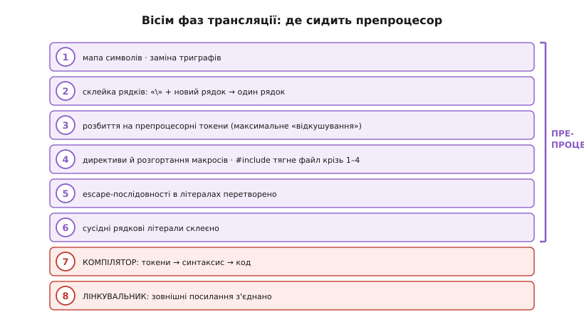
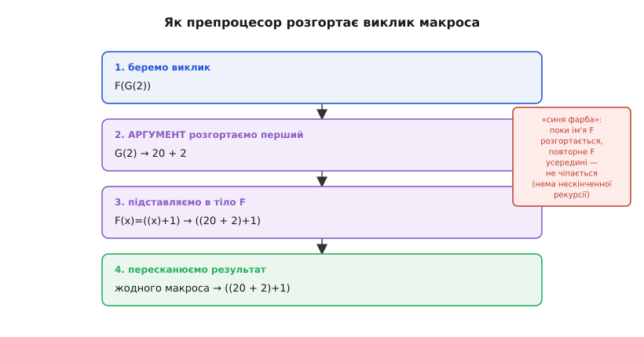

# Препроцесор і заголовки: докладно

<preknowlist>
- [Препроцесор і заголовки (базова)](root:embedded/c-preprocessor-headers) — що препроцесор ріже текст (вставляє/замінює/вирізає), `#include` як буквальна вставка, поділ `.h`/`.c`, сторож, макроси й дві їхні пастки, умовна компіляція. Ця стаття розгортає ту саму механіку глибше й НЕ повторює її.
- [Компіляція](root:sf-lang/compilation) — що компілятор перетворює один `.c`-файл на об'єктний код окремо від інших; препроцесор — його перша частина.
- [Лінкування](root:sf-lang/linking) — що після компіляції окремих файлів лінкувальник зшиває виклики з тілами функцій; пояснює, чому визначення живе в одному `.c`, а оголошення — у `.h`.
- [Цілі типи в C](root:sf-lang/integer-types-c) — знакові/беззнакові, ширина, `intmax_t`; потрібне, бо арифметика `#if` рахує в найширшому цілому.
</preknowlist>

Базова стаття дала робочу картину: препроцесор — окрема текстова фаза, що вставляє файли, замінює імена й ріже код за умовою, нічого не тямлячи в C. Цього досить, щоб писати заголовки й не боятися макросів. Але «нічого не тямить у C» — не пояснення, а обіцянка пояснення. Чому саме він так поводиться? Де рівно проходить межа між ним і компілятором? Чому макрос розгортається саме в *той* текст, а не в очікуваний, і як передбачити результат, не запускаючи `-E` щоразу? Тут ми розберемо препроцесор не як набір директив, а як **маленьку машину з точними правилами** — і побачимо, що всі його дивацтва й пастки випливають з кількох простих законів, які варто знати напам'ять.

## Препроцесор — це не «крок», а перші шість фаз із восьми

Ми звикли думати про збірку як про три коробки: препроцесор → компілятор → лінкувальник. Це правильна картина верхнього рівня, але стандарт C описує процес дрібніше — як **вісім фаз трансляції** (англ. *translation phases*), що виконуються в суворому порядку. Кожна фаза бачить результат попередньої й нічого більше. Знати ці фази корисно не з педантизму: майже кожна «магічна» поведінка препроцесора — це наслідок того, *яка* фаза що робить і *в якому* порядку.


*Те, що ми звемо «препроцесором», — це фази 1–6 стандарту; компілятор і лінкувальник — лише останні дві. Порядок фаз пояснює більшість тонкощів.*

Пройдімо по них, зупиняючись там, де ховається сенс.

**Фаза 1 — мапа символів.** Байти файлу відображаються у внутрішній набір символів. Сюди ж стандарт кладе заміну **триграфів** (англ. *trigraph* — тризнак) — послідовностей на кшталт `??=` замість `#` чи `??(` замість `[`. Їх вигадали для клавіатур, де не було деяких символів ASCII; сьогодні це майже музейний експонат (у C23 їх нарешті прибрали), але сам факт, що заміна відбувається **найпершою**, колись давав химерні баги: рядок `"Що??!"` міг перетворитися на `"Що|"`, бо `??!` — триграф для `|`. Порядок фаз тут — не абстракція, а причина реального сюрпризу.

**Фаза 2 — склейка логічних рядків.** Зворотна коса риска в самому кінці рядка, впритул перед символом нового рядка, **зникає разом із цим переносом**, і два фізичні рядки зливаються в один логічний. Саме ця фаза дає змогу писати довгий макрос у кілька рядків:

```c
#define SWAP(a, b)  do {          \
        typeof(a) _t = (a);       \
        (a) = (b);                \
        (b) = _t;                 \
    } while (0)
```

Кожна `\` наприкінці рядка склеює наступний до попереднього, і препроцесор бачить одне довжелезне визначення. Пастка звідси теж пряма: якщо після `\` затесався бодай один пробіл перед переносом — склейки не буде, бо `\` уже не «впритул перед новим рядком», і макрос обірветься на першому рядку. Компілятор потім видасть незрозумілу помилку геть в іншому місці. Знаючи фазу 2, ви одразу підозрюєте невидимий пробіл.

**Фаза 3 — токенізація.** Ось де народжується головна відмінність від «тексту». Потік символів розбивається на **препроцесорні токени** (англ. *preprocessing token*) — неподільні лексичні одиниці: імена, числа, рядки, знаки операцій. Від цієї фази й далі препроцесор оперує **не символами, а токенами**, і це змінює все — до цього повернемося окремо, бо саме звідси ростуть найтонші пастки макросів.

Розбиває він за правилом **максимального відкушування** (англ. *maximal munch* — «жувати якнайбільше»): на кожному кроці бере найдовшу послідовність символів, що утворює дозволений токен, навіть якщо коротший варіант дав би осмисленіший код. Класичний наслідок:

```c
int a = 10, b = 3;
int c = a/*b;   // хотіли поділити a на *b? ні!
```

`/*` — це найдовший токен, що починається з `/`, і це початок **коментаря**. Препроцесор «відкушує» `/*` цілком, і решта рядка зникає в коментарі. Компілятор побачить обірваний вираз. Тому між `/` і `*` тут потрібен пробіл: `a / *b`. Те саме правило робить `x+++y` завжди `x++ + y`, а ніколи `x + ++y` — бо `++` довше за `+`.

**Фаза 4 — директиви й макроси.** Серце препроцесора. Виконуються всі рядки з `#`, розгортаються всі макроси. Тут `#include` не просто «вклеює файл» — він бере вставлений файл і **проганяє його крізь фази 1–4 окремо**, рекурсивно, перш ніж результат стане на місце директиви. Тобто вставлений заголовок сам проходить свою токенізацію, свою склейку рядків, свої вкладені `#include`. Це пояснює, чому глибина вкладення заголовків обмежена (стандарт гарантує щонайменше 15 рівнів) і чому циклічний `#include` без сторожа зациклив би препроцесор.

**Фаза 5 — escape-послідовності.** Тепер, коли директив уже немає, у символьних і рядкових літералах перетворюються `\n`, `\t`, `\x41` тощо на їхні коди. Важливо, що це **після** макророзгортання: макрос не «бачить» `\n` як символ нового рядка, для нього це два символи-токени.

**Фаза 6 — склейка сусідніх рядкових літералів.** Два рядки поспіль, розділені лише пробілами, зливаються в один: `"Temp=" "25"` стає `"Temp=25"`. Ця дрібничка виявиться вирішальною, коли ми дійдемо до оператора `#` — бо саме на неї спирається трюк зі складанням повідомлень із частин.

**Фази 7–8 — це вже не препроцесор.** Сьома — власне компіляція: препроцесорні токени стають справжніми токенами мови, і компілятор нарешті **розуміє** синтаксис. Восьма — лінкування: зовнішні посилання на функції й дані з'єднуються між об'єктними файлами. Механіку цих двох фаз ми розбираємо в кроках про [компіляцію](root:sf-lang/compilation) і [лінкування](root:sf-lang/linking); тут головне — усвідомити, що **весь препроцесор укладається у фази 1–6 і завершується ще до того, як хоч хтось спробує зрозуміти ваш код як C**.

> 🔧 **Навіщо це.** Порядок фаз — це не теорія, а діагностичний інструмент. Коли складання не працює, спитайте себе: «на якій фазі це ламається?» Пробіл убив склейку рядка — фаза 2. Дивний токен з'їв половину виразу — фаза 3. Макрос розгорнувся не так — фаза 4. Рядок не склеївся у повідомлення — фаза 6. Замість гадати ви локалізуєте проблему в конкретній фазі й дивитеся саме туди — а `gcc -E` показує зріз рівно після фази 4, найкорисніший для більшості багів.

## Препроцесор мислить токенами, а не символами

Це найважливіша ідея, що відрізняє глибоке розуміння від поверхового, і вона суперечить назві «текстовий процесор». Так, на вході й виході — текст. Але **всередині**, від фази 3 і далі, препроцесор оперує токенами. Він не бачить рядок `foo` як три букви — він бачить один токен-ідентифікатор `foo`. І підстановка макросів іде на рівні токенів, а не символів.

Наслідок перший: **пробіли між токенами не мають значення для розпізнавання, але з'являються там, де треба, щоб токени не злиплися.** Розгляньмо:

**Умова:** макрос без пробілу навколо параметра.
```c
#define NEG(x) -x

int a = 3;
int b = NEG(-a);      // що це дасть?
```
```
На рівні токенів тіло -x перетворюється на:  -  (-a)
Препроцесор НЕ склеює - і - у --, бо це окремі токени.
Він вставить пробіл, щоб зберегти їх роздільними:  - -a
Результат:  int b = - -a;   →   b = a = 3   (подвійне заперечення)
```
**Висновок:** якби препроцесор працював посимвольно, він міг би злити `--` в один оператор інкремента й зіпсувати сенс. Токенне мислення захищає: два мінуси лишаються двома мінусами. Це той рідкісний випадок, коли препроцесор рятує вас, а не підставляє.

Наслідок другий, глибший: **макрос не може «залізти всередину» токена.** Якщо ви визначили `#define N 5`, то `N` заміниться на `5` **лише** там, де `N` — окремий токен. У рядку `int SIZEN;` ніякої заміни не буде — `SIZEN` це один токен-ідентифікатор, а не `SIZE` та `N`. І в рядковому літералі `"N дорівнює N"` теж нічого не заміниться: усе між лапками — один токен-рядок, недоторканний для макросів. Ось чому не можна просто «вставити» значення макроса в рядок звичайною підстановкою — для цього існує окремий оператор `#`, до якого ми дійдемо.

Наслідок третій: **макророзгортання не рекурсивне за текстом.** Оскільки препроцесор працює токенами й пам'ятає, яке ім'я зараз розгортає, він не піде у нескінченну петлю на `#define A A`. Це підводить нас до найтоншого — самого алгоритму розгортання.

## Точний алгоритм розгортання макроса

Базова стаття сказала: препроцесор підставляє текст. Правда, але недостатньо, щоб передбачати результат у складних випадках. Насправді розгортання виклику `MACRO(args)` іде за **чіткою послідовністю кроків**, і знання цих кроків — різниця між «працює якось» і «знаю, чому працює».


*Порядок незмінний: аргументи розгортаються перші, підстановка в тіло — друга, «синя фарба» блокує самоповтор, а фінальний пересканн шукає нові макроси в результаті.*

Ось цей порядок для функціоподібного макроса:

1. **Виявлення виклику.** Ім'я макроса має бути окремим токеном, і за ним — дужка `(`. Якщо дужки немає, функціоподібний макрос **не розгортається взагалі** — лишається голим ім'ям. Це, до речі, дає змогу «взяти адресу» такого імені або сховати макрос.

2. **Розгортання аргументів (preexpansion).** Кожен аргумент **сам повністю розгортається як макротекст** — *перш ніж* його підставлять у тіло. Це трапляється завжди, **крім** аргументів, до яких у тілі застосовано `#` або `##` (їх беруть сирими). Саме тут криється більшість несподіванок.

3. **Підстановка в тіло.** Розгорнуті аргументи стають на місця параметрів у тілі макроса.

4. **Обробка `#` і `##`.** Стрингізація й склейка токенів виконуються на цьому кроці, поки навколо ще «сирий» текст.

5. **«Фарбування» (blue paint).** Ім'я макроса, що зараз розгортається, позначається як «уже в роботі». Якщо воно трапиться в результаті — його **не розгортають повторно**. Позначка тримається лише на час цього розгортання й діє на це конкретне ім'я.

6. **Пересканн (rescan).** Отриманий текст переглядається ще раз — на нові виклики макросів. Ті, що знайшлися (і не «пофарбовані»), розгортаються за тими самими правилами, рекурсивно.

Крок 5 — це той запобіжник, що робить `#define A A` безпечним: `A` розгортається в `A`, друге `A` фарбоване, пересканн його не чіпає, петлі немає. І `#define A B` / `#define B A` теж не зациклиться — коли розгортається `A→B`, а тоді `B→A`, друге `A` вже під фарбою першого.

Найкорисніший наслідок — крок 2. Розгляньмо каверзу, яку без алгоритму не пояснити:

**Умова:** макрос, що стрингізує через проміжний шар.
```c
#define VERSION 3

#define STR(x)   #x           // стрингізує СИРИЙ аргумент
#define XSTR(x)  STR(x)       // спершу розгорне аргумент, тоді стрингізує
```
```
STR(VERSION)  →  "VERSION"
   бо в STR застосовано #x — аргумент береться СИРИМ (крок 2 пропускає
   розгортання для #-аргументів), VERSION не встиг стати 3.

XSTR(VERSION)  →  STR(3)  →  "3"
   у XSTR до аргументу # не застосовано, тож на кроці 2 VERSION
   розгортається в 3, і вже 3 передається у STR, який його стрингізує.
```
**Висновок:** щоб застрингізувати *значення* макроса, а не його *ім'я*, потрібні **два шари** — зовнішній розгортає аргумент, внутрішній стрингізує. Це не хитрість заради хитрості, а прямий висновок із кроку 2 алгоритму: `#` заморожує свій аргумент, тож розгортання треба зробити **до** зустрічі з `#`, окремим макросом. Той самий двошаровий прийом знадобиться скрізь, де треба спершу обчислити аргумент, а тоді щось із ним зробити текстово.

> 🔧 **Навіщо це.** Двошаровий `XSTR`/`STR` — не академічна вправа. Він щодня потрібен у прошивці, щоб перетворити числовий макрос версії чи номер піна на рядок для логу: `uart_print("fw " XSTR(FW_MAJOR) "." XSTR(FW_MINOR))`. Без розуміння, чому одного шару мало, ви отримаєте в лозі буквальне `"FW_MAJOR"` замість числа — і довго не второпаєте, чому. Алгоритм розгортання прямо диктує кількість шарів.

## `#` і `##`: перетворення токенів на текст і навпаки

Ці два оператори — головне, чого немає в базовій статті, і саме вони перетворюють макроси з «іменованих сталих» на справжній інструмент генерації коду. Обидва з'явилися не одразу: у первісному препроцесорі Рітчі їх не було, їх **формалізували в стандарті ANSI C** (ANS X3.159-1989, ратифікований 14 грудня 1989 року) — коли макроси вже назріли як повноцінний засіб. До того різні компілятори робили щось подібне брудними трюками з коментарями, і саме цей різнобій ANSI впорядкував.

**Оператор `#` — стрингізація (англ. *stringizing* — перетворення на рядок).** Поставлений перед параметром у тілі макроса, він перетворює **текст переданого аргументу** на рядковий літерал:

```c
#define PIN_NAME(p)  #p

PIN_NAME(GPIO4)    →   "GPIO4"
```

Що важливо й нетривіально: `#` бере аргумент **дослівно, як його написали**, зі збереженням внутрішніх пробілів, зведених до одного, і з екрануванням лапок та бекслешів усередині. `PIN_NAME(a  +  b)` дасть `"a + b"` — зайві пробіли стиснуто до одного, але сам вираз збережено буквою. І, як ми вже бачили, аргумент під `#` **не розгортається** — тому й потрібен зовнішній шар `XSTR`.

Тут стає в пригоді фаза 6 зі списку вище — склейка сусідніх рядкових літералів. Завдяки їй застрингізований шматок можна вбудувати в більше повідомлення без жодних функцій:

```c
#define CHECK(expr)  do { \
    if (!(expr)) uart_print("assert failed: " #expr "\n"); \
} while (0)

CHECK(voltage < 5000);
// розгорнеться приблизно у:
//   if (!(voltage < 5000)) uart_print("assert failed: " "voltage < 5000" "\n");
// а фаза 6 склеїть три літерали в один:
//   "assert failed: voltage < 5000\n"
```

Одним оператором `#` ми дістали в лог **точний текст умови, що не спрацювала**, — а компілятор потім склеїть його з обрамленням у єдиний рядок. Це серце того, як влаштований стандартний `assert`.

**Оператор `##` — склейка токенів (англ. *token pasting* — склеювання токенів).** Він бере два сусідні токени й **зрощує їх в один**:

```c
#define REG(n)   TIMER ## n ## _CTRL

REG(2)    →   TIMER2_CTRL
```

Це принципово інакша дія, ніж просто написати `TIMER2_CTRL`, — бо `n` тут параметр, і ми **будуємо ім'я з частин** на етапі препроцесора. Результат `TIMER2_CTRL` має бути валідним токеном: `##` не «клеїть рядки», а зрощує токени, і якщо зрощене не утворює одного легального токена, це помилка. `1 ## 2` дасть токен `12` (законно), а `+ ## +` дасть `++` (теж законно), але `1 ## .5` — недозволене зрощення.

Із `##` теж працює правило кроку 2: **аргумент біля `##` беруть сирим**, без розгортання. Тому для склейки *значень* потрібен той самий двошаровий трюк, що й для стрингізації:

**Умова:** склеїти префікс зі значенням макроса.
```c
#define ID 7

#define CAT(a, b)   a ## b
#define XCAT(a, b)  CAT(a, b)
```
```
CAT(pin_, ID)   →   pin_ID
   ID біля ## сире → склеїлося буквально pin_ID (не pin_7).

XCAT(pin_, ID)  →   CAT(pin_, 7)  →  pin_7
   у XCAT до ## не застосовано → ID розгорнувся в 7 → тоді склейка.
```
**Висновок:** знову той самий закон — оператори `#` і `##` заморожують сусідній аргумент, тож попереднє розгортання виносять у зовнішній шар. Один раз зрозумівши це на кроці 2 алгоритму, ви передбачаєте поведінку обох операторів без спроб і помилок.

Разом `#` і `##` дають генерацію коду за шаблоном: одним рядком-викликом розгорнути в кілька узгоджених оголошень з іменами, побудованими автоматично. На цьому стоїть один із найпотужніших прийомів препроцесора — **X-макроси**, [коротко розібрані окремо](root:embedded/c-preprocessor-headers/proj-x-macros.md): єдиний список-джерело, з якого `##` і `#` генерують і `enum`, і таблицю рядкових назв, і масив ініціалізаторів — так, що додавши один рядок, ви оновлюєте все узгоджено. Це рятує від класичної біди, коли `enum` і масив його назв розходяться після правки.

## Макроси зі змінним числом аргументів

Ще одна річ поза базовою — макрос, що приймає **скільки завгодно** аргументів. Він незамінний для обгорток над `printf`-подібними функціями логу. Позначка — три крапки `...` у списку параметрів, а всередині тіла пачка переданих аргументів доступна під іменем `__VA_ARGS__`:

```c
#define LOG(fmt, ...)  uart_printf("[%lu] " fmt "\n", millis(), __VA_ARGS__)

LOG("temp=%d", t);
// → uart_printf("[%lu] " "temp=%d" "\n", millis(), t);
```

Тут одразу видно і силу, і давню ваду. Сила: ми додали часову мітку й перенос рядка до будь-якого формату, не знаючи наперед, скільки аргументів піде. Вада: якщо викликати `LOG("готово")` **без** жодного змінного аргументу, `__VA_ARGS__` порожній, і в розгортанні лишається зайва кома перед нічим: `..., millis(), )`. Роками це латали нестандартним розширенням GCC `, ##__VA_ARGS__` — де `##` перед порожнім `__VA_ARGS__` «з'їдав» попередню кому. Прийом працював, але був милицею поза стандартом.

Стандарт C23 нарешті дав чисте розв'язання — оператор **`__VA_OPT__`**: він розгортається у свій вміст, лише якщо змінних аргументів **є хоч один**, і зникає, якщо їх немає:

```c
#define LOG(fmt, ...)  uart_printf("[%lu] " fmt "\n", millis() __VA_OPT__(,) __VA_ARGS__)
```

Кома тепер стоїть **усередині** `__VA_OPT__(...)` і з'являється тільки разом з аргументами. `LOG("готово")` розгорнеться без висячої коми, `LOG("t=%d", t)` — з нею. Це той рідкісний випадок, коли мова закрила застарілу пастку новим, спеціально придуманим оператором, а не черговою милицею.

## Умовна компіляція: препроцесор уміє рахувати

Базова показала `#if DEBUG` та `#ifdef`. Але вираз у `#if` — це не просто «нуль чи не нуль»: препроцесор має **власний арифметичний обчислювач**, і його правила варто знати точно, бо вони інші, ніж у самого C.

По-перше, **уся арифметика `#if` ведеться в найширшому цілому типі** — `intmax_t` для знакових і `uintmax_t` для беззнакових. Ніяких `float`, ніяких `double`: препроцесорні вирази цілочислові. Тому `#if 1/2` — це `0`, а не `0.5`. Це логічно: препроцесор ще не знає типів вашої програми, він працює до компілятора; єдине, що він уміє надійно, — цілочислова математика над константами. Ширина `intmax_t` — з кроку про [цілі типи](root:sf-lang/integer-types-c); саме тому величезні константи в `#if` не переповнюються так, як могли б у вужчому `int`.

По-друге — і це любима пастка — **будь-який ідентифікатор, який препроцесор не знає, у `#if` перетворюється на `0`**. Не помилка, не попередження — просто тихо `0`:

```c
#if MAX_SPEED > 100      // якщо MAX_SPEED ніде не визначено…
```

Якщо `MAX_SPEED` забули визначити, умова стає `#if 0 > 100`, тобто хибна — але **мовчки**, і ви годинами шукаєте, чому гілка не активується. Захист — перевіряти саме факт визначення оператором `defined`:

```c
#if defined(MAX_SPEED) && MAX_SPEED > 100
```

`defined(X)` дає `1`, якщо ім'я `X` визначене макросом, і `0` інакше — **не розгортаючи** саме `X`. Це той самий тест, що ховається за `#ifdef X` (точний синонім `#if defined(X)`) і `#ifndef X` (`#if !defined(X)`). Різниця в тому, що `defined` можна комбінувати логічними операторами в одному складному `#if`, а `#ifdef` — ні.

По-третє, повний набір гілок: `#if` / `#elif` / `#else` / `#endif` працює як звичайний ланцюжок, і **лише перша істинна гілка** лишається, решта зникає. У C23 додали ще й `#elifdef` / `#elifndef` — скорочення для частого `#elif defined`. Це дає компактні розгалуження під платформи:

```c
#if   defined(ESP32)
    #include "hal_esp32.h"
#elif defined(STM32)
    #include "hal_stm32.h"
#else
    #error "Невідома платформа: визначте ESP32 або STM32"
#endif
```

Тут з'явилися дві директиви, яких базова не торкалась. **`#error`** зупиняє складання з вашим повідомленням — незамінно, щоб упіймати неправильну конфігурацію ще на препроцесорі, а не отримати загадкову помилку компілятора десь глибше. Її пара **`#warning`** (спершу розширення, стандартизоване в C23) друкує попередження, не спиняючи збірку, — зручно позначати тимчасові рішення. Правило просте: краще голосно впасти на `#error` з ясним текстом, ніж мовчки зібрати прошивку не під ту плату.

По-четверте, сучасний спосіб перевірити **наявність заголовка** — оператор `__has_include`, стандартизований у C++17 і прийнятий у C23:

```c
#if defined(__has_include)
  #if __has_include(<optional_driver.h>)
    #include <optional_driver.h>
    #define HAVE_DRIVER 1
  #endif
#endif
```

`__has_include(<файл>)` дає `1`, якщо такий заголовок можна вставити, і `0` інакше — тож бібліотека може підхопити необов'язкову залежність, лише якщо вона є, і тихо обійтися без неї, якщо немає. Зовнішнє `defined(__has_include)` тут — гігієна на старіших компіляторах, де самого оператора ще нема.

> 🔧 **Навіщо це.** Тиха заміна невідомого імені на `0` — причина цілого класу «фантомних» багів у прошивці: конфігураційний прапорець назвали з одруку (`#define ENABLE_WDT` замість `ENABLE_WD`), а перевірка `#if ENABLE_WD` мовчки бачить `0`, і сторожовий таймер не вмикається на бойовому пристрої. Компілятор не скаржиться — імені просто «немає». Звичка писати `#if defined(FLAG) && FLAG` і вмикати попередження на невизначені макроси (`-Wundef` у GCC) ловить це на збірці, а не в полі.

## Сторож заголовка: механіка глибше й межі `#pragma once`

Базова пояснила ідею сторожа. Тепер — чому він працює саме так і де його межі, бо це прямо впливає на надійність великого проєкту.

Сторож стоїть на двох властивостях фази 4: препроцесор **пам'ятає визначені імена протягом усього модуля трансляції** й уміє **вирізати** текст між `#ifndef` і `#endif`. Ключове слово — «усього модуля»: прапорець `LED_H`, поставлений при першій вставці `led.h`, лишається визначеним до кінця обробки поточного `.c`, скільки б файлів ще не вставилося. Тому друга, десята, соте входження `led.h` у той самий модуль трансляції пропускаються. Але — важлива межа — **в іншому `.c`-файлі все починається з чистого аркуша**: там `LED_H` знову невизначене, і `led.h` вставиться заново. Сторож захищає від подвійної вставки **в межах одного модуля**, а не «раз на всю програму»; для «раз на програму» служить зовсім інший механізм — визначення в рівно одному `.c` (це вже про [лінкування](root:sf-lang/linking)).

Друга тонкість — **чому ім'я прапорця має бути унікальним**. Якщо два різні заголовки випадково взяли однакове ім'я сторожа, станеться тихе лихо: перший вставиться, поставить прапорець, а другий побачить «уже визначено» й **пропустить себе цілком**, хоч його ще ніхто не вставляв. Оголошення з другого заголовка просто зникнуть, і компілятор скаржитиметься на «невідому функцію» там, де файл начебто вставлено. Тому ім'я беруть максимально своєрідне — не `UTILS_H`, а щось на кшталт `MYLIB_DRIVERS_LED_H_`, часто з назвою проєкту й теки. Це не забаганка стилю, а страховка від мовчазної колізії.

Тепер про `#pragma once`. Базова згадала, що вона поза стандартом і покладається на розпізнавання «того самого файлу». Копнемо глибше, у чому саме різниця механізму. `#ifndef`-сторож працює з **іменем-прапорцем** — суто логічною сутністю, яка від файлової системи не залежить узагалі. `#pragma once` працює з **тотожністю файлу**: компілятор мусить вирішити, чи два шляхи ведуть до одного й того самого фізичного файлу. Зазвичай він порівнює пристрій та inode (в Unix) або нормалізований шлях. І тут криється справжня причина, чому її не стандартизували:

- **Жорсткі й символічні посилання.** Один фізичний файл, видимий під двома різними іменами в різних теках, може обманути порівняння шляхів — і тоді `#pragma once` вставить його двічі, бо «шляхи різні». `inode`-порівняння це витримує, порівняння імен — ні; а стандарт не може вимагати `inode`, бо не всі файлові системи їх мають.
- **Копії того самого заголовка.** Дзеркальна проблема: якщо той самий заголовок фізично **скопійовано** у дві теки (буває в системах збірки, що розкладають залежності), `#pragma once` вважатиме копії різними файлами й вставить обидві — а `#ifndef`-сторож, дивлячись на **однакове ім'я-прапорець** усередині, коректно пропустить другу.

Ось чому для коду, що має збиратися будь-де й будь-чим, канонічна порада — **сторож на `#ifndef`**, а `#pragma once` лишають для проєктів під відомий компілятор, де зручність переважає ризик. Багато великих кодових баз навіть ставлять **обидва** захисти: `#pragma once` для швидкості (компілятор може взагалі не відкривати файл удруге) і `#ifndef` для гарантії. Надлишково, зате надійно на будь-якій платформі.

## Пастки, що не лікуються дужками

Базова назвала дві головні пастки макросів — пропущені дужки й подвійне обчислення аргументу. Тут — глибший шар: пастки **синтаксичні**, які виникають не в самому виразі, а в тому, як макрос стикується з навколишнім кодом. Дужки навколо тіла тут не рятують; потрібні інші прийоми.

**Пастка перша — макрос як оператор у `if` без блока.** Уявіть макрос із двох дій:

**Умова:** макрос із двох операторів, зчеплених крапкою з комою.
```c
#define RESET_PINS()  GPIO_CLR = 0xFF; GPIO_DIR = 0x00

if (fault)
    RESET_PINS();       // здається, обидві дії під if
else
    recover();
```
```
Розгорнеться дослівно у:
    if (fault)
        GPIO_CLR = 0xFF;      ← ЛИШЕ це під if
    GPIO_DIR  = 0x00;         ← а це — ЗАВЖДИ, поза if
    else                       ← «else без if» → помилка компіляції
        recover();
```
**Висновок:** макрос із кількох операторів, вставлений у беззблочний `if`, розриває конструкцію: перший оператор іде під `if`, другий випадає назовні, а `else` лишається без пари. Класичне розв'язання — обгорнути тіло в `do { … } while (0)`:

```c
#define RESET_PINS()  do { GPIO_CLR = 0xFF; GPIO_DIR = 0x00; } while (0)
```

Тепер `RESET_PINS();` — один синтаксичний оператор (цикл, що виконується рівно раз), і `;` після нього стає природним завершенням. Ідіома `do{…}while(0)` виглядає дивно, поки не усвідомиш **навіщо**: це єдиний спосіб у C склеїти кілька операторів в один так, щоб він поводився коректно й з крапкою з комою після, і всередині `if/else`. Порожні фігурні дужки `{ … }` без `while(0)` не годяться — після них `;` уже зайва й знову ламає `else`.

**Пастка друга — кома як розділювач аргументів.** Препроцесор ділить аргументи макроса за комами **на верхньому рівні дужок**. Тому кома всередині аргументу, не захищена дужками, розірве його на два:

```c
#define FIRST(a, b)  (a)

FIRST(arr[i], j)         // гаразд: дві коми? ні, одна — два аргументи
// а от так — біда:
int x = MAX(a, b);       // якщо MAX(x,y), то передали a і b — добре
// але спробуйте передати ініціалізатор:
SOME_MACRO({1, 2, 3});   // кома всередині {} НЕ захищена дужками!
```

`{1, 2, 3}` препроцесор бачить не як один аргумент, а як **три** (`{1`, `2`, `3}`), бо фігурні дужки для нього — звичайні токени, а не групування; групують лише **круглі** дужки. Захист — зайва пара круглих дужок навколо коматого аргументу, або, для типів із комами, окремий `typedef`. Ось чому в бібліотечних макросах іноді бачите на позір зайві `(( ))` — вони ховають внутрішні коми від препроцесорного поділу.

**Пастка третя — `#` та `##` не дружать із розгорнутим текстом.** Ми це вже вивели з алгоритму, але варто закріпити як пастку: якщо ви пишете `#define WARN(x) log(#x)` і викликаєте `WARN(TIMEOUT)`, а `TIMEOUT` — макрос зі значенням `5000`, у лог піде `"TIMEOUT"`, **а не** `"5000"`. Це не баг, а прямий наслідок «сирого» аргументу під `#`; хочете значення — робіть двошарову обгортку. Пастка тут психологічна: код *виглядає* так, ніби має надрукувати число.

> 🔧 **Навіщо це.** Усі три пастки об'єднує те, що макрос коректний **сам по собі**, а ламається **на стику** з кодом навколо — і компілятор указує на місце помилки далеко від справжньої причини. У прошивці, де макросами часто обгортають роботу з регістрами й критичними секціями, `do{…}while(0)` — не стильова примха, а обов'язкова обгортка будь-якого багатооператорного макроса; без неї одна беззблочна гілка `if` тихо зіпсує логіку захисту чи ініціалізації периферії.

## Передвизначені макроси: те, що препроцесор знає сам

Насамкінець — цілий пласт, якого базова не торкалась: макроси, які препроцесор визначає **сам**, без жодного вашого `#define`. Вони — вікно в те, що препроцесор знає про час, місце й середовище складання.

- **`__FILE__`** — рядок з ім'ям поточного файлу; **`__LINE__`** — номер поточного рядка (число). Разом вони дають прив'язку до місця в коді — основа будь-якого логу помилок і того самого `assert`.
- **`__DATE__`** і **`__TIME__`** — рядки з датою й часом **складання** (не запуску!). Зручно вшити в прошивку мітку збірки, щоб у полі бачити, яка версія залита.
- **`__STDC__`** — визначено (зазвичай `1`), якщо компілятор відповідає стандарту C; **`__STDC_VERSION__`** каже, якому саме (`201710L` для C17, `202311L` для C23). Через нього код вмикає нові можливості лише там, де вони є.
- **`__func__`** — формально не макрос препроцесора, а особливий ідентифікатор, що компілятор підставляє як ім'я поточної функції; згадую поруч, бо в логах його вживають разом із `__FILE__`/`__LINE__`.

Складімо все вивчене в одну живу конструкцію — власний `assert`, який точно показує, що і де зламалося:

```c
#define ASSERT(cond)                                       \
    do {                                                   \
        if (!(cond)) {                                     \
            uart_printf("ASSERT failed: %s\n"              \
                        "  at %s:%d in %s()\n",            \
                        #cond, __FILE__, __LINE__, __func__); \
            for (;;) { }   /* спинитися, щоб побачити */   \
        }                                                  \
    } while (0)
```

Тут працює **все разом**: `do{…}while(0)` робить макрос безпечним оператором; `#cond` стрингізує саму умову в її вихідному вигляді; `__FILE__`, `__LINE__`, `__func__` дають точну адресу; склейка сусідніх рядкових літералів (фаза 6) зшиває формат із кількох частин в один. Виклик `ASSERT(temp < 85)` при спрацюванні надрукує в UART точний рядок з умовою, файлом, номером рядка й функцією — і зупинить процесор. Це не іграшка: майже так і влаштований стандартний `assert` із `<assert.h>`, і власний варіант часто пишуть саме тому, що на мікроконтролері треба своя реакція на збій (мигнути світлодіодом, записати в лог, перезавантажитися), а не абстрактне «завершити програму».

Зверніть увагу, як природно зійшлися нитки цієї статті: щоб зрозуміти цей `assert`, треба знати і про токенне мислення (чому `#cond` бере умову дослівно), і про алгоритм розгортання (чому аргумент під `#` не обчислюється), і про фазу склейки літералів, і про синтаксичну пастку `do{…}while(0)`. Кожна з дрібниць, що спершу виглядала окремою тонкістю, тут склалася в одну робочу річ.

## Що лишити в голові

Препроцесор — не «крок», а **фази 1–6 з восьми**, і порядок цих фаз пояснює його химери: склейку рядків `\` (фаза 2), максимальне відкушування токенів (фаза 3), рекурсивний `#include` крізь власні фази (фаза 4), склейку сусідніх літералів (фаза 6). Від фази 3 він мислить **токенами, а не символами** — тому не залазить усередину слів і рядків і не зациклюється на самоповторі. Розгортання макроса йде **точним порядком**: аргументи розгортаються перші (крім сусідніх із `#`/`##`), потім підстановка, «синя фарба» проти рекурсії, пересканн, — і саме звідси випливає, чому для стрингізації чи склейки *значень* потрібні **два шари**. Оператори `#` і `##` (з ANSI C 1989) перетворюють токени на текст і назад, даючи генерацію коду; `__VA_ARGS__`/`__VA_OPT__` — змінне число аргументів для логів. `#if` має **власну цілочислову арифметику**, де невідоме ім'я тихо стає `0`, тож перевіряй `defined`; `__has_include`, `#error`, `#elifdef` — сучасний інструментарій розгалужень. Сторож захищає **в межах одного модуля** й вимагає унікального імені; `#pragma once` зручніша, але залежить від тотожності файлу. А синтаксичні пастки — беззблочний `if`, коми в аргументах, «сирий» `#` — лікуються не дужками, а `do{…}while(0)` і зайвими круглими дужками. Далі ми з таких файлів [зберемо цілий проєкт](root:embedded/c-modules-build) і навчимо тулчейн будувати його однією командою — і вся ця препроцесорна механіка працюватиме там на кожному кроці.
