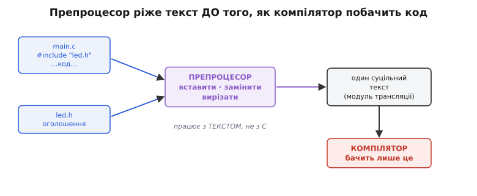
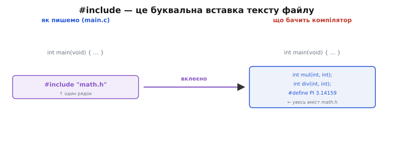
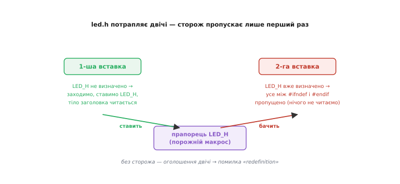

# Препроцесор і заголовки

Досі кожну програму ми вміщали в один файл. Функції, структури, бітові маски — усе жило поруч, і компілятор бачив цілу картину. Але прошивка навіть для простого пристрою — це десятки файлів: окремо драйвер світлодіода, окремо робота з таймером, окремо логіка протоколу. Тут виникає проста, але незручна проблема: **як файл `main.c` дізнається, що функція `led_on()` узагалі існує, якщо її написано в іншому файлі `led.c`?**

Компілятор опрацьовує кожен `.c`-файл окремо, ізольовано від решти. Він не заглядає в сусідні файли сам. Тому в `main.c` треба якось *оголосити*: «є десь функція `led_on`, яка нічого не приймає й нічого не повертає». Одне оголошення — не проблема, написав рядок і забув. Проблема, коли таких функцій, структур і констант — сотні, і використовує їх десяток файлів. Переписувати ці оголошення в кожному файлі вручну — божевілля: одну поправив, дев'ять забув, і збірка розсипалася.

Розв'язок напрошується сам: винести спільні оголошення в окремий файл і якось «вставляти» його там, де треба. Саме це й робить **препроцесор** (від лат. *prae* — перед, *processus* — обробка): окремий крок, який працює з вашим кодом **до** компілятора й готує текст, який компілятор урешті побачить.

## Окрема фаза, яка ріже текст

Найважливіше, що треба зрозуміти про препроцесор одразу: **він не розуміє мови C**. Він не знає, що таке функція, тип чи цикл. Для нього ваш `.c`-файл — просто потік символів, рядки тексту. Він уміє три речі: **вставити** вміст одного файлу в інший, **замінити** одні шматки тексту на інші, **вирізати** частину тексту за умовою. І все. Ці операції він виконує суто механічно, як розумний «знайти-й-замінити», а результат — уже готовий, «розгорнутий» текст — передає компілятору.


*Вихідні файли проходять через препроцесор, який лише ріже текст; компілятор отримує вже один суцільний «модуль трансляції» — і саме його аналізує як код.*

Ця роздільність — не історична випадковість, а стрижень усього дизайну. Оскільки препроцесор нічого не тямить у C, його команди — окрема мова поверх C, зі своїм синтаксисом. Кожна така команда — **директива** (від лат. *directus* — спрямований) — починається з решітки `#` на початку рядка й діє до кінця цього рядка (не до крапки з комою, як звичайні оператори C). Це відразу видає рядок препроцесора з-поміж коду.

> 🔧 **Навіщо це.** Розуміння, що препроцесор — окрема текстова фаза, рятує від найтупіших помилок. Коли компілятор лається «expected ‘;’ before …» у місці, де все ніби правильно, майже завжди винен макрос, який розгорнувся не в той текст, на який ви розраховували. Компілятор бачить *результат* підстановки, а не те, що ви написали. Тому налагоджувати такі речі треба, дивлячись на розгорнутий текст, а не на вихідний.

Показати цей розгорнутий текст можна й самому — компілятор уміє зупинитися одразу після препроцесора. Для GCC чи Clang це прапорець `-E`:

```sh
gcc -E main.c -o main.i
```

У файлі `main.i` побачите свій код, де всі `#include` вже вклеєні, а всі макроси розгорнуті. Це найкращий спосіб зрозуміти, що насправді відбувається, коли щось іде не так.

## `#include` — це буквальна вставка

Перша й найчастіша директива — `#include` (англ. *include* — включити, вмістити). Вона робить рівно одне: **бере весь текст указаного файлу й вставляє його на місце цього рядка**. Не «підключає бібліотеку», не «імпортує символи» — фізично вклеює вміст, символ у символ, ніби ви скопіювали його руками.


*Ліворуч — те, що пишемо: один рядок `#include`. Праворуч — те, що бачить компілятор: увесь вміст указаного файлу, вклеєний на місце директиви.*

Форма буває дві, і різниця в них лише в тому, **де** препроцесор шукає файл:

```c
#include <stdint.h>     // кутові дужки — системні теки (стандартна бібліотека, SDK)
#include "led.h"        // лапки — спершу поряд із поточним файлом, потім системні
```

Кутові дужки кажуть шукати серед «офіційних» тек, які знає компілятор і які додає ваш тулчейн. Лапки кажуть спершу глянути поруч із файлом, де стоїть директива, а вже потім — там само, де й для дужок. На практиці правило просте: **своє — у лапках, чуже (стандартне, з SDK) — у дужках**.

Файл, який зазвичай вставляють через `#include`, називають **заголовком** (англ. *header* — заголовок, шапка), і за традицією він має розширення `.h`. Але підкреслю: для препроцесора розширення нічого не значить — він вставить будь-який файл, хоч `.txt`. `.h` — лише домовленість між людьми, щоб з першого погляду відрізняти файл-заголовок від файлу-реалізації.

## Заголовок і реалізація: інтерфейс окремо від нутрощів

Тепер збирається головна ідея, заради якої все й затівалося. Код розкладають на дві частини — і це чи не найважливіша звичка в C.

**Заголовок `.h` — це інтерфейс** (від лат. *inter* — між, *facies* — обличчя): він *оголошує*, що існує, але не каже, як воно працює. Прототипи функцій, оголошення структур, константи. Це «обкладинка» модуля — те, що інші файли мусять знати, щоб ним користуватися.

**Файл `.c` — це реалізація**: сам код функцій, їхні нутрощі. Це те, що інші файли знати **не повинні** — їм байдуже, *як* саме `led_on()` вмикає світлодіод, важливо лише, що така функція є й що вона робить.

Розгляньмо це на живому прикладі — драйвер світлодіода:

**Заголовок `led.h` — оголошуємо, що вміє модуль:**
```c
#include <stdint.h>          // потрібен тип uint8_t для оголошень нижче

void led_init(void);         // прототип: функція є, ось її форма
void led_on(uint8_t pin);    // тіла тут немає — лише обіцянка
void led_off(uint8_t pin);
```

**Реалізація `led.c` — пишемо, як воно працює:**
```c
#include "led.h"             // свій же заголовок — щоб узгодити оголошення з тілом

void led_init(void) {
    // тут справжня робота з регістрами GPIO
}
void led_on(uint8_t pin) {
    GPIO_OUT_SET = (1u << pin);   // виставити біт піна
}
void led_off(uint8_t pin) {
    GPIO_OUT_CLR = (1u << pin);
}
```

**Користувач `main.c` — просто вмикає:**
```c
#include "led.h"             // дізнаємося, що вміє драйвер

int main(void) {
    led_init();
    led_on(2);
    return 0;
}
```

Зверніть увагу на річ, яка спершу дивує: `led.c` вставляє **власний** заголовок `led.h`. Навіщо? Щоб компілятор, збираючи `led.c`, побачив і оголошення, і тіло поруч — і **звірив** їх. Якщо в заголовку написано `void led_on(uint8_t)`, а в тілі ви випадково зробили `void led_on(int)`, компілятор одразу впіймає розбіжність. Заголовок стає контрактом, який реалізація зобов'язана виконати.

> 🔧 **Навіщо це.** Поділ на `.h` і `.c` — це фізичне втілення межі між «що» і «як». Поки інтерфейс у заголовку не змінився, ви можете переписати нутрощі `led.c` хоч десять разів — жоден інший файл не треба чіпати й навіть перекомпільовувати наново більшість із них. Це те, що дає змогу великому проєкту рости: кожен модуль — чорна скринька зі стабільною обкладинкою. Саме так побудована вся прошивка, з якою ми працюватимемо далі.

Що робити, а чого не робити в заголовку, тримається на одному питанні: **чи потрібне це стороннім, щоб мною користуватися?** Прототипи, спільні структури, публічні константи — так, у заголовок. Тіла функцій, внутрішні допоміжні дрібниці — ні, у `.c`. Кожне визначення функції має жити рівно в одному `.c`; заголовок лише оголошує. Механізм, який зшиває оголошення в одному файлі з визначенням в іншому, — це вже наступний крок, [лінкування](root:sf-lang/linking): компілятор перетворює кожен `.c` окремо, а лінкувальник знаходить, де насправді лежить тіло кожної викликаної функції, і з'єднує виклики з ними.

## Сторож проти подвійної вставки

Коли модулів багато, майже неминуче стається таке: заголовок потрапляє у файл **двічі**. Скажімо, `sensor.h` вставляє `types.h` (потрібні спільні типи), і `led.h` теж вставляє `types.h`. А ваш `main.c` вставляє обидва — `sensor.h` і `led.h`. Оскільки `#include` — буквальна вставка, вміст `types.h` вклеїться в `main.c` **двічі**.

Для констант це ще пів біди, а от оголосити ту саму структуру двічі — уже помилка: компілятор скаже «redefinition», перевизначення. Потрібен спосіб сказати: «цей текст вставляй щонайбільше один раз на файл, скільки б разів його не просили».

Тут стає в пригоді те, що препроцесор уміє **пам'ятати** визначені імена й **вирізати** текст за умовою. Класичний прийом — **сторож заголовка** (англ. *include guard* — охорона включення):

```c
#ifndef LED_H          // «якщо ще НЕ визначено ім'я LED_H…»
#define LED_H          // …то одразу його визначаємо (як прапорець)

#include <stdint.h>
void led_init(void);
void led_on(uint8_t pin);
void led_off(uint8_t pin);

#endif                 // кінець захищеної ділянки
```

Логіка — як засув на дверях. `#ifndef` (скорочення від *if not defined* — якщо не визначено) перевіряє, чи вже відоме препроцесору ім'я `LED_H`. Першого разу воно невідоме — умова істинна, препроцесор заходить усередину, найперший рядок `#define LED_H` ставить прапорець, і тіло заголовка читається як звичайно. Коли ж той самий файл вставляється вдруге, `LED_H` **уже** визначено — умова хибна, і весь текст аж до `#endif` препроцесор мовчки викидає. Оголошення потрапляють у файл рівно один раз.


*Прапорець-макрос ставиться при першій вставці; при другій сторож бачить його вже визначеним і пропускає все тіло заголовка — тож жодного подвійного оголошення.*

Прапорець `LED_H` — це порожній макрос: у нього немає значення, важливий лише сам факт, що ім'я «існує». Ім'я беруть під файл (звідси `LED_H` для `led.h`), щоб сторожі різних заголовків не переплуталися. **Кожен ваш заголовок має бути обгорнутий таким сторожем** — це не забаганка, а обов'язкова гігієна.

Є й коротший спосіб — одинарний рядок на початку файлу:

```c
#pragma once
```

Одна ця директива робить те саме: файл вставиться щонайбільше раз. Вона зручніша (не треба вигадувати унікальне ім'я й не можна помилитися з ним), і майже всі сучасні компілятори її розуміють. Але є підступ: `#pragma once` **не входить до стандарту C** — це домовленість компіляторів, а не гарантія мови. Причина, чому її так і не стандартизували, суто технічна: щоб `#pragma once` спрацював, компілятор мусить надійно розпізнати, що два різні шляхи ведуть до **одного** файлу. А з жорсткими й символічними посиланнями (коли один фізичний файл видно під різними іменами в різних теках) це не завжди вдається зробити правильно. Класичні `#ifndef`-сторожі від цієї проблеми не залежать — вони працюють з іменем-прапорцем, а не з файлом. Тому для коду, який має збиратися будь-де й будь-чим, надійніший вибір — старий добрий сторож на `#ifndef`.

## `#define` — заміна тексту й макроси

Друга опора препроцесора — `#define` (англ. *define* — визначити). Вона каже: «усюди далі, де побачиш оцей шматок тексту, заміни його на оцей інший». Найпростіший випадок — іменована стала:

```c
#define LED_PIN 2
#define UART_BAUD 115200
```

Тепер кожне входження `LED_PIN` у коді препроцесор ще до компіляції замінить на `2`. Компілятор ніякого `LED_PIN` не побачить — тільки голе число. Навіщо так, якщо можна просто написати `2`? Заради **сенсу й однієї точки правди**: рядок `led_on(LED_PIN)` читається як «увімкни світлодіодний пін», а не як загадкове `led_on(2)`; а коли світлодіод переїде на інший пін, ви поправите одне число в одному місці, і воно розійдеться скрізь.

За тим самим `#define` ховається й потужніший інструмент — **макрос** (від гр. *makrós* — великий, довгий): заміна не голого імені, а шаблону з **параметрами**. Виглядає майже як функція:

```c
#define SQUARE(x) ((x) * (x))
#define MIN(a, b) ((a) < (b) ? (a) : (b))
```

Коли препроцесор бачить `SQUARE(k + 1)`, він підставляє аргумент `k + 1` на місце `x` у шаблоні й отримує `((k + 1) * (k + 1))`. Це знову-таки чиста текстова підстановка — жодного обчислення, самий монтаж рядка.

І тут криється найголовніша пастка макросів, через яку в шаблоні всюди стоять дужки. Розгляньмо, що станеться **без** них:

**Умова:** макрос без дужок і невинний виклик.
```c
#define SQUARE(x) x * x      // ПОГАНО — дужок немає

int r = SQUARE(1 + 2);       // хотіли 9
```
```
Препроцесор підставляє текст «1 + 2» замість x, дослівно:
    SQUARE(1 + 2)  →  1 + 2 * 1 + 2
Тепер це рахує компілятор за пріоритетом операцій:
    1 + (2 * 1) + 2  =  5        ← а не 9!
```
**Висновок:** без дужок навколо `x` і навколо всього виразу текст склеївся не так, як ви думали. Версія `((x) * (x))` дала б `((1 + 2) * (1 + 2)) = 9`. Тому **золоте правило макросів: дужки навколо кожного параметра і навколо всього тіла.**

Друга пастка не лікується жодними дужками — **подвійне обчислення аргументу**. Макрос буквально вставляє аргумент стільки разів, скільки той згаданий у тілі. Якщо аргумент має побічний ефект, ефект спрацює двічі:

**Умова:** інкремент усередині макроса `MIN`.
```c
int a = 5, b = 10;
int m = MIN(a++, b);         // ((a++) < (b) ? (a++) : (b))
```
```
a++ підставилося ДВІЧІ. Якщо гілка з a++ спрацює,
a збільшиться не на 1, а на 2 — і значення виходить геть не те,
що очікуєш від «мінімуму».
```
**Висновок:** макрос — не функція; він не обчислює аргумент, а копіює його текст. Тому в аргументи макросів не пхають нічого з побічним ефектом (`a++`, виклики функцій, читання регістрів).

> 🔧 **Навіщо це.** Постає розумне питання: якщо макроси такі підступні, навіщо вони взагалі, коли є звичайні функції? Три причини, і всі вагомі для прошивки. По-перше, макрос-стала (`#define LED_PIN 2`) стає числом ще до компіляції — ідеально для розмірів масивів і констант, які мусять бути відомі на етапі збірки. По-друге, макрос **не має типу** — той самий `MIN` працює і для `int`, і для `float`, і для `uint8_t`, тимчасом як функцію довелося б писати окремо під кожен тип. По-третє, підстановка тексту не має накладних витрат на виклик — а на дрібному мікроконтролері, де ми рахуємо такти й байти, це інколи важить. Через це в прошивці макроси досі живі, попри всі пастки — просто з ними поводяться обережно.

Одна порада наостанок про сталі: там, де тип **потрібен**, у сучасному C і C++ часто беруть не `#define`, а `const` чи `enum` — компілятор тоді перевірить тип і краще діагностує помилку. Але для розмірів, бітових масок і суто-препроцесорних умов `#define` лишається на своєму місці.

## Умовна компіляція: різати код за умовою

Останнє вміння препроцесора — **вирізати** цілі шматки коду залежно від умови, ще до компіляції. Це **умовна компіляція** (англ. *conditional compilation*), і для прошивки вона незамінна.

Уявіть, що та сама прошивка має збиратися під дві плати: на одній світлодіод на піні 2, на іншій — на піні 5. Або що у «зневаджувальній» збірці ви хочете сипати діагностику в UART, а в бойовій — ні (щоб не гальмувати й не займати місце). Розв'язання — тримати обидва варіанти в коді, а препроцесор нехай лишить потрібний і викине зайвий:

```c
#define DEBUG 1                 // 1 — зневадження увімкнено, 0 — вимкнено

#if DEBUG
    uart_print("led_on: pin=");
    uart_print_int(pin);
#endif
```

`#if` перевіряє умову; якщо вона правдива — текст усередині лишається, якщо ні — його немає, наче й не писали. Коли `DEBUG` буде `0`, ці рядки не потраплять у прошивку **взагалі** — вони не «пропускаються під час виконання», вони фізично зникають ще до компілятора. Жодного зайвого байта у флеші, жодного зайвого такту.

Часто перевіряють не значення, а **сам факт**, що ім'я визначене — тими самими `#ifdef` / `#ifndef`, що й у сторожі заголовка:

```c
#ifdef ESP32
    // код під ESP32
#else
    // код під інший чип
#endif
```

Звідки береться таке ім'я, як `ESP32`? Його або визначають у коді через `#define`, або — і це найтиповіше — **передають ззовні, з команди збірки**. У GCC та Clang для цього є прапорець `-D`:

```sh
gcc -DDEBUG=1 -DESP32 main.c ...
```

Тобто ви керуєте тим, який код увійде у прошивку, **не чіпаючи самих файлів** — самою лише командою збірки. Один код, різні збірки: та сама база під різні плати, різні конфігурації, різні режими. Саме так реальні прошивки й будують — і побудову проєкту з багатьох файлів та керування нею ми розберемо [наступним кроком](root:embedded/c-modules-build).

Ще одне поширене застосування — захист від різниці між компіляторами й платформами. Стандартні заголовки рясніють умовною компіляцією, щоб той самий `#include` дав правильний код і на вашому ПК, і на мікроконтролері. Вам це майже завжди приховане, але тепер ви знаєте, що за тими `#ifdef` ховається: усе той самий текстовий скальпель, що ріже код за умовою.

## Звідки все це взялося

Ця текстова надбудова над C — не пізніший додаток, а майже ровесник самої мови: препроцесор з'явився близько 1973 року, коли Денніс Рітчі ще формував C у Bell Labs. Цікаво, що спершу він був **необов'язковим** — його навіть не запускали, поки на початку файлу не стояв особливий знак, — а `#define` тоді вмів лише голу заміну імені, без жодних параметрів. Аргументи до макросів і саму умовну компіляцію додали трохи згодом інші люди. Коротку [історію препроцесора](root:embedded/c-preprocessor-headers/hist-preprocessor-origins.md) — від традиції макромов Bell Labs до того, як `#include` перекочував із BCPL, — винесено окремо; вона пояснює, чому цей інструмент саме такий, який є, з усіма його дивацтвами.

## Що лишити в голові

Препроцесор — окрема **текстова** фаза перед компілятором: він вставляє, замінює й вирізає текст, нічого не тямлячи в C. `#include` — буквальна вставка вмісту файлу. Код розкладають на **заголовок** `.h` (інтерфейс: оголошення, що є) і **реалізацію** `.c` (нутрощі: як воно працює), і кожен заголовок обгортають **сторожем** (`#ifndef`/`#define`/`#endif` або `#pragma once`) проти подвійної вставки. `#define` замінює текст — від іменованих сталих до макросів із параметрами, де дужки й побічні ефекти — головні граблі. А `#if`/`#ifdef` ріжуть код за умовою, даючи з одного джерела різні збірки під різні плати й режими. Далі ми зберемо з таких файлів цілий проєкт і навчимо тулчейн будувати його однією командою.
