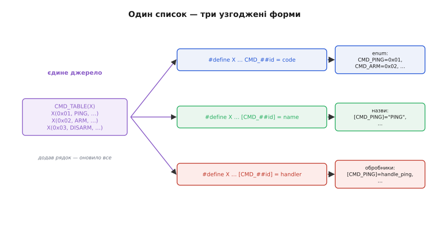

# ⚙️ X-макроси: один список — узгоджений enum, назви й таблиця

Уявіть звичайну прошивку, що говорить із зовнішнім світом простим протоколом. Наземна станція шле пакети з байтом-командою: `0x01` — «пінг», `0x02` — «озброїти», `0x03` — «роззброїти», і так далі. У коді ці команди живуть у трьох різних місцях одночасно, і кожне мусить бути узгоджене з рештою двох:

1. **`enum`** — щоб писати `CMD_ARM`, а не магічне `0x02`, і щоб компілятор ловив одруки в іменах.
2. **Масив рядкових назв** — щоб у лог і в UART-консоль сипати `"ARM"`, а не голе число, коли розбираєш, що там пристрій отримав.
3. **Таблиця обробників** — масив, що для кожної команди тримає вказівник на функцію, яка її виконує; за нею диспетчер знаходить, кого кликати на прийнятий байт.

Три списки, які **описують те саме**, але записані окремо. І щойно команд стає більше десятка, ці три списки починають тихо розходитися — саме тут X-макроси перетворюються з цікавинки на інструмент, що рятує бойову прошивку від класу помилок, який інакше ловиться лише в полі.

## Задача: чому три списки завжди розходяться

Спершу переконаймося, що біль реальний, а не вигаданий заради приводу показати прийом. Ось як цей код виглядає «в лоб», без жодних хитрощів:

```c
// Список 1 — перелік команд.
typedef enum {
    CMD_PING    = 0x01,
    CMD_ARM     = 0x02,
    CMD_DISARM  = 0x03,
    CMD_SET_PWM = 0x04,
    CMD_REBOOT  = 0x05,
} cmd_id_t;

// Список 2 — назви для логу. Індекс мусить збігатися з кодом команди.
static const char *CMD_NAME[] = {
    [CMD_PING]    = "PING",
    [CMD_ARM]     = "ARM",
    [CMD_DISARM]  = "DISARM",
    [CMD_SET_PWM] = "SET_PWM",
    [CMD_REBOOT]  = "REBOOT",
};

// Список 3 — обробники. Знову той самий перелік, утретє.
static const cmd_handler_t CMD_HANDLER[] = {
    [CMD_PING]    = handle_ping,
    [CMD_ARM]     = handle_arm,
    [CMD_DISARM]  = handle_disarm,
    [CMD_SET_PWM] = handle_set_pwm,
    [CMD_REBOOT]  = handle_reboot,
};
```

Виглядає охайно й працює. Проблема не в тому, як воно виглядає, а в тому, що станеться за півроку, коли треба буде додати команду `CMD_CALIBRATE = 0x06`. Ви впишете її в `enum` — і майже напевно **забудете** дописати рядок у `CMD_NAME` або в `CMD_HANDLER`, бо вони в іншому файлі, а то й в іншій частині того самого файлу, за сотні рядків. Компілятор при цьому **не скаже ні слова**: масиви в C не зобов'язані покривати весь діапазон `enum`, і пропущений елемент просто мовчки лишиться `NULL` (для вказівника) чи `""` (для рядка).

Розгляньмо, чим це обертається в кожному з двох випадків розходження — бо характер збою в них різний, і другий значно підступніший.

**Умова:** додали команду в `enum`, забули в масиві обробників.
```c
// enum отримав CMD_CALIBRATE = 0x06,
// а CMD_HANDLER лишився без рядка [CMD_CALIBRATE] = handle_calibrate.

cmd_id_t id = incoming_byte;          // прийшло 0x06
cmd_handler_t fn = CMD_HANDLER[id];   // fn == NULL — комірку ніхто не заповнив
fn(payload, len);                     // виклик за NULL → hard fault
```
**Висновок:** пропуск у таблиці обробників — це виклик нульового вказівника на функцію, тобто миттєвий hard fault на пристрої, і стек-трейс покаже місце **виклику** `fn(...)`, а не те місце, де ви забули дописати рядок. Причина й симптом розведені на різні файли — найгірший тип бага.

**Умова:** зсунувся код команди, масив назв поїхав відносно `enum`.
```c
// Хтось вставив CMD_STATUS між PING і ARM, зсунувши всі коди нижче.
// Масив CMD_NAME правили окремо і забули пересунути рядки.

log_printf("cmd: %s\n", CMD_NAME[CMD_ARM]);   // друкує "DISARM"?!
```
**Висновок:** тут **нічого не падає** — код працює далі, тільки в лозі тепер написана не та назва. Ви годинами шукаєте баг у логіці, довіряючи лозі, а бреше саме лог. Це той рід розходження, що не ловиться нічим, крім уважного ока, — і саме його X-макроси роблять неможливим за побудовою.

> 🔧 **Навіщо це.** У бойовій прошивці перелік команд протоколу — річ, що росте роками: нові режими, нові налаштування, нові діагностичні запити. Кожне додавання руками в три місця — це три шанси помилитися, і два з трьох способів помилитися компілятор не побачить. Ціна — або hard fault у полі, або тихо брехливий лог під час розбору аварії, коли правда потрібна найбільше. X-макроси прибирають саму можливість такого розходження: списків фізично лишається один.

## Ідея: один список-джерело, багато розгортань

Корінь усіх бід — **дублювання джерела істини**. Той самий перелік записано тричі, і синхронність трьох копій тримається лише на вашій пам'яті. Напрошується розв'язок: записати перелік **один раз** і з цього єдиного запису **згенерувати** всі три похідні форми — так, щоб додавання одного рядка в джерело автоматично оновило й `enum`, і назви, і таблицю обробників за один прохід препроцесора.

Саме це й робить прийом X-макросів. Ідея тримається на двох речах, які ви вже знаете з препроцесора: макрос може приймати **параметри** й підставляти їх у шаблон, а `#include` — це буквальна вставка тексту, яку можна повторити скільки завгодно разів. З'єднавши їх, дістаємо генератор.

Список-джерело записуємо як **один макрос-таблицю**. Кожен його рядок — виклик якогось макроса-рядка `X(...)` з усіма даними про одну команду: код, ім'я-ідентифікатор, назва-рядок, обробник. Сам `X` тут **ще не визначений** — це навмисне: список лише перелічує рядки, а що з кожним рядком робити, вирішимо пізніше, визначивши `X` по-різному перед кожним розгортанням.

```c
// cmd_table.h — ЄДИНЕ джерело істини про команди протоколу.
// Кожен рядок: X(код, ідентифікатор, назва-рядок, обробник).
// Макрос X тут НАВМИСНО не визначений — його задає той, хто розгортає список.

#define CMD_TABLE(X)                                   \
    X(0x01, PING,    "PING",    handle_ping)           \
    X(0x02, ARM,     "ARM",     handle_arm)            \
    X(0x03, DISARM,  "DISARM",  handle_disarm)         \
    X(0x04, SET_PWM, "SET_PWM", handle_set_pwm)        \
    X(0x05, REBOOT,  "REBOOT",  handle_reboot)
```

> 🔧 **Навіщо це.** Погляньте, що ми виграли ще до того, як згенерували бодай один список. Тепер **фізично неможливо** описати команду не до кінця: кожен рядок містить одразу всі чотири факти про неї, поруч, в одному місці. Немає окремого масиву назв, який можна забути; немає окремої таблиці обробників, що поїде відносно кодів. Джерело істини стало одне — а все інше буде його **проєкцією**, яку порахує препроцесор, а не людина.

Тепер магія в тому, як з цього одного списку дістати три різні речі. Перед кожним використанням `CMD_TABLE` ми **визначаємо `X`** так, щоб він виймав із рядка потрібні поля й будував потрібну форму, розгортаємо список, а тоді `X` **прибираємо** через `#undef`, щоб наступне розгортання могло визначити його інакше. Один список, тричі проведений крізь різні визначення `X`, — три узгоджені результати.


*Єдиний список ліворуч розгортається тричі — кожне розгортання підставляє своє визначення `X`, що вибирає з рядка потрібні поля. Додавання одного рядка у список оновлює всі три форми праворуч за один прохід препроцесора.*

## Робочий C: три форми з одного списку

Складімо повний, компільований генератор. Він спирається на два оператори препроцесора — стрингізацію `#` (перетворити ім'я на рядок) і склейку токенів `##` (зростити префікс з ім'ям в один ідентифікатор). Механіку обох, і зокрема чому аргумент біля `#`/`##` береться сирим, ми детально розібрали окремо — тут вона просто працює як інструмент.

> Механіку `#` (стрингізація) і `##` (склейка токенів), точний порядок розгортання макроса й правило «сирого» аргументу під цими операторами — див. [препроцесор докладно](root:embedded/c-preprocessor-headers/detail). Тут ми ними користуємося, не виводячи їх наново.

**Форма 1 — перелік `enum`.** Визначаємо `X` так, щоб він з кожного рядка брав **ідентифікатор** і **код** і будував елемент переліку `CMD_ = код`. Склейка `##` зрощує префікс `CMD_` з ім'ям, даючи `CMD_PING`, `CMD_ARM` і так далі:

```c
// cmd.h — похідні форми, усі згенеровані з cmd_table.h.
#ifndef CMD_H
#define CMD_H

#include "cmd_table.h"

// X бере поля (code, id) і будує рядок enum: CMD_##id = code,
#define X(code, id, name, handler)   CMD_##id = code,
typedef enum {
    CMD_TABLE(X)              // ← розгортається у весь перелік
} cmd_id_t;
#undef X                      // прибираємо X, щоб далі визначити інакше

#endif // CMD_H
```

Після препроцесора компілятор побачить рівно те, що ми писали руками раніше:

```c
typedef enum {
    CMD_PING = 0x01,
    CMD_ARM = 0x02,
    CMD_DISARM = 0x03,
    CMD_SET_PWM = 0x04,
    CMD_REBOOT = 0x05,
} cmd_id_t;
```

Тільки тепер це не написано руками, а **виведено** зі списку. Розгорнути й переконатися можна тим самим `gcc -E cmd.h`, що показує текст після препроцесора, — корисна звичка, коли генерація поводиться не так, як очікуєш.

**Форма 2 — масив назв.** Те саме джерело, інше визначення `X`: цього разу беремо **ідентифікатор** (для індексу) і **назву-рядок** і будуємо призначений ініціалізатор `[CMD_id] = name`. Призначений індекс `[CMD_##id]` тут критичний — він прив'язує назву до коду **за значенням enum**, а не за позицією в масиві, тож навіть якщо коди не суцільні (є діри між `0x05` і, скажімо, `0x10`), назва завжди ляже навпроти свого коду:

```c
// cmd_names.c
#include "cmd.h"

#define X(code, id, name, handler)   [CMD_##id] = name,
static const char *const CMD_NAME[] = {
    CMD_TABLE(X)
};
#undef X

// Безпечний доступ: за межами таблиці або в «дірі» — читаємо NULL, не сміття.
const char *cmd_name(cmd_id_t id) {
    if ((unsigned)id >= (sizeof CMD_NAME / sizeof CMD_NAME[0]) || !CMD_NAME[id]) {
        return "UNKNOWN";
    }
    return CMD_NAME[id];
}
```

Зверніть увагу: у списку `name` уже записано як рядок (`"PING"`), тож стрингізація тут не потрібна — беремо готовий рядок. Але часто в X-списку тримають **лише ідентифікатор**, а назву добувають із нього оператором `#`, щоб не дублювати текст. Обидва підходи живі; який брати — залежить від того, чи збігається назва-рядок з ім'ям-ідентифікатором завжди. Нижче, у формі для регістрів, покажемо саме варіант зі стрингізацією `#`.

**Форма 3 — таблиця обробників.** Найцінніша форма, бо саме розходження цієї таблиці з `enum` дає hard fault. Визначення `X` бере **ідентифікатор** і **обробник** та кладе вказівник на функцію навпроти коду команди:

```c
// cmd_dispatch.c
#include "cmd.h"

typedef void (*cmd_handler_t)(const uint8_t *payload, uint16_t len);

// Оголошення обробників — теж можна згенерувати зі списку, щоб не забути жодного.
#define X(code, id, name, handler)   void handler(const uint8_t *, uint16_t);
CMD_TABLE(X)
#undef X

// Сама таблиця: [код] → функція.
#define X(code, id, name, handler)   [CMD_##id] = handler,
static const cmd_handler_t CMD_HANDLER[] = {
    CMD_TABLE(X)
};
#undef X

// Диспетчер: за прийнятим байтом знайти й викликати обробник.
void cmd_dispatch(cmd_id_t id, const uint8_t *payload, uint16_t len) {
    if ((unsigned)id >= (sizeof CMD_HANDLER / sizeof CMD_HANDLER[0])
        || !CMD_HANDLER[id]) {
        log_printf("невідома команда 0x%02X\n", id);   // не падаємо на дірі
        return;
    }
    CMD_HANDLER[id](payload, len);
}
```

Тут той самий список розгорнувся **двічі поспіль** з різними визначеннями `X`: спершу — щоб згенерувати **прототипи** всіх обробників (жодного не забудеш оголосити), потім — щоб зібрати таблицю вказівників. Обидва рази джерело те саме, тож і прототипи, і таблиця гарантовано покривають рівно той самий набір команд, що й `enum`.

А тепер — головне, заради чого все затівалося. Додаємо нову команду. Правка **одна**:

```c
// cmd_table.h — дописуємо ОДИН рядок:
    X(0x06, CALIBRATE, "CALIBRATE", handle_calibrate)
```

І після цього одного рядка **автоматично** з'явилися: елемент `CMD_CALIBRATE = 0x06` в переліку; рядок `[CMD_CALIBRATE] = "CALIBRATE"` у масиві назв; прототип `void handle_calibrate(...)`; комірка `[CMD_CALIBRATE] = handle_calibrate` у таблиці обробників. Жодного шансу забути одне з чотирьох — бо ви фізично не можете дописати рядок «наполовину». Розходження, з якого ми почали, стало **неможливим за побудовою**, а не «малоймовірним за уважності».

> 🔧 **Навіщо це.** Різниця між «уважно стежити, щоб три списки збігалися» і «списків фізично один» — це різниця між дисципліною й гарантією. Дисципліна відмовляє під тиском: перед дедлайном, коли правиш чужий код о другій ночі, коли команду додає новачок, який не знає про три місця. Гарантія від препроцесора не відмовляє ніколи — вона вбудована в те, як код узагалі збирається. У прошивці, де ціна забутого обробника — hard fault на пристрої в руках користувача, ця різниця варта тієї дещиці незвичного вигляду, що X-макроси приносять.

## Друга ілюстрація: таблиця регістрів периферії

Щоб побачити, що прийом не одноразовий трюк для команд, а загальний спосіб тримати узгодженими будь-які паралельні списки, розгляньмо другий типовий для прошивки випадок — **опис регістрів периферійного чипа**. Скажімо, ви пишете драйвер якогось давача, що спілкується по I2C, і в нього десяток регістрів: у кожного є адреса, ім'я й значення за замовчуванням, яким його треба ініціалізувати при старті.

Знову три паралельні потреби: `enum` з адресами регістрів (щоб писати `REG_CTRL`, а не `0x20`); масив імен для дампу регістрів у налагоджувальну консоль; таблиця «адреса → початкове значення» для процедури ініціалізації, що заливає в чип конфігурацію. Один список — три форми:

```c
// sensor_regs.h — єдиний список регістрів давача.
// X(ім'я, адреса, значення-за-замовчуванням)
#define SENSOR_REGS(X)                    \
    X(CTRL,     0x20, 0x07)               \
    X(CONFIG,   0x23, 0x00)               \
    X(THRESH,   0x30, 0x64)               \
    X(FIFO_CTL, 0x2E, 0x80)               \
    X(WHO_AM_I, 0x0F, 0x00)   /* лише читання; default тут не заливаємо */
```

Форма з адресами й форма ініціалізації — прямо як для команд. Але тут цікавіша **форма імен**, бо ім'я-рядок ми не тримаємо в списку окремо — його добуває оператор `#` прямо з ідентифікатора, і завдяки цьому в списку немає дублювання «ім'я двічі»:

```c
// sensor.c
#include "sensor_regs.h"

// Адреси регістрів: REG_##name = addr,
#define X(name, addr, def)   REG_##name = addr,
typedef enum { SENSOR_REGS(X) } sensor_reg_t;
#undef X

// Імена — стрингізуємо САМ ідентифікатор через #, дублювати рядок не треба:
#define X(name, addr, def)   [REG_##name] = #name,
static const char *const REG_NAME[] = { SENSOR_REGS(X) };
#undef X
```

Тут `#name` перетворює ідентифікатор `CTRL` на рядок `"CTRL"` без окремого запису — одне джерело слова, а не два, які могли б розійтися одруком. А форма ініціалізації розгортає список у **послідовність реальних дій**, а не в оголошення даних:

```c
// Проста послідовність команд запису — X розгортається в код, не в дані.
void sensor_init(void) {
    #define X(name, addr, def)   i2c_write_reg(SENSOR_ADDR, addr, def);
    SENSOR_REGS(X)
    #undef X
    // розгорнеться у:
    //   i2c_write_reg(SENSOR_ADDR, 0x20, 0x07);
    //   i2c_write_reg(SENSOR_ADDR, 0x23, 0x00);
    //   i2c_write_reg(SENSOR_ADDR, 0x30, 0x64);
    //   i2c_write_reg(SENSOR_ADDR, 0x2E, 0x80);
    //   i2c_write_reg(SENSOR_ADDR, 0x0F, 0x00);
}
```

Це показує ширшу межу прийому: `X` розгортається не лише в **дані** (елементи enum, комірки масиву), а й в **оператори** — послідовність викликів. Той самий список-джерело описує і статичну таблицю, і активний код ініціалізації, лишаючись єдиною правдою про набір регістрів. Додали регістр — і його адреса, ім'я в дампі та рядок ініціалізації з'явилися разом.

Тут, щоправда, варто чесно зауважити нюанс `WHO_AM_I`: він лише для читання, і заливати в нього `0x00` при ініціалізації безглуздо (а на деяких чипах — шкідливо). Простий список цього не розрізняє й згенерує запис і в нього теж. Це підводить нас до межі прийому — того, що список однорідний і всі рядки він трактує однаково. Як з цим бути — нижче, у пастках.

## Складність і пастки

Прийом дає справжню гарантію, але не безкоштовно. Кожна його гостра грань колись когось коштувала часу; розберімо механізм кожної, бо саме механізм підказує, як не наступити.

**Читабельність і поріг входження.** Найчастіша й найсправедливіша претензія: людина, яка бачить X-макроси вперше, не одразу розуміє, що `CMD_TABLE(X)` посеред `enum` узагалі означає. Код стає щільним і незвичним, а помилка в самому шаблоні `X` дає діагностику компілятора, що вказує на рядок з `CMD_TABLE(X)`, а не на справжню причину в списку. Механізм тут той самий, що робить прийом сильним: генерація ховає розгорнутий текст, тож і зручність, і незручність ростуть з одного кореня. Пом'якшення — **коментар-приклад біля списку**, що показує, у що розгортається один рядок, і звичка дивитися `gcc -E`, коли щось не збирається. Висновок не «уникати X-макросів», а **застосовувати їх там, де списків справді кілька й вони справді розходяться**; для двох елементів, що ніколи не змінюються, прийом — зайва загадка.

**Кома в полях і захист дужками.** Препроцесор ділить аргументи `X(...)` за комами верхнього рівня. Якщо якесь поле саме містить кому — наприклад, ви захотіли покласти в рядок ініціалізатор `{1, 2, 3}` чи тип `struct foo, bar` — препроцесор порахує його за кілька окремих аргументів, і `X` дістане не те число полів. Захист — обгорнути кому-вмісне поле в **зайву пару круглих дужок**, бо групують лише круглі дужки, а фігурні для препроцесора — звичайні токени. Це та сама пастка коми в аргументах макроса, що й будь-де; у X-списках вона просто вилазить частіше, бо полів багато.

**Однорідність списку — усі рядки рівні.** Ми вже побачили це на `WHO_AM_I`: список трактує всі рядки однаково, а реальність буває неоднорідна — один регістр лише для читання, інша команда не має обробника, третій запис потребує паузи після себе. Наївний список цього не вміє. Розв'язок — **більше полів** або **кілька макросів-рядків**. Наприклад, додати в кожен рядок регістра поле-прапорець «чи ініціалізувати», а у формі `sensor_init` розгортати запис лише для позначених:

```c
// X(ім'я, адреса, значення, ініціалізувати?)
#define SENSOR_REGS(X)                       \
    X(CTRL,     0x20, 0x07, 1)               \
    X(CONFIG,   0x23, 0x00, 1)               \
    X(WHO_AM_I, 0x0F, 0x00, 0)   /* init == 0 — не чіпати */

#define X(name, addr, def, init)   if (init) i2c_write_reg(SENSOR_ADDR, addr, def);
    SENSOR_REGS(X)
#undef X
```

Компілятор при сталому `init` викине мертву гілку `if (0)`, тож коду під неї в прошивці не буде — плата за гнучкість нульова. Механізм тут той, що список лишається **єдиним джерелом**, а неоднорідність кодується **даними в самому рядку**, а не винесенням окремих випадків геть зі списку (що знову породило б розходження).

**`#undef` після кожного розгортання — обов'язковий ритуал.** Якщо забути `#undef X`, наступне визначення `X` натрапить на «redefinition» (у кращому разі — попередження, у гіршому мовчки візьме старе визначення на старіших компіляторах). Правило просте й механічне: **кожне `#define X` парується своїм `#undef X` одразу після розгортання списку.** Дехто, щоб не покладатися на пам'ять, називає рядковий макрос не голим `X`, а осмислено — скажімо, `AS_ENUM`, `AS_NAME` — і передає його як `CMD_TABLE(AS_ENUM)`; тоді колізії імен немає взагалі, ціна — трохи більше тексту. Це питання смаку, але для довгих файлів з багатьма розгортаннями іменовані макроси-рядки читаються помітно ясніше за низку однакових `X`.

**Порядок і значення enum.** Прийом гарантує, що всі форми покривають той самий набір, але **не** гарантує самі числові значення — їх задає список. Якщо ви покладаєтеся на суцільність кодів (наприклад, використовуєте `id` як прямий індекс щільного масиву без дір), то діра в кодах між `0x05` і `0x10` роздує масиви назв і обробників до розміру `0x11`, з нулями в дірах. Для команд протоколу це зазвичай не біда (діапазон малий), але для великих розріджених наборів індексований масив марнує пам'ять, і тоді краще не `[CMD_##id] = ...`, а щільний масив із парою «код + значення» й пошуком. Механізм пам'ятати простий: **призначений індекс `[...]` робить масив завбільшки з найбільший код**, а не з число рядків.

## Звідки прийом узявся

X-макроси — не свіжий винахід і не примха однієї мови: сам патерн старший за C. Використання цього роду макросів простежують ще до коду для DEC System-10 у **1960-х**, тобто задовго до того, як Денніс Рітчі оформив C. Це **усталений факт** у переказах спільноти, хоча точну першу появу, як це часто буває з фольклорними прийомами, документовано слабко — вона губиться в ранній практиці макроасемблерів.

Сам **термін** «X-макрос» і його популяризацію в C-світі пов'язують з початком 2000-х: Ренді Маєрс (Randy Meyers) опублікував статтю «The New C: X Macros» у *Dr. Dobb's Journal* у **2001 році**, а трохи раніше, у **2000-му**, Ларс Вірзеніус (Lars Wirzenius) описав прийом у себе на сторінці, приписуючи його доопрацювання Кеннету Оксанену (Kenneth Oksanen) ще до 1997 року. «X» у назві — просто **звичне ім'я макроса-рядка** `X(...)`, крізь який проганяють список; жодного глибшого сенсу за буквою немає, це історична конвенція, що прижилася.

Отже, статус фактів такий: сам прийом — усталено давній (1960-ті, DEC-код), приписати його одному авторові не можна; назва й систематизація в C — усталено початок 2000-х (Маєрс, Вірзеніус, Оксанен). Приємно знати, що інструмент, який досі рятує сучасну прошивку від розходження таблиць, старший за саму мову, у якій ми його вживаємо.

## Що лишити в голові

X-макроси розв'язують один конкретний, але дуже поширений у прошивці біль: **кілька паралельних списків, що описують те саме й тихо розходяться** — enum команд, їхні назви, таблиця обробників; адреси регістрів, їхні імена, їхня ініціалізація. Замість тримати ці списки синхронними руками (де компілятор мовчить, а ціна помилки — hard fault або брехливий лог), ми пишемо **один список-джерело** як макрос-таблицю `TABLE(X)`, де кожен рядок — виклик ще не визначеного `X` з усіма полями. Перед кожним використанням визначаємо `X` під потрібну форму (елемент enum через `##`, рядок назви через `#`, комірку таблиці, ба навіть послідовність операторів ініціалізації), розгортаємо список і одразу робимо `#undef X`. Додавання одного рядка оновлює **всі** похідні форми за один прохід препроцесора, тож розходження стає неможливим за побудовою. Ціна — незвичний вигляд, пильність до ком у полях, ритуал `#undef` і розуміння, що список однорідний (неоднорідність кодуємо додатковим полем). Прийом старший за C і не заслуговує на репутацію «зловживання препроцесором»: там, де списків справді кілька й вони справді ростуть, він міняє крихку дисципліну на тверду гарантію — рівно те, чого прошивці бракує найбільше.
