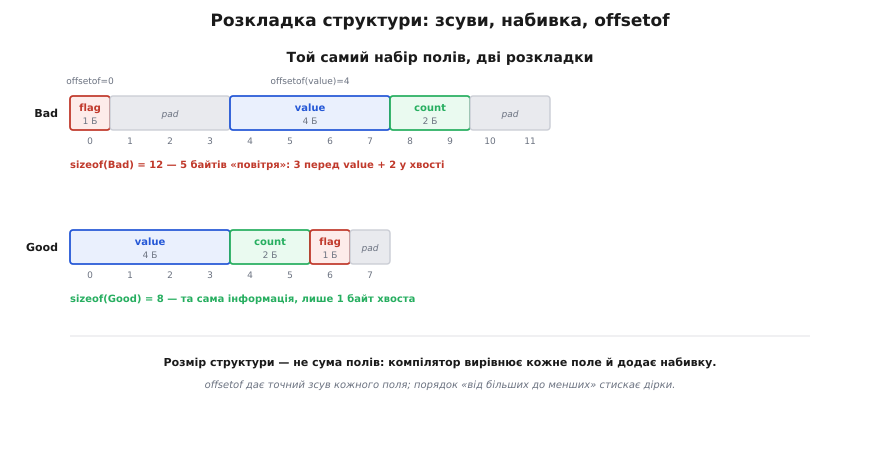
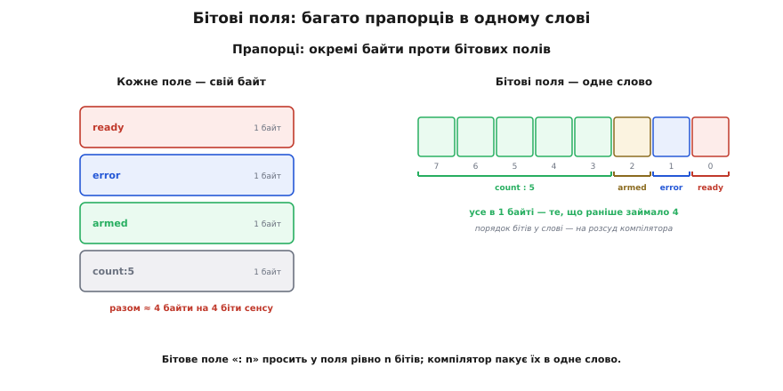

# Структури й перелічення: як вони лежать у пам'яті

<preknowlist>
- [Вирівнювання даних у пам'яті](book:programming/memory-alignment/detail) — чому машина хоче адресу, кратну розміру даних, і звідки береться набивка між полями; тут ми користуємося наслідком для структур, а повне «чому від заліза» — там.
</preknowlist>

У базовій темі ми навчилися користуватися структурою й переліченням як інструментами: завели тип, звернулися до полів крапкою, скопіювали присвоєнням, віддали у функцію, зібрали в масив; переліченням дали станам імена й побудували з них машину станів. Цього досить, щоб писати робочий код. Але «досить, щоб писати» і «зрозуміти без дір» — різні глибини, а прошивка — саме те місце, де діри в розумінні структур обертаються реальними падіннями: пакет із давача розібрався не так, регістр периферії ліг на пам'ять зі зсувом, лічильник між перериванням і циклом показав «півчисла».

Тому тут ми спускаємося на поверх нижче й дивимося, **як усе це насправді влаштовано в пам'яті**. Побачимо, за якими точно адресами компілятор кладе поля й чому `sizeof` бреше на суму розмірів; візьмемо два інструменти, яких у базовій темі не було зовсім, — **бітові поля** (щоб запакувати прапорці в окремі біти одного слова) і **об'єднання** (щоб той самий шматок пам'яті бачити двома різними очима); розберемо, який насправді тип ховається під `enum` і як він уміє тихо підвести. Нитку веду прямо з базової: усе, чим ми там користувалися на віру, тут дістане своє «чому».

## Точна розкладка структури: зсуви й `offsetof`

У базовій темі ми виміряли `sizeof(Measurement)` і дістали 12 замість очікуваних 9 — і пояснили це одним словом «вирівнювання», відклавши механізм. Тепер розкриймо його до кінця, бо в прошивці розкладка структури — не абстракція, а те, від чого залежить, чи розбереться твій код із реальними байтами.

Компілятор роздає полям структури **зсуви** (англ. *offset* — відступ) — відстані в байтах від початку структури. Найголовніше правило, з якого випливає все інше: **кожне поле мусить лягти за адресою, кратною його власному вирівнюванню**. Для простих числових типів вирівнювання дорівнює розміру: `uint8_t` можна класти будь-де, `uint16_t` — на парну адресу, `uint32_t` — на кратну чотирьом. Чому машина цього вимагає — окрема глибока тема про те, як шина фізично тягне пам'ять; ми [спираємося на неї повністю](book:programming/memory-alignment/detail), а тут беремо як даність і дивимося, що з цього випливає **для самих структур**.

Пройдімо розкладку крок за кроком на прикладі з базової теми, тільки цього разу рахуючи адреси явно:

```c
struct measurement {
    uint32_t ts;      // 4 байти
    float    value;   // 4 байти
    uint8_t  ok;      // 1 байт
};
```

```text
зсув 0:  ts     (4 байти) → байти 0,1,2,3     (0 кратне 4 ✓)
зсув 4:  value  (4 байти) → байти 4,5,6,7     (4 кратне 4 ✓)
зсув 8:  ok     (1 байт)  → байт 8            (будь-де ✓)
зсув 9:  хвостова набивка → байти 9,10,11
разом: sizeof == 12
```

Тут поля лягли щільно, а зайві три байти взялися **у хвості**. Це так звана **хвостова набивка** (англ. *tail padding*), і причина її — не саме поле, а те, що структури кладуть у масив. Кожен наступний елемент масиву `struct measurement log[100]` мусить теж починатися з вирівняної адреси: якщо `ts` вимагає кратності чотирьом, то й `log[1].ts` має лягти на адресу, кратну чотирьом. А для цього розмір **однієї** структури мусить бути кратний її найсуворішому полю — інакше другий елемент з'їде. Тому компілятор округлює загальний розмір угору до кратного максимальному вирівнюванню полів (тут — 4), доклеюючи хвіст. Дев'ять округлюється до дванадцяти.

А тепер переставмо поля так, як у базовій темі стояли `ts, value, ok` — але додаймо між ними менші поля, щоб побачити набивку **всередині**, а не лише в хвості:

```c
struct bad {
    uint8_t  flag;    // 1 байт
    uint32_t value;   // 4 байти
    uint16_t count;   // 2 байти
};
```


*Угорі — `struct bad`: `flag` сідає на зсув 0, але `value` хоче адресу, кратну 4, тож між ними лягають три байти набивки (зсуви 1–3); `value` займає 4–7, `count` — 8–9, і ще два байти хвостової набивки добивають розмір до 12. Унизу — ті самі поля, перевпорядковані від більших до менших: `value` (0–3), `count` (4–5), `flag` (6) і лише один байт хвоста, разом 8. П'ять «повітряних» байтів проти одного — і жодне поле сенсу не втратило.*

Порядок полів прямо керує набивкою, і це важіль, який у прошивці економить реальну пам'ять: масив на десять тисяч таких структур у мікроконтролері з 64 КБ ОЗП — це різниця між 120 КБ (не влізе) і 80 КБ. Правило просте: **клади поля від більших до менших**, і набивка сама стиснеться. Але покладатися на «я порахував у голові» ненадійно — розкладка залежить від платформи. Тому C дає інструмент, що питає компілятор про точний зсув поля прямо: макрос `offsetof` із заголовка `<stddef.h>`.

```c
#include <stddef.h>
#include <stdio.h>

printf("%zu\n", offsetof(struct bad, flag));    // 0
printf("%zu\n", offsetof(struct bad, value));   // 4  — видно набивку перед ним
printf("%zu\n", offsetof(struct bad, count));   // 8
printf("%zu\n", sizeof(struct bad));            // 12
```

`offsetof(тип, поле)` повертає зсув поля в байтах від початку структури. Це не декоративна довідка: коли ти пишеш драйвер, який пише в структуру журналу у флеш, або коли треба обчислити адресу поля периферійного регістра, `offsetof` дає точне число замість вгадування. Він же — спосіб **перевірити** свою розкладку: поставив `offsetof` у тимчасовий `printf` і побачив, чи ліг пакет так, як очікуєш, ще до того, як воно тихо зламається на залізі.

> 🔧 **Навіщо це.** Найчастіша практична пастка розкладки — опис пакета протоколу структурою. Ти пишеш `struct { uint8_t cmd; uint32_t id; }`, розраховуючи на п'ять щільних байтів у лінії зв'язку, а компілятор ставить `id` на зсув 4 і всуває три байти набивки — приймач на іншому кінці читає сміття. Знаючи, що набивка є й де саме, ти або перевіриш розкладку через `offsetof`, або (надійніше) взагалі не покладатимешся на неї й серіалізуватимеш поля по одному. Розкладка структури — зручність для свого коду, а не контракт із зовнішнім світом.

## Вирівнювання складеної структури: як воно поширюється

З простими полями розібралися; але поля структури самі бувають структурами, і тут з'являється тонкість, яку легко проґавити. Яке вирівнювання має **вкладена** структура? Відповідь: структура успадковує вирівнювання свого **найсуворішого** поля. Якщо в структурі є хоч один `uint32_t`, уся структура хоче адресу, кратну чотирьом; якщо найбільше поле — `uint8_t`, структуру можна класти будь-де.

Простежмо, як це поширюється вгору. Хай є маленька структура-точка й більша, що містить її:

```c
typedef struct {
    uint16_t x;    // 2 байти
    uint16_t y;    // 2 байти
} Point;           // вирівнювання 2, розмір 4

typedef struct {
    uint8_t  tag;  // 1 байт
    Point    p;    // хоче адресу, кратну 2
} Tagged;
```

`Point` вирівняна на 2 (її найсуворіше поле — `uint16_t`). Тому в `Tagged` поле `p` не може лягти одразу після `tag` на зсув 1 — воно хоче кратну двом адресу. Компілятор ставить один байт набивки на зсув 1, і `p` лягає на зсув 2:

```text
зсув 0:  tag      (1 байт)
зсув 1:  набивка  (1 байт)   ← щоб дотягти p до кратного 2
зсув 2:  p.x      (2 байти)
зсув 4:  p.y      (2 байти)
разом: sizeof(Tagged) == 6, вирівнювання 2
```

Правило, яке варто закарбувати: **вирівнювання структури = максимум вирівнювань її полів, а розмір округлюється вгору до цього вирівнювання**. Це рекурсивно — глибоко вкладені структури підтягують загальне вирівнювання за найсуворішим полем на будь-якій глибині. Один `double` (вирівнювання 8) десь у нутрі змусить усю зовнішню структуру хотіти адресу, кратну восьми, і додасть відповідну набивку. Коли розкладка не сходиться з очікуванням, перше, що варто перевірити, — чи не сидить десь глибоко «важке» поле, що тягне вирівнювання всієї конструкції вгору.

## Бітові поля: коли навіть байт завеликий

Досі найдрібніша одиниця, якою ми оперували, — байт: `uint8_t ok` під ознаку «справний / несправний». Але цей прапорець насправді несе **один біт** інформації, а займає вісім. Поки прапорець один, байдуже. А коли пристрій має регістр статусу з дюжиною окремих однобітних ознак — «готовий», «помилка», «увімкнено живлення», «перевищено температуру» — марнувати по байту на біт означає роздути структуру ввосьмеро й, головне, розійтися з тим, як ці біти реально лежать у регістрі заліза. Тут C дає механізм, якого в базовій темі не було: **бітові поля** (англ. *bit-field*) — поля, ширину яких задаєш прямо в бітах.

Синтаксис — двокрапка й число бітів після імені поля:

```c
struct status {
    uint8_t ready : 1;    // 1 біт
    uint8_t error : 1;    // 1 біт
    uint8_t armed : 1;    // 1 біт
    uint8_t count : 5;    // 5 бітів — значення 0..31
};
```

Тут `ready`, `error`, `armed` просять по одному біту, а `count` — п'ять; разом рівно вісім бітів, і вся структура вміщається в **один байт** замість чотирьох. Компілятор пакує ці поля в спільне слово, а звертаєшся ти до них так само крапкою, наче це звичайні поля:

```c
struct status s = {0};

s.ready = 1;              // піднімаємо біт готовності
s.count = 17;            // кладемо число 0..31 у п'ять бітів

if (s.error) { ... }     // читаємо один біт як звичайне поле
```


*Ліворуч — наївно: три прапорці й лічильник, кожен окремим `uint8_t`, разом близько чотирьох байтів на чотири біти справжнього сенсу. Праворуч — бітові поля: усе те саме лягає в одне 8-бітне слово, де `count` займає п'ять бітів, а три прапорці — по одному. Читаєш і пишеш їх звичайною крапкою, а компілятор сам вставляє потрібні зсуви й маски. Одне лише «але»: у якому порядку — від старшого біта чи від молодшого — поля лягають у слово, стандарт лишає на розсуд компілятора.*

Компілятор за лаштунками робить рівно те, що ти писав би вручну зсувами й масками: щоб покласти `count = 17`, він бере твоє слово, вичищає п'ять відповідних бітів і вставляє туди `17`; щоб прочитати `error`, зсуває слово й маскує один біт. Бітові поля — це синтаксична обгортка над бітовою арифметикою, і саме тому вони природно живуть поруч із нею; коли справа доходить до ручного керування окремими бітами (а воно дійде), ті самі маски й зсуви ти писатимеш явно в темі про [бітові операції](root:embedded/c-bit-operations).

Тепер найважливіше застереження, без якого бітові поля перетворюються на пастку. **Розкладка бітових полів — значною мірою на розсуд компілятора**, і стандарт C свідомо лишає три речі невизначеними (це усталено закріплено в самому стандарті й підсумовано, наприклад, у правилі SEI CERT EXP11-C):

- **Порядок бітів у слові.** Чи ляже перше поле `ready` у молодший біт слова, чи в старший — стандарт не диктує. Одні компілятори пакують від молодшого біта до старшого, інші — навпаки.
- **Чи можуть поля «сідати верхи» на межу слова.** Коли поле не влазить у залишок поточного слова, чи розіб'ється воно між двома словами, чи компілятор почне нове слово, лишивши хвіст першого набивкою, — теж на розсуд реалізації.
- **Знаковість голого `int`-поля.** Це особливо підступно: поле `int b : 3;` може мати діапазон `0..7` **або** `−4..3` — залежно від компілятора, бо для бітового поля голий `int` не гарантовано знаковий (на відміну від `int` деінде, де він завжди знаковий). Тому знаковість бітового поля треба писати **явно**: `unsigned` чи `signed`, ніколи не голий `int`.

Що з цього випливає практично? Бітові поля чудові там, де розкладку бачиш **тільки ти сам** усередині своєї програми: компактний набір прапорців у власній структурі, який ти й пишеш, і читаєш тим самим кодом на тій самій платформі. Але накладати структуру з бітовими полями на **зовнішній** формат — регістр конкретного чипа за даташитом чи пакет протоколу — небезпечно: порядок бітів, який обіцяє даташит, може не збігтися з тим, як твій компілятор спакував поля, і код тихо читатиме не ті біти. Класичний спосіб робити це надійно — не бітові поля, а явні маски й зсуви над цілим словом, де ти сам контролюєш кожен біт. Повний робочий приклад — як лягти бітовими полями на реальний регістр периферії, де це виправдано, і де натомість чесніше взяти маски, — розібрано в [окремому проєкті з накладання структури на карту регістрів](root:embedded/c-structs-enums/proj-register-overlay.md).

> 🔧 **Навіщо це.** У прошивці бітові поля найкорисніші для власних щільних структур стану, де кожен байт ОЗП на рахунку: замість масиву `bool flags[8]` (вісім байтів) — одна структура з восьми однобітних полів (один байт). А головний урок про їхню невизначеність рятує від тихого болю: побачивши в чужому коді структуру з бітових полів, накладену на апаратний регістр, ти одразу насторожуєшся — «а чи той у неї порядок бітів на цьому компіляторі?» — замість годинами ловити, чому давач повертає безглуздя.

## Об'єднання: одна пам'ять, кілька поглядів

Структура кладе поля **поряд** — сумує їхні розміри (плюс набивка). Є її дзеркальний близнюк, який робить протилежне: кладе всі поля **на одне й те саме місце**. Це **об'єднання** (англ. *union* — сполучення, злиття). У базовій темі ми його не торкалися зовсім, а тим часом у прошивці це один із найгостріших інструментів.

Синтаксис — як у структури, лише ключове слово інше:

```c
union sample {
    float   f;         // 4 байти
    uint8_t bytes[4];  // 4 байти
};
```

Різниця радикальна. У структурі з цими двома полями було б `4 + 4 = 8` байтів, і `f` та `bytes` жили б окремо. В об'єднанні `f` і `bytes` **займають одні й ті самі чотири байти** — розмір об'єднання дорівнює розміру не суми, а **найбільшого** члена. Пишеш `u.f = 3.14f` — і ті самі чотири байти можеш прочитати як `u.bytes[0..3]`, побачивши, з яких байтів `float` складається.

![Об'єднання: суцільна смуга «як float f» лежить над тими самими чотирма байтами, які знизу підписані як bytes[0..3]; один шматок пам'яті, два погляди — число або окремі байти](/root/course/embedded/c-structs-enums/img/union-overlay.svg)
*Об'єднання кладе всіх своїх членів на одну пам'ять. Ті самі чотири байти посередині можна бачити як одне 4-байтне число `f` (смуга зверху) або як масив окремих байтів `bytes[0..3]` (знизу). Пишеш `f` — читаєш `bytes`: це не копія й не перетворення, а той самий шматок пам'яті, розібраний на байти. Структура кладе поля поряд і сумує розміри; об'єднання кладе їх на одне місце й бере розмір найбільшого.*

Ось для чого це в прошивці. Найпряміше застосування — **розібрати число на байти** й навпаки, коли треба відправити `float` по шині, що передає байти, або зібрати число з байтів прийнятого пакета. Замість арифметики зсувів кладеш число в `f`, читаєш `bytes[]` — і отримуєш його побайтове подання. Тут одразу спливає тонкість, яку ти вже знаєш: у якому **порядку** ці байти ляжуть — старший спершу чи молодший — залежить від [порядку байтів машини](book:programming/bits-bytes-endianness); на little-endian ESP32 `bytes[0]` буде молодшим байтом числа. Тому такий розбір через об'єднання коректний лише на своїй платформі; для передачі між різними машинами порядок треба фіксувати явно.

Друге застосування — **економія пам'яті**, коли структура в різних станах тримає взаємовиключні дані. Скажімо, повідомлення буває або текстовим, або числовим, але ніколи водночас: тримати обидва поля окремо — марнувати пам'ять на те, чого зараз немає. Об'єднання кладе їх на спільне місце. Але тут ховається головна небезпека об'єднання: **воно не пам'ятає, який член у нього записаний останнім**. Записав `f`, а прочитав `bytes` — мова тебе не спинить, хоча ти читаєш байти числа, а не осмислений масив; записав текст, а прочитав число — дістанеш казна-що. Об'єднання дає лише спільну пам'ять, а стежити, що там зараз лежить, мусиш ти сам.

Тому канонічний спосіб безпечно жити з об'єднанням — **тегований союз** (англ. *tagged union*): структура, у якій поруч з об'єднанням лежить поле-перелічення, що каже, який саме член об'єднання зараз чинний. Ось де структура, об'єднання й перелічення сходяться в одну конструкцію:

**Умова:** описати повідомлення, що буває або цілим числом, або дійсним, або короткою командою, так щоб завжди було відомо, який зміст у ньому зараз, і щоб зайва пам'ять не витрачалася.

```c
#include <stdint.h>
#include <stdio.h>

enum msg_kind {
    MSG_INT,        // у payload чинне поле i
    MSG_FLOAT,      // чинне f
    MSG_CMD         // чинне cmd
};

typedef struct {
    enum msg_kind kind;      // ТЕГ: який член об'єднання зараз чинний
    union {
        int32_t i;
        float   f;
        uint8_t cmd;
    } payload;               // самі дані — на спільній пам'яті
} Message;

void print_msg(const Message *m) {
    switch (m->kind) {                     // тег вирішує, як читати payload
        case MSG_INT:
            printf("ціле: %d\n", m->payload.i);
            break;
        case MSG_FLOAT:
            printf("дійсне: %.2f\n", m->payload.f);
            break;
        case MSG_CMD:
            printf("команда: %u\n", m->payload.cmd);
            break;
    }
}

int main(void) {
    Message a = { .kind = MSG_FLOAT, .payload = { .f = 23.5f } };
    Message b = { .kind = MSG_INT,   .payload = { .i = -7 } };

    print_msg(&a);    // дійсне: 23.50
    print_msg(&b);    // ціле: -7
    return 0;
}
```

Тег `kind` — перелічення — завжди каже, який член `payload` чинний, а `switch` по тегу читає рівно той член, що записаний. Пам'ять економиться (об'єднання займає розмір найбільшого члена, а не суму), а безпека тримається тегом. Це той самий візерунок «структура тримає дані, перелічення тримає стан», що й у базовій темі, тільки тепер перелічення стереже ще й **інтерпретацію спільної пам'яті**.

Останнє про об'єднання — чесне застереження на майбутнє. Читати член об'єднання, відмінний від записаного (те саме «записав `f`, читаю `bytes`»), формально в C зветься **типовим каламбуром** (англ. *type punning*), і мова тут має тонке місце: правило [суворого аліасування](book:programming/strict-aliasing) взагалі забороняє дивитися на ту саму пам'ять через несумісні типи, і лише **для об'єднань** стандарт це дозволяє як виняток. Тобто розбирати число на байти **через об'єднання** — законно (компілятор зобов'язаний це підтримати), а от через приведення вказівника `*(uint8_t*)&f` — вже небезпечно. Це ще одна причина, чому об'єднання в прошивці незамінне: воно дає єдиний по-справжньому легальний спосіб глянути на ті самі біти двома типами.

## Анонімні структури й об'єднання: коли ім'я зайве

У теговому союзі вище, щоб дістатися числа, доводилося писати `m->payload.i` — через проміжне ім'я `payload`. Іноді це ім'я — чистий шум: воно нічого не значить, лише групує. Стандарт C11 дозволив прибрати його — це **анонімні** (безіменні) структури й об'єднання. Безіменний член-структура чи член-об'єднання «вливає» свої поля в зовнішню структуру, і до них звертаєшся напряму, наче вони власні:

```c
typedef struct {
    enum msg_kind kind;
    union {                  // без імені — поля вливаються в Message
        int32_t i;
        float   f;
        uint8_t cmd;
    };                       // зверни увагу: імені після } немає
} Message;

Message m = { .kind = MSG_INT };
m.i = 42;                    // напряму, без m.payload.i
```

Це не лише коротший запис. Найчастіше анонімні об'єднання й структури використовують саме в **картах регістрів** периферії, де той самий регістр треба бачити то як ціле слово, то як набір бітових полів. Анонімне об'єднання дозволяє покласти обидва погляди в одну структуру без зайвого рівня імен, і код читається так, ніби в регістра є і поле-слово, і поля-біти водночас. Цей прийом ми застосуємо в проєкті з накладання структури на регістри, згаданому вище.

## Гнучкий масив у хвості: структура змінної довжини

Ще одна конструкція, якої в базовій темі не було й яка в прошивці спливає щоразу, коли маєш справу з пакетами змінної довжини. Уяви кадр: заголовок фіксованого розміру (тип повідомлення, довжина) плюс «тіло» — масив байтів, довжина якого відома лише під час виконання. Описати це звичайним масивом фіксованого розміру незручно: або марнуєш пам'ять на найбільший можливий випадок, або він не влазить. C99 дав рівно для цього **гнучкий масив-член** (англ. *flexible array member*) — масив **без указаної довжини** останнім полем структури:

```c
typedef struct {
    uint8_t  type;      // тип кадру
    uint16_t len;       // скільки байтів у data
    uint8_t  data[];    // гнучкий масив — довжина не вказана
} Frame;
```

Правила тут точні (усе це закріплено в C99): такий масив мусить бути **останнім** членом, у структурі має бути **хоча б одне** назване поле перед ним, і `sizeof(Frame)` рахується так, **наче гнучкого масиву немає** (тобто дає розмір лише заголовка, з урахуванням набивки під вирівнювання масиву). Сама структура при цьому стає **неповним типом**: її не можна ні покласти в масив, ні зробити полем іншої структури — бо її справжній розмір відомий лише тоді, коли ти виділиш під неї пам'ять.

А виділяєш ти під неї пам'ять «заголовок плюс скільки треба тіла» одним шматком:

```c
// кадр із тілом на n байтів — заголовок і дані одним блоком пам'яті:
Frame *make_frame(uint8_t type, uint16_t n) {
    Frame *fr = malloc(sizeof(Frame) + n);   // заголовок + n байтів під data[]
    if (!fr) return NULL;
    fr->type = type;
    fr->len  = n;
    return fr;                                 // fr->data[0..n-1] тепер доступні
}
```

`malloc(sizeof(Frame) + n)` бере рівно стільки, скільки треба на заголовок і `n` байтів тіла, а `data[]`, що стоїть у хвості структури, лягає точно на ці додаткові байти. Далі звертаєшся до `fr->data[k]` як до звичайного масиву. Це виділення пам'яті блоком ми повноцінно розберемо, коли дійдемо до [покажчиків](root:embedded/c-pointers-intro) і купи; тут важливий сам образ — структура, чий хвіст «доростає» рівно під потрібну довжину, замість того щоб бронювати місце наперед. Саме так описують кадри в багатьох протоколах і драйверах.

## Перелічення без дір: який тип під ним насправді

Повернімося до перелічення й спустимося під його поверхню. У базовій темі ми казали: «за лаштунками `enum` — це просто цілі числа». Правда, але недостатньо точна, і неточність тут уміє підвести.

Перше запитання: **якого саме типу** значення перелічення? У базовій темі здавалося — `int`. Насправді стандарт (до C23) каже інакше: тип, сумісний із переліченням, — **на розсуд реалізації**, з єдиною вимогою — він мусить уміщати **всі** перелічувачі цього переліку. Компілятор може взяти `int`, а може — менший або більший цілий тип, аби значення влізли. Практичний наслідок: `sizeof(enum device_mode)` не гарантовано дорівнює `sizeof(int)` — на одному компіляторі це 4 байти, на іншому може бути 1, якщо всі значення дрібні. Тому будувати розкладку структури на припущенні «поле-enum займає рівно 4 байти» — помилка; хочеш певності — міряй `sizeof` або задавай тип явно.

І тут доречно згадати свіжу можливість. Стандарт **C23** дозволив нарешті **прямо задати базовий тип** перелічення, дописавши його через двокрапку, — і тоді жодної невизначеності:

```c
// C23: базовий тип фіксовано — рівно один байт, беззнаковий
enum sensor_mode : uint8_t {
    S_IDLE,
    S_READING,
    S_FAULT
};
```

Синтаксис `enum ... : uint8_t` каже: базовий тип — саме `uint8_t`, отже `sizeof` дорівнює 1 і знаковість відома. Це прибирає стару хитку невизначеність — але доступне лише в C23, тож у старшому коді покладатися на це не можна. (Ця можливість — усталене нововведення C23, підтверджене специфікацією мови.)

Друге запитання — **знаковість**, і вона теж уміє вкусити. Оскільки базовий тип на розсуд реалізації, перелічення може виявитися беззнаковим. Тоді код, що очікує від'ємне значення, тихо ламається:

```c
enum dir { DIR_LEFT = -1, DIR_STOP = 0, DIR_RIGHT = 1 };

enum dir d = get_direction();
if (d < 0) {                 // ЧИ спрацює? залежить від знаковості базового типу
    ...                      // якщо enum беззнаковий, DIR_LEFT став великим додатним
}
```

Якщо серед перелічувачів є від'ємні (як `DIR_LEFT = -1`), базовий тип **зобов'язаний** бути знаковим — цей випадок безпечний. Небезпека в іншому: не додавай у перелічення від'ємних значень «на майбутнє», якщо не мусиш, і не порівнюй значення переліку зі знаком, не подумавши про його знаковість; безпечніше порівнювати з іменованими перелічувачами, а не з голими числами на кшталт `< 0`.

Третє, суто практичне, — **перелічення у `switch`**. Це не просто зручність, а й помічник від компілятора: якщо ти пишеш `switch` по змінній-переліченню й **забуваєш обробити** якийсь із перелічувачів, компілятор (з увімкненими попередженнями, як-от `-Wswitch` у GCC) скаже про це. Голе `int` такого не дасть — воно ж може бути будь-яким числом. Тому машину станів на переліченні варто розбирати саме через `switch` без гілки `default`, коли хочеш обробити **всі** стани: додав завтра п'ятий стан у перелік — і компілятор одразу тицьне у всі `switch`, де його забули. Це перелічення, що працює на тебе.

Останній корисний візерунок — перелічення як **набір бітових прапорців**. Коли значення переліку не взаємовиключні стани, а незалежні ознаки, які можна комбінувати, їм дають степені двійки, щоб об'єднувати побітовим АБО:

```c
enum flags {
    FLAG_NONE  = 0,
    FLAG_READ  = 1 << 0,    // 0b001
    FLAG_WRITE = 1 << 1,    // 0b010
    FLAG_EXEC  = 1 << 2     // 0b100
};

int perm = FLAG_READ | FLAG_WRITE;   // комбінуємо два прапорці
if (perm & FLAG_WRITE) { ... }       // перевіряємо один
```

Тут перелічення дає імена бітам, а комбінуєш і перевіряєш їх бітовими операціями — знову місток до теми [бітових операцій](root:embedded/c-bit-operations), де цей прийом розкриється повністю. Головне бачити межу: коли значення — **взаємовиключні стани** (сон/вимір/помилка), нумеруй їх поспіль `0, 1, 2` і бери `switch`; коли це **незалежні ознаки**, що поєднуються, — давай степені двійки й комбінуй бітами. Плутати ці два способи — типова помилка новачка.

## Чому структуру не можна порівняти через `==`

Наостанок — тонкість, об яку спотикаються, коли структури вже здаються добре знайомими. Присвоїти структуру цілком (`b = a`) можна — ми це робили в базовій темі. Природно очікувати, що й **порівняти** дві структури можна так само просто: `if (a == b)`. Але це **не компілюється**: оператор `==` для структур у C не визначений зовсім. Чому — і це не примха мови.

Причина пряма й уже нам відома: **набивка**. Між полями (і в хвості) структури сидять байти-заповнювачі, значення яких **невизначене** — компілятор не зобов'язаний їх обнуляти чи взагалі якось контролювати. Тому дві структури можуть мати всі **поля** однаковими, а байти набивки — різними (скажімо, одна прийшла з `memset`-нуля, інша — зі стека, де в набивці лишилося сміття). Якби `==` порівнював структури побайтно, він оголосив би їх різними, хоча за сенсом вони однакові. А порівнювати «розумно», лише значущі поля, компілятор у загальному випадку не може — він не знає, які поля для тебе означають рівність. Тож мова чесно відмовляється визначати `==` взагалі.

З цього випливає і практична пастка: **не порівнюй структури через `memcmp`**. Спокуса є — `memcmp(&a, &b, sizeof a)` начебто зрівняє їх байт у байт. Але саме через невизначену набивку такий порівняльник дасть «не рівні» для структур з однаковими полями:

```c
// НЕНАДІЙНО — набивка може відрізнятися при однакових полях:
if (memcmp(&a, &b, sizeof a) == 0) { ... }   // може збрехати «різні»

// НАДІЙНО — порівнюємо поле за полем, самі вирішуючи, що таке рівність:
if (a.ts == b.ts && a.value == b.value && a.ok == b.ok) { ... }
```

Порівняння структури — завжди **поле за полем**, вручну (або згенерованою для цього функцією). Це не незручність мови, а наслідок того самого механізму набивки, який ми розібрали на початку: щойно між полями є неконтрольовані байти, побайтове порівняння втрачає сенс. (Той самий аргумент, до речі, стосується й хешування структур і запису їх у флеш для звірки — скрізь, де спокушаєшся працювати зі структурою як зі суцільним блоком байтів, згадай про набивку.)

Ще один бік цієї ж медалі спливе зовсім скоро. Структура вміє містити **покажчик** на іншу структуру того самого типу — і саме так у C будують зв'язані переліки й дерева. Але щойно серед полів з'являється покажчик, і присвоєння `b = a`, і будь-яке побайтове порівняння починають поводитися підступно: копіюється чи звіряється **адреса**, а не те, на що вона показує. Цю тему — структури, що посилаються самі на себе, і що з ними роблять покажчики, — ми розгорнемо в [наступному кроці про покажчики](root:embedded/c-pointers-intro), до якого структури й ведуть.

## Що з цього лишається

Базова тема дала форму: структура склеює різнотипні поля, перелічення дає станам імена. Цей поверх додав до форми **механіку** — те, без чого структури в прошивці тихо ламаються.

Структура лежить у пам'яті не так, як записана: компілятор роздає полям зсуви, вирівнюючи кожне поле й доклеюючи набивку між полями й у хвості, тож `sizeof` більший за суму розмірів, а порядок полів (від більших до менших) цей надлишок стискає; точний зсув каже `offsetof`, а вирівнювання структури — це максимум вирівнювань її полів, що поширюється вгору крізь вкладення. Два нові інструменти дзеркальні одне одному: **бітові поля** пакують дрібні значення в біти спільного слова (потужно для власних щільних структур, небезпечно для зовнішніх форматів через невизначений порядок бітів), а **об'єднання** кладе кілька членів на одну пам'ять (розмір найбільшого) — єдиний легальний спосіб глянути на ті самі біти двома типами, безпечний лише під наглядом тега-перелічення. Гнучкий масив у хвості дає структуру, що доростає під потрібну довжину. А перелічення виявилося не зовсім `int`: його базовий тип і знаковість — на розсуд реалізації (аж до фіксації через `: тип` у C23), тому на його розмір не покладаються наосліп, зі знаком поводяться обережно, а `switch` по ньому роблять помічником, що ловить забуті стани.

І та сама набивка, з якої почався цей поверх, пояснила, чому структуру не можна порівняти ні через `==`, ні через `memcmp` — лише поле за полем. Усі ці нитки — зсуви, спільна пам'ять, покажчик у полі — сходяться в наступній темі: покажчики перетворять структуру з «складеного значення, яке копіюєш цілим» на цеглину, з якої будують зв'язані структури даних і кладуть карту регістрів чипа рівно на пам'ять периферії.
