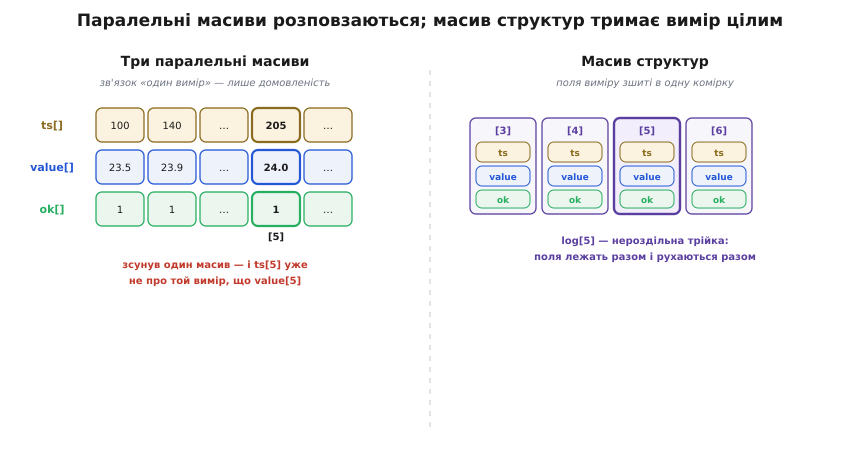
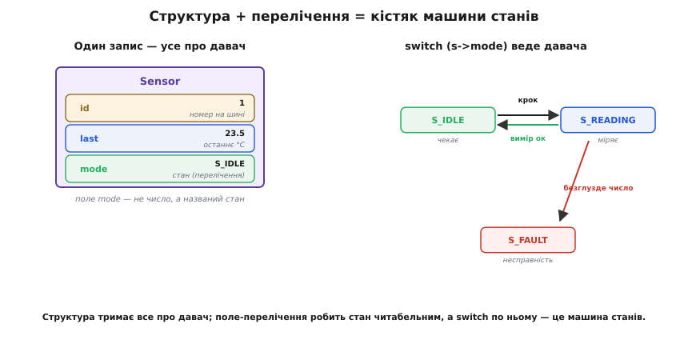

# Структури й перелічення

Масив, який ми щойно освоїли, тримає багато речей **одного** типу поспіль: десять `int`, сотню `char`. Але справжня річ у прошивці рідко буває однорідна. Один вимір давача — це насправді жмуток різнорідного: коли зміряли (число часу), скільки вийшло (число температури), і чи взагалі виміру можна вірити (ознака справності). Три різні типи, що описують **одну** сутність. Масивом їх разом не збереш — масив вимагає однаковості. А тримати їх трьома окремими змінними означає щоразу тягати три речі, які насправді нероздільні, і сподіватися, що ти ніде їх не переплутав.

Ось звідки виростають дві сьогоднішні конструкції. **Структура** (англ. *structure* — будова) склеює різнотипні поля в одну складену змінну, з якою поводишся як з цілим. А **перелічення** (англ. *enumeration* — перелік) дає іменам замість голих чисел, коли величина насправді не число, а один зі скінченного набору станів. Разом вони перетворюють код зі зшитого з розрізнених шматочків на такий, де назви прямо кажуть, що описують.

### Структура: різні типи під одним ім'ям

Почнімо з проблеми в її голому вигляді. Хай треба зберегти одне показання давача. Наївний підхід — три змінні:

```c
uint32_t ts;      // мітка часу, мс від старту
float    value;   // температура, °C
uint8_t  ok;      // 1 — вимір справний, 0 — ні
```

Поки показання одне, це терпимо. Але щойно їх стане багато — скажімо, історія на сто вимірів, — доведеться завести **три паралельні масиви** `ts[100]`, `value[100]`, `ok[100]` і всюди пам'ятати, що `ts[i]`, `value[i]` та `ok[i]` — це один і той самий вимір. Досить один раз відсортувати часи й забути пересунути значення — і масиви розповзаються, кожне число живе саме по собі, а зв'язок «це все про один вимір» тримається лише в твоїй голові. Компілятор про нього не знає й не захистить.

Структура зшиває ці поля в один тип, і зв'язок стає частиною самої мови:

```c
struct measurement {
    uint32_t ts;      // мітка часу, мс від старту
    float    value;   // температура, °C
    uint8_t  ok;      // 1 — справний, 0 — ні
};
```

Тепер `struct measurement` — це повноцінний тип, як `int` чи `float`, тільки складений з трьох полів. Заводимо змінну цього типу й дістаємося полів через **крапку**:

```c
struct measurement m;

m.ts    = millis();     // час зараз
m.value = 23.5f;        // зчитана температура
m.ok    = 1;            // вимір вдався

if (m.ok) {
    printf("час %u мс: %.1f°C\n", m.ts, m.value);
}
```

Крапка (`m.value`) читається просто: «поле `value` тієї структури, що зветься `m`». Уся змінна `m` — один об'єкт; поля — його складові. Тепер зв'язок нерозривний: перекладаєш `m` — усі три поля їдуть разом, бо це одна змінна. Історія вимірів стає одним масивом структур, а не трьома паралельними:

```c
struct measurement log[100];

log[5].value = 24.0f;   // значення шостого виміру
log[5].ts    = millis();
```

Один масив, кожен елемент — цілий вимір із трьох полів. Розсинхронізуватися нема чому: `log[5]` — це нероздільна трійка.


*Ліворуч: три окремі масиви — час, значення, ознака — і зв'язок «це один вимір» існує тільки як домовленість; варто зсунути один масив, і `ts[5]` уже не про той самий вимір, що `value[5]`. Праворуч: один масив структур, де п'ятий елемент — цілісний запис із трьох полів, які фізично лежать разом і рухаються разом.*

> 🔧 **Навіщо це.** У прошивці структура — головний спосіб описати «пакет» даних: кадр із давача, запис у журнал подій, набір параметрів фільтра. Коли ти читаєш з давача по шині відразу кілька байтів і хочеш розкласти їх на «старший біт статусу, 14 біт значення, біт помилки», структура з правильними полями дає готову форму, у яку ці байти лягають самі, — і далі звертаєшся до `frame.value`, а не колупаєшся в зсувах щоразу.

### typedef: коротше ім'я типу

Писати `struct measurement` перед кожною змінною набридає. C дає `typedef` (від *type definition* — означення типу) — спосіб дати типові коротший псевдонім:

```c
typedef struct {
    uint32_t ts;
    float    value;
    uint8_t  ok;
} Measurement;
```

Тепер `Measurement` — самодостатнє ім'я типу, і слово `struct` більше не потрібне при кожній згадці:

```c
Measurement m;
Measurement log[100];
```

Різниця суто в зручності запису — поля, крапка, поведінка ті самі. Але прибрати шум `struct` варте того: у справжній прошивці типів-структур десятки, і читати `Measurement m` замість `struct measurement m` помітно легше. Далі триматимемося саме форми з `typedef` — так пишуть у більшості реальних проєктів.

### Структура як ціле: копіювання й функції

Найкорисніше в структурі те, що з нею можна поводитися **як з єдиним значенням**, а не тільки лізти в окремі поля. Присвоєння копіює **всі** поля разом:

```c
Measurement a = { .ts = 100, .value = 23.5f, .ok = 1 };
Measurement b;

b = a;   // b дістає копію всіх трьох полів a
```

Тут же ми вжили ще й **ініціалізацію за іменами полів** — `{ .ts = 100, .value = 23.5f, .ok = 1 }` (її звуть призначеним ініціалізатором, *designated initializer*). Кожне поле назване прямо, тож читач бачить, що куди кладеться, а не мусить пам'ятати порядок. Поле, яке ти не згадав, стає нулем — зручно, коли структура велика, а заповнити треба лише кілька полів.

Так само структуру можна віддати у функцію й повернути з неї — і поведе вона себе як єдине значення, а не як три аргументи:

```c
// зробити один вимір, повернувши цілу структуру:
Measurement read_sensor(void) {
    Measurement m;
    m.ts    = millis();
    m.value = adc_to_celsius(read_adc());
    m.ok    = 1;
    return m;               // повертаємо всю структуру
}

void use(void) {
    Measurement now = read_sensor();   // now — копія повернутого
    printf("%.1f°C\n", now.value);
}
```

Функція повертає одну річ, а всередині цієї речі — троє даних. Без структури довелося б або передавати три окремі значення й якось повертати три (а `return` віддає лише одне), або морочитися з покажчиками — але з покажчиками ми познайомимося [далі, наступним кроком](root:embedded/c-pointers-intro), і саме вони згодом дадуть спосіб віддати функції структуру, **не** копіюючи її цілком. Поки що тримаймо в голові головне: структура — це одне складене значення, і мова дозволяє його присвоювати, передавати й повертати нероздільним шматком.

Тут варто застерегти від однієї пастки, бо вона тиха. Коли ти пишеш `b = a`, C копіює поля **побайтово, дослівно**. Для чисел це саме те, чого хочеш. Але якщо серед полів колись з'явиться покажчик (адреса на щось), скопіюється **сама адреса**, а не те, на що вона показує, — і дві структури почнуть дивитися на один і той самий шматок пам'яті. Зараз, поки поля — прості числа, боятися нема чого; але коли дійдемо до покажчиків, цю тему ми ще пригадаємо.

### Скільки місця займає структура

Природно спитати: якщо в структурі `uint32_t` (4 байти), `float` (4 байти) і `uint8_t` (1 байт), то `sizeof(Measurement)` — це 9 байтів? Майже ніколи. Виміряймо:

```c
printf("%zu\n", sizeof(Measurement));   // часто виведе 12, а не 9
```

Дванадцять, не дев'ять. Три байти взялися «нізвідки». Причина в тому, що процесор читає пам'ять не по одному байту, а рівними порціями, і йому набагато швидше, коли чотирибайтове число лежить за адресою, кратною чотирьом. Тому компілятор **вирівнює** поля: доклеює невидимі байти-заповнювачі (англ. *padding* — набивка), щоб кожне поле починалося на «зручній» адресі. Після одного байта `ok` він може дописати три порожні байти, щоб уся структура була кратна чотирьом і масив таких структур лягав рівно.

Це не дрібниця для прошивки, де і пам'ять на вагу золота, і структуру часом треба точно накласти на байти реального пакета з давача. Механізм вирівнювання — чому саме так, як порахувати розмір і як полями керувати їхнім порядком — детально розібрано окремо; тут досить пам'ятати правило: [розмір структури — не завжди сума розмірів полів](topic:sf-apps/memory-alignment), і коли байти важливі, `sizeof` треба **міряти**, а не вгадувати.

### Перелічення: імена замість магічних чисел

Тепер друга сьогоднішня конструкція. Часто величина за своєю природою — не число, а один із кількох станів. Режим роботи пристрою: сон, вимірювання, передавання, помилка. Це не «нуль, один, два, три» — це чотири **названі** стани, а числа під ними випадкові. Якщо писати їх голими числами, код швидко стає ребусом:

```c
if (mode == 2) { ... }        // а що таке «2»? згадуй…
device_state = 3;             // «3» — це помилка? сон? хтозна
```

Число `2` тут — «магічне»: воно щось означає, але що саме — треба тримати в пам'яті або шукати в коментарях. Перелічення прибирає цю загадку, даючи станам **імена**:

```c
enum device_mode {
    MODE_SLEEP,     // 0
    MODE_MEASURE,   // 1
    MODE_TRANSMIT,  // 2
    MODE_ERROR      // 3
};
```

За лаштунками `enum` — це просто цілі числа: перше ім'я дістає `0`, кожне наступне на одиницю більше (тож `MODE_TRANSMIT` — це `2`). Але в коді ти пишеш **ім'я**, і намір стає очевидним:

```c
enum device_mode mode = MODE_SLEEP;

if (mode == MODE_MEASURE) {
    start_adc();
}
mode = MODE_ERROR;    // ясно без коментаря, що сталося
```

Порівняй `if (mode == MODE_MEASURE)` з `if (mode == 1)` — перше читається як речення, друге вимагає розшифровки. Числа не змінилися, змінилося те, що бачить людина.

Може виникнути думка: а чим це краще за звичний `#define MODE_SLEEP 0`? Іменем-константою теж можна прибрати магічне число. Різниця в тому, що `enum` заводить **тип** і **згуртовує** пов'язані значення в один набір: `MODE_SLEEP` і `MODE_ERROR` явно з однієї родини, компілятор знає їх усі разом, а в зневаднику ти часто бачиш саме ім'я стану, а не безлике число. `#define` же — просто текстова заміна на етапі [препроцесора](root:embedded/c-preprocessor-headers), яка не творить ані типу, ані групи; кожна така константа сама по собі. Коли значення справді утворюють один замкнений перелік, `enum` каже це прямо.

За потреби значення можна й задати вручну — це звична річ, коли числа диктує не ти, а, скажімо, протокол чи регістр:

```c
enum baud {
    BAUD_9600   = 9600,
    BAUD_115200 = 115200
};

enum led_pin {
    LED_RED   = 2,     // номери ніжок GPIO
    LED_GREEN = 4,
    LED_BLUE  = 5
};
```

Тут імена вже не «0, 1, 2…», а конкретні потрібні числа — але код усе одно говорить `LED_GREEN`, а не голе `4`, і зв'язок «це все ніжки світлодіода» видно з самого переліку.

> 🔧 **Навіщо це.** Прошивка майже завжди — це машина станів: пристрій сидить в одному з кількох режимів і переходить між ними за подіями. Перелічення дає цим режимам імена, тож головний цикл читається як опис поведінки — «якщо в режимі вимірювання, зчитати давач; якщо помилка, блимнути й поспати», — а не як загадка з чисел. І коли завтра додасться п'ятий режим, ти вставляєш нове ім'я в перелік, а не полюєш по всьому коду за розкиданими числами.

### Разом: запис пристрою

Уся сила цих двох конструкцій розкривається, коли вони працюють пліч-о-пліч: структура описує пристрій, а поле-перелічення тримає його стан. Зберімо невеликий, але цілісний приклад — запис про один давач у системі:

**Умова:** описати давач температури так, щоб один запис тримав його ідентифікатор, останній вимір і поточний режим; і показати простий крок машини станів над цим записом.

```c
#include <stdint.h>
#include <stdio.h>

enum sensor_mode {
    S_IDLE,        // 0 — чекає
    S_READING,     // 1 — саме міряє
    S_FAULT        // 2 — несправність
};

typedef struct {
    uint8_t          id;       // номер давача на шині
    float            last;     // останнє показання, °C
    enum sensor_mode mode;     // у якому стані давач зараз
} Sensor;

// один крок обробки давача: залежно від стану — своя дія
void step(Sensor *s, float reading) {
    switch (s->mode) {
        case S_IDLE:
            s->mode = S_READING;          // прокидаємося міряти
            break;
        case S_READING:
            if (reading < -50 || reading > 150) {
                s->mode = S_FAULT;        // безглузде число — несправність
            } else {
                s->last = reading;        // приймаємо вимір
                s->mode = S_IDLE;         // і знову чекаємо
            }
            break;
        case S_FAULT:
            // лишаємося в помилці, доки не скинуть ззовні
            break;
    }
}

int main(void) {
    Sensor t = { .id = 1, .last = 0.0f, .mode = S_IDLE };

    step(&t, 0.0f);      // S_IDLE  → S_READING
    step(&t, 23.5f);     // S_READING → приймає 23.5, → S_IDLE
    step(&t, 0.0f);      // S_IDLE  → S_READING
    step(&t, 999.0f);    // безглуздий вимір → S_FAULT

    printf("давач %u: останнє %.1f°C, режим %d\n",
           t.id, t.last, t.mode);
    return 0;
}
```

Тут видно все разом. `Sensor` — структура, у якій три поля різного типу, і одне з них саме є переліченням `sensor_mode`. Функція `step` дивиться на поле `mode` через `switch` і залежно від стану або міняє його, або приймає вимір. У виклику `step(&t, …)` уперше майнув знак `&` і стрілка `s->mode` замість крапки — це і є місток до **покажчиків**: `&t` передає функції адресу самого запису (щоб зміни лишилися в `t`, а не в копії), а `s->mode` — це «поле `mode` тієї структури, на яку показує `s`». Стрілку `->` можна поки читати просто як «крапку через покажчик»; що там насправді коїться, ми розберемо [наступного кроку про покажчики](root:embedded/c-pointers-intro). Головне зараз — побачити форму: один охайний запис `Sensor` тримає все про давач, перелічення робить його стан читабельним, а `switch` по цьому стану — це і є машина станів у мініатюрі, кістяк майже будь-якої прошивки.


*Один запис `Sensor` тримає все про давач: номер, останнє показання й поле `mode`, що є не числом, а названим станом. `switch (s->mode)` дивиться на це поле й переводить давача між станами — з очікування в вимірювання, назад при вдалому вимірі, у несправність при безглуздому числі. Структура тримає дані, перелічення робить стан читабельним, а `switch` по ньому — це вже машина станів.*

Варто знати й те, звідки ці конструкції взялися. У ранній C структура була кволою: її не можна було ні присвоїти цілком, ні передати у функцію — доводилося возитися з полями поодинці. Повноцінною, такою, як ми щойно нею користувалися, вона стала лише з роками, а перелічення додалося ще пізніше; [коротка історія того, як `struct` і `enum` доростали до сьогоднішнього вигляду](root:embedded/c-structs-enums/hist-struct-evolution.md), пояснює, чому в старому коді трапляються дивні манери їх обходити.

### Що з цього лишається

Дві прості ідеї, а вони несуть половину структури будь-якої прошивки. Структура склеює **різнотипні** дані про одну сутність в один тип, з яким поводишся як з цілим: заводиш змінну, звертаєшся до полів крапкою, копіюєш, передаєш у функцію, збираєш у масив — і зв'язок між полями тримає вже мова, а не твоя пам'ять. Перелічення дає **іменам** місце там, де голі числа перетворили б код на ребус, і прямо каже, що величина — це один зі скінченного набору станів.

Далі ці цеглинки лягають одна на одну. Запис пристрою зі станом-переліченням — це готовий кістяк машини станів. Байти з давача, накладені на структуру з правильними полями, — це готовий розбір протоколу. А `&` і `->`, що двічі майнули в прикладах, ведуть прямо в наступну тему — покажчики, — з якою структури розкриються по-справжньому: віддавати їх функціям без зайвого копіювання, будувати з них зв'язані переліки, класти карту регістрів чипа рівно на пам'ять периферії.
