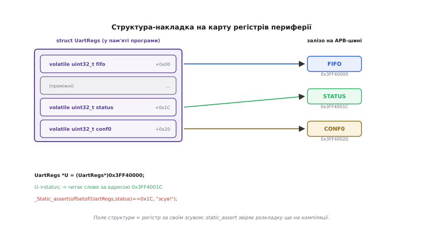

# ⚙️ Накладаємо структуру на карту регістрів периферії

Ми вже вміємо описати структуру, спакувати прапорці в бітові поля, покласти два погляди на одну пам'ять об'єднанням і звірити розкладку через `offsetof`. Настав час пустити все це в діло на реальному залізі — накласти структуру прямо на регістри периферії мікроконтролера й почати керувати нею через поля, а не через голі числа.

Це той самий проєкт, до якого двічі вела детальна тема: де накладати структуру з бітовими полями на регістр **виправдано**, а де через невизначений порядок бітів чесніше взяти явні маски й зсуви над цілим словом. Візьмемо конкретне залізо — контролер UART мікроконтролера ESP32, — і напишемо робочий шматок прошивки, який читає його регістр статусу й пише в регістр контролю. Дорогою побачимо, чому тут неминучі `volatile` і точна адреса, і на які граблі це багате.

## Задача: заговорити з периферією її ж мовою

Мікроконтролер спілкується зі світом через периферію — UART, таймери, GPIO, АЦП. Кожен такий блок керується **регістрами**: комірками, що фізично лежать за фіксованими адресами в пам'яті процесора, і запис чи читання яких смикає саме залізо. Про сам механізм — що ці адреси не ОЗП, а «важелі» периферії — окрема тема; тут ми [спираємося на memory-mapped ввід-вивід](topic:hw-arch/memory-mapped-io) як на відоме: регістр периферії — це адреса, за якою читання/запис керує залізом, а не просто зберігає число.

> 🔧 **Навіщо це.** Коли ти пишеш `Serial.begin(115200)` у зручному фреймворку, під капотом хтось усе одно клав числа в регістри UART. Рано чи пізно фреймворк не покриє потрібного режиму — або ти писатимеш свій драйвер, або даташит покаже регістр, якого в бібліотеці немає. Уміння накласти структуру на карту регістрів і звертатися до полів — це те, що відрізняє «покликав готову функцію» від «розумію, що насправді робить залізо».

Даташит на кожну периферію дає **карту регістрів**: таблицю «за яким зсувом від бази який регістр і що в ньому за біти». Для UART нульового каналу ESP32 база — адреса `0x3FF40000` (це периферійна APB-шина), а регістр статусу `UART_STATUS_REG` лежить за зсувом `0x1C` від неї. Усередині цього 32-бітного слова біти розкладені так (перевірено за реєстровим заголовком Espressif `uart_reg.h`):

```text
біт  31    : рівень лінії TXD
біт  30    : рівень лінії RTS
біт  29    : рівень лінії DTR
біти 27–24 : ST_UTX_OUT — стан автомата передавача (4 біти)
біти 23–16 : TXFIFO_CNT — скільки байтів лежить у передавальному FIFO (8 бітів)
біт  15    : рівень лінії RXD
біт  14    : рівень лінії CTS
біт  13    : рівень лінії DSR
біти 11–8  : ST_URX_OUT — стан автомата приймача (4 біти)
біти 7–0   : RXFIFO_CNT — скільки байтів чекає в приймальному FIFO (8 бітів)
```

Найкорисніше тут — два лічильники: `RXFIFO_CNT` каже, скільки прийнятих байтів чекає, `TXFIFO_CNT` — скільки ще не відіслано. Драйвер весь час на них дивиться: є що читати? є місце писати? І ось перша розвилка — **як саме** дістатися до `RXFIFO_CNT`. Спокуса очевидна: раз ми вміємо бітові поля, опишімо весь регістр структурою з полів `rxfifo_cnt : 8`, `st_urx_out : 4` і так далі, а тоді просто читаймо `status.rxfifo_cnt`. Зваба сильна, і саме тут ховається головна пастка проєкту.

## Ідея: два чесні способи й один оманливий

Порахуймо, що взагалі означає «накласти структуру на регістр». У нас є адреса `0x3FF4001C` і 32 біти за нею з відомою розкладкою. Ми хочемо, щоб звертання до поля структури **читало саме ті біти**, що обіцяє даташит, — інакше код читає сміття. Питання лише в тому, хто розкладає біти по полях: **компілятор** (якщо це бітові поля) чи **ми самі** (якщо це маски й зсуви).

І тут спрацьовує те застереження, яке детальна тема винесла окремо: **порядок бітів у бітовому полі — на розсуд компілятора**. Стандарт C свідомо не диктує, чи ляже перше оголошене поле в молодший біт слова, чи в старший (це закріплено в самому стандарті й підсумовано, зокрема, у правилі SEI CERT EXP11-C). А даташит `UART_STATUS_REG` диктує розкладку **жорстко**: `RXFIFO_CNT` — це біти 7–0, і крапка, однаково для будь-якого коду, що звертається до заліза. Виходить сутичка двох розкладок:

- Даташит: «`RXFIFO_CNT` живе в бітах [7:0]».
- Бітове поле `uint32_t rxfifo_cnt : 8`, оголошене першим: «мене покладено туди, куди захотів компілятор — може в [7:0], а може в [31:24]».

На little-endian ESP32 з GCC перше поле справді ляже в молодші біти, і структура випадково збіжеться з даташитом. Але це збіг конкретного компілятора, а не гарантія мови. Той самий заголовок, зібраний іншим компілятором (чи навіть тим самим, але для big-endian ядра), розклав би поля навпаки — і `status.rxfifo_cnt` тихо повертав би вміст `TXFIFO_CNT`. Драйвер, що на це покладається, — це закладена міна, яка вибухне при зміні набору інструментів.


*Розкладку бітів `UART_STATUS_REG` диктує даташит — вона фіксована. Ліворуч: явні маски й зсуви над `volatile`-словом (`(w >> 0) & 0xFF`) читають саме ті біти, що в даташиті, — незалежно від компілятора. Праворуч: наївна структура з бітових полів, накладена на регістр, читає `rx:8` там, куди компілятор вирішив покласти це поле, а не обов'язково в [7:0]. Перший спосіб і даташит говорять про біти однаково; другий може тихо розійтися.*

Звідси правило проєкту, яке варто закарбувати:

- **Зовнішній формат — маски й зсуви.** Коли розкладку бітів диктує хтось ззовні (даташит чипа, протокол по дроту), бери **явні маски й зсуви над цілим `volatile`-словом**. Ти сам контролюєш кожен біт, і код читає рівно те, що в специфікації, на будь-якому компіляторі.
- **Свій формат — бітові поля дозволені.** Коли розкладку визначаєш **тільки ти сам** усередині своєї програми (власний регістр стану, який і пишеш, і читаєш тим самим кодом), бітові поля зручні й безпечні — компілятор пакує і розпаковує їх узгоджено сам із собою.

А оманливий спосіб — це саме накласти наївні бітові поля на **чужий** регістр і сподіватися, що порядок збігся. Він працює рівно доти, доки не зміниш компілятор.

Є ще третій, надійний спосіб зробити регістр «двовидним» навіть на своєму залізі — **анонімне об'єднання** зі слова й бітових полів, де слово завжди лишається чесним запасним виходом. До нього дійдемо наприкінці. А почнемо з головного інструмента прошивки — читання регістра масками.

## Робочий C: читаємо статус масками над volatile-словом

Спершу — надійний спосіб, яким і треба говорити з чужою периферією. Опишемо саму адресу регістра й дістанемо з нього два лічильники масками. Тут одразу спливають дві речі, без яких код на залізі не працює: `volatile` і точна адреса.

```c
#include <stdint.h>

// Базова адреса UART0 на APB-шині ESP32 (з даташита):
#define UART0_BASE   0x3FF40000u

// Регістр статусу — за зсувом 0x1C від бази.
// volatile: значення регістра може змінитися БЕЗ участі нашого коду
// (залізо саме кладе туди лічильники), тож компілятор не має права
// кешувати прочитане чи викидати «зайве» повторне читання.
#define UART0_STATUS  (*(volatile uint32_t *)(UART0_BASE + 0x1C))

// Позиції й маски полів — рівно за даташитом:
#define RXFIFO_CNT_SHIFT   0
#define RXFIFO_CNT_MASK    0xFFu          // 8 бітів
#define TXFIFO_CNT_SHIFT   16
#define TXFIFO_CNT_MASK    0xFFu          // 8 бітів

// Скільки байтів чекає в приймальному FIFO:
static inline uint8_t uart_rx_count(void) {
    uint32_t w = UART0_STATUS;                       // одне читання слова
    return (uint8_t)((w >> RXFIFO_CNT_SHIFT) & RXFIFO_CNT_MASK);
}

// Скільки байтів ще не відіслано з передавального FIFO:
static inline uint8_t uart_tx_count(void) {
    uint32_t w = UART0_STATUS;
    return (uint8_t)((w >> TXFIFO_CNT_SHIFT) & TXFIFO_CNT_MASK);
}
```

Розберімо, що тут відбувається, бо кожен рядок несе вагу.

**Адреса як покажчик на `volatile uint32_t`.** Вираз `*(volatile uint32_t *)(UART0_BASE + 0x1C)` читається зсередини назовні: беремо число `0x3FF4001C`, оголошуємо його адресою 32-бітного `volatile`-слова, і `*` розіменовує — тобто звертання до `UART0_STATUS` тепер читає (чи пише) саме те слово за тією адресою. Це і є накладання типу на пам'ять у найпростішій формі: ми сказали компілятору «за цією адресою лежить `uint32_t`, поводься з нею так».

**Чому `volatile` тут не забаганка, а необхідність.** Звичайну змінну компілятор оптимізує вільно: прочитав раз — тримає значення в регістрі процесора й не перечитує, бо «звідки б воно змінилося». Але вміст `UART_STATUS_REG` міняє **залізо** — приймач сам збільшує `RXFIFO_CNT`, коли надійшов байт. Якби ми не написали `volatile`, компілятор мав би повне право прочитати статус один раз на початку циклу й потім вертати старе значення нескінченно, і цикл очікування байта зациклився б назавжди. `volatile` (лат. *volatilis* — летючий) каже: «це значення летюче, читай його з пам'яті **щоразу**, не кешуй і не викидай повторних доступів». Чому саме так компілятор поводиться і що `volatile` гарантує, а що ні — [окрема глибока тема про volatile](topic:sf-lang/volatile); нам зараз досить наслідку: **регістр периферії завжди читають і пишуть через `volatile`**, інакше оптимізатор зруйнує логіку.

> 🔧 **Навіщо це.** Пропущений `volatile` — класична причина «а на `-O0` працює, а на `-O2` зависає». Без оптимізації компілятор і так перечитує пам'ять, тож баг спить; увімкнув оптимізацію — і компілятор законно закешував регістр, цикл очікування завмер. Побачивши таке, перший підозрюваний — доступ до заліза без `volatile`.

**Одне читання, потім маска.** Зверни увагу: ми читаємо ціле слово `w` **один раз** у локальну змінну, і вже з неї дістаємо поле зсувом і маскою. Це не дрібниця. По-перше, кожне звертання до `volatile`-адреси — це реальний доступ до шини периферії, повільніший за роботу з регістром процесора; читати слово двічі, щоб дістати два поля, — марно смикати шину. По-друге (і головніше для статусу з кількома полями), два окремі читання можуть застати регістр **у різних станах**: між першим і другим доступом залізо встигло оновити лічильники, і поля, які ти вважаєш узятими з одного знімка, насправді з двох різних. Прочитав слово раз — маєш узгоджений знімок; далі колупай його маскою скільки завгодно.

**Зсув і маска — це те, що бітове поле робило б за нас.** `(w >> 16) & 0xFF` означає: посунь слово на 16 бітів праворуч (тепер `TXFIFO_CNT` стоїть у молодших вісьмох бітах), і залиш лише ці вісім, обнуливши решту маскою `0xFF`. Рівно ці зсуви й маски компілятор генерував би під бітове поле — тільки тут **ми** вибрали числа `16` і `0xFF` за даташитом, а не поклалися на те, як компілятор вирішив спакувати поля. Уся ця арифметика — тема [бітових операцій](root:embedded/c-bit-operations), де маски й зсуви розбираються самі по собі; тут вони — інструмент чесного накладання на регістр.

Тепер цим можна користуватися як драйвером. Ось неблокуюче читання байтів, що є в приймальному FIFO:

```c
#include <stddef.h>

// Регістр даних FIFO — за зсувом 0x00 від бази UART0:
#define UART0_FIFO   (*(volatile uint32_t *)(UART0_BASE + 0x00))

// Забрати всі готові байти з FIFO у буфер; повертає, скільки забрали.
size_t uart_drain(uint8_t *buf, size_t cap) {
    size_t n = 0;
    while (n < cap && uart_rx_count() > 0) {   // поки є що читати й куди
        buf[n++] = (uint8_t)(UART0_FIFO & 0xFF);
    }
    return n;
}
```

`uart_rx_count()` щоразу перечитує статус (він `volatile`, тож це справжнє свіже читання), і поки лічильник ненульовий, ми забираємо байт із регістра FIFO. Читання FIFO саме собою зменшує `RXFIFO_CNT` — залізо стежить за цим. Ніякого блокування, ніякого очікування — забрали, що є, і вийшли; це і є кістяк неблокуючого драйвера прийому.

## Робочий C: пишемо в контрольний регістр

Читати навчилися — тепер писати. Керується UART через регістри конфігурації; візьмімо для прикладу `UART_CONF0_REG` (зсув `0x20`), у якому серед іншого є прапорці скидання приймального й передавального FIFO. Запис у регістр має ту саму пастку, що й читання, плюс свою власну: **читання-модифікація-запис**.

Регістр контролю тримає багато незалежних бітів. Коли ти хочеш підняти **один** прапорець, не можна просто написати в регістр слово з одним встановленим бітом — це занулить усі інші біти, і решта налаштувань злетить. Треба **прочитати** поточне слово, **змінити** потрібний біт і **записати** назад. Ось безпечний спосіб виставити й зняти окремий біт:

```c
#define UART0_CONF0  (*(volatile uint32_t *)(UART0_BASE + 0x20))

// Приклад позицій прапорців у CONF0 (умовно, за даташитом свого чипа):
#define CONF0_TXFIFO_RST   (1u << 18)   // скинути передавальне FIFO
#define CONF0_RXFIFO_RST   (1u << 17)   // скинути приймальне FIFO

// Виставити біти за маскою, не чіпаючи решту:
static inline void conf0_set(uint32_t mask) {
    UART0_CONF0 = UART0_CONF0 | mask;    // читання-модифікація-запис
}

// Зняти біти за маскою:
static inline void conf0_clear(uint32_t mask) {
    UART0_CONF0 = UART0_CONF0 & ~mask;
}

// Короткий імпульс скидання приймального FIFO: підняли біт і одразу зняли.
void uart_flush_rx(void) {
    conf0_set(CONF0_RXFIFO_RST);         // 1 → почати скидання
    conf0_clear(CONF0_RXFIFO_RST);       // 0 → завершити
}
```

`UART0_CONF0 = UART0_CONF0 | mask` — це і є читання-модифікація-запис в одному рядку: праворуч `UART0_CONF0` читається (одне `volatile`-читання), до нього побітовим АБО додається `mask`, і результат записується назад (одне `volatile`-записування). Біти поза маскою лишаються як були, бо АБО з нулем нічого не міняє; біти в масці стають одиницями. `conf0_clear` дзеркальний: `& ~mask` лишає все, крім бітів маски, які гасить.

> 🔧 **Навіщо це.** Наївне `UART0_CONF0 = CONF0_RXFIFO_RST;` — типова помилка новачка, що «працює на столі й ламається в полі». На чистому регістрі, де решта бітів і так нулі, воно ніби спрацьовує; але щойно перед цим хтось налаштував швидкість чи парність (інші біти того ж регістра), пряме присвоєння їх зітре. Читання-модифікація-запис — обов'язковий рефлекс для будь-якого регістра, де живе більше одного прапорця.

Тут ховається й тонша пастка, суто прошивкова: між читанням і записом у `conf0_set` регістр міг **змінити хтось інший** — переривання чи інше ядро (ESP32 двоядерний). Тоді твій запис затре чужу зміну. Це вже територія атомарності доступу до заліза; для багатьох регістрів ESP32 має апаратне рішення — окремі регістри-«захисники» `W1TS`/`W1TC` (write-1-to-set / write-1-to-clear), куди досить записати одиницю в потрібний біт, щоб залізо атомарно виставило чи зняло саме його, не чіпаючи решти й без читання-модифікації-запису. Але сам візерунок читання-модифікація-запис лишається базовим, коли таких регістрів немає.

## Коли бітові поля таки доречні: свій регістр і packed-структура

Досі ми навмисне уникали бітових полів на чужому регістрі. Але є законне місце, де вони на регістрі виправдані: коли **ти сам** володієш форматом. Уяви, що пишеш власний драйвер, який зберігає компактний стан у структурі й тримає її у флеші чи ОЗП, і ця структура — суто внутрішня, її і пишеш, і читаєш тим самим кодом на тій самій платформі. Тоді бітові поля дають і компактність, і читабельність, а невизначений порядок бітів **не шкодить** — бо ніхто ззовні цю розкладку не читає.

Ось, наприклад, упакований запис стану давача, де кожен байт на рахунку (масив таких лежить у пам'яті тисячами):

```c
// Власний внутрішній формат — його розкладку визначаємо тільки ми.
// __attribute__((packed)) прибирає набивку між полями: структура
// займе рівно стільки, скільки бітів у ній, без вирівнювального «повітря».
typedef struct __attribute__((packed)) {
    uint16_t raw     : 12;   // сире 12-бітне значення АЦП
    uint8_t  channel : 3;    // номер каналу 0..7
    uint8_t  valid   : 1;    // чи справний вимір
} SensorSample;              // разом 16 бітів = 2 байти

// _Static_assert перевіряє РОЗМІР ще на компіляції — якщо структура
// раптом роздулася (набивка повернулась), збірка впаде тут, а не тихо
// зжере вдвічі більше пам'яті:
_Static_assert(sizeof(SensorSample) == 2, "SensorSample має бути 2 байти");
```

Тут `__attribute__((packed))` (розширення GCC/Clang, є й у формі `#pragma pack`) каже компілятору **не додавати набивку** й покласти поля впритул. Без нього компілятор міг би вирівняти `uint16_t raw` і роздути структуру; з ним 12 + 3 + 1 = 16 бітів лягають рівно у два байти. А `_Static_assert` (стандартний з C11) — наш вартовий: він перевіряє умову **під час компіляції** і, якщо `sizeof` не той, зупиняє збірку з повідомленням. Це той самий інструмент звірки розкладки, що й `offsetof`, тільки для розміру: замість надіятися, що спакувалося як треба, ми **вимагаємо** цього від компілятора, і будь-яке порушення ловиться до заливки на чип.

> 🔧 **Навіщо це.** `packed` — палиця з двома кінцями. На власному щільному форматі в пам'яті він економить реальні кілобайти. Але накладати `packed`-структуру на **чужий** регістр чи пакет усе одно небезпечно: `packed` прибирає набивку, але **не** виправляє ані порядку бітів, ані порядку байтів — ті самі граблі лишаються. Тому `packed`-бітові поля — інструмент **внутрішніх** форматів, а не спілкування з залізом за даташитом.

Різниця між цим випадком і регістром UART — не в синтаксисі, а в тому, **хто диктує розкладку**. Регістр UART описав чужий даташит — там правлять маски. Цей запис описали ми самі — тут правлять бітові поля, а `packed` і `_Static_assert` тримають розмір під контролем.

## Найнадійніший компроміс: анонімне об'єднання «слово + біти»

Лишився обіцяний третій спосіб, який поєднує зручність полів із чесністю слова. Що, як покласти на регістр **обидва погляди** одночасно — і ціле `volatile`-слово (щоб завжди був надійний доступ масками), і бітові поля (для читабельності, там де порядок бітів на цьому компіляторі відомий)? Саме для цього й потрібне **анонімне об'єднання**, яке детальна тема згадала як «найчастіше застосування анонімних об'єднань — карти регістрів».

```c
typedef union {
    volatile uint32_t word;          // погляд 1: ціле слово (завжди чесне)
    struct {
        volatile uint32_t rxfifo_cnt : 8;   // погляд 2: поля
        volatile uint32_t st_urx_out : 4;   // (порядок — на цьому компіляторі)
        volatile uint32_t _rsvd0     : 1;
        volatile uint32_t dsrn       : 1;
        volatile uint32_t ctsn       : 1;
        volatile uint32_t rxd        : 1;
        volatile uint32_t txfifo_cnt : 8;
        volatile uint32_t st_utx_out : 4;
        volatile uint32_t _rsvd1     : 1;
        volatile uint32_t dtrn       : 1;
        volatile uint32_t rtsn       : 1;
        volatile uint32_t txd        : 1;
    };                               // анонімна — поля вливаються в union
} UartStatus;                        // sizeof == 4: слово й біти на одній пам'яті
```

Об'єднання кладе `word` і структуру бітових полів **на ті самі чотири байти**. Тепер той самий регістр можна читати двома способами з однієї змінної: `s.word` дає ціле слово, а `s.rxfifo_cnt` — поле (якщо на твоєму компіляторі порядок збігається з даташитом, у чому ти впевнився). Слово завжди лишається запасним виходом: сумніваєшся в порядку полів — читай `s.word` і масковуй сам, як робив вище. Це і є практичний компроміс: біти для щоденної читабельності, слово — для чесності й переносимості.

А накладається все це на реальну адресу через **структуру-карту регістрів**: описуємо весь блок периферії структурою, де кожне поле — регістр за своїм зсувом, і покажчик на неї ставимо на базову адресу.

**Умова:** описати частину карти регістрів UART0 структурою так, щоб `U->status.rxfifo_cnt` читало реальний регістр статусу за адресою `0x3FF4001C`, і звірити на компіляції, що кожен регістр ліг за своїм зсувом.

```c
#include <stdint.h>
#include <stddef.h>

typedef struct {
    volatile uint32_t fifo;          // 0x00 — регістр даних FIFO
    volatile uint32_t _rsvd[6];      // 0x04..0x18 — тут інші регістри UART
    UartStatus        status;        // 0x1C — наш статус (union слово+біти)
    volatile uint32_t conf0;         // 0x20 — регістр конфігурації
} UartRegs;

// Вартові розкладки: кожен регістр МУСИТЬ лягти за своїм зсувом із даташита.
// Якщо структура з'їхала (набивка, зайве поле) — збірка впаде ТУТ.
_Static_assert(offsetof(UartRegs, fifo)   == 0x00, "fifo зсув!");
_Static_assert(offsetof(UartRegs, status) == 0x1C, "status зсув!");
_Static_assert(offsetof(UartRegs, conf0)  == 0x20, "conf0 зсув!");

// Покажчик на весь блок = базова адреса периферії:
#define UART0   ((UartRegs *)0x3FF40000u)

// Тепер уся периферія доступна як поля однієї структури:
static inline uint8_t rx_waiting(void) {
    return (uint8_t)(UART0->status.word & 0xFF);   // чесно, масками зі слова
}
```


*Структуру `UartRegs` кладемо на базову адресу блоку одним покажчиком: `UART0 = (UartRegs*)0x3FF40000`. Кожне поле структури лягає на свій регістр за зсувом — `fifo` на `0x00`, `status` на `0x1C`, `conf0` на `0x20`; проміжні адреси зайняті масивом-заповнювачем `_rsvd`. Звертання `UART0->status` читає слово за адресою `0x3FF4001C`, а `_Static_assert(offsetof(...)==0x1C)` звіряє розкладку ще на компіляції — якщо структура з'їхала, збірка падає до заливки на чип.*

Розберімо ключове. Масив-заповнювач `_rsvd[6]` займає адреси `0x04`..`0x18` (шість слів по 4 байти), щоб наступне поле `status` лягло рівно на зсув `0x1C`, а не одразу після `fifo`. Це той самий прийом «доклеїти байти, щоб поле стало на потрібну адресу», що й набивка, — тільки тут ми робимо це **свідомо й точно за даташитом**, а не лишаємо компілятору. І `_Static_assert(offsetof(UartRegs, status) == 0x1C, ...)` — вартовий: якщо ми помилилися в розмірі заповнювача чи вставили зайве поле, `offsetof` дасть інший зсув, умова стане хибною, і компілятор зупинить збірку з нашим повідомленням. Розкладку карти регістрів звірено **до** того, як прошивка потрапить на залізо, — а не «чомусь давач мовчить, розбираймося на плату».

## Складність і пастки: чого стерегтися

Проєкт простий на вигляд, але навколо накладання структури на регістри зібралося кілька справжніх граблів. Зберімо їх, бо кожен коштував комусь довгого налагодження.

**Порядок бітів компілятора проти даташита.** Це наскрізна тема проєкту. Бітове поле лягає туди, куди захотів компілятор; даташит диктує біти жорстко. На своєму компіляторі вони можуть збігтися — і код обманливо працює, — а зі зміною набору інструментів розійтися. Правило: чужий регістр читай **масками над `volatile`-словом**; бітові поля на регістрі — лише коли поряд лежить `word` як чесний запасний вихід, і ти **перевірив** порядок на своєму компіляторі. Свій внутрішній формат — бітові поля вільно.

**Доступ до периферії мусить бути вирівняний.** Регістри — це не звичайна пам'ять, і читати їх треба **цілими вирівняними словами** за їхнім природним розміром. 32-бітний регістр читають одним 32-бітним доступом за адресою, кратною чотирьом, а не двома 16-бітними й не побайтово. На ARM Cortex-M спроба **невирівняного** доступу до периферійної (Device) пам'яті — це не «повільніше», а апаратний збій `UsageFault` (керується бітом `UNALIGN_TRP` у регістрі `CCR`); на іншій архітектурі — інша кара, аж до тихо зіпсованого читання. Саме тому в карті регістрів усі поля — рівно `uint32_t` (чи потрібного розміру регістра), а не строкате місиво типів: щоб кожне поле лягло на свою вирівняну адресу й доступ був природним. Це та сама вимога вирівнювання, [що йде від того, як шина фізично тягне пам'ять](topic:sf-apps/memory-alignment), тільки для периферії вона з «бажано» стає «обов'язково».

**Розмір регістра — не вгадуй, а бери з даташита.** Записати в 32-бітний регістр 8-бітним доступом (бо «клав же лише байт») — типова помилка: багато периферій вимагають доступу саме шириною регістра, і частковий доступ або не спрацює, або поведеться дивно. Тип у карті регістрів має відповідати ширині регістра з даташита.

**Пропущений `volatile` = зникле читання.** Уже розбирали, але це найчастіша окрема пастка, тож повторимо як окремий пункт: **кожне** поле карти регістрів — `volatile`. Забув на одному полі — компілятор на оптимізації закешує саме його, і цикл, що чекає зміни цього регістра залізом, зависне. Причому проявиться лише на `-O2`, не на `-O0`, — найпідступніший вид бага.

**Спільний доступ до регістра — гонка.** Читання-модифікація-запис (`reg |= bit`) не атомарне: між читанням і записом переривання чи друге ядро можуть змінити регістр, і твій запис затре чужу зміну. Де залізо дає атомарні `W1TS`/`W1TC` — користуйся ними; де ні — захищай критичну ділянку (заборона переривань чи блокування). Це вже [бітові операції](root:embedded/c-bit-operations) у контексті конкурентного доступу, але корінь тут: регістр — спільний ресурс.

**А ще периферія буває з норовом.** Наостанок — жива ілюстрація, що навіть бездоганний код упирається у фізику заліза. У самого ESP32 є задокументована помилка (errata): якщо читання регістра-FIFO UART збігається з перериванням, доступ до APB-периферії (весь діапазон `0x3FF40000`..`0x3FF7FFFF`) може на мить заклинити для **обох** ядер. Наш `uart_drain` написаний правильно — і все одно на цьому чипі поряд із таким читанням тримають запобіжні заходи. Урок ширший за один баг: накладання структури на регістри дає **чистий доступ до заліза**, але саме залізо лишається залізом зі своїми примхами, і даташит з розділом errata читають **до** того, як довіритися регістру.

## Що з цього лишається

Ми взяли все, що вміли зі структур, — поля, бітові поля, об'єднання, `offsetof`, `packed` — і наклали прямо на реальну периферію, перетворивши голі адреси на іменовані регістри, а числа-маски на осмислені поля.

Головний вибір проєкту — **хто розкладає біти**. Чужий регістр за даташитом читай **масками й зсувами над `volatile`-словом**: розкладку диктує специфікація, і лише ти сам, а не компілятор, гарантуєш, що код читає ті біти, — надійно на будь-якому наборі інструментів. Свій внутрішній формат клади в **бітові поля** (за потреби `packed`, з `_Static_assert` на розмір): розкладку визначаєш ти, порядок бітів нікому ззовні не видно, зате компактно й читабельно. А коли хочеться зручності полів на регістрі — **анонімне об'єднання слова й бітів**, де `word` завжди лишається чесним запасним виходом. Усю карту регістрів описуй **структурою `volatile`-слів** на базовій адресі, а `offsetof` із `_Static_assert` звіряй зсуви ще на компіляції.

І над усім цим — три залізні вимоги периферії: доступ мусить бути `volatile` (інакше оптимізатор з'їсть читання), вирівняний і потрібної ширини (інакше `UsageFault` чи тихе сміття), а спільний регістр — захищений від гонки. Накладена на регістри структура — це чистий і швидкий спосіб керувати залізом його ж мовою; але за нею завжди стоїть фізичний чип, і останнє слово лишається за даташитом, включно з розділом про його помилки.
