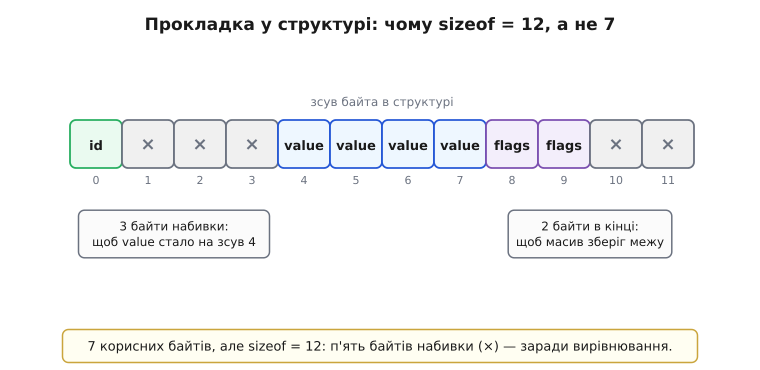
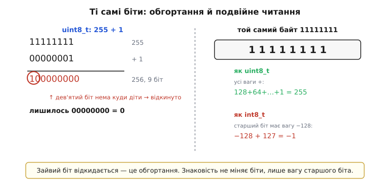

# Змінні й типи: докладно

<preknowlist>
- [Пам'ять як масив](topic:hw-arch/memory-as-array) — стрічка однобайтових комірок, кожна зі своєю адресою-номером; читання й запис за адресою.
- [Біти й порядок байтів](topic:sf-algorithms/bits-bytes-endianness) — байт як вісім бітів, і як багатобайтове число розкладається по сусідніх комірках (little/big-endian).
- [Доповняльний код](topic:math-number-theory/twos-complement-algebra) — як від'ємні числа кодуються тими самими бітами через «старший біт зі знаком мінус».
- [Стек](topic:sf-lang/stack-lifo) — де живуть локальні змінні функції та чому їхнє місце перевикористовується між викликами.
</preknowlist>

У базовій частині ми домовилися про головне: змінна — це **іменована комірка пам'яті**, тип каже машині, скільки місця відвести й як тлумачити біти, знак `=` — це наказ «поклади праве в ліве», а на щодень вистачає чотирьох родин типів зі `<stdint.h>`. Цього досить, щоб писати робочі прошивки. Але щойно код підростає — з'являються структури, змішана арифметика, регістри периферії, оптимізатор, — під кожним із тих простих правил відкривається другий шар, і не знати його означає раз по раз наступати на баги, що «то є, то нема». Тут ми спустимося саме в цей шар: чому комірка стоїть не де завгодно, як **виводиться** діапазон типу з кількості бітів, звідки насправді береться «сміття», чому дробові числа принципово неточні, і що робить оптимізатор із вашими змінними, коли ви за ним не стежите. Скрізь, де базова казала «поки досить знати», ми доведемо річ до дна.

## Комірка має адресу — і ця адреса не будь-яка

Повернімося до найпершого образу: пам'ять — стрічка байтів, у кожного свій номер-адреса, а ім'я змінної компілятор перекладає в конкретну адресу. У базовій ми лишили це на рівні «компілятор вибирає комірку». Тепер спитаймо конкретніше: **яку саме** комірку він вибирає — і чи будь-яка згодиться?

Виявляється, ні. Процесор читає пам'ять не по одному байту, а **машинними словами** — порціями своєї природної ширини (на 32-бітному ядрі ARM це 4 байти за раз). І апаратура шини влаштована так, що чотирибайтове слово вона дістає одним махом лише тоді, коли воно лежить за адресою, **кратною чотирьом**: 0x1000, 0x1004, 0x1008… Якщо ж `uint32_t` опиниться за адресою 0x1002, він розсідлає межу двох слів, і процесор муситиме зробити **два** звертання до пам'яті замість одного, а тоді ще склеїти половинки. На слабших ядрах (як-от Cortex-M0) така **невирівняна** (англ. *unaligned* — не поставлений на межу) адреса взагалі не читається — процесор кидає апаратний виняток і падає.

Тому компілятор ставить кожну змінну на адресу, кратну її розмірові: `uint8_t` — де завгодно (один байт вирівняний завжди), `uint16_t` — на парну адресу, `uint32_t` — на адресу, кратну 4, `double` — кратну 8. Це називають **вирівнюванням** (англ. *alignment*). Ви його не пишете руками — воно вбудоване в те, як компілятор розкладає змінні; але воно негайно спливає, щойно ви складаєте змінні різного розміру в одну **структуру**.

**Скільки насправді важить структура — рахуємо байти вручну:**

```c
#include <stdint.h>
#include <stddef.h>   // для offsetof

struct sensor {
    uint8_t  id;      // 1 байт
    uint32_t value;   // 4 байти, АЛЕ мусить лягти на адресу кратну 4
    uint16_t flags;   // 2 байти
};
```

Наївно порахувавши, чекаєш 1 + 4 + 2 = 7 байтів. Насправді `sizeof(struct sensor)` дасть **12**. Ось звідки зайві п'ять:

```
зсув 0:  id      (1 байт)
зсув 1:  ── 3 байти ПРОКЛАДКИ (padding) ──   ← щоб value лягло на зсув 4
зсув 4:  value   (4 байти)
зсув 8:  flags   (2 байти)
зсув 10: ── 2 байти прокладки в кінці ──     ← щоб масив таких структур
                                                зберігав вирівнювання
──────────────────────────────────────
разом:   12 байтів
```

Компілятор устромив **прокладку** (англ. *padding* — набивка): три «мертві» байти після `id`, щоб `value` стало на кратну-4 адресу, і ще два в кінці, бо якщо покласти ці структури масивом, кожна наступна теж мусить починатися з кратної-4 адреси, а без хвостової набивки друга структура з'їхала б на зсув 10. Байти прокладки нічого не зберігають — вони є суто заради апаратної вимоги вирівнювання.


*Ті самі три поля лягають не щільно. Після однобайтового `id` компілятор лишає три байти набивки (×), щоб чотирибайтове `value` стало на зсув 4 (кратний своєму розмірові), і ще два байти в кінці — щоб у масиві таких структур кожна наступна теж починалася з кратної-4 адреси. Сім корисних байтів перетворюються на дванадцять; переставивши поля від більшого до меншого, набивку прибирають.*

> 🔧 **Навіщо це.** Тут ховаються дві щоденні пастки прошивки. Перша: якщо ви шлете структуру по мережі чи в EEPROM «як є» (`memcpy` усіх її байтів), приймач на іншому компіляторі може розкласти прокладку інакше — і поля роз'їдуться. Тому байтові формати обміну ніколи не покладаються на розкладку структури, а серіалізують поля по одному. Друга: переставивши поля від найбільшого до найменшого (`value`, `flags`, `id`), ви вкладете ту саму структуру у **8** байтів замість 12 — прокладка зникне, бо все ляже щільно. На МК із кількома кілобайтами RAM це не педантизм, а різниця між «влізло» і «не влізло». Хто саме розкладає ці байти по сусідніх комірках і чому порядок усередині числа теж не очевидний — розбирає крок про [біти й порядок байтів](topic:sf-algorithms/bits-bytes-endianness).

## Діапазон типу — не таблиця для запам'ятовування, а наслідок

Базова дала межі готовими: `uint8_t` тримає 0…255, `int16_t` — −32768…32767. Це не магічні числа з таблиці — вони **виводяться** з двох речей: скільки бітів у типі й як ми домовилися тлумачити старший біт. Виведімо їх, бо з того самого виведення прямо випливає найпідступніша поведінка цілих — тихе «перевертання» при переповненні.

Почнемо з беззнакового. N бітів — це N позицій, кожна незалежно 0 або 1, отже рівно **2ᴺ** різних комбінацій. Кожній комбінації відповідає одне число, і найпростіше зіставити їх напряму: комбінація `00000000` — це 0, `00000001` — 1, і так до `11111111`. Найбільше число — коли всі біти одиниці:

```
макс(uint8) = 2⁷ + 2⁶ + 2⁵ + 2⁴ + 2³ + 2² + 2¹ + 2⁰
            = 128 + 64 + 32 + 16 + 8 + 4 + 2 + 1
            = 255
            = 2⁸ − 1
```

Звідси загальне правило беззнакового типу шириною N: діапазон **0 … 2ᴺ − 1**. Для 8 бітів це 0…255, для 16 — 0…65535, для 32 — 0…4294967295. «Мінус один» у формулі — бо одну з 2ᴺ комбінацій забирає сам нуль.

Тепер знаковий тип. Тут треба вмістити ще й від'ємні, а бітів стільки ж — 2ᴺ комбінацій нікуди не діваються, просто їх розкладають інакше. Наївний спосіб — «віддати старший біт під знак» (0 — плюс, 1 — мінус) — сучасні машини **не** використовують, бо він породжує два нулі (+0 і −0) і ламає додавання. Замість нього всюди діє **[доповняльний код](topic:math-number-theory/twos-complement-algebra)**: старший біт лишається розрядом ваги, але його вагу беруть **зі знаком мінус**. Для 8 бітів вага старшого біта не +128, а **−128**:

```
значення = −128·b₇ + 64·b₆ + 32·b₅ + 16·b₄ + 8·b₃ + 4·b₂ + 2·b₁ + 1·b₀
```

Підставмо крайні візерунки. Усі нулі — це 0. `01111111` (старший 0, решта 1): 64+32+16+8+4+2+1 = **127** — це максимум. `10000000` (лише старший): −128 — це **мінімум**. `11111111` (усі одиниці): −128+127 = **−1**. Звідси діапазон знакового типу шириною N: **−2ᴺ⁻¹ … 2ᴺ⁻¹ − 1**. Для 8 бітів це −128…127; додатних на одне менше, бо нуль «оселився» в додатній половині, зайнявши там одне місце.

> 🔧 **Навіщо це.** Той самий байт `11111111` — це **255** як `uint8_t` і **−1** як `int8_t`. Біти однакові; різниця лише в тому, беремо ми вагу старшого біта зі знаком плюс чи мінус. Ось чому «знаковість не міняє біти, лише їхнє читання» — і чому мовчазне перетворення знакового в беззнакове (про яке нижче) таке підступне: біти лишаються ті самі, а число стрибає з −1 у 255. Повний розбір двох осей вибору — ширини й знаковості — та всіх пасток змішування веде окрема стаття про [цілі типи в C/C++](topic:sf-lang/integer-types-c).

### Що стається на межі: обгортання

З цього виведення прямо випливає, як тип поводиться, коли число **не влазить**. Уявіть беззнаковий `uint8_t counter = 255;` і додайте одиницю. Математично мало б вийти 256, але 256 — це `100000000`, дев'ять бітів, а в комірці лише вісім. Старший, дев'ятий біт нема куди подіти — його **відкидають**, і лишається `00000000`, тобто **0**. Лічильник «перевернувся» через нуль:

```
  11111111   (255)
+ 00000001   (  1)
──────────
 100000000   (256, дев'ять бітів)
  00000000   ← дев'ятий біт відкинуто → лишилось 0
```


*Дві сторони однієї механіки. Ліворуч — обгортання: сума `255 + 1` не влазить у вісім бітів, дев'ятий біт нема куди подіти, його відкидають, і лічильник падає в нуль. Праворуч — подвійне читання: той самий візерунок `11111111` дає 255, коли всі ваги додатні (беззнаковий тип), і −1, коли старший біт важить −128 (знаковий доповняльний код). Біти незмінні; усе вирішує, як ми домовилися їх читати.*

Це не помилка й не «глюк» — це прямий наслідок того, що комірка скінченна. C називає таку беззнакову арифметику **арифметикою за модулем 2ᴺ**: результат завжди беруть як остачу від ділення на 2ᴺ. Для беззнакових типів стандарт це **гарантує** — обгортання визначене й передбачуване, на нього можна покладатися (наприклад, при обчисленні різниці таймерів, що самі переповнюються).

А от зі **знаковими** типами історія тонша, і тут криється важлива зміна в самій мові. Що станеться, як до `int8_t x = 127;` додати одиницю? Візерунок `01111111` + 1 = `10000000`, а це в доповняльному коді **−128**. Число «перескочило» з найбільшого додатного в найменше від'ємне. Апаратно — та сама механіка відкидання зайвого біта. Але **стандарт мови десятиліттями оголошував знакове переповнення [невизначеною поведінкою](topic:sf-lang/overflow-wraparound)** (англ. *undefined behavior*) — не «дасть −128», а «може статися будь-що, компілятор має право припустити, що цього не буває взагалі». Причина історична: ранні C-стандарти дозволяли машинам зберігати знак по-різному (не лише доповняльним кодом), тож поведінку на межі не можна було зафіксувати єдиною.

Це змінилося зовсім недавно. Стандарт **C23** (редакція мови 2023 року) нарешті **зобов'язав** усі реалізації використовувати доповняльний код для знакових цілих — інші представлення (знак-величина, обернений код) заборонені (це закріпив документ комітету N2412, [ISO/IEC 9899:2023]). Тобто *представлення* тепер єдине для всіх. Проте — і це критично — саме **переповнення** знакового типу C23 усе одно лишив невизначеним: те, що біти лягають доповняльним кодом, гарантовано, а те, що `127 + 1` дасть саме −128, — ні; оптимізатор і далі має право вважати, що знакового переповнення не буває. Тому практичне правило незмінне: **на знакове обгортання не покладайтеся ніколи**; якщо потрібне кероване «перевертання» — беріть беззнаковий тип, де воно визначене.

> 🔧 **Навіщо це.** Різниця між «визначено» й «невизначено» тут — не буквоїдство, а причина справжніх багів. Лічильник кільцевого буфера, різницю двох показів `millis()`, хеш — тримайте в **беззнакових**: їхнє обгортання за модулем 2ᴺ і є та поведінка, на якій будують такий код. А ось цикл `for (int8_t i = 0; i < n; i++)`, де `n` раптом більше за 127, — це не «і перевернеться в −128», а **невизначена поведінка**, і оптимізатор, припустивши, що `i` завжди росте, може викинути перевірку взагалі й зациклити програму. Тому лічильники циклів беруть із запасом ширини й беззнаковими там, де не буває від'ємних. Статус фактів про C23 — усталено: обов'язковість доповняльного коду й збережена невизначеність знакового переповнення прописані в самому стандарті 2023 року.

## `char`: маленьке ціле, чий знак — не ваш вибір

Базова назвала `char` типом для одного символу й попередила, що всередині там просто число — код за таблицею [ASCII](topic:sf-data/ascii-utf8). Тут треба додати рису, яка ловить навіть досвідчених: **чи знаковий `char`, стандарт не фіксує**. На одній платформі `char` поводиться як `int8_t` (−128…127), на іншій — як `uint8_t` (0…255), і компілятор вправі вибрати будь-що. Це унікальна дивина: `char`, `signed char` і `unsigned char` — це в C **три різні типи**, тоді як для всіх інших цілих «звичайний» і «signed» — синоніми.

Поки ви кладете в `char` літери латиниці (їхні коди 0…127, старший біт нуль), різниця не видна. Але щойно там опиниться байт зі старшим бітом 1 — код понад 127, наприклад «сирий» байт із давача або символ національної абетки — і ви його порівнюєте чи розширюєте до ширшого типу, знак вирішує все:

**Той самий байт, два прочитання:**

```c
char c = 200;             // 200 не влазить у знаковий діапазон −128…127

// якщо на цій платформі char ЗНАКОВИЙ:
//   біти 11001000 читаються як −56
//   int x = c;  дасть  x = −56   (знакове розширення заповнює старші біти одиницями)

// якщо char БЕЗЗНАКОВИЙ:
//   ті самі біти 11001000 читаються як 200
//   int x = c;  дасть  x = 200

if (c > 100) { /* спрацює на беззнаковій платформі, НЕ спрацює на знаковій */ }
```

Один і той самий код дає різні числа на різних платах — точно той клас багів, який мучить найдовше, бо на вашій машині все працює, а на чужій «раптом» ні. Звідси тверде правило прошивки: `char` — **лише для тексту** (літер і рядків, де ви не робите над ними арифметики). Треба «маленьке ціле» — беріть **однозначні** `int8_t` чи `uint8_t`, де знак прописаний в імені. А для байтів, що можуть мати старший біт (сирі дані, буфери), беріть **`uint8_t`**, щоб значення завжди читалося як 0…255 без несподіванок зі знаком.

> 🔧 **Навіщо це.** Класична пастка — функції на кшталт `getchar()` чи розбір UTF-8: символ приходить у `char`, а байти кирилиці мають старший біт 1. Порівняли такий `char` із числом на знаковій платформі — і межа поїхала. Тому в роботі з байтовими потоками (протоколи, файли, мережа) буфери оголошують `uint8_t[]`, а не `char[]`: тоді кожен байт — чесні 0…255, і жодна платформа не прочитає його як від'ємний за спиною.

## Дробові числа: чому `0.1` не вміщається рівно

Базова попередила: `float` неточний, `0.1` в ньому не зберігається рівно, порівнювати «в лоб» небезпечно. Це не хиба реалізації й не «майже точно» — це **принципова** неможливість, і варто зрозуміти, звідки вона, бо саме нерозуміння породжує години марного налагодження «чому `0.1 + 0.2 != 0.3`».

Дробове число в C кодується за схемою **[плаваючої коми](topic:hw-arch/floating-point)** (стандарт IEEE 754, який фактично прийняли всі: сам C формально не зобов'язує його, але кажучи `float`/`double`, на будь-якому реальному МК ви дістаєте саме IEEE-754). Ідея — тримати число в тому ж вигляді, що й наукова нотація на папері: **знак × значущі цифри × основа^степінь**. Тільки основа тут не 10, а **2**, бо машина двійкова. Для `float` (32 біти) 32 розряди діляться так:

```
[ 1 біт знак ] [ 8 бітів порядок (степінь двійки) ] [ 23 біти мантиса (значущі двійкові цифри) ]
```

Знак — плюс чи мінус. **Порядок** (англ. *exponent* — показник степеня) каже, на яку степінь двійки помножити, — це й є та «кома, що плаває»: для великих чисел степінь додатний і кома їде праворуч, для дрібних — від'ємний і кома лізе ліворуч. **Мантиса** (лат. *mantissa* — «додаток») зберігає самі значущі двійкові цифри числа. Разом вони кажуть: візьми ці цифри й посунь кому ось на стільки позицій.

Тепер — корінь неточності. Число `0.1` в **десятковому** записі скінченне й гарне. Але машина зберігає значущі цифри у **двійці**, а `0.1` у двійковій системі — це **нескінченний періодичний** дріб, так само як `1/3 = 0.333…` нескінченний у десятковій:

```
0.1 (десяткове) = 0.0001100110011001100110011…₂   (двійкове, період «0011» без кінця)
```

Мантиса має лише 23 біти — місця під нескінченний хвіст нема. Тому машина **обрубує** дріб на 23-му розряді й зберігає найближче можливе значення, яке рівно `0.1` **не є** — воно на крихту більше або менше. Кожне таке `0.1` носить у собі мікроскопічну похибку округлення; склавши три такі наближені `0.1`, ви складаєте й три похибки, і сума розходиться з «рівно 0.3» на останніх розрядах. Звідси залізне правило: дробові **ніколи не порівнюють на точну рівність** (`==`); порівнюють, чи різниця менша за малий поріг:

```c
#include <math.h>       // fabsf
float a = 0.1f + 0.2f;  // насправді 0.30000001192…
// НЕ так:  if (a == 0.3f)          — майже завжди хибне
// А так:
if (fabsf(a - 0.3f) < 1e-6f) { /* «достатньо близько» */ }
```

> 🔧 **Навіщо це.** У прошивці до цього додається другий, важчий бік: багато дешевих МК **не мають апаратного блоку** дробової арифметики (FPU). Там кожне множення `float` розкладається компілятором на десятки цілочислових інструкцій — повільно й ненажерливо до пам'яті програм. Тому в реальному часі (обробка сигналу, керування мотором у перериванні) дробові беруть свідомо й ощадно, а часто взагалі уникають, працюючи в цілих числах із домовленим масштабом — **[фіксованій комі](topic:hw-arch/fixed-point)**, де, скажімо, «сотні мілівольтів» тримають звичайним `int32_t` без жодного `float`. Повний розбір, як улаштовані порядок і мантиса, скільки саме цифр вони дають і де ще ховаються тонкощі (переповнення в нескінченність, денормалі), — у статті про [плаваючу кому](topic:hw-arch/floating-point).

## Присвоєння як машинна дія — і чому важить порядок

Базова встановила головне: `=` — це наказ «обчисли праве, поклади в комірку ліворуч», а не рівність, тому `price = price + item` осмислене. Спустімося на рівень того, що насправді робить процесор, — звідси випливе і чому ліворуч не може стояти що завгодно, і чому порядок обчислення іноді кусається.

Розкладімо `speed = old + 5;` на елементарні кроки машини:

```
1. ПРОЧИТАЙ вміст комірки old у робочий регістр процесора
2. ДОДАЙ 5 до цього регістра
3. ЗАПИШИ результат із регістра в комірку speed
```

Три дії: читання джерела, обчислення, запис у призначення. Звідси видно річ, яку базова лишила між рядків: ліворуч від `=` мусить стояти **щось, що має адресу**, куди можна записати, — комірка. Таку сутність у C звуть **lvalue** (від *left value* — «значення, придатне стояти ліворуч»): це змінна, елемент масиву, поле структури — усе, у чого є місце в пам'яті. А `old + 5` — це просто число в регістрі, у нього адреси нема, записати туди нічого не можна. Тому `old + 5 = speed;` компілятор відкине: праворуч від `=` — будь-який вираз-значення, ліворуч — лише те, що має куди прийняти запис. Оце розрізнення «значення проти комірки» — фундамент, на якому згодом стоятимуть покажчики.

Тепер тонкість порядку, невидима, поки все в одному рядку. Розгляньмо два присвоєння підряд:

```c
uint16_t a = 10;
uint16_t b = 20;

a = b;            // прочитали b (20), поклали в a → a = 20
b = a;            // прочитали a (ВЖЕ 20), поклали в b → b лишилось 20
```

Після цих двох рядків **обидві** змінні = 20, а не «помінялися місцями», як хтось міг би сподіватися. Причина строго механічна: перший рядок **уже затер** старе `a`, тож другий читає нове значення. Комірка одна, новий запис витісняє старий безповоротно — «старого `a`» на момент другого рядка вже не існує. Щоб справді поміняти дві змінні місцями, старе значення треба **зберегти** в третій комірці, поки його не затерли:

```c
uint16_t tmp = a;   // сховали старе a
a = b;              // a дістало b
b = tmp;            // b дістало збережене старе a  → тепер обмін відбувся
```

Ця дрібниця — прямий наслідок того, що `=` є **дією в часі**, а не рівнянням: рівняння `a = b` і `b = a` описували б один стан, а два присвоєння — це два послідовні перезаписи, і порядок їх вирішує все. Мова від початку будувала присвоєння як дію над коміркою, а не як твердження про рівність; звідки взялося саме таке розуміння змінної — від номера комірки до імені з типом — простежує вставка [як число з комірки стало іменем із типом](root:embedded/c-variables-types/hist-typed-variables.md).

## Де живе комірка і скільки — звідси й «сміття»

Базова назвала неініціалізовану локальну змінну «сміттям» і веліла ініціалізувати одразу. Тепер відповімо на питання, яке вона оминула: **чому** там сміття, а не, скажімо, нуль? Відповідь — у тому, **де** і **як довго** живе комірка змінної. У C кожна змінна має **тривалість зберігання** (англ. *storage duration*) — правило, що вирішує, коли їй виділяється місце і коли забирається. Основних видів два, і вони поводяться протилежно.

**Локальна змінна** (оголошена всередині функції) має **автоматичну** тривалість: місце під неї виділяється на **[стеку](topic:sf-lang/stack-lifo)**, коли виконання входить у функцію, і **забирається**, щойно функція завершується. Стек — спільна ділянка пам'яті, яку всі функції по черзі беруть і повертають. Коли функція завершилась, її шматок стеку не стирається — він просто оголошується вільним, і **наступна** функція кладе туди свої змінні поверх старих байтів. Ось звідки «сміття»: коли ви оголосили `uint8_t x;` без ініціалізації, у його комірці лежать ті біти, які лишила **попередня** функція, що займала це саме місце стеку. Значення не випадкове в сенсі «шумове» — воно цілком конкретне, просто це **чужий недогризок**, і залежить він від того, що виконувалося перед вами. Тому неініціалізована змінна поводиться «то так, то сяк»: варто змінити, яка функція викликалася раніше, — і в комірці інший мотлох.

**Статична й глобальна змінна** (оголошена поза функціями або зі словом `static`) має **статичну** тривалість: місце під неї виділяється **раз** на весь час роботи програми, в окремій ділянці, а не на стеку. І от вона, на відміну від локальної, **обнуляється** при старті — C-рантайм перед `main` заповнює всю цю ділянку нулями. Тому глобальний `uint8_t counter;` гарантовано почне з 0, а локальний — ні. Різниця не в примсі мови, а в тому, що стек перевикористовується безліч разів за секунду й обнуляти його щоразу було б марнуванням тактів, а статична ділянка ставиться один раз, і її обнулити дешево.

```c
uint16_t g_boot_count;          // ГЛОБАЛЬНА → рантайм поставить 0 до main

void task(void) {
    uint16_t local;             // ЛОКАЛЬНА → у ній байти попередньої функції
    // читати local тут — сміття;  g_boot_count тут — надійний 0
}
```

> 🔧 **Навіщо це.** Це пояснює найкапризніший клас багів прошивки — «плаваючі», що відтворюються через раз. Функція працює правильно, коли її викликають після одних функцій, і збоїть після інших, — бо забула ініціалізувати локальну, і та щоразу підхоплює різне сміття зі стеку. Компілятор з `-Wall` попереджає про читання неініціалізованої, але звичка задавати значення **в тому ж рядку, де оголошуєш**, знімає цей клас цілком. І навпаки: розуміння, що глобальні стартують із нуля, а локальні — ні, підказує, коли можна не писати `= 0` (глобальний прапорець), а коли обов'язково (будь-яка локальна). Як саме стек бере й повертає ці шматки пам'яті по ходу викликів — розбирає крок про [стек](topic:sf-lang/stack-lifo).

## `const` і `volatile`: обіцянки й попередження компіляторові

Є два слова-приставки до типу, без яких вбудований код не пишуть, а базова їх не торкнулася зовсім. Вони не змінюють ні розмір комірки, ні розкладку бітів — вони змінюють, що компілятор **вправі припускати** про змінну, а отже, як він її оптимізує. У прошивці, де змінна нерідко відображає фізичний регістр заліза, ця різниця буквально вирішує, працюватиме код чи ні.

**`const`** (від *constant* — сталий) — це ваша обіцянка компіляторові: «цю змінну я після ініціалізації **не мінятиму**». Оголосивши `const uint8_t gain = 16;`, ви забороняєте собі ж випадковий запис у `gain` — спроба присвоєння не збереться. Користь подвійна. По-перше, це ловить помилки: якщо десь у коді ви ненароком напишете в те, що мало лишатися сталим, компілятор спинить вас на збірці, а не лишить баг на потім. По-друге — і це важить на МК — сталі з `const` компілятор може покласти не в дорогоцінну RAM, а у **Flash** (пам'ять програм), якої на порядок більше. Велика таблиця коефіцієнтів чи шрифт, оголошені `const`, не з'їдять ані байта оперативної пам'яті — вони лежатимуть там само, де код.

**`volatile`** (від *volatile* — летючий, мінливий) — протилежна за духом річ: це попередження «значення цієї комірки може змінитися **саме по собі**, поза видимим потоком коду; не роби про неї жодних припущень». Навіщо таке? Бо оптимізатор, аби пришвидшити код, постійно припускає, що змінна міняється **лише** тоді, коли в неї явно пишуть. Це дозволяє йому, скажімо, прочитати змінну раз, покласти в регістр і далі брати з регістра, не бігаючи в пам'ять. Для звичайної змінної це чудово. Але уявіть, що змінна — це насправді **регістр периферії**, куди залізо саме кладе новий біт готовності давача, або комірка, яку міняє **переривання**. Оптимізатор про це не знає; він, побачивши цикл «чекай, поки біт стане 1», може вирішити: «біт я прочитав раз, у коді його ніхто не міняє — значить, він незмінний», і зациклити програму назавжди, ні разу більше не глянувши в пам'ять.

```c
// РЕГІСТР статусу периферії за фіксованою адресою:
volatile uint32_t *status = (volatile uint32_t *)0x40001000;

while ((*status & 0x01) == 0) {
    // без volatile оптимізатор прочитав би *status ОДИН раз і зациклився;
    // з volatile він ЩОРАЗУ лізе в пам'ять — і побачить, коли залізо
    // виставить біт готовності
}
```

`volatile` наказує компіляторові **щоразу справді читати комірку з пам'яті** й щоразу справді туди писати, ніколи не кешуючи в регістрі й не викидаючи «зайвих» звертань. Ціною повільнішого коду ви дістаєте правильність там, де значення живе своїм життям.

> 🔧 **Навіщо це.** Це два найчастіші кваліфікатори у прошивці, і плутати їх дорого. **`const`** ставте на все, що не міняється після ініціалізації, — калібрувальні сталі, таблиці, рядки: компілятор і помилку впіймає, і в Flash покладе, зберігши RAM. **`volatile`** — обов'язковий на трьох речах: регістрах периферії (їх міняє залізо), змінних, які чіпає переривання (їх міняє ISR за спиною головного коду), і прапорцях спілкування між потоками. Забули `volatile` на регістрі — і код працює в налагодженні (де оптимізації вимкнено), але зависає в релізі (де оптимізатор увімкнувся й «спростив» ваш цикл очікування). Це один із найпідступніших багів, бо з'являється рівно тоді, коли ви вмикаєте оптимізацію для швидкості.

## Тихі перетворення: коли типи зустрічаються в одному виразі

Останній глибокий шар, повз який базова пройшла коротким «тихі перетворення знаку». Коли у виразі зустрічаються два різні типи — `uint8_t + uint32_t`, `int` і `unsigned`, знакове й беззнакове, — C **не** лишає їх як є: перед дією він приводить операнди до одного спільного типу за жорсткими, завжди однаковими правилами. Ці правила зазвичай невидимі й роблять розумне, але в кількох місцях дають результат, що суперечить інтуїції, — і саме там народжуються баги.

Перше правило — **цілочислове підвищення** (англ. *integer promotion*). Будь-який цілий тип **вужчий** за `int` (тобто `char`, `int8_t`, `uint8_t`, `int16_t`, `uint16_t`) перед арифметикою автоматично **розширюється до `int`**. Причина історична й апаратна: процесор природно рахує у своїй повній ширині, і рахувати «півбайтами» йому незручно, тож мова спершу підтягує всі вузькі операнди до повного `int`. Наслідок, що дивує:

```c
uint8_t a = 200;
uint8_t b = 100;
uint8_t c = a + b;      // чекаєш обгортання: 200+100=300, у 8 біт → 44?
```

Насправді `a` і `b` спершу **обидва стають `int`** (32-бітними), там 200 + 100 = **300** без жодного обгортання — `int` легко тримає 300. І лише в останню мить, при записі назад у 8-бітний `c`, 300 усікається до `300 mod 256 = 44`. Тобто проміжне обчислення йде в ширшому типі, ніж операнди, і це часом рятує (не переповнюється зарано), а часом плутає (переповнення стається не там, де чекав, — при **присвоєнні**, а не при **додаванні**).

Друге правило — **звичайні арифметичні перетворення** — вмикається, коли після підвищення операнди все ще різні, і серед них найпідступніший випадок: **знакове зустрічає беззнакове однакової ширини**. Тут правило безжальне: **знаковий операнд перетворюється на беззнаковий**, а не навпаки. А ми вже бачили, що при такому перетворенні біти лишаються ті самі, тож `−1` читається як найбільше беззнакове число:

**Порівняння, що бреше:**

```c
int      s = -1;
unsigned u =  1;

if (s < u) {
    // здоровий глузд: −1 < 1 → істина, зайдемо сюди
    // C: s перетворюється на unsigned → −1 стає 4294967295 (біти ті самі!)
    //    порівнюємо 4294967295 < 1 → ХИБА → сюди НЕ зайдемо
}
```

Порівняння `−1 < 1` дає **хибу**, бо перед ним `−1` мовчки перетворилося на гігантське беззнакове число (біти `11111111…` прочиталися без знаку). Це не рідкісна екзотика: варто змішати знаковий лічильник із беззнаковим `sizeof` чи довжиною буфера — і межа циклу може поїхати або перевірка «менше нуля» ніколи не спрацює. Статус цих правил — усталено: і підвищення вузьких типів до `int`, і перетворення знакового в беззнакове при рівній ширині прописані в стандарті C і однакові в усіх компіляторах.

> 🔧 **Навіщо це.** Практичний висновок один: **не змішуйте знакове з беззнаковим в одному порівнянні чи арифметиці**, а якщо мусите — робіть перетворення **явним** (через приведення типу), щоб бачити його очима, а не отримати за спиною. Компілятор з `-Wall -Wextra` попереджає про «порівняння знакового з беззнаковим» саме тому, що це джерело реальних дір — не ігноруйте це попередження. І тримайте в голові головну причину: у C між двома типами ніколи не буває «нічого» — завжди відбувається якесь перетворення за фіксованим правилом, і ваша робота — знати, яке саме, а не сподіватися, що «якось складеться». Уся павутина цих правил для цілих, з усіма рангами й крайніми випадками, розкладена в статті про [цілі типи в C/C++](topic:sf-lang/integer-types-c).

## `sizeof` глибше: розмір, вирівнювання і чому вони різні

Базова показала `sizeof` як спосіб дізнатися розмір типу в байтах і відзначила, що він рахується під час компіляції. Додамо два уточнення, які роблять його по-справжньому корисним у прошивці.

Перше: `sizeof` повертає розмір **із урахуванням прокладки**, а не суму «корисних» байтів. Ми вже бачили це на `struct sensor`, де `sizeof` дав 12, а не 7. Тому `sizeof` — єдиний **правильний** спосіб дізнатися, скільки місця справді займе структура: рахувати руками означає забути про вирівнювання й помилитися. Коли ви передаєте розмір буфера у функцію (`memcpy`, `memset`, запис у Flash), беріть його через `sizeof`, а не вписуйте число — тоді при зміні типу розмір оновиться сам і не розійдеться з реальністю:

```c
struct sensor buf[8];
memset(buf, 0, sizeof(buf));   // sizeof(buf) = 8 × 12 = 96 байтів,
                               // з прокладкою — рівно стільки, скільки треба обнулити
```

Друге: `sizeof` рахується **на етапі компіляції** й повертає тип `size_t` — це беззнаковий цілий тип, чия ширина дорівнює природній ширині адреси платформи (на 32-бітному МК — 32 біти). Через те, що `size_t` **беззнаковий**, він і втягує ту саму пастку змішування, про яку щойно йшлося: порівняння знакового лічильника з `sizeof(...)` мовчки перетворить лічильник на беззнаковий. Тому індекси й лічильники, які порівнюють із розмірами, теж природно тримати беззнаковими — щоб обидві сторони порівняння були одного знаку.

> 🔧 **Навіщо це.** `sizeof` — ваш захист від «магічних чисел» розміру, які роз'їжджаються при найменшій зміні типу. Написали `write_flash(&cfg, 32)` руками — і при додаванні поля в `cfg` число 32 лишилося старим, а структура підросла: половина конфігурації не запишеться. Написали `write_flash(&cfg, sizeof(cfg))` — розмір завжди актуальний. А пам'ятаючи, що `sizeof` дає **беззнаковий** `size_t`, ви не втрапите в тиху пастку, порівнюючи його зі знаковим лічильником.

## Підсумок

Під кожним простим правилом базової лежить механіка, знати яку — означає не наступати на цілі класи багів. Комірка змінної стоїть не будь-де, а на адресі, **кратній своєму розмірові** (вирівнювання), і саме тому структури містять невидиму **прокладку**, а `sizeof` — єдиний надійний спосіб дізнатися їхній справжній розмір. Діапазон типу не запам'ятовують, а **виводять** із кількості бітів: беззнаковий дає 0…2ᴺ−1, знаковий у доповняльному коді — −2ᴺ⁻¹…2ᴺ⁻¹−1, і з цього ж виведення прямо випливає обгортання на межі — визначене для беззнакових, невизначене для знакових навіть у C23. `char` окремо небезпечний тим, що його **знаковість не фіксована**, тож для байтів беруть `uint8_t`, а `char` лишають тексту. Дробові числа неточні **принципово**, бо `0.1` — нескінченний дріб у двійці, який мантиса обрубує; тому їх не порівнюють на рівність і на слабких МК уникають. Присвоєння `=` — це **дія в часі** над коміркою (читай → обчисли → запиши), звідки й вимога lvalue ліворуч, і залежність результату від порядку. «Сміття» в неініціалізованій локальній — це **чужі байти зі стеку**, бо локальні мають автоматичну тривалість і перевикористовують пам'ять, тоді як глобальні живуть статично й обнуляються при старті. Слова **`const`** і **`volatile`** не міняють біти, а міняють, що компілятор вправі припускати: `const` економить RAM і ловить помилки, `volatile` рятує цикли очікування регістрів від «розумного» оптимізатора. І нарешті, коли типи зустрічаються у виразі, C **завжди** приводить їх до спільного за жорсткими правилами — вузькі підвищуються до `int`, а знакове при зустрічі з беззнаковим тихо стає беззнаковим, через що `−1 < 1u` дає хибу. Далі, у [розгалуженнях і циклах](root:embedded/c-control-flow), ці типи й перетворення почнуть керувати самим ходом програми — і кожна пастка звідси спливе вже в умовах та лічильниках циклів.
