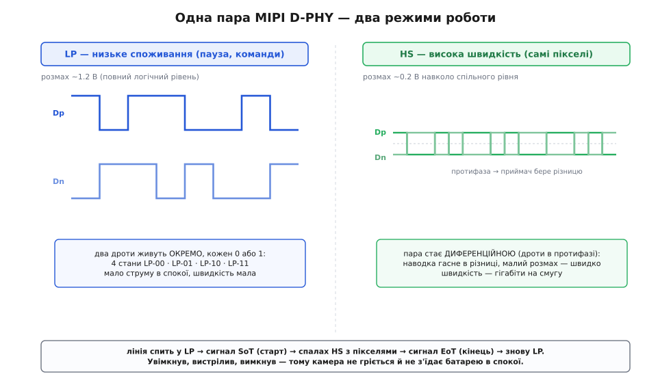
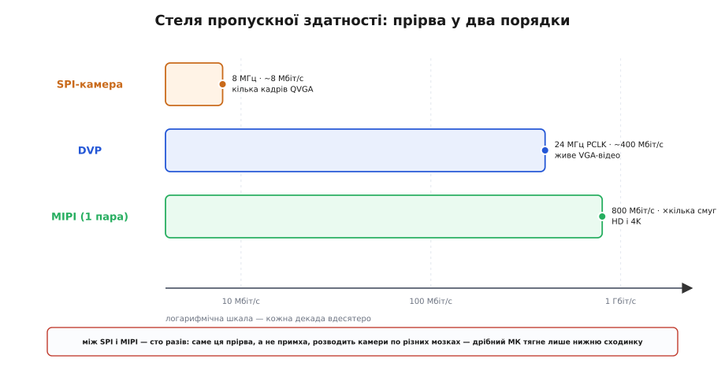

# Підключення камери до МК зблизька: як насправді біжать пікселі

<preknowlist>
- [Прямий доступ до пам'яті (DMA)](root:hw-arch/dma-controller) — окремий блок, що перекладає байти з периферії в пам'ять без участі процесора; без нього DVP не жити.
- [DMA + АЦП](root:embedded/dma-adc) — як налаштувати захоплення потоку в кільцевий буфер із подвійною буферизацією; той самий кістяк працює й для камери.
- [Диференційна пара](root:hw-analog/opamp-input-stage) — два дроти в протифазі, приймач бере різницю; наводка б'є по обох і в різниці зникає.
- [SerDes](root:com-modulation/serdes) — серіалізація/десеріалізація: як зібрати з окремих бітів назад байти й відновити такт із самого потоку.
- [Шина I2C](root:com-devices/i2c-bus) — дві лінії, майстер і відомі за адресами, відкритий стік; керуючий канал камери — це майже вона.
- [Шина SPI](root:com-devices/spi-bus) — чотири дроти, повнодуплексний зсувний регістр, режими 0–3; піксельний канал SPI-камери — саме вона.
- [Регістрова карта](root:com-devices/register-map) — периферія як набір комірок за адресами; налаштування сенсора — це записи в його карту.
</preknowlist>

У базовому кроці ми розкроїли розвилку начисто: пікселі народжуються всередині чипа камери, а працює з ними мікроконтролер поруч, і між ними стоїть **інтерфейс** — DVP, MIPI-CSI або SPI з буфером. Ми побачили, *що* обрати й *чому* їх узагалі три. Але щойно береш паяльник і осцилограф, з'ясовується, що кожен із цих трьох способів усередині влаштований куди тонше, ніж «вісім дротів» чи «одна пара». І саме ці тонкощі — не загальна ідея, а конкретна механіка — вирішують, чи запрацює твоя плата й чому вона мовчить, коли мовчить.

Тут ми залізаємо всередину. Порахуємо, звідки насправді береться частота PCLK і чому вона **більша**, ніж проста арифметика «пікселі × кадри». Розберемо, як блок DCMI усередині STM32 пакує вісім ніжок у 32-бітні слова й чому йому не байдуже до значень `0x00` і `0xFF`. Зазирнемо в MIPI-лінію, яка вміє бути то **дрімотною й ощадною**, то **шаленою й гігабітною**, і побачимо, з чого зроблений пакет CSI-2 — аж до біта корекції помилок. І виведемо, з точністю до мегабіта, чому SPI-камера фізично не дає живого відео, хоча знімок — залюбки. Нитка курсу вже дала нам [DMA](root:hw-arch/dma-controller), [диференційну пару](root:hw-analog/opamp-input-stage) і [SerDes](root:com-modulation/serdes) — тепер ми складемо з цих деталей повну картину того, як пікселі долають кілька сантиметрів між двома мікросхемами.

## Чому PCLK швидший, ніж здається: анатомія бланкінгу

У базовому кроці ми порахували потік DVP навпростець: 640×480 пікселів, два байти на піксель, тридцять кадрів — виходить близько 18 мегабайтів за секунду й, отже, PCLK десь 18 МГц. Цифра правильна за порядком, але вона **применшує** реальну частоту такту, і причина цього применшення — одна з найважливіших речей, які треба знати про будь-який растровий відеосигнал. Розберімо її від кореня.

Уяви, що сенсор зчитує матрицю рядок за рядком (саме так працює [рядкова заслінка](root:hw-sensing/rolling-shutter)). Дійшовши до кінця рядка, він мусить **перескочити** на початок наступного — а це не миттєва операція. Усередині матриці треба перемкнути адресні лінії, дати відстоятися підсилювачам, підготувати наступний рядок до зчитування. Поки це відбувається, дійсних пікселів на виході немає — це **горизонтальний бланкінг** (*horizontal blanking* — рядкове гасіння). Так само, дочитавши **останній** рядок кадру, сенсор мусить повернутися на самий верх — і цей зворотний хід ще довший: це **вертикальний бланкінг** (*vertical blanking* — кадрове гасіння). Назви — спадок електронно-променевих трубок, де промінь фізично летів назад через увесь екран і його на цей час гасили, щоб не малювати зайвого; у цифровій матриці променя немає, але пауза на «перезарядку» лишилася.

І ось у чому сіль. PCLK цокає **тільки** тоді, коли на виході є дійсний піксель, — тобто під час активної частини рядка. Але кадр за секунду треба видати цілий, разом із усіма паузами. Значить, усі дійсні пікселі мусять «утиснутися» в ту частину секунди, що лишилася **після** вирахування бланкінгу. А отже, поки PCLK біжить, він біжить **швидше**, ніж середня швидкість «пікселі за всю секунду». Порахуймо це чесно.

**Справжня частота PCLK з урахуванням бланкінгу.** Сенсор OV7670, VGA 640×480, 30 кадрів/с. Типові величини бланкінгу для такого сенсора: близько 144 тактів горизонтального гасіння на кожен рядок і близько 10 «сліпих» рядків вертикального гасіння на кадр (числа порядку тих, що дають даташити OV-сенсорів).

```text
такти на повний рядок    = 640 (дійсні) + 144 (гасіння)   = 784
рядків на повний кадр     = 480 (дійсні) + 10  (гасіння)    = 490
тактів PCLK на кадр        = 784 × 490                        = 384 160
                             (а «наївно» було б 640×480       = 307 200)
тактів PCLK за секунду     = 384 160 × 30                     ≈ 11 520 000
```

Стоп — тут PCLK вийшов ~11.5 МГц, а не 18. Річ у тім, що OV7670 у форматі RGB565 віддає **два байти на піксель за два такти PCLK** (або, в інших режимах, один піксель за такт, але вдвічі меншого «сирого» розміру). Якщо рахувати в байтах виходу, як у базовому кроці, помнож на два — і отримаєш ті самі ~18–23 мільйони байтів за секунду. Головне не конкретне число, а **ефект**: реальна тактова частота піксельного інтерфейсу завжди **вища** за наївну «роздільність × кадри», бо частину часу з'їдає бланкінг. Для VGA різниця — відсотків двадцять-тридцять; для форматів із широкими паузами (а сенсори часто мають довгий вертикальний бланкінг) — і всі півтора раза.

> 🔧 **Навіщо це.** Ця «зайва» швидкість — не абстракція, вона визначає, чи впорається твоє залізо. Коли ти обираєш дільник тактової частоти для XCLK або прикидаєш, чи встигне DMA й шина AHB прожувати потік, рахувати треба на **пікову** частоту PCLK — з бланкінгом, — а не на середню. Інакше на активних рядках потік перевищить те, на що ти розраховував, FIFO переповниться, і в кадрі поповзуть **зсуви й розриви**: типова картина «камера майже працює, але картинка рветься смугами». Друга практична річ: бланкінг — це вікно, у якому нічого не летить, і саме в нього DMA й процесор встигають перевести дух, перемкнути буфер, обробити попередній рядок. Бланкінг не марнота — це вбудований у відеосигнал ритм, під який підлаштовується вся система.

Є ще один бік цієї медалі — **VSYNC як межа подвійної буферизації**. Ми у базовому кроці сказали, що перепад VSYNC означає «почався новий кадр». Тепер видно навіщо це критично на практиці. Поки DMA сипле пікселі поточного кадру в буфер А, процесор **не має** його чіпати — картинка ще недомальована. Момент, коли її можна брати в обробку, — це рівно перепад VSYNC: він каже «кадр у буфері А цілий, я почав лити наступний у буфер Б». Класична конструкція — **подвійний буфер** (*double buffering*): два кадрові буфери, DMA пише в один, процесор читає інший, а на кожному VSYNC вони міняються ролями. Той самий прийом ping-pong, який ми вже [бачили в захопленні АЦП](root:embedded/dma-adc), тут працює один-в-один, лише одиниця даних більша — цілий кадр замість блоку відліків.

## DVP усередині DCMI: як вісім ніжок стають потоком у пам'яті

Базовий крок сказав: DVP ловить апаратний блок, на STM32 це DCMI, на ESP32 — перепризначений I2S, «суть одна». Суть справді одна, але **механіка** цих блоків повчальна сама собою: вона показує, як узагалі можна зловити мільйони байтів за секунду, не маючи для цього мільйонів тактів процесора. Розберемо на прикладі DCMI, бо він найпрозоріший.

Найперша проблема приймача паралельної шини — **розрив швидкостей**. PCLK біжить на десятках мегагерц. Внутрішня шина мікроконтролера (AHB), якою дані їдуть у пам'ять, теж швидка, але вона **не синхронна** з PCLK: у неї свій такт, свої затримки, до неї в чергу стоять інші майстри (сам процесор, інші DMA-канали). Якби DCMI намагався на кожен фронт PCLK одразу пхати байт на AHB, він би постійно впирався в зайняту шину й губив пікселі. Розв'язок — **буфер-прокладка**: маленька черга FIFO між ніжками камери й шиною. DCMI має чотирислівний FIFO (*First In, First Out* — «перший увійшов, перший вийшов»): PCLK наповнює його з одного кінця у своєму темпі, а DMA спорожняє з іншого, коли AHB вільна. FIFO згладжує ривки — рівно як водонапірна башта між насосом і краном.

Друга ідея ще хитріша й економніша. Камера дає по вісім бітів за такт, але тягати пам'ять по одному байту — марнотратство: кожне звертання до шини має накладні витрати, і робити їх учетверо частіше, ніж треба, безглуздо. Тому DCMI **пакує**: він накопичує чотири послідовні байти від камери й складає їх в одне **32-бітне слово**, і лише тоді віддає DMA цілим словом. Одне звертання до шини замість чотирьох. Саме тому в налаштуванні DMA під камеру ширина периферійного слова — **32 біти**, хоча камера восьмибітна: DMA бачить не байти, а вже спаковані слова. Це не дрібниця конфігурації — це прямий наслідок того, що шину треба берегти.

```text
   PCLK →  [B0][B1][B2][B3]  чотири байти від камери, по одному за такт
                  ↓  DCMI пакує
             [ B3 B2 B1 B0 ]  одне 32-бітне слово
                  ↓  DMA одним звертанням
             пам'ять: буфер кадру
```

Тепер — найтонше, і саме тут ховається пастка, про яку в базовому кроці ми й не заїкалися. DCMI вміє два різні способи розуміти, **де межі кадру й рядка**.

Перший спосіб — **апаратна синхронізація** (*hardware synchronization*): камера дає окремі фізичні дроти VSYNC і HREF, DCMI дивиться на їхній рівень і так знає, коли рядок дійсний, а коли кадр новий. Це те, що ми вже описали, — прямий, зрозумілий, три керуючі лінії.

Але є й другий спосіб — **вбудована синхронізація** (*embedded synchronization*), і вона економить дроти геть хитрим фокусом. Замість окремих ліній VSYNC/HREF камера вставляє **службові коди прямо в потік даних** — між пікселями. Кожен такий код — це чотирибайтова послідовність `0xFF 0x00 0x00 0xXY`, де три перші байти завжди однакові (сигнатура «зараз буде код»), а останній байт `0xXY` каже, *яка саме* це подія: початок активного рядка, кінець активного рядка, початок кадру, кінець кадру. Цей формат — не вигадка STM: це стандарт цифрового відео **ITU-R BT.656**, той самий, яким колись гнали телевізійний сигнал між студійним обладнанням; коди початку й кінця активного відео звуться там **SAV** (*Start of Active Video*) і **EAV** (*End of Active Video*). DCMI вміє їх упізнавати й так обходиться **без** дротів VSYNC/HREF — лишаються тільки лінії даних і PCLK. На тісних платах, де кожна ніжка на вагу, це рятує.

Але за цей фокус доводиться платити, і плата — саме та пастка. Якщо службові коди їдуть **усередині** потоку даних і впізнаються за сигнатурою `0xFF 0x00 0x00`, то жоден **справжній** піксель не сміє прикинутися початком коду. Тому у вбудованому режимі значення `0x00` і `0xFF` **заборонені для даних** — вони зарезервовані під сигнатуру. Камеру доводиться конфігурувати так, щоб вона обмежувала розмах пікселя й ніколи не видавала ці два крайні коди. Забув це зробити — і поодинокий білий піксель (`0xFF`) посеред кадру DCMI сприйме як початок службового коду, зіб'ється з рахунку рядків, і картинка «попливе» рівно з того місця. Збій плаваючий, залежить від вмісту кадру — і тому диявольськи важкий для новачка, який шукає баг у коді, а він у **даних**.

> 🔧 **Навіщо це.** Практичний висновок роздвоюється залежно від режиму. Якщо в тебе вистачає ніжок — бери **апаратну** синхронізацію (окремі VSYNC/HREF): вона проста, не має заборонених значень і не боїться «небезпечних» пікселів. Вбудовану синхронізацію (BT.656) свідомо обирай лише тоді, коли справді тиснуть виводи, — і тоді **обов'язково** налаштуй сенсор на обмежений розмах (наприклад, «телевізійний» діапазон 16…235 замість повного 0…255), щоб `0x00` і `0xFF` фізично не з'являлися в даних. І пам'ятай симптом у обличчя: картинка рветься **залежно від того, що в кадрі** (на темному чи білому предметі — сильніше) — це майже завжди зіткнення реального пікселя зі службовим кодом, а не «глюк камери».

## MIPI-CSI зблизька: лінія з роздвоєнням особистості

Базовий крок сказав головне про MIPI: біти йдуть по одному [диференційною парою](root:hw-analog/opamp-input-stage) на гігабітних швидкостях, і слухати їх мусить апаратний **PHY**, якого в дрібних МК немає. Це правда. Але всередині ховається інженерна ідея настільки елегантна, що її варто розібрати окремо, — і вона пояснює, *чому* PHY такий складний і чому цей інтерфейс живе тільки у великих чипах.

Почнімо із заперечення, яке має спасти на думку кожному, хто уважно читав про диференційні пари. Диференційна передача на гігабітних швидкостях — ненажерлива: щоб тримати точні рівні й швидкі фронти, лінія мусить постійно жерти струм, навіть коли передавати нема чого. Для телефона, який живе від батареї, це катастрофа: камера більшість часу нічого не знімає, а лінія б гуділа й палила заряд. Як бути?

MIPI відповідає геніально: **лінія має два режими й перемикається між ними**. Це і є те роздвоєння, повз яке легко пройти, а воно — серце D-PHY.

Перший режим — **високошвидкісний** (*High-Speed*, HS). Тут пара працює як класична диференційна лінія: два дроти в протифазі, приймач бере різницю, розмах сигналу **крихітний** — близько 200 мілівольтів (0.2 вольта) навколо спільного рівня. Чому такий малий? Бо мале коливання напруги легше **розігнати швидко**: щоб смикнути лінію на 0.2 В, треба менше струму й менше часу, ніж на цілі вольти, а на гігабітних швидкостях кожна пікосекунда фронту на вагу. Малий розмах — це і є плата за швидкість, і саме тому HS терпить тільки диференційну пару: на одному дроті таке крихітне коливання втопила б перша ж наводка, а в різниці пари наводка гасне.

Другий режим — **низькоспоживчий** (*Low-Power*, LP). Тут ті самі два дроти раптом **перестають** бути диференційною парою й починають працювати **кожен сам по собі**, як дві звичайні повільні цифрові лінії з великим розмахом — близько 1.2 вольта, повний логічний рівень. Швидкість падає до одиниць мегабіт, зате в спокої лінія майже нічого не споживає: немає постійного струму диференційних драйверів, є лише рідкісні повільні перемикання. Два незалежні дроти, кожен у стані 0 або 1, дають **чотири** можливі комбінації (їх позначають LP-00, LP-01, LP-10, LP-11), і цими комбінаціями кодують службові події: «зараз почнеться високошвидкісна передача», «вона скінчилася», «розвернімо напрямок». LP — це «мова пауз і команд», HS — «мова власне даних».

І ось як вони працюють разом, у злагодженому танці. Лінія спить у LP — дешево, тихо. Треба передати кадр — передавач через LP-стани подає умовний сигнал «увага, вмикаю швидкість» (це **старт передачі**, *Start-of-Transmission*, SoT), обидва боки перемикають драйвери в диференційний HS-режим, лінія на мілісекунди перетворюється на гігабітну трубу й вихлюпує пакет пікселів, тоді сигнал «кінець» (*End-of-Transmission*, EoT) — і лінія падає назад у дрімотний LP. Увімкнув, вистрілив, вимкнув. Саме тому камера телефона не гріється й не з'їдає батарею, поки ти не знімаєш: більшість часу її MIPI-лінія просто спить у дешевому LP, а гігабітний HS спалахує лише на час реальної передачі.


*Одна пара, два режими. Ліворуч **LP** (низьке споживання): два дроти живуть окремо, розмах повний (~1.2 В), швидкість мала — цим кодують паузи й команди, чотири стани LP-00…LP-11. Праворуч **HS** (висока швидкість): та сама пара стає диференційною, розмах крихітний (~0.2 В навколо спільного рівня), швидкість гігабітна — цим женуть самі пікселі. Лінія спить у LP і спалахує в HS лише на час передачі кадру: старт (SoT) і кінець (EoT) подаються через LP-стани. Роздвоєння режиму — те, що робить MIPI водночас швидким і ощадним.*

> 🔧 **Навіщо це.** Це роздвоєння пояснює, чому не можна «трохи під'єднати» MIPI-камеру до простого МК ногами чи на біт-бенгу — навіть повільно, навіть для одного знімка. Приймач мусить уміти **обидва** режими й **перемикатися** між ними за наносекунди, ловлячи LP-команди старту/кінця й тут-таки переходячи в гігабітний диференційний прийом із відновленням такту. Це не «швидкий порт» — це складна аналого-цифрова машина, і зробити її на загальному вводі-виводі неможливо. Ось чому MIPI назавжди лишається землею спеціалізованих PHY у великих чипах, а межа «МК чи SoC» проходить рівно тут. Побачив дві пари на тонкому шлейфі й напис CSI — знай, що там усередині живе ця дворежимна машина, і твій обчислювач мусить мати її апаратно, інакше жоден код не зарадить.

### Що їде в HS-спалаху: пакет CSI-2 аж до біта корекції

Гаразд, лінія спалахнула в HS і вихлюпнула потік бітів. Але біти — це ще не пікселі: приймач мусить зрозуміти, **де межа кадру, де межа рядка, який це формат** і чи не зіпсувалися дані дорогою. Усе це несе на собі протокол **CSI-2** поверх фізичного D-PHY, і його пакетна будова — гарний приклад того, як роблять надійний потоковий формат. Розберемо анатомію пакета, бо вона пояснює, звідки в MIPI береться і надійність, і гнучкість.

CSI-2 розрізняє **два види пакетів**, і поділ дуже логічний. Довгі пакети (*long packet*) везуть **вантаж** — власне піксельні дані рядка. Короткі пакети (*short packet*) везуть **розмітку** — «почався кадр», «скінчився кадр», «почався рядок», «скінчився рядок». Це рівно те, що в DVP робили дроти VSYNC і HREF, тільки тут — не окремими лініями, а службовими пакетами в тому самому потоці. Синхронізацію не викинули — її **упакували** в потік, як DCMI робив із кодами BT.656, лише строгіше й надійніше.

Придивімося до **довгого** пакета — того, що везе пікселі. Він має три частини:

```text
┌─────────── заголовок (4 байти) ───────────┬─── вантаж ───┬── хвіст ──┐
│  Data ID (1 Б)  │ Word Count (2 Б) │ ECC (1 Б) │  пікселі рядка │ CRC (2 Б) │
│  VC(2) + DT(6)  │  скільки байтів  │  корекція │   …байти…     │  контроль │
└─────────────────┴──────────────────┴───────────┴───────────────┴───────────┘
```

Розберімо кожне поле, бо кожне несе думку.

**Data ID** — один байт, у якому склеєно дві речі. Старші два біти — **віртуальний канал** (*Virtual Channel*, VC): по одній фізичній лінії можна гнати кілька **логічно різних** відеопотоків, помічаючи кожен своїм номером каналу (уяви дві камери в одному потоці, або основне зображення й окремо метадані). Молодші шість бітів — **тип даних** (*Data Type*, DT): він каже приймачеві, що саме в вантажі — RAW8, RAW10, RGB565, YUV чи службовий короткий пакет. Шість бітів дають до 64 різних типів; саме тому одна й та сама лінія однаково возить і сирі байєрівські дані, і готовий RGB — приймач читає DT і знає, як розбирати.

**Word Count** — два байти, що кажуть, **скільки байтів** вантажу їде за заголовком. Приймач читає це число й точно знає, де пакет закінчиться, — не треба ні роздільників, ні пошуку кінця. Просто «за мною їде рівно стільки-то байтів».

**ECC** — і ось найкрасивіше. Один байт **коду корекції помилок** (*Error-Correcting Code*), порахований по всіх попередніх трьох байтах заголовка (тобто по 24 бітах Data ID + Word Count). Він не просто виявляє помилку — він **виправляє одинарну** й **виявляє подвійну**. Навіщо так серйозно захищати саме заголовок? Бо помилка в заголовку — катастрофічна: спотворився Word Count — і приймач промахнеться повз межу пакета, зіб'ється з усього кадру, а не з одного пікселя. Дані стерпають випадковий збитий піксель (око й не помітить), а розмітка — ні. Тому заголовок захищено найдужче: навіть якщо один біт по дорозі перевернувся від наводки, ECC його **відновить**, і кадр не розсиплеться.

**CRC** — два байти **контрольної суми** (*Cyclic Redundancy Check* — циклічний надлишковий контроль) у хвості, порахованої по всьому вантажу. Вона не виправляє, лише **сигналить**: приймач сам рахує CRC по прийнятих пікселях і звіряє з надісланою. Збіглося — вантаж цілий; не збіглося — рядок приїхав пошкоджений, і система це **знає** (може відкинути кадр, попросити ще раз, підняти лічильник помилок). Ось чому по MIPI можна гнати відео на гігабітах через тонкий гнучкий шлейф і бути певним у даних: заголовок самовиправляється, вантаж самоперевіряється.

**Короткий** пакет простіший — у нього немає ні вантажу, ні хвоста-CRC: сам заголовок, де поле Word Count замінене на дані події (наприклад, номер кадру), і той самий ECC. Він лиш каже «тут межа кадру» чи «тут межа рядка» — і все.

> 🔧 **Навіщо це.** Ця анатомія — не для того, щоб ти писав MIPI-приймач руками (його дає залізо SoC). Вона потрібна, щоб **читати помилки**, коли камера на Raspberry Pi чи іншому одноплатнику капризує. У логах драйвера ти побачиш саме ці слова: «**ECC error**» — псується заголовок, майже завжди фізика: поганий контакт шлейфа, задовгі чи побиті доріжки, наводка; «**CRC error**» — псується вантаж, та сама фізика, але вже на самих пікселях; «unknown data type» — сенсор віддає формат (DT), якого драйвер не чекав, тобто розсинхрон конфігурації. Знаючи, що ECC стереже заголовок, а CRC — тіло, ти одразу розумієш, **де** саме рветься зв'язок, і йдеш перевіряти шлейф, а не переставляти драйвер навмання. І ще: **віртуальні канали** (VC) — це те, чому одна CSI-лінія тягне кілька камер; коли зустрінеш «multiplexed» камерні модулі на кілька об'єктивів через один роз'єм, знай — це VC у дії.

Багатошаровість, яку ми згадали в [історії становлення MIPI](root:embedded/camera-interfaces-mcu/hist-mipi-csi.md), тут і показує зуби: фізичний D-PHY з його LP/HS нічого не знає про пікселі, а пакетний CSI-2 нічого не знає про напруги на дротах. Можна підмінити фундамент (поставити замість D-PHY зовсім інший фізичний рівень, C-PHY на трьох дротах) — а весь пакетний устрій із Data ID, ECC і CRC лишиться той самий. Розділили турботи — і кожен шар живе своїм життям.

## SPI-камера: виводимо стелю швидкості до мегабіта

Базовий крок дав правильну інтуїцію: SPI-камера віддає клопіт [буферу](root:embedded/camera-interfaces-mcu/hist-arducam-spi.md), МК читає готовий кадр [по SPI](root:com-devices/spi-bus) неспішно, тому «на велике відео в реальному часі так не наживешся». Тепер доведімо це **числом** — виведемо, скільки кадрів за секунду фізично витягне SPI-камера, — бо саме ця арифметика вирішує, годиться вона під твою задачу чи ні. Тут немає магії, лише ділення, але воно розставляє все по місцях.

Спершу — скільки байтів треба **витягнути** на один кадр. Візьмімо скромний QVGA 320×240 у RGB565 (два байти на піксель):

```text
байтів на кадр = 320 × 240 × 2 = 153 600 байтів ≈ 150 КБ
```

Тепер — як **швидко** SPI ці байти віддає. SPI тактується власною частотою SCLK, і за кожен такт передається один біт. Візьмімо типову для SPI-камери надійну частоту 8 МГц (саме на ній, як ми бачили, фіксувалися перші ArduChip заради надійності на макетці):

```text
біт за секунду     = 8 000 000                      (SCLK = 8 МГц, 1 біт/такт)
байтів за секунду  = 8 000 000 / 8 = 1 000 000      ≈ 1 МБ/с
```

Мільйон байтів за секунду — це стеля вичитування на такій частоті. Ділимо одне на одне:

```text
час на кадр QVGA   = 153 600 / 1 000 000 ≈ 0.154 с
кадрів за секунду  = 1 / 0.154            ≈ 6.5 кадр/с
```

Шість із половиною кадрів за секунду — і то за **ідеальних** умов, без накладних витрат на команди, без пауз, без обробки. QVGA. А тепер спробуймо кольоровий VGA 640×480, у чотири рази більший:

```text
байтів на кадр VGA = 640 × 480 × 2 = 614 400 байтів
час на кадр        = 614 400 / 1 000 000 ≈ 0.614 с
кадрів за секунду  ≈ 1.6 кадр/с
```

Півтора кадра за секунду. Оце й є та «стеля», об яку впирається SPI-камера: не тому, що вона погана, а тому, що **вузьке горло — сам SPI**. Можна розігнати SCLK до 20–40 МГц, якщо доріжки короткі й чисті, — і множник підросте разів у три-п'ять. Але це все одно **одиниці-десяток** кадрів на скромній роздільності, а не тридцять кадрів HD. Числа не брешуть: SPI-камера — це про **знімки й повільний потік**, і жодне налаштування не перетворить її на джерело живого відео.

Порівняймо стелі трьох інтерфейсів на одній шкалі, щоб відчути прірву. «Сирий» DVP на 24 МГц PCLK з двома байтами на такт — це під 400 мегабітів за секунду сирого потоку. Одна пара MIPI на скромних 800 Мбіт/с — це вже 800 мегабітів, а їх буває кілька. SPI на 8 МГц — 8 мегабітів. Різниця між SPI й MIPI — **стократна**. Ось чому одному дістаються знімки на Arduino, а іншому — 4K-відео в телефоні.


*Прірва в швидкості, намальована чесно (шкала логарифмічна — кожна сходинка вдесятеро). **SPI** на 8 МГц — близько 8 Мбіт/с: вистачає на кілька кадрів QVGA. **DVP** на 24 МГц PCLK — близько 400 Мбіт/с сирого потоку: живе VGA-відео. Одна пара **MIPI** на 800 Мбіт/с — і це лише одна з кількох смуг: HD і 4K. Між SPI й MIPI — два порядки, сто разів. Саме ця прірва, а не примха, розводить камери по різних мозках: дрібний МК тягне лише нижню сходинку.*

> 🔧 **Навіщо це.** Тепер вибір SPI-камери стає точним розрахунком, а не здогадом. Перш ніж брати таку камеру, порахуй: скільки байтів у твоєму кадрі (роздільність × байти на піксель) поділи на реальну швидкість SPI твого МК у байтах за секунду — і ти одразу побачиш **час на кадр**. Треба знімок раз на секунду для журналу подій, детектора руху, повільного таймлапсу — SPI ідеальний, простий і дешевий. Треба переглядати живу картинку хоч на скромному екрані — рахунок одразу покаже, що навіть QVGA дасть смикані одиниці кадрів, і тобі потрібен DVP із DMA, а не SPI. Ця пряма арифметика рятує від найприкрішого: замовити SPI-камеру під задачу, для якої вона фізично захлинеться, — а це видно **до** замовлення, простим діленням.

## Три відповіді на одне питання про пропускну здатність

Складімо тепер усе, що ми розкопали, в один стрункий образ — бо за трьома несхожими інтерфейсами стоїть одна й та сама фізична дилема, і кожен розв'язує її по-своєму.

Дилема така: піксельний потік — це фіксована кількість байтів за секунду (роздільність × глибина × кадри), і її треба якось **фізично протягти** між двома мікросхемами. У фізики є лише два важелі: **скільки дротів** і **як швидко** по кожному. Пропускна здатність — це їхній добуток: (число ліній) × (швидкість на лінію). Хочеш більший потік — крути один із двох важелів угору. І весь наш розбір — це три різні способи покрутити ці важелі.

**DVP** тисне на важіль «багато дротів», лишаючи швидкість на лінію помірною. Вісім (чи більше) паралельних ліній, кожна на десятках мегагерц. Плата — жменя ніжок і короткі, вивірені доріжки, бо на паралельній шині біти мусять прибувати **разом**, а перекіс між лініями псує байт. Уся хитрість приймача (DCMI) — устигнути розібрати цей широкий помірно-швидкий потік, і для цього він пакує байти в слова, буферить їх у FIFO і віддає DMA, поки процесор вільний. Бланкінг тут — вроджений ритм, що дає системі перевести дух між рядками.

**MIPI** тисне на важіль «шалена швидкість», зводячи дроти до мінімуму. Одна-дві диференційні пари, але кожна на гігабітах. Плата — складність приймача: щоб гнати так швидко й ощадно, лінія роздвоюється на дрімотний LP і спалахи HS, а над фізикою громадиться пакетний CSI-2 із самовиправним заголовком і самоперевірним вантажем. Ця складність замкнена в спеціалізованому PHY, який є лише у великих чипів, — і тому MIPI назавжди по той бік межі «МК ↔ SoC».

**SPI-камера** відмовляється крутити важелі взагалі — і замість цього **розриває в часі** швидкий і повільний боки. Буферний посередник приймає буйний бік потоку на себе (усередині — той самий DVP), а до МК обертається чотирма повільними дротами, які можна читати **коли завгодно**. Пропускна здатність назовні мізерна (ми порахували — одиниці кадрів), зате вимог до МК немає жодних: підійде найдешевший. Це не спосіб протягти великий потік, а спосіб **обійтися без нього** — коли кадри рідкісні, а мозок слабкий.

Три важелі, три ціни. DVP платить ніжками, MIPI — складністю заліза, SPI — швидкістю. Немає кращого взагалі — є найкращий **під конкретне залізо й задачу**, і саме тому в базовому кроці порядок вибору був такий строгий: спершу дивишся, який важіль здатен покрутити твій обчислювач, і лише тоді береш камеру під нього.

## Крайні випадки, об які спотикаються на практиці

Наостанок — кілька граничних ситуацій, які не влазять у чисту схему «три способи», але зустрічаються рівно тоді, коли теорія стикається з реальним залізом. Кожна — прямий наслідок механіки, яку ми розібрали.

**DVP без прямого DCMI: I2S у ролі камери.** Класичний ESP32 не має блока DCMI взагалі — а DVP-камери на ньому працюють мільйонами (та сама ESP32-CAM). Як? Блок **I2S** — той, що взагалі-то для цифрового звуку — має «камерний» режим, у якому його паралельний вхід перепризначають під лінії даних камери, а вбудований у I2S механізм DMA ловить потік. Це показує глибшу правду: «інтерфейс камери» — не обов'язково окремий спеціальний блок; досить **будь-якого** апаратного вузла, що вміє на зовнішній такт защіпати паралельні біти й спускати їх у пам'ять через DMA. DCMI зроблений для цього спеціально, I2S — пристосований, але суть та сама: защіпка + DMA. Тому, обираючи МК під DVP, шукай у даташиті не конче слово «DCMI», а **будь-яку** здатність до паралельного DMA-захоплення на зовнішній тактовий сигнал.

**Коли XCLK не потрібен.** Ми в базовому кроці зробили XCLK героєм («забув подати — камера мертва»). Але частина сенсорів має **власний генератор** (кварц чи внутрішній RC) і XCLK ззовні не потребує — тоді відповідної ніжки в них просто немає, і шукати її марно. Правило точніше таке: сенсору потрібне **джерело тактової частоти**, а звідки воно — від МК через XCLK чи власне — залежить від конкретної моделі. Перше, що звіряють у даташиті нового сенсора: він тактується **сам** чи чекає XCLK від хоста. Помилка тут двобічна — і забути подати XCLK туди, де він потрібен, і шукати ніжку XCLK там, де сенсор самодостатній.

**PSRAM як неминучість для DVP на дрібному МК.** Порахуймо, чому камерні МК майже завжди мають зовнішню пам'ять. Кадр VGA у RGB565 — це 614 400 байтів. А внутрішньої оперативної пам'яті в дрібного МК — десятки, добре як сотні кілобайтів. Кадр туди **фізично не влазить**. Тому ESP32-CAM несе окрему мікросхему **PSRAM** (*Pseudo-Static RAM* — псевдостатична пам'ять) на кілька мегабайтів: саме в неї DMA складає кадр, бо в основну пам'ять нема куди. Це прямий наслідок арифметики розміру кадру, і він визначає вибір плати: хочеш ловити цілі кадри пристойної роздільності по DVP — переконайся, що на платі є зовнішня пам'ять під кадровий буфер, інакше доведеться різати роздільність до тієї, що влазить у внутрішню SRAM.

**Гроно відомих на керуючій шині.** Ми відвели керування в окрему [повільну розмову по I2C/SCCB](root:embedded/camera-interfaces-mcu/hist-sccb.md) і на тому облишили. Але є тонкість, коли камер **дві** (стереопара, наприклад): обидва сенсори однакові, отже мають **однакову** I2C-адресу — і на спільній шині зіштовхнуться. Виходів два: або сенсор має вивід вибору адреси (перемички ADDR, що зсуває його адресу), або кожну камеру вішають на **окрему** I2C-шину (більшість МК мають кілька I2C-контролерів). Це вже не про пікселі, а про керування, — але спотикаються об нього рівно тоді, коли переходять від однієї камери до кількох, і рішення живе в тій самій «першій розмові», яку легко недооцінити.

## Що з цього лишається

Ми залізли всередину трьох інтерфейсів — і побачили, що за простою розвилкою базового кроку стоїть щільна, послідовна механіка, де кожна деталь має причину.

Піксельний потік — це фіксована кількість байтів за секунду, і фізика дає лише два важелі протягти її: **скільки дротів** і **як швидко** по кожному. **DVP** тисне на дроти: широка помірно-швидка паралель, де реальна частота PCLK **вища** за наївну через бланкінг, а приймач (DCMI чи пристосований I2S) пакує байти в 32-бітні слова, буферить у FIFO і спускає DMA — з окремою пасткою вбудованої синхронізації, де `0x00` і `0xFF` заборонені для даних. **MIPI-CSI** тисне на швидкість: одна-дві диференційні пари на гігабітах, лінія з роздвоєнням на дрімотний LP (~1.2 В, ощадно) і спалахи HS (~0.2 В, шалено), а над фізикою — пакетний CSI-2, де заголовок самовиправляється (ECC), а вантаж самоперевіряється (CRC); уся ця складність замкнена в PHY великих чипів. **SPI-камера** не крутить важелі, а **розриває їх у часі**: буфер ловить буйний бік, МК читає повільний, і проста арифметика (байти кадру ÷ швидкість SPI) чесно показує стелю в одиниці кадрів — рятунок для знімків на слабкому залізі, але не джерело живого відео.

Практичний висновок той самий, що й у базовому кроці, тільки тепер під ним — тверде розуміння *чому*: **інтерфейс камери й можливості мікроконтролера мусять збігтися**, бо кожен інтерфейс вимагає від заліза свого (DMA-захоплення для DVP, апаратний PHY для MIPI, лише звичайний SPI для буферної камери), і жоден код не надолужить відсутній апаратний вузол. Спершу дивишся, який важіль здатен покрутити твій обчислювач, — і лише тоді береш камеру під нього. А коли кадр уже переїхав у пам'ять МК, він рушає на наступну станцію — [ISP-конвеєр](root:embedded/isp-pipeline), де сире з матриці перетворюється на придатну для ока картинку.
