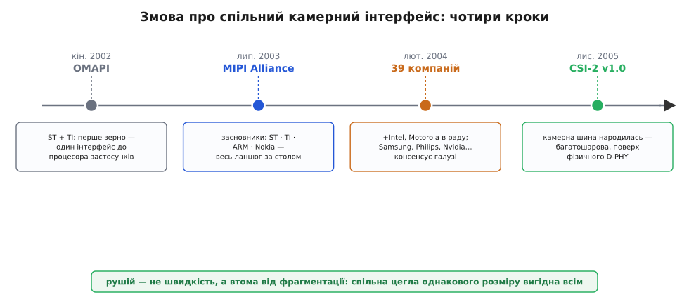

# 📜 Як індустрія телефонів змовилася на спільному камерному кабелі

Уяви ринок мобільних телефонів початку двотисячних. Фінська Nokia продає половину телефонів планети, але сама майже нічого не виробляє: процесор бере в Texas Instruments, радіо — в іншого, матрицю для камери — у третього, екран — у четвертого. Кожен із цих чипів — окрема мікросхема окремого виробника, і всі вони мусять якось стикнутися дротами на одній платі всередині корпуса. А тепер помнож це на десятки моделей телефонів на рік і на десятки конкурентів Nokia, у кожного свій набір постачальників.

І ось у цій картині ховається проблема, яку легко проґавити, поки не спробуєш зібрати телефон сам. Матриця від одного вендора виставляє пікселі **по-своєму**: стільки-то дротів даних, така-то полярність тактового сигналу, такий-от порядок бітів. Матриця від іншого вендора робить те саме **інакше**. І процесор, який мав би їх приймати, теж має власні уподобання. Виходить, що кожна пара «оцей сенсор ↔ оцей процесор» — це окрема інженерна задача стикування, окремі доріжки на платі, окремий драйвер у прошивці. Хочеш поміняти постачальника матриці, бо він дав кращу ціну, — переробляй плату й код. Ця мовчазна несумісність коштувала індустрії грубих грошей і, головне, **часу** — а на ринку, де моделі змінюються щопівроку, час дорожчий за все.

Саме з цього болю й народився MIPI-CSI. Це історія не про геніальний винахід однієї людини, а про дещо рідкісніше й цікавіше — про те, як закляті конкуренти сідають за стіл і домовляються грати за спільними правилами, бо поодинці програють усі. Розберімо, як це сталося, хто був за столом і звідки взялися дивні назви на кшталт «D-PHY».

## Зерно: коли ST і TI поділили один процесор

Перший камінчик, що зрушив лавину, поклали два виробники чипів — франко-італійська **STMicroelectronics** і американська **Texas Instruments**. Наприкінці 2002 року вони разом оголосили ініціативу **OMAPI** (*Open Mobile Application Processor Interface* — відкритий інтерфейс мобільного процесора застосунків). Ідея була скромніша за майбутній MIPI, але вже несла його зерно: домовитися, **як периферія навколо процесора застосунків спілкується з ним**, аби ту саму периферію можна було чіпляти до чипів обох компаній без переробки.

Чому саме процесор застосунків? Бо в телефоні тих часів уже було два мозки. Один — **радіомодем** (baseband), що займався дзвінками й зв'язком із вежею. Другий — **процесор застосунків** (application processor), що показував меню, ганяв ігри, малював картинку з камери на екран. Саме до другого горнулося все «мультимедійне» залізо: матриця, дисплей, пам'ять. І саме навколо нього фрагментація інтерфейсів кусалася найболючіше — бо периферії тут було найбільше й мінялася вона найчастіше.

> 🔧 **Навіщо це.** Тут закладено логіку, яку ти й досі бачиш у назвах. Літери **CSI** розшифровуються як *Camera Serial Interface*, а поряд є **DSI** — *Display Serial Interface*. Це не випадкові абревіатури: вони прямо повторюють ту стару розвилку «камера ↔ процесор» і «дисплей ↔ процесор». MIPI від самого початку думав не про одну шину, а про **сімейство** узгоджених інтерфейсів навколо процесора застосунків — і камера була лише однією з граней.

OMAPI показала головне: конкуренти **можуть** домовитися про спільний інтерфейс, і від цього виграють обидва. Але вдвох стандарт не роблять — надто вузько, решта ринку його проігнорує. Потрібно було затягнути за стіл усіх великих гравців одразу.

## 2003 рік: четверо сідають за стіл

29 липня 2003 року чотири компанії оголосили про створення **MIPI Alliance** (*Mobile Industry Processor Interface* — інтерфейс процесора для мобільної індустрії). Це були:

- **STMicroelectronics** і **Texas Instruments** — ті самі, що вже почали з OMAPI; вони принесли готове зерно й розширили його до цілого альянсу.
- **ARM** — британська компанія, чиї процесорні ядра стоять майже в кожному мобільному чипі планети; без її благословення жоден процесорний стандарт не має ваги.
- **Nokia** — на той момент найбільший виробник телефонів світу; вона представляла бік **того, хто збирає телефон** і найгостріше страждає від несумісності чужих чипів.

Придивись до складу — він не випадковий. Тут є **той, хто робить процесорні ядра** (ARM), **ті, хто робить самі чипи** (ST, TI), і **той, хто збирає з чипів кінцевий продукт** (Nokia). Три ланки ланцюга, кожна зі своїм інтересом, але зі спільною бідою: доки немає стандарту, кожен переробляє те саме по десять разів. Це критична деталь будь-якого вдалого стандарту — за столом мусять сидіти представники **всього ланцюга**, інакше стандарт вийде зручним одним і незручним іншим, і його не приймуть.

Мета альянсу звучала сухо, але била точно: **визначити відкриті стандартні інтерфейси до мобільних процесорів застосунків, щоб виробники телефонів могли брати компоненти в різних постачальників, вільно поєднувати найкраще й швидше виводити продукт на ринок.** Розкладімо цю фразу, бо в ній уся суть:

- «брати компоненти в **різних** постачальників» — ось воно, лікування від несумісності: сенсор одного вендора має стати на місце сенсора іншого без переробки плати;
- «вільно **поєднувати найкраще**» — не бути прив'язаним до одного постачальника лише тому, що переробляти інтерфейс дорого;
- «**швидше** виводити продукт» — те, заради чого все затівалося: менше інженерних годин на стикування, більше часу на власне продукт.

Один із керівників ARM тоді сформулював це як боротьбу **з фрагментацією** — саме це слово, *fragmentation*, стало гаслом всієї затії. Фрагментація — це і є той стан, коли кожна пара чипів говорить своєю говіркою й ніхто не розуміє сусіда без перекладача.

## 2004 рік: до столу підтягуються всі

Стандарт живе лише тоді, коли його приймає **критична маса** ринку. Четверо засновників це розуміли, тож наступним кроком стало не писання специфікацій нашвидкуруч, а розростання клубу. І воно вибухнуло: вже 4 лютого 2004 року альянс оголосив, що з чотирьох засновників розрісся до **39 компаній** — тобто за пів року долучилося 35 нових учасників.

Хто прийшов — теж промовисто. До **ради директорів** (органу, що визначає напрям) додалися **Intel** і **Motorola**. А серед нових членів були **Samsung Electronics**, **Philips Electronics**, **Infineon Technologies**, **Nvidia**, **Ericsson Mobile Platforms**, **Sony Ericsson**, **Toshiba**, **National Semiconductor** — практично всі, хто в ті роки важив у мобільному залізі. Коли за одним столом опиняються Intel, Samsung, Nokia, TI і Philips водночас, це вже не ініціатива двох, а **консенсус галузі**: ринок вирішив, що спільний інтерфейс — не забаганка, а необхідність.

> 🔧 **Навіщо це.** Ось чому MIPI-CSI зрештою витіснив старі паралельні інтерфейси у великому залізі, а DVP лишився долею дрібних дешевих камер. Річ не лише в технічній перевазі серіалізації (менше дротів, більший потік — це ми вже бачили). Річ у **грошах екосистеми**: коли Samsung, Sony, Toshiba й решта роблять свої матриці **під один і той самий CSI**, а всі великі процесори вміють цей CSI приймати, то будь-яка нова камера автоматично сумісна з будь-яким новим процесором. Виробникові телефонів більше не треба питати «а чи стикуються оці дві мікросхеми» — вони стикуються **за визначенням**. Ця гарантована сумісність і є справжня причина, чому стандарт переміг: не швидкість сама по собі, а те, що на нього змовилися **всі**.

Один із керівників Intel тоді сказав річ, яка добре передає дух моменту: зростання мобільної індустрії залежить від здатності **широко розгорнути передові, взаємосумісні, стандартні будівельні блоки — а цього досі не сталося**. Переклад із корпоративної мови простий: годі кожному городити свій город, зробімо цеглу однакового розміру, і будувати стане вшестеро швидше.


*Чотири кроки змови про спільний камерний інтерфейс. Спершу двоє (ST і TI зі своєю OMAPI) показують, що конкуренти можуть домовитися. Тоді четверо офіційних засновників саджають за стіл увесь ланцюг — ядра, чипи, збирача телефонів. За пів року клуб розростається під сорок компаній на чолі з Intel і Samsung — це вже консенсус галузі. І лише тепер, коли правила погоджено, народжується сам документ CSI-2. Рушієм була не швидкість, а спільна втома від фрагментації.*

## 2005 рік: народжується сам CSI-2

Аж тепер, коли клуб зібрався й домовився про правила гри, дійшло до конкретного документа про камеру. 29 листопада 2005 року вийшла **специфікація CSI-2 версії 1.0** — той самий Camera Serial Interface, який ти сьогодні бачиш у кожному роз'ємі камери на Raspberry Pi чи всередині будь-якого смартфона.

Чому одразу «-2», а не просто «CSI»? Бо перша, рання версія CSI (без цифри) виявилася перехідною й не набула поширення; практичним, живучим стандартом стала саме **друга** редакція, CSI-2, і саме її ім'я закріпилося. Тому не дивуйся, зустрівши «MIPI CSI-2»: двійка тут — не варіант на вибір, а фактично **та сама** камерна шина, про яку всі говорять.

CSI-2 збудували **шарами**, як цибулину, — і це важлива інженерна ідея, а не бюрократія. Найнижчий шар — **фізичний** (як біти бігають дротами: напруги, диференційні пари, такт). Над ним — шар, що **склеює кілька смуг** в один потік. Вище — **низькорівневий протокол** (де межа кадру, де межа рядка, який тип даних). Ще вище — **перетворення байтів на пікселі**. І нарешті — **прикладний** шар, який віддає готові пікселі процесору. Навіщо ділити? Щоб можна було **міняти нижній шар, не чіпаючи верхніх**. Саме ця багатошаровість дозволила пізніше підкласти під CSI-2 зовсім інший фізичний рівень (C-PHY замість D-PHY), а весь протокол над ним лишити незмінним. Камерний код знай віддає пікселі — а по яких саме дротах вони приїхали, його вже не обходить.

## Звідки взялася назва «D-PHY» — маленька загадка з римськими цифрами

Тепер найсмачніша дрібниця, повз яку не варто пройти. Фізичний рівень, яким CSI-2 гнав біти дротами, назвали **D-PHY**. «PHY» тут зрозуміле — від *physical layer*, фізичний рівень; так у всій цифровій техніці звуть найнижчу ланку, ту, що безпосередньо смикає напруги на дротах. А от **звідки «D»**?

Спокуслива, але хибна здогадка — що це «D» від *Differential* (диференційний), бо сигнал і справді диференційний. Насправді ж історія тонша й хитріша. **«D» — це римська цифра 500.**

Ось як це вийшло. Коли писали першу версію D-PHY, її **цілили на швидкість близько 500 мегабітів за секунду на одну смугу** — саме така пропускність вважалася тоді достатньою й досяжною для мобільної камери. А в римському записі число 500 позначають літерою **D**. Інженери, недовго думаючи, узяли цю літеру як ім'я специфікації — «PHY на 500» перетворилося на «D-PHY».

```text
римські цифри:  I=1   V=5   X=10   L=50   C=100   D=500   M=1000
                                                    ↑
                               ~500 Мбіт/с на смугу → «D»-PHY
```

У цьому криється тиха іронія. Назву прибили до конкретного числа — 500 Мбіт/с, — а техніка з роками полетіла далеко вперед: свіжі редакції D-PHY тягнуть уже **до 9 гігабітів** на смугу, тобто разів у вісімнадцять більше, ніж закладала перша версія. Але ім'я лишилося: перейменовувати усталений стандарт нікому не спало на думку, тож «D-PHY» досі носить у собі скам'янілий спогад про ті давні 500 мегабітів, яких давно вже ніхто не рахує.

> 🔧 **Навіщо це.** Ця історія — крихітна, але вона добре щеплює від однієї помилки. Побачивши «D-PHY», не намагайся вгадати число з назви: реальну швидкість смуги завжди дивись у даташиті конкретного чипа, бо назва відстала від життя на два порядки. Так буває з багатьма стандартами: ім'я фіксує момент народження, а річ під ним живе далі й змінюється. І ще: якщо колись зустрінеш **C-PHY** — це вже не про число, а зовсім інший спосіб кодувати сигнал (три дроти замість пари, хитра трійкова схема), який MIPI підклав під той самий CSI-2 як **альтернативний** фізичний рівень. Той-таки шаруватий устрій, що дозволив підмінити фундамент, не чіпаючи стін.

## Що з цієї історії варто винести

MIPI-CSI — це не винахід, а **домовленість**. Її не «відкрили» — про неї **змовилися**: спершу двоє (ST і TI зі своєю OMAPI наприкінці 2002-го), тоді четверо офіційних засновників (ST, TI, ARM, Nokia в липні 2003-го), а за пів року — вже під сорок компаній на чолі з Intel, Samsung, Motorola та рештою галузі. Рушієм була не жага швидкості сама по собі, а **втома від фрагментації**: коли кожна пара «сенсор ↔ процесор» вимагала окремого стикування, індустрія тонула в переробках, і спільна цегла однакового розміру виявилася вигідною геть усім.

Технічний плід цієї змови — багатошаровий CSI-2 (від 29 листопада 2005-го) поверх фізичного D-PHY, чия назва досі зберігає римську «D = 500» на згадку про скромні перші 500 мегабітів. А головний урок ширший за камери: сильний стандарт народжується там, де за стіл сідає **весь ланцюг** — і той, хто робить ядра, і той, хто ллє чипи, і той, хто збирає кінцевий пристрій, — і всі разом вирішують, що поодинці програють. Саме тому MIPI-CSI зрештою став **найпоширенішим камерним інтерфейсом на планеті**: не тому, що був найшвидший, а тому, що на нього погодилися всі.
