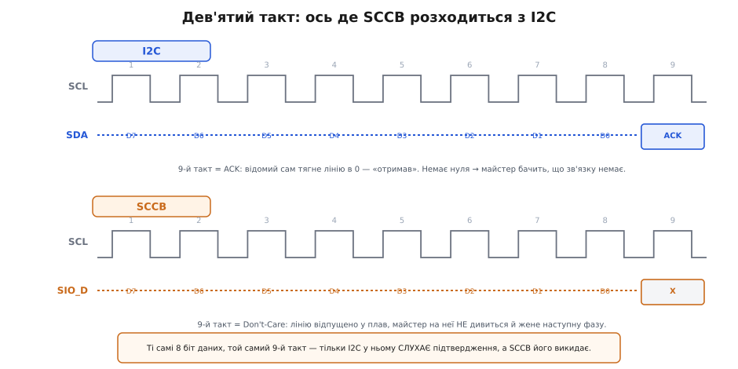

# 📜 SCCB: майже-I2C, що втекло на один біт

У кроці ми сказали між іншим річ, повз яку легко проскочити: керуючу шину камери «традиційно звуть SCCB», і це «майже той самий I2C, лише з дрібними відмінностями». Слово «майже» тут — не пом'якшення й не недбалість. Воно точне до літери. SCCB справді майже I2C: настільки близько, що годинами працює на звичайному I2C-контролері мікроконтролера, — і водночас настільки не I2C, що саме на цій щілині між «майже» і «не зовсім» новачок ловить збої, яких не може пояснити. Осцилограф показує ніби ту саму картинку, а сенсор мовчить. Або читається, але через раз. Або майстер вивалюється в помилку там, де за логікою I2C помилки бути не мало б.

Ця вставка — про те, звідки взялося те «майже» й чому воно коштує рівно три дрібниці, кожну з яких треба знати в обличчя. Історія тут напрочуд земна: не велика інженерна драма, а холодний обхідний манёвр навколо чужого патенту, зроблений маленькою каліфорнійською компанією наприкінці 1990-х. І з цього обхідного манёвру народилася шина, яка сьогодні сидить усередині мільярдів камер — від дешевого модуля на столі радіоаматора до сенсора у вашому телефоні.

## Компанія, якій треба було керувати сенсором

Спершу — дійова особа. **OmniVision Technologies** заснували 1995 року в Каліфорнії (Саннівейл, Кремнієва долина), серед засновників — **Шоу Хон** (Shaw Hong). Задум був простий і на той час зухвалий: робити датчики зображення не за дорогою CCD-технологією, як усі поважні виробники камер, а на звичайному **КМОН-процесі** (той самий процес, яким печуть цифрові чипи). КМОН-сенсор дешевший, менш ненажерливий і — головне — його можна вмістити на **один кристал** разом з усією обвʼязкою: підсилювачами, [АЦП](book:electronics/adc), логікою керування. Не камера з купи мікросхем, а камера-на-чипі, до якої лишається доробити тільки об'єктив. *(Статус: усталено — рік і місце заснування, орієнтація на однокристальні КМОН-сенсори як альтернативу CCD підтверджують і Вікіпедія, і матеріали самої компанії.)*

Ідея вистрелила саме тоді, коли світові знадобилися дешеві крихітні камери: спершу веб-камери, потім — камери в мобільні телефони (перший телефонний камерний модуль OmniVision — 2002 рік). Сенсори серії **OV** (OV6620, OV7640 і далі славнозвісні OV7670 та OV2640, той самий, що в кроці стоїть в ESP32-CAM) розійшлися мільйонами. *(Статус: усталено в головному — рання VGA-серія OV та однокристальна архітектура; конкретні номери сенсорів звіряються з профільними джерелами.)*

Але щоб камера-на-чипі була корисною, її мало ввімкнути — нею треба **керувати**. Як ми бачили в кроці, матриця сама собою не знає ні своєї роздільності, ні витримки, ні формату пікселів: усе це — записи в її [регістрову карту](book:communications/register-map), десятки й сотні коротких чисел, які хост шле сенсору при старті. Потрібен був канал керування: повільна двопровідна шина, по якій майстер (мікроконтролер чи процесор) читає й пише регістри відомого (сенсора). І тут постала розвилка, з якої почалася вся історія.

## Готова відповідь називалася I2C — і мала цінник

Двопровідна шина «тактова лінія плюс лінія даних, майстер керує гроном відомих за адресами» вже існувала, причому давно й чудово налагоджена. Це [I2C](book:communications/i2c-bus), яку **Philips Semiconductors** винайшла ще 1980 року (в патенті EP0051332B1 названо інженерів **Ада Муландса** й **Германа Схютте**; американський патент US 4689740A видано 1987-го). До кінця 1990-х I2C була де завгодно, її розумів кожен інженер, а головне — вона робила рівно те, що треба камері: коротка адресна розмова майстра з відомими по двох дротах. *(Статус: усталено — рік винаходу, компанія Philips та інженери-автори патенту підтверджені і Вікіпедією, і текстом європейського патенту.)*

Здавалося б — бери й став. Але тут криється дрібниця, яка й перевернула все. I2C була не просто технічним рішенням, а **інтелектуальною власністю Philips**. Компанія тримала патенти на протокол і — що дошкуляло щодня — вимагала **ліцензійних відрахувань** за право робити чипи, які офіційно розмовляють по I2C й носять цю назву. Хочеш поставити на свій чип напис «I2C» і продавати його як I2C-сумісний — плати Philips.

Наскільки це муляло всій індустрії, найкраще видно з одного факту: **Atmel** та інші виробники мікроконтролерів, щоб не платити за назву, вбудовували в свої чипи ту саму шину, але звали її інакше — **TWI** (*Two-Wire Interface*, «двопровідний інтерфейс»). Технічно TWI — це I2C до останнього такту; юридично це «не I2C», бо назви немає, а отже й приводу для відрахувань немає. Ціла індустрія навчилася танцювати навколо цього слова. *(Статус: усталено — I2C була ліцензованою власністю Philips/NXP; перейменування в TWI саме заради уникнення торговельної марки I2C підтверджують і Вікіпедія, і профільні джерела. Уточнення: з часом Philips скасувала плату за сам протокол, а патенти відтоді сплинули — сьогодні лишилася хіба охорона логотипа; але наприкінці 1990-х, коли народжувалося SCCB, цінник був цілком реальний.)*

Ось у цю рамку й поставмо рішення OmniVision. Компанії потрібен був канал керування сенсором. Готовий стандарт — I2C — коштував грошей за кожен проданий чип, а чипів планувалися мільйони. Що робити? Відповідь та сама, до якої дійшов Atmel зі своїм TWI, тільки OmniVision пішла на крок далі: не просто перейменувати, а **свідомо внести в протокол дрібні відмінності**, щоб він уже й формально не був I2C, — і назвати це власним іменем: **SCCB**, *Serial Camera Control Bus*, «послідовна шина керування камерою».

> 🔧 **Навіщо це.** Тримайте цей мотив у голові, коли дивитеся на будь-яку «майже-стандартну» шину — TWI, SCCB, ще десяток клонів. Відмінності від оригіналу тут майже ніколи не інженерні («так краще») — вони **юридичні** («так це вже не той стандарт, за який платять»). А юридична відмінність має бридку властивість: її роблять якнайдрібнішою, аби протокол лишився сумісним на практиці, — і саме через цю навмисну дрібність вона непомітна, доки не вкусить. Тобто причина збою й причина існування SCCB — це одна й та сама причина.

## Специфікація, яку можна взяти в руки

Найкраще, що ця історія — не переказ чуток. Її можна прочитати з першоджерела. OmniVision виклала **SCCB Functional Specification** — і документ доступний. Титул каже сам за себе:

```text
OmniVision Serial Camera Control Bus (SCCB)
Functional Specification
Last Modified: 25 June 2007
Document Version: 2.2
Proprietary to OmniVision Technologies, Inc.
```

Таблиця версій усередині — маленька літопис. Перший випуск (1.0) датовано **7 червня 2000 року**. Уже наступного дня, 8 червня 2000-го, вийшла редакція 1.01 з єдиною зміною: **перейменували сигнали** — колишні SIO1/SIO0/SCS_ стали SIO_C/SIO_D/SCCB_E. Редакція 2.0 (березень 2002) додала важливий для нас розділ про **двопровідний режим** для сенсорів з малим числом ніжок. А правка 2.2 (червень 2007) — узагалі кумедна дрібниця: у таблиці електричних параметрів значення tCYC = 10 мкс переставили зі стовпчика «мінімум» у стовпчик «типове». Ось на такому рівні деталізації живе цей документ. *(Статус: усталено — усі дати, номери версій та зміст правок наведено дослівно з таблиці ревізій специфікації v2.2.)*

Тепер розкриймо ті самі три дрібниці, про які йшлося в кроці, — уже з точним текстом специфікації в руках. Їх рівно три, і кожна варта окремого погляду, бо кожна окремо здатна зіпсувати вам вечір.

## Дрібниця перша: драйвери КМОН замість відкритого стоку

Почнімо з електрики, бо вона найглибша. Класична I2C стоїть на одному наріжному рішенні: обидві лінії (тактова й даних) працюють через [відкритий стік](book:electronics/open-drain). Це означає, що кожен учасник шини вміє тільки **притягувати лінію до нуля**, але не вміє її піднімати; у високий стан лінію повертають спільні **підтяжні резистори** до живлення. Навіщо так хитро? Бо це елегантно розв'язує дві задачі водночас. По-перше, коли на спільну лінію хочуть говорити двоє, конфлікту-короткого не буде: нуль просто «перемагає» одиницю, ніхто нічого не спалює. По-друге — і це головне для I2C — сам приймач може **притримати** лінію, і так з'являється можливість підтвердження й розтягування такту. Уся логіка I2C виростає з відкритого стоку.

SCCB робить інакше. У специфікації тактова лінія SIO_C описана як сигнал, що його майстер **активно жене і в нуль, і в одиницю** («drives at logical 0 and 1»), — тобто це звичайний двотактний (push-pull) КМОН-вихід, а не відкритий стік. Підтяжних резисторів, обов'язкових для I2C, тут на тактовій лінії немає: майстер сам, своїм транзистором, підтягує лінію вгору. Лінія даних SIO_D складніша (про неї — третя дрібниця), але загальний дух той самий: **драйвери КМОН, а не відкритий стік з підтяжками**. [Push-pull проти open-drain](book:electronics/push-pull-output) — це і є та розвилка, і SCCB стала на інший її бік, ніж I2C.

> 🔧 **Навіщо це.** Ось перший практичний капкан. Якщо ви чіпляєте OV-сенсор до справжньої I2C-шини вашого МК, ви за звичкою ставите підтяжки — вони I2C потрібні. Але тактову лінію сенсор (точніше, ваш майстер у режимі SCCB) жене двотактно. Двотактний вихід і зовнішня підтяжка одне одному не заважають фатально, але це вже не та схема, яку малює даташит I2C, і на неї не завжди можна покладатися. А ще з цього випливає найважливіше: **у SCCB на одному відомому все просто, а гроно відомих на спільній лінії — уже проблема**, бо двотактні драйвери, на відміну від відкритого стоку, за прямого конфлікту б'ються струмами. Саме тому специфікація вимагає окремих «конфлікт-захисних» резисторів послідовно з лінією даних кожного відомого — те, чого в звичайній I2C немає й близько.

## Дрібниця друга: стеля 100 кГц

Друга відмінність — найпростіша на вигляд і найпідступніша на практиці. Специфікація каже: період одного переданого біта, tCYC, **типово 10 мкс**. Порахуймо, що це за швидкість.

**Яку тактову частоту дозволяє SCCB.** Один біт = 10 мкс (типове значення tCYC зі специфікації).

```text
період біта  tCYC = 10 мкс = 10 · 10⁻⁶ с
частота      f    = 1 / tCYC
                  = 1 / (10 · 10⁻⁶)
                  = 100 000 Гц
                  = 100 кГц
```

Сто кілогерц. Це рівно **найповільніший, «стандартний» режим I2C** (standard-mode, 100 кбіт/с) — і жодного слова про швидші режими, які I2C давно має (fast-mode 400 кГц, fast-mode plus 1 МГц і вище). SCCB застигла на найнижчій сходинці й вище не піднімається за специфікацією. *(Статус: усталено — типове tCYC = 10 мкс зафіксоване в таблиці 5-1 електричних параметрів; звідси 100 кГц. Те, що I2C має швидші офіційні режими, — загальновідомий факт зі специфікації I2C.)*

Чому так скромно? Бо камері й не треба швидше. Керування — рідкісна повільна розмова, як ми розібрали в кроці: налаштував регістри при старті й мовчиш. Ганяти цю розмову на мегагерцах немає сенсу, а повільна шина простіша, надійніша й дешевша в реалізації. OmniVision узяла рівно стільки швидкості, скільки потрібно керуванню, — і ні краплі більше.

> 🔧 **Навіщо це.** Практичний висновок прямий: **не розганяйте шину керування камери**. Якщо ваш I2C-драйвер за замовчуванням стоїть на 400 кГц (а на багатьох МК так і є) і сенсор мовчить або читається через раз — перше, що спробуйте, це **опустити частоту до 100 кГц**. Дуже часто саме в цьому вся біда: майстер стукає швидше, ніж сенсор за своєю специфікацією зобов'язаний розуміти, і той просто не встигає. Осцилограф при цьому покаже начебто здорову I2C-картинку — тільки надто швидку для SCCB.

## Дрібниця третя: дев'ятий біт, якому байдуже

І ось — серце всієї історії, та відмінність, через яку SCCB найчастіше й ловить новачка. Щоб її відчути, треба спершу згадати, як улаштований дев'ятий такт у I2C, бо саме в ньому вся сіль.

В I2C дані йдуть байтами: вісім бітів, старший наперед. Але після кожного байта майстер дає **дев'ятий такт** — і в цьому такті відпускає лінію даних, а слухати починає **відомого**. Відомий, якщо він на місці й прийняв байт, притягує лінію в нуль. Це й є **підтвердження** (ACK, від *acknowledge*). Дев'ятий такт в I2C — це коротка перекличка: майстер питає «дійшло?», відомий відповідає нулем «дійшло». Немає нуля (лінія лишилася вгорі) — значить, ніхто не відповів: майстер розуміє, що відомого немає або він не слухає, і піднімає помилку. На цьому підтвердженні тримається вся надійність I2C: майстер щобайта знає, чи його чують.

Тепер SCCB. Специфікація так само ділить передачу на **фази** (*phase*), і кожна фаза — це, дослівно, «всього 9 бітів: 8-бітна послідовність даних, за якою йде дев'ятий біт». Вісім біт даних, старший наперед — усе як в I2C. А от дев'ятий біт зветься інакше й поводиться інакше. У специфікації він названий **«Don't-Care bit»** — «біт, якому байдуже» (а в фазі читання — «NA bit»). І ключова фраза документа звучить так: майстер «continues asserting the following phases regardless of the response to the Don't-Care bit by the slave(s)» — **продовжує гнати наступні фази незалежно від того, що відомий зробив із дев'ятим бітом**. І ще прямішe: «The master does not check for transmission errors» — майстер **не перевіряє помилок передачі**. *(Статус: усталено — назви «Don't-Care bit» / «NA bit», структура фази з 9 бітів та цитовані фрази про ігнорування відповіді наведено дослівно зі специфікації v2.2, розділи 3.2.1 і 3.2.3.)*

Відчуйте різницю на дотик. Той самий дев'ятий такт, який в I2C — питання «дійшло?», у SCCB перетворений на порожню формальність: майстер відпускає лінію, але **не дивиться на неї** й жене далі. Відомий *може* щось зробити з цим бітом (притягнути в нуль, як в I2C, або лишити плавати), але майстрові однаково — він уже передає наступну фазу. Підтвердження немає. Точніше — його місце є, дев'ятий такт присутній, а сенсу перекілички немає.


*Дві шини, ті самі вісім біт даних D7…D0 і той самий дев'ятий такт — але поводяться в ньому протилежно. **I2C** (згори): дев'ятий такт — це ACK, у ньому відомий сам притягує лінію в нуль на знак «отримав»; немає нуля — майстер бачить, що зв'язку немає, і піднімає помилку. **SCCB** (внизу): дев'ятий такт — це «Don't-Care» (позначений X); лінію відпущено у плав, майстер на неї не дивиться й одразу жене наступну фазу. Те, що в I2C — механізм надійності, у SCCB викинуто заради «це вже не I2C».*

Навіщо OmniVision так зробила? Тут стуляються обидва мотиви — юридичний і технічний. Юридично прибрати ACK — це ще один спосіб зробити протокол «не I2C»: механізм підтвердження в I2C фундаментальний, і хто його викинув, той уже не зовсім I2C. Технічно ж камері наскрізне побайтове підтвердження й не критичне: керуючих записів небагато, вони йдуть при старті, а якщо треба переконатися, що запис ліг, майстер може просто **прочитати регістр назад** і звірити. Специфікація навіть згадує хитромудрий запасний хід — спеціальний «Don't-Care Status register», у який відомий може записати, чи бачив він дев'ятий біт, щоб майстер потім міг його опитати. Але на практиці ним майже ніхто не користується: простіше перечитати потрібний регістр.

> 🔧 **Навіщо це.** Ось звідки береться найбільш загадкова порода збоїв. Ви керуєте OV-сенсором через **справжній апаратний I2C-блок** свого МК — і це майже завжди працює, бо SCCB на 99% сумісна. Але апаратний I2C **очікує ACK** на дев'ятому такті — так велить I2C. А відомий-сенсор за специфікацією SCCB **не зобов'язаний** його давати: дев'ятий біт для нього «Don't-Care». І тоді трапляється одне з двох. Пощастило — сенсор усе-таки притягує лінію (багато OV-чипів це роблять «про всяк випадок», щоб дружити з I2C-майстрами), і все гладко. Не пощастило — сенсор лишає дев'ятий біт плавати, а ваш апаратний I2C бачить «немає ACK» і **вивалюється в помилку**, хоча запис насправді пройшов. Ви дивитеся в код, у код помилки немає; дивитеся на осцилограф — байти йдуть правильні; а майстер уперто каже «NACK». Причина не в вашому коді — вона в тій самій дрібниці, закладеній 2000 року заради обходу патенту. Ліки залежать від МК: подекуди I2C-блок уміє **ігнорувати відсутній ACK** (треба ввімкнути цей режим), а подекуди доводиться керувати сенсором не апаратним I2C, а «ногами» — власноруч смикати лінії за протоколом SCCB, де дев'ятий біт вам просто байдужий, як і має бути.

## Що з цього лишається

Складімо ланцюг. OmniVision наприкінці 1990-х треба було керувати своїми однокристальними КМОН-сенсорами по простій двопровідній шині. Готовий стандарт — I2C — робив рівно те, що треба, але був **платною власністю Philips**: за право звати свій чип «I2C» і робити його I2C-сумісним належали ліцензійні відрахування, і ціла індустрія вже вигадувала обхідні назви на кшталт TWI. OmniVision пішла тим самим шляхом, але рішучіше: узяла I2C, внесла **три навмисні дрібні відмінності** — щоб протокол уже й формально не був I2C, — і назвала це SCCB. Усе задокументовано в її ж специфікації (версія 2.2, 25 червня 2007; перший випуск — 7 червня 2000).

Ті три дрібниці — не примха, а точки розходження, кожна з яких окремо здатна вкусити розробника:

- **Драйвери КМОН замість відкритого стоку з підтяжками.** Лінії активно женуться в обидва стани; звичних I2C-підтяжок немає, а гроно відомих потребує окремих конфлікт-захисних резисторів. Одна камера — просто; кілька на шині — обережно.
- **Стеля 100 кГц.** Рівно найповільніший режим I2C і жодного слова про швидші. Сенсор мовчить чи читається через раз — **опустіть частоту шини до 100 кГц** першим ділом.
- **Дев'ятий біт «Don't-Care» замість ACK.** Той самий дев'ятий такт, але майстер у ньому нічого не слухає й помилок не перевіряє. Апаратний I2C-блок, що чекає ACK, може вивалюватися в помилку на цілком успішному записі — а це найзагадковіший зі збоїв SCCB.

І головне, заради чого ця історія стоїть поруч із кроком. «Майже I2C» — це не приблизність опису, а **точна назва явища**. SCCB навмисне зроблена сумісною рівно настільки, щоб працювати на I2C-залізі, і навмисне несумісною рівно настільки, щоб не бути I2C юридично. Тому вона й дражнить: більшість часу поводиться як I2C, а зривається саме на тих трьох дрібницях, які були внесені для того, щоб нею не бути. Знаючи ці три точки в обличчя, ви перестаєте ловити «незрозумілі» збої на шині камери — бо жоден із них насправді не незрозумілий. Кожен — прямий нащадок холодного рішення обійти чужий патент, ухваленого над кристалом крихітного сенсора наприкінці двадцятого століття.
