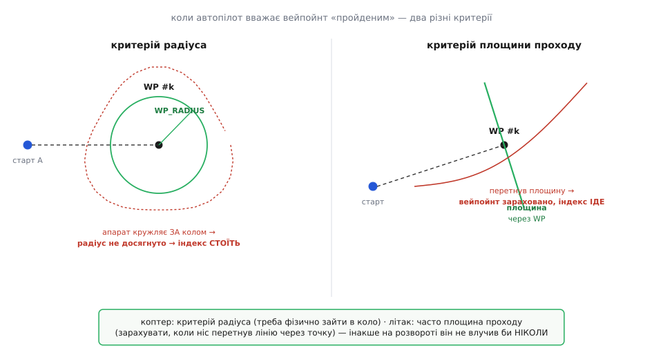
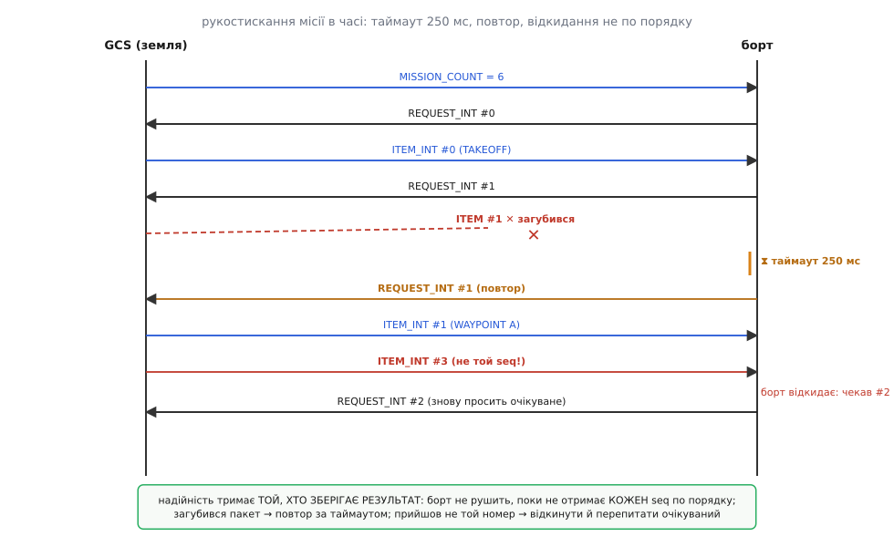
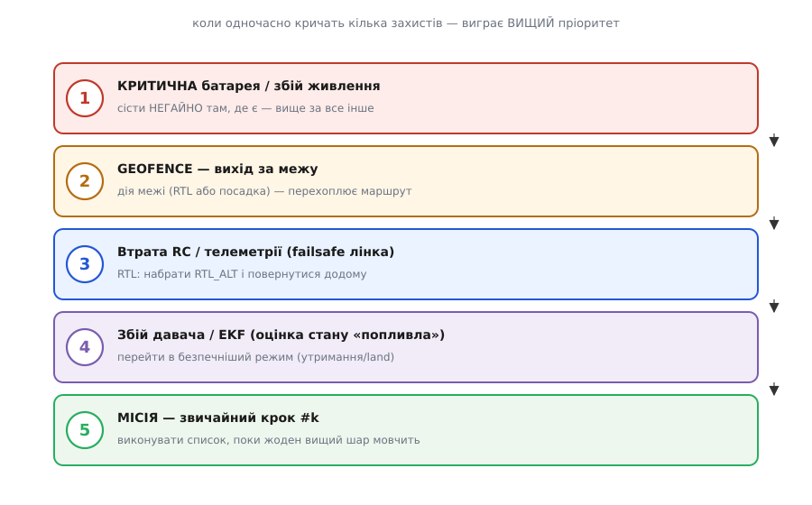

# Капстоун зблизька: механіка однієї автономної місії від «armed» до посадки

<preknowlist>
- [Базовий крок капстоуна](root:embedded/capstone-autonomous-mission) — місія як пронумерований список, рукостискання завантаження, чотири платформи й три оболонки: цей детальний розбір поглиблює саме його й без нього висить у повітрі.
- [Автономна система](root:embedded/autonomous-system) — замкнений контур стабілізації, під яким живе список місії; саме він виконує кожну уставку, поки список лише каже, яку тримати.
</preknowlist>

У базовому кроці ми зібрали капстоун згори: місія — це пронумерований список, який борт проходить сам; завантаження — рукостискання з підтвердженням кожного пункту; той самий кістяк накривається на чотири платформи; а сам список живе всередині трьох захисних оболонок. Там нас цікавило **що з чого складається** й **у якому порядку діяти**. Тут — **як воно влаштоване всередині**: що саме означає «борт влучив у вейпойнт» (і чому найчастіший збій — саме тут), як рукостискання поводиться, коли пакети губляться й приходять не по порядку, звідки взялася вимога передавати координати **цілими**, як три оболонки впорядковані за пріоритетом, коли кричать разом, і скільки метрів насправді коштує неправильно обрана система висоти. Це той шар, що відрізняє «воно пролетіло» від «я розумію кожен перехід, який зробила прошивка».

Домовимося про межу з двома вставками, щоб не ходити колами. Повний робочий скрипт завантаження з дозчитуванням і живим монітором прогресу місії — цикл на pymavlink із таймаутами, лічильником повторів і звіркою — винесено в окремий [код-проєкт капстоуна](root:embedded/capstone-autonomous-mission/proj-mission-upload-verify.md); сюди його не переписуємо, а лише показуємо ключові кістяки. Історію того, як спільнота автопілотів дійшла від «вистрілити файл» до діалогу з підтвердженням і чому старі float-повідомлення довелося оголосити застарілими, розказано в [історії протоколу місій](root:embedded/capstone-autonomous-mission/hist-mission-protocol.md). Наша тема — **механіка інтеграції**: геометрія переходів, внутрішня надійність протоколу, граничні умови кожної платформи, впорядкування захистів. Там, де торкаємось коду чи історії, — рівно настільки, наскільки треба тримати нитку.

## Перехід між пунктами: що таке «борт влучив у вейпойнт»

Базова версія сказала правильну, але грубу річ: активна одна NAV-команда, а щойно апарат опинився в радіусі точки — покажчик іде на наступну. Слово «опинився в радіусі» тут ховає цілий вузол, у якому валиться більшість перших автономних прогонів. Розкриймо його.

Місія — це **скінченний автомат** ([детально про автомати](root:hw-digital/finite-state-machines) — стан, подія, перехід): стан — це індекс поточного пункту `k`, подія — виконання умови завершення пункту, перехід — інкремент `k := k+1`. Уся автономія зводиться до одного питання, яке автопілот ставить собі сотні разів на секунду: **чи виконано умову завершення поточного NAV-пункту?** Відповідь «так» рухає покажчик; «ні» — тримає. І весь фокус у тому, що умова «виконано» для навігаційного пункту буває **двох різних видів**, і плутанина між ними — джерело класичного «завис на вейпойнті».

**Критерій радіуса влучення.** Найпростіший: навколо точки з координатою `WP` окреслено коло радіусом `WP_RADIUS` (для коптера це параметр порядку метра-двох). Пункт вважається виконаним, коли горизонтальна відстань від апарата до точки стала меншою за цей радіус:

```
dist(апарат, WP) < WP_RADIUS   →   пункт #k виконано, k := k+1
```

Це той критерій, який уявляє новачок. І саме він породжує пастку. Уяви коптер, що йде до точки на швидкості 6 м/с із `WP_RADIUS = 1.5 м`. Контур позиції не гальмує миттєво — апарат має інерцію. Якщо гальмування слабке чи вітер зносить, апарат проскакує повз точку, розвертається, заходить знову — і кружляє **навколо** кола радіуса, ні разу фізично в нього не зайшовши. Формально `dist < 1.5` **ніколи не справджується**, тож покажчик `k` стоїть, і зовні це виглядає як «дрон здурів і намотує кола». Насправді автомат працює **бездоганно** — просто умова переходу недосяжна для цієї комбінації швидкості, радіуса й динаміки гальмування.

**Критерій площини проходу (passed-plane).** Тому для апаратів, що не вміють зупинятися, використовують інший критерій: через точку `WP` проводять **площину, перпендикулярну курсу підходу**, і пункт зараховують, коли ніс апарата **перетнув цю площину** — тобто проєкція апарата на лінію маршруту пройшла точку, навіть якщо збоку він промахнувся на десяток метрів. Тут неважливо, чи фізично апарат був у колі; важливо, що він **проминув** точку вздовж маршруту.


*Ліворуч — критерій радіуса: апарат мусить фізично зайти в коло `WP_RADIUS`; якщо він кружляє **за** колом (мала маневреність, знос вітром), відстань ніколи не падає нижче порога й індекс застрягає. Праворуч — критерій площини: через точку проведено лінію, перпендикулярну курсу підходу, і пункт зараховано, щойно апарат її перетнув, хай навіть промахнувся збоку. Коптер зазвичай користується радіусом (він **уміє** зайти в точку й зависнути), літак — площиною проходу, бо радіусом він на розвороті не влучив би ніколи.*

Звідси практичне правило, яке базова версія лише натякнула, а тут воно стає точним. Для **коптера** критерій радіуса доречний, бо коптер **уміє** сповільнитися до нуля й зайти в будь-яке коло; але радіус треба брати з запасом на динаміку — надто малий (0.5 м на швидкому прольоті) провокує намотування. Для **літака** критерій радіуса був би згубним: літак іде на 18 м/с із радіусом розвороту в десятки метрів і фізично не може зайти в коло 5 м — тому автопілот літака користується площиною проходу, і вейпойнт зараховується на прольоті повз точку.

> 🔧 **Навіщо це.** Коли твоя перша місія «зависне на вейпойнті» — а вона зависне, — цей поділ дає тобі точний діагноз замість містики. Відкриваєш лог, дивишся на активний індекс і горизонтальну відстань до точки: якщо відстань коливається біля 3–4 м і не падає нижче `WP_RADIUS = 1.5` — це не «дрон дурний», а недосяжна умова переходу. Ліки конкретні: або збільшити `WP_RADIUS`, або зменшити швидкість підходу, або перевірити, чи не зносить вітром. Ти дебажиш перехід `#k → #k+1`, а не поведінку загалом.

**Як апарат тримає курс МІЖ точками.** Ще одна річ, яку базова версія сховала за словом «летіти до точки»: апарат не летить по прямій «точка в точку» наосліп. Між вейпойнтами працює **навігаційний закон**, що весь час рахує дві похибки — відстань уздовж маршруту (скільки лишилося) і **бічне відхилення** (crosstrack — наскільки апарат збоку від лінії, що з'єднує попередню й наступну точки) — і зводить бічне до нуля. У літаках ArduPilot це закон **L1**: він проєктує точку прицілювання на відстань попереду («lookahead»), і що менша ця відстань (параметр `NAVL1_PERIOD`, типово 20), то агресивніше апарат заходить у поворот; замалий період — різкі кути й розгойдування, забільшений — плавні, ліниві дуги. Розуміти це важливо, бо коли на розвороті між точками апарат «зрізає кут» або, навпаки, широко вилітає за лінію, ти крутиш **не** координати вейпойнтів, а параметр навігаційного закону. Повне виведення того, як із бічної похибки й швидкості народжується команда крену, розібрано у [математиці навігаційного закону](root:embedded/capstone-autonomous-mission/math-l1-navigation.md).

**DO- і CONDITION-команди: тонка механіка часу.** Базова версія сказала: DO-команди спрацьовують «збоку» й не рухають апарат. Точніше — правило автопілота **жорстке й обмежувальне**: у кожну мить активні щонайбільше **одна навігаційна команда й одна DO-команда**, і DO виконуються **в порядку** одразу після того, як завершилася навігаційна команда перед ними. Це не деталь реалізації, а свідома конструкція: апарат мусить завжди мати рівно одну однозначну ціль руху, тож дві NAV-команди одночасно заборонені за побудовою.

Тут ховаються дві пастки, на яких горять реальні місії.

Перша — `CONDITION_DELAY`. Її призначення: після досягнення вейпойнта **відкласти** виконання наступної DO-команди на N секунд — наприклад, «долетів до точки зйомки, зачекай 3 секунди, тоді клацни камерою». Але — і це критично — **`CONDITION_DELAY` не зупиняє апарат**. Він продовжує рух до наступного вейпойнта. Якщо наступна навігаційна точка ближча, ніж встигне добігти таймер затримки, апарат досягне її **раніше**, лічильник затримки скинеться, і відкладена DO-команда **не спрацює ніколи**. Тобто «зачекати й сфотографувати» тихо не спрацьовує, бо апарат уже полетів далі. Щоб апарат справді постояв — для коптера ставлять `NAV_LOITER_TIME` (це вже **навігаційна** команда: «висіти тут стільки-то секунд»), а не `CONDITION_DELAY`.

Друга — `DO_JUMP`, стрибок на інший пункт списку (так роблять цикли: «облети ці чотири точки п'ять разів»). По-перше, `CONDITION_DELAY` **не затримує** `DO_JUMP` — стрибок виконується миттєво, щойно покажчик на нього натрапив, незалежно від будь-якого таймера. По-друге, у місії дозволено щонайбільше **15** команд `DO_JUMP`; нові понад цю межу автопілот **ігнорує**. Тобто велику циклічну місію не можна набити стрибками без ліку — доводиться проєктувати логіку в межах цього ліміту.

## Завантаження місії: надійність, схована в рукостисканні

Базова версія показала кістяк рукостискання й сказала головне: борт сам просить кожен наступний пункт за номером. Тепер розберемо, **чому** ця схема надійна навіть на дірявому радіоканалі — бо саме тут криється інженерна краса, і саме нерозуміння цієї механіки породжує «залив місію, а вона на борту не така».

**Хто тримає надійність.** Радіолінк земля-борт втрачає пакети, дублює їх, тасує порядок. Наївна передача «вистрілив список одним потоком» дає борту список із дірками. Протокол місій MAVLink перекладає надійність на **того, хто зберігає результат** — на борт. Механіка точна: після `MISSION_COUNT` борт **сам** надсилає `MISSION_REQUEST_INT(seq)` за кожним номером по черзі; на кожен запит запускається **таймер очікування відповіді**. Рекомендований таймаут — **250 мс**. Не прийшов пункт за цей час — борт **повторює** той самий `MISSION_REQUEST_INT(seq)`. Не прийшов після кількох повторів — операцію **скасовують**, і місія на борту лишається **попередньою** (не напівзібраною).


*Борт крокує запитами по одному `seq`. Загубився `ITEM #1` — спрацьовує таймер 250 мс, і борт **повторює** запит #1, доки не отримає. Прийшов пункт із **не тим** номером (`#3` замість очікуваного `#2`) — борт його **відкидає** й знову просить очікуване `#2`. Список у пам'яті борту фізично **не може** зібратися з дірками чи в неправильному порядку: він добудовується строго по одному, у зростанні `seq`, з явним `MISSION_ACK` наприкінці. Це та сама дисципліна «підтвердь, що дійшло», що й у [надійного циклу команд](root:embedded/mavlink-commands/proj-command-ack-loop.md).*

Прочитаймо цей механізм повільно, бо кожна деталь несе вагу. **Порядок за побудовою:** борт просить `#0`, потім `#1`, потім `#2` — монотонно. Прийшов пункт `#3`, коли борт чекав `#2`? Борт його **не бере** й повторює запит саме на `#2`. Це унеможливлює склеювання списку не в тому порядку. **Немає дірок:** якщо `#1` загубився, борт не перескочить на `#2` — він застрягне на повторі `#1`, доки не отримає, і лише тоді рушить далі. **Атомарність результату:** якщо серія повторів вичерпалась і борт здався, він **не** лишає половину нового списку впереміш зі старим — операція відкочується, стара місія цілою лишається на борту. Помилка завантаження ніколи не перетворюється на «полетів за напівспотвореним маршрутом».

Симетрично працює **вивантаження** (дозчитування) — і саме воно наша головна страховка перед польотом. GCS шле `MISSION_REQUEST_LIST`, борт відповідає `MISSION_COUNT`, далі GCS просить кожен `seq`, борт віддає `MISSION_ITEM_INT`. Ті самі таймаути й повтори, тільки ролі поміняні. Кістяк дозчитування з наступною звіркою (мовою прошивки для ясності послідовності; на практиці — pymavlink на землі):

:::tabs
```py
# Крок 1: попросити борт вивантажити його ПОТОЧНУ місію (не ту, що ми «мали б» залити).
master.mav.mission_request_list_send(
    master.target_system, master.target_component,
    mavutil.mavlink.MAV_MISSION_TYPE_MISSION)
mc = master.recv_match(type='MISSION_COUNT', blocking=True, timeout=5)  # борт відповість MISSION_COUNT
if mc is None:
    return
count = mc.count

# Крок 2: по одному пункту, з таймаутом і обмеженим числом повторів.
for seq in range(count):
    it = None
    for tries in range(5):
        master.mav.mission_request_int_send(              # MISSION_REQUEST_INT(seq)
            master.target_system, master.target_component, seq)
        it = master.recv_match(type='MISSION_ITEM_INT', blocking=True, timeout=0.25)
        if it is not None and it.seq == seq:
            break
        it = None
    else:                                                 # здався — не звіряємо частковий список
        abort_readback()
        return

    # Крок 3: звірити з тим, що ЗАДУМАНО, декодувавши цілі назад у градуси.
    if it.command == mavutil.mavlink.MAV_CMD_NAV_WAYPOINT:
        lat = it.x * 1e-7           # 10⁻⁷ градуса → градуси
        lon = it.y * 1e-7
        alt = it.z                  # метри — але В ЯКІЙ системі? див. it.frame нижче
        print(f"#{seq}  {lat:.7f}, {lon:.7f}  alt={alt:.1f}  frame={it.frame}")
```
```cpp
// Крок 1: попросити борт вивантажити його ПОТОЧНУ місію (не ту, що ми «мали б» залити).
mavlink_msg_mission_request_list_send(chan, tgt_sys, tgt_comp, MAV_MISSION_TYPE_MISSION);
uint16_t count = wait_mission_count();      // борт відповість MISSION_COUNT

// Крок 2: по одному пункту, з таймаутом і обмеженим числом повторів.
for (uint16_t seq = 0; seq < count; seq++) {
    mavlink_mission_item_int_t it;
    int tries = 0;
    do {
        request_item_int(seq);              // MISSION_REQUEST_INT(seq)
    } while (!recv_item(&it, seq, /*timeout_ms=*/250) && ++tries < 5);
    if (tries >= 5) { abort_readback(); return; }   // здався — не звіряємо частковий список

    // Крок 3: звірити з тим, що ЗАДУМАНО, декодувавши цілі назад у градуси.
    if (it.command == MAV_CMD_NAV_WAYPOINT) {
        double lat = it.x * 1e-7;           // 10⁻⁷ градуса → градуси
        double lon = it.y * 1e-7;
        float  alt = it.z;                  // метри — але В ЯКІЙ системі? див. it.frame нижче
        printf("#%u  %.7f, %.7f  alt=%.1f  frame=%u\n", seq, lat, lon, alt, it.frame);
    }
}
```
:::

Зверни увагу на `tries < 5` і `abort_readback()`: це не декоративна обережність, а точне відтворення протокольної вимоги «повторюй за таймаутом, а після кількох невдач — здайся й не працюй із частковим результатом». Скрипт, що читає без таймауту, зависає назавжди на першому ж загубленому пакеті; скрипт, що звіряє напівзчитаний список, бреше тобі про вміст місії.

### Чому координати передають цілими: виведення похибки float

Базова версія кинула фразу «у float похибка кілька метрів, тому перейшли на `_INT`». Це правда, але число «кілька метрів» варте виведення — бо воно пояснює, **чому саме** довгота гірша за широту й де ця похибка вжалить найболючіше.

Почнімо з того, що таке float32 ([детально про плаваючу кому](root:hw-arch/floating-point)). Це 32 біти: 1 знак, 8 біт порядку (експонента), 23 біти мантиси. Але значущих біт мантиси **24** — бо для нормалізованих чисел старший біт завжди 1 і його не зберігають (домовлений «прихований» біт). Число подають як `± 1.f × 2ᵉ`, де `f` — 23 збережені біти дробу. Ключове: **крок між двома сусідніми представними числами** (одиниця останнього розряду, ULP) не сталий — він **зростає з величиною самого числа**. Для числа з порядком `2ᵉ` крок дорівнює:

```
ULP = 2ᵉ · 2⁻²³
```

Тепер підставмо координати. Широта в градусах — число в діапазоні 0…90; для типових наших широт (скажімо, 50°) величина лежить між 32 і 64, тобто порядок `2⁵`. Крок:

```
ULP(50°) = 2⁵ · 2⁻²³ = 2⁻¹⁸ ≈ 3.81·10⁻⁶ градуса
```

Один градус широти на поверхні — це приблизно 111 111 метрів (чверть меридіана 10 000 км поділити на 90). Отже крок float32 на широті 50° у метрах:

```
3.81·10⁻⁶ градуса × 111 111 м/градус ≈ 0.42 м
```

Уже майже пів метра — і це на широті, ще «дешевій» за числом. А тепер довгота. Її величина буває до 180°; візьмімо реальну довготу, скажімо, 122° (тихоокеанське узбережжя) — це діапазон 64…128, порядок `2⁷`:

```
ULP(122°) = 2⁷ · 2⁻²³ = 2⁻¹⁶ ≈ 1.53·10⁻⁵ градуса
1.53·10⁻⁵ × 111 111 ≈ 1.0 м
```

Метр. А в найгіршому випадку — довгота біля 180° (порядок `2⁷` теж, але верхня межа мантиси) крок float32 сягає **≈ 1.7 м**. Тобто дві сусідні координати, які float32 узагалі здатен розрізнити, стоять на місцевості за метр-два одна від одної — між ними немає жодного представного значення. Для точної посадки чи зйомки з перекриттям це катастрофа: ти просиш «сядь ось тут», а борт округляє до найближчого представного, і «тут» гуляє на метр-два.

Розв'язок — не зберігати градуси у float взагалі. Передавати **ціле** число в одиницях 10⁻⁷ градуса (`int32`). Крок такого подання **сталий** по всій поверхні:

```
10⁻⁷ градуса × 111 111 м/градус ≈ 0.0111 м = 1.11 см
```

Сантиметр, скрізь однаково — на широті й на довготі, біля екватора й біля полюса. `int32` вміщує ±2 147 483 647, тобто ±214.7° в цих одиницях — з запасом на весь діапазон ±180°. Ось чому пункти місій передають повідомленнями з суфіксом `_INT` (`MISSION_ITEM_INT`, `MISSION_REQUEST_INT`), де широта й довгота — цілі `it.x`, `it.y` в одиницях 10⁻⁷ градуса, а декодуються множенням на `1e-7`, як у коді вище. Старі float-повідомлення (`MISSION_ITEM`) **застарілі** саме через виведену вище похибку; побачив їх у чужому прикладі — це давній код, переписуй на `_INT`. Довша історія цього переходу — у [нарисі про протокол місій](root:embedded/capstone-autonomous-mission/hist-mission-protocol.md).

> 🔧 **Навіщо це.** Це не академічна тонкість — це прямо про твій капстоун. Якщо ти пишеш власний завантажувач на pymavlink і десь по дорозі кладеш координату у `float` (наприклад, беш її з CSV як `float(row[0])` замість цілого), ти вносиш ту саму метрову похибку **власноруч**, і жоден `_INT`-протокол тебе не врятує — зіпсовано ще до передачі. Правило: тримай координати цілими в 10⁻⁷ градуса від зчитування до відправки, переводь у градуси **лише** для друку людині.

### Система висоти: тиха помилка на метри

Ще одне поле пункту, яке базова версія лише згадала дужкою «метри над точкою старту», а воно варте окремого розбору, бо породжує найпідступніші тихі помилки. Висота `it.z` — це число в метрах, але **над чим** ці метри відлічуються, каже поле `it.frame` (система відліку, frame). І варіантів кілька:

- **`GLOBAL_RELATIVE_ALT`** — метри над **точкою старту** (де апарат армився). `30` означає 30 м над злітним майданчиком. Це найзвичніший для місій варіант.
- **`GLOBAL` (абсолютна)** — метри над **рівнем моря** (точніше, над еліпсоїдом/геоїдом). Якщо твій майданчик на висоті 400 м над морем, то `30` тут означало б 30 м над морем — тобто **на 370 м під землею**.
- **`GLOBAL_TERRAIN_ALT`** — метри над **рельєфом** під поточною точкою (за картою висот); апарат тримає сталу висоту над землею, повторюючи горби.

Небезпека очевидна з арифметики. Уяви: майданчик на 400 м над морем, ти задумав політ на 50 м над землею, але помилково поставив кадру `GLOBAL` (абсолютну) із числом 50. Борт зрозуміє це як «лети на 50 м над рівнем моря» — тобто спробує **знизитися на 350 м** відносно точки старту, у землю. Або навпаки: задумав абсолютну 450 м, а поставив `RELATIVE` — і апарат полізе на 450 м **над майданчиком** (тобто 850 м над морем), пробиваючи стелю геозони й дозволений ешелон. Цифра однакова — `50` чи `450`, — а поведінка відрізняється на сотні метрів, і на екрані GCS помилку **не видно**, поки апарат не рушить.

Саме тому дозчитування назад (код вище) друкує **і** `alt`, **і** `it.frame`: звіряти треба не лише число, а й систему відліку. Плюс тонкість, що переслідує чужі приклади: у пунктах місій треба вживати `_INT`-варіанти кадрів (`MAV_FRAME_GLOBAL_RELATIVE_ALT_INT`, а не `..._RELATIVE_ALT`), інакше координати трактуються як float — те саме, від чого ми щойно тікали.

## Один кістяк, чотири фізики — з числами

Базова версія дала правильну карту: скелет «підготуватися → пройти маршрут → безпечно завершити» спільний, наповнення різне. Тепер пройдімо кожну платформу **з механікою й числами**, бо саме числа перетворюють таблицю на робочу настройку.

**Дім (стаціонарний вузол): автономія в переходах станів.** Тут немає ні координат, ні висоти — «місія» є [автономною логікою вузла](root:embedded/smart-home-node), і весь капстоун — це коректний автомат станів. Розкриймо його глибше, ніж базова, на прикладі термостата з [гістерезисним керуванням](root:embedded/smart-home-node/proj-hysteresis-control.md). Наївне «вмикай нагрів, коли холодно» дає **брязкіт реле**: температура коливається біля порога на десяті долі градуса, і реле клацає десятки разів на хвилину, вигоряючи за тиждень. Ліки — два пороги замість одного (гістерезис): вмикати при `T < 20.0 °C`, вимикати при `T > 21.0 °C`. Тоді після ввімкнення реле лишається ввімкненим, аж поки температура не підніметься на цілий градус, — і навпаки. «Повернення в безпечний стан» для дому — це теж перехід автомата: зник давач (повертає `NaN` чи не відповідає) → вимкнути нагрів і підняти прапорець помилки, а не тримати останнє відоме значення (бо воно може бути «холодно» назавжди — і нагрів запече). Найм'якший капстоун фізично, найчистіший логічно: уся автономія — у тому, що переходи вичерпні й безпечні при кожному збої.

**Ровер (наземний): маршрут проти перешкод.** Фаза зльоту відпадає, апарат одразу котиться. Головна нова механіка — **взаємодія двох контурів одночасно**: навігаційний веде до вейпойнта, а [обхід перешкод](root:embedded/obstacle-avoidance) весь час може **перебивати** цей курс, відхиляючи апарат від того, що з'явилося попереду. Тонкість, якої немає в повітрі: на землі ці два бажання конфліктують постійно, і треба, щоб обхід мав **тимчасовий пріоритет** над курсом до точки, але не «забував» саму точку — обійшов перешкоду й повернувся на маршрут. `NAV_WAYPOINT` тут означає «доїхати», `RTL` — «повернутися до старту й **зупинитися**» (не «злетіти»). Ровер прощає найбільше: впав лінк — він просто стоїть, а не падає, тож саме на ньому варто **вперше** пройти повну автономну місію наживо. Ціна цієї безпеки — що ти не побачиш динаміки третього виміру, але для першого замикання циклу це чесний розмін.

**Коптер (мультиротор): кістяк на повну, з арифметикою RTL.** Тут розкривається все: `NAV_TAKEOFF` піднімає вертикально, вейпойнти ведуть у 3D, апарат **висить** над точкою, `RTL` повертає й **точно сідає**. Розкриймо `RTL` числом, бо базова сказала «набрати безпечну висоту» без конкретики. Коли спрацьовує повернення, коптер спершу **набирає висоту `RTL_ALT`** (типово 15 м) — точніше, піднімається на більше з двох: `RTL_ALT` або мінімальний доп-набір `RTL_CLIMB_MIN`. Навіщо спершу вгору? Щоб не врізатися в дерево чи стовп на прямій додому — апарат гарантовано над перешкодами. Далі летить горизонтально до точки старту й знижується на посадку з контрольованою вертикальною швидкістю. Арифметика важить: якщо ти літаєш нижче за `RTL_ALT` (скажімо, на 8 м, а `RTL_ALT = 15`), то `RTL` спершу **підніме** апарат на 15 м — і якщо стеля геозони стоїть на 12 м, повернення **саме порушить** геозону висоти. Тобто параметри оболонок мусять бути узгоджені між собою: `RTL_ALT` нижче за стелю. Ціна повноти коптера — нульова поблажливість: збій у польоті означає падіння, тож [геозона](root:sys-dron/geofence) й [failsafe](root:sys-dron/failsafe) для нього — умова виживання, а не формальність.

**Літак (нерухоме крило): чому він кружляє, а не висить — з формулою.** Головна пастка новачка: літак **не вміє зупинитися в точці**. Базова сказала «тримається на швидкості завдяки [підйомній силі](root:ph-mechanics/fixed-wing-lift)» — виведімо, чому це фізично забороняє зависання й **скільки метрів** становить коло. Підйомна сила крила росте з квадратом швидкості; є мінімальна швидкість (звалювання), нижче за яку крило перестає тримати вагу й літак падає. Тому літак **мусить** рухатися вперед постійно — «зупинитися в точці» неможливе за побудовою. Замість зависання він **кружляє** навколо точки (loiter). А радіус цього кола не довільний — він диктується фізикою розвороту. У сталому віражі горизонтальну складову підйомної сили дає крен `φ`, і баланс сил дає:

```
R = V² / (g · tan φ)
```

де `V` — швидкість, `g ≈ 9.81 м/с²`, `φ` — кут крену. Підставмо реальний малий літак: `V = 18 м/с`, крен `φ = 30°` (`tan 30° ≈ 0.577`):

```
R = 18² / (9.81 · 0.577) = 324 / 5.66 ≈ 57 м
```

Майже шістдесят метрів — ось діаметр «точки», над якою літак насправді висить. Це негайно ставить умову на геозону: якщо ти окреслив коло радіусом 50 м навколо дому, а літаку для loiter треба 57 м радіуса, то будь-яка спроба покружляти над домом **вилетить за межу**. Крутіший крен зменшує радіус (`φ = 45°` → `R ≈ 33 м`), але росте перевантаження й швидкість звалювання — не безкінечно. Зліт — з руки, катапультою або зі смуги; посадка — заходом по глісаді, а не вертикально; `RTL` — коло над домом на безпечній висоті. Механіка керма/елеронів, якою літак закладає цей крен, — окремий крок [керування літаком](root:embedded/fixed-wing-control-surfaces). Якщо платформа — [VTOL-гібрид](root:ph-mechanics/vtol-transition), додається **перехід** між вертикальним і літаковим режимами — найскладніший капстоун, бо в момент переходу апарат не є ні тим, ні тим, і саме там ховається найбільше збоїв.

> 🔧 **Навіщо це.** Ця четвірка формул і чисел — твій оберіг від чужих туторіалів, тепер кількісний. Більшість прикладів у мережі — коптерні; сліпо взявши коптерну місію на літак, ти або задаси йому зависання (якого немає), або поставиш `WP_RADIUS = 2 м` (у яке він не влучить ніколи), або окреслиш геозону вужчу за радіус його loiter. Знайди свій рядок, підстав **свої** числа (швидкість, радіус розвороту, `RTL_ALT`, стелю) — і лише тоді бери приклад, свідомо переклавши фази на власну фізику.

## Оболонки безпеки: пріоритет, коли кричать разом

Базова версія показала три вкладені оболонки — arming, геозона, failsafe — і сказала, що failsafe вищий за місію. Тепер розберемо те, чого базова не торкнулася й що вирішує долю апарата в найгіршу мить: **що відбувається, коли спрацьовує кілька захистів одночасно**. Бо в реальному збої це радше правило, ніж виняток — сіла батарея **і** водночас через розряд просів радіомодуль, тобто одразу і батарейний, і лінковий failsafe.

Спершу уточнимо кожну оболонку глибше базової.

**Arming як булева кон'юнкція.** [Арм-перевірки](root:sys-dron/arming-checks) — не «список порад», а логічне **І** над усіма передумовами: `arm_allowed = GPS_ok AND accel_calibrated AND compass_ok AND battery_ok AND home_set AND ...`. Досить **одному** діз'юнкту бути хибним — і вся кон'юнкція хибна, апарат не озброїться. Це вхідна брама: без «усе зелено» місія навіть не стартує, бо мотори не отримають живлення. Логіка залізна саме тому, що це кон'юнкція без винятків: краще не злетіти зі сліпим компасом, ніж злетіти й полетіти не туди. Ти вже проходив [безпеку до польоту](root:sys-dron/preflight-safety) — тут вона стає буквальним замком, який або замкнений повністю, або взагалі не пускає.

**Геозона як межа з дією.** [Геозона](root:sys-dron/geofence) — не просто «стіна», а межа **плюс задана реакція на її порушення**. Ти окреслюєш дозволений об'єм (коло радіусом навколо дому, стеля висоти, іноді полігон складнішої форми), і задаєш `FENCE_ACTION` — що робити при перетині: повернутися (RTL), сісти на місці, чи лише попередити. Коли апарат торкається межі, обрана дія **перехоплює** маршрут — байдуже, куди веде список місії. Це критично саме для капстоуна: коли місію складає новачок, помилка в координаті вейпойнта дуже ймовірна (переплутав знак довготи — і точка за океаном), і геозона перетворює «апарат утік у поля» на «апарат уперся в стіну й повернувся». Її межа мусить бути узгоджена з іншими параметрами — зокрема, як ми бачили, стеля вища за `RTL_ALT`, а радіус ширший за loiter літака.

**Failsafe як сторож, що працює весь політ.** [Failsafe](root:sys-dron/failsafe) — набір автоматичних реакцій на негаразди, активний **кожну мить**: зник радіозв'язок → RTL; сіла батарея нижче порога → сісти; збожеволів давач / розійшлась оцінка стану (EKF) → безпечніший режим. Ти будував [автомат failsafe-станів](root:embedded/autonomous-system/proj-failsafe-state-machine.md) — ось де він працює по-справжньому.

А тепер головне нове — **пріоритет**. Кожна реакція має «вагу», і коли спрацьовує кілька, виграє **найвища**, пригнічуючи нижчі.


*Коли одночасно спрацьовує кілька захистів, виграє вищий щабель. **Критична батарея** (чи відмова живлення) — найвища: сісти негайно там, де є, бо ще секунда — і апарат просто впаде. Нижче — **дія геозони**: перехопити маршрут повертанням чи посадкою. Ще нижче — **failsafe лінка**: набрати `RTL_ALT` і повернутися. Далі — **збій оцінки стану**: перейти в утримання чи посадку, бо навігувати наосліп небезпечно. І в самому низу — **місія**: виконувати список, поки жоден вищий шар не втрутився. Місія слухняно поступається кожному з них.*

Прочитаймо драбину знизу вгору, бо так видно логіку. Місія — найнижчий пріоритет: вона керує, лише поки всі оболонки мовчать. Щойно розійшлась оцінка стану — місію перебиває перехід у безпечний режим (навігувати за «попливлими» координатами гірше, ніж зупинитися). Вище — втрата лінка веде додому по `RTL_ALT`. Ще вище — порушення геозони. А на самій вершині — критична батарея: тут уже **не** до повернення додому, бо на дорогу додому енергії може не стати; правильна дія — **сісти негайно** там, де апарат зараз, поки він ще керований. Ось чому одночасне спрацювання «сіла батарея + зник лінк» не веде до конфлікту: батарейний failsafe вищий, він каже «сідай тут», і лінковий «лети додому» **не** переможе — інакше апарат впав би на півдорозі з мертвою батареєю.

Ця впорядкованість — не деталь, а сама суть того, чому капстоун безпечний. Спільний вихід нижніх щаблів — здебільшого **RTL**, повернення до точки старту; тому домашню точку (де апарат армився) треба зафіксувати **правильно** — це буквально місце, куди він повернеться в біді. А найвищий щабель свідомо **не** веде додому, бо буває стан, у якому «додому» — це вже надто далеко.

> 🔧 **Навіщо це.** Різниця між «саморобка, що іноді літає» і «капстоун, який можна показати» — не в красі маршруту, а в поведінці в найгіршу мить, і тепер ти знаєш, що ця поведінка **впорядкована**, а не випадкова. Демонстрація, де ти на очах у людей висмикуєш пульт **і** імітуєш просадку батареї, а апарат робить саме те, що диктує вищий пріоритет (сідає, а не летить у далеку домівку на вмирущій батареї), переконує більше за будь-який ідеальний маршрут. Спершу налаштуй і **перевір** кожен щабель окремо, тоді — їхню взаємодію, і лише потім ускладнюй саму місію.

## Складання: керована складність від пустого борту до показаної місії

Базова версія дала сім кроків складання. Не повторюватимемо їх — поглибимо **принцип**, що робить цей порядок працездатним, і дамо інструмент, якого базова не показала: **живий монітор прогресу місії**.

Наскрізна ідея всього порядку — **керована складність**: у кожну мить у системі має бути рівно **одна** нова змінна. Це не бюрократична обережність, а прямий наслідок того, як шукають причину збою. Якщо ти залив місію на десять точок зі скиданням вантажу й точною посадкою одразу, і щось пішло не так, простір можливих причин — десятки: не той кадр висоти, замалий `WP_RADIUS`, конфлікт геозони з `RTL_ALT`, неспрацьована DO через `CONDITION_DELAY`, перекручена координата. Розплутати це в польоті неможливо. Якщо ж ти рухаєшся «найпростіше → перевір → додай одне», то коли щось ламається, **щойно додана** зміна майже напевно й винна — простір причин звужується до одиниці. Це та сама інженерна звичка короткої петлі, що й у [розробці прошивки](root:embedded/mavlink-from-ground): міняй мале, перевіряй одразу.

Щоб «перевіряти одразу» під час автономного прогону, треба **бачити**, на якому пункті стоїть місія, у реальному часі. Борт сам повідомляє це повідомленням `MISSION_CURRENT` (поточний активний `seq`), а досягнення пункту — `MISSION_ITEM_REACHED`. Кістяк монітора на землі:

:::tabs
```py
# Живий монітор прогресу: показує активний пункт і ловить момент досягнення.
last_seq = None
while True:
    msg = master.recv_match(type=['MISSION_CURRENT', 'MISSION_ITEM_REACHED'],
                            blocking=True, timeout=1.0)
    if msg is None:                                  # тиша за секунду — перевір лінк
        print("тиша від борту — перевір лінк")
        continue

    if msg.get_type() == 'MISSION_CURRENT':          # борт шле активний пункт
        if msg.seq != last_seq:                      # індекс зрушив — покажемо перехід
            print(f"активний пункт місії: #{msg.seq}")
            last_seq = msg.seq
    elif msg.get_type() == 'MISSION_ITEM_REACHED':   # борт підтвердив: пункт виконано
        print(f"  досягнуто #{msg.seq} — перехід далі")
```
```cpp
// Живий монітор прогресу: показує активний пункт і ловить момент досягнення.
// (Мовою прошивки для ясності; на практиці — pymavlink-цикл на землі.)
uint16_t last_seq = 0xFFFF;
for (;;) {
    mavlink_message_t msg;
    if (!recv_any(&msg, /*timeout_ms=*/1000)) { puts("тиша від борту — перевір лінк"); continue; }

    switch (msg.msgid) {
    case MAVLINK_MSG_ID_MISSION_CURRENT: {           // борт шле активний пункт
        mavlink_mission_current_t mc;
        mavlink_msg_mission_current_decode(&msg, &mc);
        if (mc.seq != last_seq) {                    // індекс зрушив — покажемо перехід
            printf("активний пункт місії: #%u\n", mc.seq);
            last_seq = mc.seq;
        }
        break;
    }
    case MAVLINK_MSG_ID_MISSION_ITEM_REACHED: {      // борт підтвердив: пункт виконано
        mavlink_mission_item_reached_t mr;
        mavlink_msg_mission_item_reached_decode(&msg, &mr);
        printf("  досягнуто #%u — перехід далі\n", mr.seq);
        break;
    }
    }
}
```
:::

Саме цей монітор перетворює «дрон намотує кола» на конкретне «активний пункт застряг на `#2`, `ITEM_REACHED` не приходить» — тобто на діагноз недосяжної умови переходу, який ми розібрали на початку. Без нього ти дивишся на апарат і гадаєш; із ним — читаєш його думки в реальному часі.

І остання дисципліна прогону, яку варто підкреслити глибше базової: **перший автономний прогін завжди роби так, щоб однією дією повернути керування собі**. Армся, переведи в `AUTO`, дай старт — і тримай палець на перемикачі режиму. Це не боягузтво, а стандарт: `AUTO` — лише один з режимів, і перемикач на пульті **вищий** за нього (перемкнув у `STABILIZE`/`LOITER` — місія відпустила керування миттєво). Найменший сумнів — перехопи. А після прогону **читай лог, не пам'ять**: [лог польоту/поїздки](root:embedded/flight-log-analysis) скаже правду — на яких пунктах стояла місія, коли й **чому** (за яким пріоритетом) спрацював failsafe, чи не «плавала» оцінка стану. Ти вже писав [парсер логів](root:embedded/flight-log-analysis/proj-log-parser.md) — тут він окупається сповна.

## Що означає «капстоун зроблено» — суворіше

Базова версія дала п'ять пунктів приймання. Загостримо два з них, бо саме там ховається різниця між «пощастило» і «володію».

**Відтворюваність — це статистика, а не один політ.** Одноразовий успіх нічого не доводить: збіг сприятливого вітру, заряду й супутникової геометрії. Капстоун відтворюваний, коли **кілька прогонів поспіль** дають той самий результат — скажімо, п'ять запусків, і в кожному цикл замкнувся без втручання. Один із п'яти, що «майже вдався», — це не 80% успіху, а **сигнал прихованої змінної**, яку ти ще не контролюєш (граничний `WP_RADIUS`, що спрацьовує лише в штиль; батарея на межі порога failsafe). Знайди й прибери її — інакше на демонстрації спрацює саме той один раз.

**Слід у логах — це вміння пояснити кожен перехід.** Мало, щоб лог існував; ти маєш **прочитати** його й пояснити: ось тут `MISSION_CURRENT` перейшов з `#2` на `#3` (умова радіуса справдилася), ось тут спрацював failsafe лінка й за пріоритетом переміг місію, ось так поводилась оцінка стану на розвороті. Якщо ти не можеш пояснити рядок логу — ти не контролюєш апарат, а **спостерігаєш** за ним. А капстоун — саме про контроль.

Додай сюди перевірку **поведінки у збої** окремим прогоном (навмисне глушиш пульт, імітуєш просадку батареї — і апарат реагує **за пріоритетом**, як ми розібрали, а не «дуріє») і **документованість** — щоб хтось інший (чи ти сам за півроку) повторив місію за описом. Саме документація — наступний і **останній** крок курсу: [README, схема, BOM, журнал змін](root:embedded/project-documentation). Бо капстоун, що працює лише в твоїх руках і лише сьогодні, — це вдалий прогін, а не завершений виріб.

Зійдися всі п'ять у суворому прочитанні — і завершальний камінь ліг остаточно. Ти пройшов шлях від [заряду й струму](root:embedded/autonomous-system) до апарата, який отримує ціль, сам вирішує, як її досягти через прозорий автомат переходів, сам стежить за власним здоров'ям за впорядкованими пріоритетами й сам повертається, коли щось не так. Тепер ти знаєш не лише, що він це робить, а й **як** — до рівня, на якому кожен його вибір ти можеш пояснити рядком логу. Це і є вбудована автономна система, зрозуміла до дна. Лишилося описати її так, щоб вона пережила тебе.
