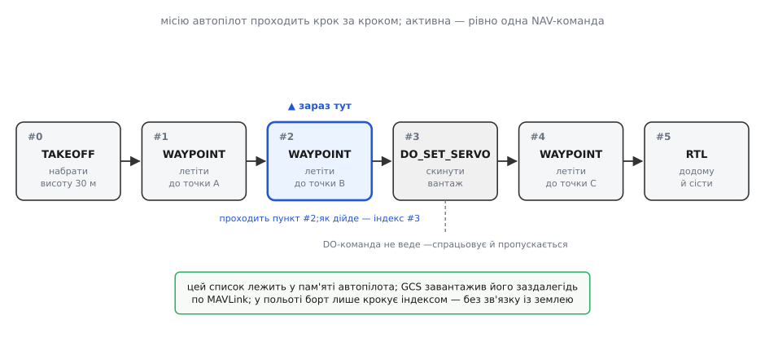
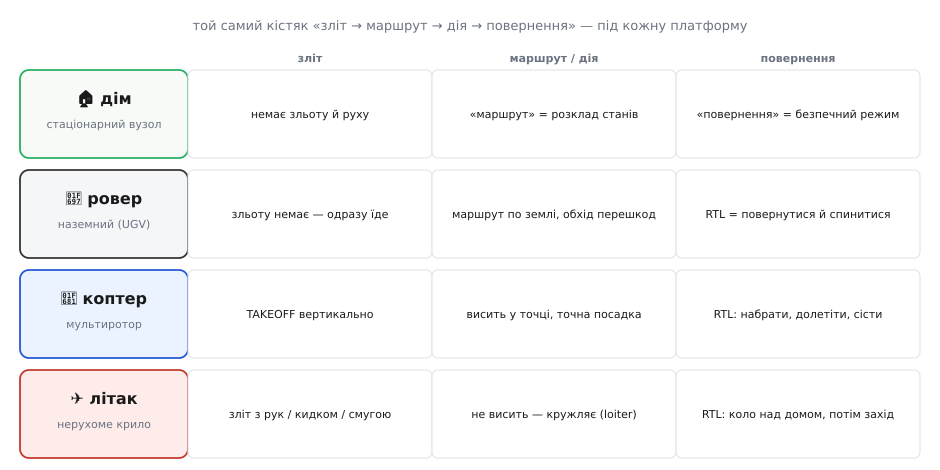
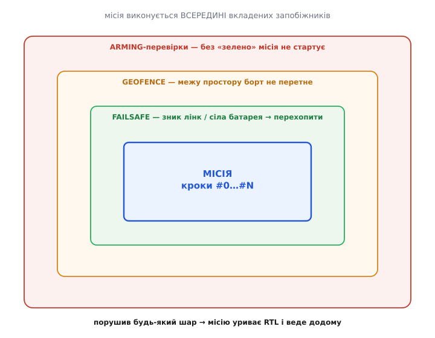

# Капстоун: одна автономна місія від першого «armed» до посадки

Настав момент, коли всі частини курсу мусять зійтися в одну працездатну річ. Слово **капстоун** (англ. *capstone* — від *cap*, «вершина», і *stone*, «камінь») прийшло з мурування: це завершальний камінь, який кладуть **останнім** на гребінь стіни. Він нічого не тримає в тому сенсі, у якому тримає фундамент, — але поки його немає, стіна не завершена й відкрита дощу. Капстоун-проєкт — те саме: він не додає нового шматка теорії, він **замикає** все, що ти вже вмієш, у єдиний виріб, який працює сам.

І тут з'ясовується неприємне. Кожну ланку окремо ти вже пройшов: [замкнений контур](root:embedded/autonomous-system) із чотирьох частин, [проєктування місії з вейпойнтів](root:embedded/mission-planning), [команди MAVLink із землі](root:embedded/mavlink-from-ground), [pymavlink](root:embedded/pymavlink) для скриптів, три платформні доріжки. Але «вмію кожну ланку» і «маю апарат, що злітає, робить роботу й повертається сам» — це не одне й те саме. Між ними лежить **інтеграція**: усе разом, у правильному порядку, з правильними запобіжниками, на **твоєму** конкретному апараті. Саме її ми й пройдемо — не як новий матеріал, а як **збірку**.

Мета цього кроку вузька й чесна: взяти обрану платформу — дім, ровер, коптер чи літак — і довести її до **однієї повної автономної місії**, яку можна показати. Не «літає в ручному», не «GPS ловить», а: натиснув старт → апарат сам зробив послідовність дій → сам повернувся у безпечний стан. Далі — як саме це складається.

## Місія — це індексований список, який борт проходить сам

Почнімо з найважливішого зсуву в голові. Новачок уявляє автономну місію як складну програму, яку треба «написати». Насправді місія — це **простий список команд**, пронумерований від нуля, який автопілот проходить **по порядку**, як людина проходить пункти чеклиста згори вниз. Уся «розумність» — не в списку, а в тому [замкненому контурі стабілізації](root:embedded/autonomous-system), що вже крутиться під ним сотні разів на секунду; список лише каже контуру, **яку уставку** тримати зараз.


*Місія — це впорядкований список, який автопілот проходить крок за кроком. У кожну мить активна **рівно одна** навігаційна (NAV) команда — та, куди апарат зараз летить чи їде. Дійшов до її умови завершення (влучив у радіус точки) — переводить покажчик на наступний пункт. Команди-дії (DO) нікуди не ведуть: вони спрацьовують миттєво «збоку» — крутнути серво, зробити знімок — і покажчик іде далі. Весь цей список лежить у пам'яті борту; наземна станція завантажила його заздалегідь, а в польоті апарат крокує індексом **без зв'язку із землею**.*

Ця картина знімає більшість страху. Автономна місія — не «штучний інтелект на борту», а **скінченний автомат** із дуже прозорими переходами: у стані `#2` летимо до точки B; щойно опинилися в її радіусі (скажімо, 2 метри) — переходимо в `#3`. Ти вже будував [автомат failsafe-станів](root:embedded/autonomous-system/proj-failsafe-state-machine.md) — тут та сама ідея, тільки стани задає **список місії**, а не жорсткий код.

> 🔧 **Навіщо це.** Коли твоя місія «застрягне» — а вона застрягне на першому ж прогоні, — перше питання завжди одне: **на якому індексі вона стоїть і чому не йде далі**. У логах видно активний пункт місії. Найчастіша причина «завис на вейпойнті» — надто малий радіус влучення: апарат кружляє біля точки, але формально в неї не «влучив», тож покажчик не рухається. Побачивши місію як список з умовами переходу, ти дебажиш не «чому дрон дурний», а «чому не спрацював перехід #2 → #3» — а це вже конкретне питання з конкретною відповіддю.

Розберемо ключові типи пунктів — їх небагато, і всю місію будують саме з них.

**Навігаційні (NAV) команди** ведуть апарат і **тримають покажчик**, поки не виконаються: `NAV_TAKEOFF` (набрати висоту), `NAV_WAYPOINT` (летіти/їхати до координати), `NAV_RETURN_TO_LAUNCH` (повернутися додому), `NAV_LAND` (сісти). У будь-яку мить активна лише одна з них — апарат не може одночасно летіти в дві точки.

**Команди-дії (DO) і умови (CONDITION)** виконуються **між** навігаційними, не рухаючи апарата: `DO_SET_SERVO` (відхилити серво — скинути вантаж), `DO_DIGICAM_CONTROL` (клацнути камерою), `CONDITION_DELAY` (зачекати N секунд перед наступним пунктом). Правило автопілота просте: у кожну мить активні **щонайбільше одна NAV-команда й одна DO/CONDITION-команда**. Це не деталь реалізації, а свідоме обмеження [ArduPilot](root:embedded/autonomous-system/hist-ardupilot.md): апарат мусить завжди мати одну однозначну ціль руху.

Звідки ж борт бере цей список? Ти **не пишеш** його на борту. Ти складаєш його на землі — мишкою в наземній станції або скриптом на [pymavlink](root:embedded/pymavlink) — і **завантажуєш** у політний контролер по MAVLink. І ось тут криється деталь, через яку валиться багато перших спроб.

## Завантаження місії — це рукостискання, а не «надіслати файл»

Здавалося б: маєш список точок — надішли його однією посилкою, і все. Але радіолінк земля-борт **ненадійний**: пакети губляться, приходять не в тому порядку, дублюються. Якщо просто «вистрілити» місію одним потоком, борт легко отримає її з дірками — і полетить за спотвореним маршрутом. Тому [протокол місій MAVLink](root:embedded/mavlink-from-ground) робить не передачу файлу, а **діалог із підтвердженням кожного пункту** — класичне рукостискання (*handshake*):

```
GCS  → борт : MISSION_COUNT (усього 6 пунктів)
борт → GCS  : MISSION_REQUEST_INT (дай пункт #0)
GCS  → борт : MISSION_ITEM_INT   (ось #0: TAKEOFF, 30 м)
борт → GCS  : MISSION_REQUEST_INT (дай пункт #1)
GCS  → борт : MISSION_ITEM_INT   (ось #1: WAYPOINT A)
        …   (борт САМ запитує кожен наступний за номером)
борт → GCS  : MISSION_ACK (MAV_MISSION_ACCEPTED — прийняв усі 6)
```

Логіка тут глибша, ніж здається. **Борт сам просить** кожен наступний пункт за його номером `seq`. Це перекладає надійність на того, хто зберігає результат: якщо пакет із пунктом #3 загубився, борт просто **знову попросить #3** — і не рушить далі, поки не отримає. Прийшов пункт не по порядку — борт його **відкидає** й перепитує очікуваний. Список у пам'яті борту **не може** зібратися з дірками: він добудовується строго по одному, у порядку, з явним підтвердженням у кінці (`MISSION_ACK`). Це той самий принцип, що й у [надійного циклу команд](root:embedded/mavlink-commands/proj-command-ack-loop.md), який ти вже писав, — не «сподіваємося, що дійшло», а «підтвердь, що дійшло».

Історична примітка, яка врятує тебе від чужих прикладів у мережі: раніше пункти передавали повідомленнями `MISSION_ITEM` і `MISSION_REQUEST` — з координатами у **float**-градусах. У float 32 біти на десяткові градуси дають похибку в кілька метрів на місцевості — для точної посадки це багато. Тому спільнота перейшла на `_INT`-форми (`MISSION_ITEM_INT`, `MISSION_REQUEST_INT`), де широта й довгота — **цілі** числа в одиницях 10⁻⁷ градуса (приблизно сантиметр на екваторі). Старі float-повідомлення **застарілі** — якщо бачиш їх у чиємусь коді, це ознака давнього прикладу; пиши на `_INT`.

**Приклад (перевірити, що завантажене — те, що задумав).** Найпідступніша помилка капстоуна: місію завантажив, а на борту вона **не така**, як на екрані GCS (координати переплутано, висоту не в тих одиницях). Тому після завантаження — обов'язково **зчитай місію назад із борту** й порівняй. Ось кістяк на pymavlink:

:::tabs
```py
# Крок 1: попросити борт вивантажити його поточну місію.
master.mav.mission_request_list_send(
    master.target_system, master.target_component,
    mavutil.mavlink.MAV_MISSION_TYPE_MISSION)

# Крок 2: борт відповість MISSION_COUNT; далі просимо кожен пункт по seq.
count = master.recv_match(type='MISSION_COUNT', blocking=True).count
for seq in range(count):
    master.mav.mission_request_int_send(       # MISSION_REQUEST_INT(seq)
        master.target_system, master.target_component, seq)
    it = master.recv_match(type='MISSION_ITEM_INT', blocking=True)

    # Крок 3: звірити з тим, що ЗАДУМАНО (не з тим, що «мали б надіслати»).
    if it.command == mavutil.mavlink.MAV_CMD_NAV_WAYPOINT:
        lat = it.x * 1e-7              # 10⁻⁷ градуса → градуси
        lon = it.y * 1e-7
        alt = it.z                     # метри над точкою старту
        print(f"#{seq}  {lat:.7f}, {lon:.7f}  alt={alt:.1f} m")
```
```cpp
// Псевдо-C для ясності послідовності; на практиці — pymavlink на землі.
// Крок 1: попросити борт вивантажити його поточну місію.
mavlink_msg_mission_request_list_send(chan, target_sys, target_comp,
                                      MAV_MISSION_TYPE_MISSION);

// Крок 2: борт відповість MISSION_COUNT; далі просимо кожен пункт по seq.
for (uint16_t seq = 0; seq < count; seq++) {
    request_mission_item(seq);                 // MISSION_REQUEST_INT(seq)
    mavlink_mission_item_int_t it = wait_item(seq);

    // Крок 3: звірити з тим, що ЗАДУМАНО (не з тим, що «мали б надіслати»).
    if (it.command == MAV_CMD_NAV_WAYPOINT) {
        double lat = it.x * 1e-7;              // 10⁻⁷ градуса → градуси
        double lon = it.y * 1e-7;
        float  alt = it.z;                     // метри над точкою старту
        printf("#%u  %.7f, %.7f  alt=%.1f m\n", seq, lat, lon, alt);
    }
}
```
:::

Порівняв роздрук із задумом — і лише тоді дозволяєш собі армитися. Дві хвилини звірки економлять годину пошуку «чому дрон полетів не туди».

> 🔧 **Навіщо це.** «Завантажив і полетів» без зчитування назад — це політ наосліп. Одиниці висоти (метри над точкою старту чи над рівнем моря?), система координат, порядок точок — усе це джерела тихих помилок, які **не видно**, поки апарат не рушить. Зчитування назад робить помилку **видимою на землі**, де вона нічого не коштує. Це дешева страховка, яку професіонали роблять завжди, а новачки — після першої втечі апарата.

## Той самий кістяк — чотири різні платформи

Тепер найкорисніша ідея цього кроку. Хоч яку з чотирьох платформ ти обрав, **скелет місії однаковий**: підготуватися → пройти маршрут / зробити роботу → безпечно завершити. Змінюється не форма, а **наповнення** кожної фази — бо фізика платформ різна. Побачивши це, ти зрозумієш, чому курс узагалі розкладав платформи окремими доріжками ([дім](root:embedded/smart-home-node), наземні, повітряні): щоб зараз ти брав **готовий** кістяк і лише підставляв у нього свою платформу.


*Кістяк «зліт → маршрут/дія → повернення» спільний, наповнення — своє. Дім нікуди не рухається: його «маршрут» — це розклад станів (нагрівати, поки холодно), а «повернення» — перехід у безпечний режим при збої. Ровер зльоту не має — одразу котиться маршрутом по землі, обходячи перешкоди, а RTL для нього означає «повернутися й спинитися». Коптер злітає вертикально, вміє висіти в точці й точно сідати. Літак не висить — він кружляє над точкою (loiter), а RTL для нього — зробити коло над домом і зайти на посадку. Обираєш свою платформу — берешся за свій рядок.*

Пройдімо кожну коротко — саме те, що змінює твою місію.

**Дім (стаціонарний вузол).** Тут «місія» — не рух, а **логіка без людини**. У тебе немає вейпойнтів; замість них — [автономна логіка вузла](root:embedded/smart-home-node): давач міряє, порогова умова вирішує, реле діє. «Зліт» вироджується в ініціалізацію й вихід на робочий режим; «маршрут» — це послідовність станів у часі (наприклад, підтримувати температуру за [гістерезисом](root:embedded/smart-home-node/proj-hysteresis-control.md)); «повернення» — перехід у безпечний стан, коли зник зв'язок чи давач збожеволів. Кістяк той самий — але виконує його не політний контролер, а твоя прошивка на вузлі. Це найм'якший капстоун фізично й найчистіший логічно: уся автономність — у переходах станів.

**Ровер (наземний, UGV).** Фаза «зліт» відпадає — апарат одразу починає рух. Маршрут іде по землі, і головна відмінність від повітря — **перешкоди**: на землі їх багато, і місію треба вести з [обходом перешкод](root:embedded/obstacle-avoidance). `NAV_WAYPOINT` для ровера означає «доїхати до точки», а не «долетіти»; `RTL` — «повернутися до старту й зупинитися». Ровер прощає найбільше: впав лінк — він просто стоїть, а не падає. Тому це найбезпечніша платформа, щоб **уперше** пройти повну автономну місію наживо.

**Коптер (мультиротор).** Тут кістяк розкривається повністю: `NAV_TAKEOFF` піднімає вертикально на задану висоту, вейпойнти ведуть у 3D, апарат уміє **висіти** над точкою (утримувати позицію), а `RTL` — набрати безпечну висоту, долетіти додому й **точно сісти**. Ціна повноти — нульова поблажливість: збій у польоті означає падіння. Тому саме для коптера [геозона](root:embedded/autonomous-system) й [failsafe](root:embedded/autonomous-system) — не формальність, а умова виживання апарата.

**Літак (нерухоме крило).** Головна пастка новачка: літак **не вміє висіти**. Він тримається в повітрі лише завдяки [підйомній силі](root:embedded/autonomous-system) на швидкості, тож не може «зупинитися в точці» — замість цього він **кружляє** навколо неї (*loiter*). Це змінює місію: там, де коптер завис би, літак робить кола. Зліт — з руки, катапультою або зі смуги; посадка — заходом по глісаді, а не вертикально. І `RTL` для літака — це коло над домом на безпечній висоті, а не зависання. Якщо твоя платформа — [VTOL-гібрид](root:embedded/autonomous-system), додається ще й **перехід** між вертикальним і літаковим режимами, і це найскладніший капстоун із чотирьох.

> 🔧 **Навіщо це.** Ця таблиця — твій оберіг від чужих туторіалів. Більшість прикладів у мережі — про коптер; якщо ти будуєш ровер чи літак і сліпо копіюєш «коптерну» місію, вона або не поїде, або небезпечно поводитиметься (літаку зададуть зависання, якого він не вміє). Спершу знайди свій рядок у цій таблиці — і лише тоді бери приклад, свідомо переклавши його фази на **свою** фізику.

## Місія живе всередині захисної оболонки

Досі ми говорили про **щасливий шлях** — коли все йде за планом. Але капстоун відрізняється від «злітало кілька разів» саме тим, як він поводиться, **коли щось піде не так**. І тут вступає ідея, без якої автономну місію не можна показувати наживо: сам список команд — це лише **ядро**, і воно виконується всередині кількох **вкладених запобіжників**, що стежать за ним ззовні.


*Список місії — це лише серцевина. Навколо нього — три оболонки, які працюють незалежно від того, на якому пункті стоїть місія. **Arming-перевірки** — зовнішня: без «усе зелено» місія навіть не стартує. **Геозона** — межа дозволеного простору: за неї борт фізично не випустять, хоч би що казав маршрут. **Failsafe** стежить за здоров'ям системи: зник зв'язок, сіла батарея, відмовив давач — перехопити керування в місії. Порушив будь-який шар — місію уриває повернення додому (RTL). Ядро «слухняне», оболонки «пильні».*

Розберемо оболонки зсередини назовні — саме так вони спрацьовують у часі.

**Arming-перевірки** — брама на вході. [Арм-перевірки](topic:sys-dron/arming-checks) не дають апарату «озброїтися» (роздати живлення на мотори), поки не виконано **всі** передумови: GPS має досить супутників, [давачі відкалібровані](root:embedded/fc-setup-calibration), напруга батареї в нормі, є фіксація домашньої точки. Логіка залізна: краще **не злетіти**, ніж злетіти зі сліпим давачем. Ти вже проходив [безпеку до польоту](topic:sys-dron/preflight-safety); тут вона стає буквальним замком на старті місії. Пройшов усі перевірки — тільки тоді дозволено `arm` і старт `AUTO`.

**Геозона** ([geofence](topic:sys-dron/geofence)) — стіна навколо дозволеного простору. Ти задаєш межу (коло радіусом, скажімо, 200 м навколо дому, і стелю висоти), і борт **сам** стежить, щоб не вийти за неї — незалежно від того, куди веде маршрут. Помилився в координаті вейпойнта, задав точку за кілометр — геозона зупинить апарат на межі й поверне, а не дасть йому полетіти в поля. Це критично саме для капстоуна: коли місію складає новачок, помилка в точці **дуже** ймовірна, і геозона перетворює «апарат утік» на «апарат уперся в стіну й повернувся».

**Failsafe** — сторож здоров'я, що працює **весь** політ. [Failsafe](topic:sys-dron/failsafe) — це набір автоматичних реакцій на негаразди: **зник радіозв'язок** із пультом → повернутися додому; **сіла батарея** нижче порога → сісти негайно; **збожеволів давач** → перейти в безпечніший режим. Ти будував [автомат failsafe-станів](root:embedded/autonomous-system/proj-failsafe-state-machine.md) — ось де він працює по-справжньому. Ключове розуміння: failsafe **вищий за місію**. Хоч би на якому пункті стояв список, спрацьований failsafe **перехоплює** керування й веде апарат у безпеку. Місія слухняно поступається.

Спільний вихід усіх трьох оболонок — здебільшого один: **RTL**, повернення до точки старту. Тому домашню точку (де апарат армився) треба зафіксувати **правильно** — це буквально місце, куди він повернеться в біді.

> 🔧 **Навіщо це.** Різниця між «саморобка, що іноді літає» і «капстоун, який можна показати» — не в тому, як гарно апарат проходить маршрут, а в тому, що він робить у **найгіршу** мить. Демонстрація, де ти на очах у людей висмикуєш пульт, а апарат спокійно повертається додому, переконує більше за будь-який ідеальний маршрут. Спершу налаштуй і **перевір** оболонки — і лише потім ускладнюй саму місію. Пілоти кажуть це так: спершу навчися падати безпечно, тоді літай.

## Складання: від пустого борту до показаної місії за один підхід

Тепер зберімо все в **порядок дій**. Це не новий матеріал — це послідовність, у якій твої вже наявні вміння дають готовий результат. Роби строго згори вниз; кожен крок спирається на попередній, і **не** перестрибуй.

**1. Стенд і калібрування.** Зібраний апарат, [первинне калібрування давачів і радіо](root:embedded/fc-setup-calibration) зроблено, параметри виставлено. Без чистої оцінки стану місія безглузда — контур не знатиме, де апарат.

**2. Оболонки безпеки — перш ніж будь-яка місія.** Задай геозону, налаштуй пороги failsafe (напруга батареї, поведінка при втраті лінка), перевір arming-перевірки. **Перевір їх фізично**: заглуши пульт на землі й переконайся, що апарат реагує як задумано. Це роблять **до** першого автономного руху.

**3. Найпростіша можлива місія.** Не будуй одразу складний маршрут. Для коптера це `TAKEOFF` на 10 м → один `WAYPOINT` за 20 м → `RTL`. Для ровера — два вейпойнти й назад. Для дому — один цикл порогової логіки. Мета першого прогону — довести, що **ланцюг замикається**, а не показати красивий маршрут.

**4. Завантаж і зчитай назад.** Склади місію в GCS чи [скриптом](root:embedded/pymavlink), завантаж у борт, **вивантаж назад** і звір із задумом (як у прикладі вище). Розбіжність тут коштує нічого; розбіжність у польоті — коштує апарата.

**5. Прогін із пальцем на перемикачі.** Армся, переведи в `AUTO`, дай місії старт — і **тримай палець на перемикачі режиму**. Найменший сумнів — перехопи в ручний (або стабілізований) режим. Перший автономний прогін завжди роби так, щоб **однією дією** повернути керування собі. Це не боягузтво, а стандарт.

**6. Читай лог, не пам'ять.** Після прогону — [розбери лог польоту/поїздки](root:embedded/flight-log-analysis). Він скаже правду про те, що **насправді** сталося: на яких пунктах стояла місія, коли й чому спрацьовував failsafe, чи не «плавала» оцінка стану. Пам'ять обманює; лог — ні. Ти вже писав [парсер логів](root:embedded/flight-log-analysis/proj-log-parser.md) — тут він окупається.

**7. Ускладнюй по одному.** Працює найпростіша місія — **тоді** додавай: більше точок, дію в дорозі (скинути вантаж, зробити знімок), точну посадку. По **одній** зміні за прогін, щоразу перечитуючи лог. Додав п'ять речей одразу й щось зламалося — не знатимеш, що саме.

Цей порядок — не бюрократія, а спосіб **не втратити апарат** і не потонути в незрозумілих збоях. Кожен крок робить наступний безпечним. Пропустиш перевірку оболонок (крок 2) — і перша ж помилка в координаті стане втечею замість повернення.

> 🔧 **Навіщо це.** Спокуса капстоуна — зробити все й одразу: скласти ефектну місію на десять точок зі скиданням вантажу й точною посадкою, залити й запустити. Так втрачають апарати. Дисципліна «найпростіше → перевір → додай одне» — це не про обережність заради обережності, а про **керовану складність**: у кожну мить ти маєш рівно одну нову змінну, тож коли щось ламається, причина очевидна. Це та сама інженерна звичка, що й [коротка петля розробки прошивки](root:embedded/mavlink-from-ground) — міняй мале, перевіряй одразу.

## Що означає «капстоун зроблено»

Проєкт легко вважати завершеним передчасно — «ну, воно ж пролетіло». Тому потрібен **чіткий критерій приймання**, однаковий для всіх платформ і не залежний від настрою. Капстоун зроблено, коли апарат **самостійно** проходить повний цикл і безпечно поводиться у збої. Розкладемо це на перевірні пункти.

**Замикання циклу.** Апарат сам проходить усі три фази без втручання людини: підготувався → виконав маршрут чи роботу → повернувся у безпечний стан (сів / зупинився / перейшов у безпечний режим). Жодного дотику до пульта в нормальному прогоні.

**Правильна поведінка у збої.** Ти **навмисне** створюєш негаразд — глушиш пульт, імітуєш низьку батарею — і апарат реагує запобіжником як задумано (повертається / сідає), а не «дуріє». Це перевіряють окремим прогоном, бо саме тут ховається різниця між іграшкою й виробом.

**Відтворюваність.** Місія проходить не один раз випадково, а **стабільно** — кілька прогонів поспіль дають той самий результат. Одноразовий успіх — це збіг, а не система.

**Слід у логах.** Кожен прогін лишає лог, який ти **вмієш прочитати** й пояснити: ось тут місія перейшла з пункту #2 на #3, ось тут спрацював failsafe, ось так поводилася оцінка стану. Якщо ти не можеш пояснити лог — ти не контролюєш апарат, а лише спостерігаєш за ним.

**Документованість.** Хтось інший (чи ти сам за півроку) може повторити місію за твоїм описом: схема з'єднань, параметри, кроки запуску. Саме це — наступний і **останній** крок курсу: [документація проєкту](root:embedded/project-documentation) — README, схема, BOM, журнал змін. Бо капстоун, який працює лише в твоїх руках і лише сьогодні, — це ще не завершений виріб, а лише вдалий прогін.

Зійдися всі п'ять — і стіну завершено: завершальний камінь ліг. Ти пройшов шлях від [заряду й струму](root:embedded/autonomous-system) до апарата, який отримує ціль, сам вирішує, як її досягти, сам стежить за власним здоров'ям і сам повертається, коли щось не так. Це і є вбудована автономна система — не як означення з підручника, а як річ, що стоїть перед тобою й працює. Лишилося описати її так, щоб вона пережила тебе, — і цим ми завершимо.
