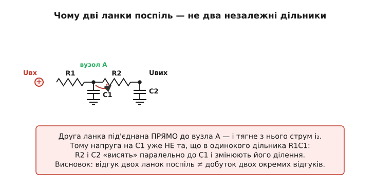
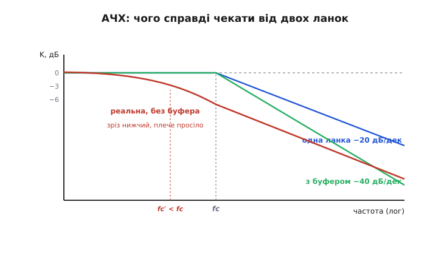
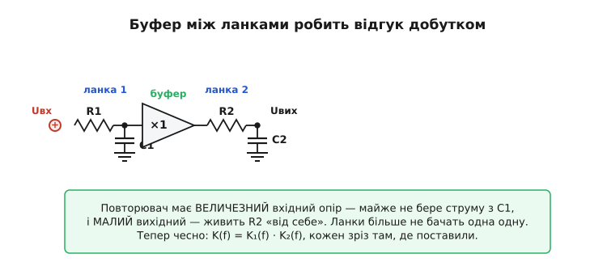
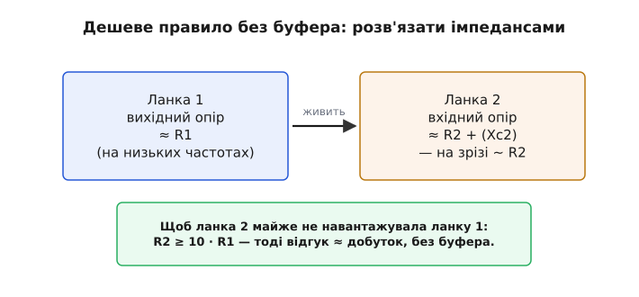

# Каскадовані RC-ланки

<preknowlist>
- [Децибели](root:hw-analog/decibels) — логарифмічна міра відношення; −20 дБ означає послаблення сигналу вдесятеро за амплітудою.
- [Повторювач напруги](root:hw-analog/voltage-follower) — буфер на операційному підсилювачі: коефіцієнт рівно 1, дуже великий вхідний і дуже малий вихідний опір.
</preknowlist>

Одна RC-ланка вже стала нашим робочим інструментом: резистор послідовно, конденсатор на землю — і маємо фільтр нижніх частот, що пропускає повільне й гасить швидке. Та коли доходить до серйозної задачі — придушити шум перетворювача на сотні мілівольт, очистити сигнал перед АЦП, прибрати дзвін на цифровому фронті — однієї ланки раптом замало. Її схил надто пологий: вище за зріз вона послаблює сигнал лише вдесятеро на кожні десять разів частоти. Завада за вдвічі вищою частотою майже не зачеплена. Природна думка: поставити **дві ланки поспіль**, тоді й гаситиме вдвічі крутіше. Думка правильна — але якщо просто з'єднати дроти, результат розчарує. Цей крок — про те, чому наївне каскадування обманює очікування, як це полагодити й коли воно того варте.

> Тут ми спираємося на готову цеглинку — одну RC-ланку як фільтр нижніх частот. Якщо потрібно освіжити, чому R послідовно й C на землю пропускають повільне й ріжуть швидке і звідки береться зріз f_c = 1/(2πRC), — це [RC-фільтр нижніх частот](root:hw-analog/rc-low-pass).

## Навіщо взагалі друга ланка: крутизна схилу

Згадаймо, як виглядає [частотна характеристика](root:hw-analog/frequency-response) однієї RC-ланки. До зрізу — рівне плато, сигнал проходить майже без втрат. Після зрізу — спад, і спадає він із цілком певною крутизною: на кожну **декаду** (десятикратне зростання частоти) сигнал слабшає вдесятеро, тобто на 20 децибел. Кажуть: «нахил −20 дБ на декаду», або те саме інакше — «−6 дБ на октаву» (на кожне подвоєння частоти).

> Децибел (дБ) — логарифмічна міра відношення: −20 дБ означає послаблення у 10 разів за амплітудою, −40 дБ — у 100 разів, −6 дБ — приблизно вдвічі. Чому саме так і звідки множник 20 — у темі про [децибели](root:hw-analog/decibels).

Чому цього часто мало, видно на простому прикладі. Хай корисний сигнал лежить на 100 Гц, а заважає перешкода на 1 кГц — лише вдесятеро вище. Поставимо зріз посередині, скажімо на 300 Гц. Одна ланка послабить перешкоду на 1 кГц приблизно втричі — і це все. Якщо перешкода була в десять разів сильніша за корисний сигнал, після фільтра вона ще втричі сильніша. Сигнал залишився брудним. Потрібен крутіший спад: щоб за тих самих 1 кГц перешкода падала не втричі, а вдесятеро-стократно.

Ось тут і зринає ідея каскаду. Поставимо **дві** однакові ланки одна за одною. Перша послабила перешкоду вдесятеро на декаду, друга — ще вдесятеро. Разом — у сто разів на декаду, нахил −40 дБ на декаду. Три ланки дали б −60 дБ на декаду, і так далі: кожна додана ланка додає до схилу свої −20 дБ на декаду. Слово **каскад** (фр. cascade — водоспад уступами) тут саме до речі: сигнал спадає уступ за уступом, і що більше уступів, то стрімкіший загальний водоспад.

> 🔧 **Навіщо це.** Крутизна схилу — це гроші й місце на платі. Що крутіший фільтр, то ближче можна поставити зріз до корисної смуги, не зачепивши її, і тим сильніше прибити заваду поряд. Перед АЦП це прямо означає, скільки сміття потрапить у вибірку; у тракті живлення — скільки пульсації перетворювача просочиться далі. Один зайвий уступ часто рятує від дорожчого рішення — активного фільтра чи екранування.

## Наївне каскадування: чому дроти підводять

Здавалося б, усе просто: вихід першої ланки — на вхід другої, і відгуки перемножаться. Кожна ланка має свою передавальну функцію (у скільки разів і з яким зсувом фази вона змінює кожну частоту), і логічно, що дві ланки поспіль дадуть добуток цих двох функцій. Якби це було так, дві однакові ланки чесно дали б подвоєний нахил із зрізом на тому самому місці.

Але ось у чому пастка. Коли ми рахували одну ланку як дільник напруги, ми мовчки припустили, що **з її виходу струм не тече** — конденсатор лише набирає й віддає заряд, а більше нікуди струмові йти. Щойно ми під'єднуємо до цього виходу другу ланку, припущення ламається: резистор другої ланки відкриває новий шлях струмові з вузла між ланками на землю. Друга ланка стала **навантаженням** для першої.


*Друга ланка під'єднана прямо до вузла A й тягне з нього струм i₂ через свій резистор. Через це напруга на C1 уже не та, що в одинокого дільника R1C1: R2 і C2 фактично висять паралельно до C1 і змінюють його ділення. Тому відгук двох ланок поспіль не дорівнює добутку двох окремих відгуків.*

> 🔧 **Навіщо це.** Це той самий ефект навантаження, що псує звичайний резистивний [дільник напруги](root:hw-analog/voltage-divider), коли до нього під'єднують споживача: підключене навантаження «відтягує» нижнє плече вниз, і напруга просідає проти розрахункової. У каскаді ланок навантаженням виступає сама наступна ланка — і та сама фізика спотворює характеристику, тільки вже частотно-залежно.

Подивімося, що це дає на характеристиці. Друга ланка, висячи паралельно до першого конденсатора, **полегшує** його розряд — частина струму тепер іде в R2 замість того, щоб лишитися в C1. Перший конденсатор тримає менше напруги, ніж тримав би сам, особливо на середніх частотах. У підсумку обидва зрізи «з'їжджаються», полюси розштовхуються, і замість гострого подвоєного коліна виходить розмазаний, ранній перехід.


*Чого справді чекати від двох ланок. Одна ланка дає −20 дБ на декаду (синя). Ідеально розв'язані дві ланки — крутий −40 дБ на декаду з тим самим зрізом (зелена). А реальна пара без розв'язки (червона) ріже раніше — її зріз f_c′ нижчий за паспортний f_c, і коліно м'якше, ніж обіцяв добуток.*

Числа цього спотворення варто побачити явно, бо саме вони керують тим, наскільки сильно з'їде зріз і чи доведеться ставити буфер.

> 🧮 Повний чесний розрахунок двох ланок, поява «зайвого» навантажувального доданка в передавальній функції, виведення правила десятикратного імпедансу та формула зсуву зрізу для n однакових ланок — у вставці [Звідки береться навантажувальний доданок і формула зрізу](root:embedded/cascaded-rc-filters/math-loading.md).

## Перше лікування: буфер між ланками

Якщо біда в тому, що друга ланка п'є струм із першої, очевидне рішення — **не дати їй цього робити**. Між ланками ставлять **буфер** — повторювач напруги (англ. buffer — прокладка, проміжна ланка). Це підсилювач із коефіцієнтом рівно одиниця: яку напругу дали на вхід, таку він повторює на виході. Сенс його не в підсиленні, а у двох інших властивостях: дуже **великий вхідний опір** (майже не бере струму від того, що до нього під'єднане) і дуже **малий вихідний опір** (легко живить наступне навантаження, не просідаючи сам).


*Повторювач між ланками розриває їхній взаємний вплив. Його великий вхідний опір майже не навантажує перший конденсатор, а малий вихідний живить другу ланку «від себе». Ланки більше не бачать одна одної — і відгук стає чесним добутком K(f) = K₁(f)·K₂(f), кожен зріз там, де його поставили.*

Що тут відбувається фізично. Буфер «зчитує» напругу на першому конденсаторі, майже не торкаючись її — бере мізерний струм, тож для першої ланки наче нікого й немає, вона працює як одинокий дільник. А далі буфер сам, своїм потужним виходом, відтворює цю напругу й живить нею другу ланку. Друга ланка тепер навантажує не перший конденсатор, а вихід буфера, якому це байдуже. Зв'язок розірвано — і обіцяний добуток передавальних функцій нарешті виконується точно.

> Повторювач напруги будують на операційному підсилювачі, замкнувши його вихід прямо на інвертувальний вхід. Чому такий зворотний зв'язок дає коефіцієнт рівно одиниця, величезний вхідний і крихітний вихідний опір — у темі [повторювач напруги](root:hw-analog/voltage-follower).

Ціна рішення — активний елемент: операційний підсилювач, його живлення, його власні обмеження (зміщення, шум, межі напруги). Зате результат передбачуваний до коми: ставите три ланки з буферами — маєте рівно −60 дБ на декаду й три зрізи там, де хотіли. Саме так будують серйозні аналогові фільтри, і саме звідси ростуть [іменні апроксимації](root:embedded/filter-families), де ланки навмисно роблять різними, щоб дістати потрібну форму коліна.

> 🔧 **Навіщо це.** У реальному тракті перед АЦП буфер часто й так уже стоїть — щоб «розв'язати» високоомний давач від входу перетворювача. Якщо він є, додати після нього ще одну RC-ланку нічого не коштує: розв'язка вже забезпечена. Тому, проєктуючи аналоговий вхід, варто думати про буфер і фільтр разом — один елемент часто закриває обидві потреби.

## Друге лікування: розв'язати імпедансами, без буфера

Буфер — не завжди доречний. Іноді в схемі немає вільного операційного підсилювача, немає для нього живлення, або задача проста й не варта активного елемента. Тоді користуються дешевшим прийомом: **зробити так, щоб друга ланка майже не навантажувала першу**, не розриваючи їх фізично.

Ідея пряма. Перша ланка не любить, коли з неї тягнуть струм. Скільки струму потягне друга ланка, залежить від її опору: що він більший, то менший струм за тієї самої напруги. Отже, якщо вхідний опір другої ланки зробити **набагато більшим** за вихідний опір першої, струм у неї потече мізерний — і навантаження стане майже непомітним. Звичний орієнтир — у десять разів.


*Перша ланка має вихідний опір порядку R1, друга — вхідний порядку R2. Якщо R2 ≥ 10·R1, друга ланка тягне з першої лише близько десятої частини струму, і характеристика виходить майже як чесний добуток — без жодного активного елемента.*

На практиці це означає: щоб зберегти ту саму сталу часу (а отже, той самий зріз) у другій ланці, її резистор беруть удесятеро більшим, а конденсатор — удесятеро меншим. Добуток RC лишається тим самим, зріз — на місці, але імпеданс другої ланки став «легшим», і вона майже не вантажить першу. Хочете три ланки без буферів — кожну наступну роблять іще вдесятеро легшою за попередню.

У цього прийому є межа, і про неї треба знати чесно. По-перше, опори не можна нарощувати без кінця: дуже великий резистор разом із [тепловим шумом](root:embedded/noise-interference) і вхідними струмами наступного каскаду псує сигнал, та й остання, найлегша ланка має такий високий вихідний опір, що сама вже погано тримає будь-яке навантаження. По-друге, навіть за десятикратного запасу розв'язка не ідеальна **біля самого коліна** — там навантажувальний внесок росте з частотою, і невелике відхилення лишається. Для грубого згладжування цього досить; для точного фільтра з гострим коліном — ні, там повертаються до буфера.

> 🔧 **Навіщо це.** Десятикратне правило — це той самий принцип, за яким узагалі під'єднують вимірювальні прилади й каскади: вхід наступного має бути «легшим» за вихід попереднього, щоб не спотворити сигнал самим фактом під'єднання. У каскаді фільтрів воно дозволяє дешево скласти кілька ланок із самих лише пасивних деталей — копійчане рішення там, де точність коліна не критична.

## Скільки коштує крутизна: зсув зрізу

За крутіший схил доводиться платити, і не лише грошима на буфер. Навіть ідеально розв'язані, дві однакові ланки зсувають **зріз усього каскаду вниз** проти зрізу однієї ланки. Причина проста й варта того, щоб її відчути на пальцях.

Зріз −3 дБ — це частота, де сигнал просів до 0.707 від плата (послаблення приблизно в 1.4 раза за амплітудою). У однієї ланки це рівно її f_c. Але на цій самій частоті в каскаді **кожна** ланка вже забрала свої −3 дБ. Дві ланки разом дають −6 дБ — це вже помітно нижче за поріг −3 дБ. Отже, сумарний зріз каскаду лежить **нижче** за f_c однієї ланки: щоб загальне падіння було лише −3 дБ, треба відступити на частоту, де кожна ланка ще майже не ріже.

Скільки саме — дає точна формула (виведена у вставці вище). Для двох однакових ланок зріз каскаду виходить на рівні **0.64 від зрізу однієї ланки**:

```
f_зрізу каскаду = f_c · √(2^(1/n) − 1)

  одна ланка (n=1):  f_c · √(2 − 1)      = f_c · 1.00
  дві ланки  (n=2):  f_c · √(√2 − 1)     = f_c · 0.64
  три ланки  (n=3):  f_c · √(2^⅓ − 1)    = f_c · 0.51
```

Висновок практичний: якщо вам потрібен сумарний зріз каскаду на певній частоті, зріз **кожної** ланки треба закладати **вище** — поділити бажаний зріз на цей коефіцієнт. Інакше готовий фільтр почне різати корисний сигнал раніше, ніж ви розраховували.

**Порахуймо: дві однакові ланки із сумарним зрізом 1 кГц.**

```
Потрібен зріз каскаду  f_cac = 1 кГц, дві однакові ланки.

  зріз кожної ланки:  f_c = f_cac / 0.64 = 1000 / 0.64 ≈ 1560 Гц
  f_c = 1/(2π·R·C)  →  R·C = 1/(2π·1560) ≈ 102 мкс

  беремо R = 10 кОм (для другої ланки — 100 кОм, щоб розв'язати):
     C1 = 102 мкс / 10 000 Ом  ≈ 10 нФ
     C2 = 102 мкс / 100 000 Ом ≈ 1 нФ   (та сама стала часу, легший імпеданс)

  → дві ланки, схил −40 дБ/дек, сумарний зріз ≈ 1 кГц.
```

Зверніть увагу: ми навмисно поставили зріз кожної ланки на 1560 Гц, щоб після зсуву каскад різав саме на потрібній 1 кГц. Пропустити цей крок — найчастіша помилка-початківця в каскадах.

## Коли каскад однакових ланок — погана ідея

Дві-три однакові RC-ланки — простий спосіб дістати крутіший схил, але спосіб «тупий», і чесно сказати, чому. Усі полюси такого фільтра сидять на одній частоті, а це дає не різке, гостре коліно, а **м'яко закруглений** перехід: характеристика починає завалюватися задовго до зрізу й лише поступово виходить на крутий схил. Якщо вам потрібен фільтр, що до останнього тримає рівне плато, а тоді **різко** обриває, — однакові ланки цього не дадуть.

Саме тому інженери здебільшого не складають однакові ланки, а навмисно **розставляють полюси по-різному** — кожна ланка зі своїм зрізом і своєю добротністю. Так дістають різну форму коліна під різну потребу: максимально пласке плато, найкрутіший схил коштом брижі в смузі, або найрівнішу затримку для неспотвореного імпульсу. Це і є родини [іменних апроксимацій фільтрів](root:embedded/filter-families) — Баттерворта, Чебишова, Бесселя, — кожна з яких є рецептом, де поставити полюси заради своєї мети.

> 🔧 **Навіщо це.** Знати цю межу важливо, щоб не марнувати ланки даремно. Якщо завада далеко за смугою — однакові RC-ланки дешево й добре її приберуть, форма коліна неважлива. Але якщо завада тулиться **впритул** до корисної смуги, нарощувати однакові ланки майже не допомагає: пологе коліно все одно зачепить сигнал. Тоді або беруть іменну апроксимацію з гострим коліном, або взагалі переходять у цифрову обробку, де форму характеристики задають вільно.

## Каскад у прошивці: коли фільтр живе в коді

Усе сказане про струм і навантаження стосувалося **залізного** каскаду. Але у вбудованих системах фільтр частіше живе в **коді** — сигнал уже оцифрований, і ланки ми складаємо математично. І ось тут проявляється головна перевага розуміння каскаду: у програмі **ніякого навантаження немає**. Вихід однієї цифрової ланки — це просто число, передане наступній; воно не «тягне струм» і нічого не спотворює. Тому цифровий каскад завжди дає **чесний добуток** передавальних функцій, безкоштовно й точно.

Найпростіша цифрова RC-ланка — однополюсний експоненційний згладжувач: нове значення на виході трохи підтягується до входу, рештою лишаючись старим. Один коефіцієнт α задає «повільність» — цифровий аналог сталої часу RC.

:::tabs
```c
// Одна цифрова RC-ланка нижніх частот (експоненційний згладжувач).
// alpha = dt / (RC + dt), 0 < alpha < 1; менше alpha — повільніше, сильніше згладжує.
typedef struct {
    float y;       // попередній вихід (стан ланки)
    float alpha;   // коефіцієнт згладжування
} RcStage;

static inline float rc_step(RcStage *s, float x) {
    s->y += s->alpha * (x - s->y);   // y += α·(вхід − y)
    return s->y;
}
```
```python
# Одна цифрова RC-ланка нижніх частот (експоненційний згладжувач).
# alpha = dt / (RC + dt), 0 < alpha < 1; менше alpha — повільніше, сильніше згладжує.
class RcStage:
    def __init__(self, alpha):
        self.y = 0.0          # попередній вихід (стан ланки)
        self.alpha = alpha    # коефіцієнт згладжування

    def step(self, x):
        self.y += self.alpha * (x - self.y)   # y += α·(вхід − y)
        return self.y
```
:::

Щоб дістати крутіший схил, ми просто **проганяємо вибірку крізь дві такі ланки поспіль** — і це чесний каскад без жодної взаємодії між ними:

:::tabs
```c
// Каскад із двох цифрових RC-ланок = схил −40 дБ/декаду.
// Жодного навантаження: вихід першої — просто вхід другої.
RcStage s1 = { .y = 0.0f, .alpha = 0.10f };
RcStage s2 = { .y = 0.0f, .alpha = 0.10f };

float filter_sample(float x) {
    float a = rc_step(&s1, x);   // перша ланка
    return rc_step(&s2, a);      // друга ланка бере вихід першої — і все
}
```
```python
# Каскад із двох цифрових RC-ланок = схил −40 дБ/декаду.
# Жодного навантаження: вихід першої — просто вхід другої.
s1 = RcStage(alpha=0.10)
s2 = RcStage(alpha=0.10)

def filter_sample(x):
    a = s1.step(x)        # перша ланка
    return s2.step(a)     # друга ланка бере вихід першої — і все
```
:::

Зверніть увагу: у коді обидві ланки мають однаковий α, і ніякого «правила десятикратного імпедансу» не потрібно — бо число, передане з ланки в ланку, не навантажує нічого. Залізні турботи про струм і вихідний опір тут просто зникають. Лишається єдиний спадок аналогового світу — той самий **зсув зрізу**: дві однакові цифрові ланки так само дадуть сумарний зріз на рівні 0.64 від зрізу однієї, бо це властивість добутку передавальних функцій, а не заліза.

> 🔧 **Навіщо це.** Звідси випливає типове проєктне рішення: грубе придушення — однією-двома пасивними RC-ланками одразу на вході (вони ще й рятують АЦП від накладання частот, antialiasing), а тонку, круту фільтрацію — уже в коді, де ланки складаються вільно й точно. Залізо знімає найгірше сміття перед оцифруванням; код дочищає решту з будь-якою крутизною, якої вистачить процесора. Розподіл праці між аналоговим входом і цифровою обробкою — одне з ключових рішень у тракті сигналу.

Якщо відступити на крок, уся ця розповідь виявляється не про «дві RC-ланки», а про одну-єдину величину між ними — **розв'язку**. Кількість ланок задає лише *обіцяну* крутизну; чи дістанете ви її насправді — вирішує тільки те, наскільки ланки сліпі одна до одної. Тому та сама пара ланок поводиться так по-різному в залізі й у коді не через різну математику — вона однакова, — а через те, що розв'язка в залізі виборена й неповна, а в коді дармова й точна. Звідси й перше проєктне питання про каскад: не «скільки ланок дати заради схилу», а «де кожній ланці жити» — бо різниця між обіцяним фільтром і справжнім ховається саме в розв'язці ланок, а не в числі уступів.
