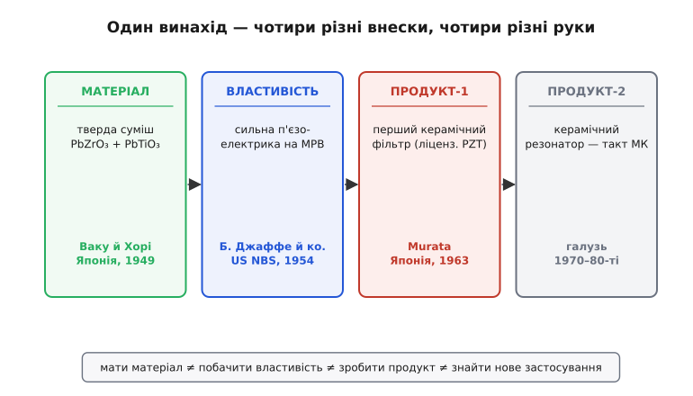
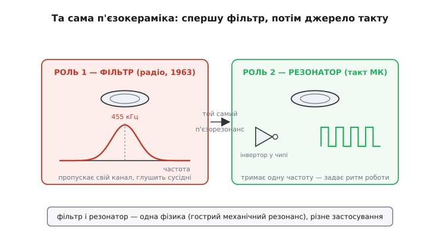

# 📜 PZT і керамічний резонатор: як п'єзокераміка стала джерелом такту

Коли ми ставимо на плату дешевий триногий керамічний резонатор, щоб затактувати простий мікроконтролер, ми тримаємо в пальцях кінець довгого ланцюга, що починається не з електроніки, а з **хімії твердого тіла** — і тягнеться крізь три країни й чотири десятиліття. Історія тут повчальна саме тим, як чітко в ній розділені ролі: одні люди зробили **матеріал**, зовсім інші через п'ять років побачили в ньому **корисну властивість**, ще інші й ще пізніше перетворили це на **продукт**, а тактовий резонатор для чипа виявився взагалі побічним застосуванням, до якого дійшли, коли з'явилися самі чипи. Розплутати цей ланцюг варто, бо його часто злипають в одне безлике «винайшли п'єзокераміку» — а насправді кожна ланка окрема, і кожна варта уваги.

## Чого бракувало: природний кварц був рідкісний і незручний

Почнімо з потреби, бо без неї решта висить у повітрі. У першій половині XX століття [п'єзоелектрику](book:physics/piezoelectric-effect) вже знали й використовували — брати П'єр і Жак Кюрі *(Pierre & Jacques Curie)* відкрили її ще 1880 року на кристалах кварцу й сегнетової солі. Кварц став основою стабільних генераторів і фільтрів: він має **гострий механічний резонанс**, а це саме те, що потрібно, щоб виділити одну частоту з-поміж багатьох.

Та кварц мав дві прикрі вади для масового виробництва. По-перше, це **природний монокристал** — його треба знайти, видобути, вирізати пластину під точним кутом до кристалографічних осей. Синтетичний кварц навчилися вирощувати лише згодом, а до того якісні заготовки були стратегічним дефіцитом (під час Другої світової — буквально: кварц ішов у військове радіо, і його бракувало). По-друге, кварц **слабкий** п'єзоелектрик: його п'єзовідгук малий, тож із нього незручно робити, скажімо, потужні перетворювачі чи компактні фільтри — доводилося викручуватися схемотехнікою.

Звідси й мрія, що рухала цілу галузь: а що, як зробити п'єзоелектрик **штучно** — спекти його з порошку, як звичайну кераміку, надаючи будь-якої форми, та ще й такий, що відгукується **сильніше** за кварц? Тоді не треба ні шукати кристали, ні мучитися з різанням — формуй що хочеш і скільки хочеш. Ця мрія й породила п'єзокераміку. Але дорога до неї виявилася непрямою.

## Матеріал: суміш свинцевих оксидів (Ваку й Хорі, Японія, 1949)

Перший потрібний матеріал з'явився не як «шукали п'єзоелектрик і знайшли», а радше з академічної цікавості до **хімії свинцевих перовскітів**. Тут треба назвати кілька імен точно, бо навколо них згодом наросло чимало плутанини.

Титанат барію *(BaTiO₃)* — перша по-справжньому корисна п'єзокераміка — з'явився під час війни, незалежно в кількох країнах (США, Японія, СРСР). Це важлива прелюдія: він довів, що **полікристалічна кераміка взагалі може бути п'єзоелектричною**, якщо її «поляризувати» — витримати в сильному електричному полі, щоб домени в зернах вишикувалися в один бік. Доти вважали, що безладна полікристалічна маса п'єзоефекту дати не може — адже внески хаотично напрямлених зерен мали б погаситися. Поляризація зруйнувала цю догму: кераміка стала повноцінним п'єзоелектриком. Титанат барію швидко пішов у діло, і саме на ньому виросла, зокрема, японська компанія Murata, до якої ми ще повернемося.

Але титанат барію мав власну ваду — **низьку точку Кюрі** *(Curie point)*, близько 120 °C. Точка Кюрі — це температура, вище якої матеріал утрачає свою поляризацію (домени «розплавляються» в безлад), а з нею й п'єзоефект. Для BaTiO₃ ці 120 °C незручно близькі: вже за помірного нагріву характеристики «пливуть», а перегрів узагалі стирає поляризацію. Потрібен був матеріал із **вищою** точкою Кюрі — щоб працював у ширшому діапазоні температур і не боявся нагріву.

Ось тут і виходять на сцену японські дослідники. **1949 року Ваку й Хорі** *(Waku, Hori)* встановили, що два свинцеві оксиди — **цирконат свинцю** *(PbZrO₃)* і **титанат свинцю** *(PbTiO₃)* — утворюють між собою **суцільний твердий розчин** *(solid solution)*: їх можна змішувати в будь-якій пропорції, і вони спікаються в єдину кристалічну фазу зі структурою перовскіту. Цю суміш і позначають абревіатурою **PZT** — від Plumbum (свинець, лат. *Plumbum* — звідси й хімічний символ Pb), Zirconium, Titanium; строго кажучи, це **Pb(Zr,Ti)O₃**, де частку цирконію й титану можна вибирати. Ключове відкриття Ваку й Хорі — саме **сам розчин і його висока точка Кюрі**: цирконат свинцю має точку Кюрі близько 230 °C, майже вдвічі вищу за титанат барію. Це усталений факт, підтверджений подальшою літературою.

> 🔧 **Навіщо це.** Висока точка Кюрі — не абстрактна цифра з підручника, а прямий інженерний параметр. Саме завдяки їй керамічний резонатор чи п'єзодавач можна ставити туди, де тепло: у моторному відсіку, поряд із силовою електронікою, в промисловому обладнанні. Матеріал, що втрачає властивості за 120 °C, туди не годиться; PZT зі своїми ~350 °C для типових складів — цілком. Вибір матеріалу під температуру починається саме з точки Кюрі.

Що тут важливо розрізнити чесно. Ваку й Хорі дали **матеріал і одну його властивість** (структуру й теплостійкість). Але вони **не** показали, що ця суміш — видатний п'єзоелектрик. Мало того, «чистий» цирконат свинцю сам по собі виявився взагалі **не** сегнетоелектриком у звичному сенсі, а **антисегнетоелектриком** — це наприкінці 1940-х – на початку 1950-х розібрала інша група японських фізиків (Савагучі, Ширане, Такагі *— Sawaguchi, Shirane, Takagi*), опублікувавши дослідження діелектричних властивостей PbZrO₃ у 1951 році. Тобто на цьому етапі PZT був радше цікавинкою хіміків і фізиків твердого тіла, ніж матеріалом для промисловості. Головне — практично корисна п'єзоелектрика — ще чекало на свого відкривача, за океаном і за п'ять років.

## Властивість: сильна п'єзоелектрика на межі фаз (Бернард Джаффе, США, 1954)

Тепер — центральна ланка, яку найчастіше й плутають з усім іншим. **1954 року** американський дослідник **Бернард Джаффе** *(Bernard Jaffe)* разом із колегами **Р. С. Ротом** *(R. S. Roth)* і **С. Марзулло** *(S. Marzullo)* у **Національному бюро стандартів США** *(National Bureau of Standards, NBS — нині NIST)* виявив, що PZT — не просто теплостійка кераміка, а **надзвичайно сильний п'єзоелектрик**. І не абиякий, а найкращий на той час: його п'єзовідгук у рази перевершував і кварц, і титанат барію.

Але справжня цінність відкриття — не просто «сильніший», а **де саме** він сильніший, і це найцікавіша й найтонша частина всієї історії. Джаффе виявив, що п'єзовідгук PZT різко зростає не абиде, а поблизу однієї конкретної пропорції цирконію до титану — там, де кристал стоїть **на межі двох різних структурних фаз**: тетрагональної й ромбоедричної. Цю межу назвали **морфотропною межею фаз** *(morphotropic phase boundary, MPB)*, і вона припадає приблизно на склад Pb(Zr₀.₅₂–₀.₅₅Ti₀.₄₈–₀.₄₅)O₃.

Чому саме на межі? Інтуїція така. Уявіть матеріал, який «не може вирішити», у яку з двох кристалічних форм йому перейти, бо енергії обох майже однакові. У цій нерішучості поляризація стає **надзвичайно податливою**: найменше зовнішнє поле легко «схиляє» її туди-сюди, а найменша механічна деформація сильно міняє поляризацію. Саме ця податливість на межі й дає гігантський п'єзоефект. Аналогія недосконала, але передає суть: куля на вершині пагорба скотиться від найлегшого поштовху, тоді як куля в глибокій ямі майже не зрушить. На морфотропній межі PZT — саме «куля на вершині»: максимально чутливий до впливу. Ламається аналогія в тому, що тут «нестійкість» не робить матеріал ненадійним — навпаки, склад підбирають так, щоб робоча точка стабільно сиділа біля цього піка чутливості.

Джаффе з колегами опублікували результат у «Journal of Applied Physics» (том 25, № 6, 1954, с. 809–810) — стаття «Piezoelectric Properties of Lead Zirconate-Lead Titanate Solid-Solution Ceramics». Це **усталений перводжерельний факт**, точка відліку для всієї подальшої п'єзокерамічної техніки: відтоді й дотепер PZT та його різновиди тримають більшу частину світового ринку п'єзоелектричних виробів.

*Ланцюг PZT, розкладений на ланки. Матеріал (твердий розчин PbZrO₃+PbTiO₃) — Ваку й Хорі, Японія, 1949. Корисну властивість (сильну п'єзоелектрику на морфотропній межі) — Бернард Джаффе з колегами, US NBS, 1954. Перший продукт (керамічний фільтр) — Murata, 1963, за ліцензією на PZT. Тактовий резонатор для мікроконтролера — уже пізніше застосування галузі. Мати матеріал, побачити властивість, зробити продукт і знайти нове застосування — чотири різні кроки.*

Тут варто на мить спинитися на самій **природі внеску**. Матеріал уже існував п'ять років — його склад, структуру, теплостійкість описали японці. Джаффе не «створив PZT»; він **побачив у наявному матеріалі те, чого не бачили інші**, — і, головне, зрозумів, *де* цю властивість шукати (на межі фаз). Це окремий, самостійний тип відкриття: не синтез нової речовини, а розкриття прихованого потенціалу відомої. Історія техніки повна таких випадків, коли між «речовина є» і «речовина корисна» лежить окремий творчий крок, який роблять інші руки.

## Хто такий «інший Джаффе»: не плутати з комерціалізатором

Одразу застережмо плутанину, яка тут майже неминуча. У цій історії фігурують **двоє Джаффе, не родичі**. **Бернард Джаффе** *(Bernard Jaffe)* — той, що в NBS відкрив п'єзоелектрику PZT (1954). А **Ганс Джаффе** *(Hans Jaffe)* — інженер компанії Clevite, яка згодом зробила з PZT бізнес; саме Ганс запросив Бернарда з NBS до Clevite, щоб той розвивав п'єзокерамічний напрям. Однакове прізвище — чистий збіг, але через нього легко приписати комерційний успіх відкривачеві або навпаки. Розрізняймо: **Бернард** — це **відкриття властивості** (наука, NBS), **Ганс** — це **побудова бізнесу** (промисловість, Clevite). Обидва внески справжні, але різні за характером.

## Комерціалізація: Clevite бере патенти, Murata бере ліцензію

Відкриття в лабораторії — ще не деталь на полиці. Між ними — патенти, виробництво, ліцензії; ця ланка менш романтична, зате саме вона доносить винахід до інженера.

**Clevite Corporation** — американська компанія, утворена 1952 року злиттям (Cleveland Graphite Bronze та фірми Brush). Саме вона взяла на себе перетворення PZT з наукового факту на товар: набрала патенти на п'єзокераміку PZT, а сама абревіатура **PZT стала торговою маркою Clevite** — доти цю назву ніхто інший не вживав. У Clevite група під керівництвом **Д. Р. Каррана** *(D. R. Curran)* у **1958–1960 роках** розробила перші **дискові керамічні фільтри** на PZT — спершу для військових застосувань. Ось тут ланцюг нарешті повертає від матеріалознавства до радіотехніки: PZT застосували саме так, як колись кварц, — щоб **виділяти частоту**.

Тим часом у Японії **Murata** — компанія, заснована 1944 року в Кіото Акірою Муратою *(Akira Murata)*, що виросла на керамічних конденсаторах і титанаті барію (і, до речі, зробила один із перших у світі практичних п'єзоперетворювачів на BaTiO₃ ще 1947 року для риболокаторів), — хотіла робити керамічні фільтри для масового радіо. Але шлях їй перегородили саме патенти Clevite на PZT. Murata вчинила чесно й прагматично: **1960 року вирішила взяти ліцензію** в Clevite, погодившись платити роялті (за наявними даними — близько 5 % з експортованих виробів) після кількох років перемовин. І вже **1963 року Murata випустила перші у світі промислові керамічні фільтри** для широкого ринку. Незабаром їх підхопили гіганти побутової електроніки: керамічні фільтри на 455 кГц пішли в AM-радіоприймачі на транзисторах (зокрема Sony), витісняючи громіздкіші рішення.

*Одна фізика — два застосування. Ліворуч: керамічний фільтр (1963) використовує гострий резонанс диска, щоб пропустити свій радіоканал (455 кГц) і приглушити сусідні. Праворуч: керамічний резонатор задає одну сталу частоту генераторові в чипі — ритм роботи мікроконтролера. Матеріал і принцип (гострий механічний п'єзорезонанс) той самий; різниця лише в тому, для чого ми той резонанс уживаємо.*

Розкладімо цю ланку так само чесно, як попередні. Clevite не відкрила PZT (це Бернард Джаффе) і не винайшла ідею п'єзофільтра (фільтрувати частоту резонатором уміли й на кварці). Її внесок — **перетворити матеріал на захищений патентами, відтворюваний промисловий продукт** і довести дисковий керамічний фільтр до робочого виробу. А внесок Murata — **вивести керамічний фільтр на масовий цивільний ринок**, зробити його дешевою, повсюдною деталлю споживчого радіо. Це різні внески: одна компанія проклала технологію й тримала патенти, друга зробила з неї товар для мільйонів. «Хто винайшов керамічний фільтр» тут не має однозначної відповіді — ланцюг колективний, і чесніше назвати всі ланки, ніж коронувати одну.

## Від фільтра до такту: як резонатор дійшов до мікроконтролера

Лишається остання ланка — та, заради якої ми, власне, й згадуємо цю історію в курсі про вбудовані системи. Як від радіофільтра дійшли до **тактового резонатора** в мікроконтролері?

Ключ у тому, що фільтр і тактовий резонатор — це **та сама фізика, вжита по-різному**. Керамічний фільтр працює так: п'єзодиск має гострий механічний резонанс на певній частоті, тож пропускає сигнали біля цієї частоти й глушить решту — це смуговий фільтр. Тактовий резонатор бере той самий гострий резонанс, але вмикає його в **петлю зі зворотним зв'язком**: коли резонатор із підсилювачем замкнути так, щоб той підживлював саме резонансну частоту, схема сама починає стало коливатися на ній — виходить [генератор](book:electronics/pierce-oscillator). Один і той самий п'єзорезонанс: у фільтрі ми ним **відбираємо** частоту з чужого сигналу, у генераторі — **народжуємо** свою.

Тому щойно з'явилися перші мікропроцесори й мікроконтролери (кінець 1960-х – 1970-ті), які потребували дешевого джерела такту, накопичений досвід п'єзокерамічних фільтрів природно переклали на нову задачу. Кварцовий резонатор давав відмінну точність, але коштував дорожче й вимагав окремих навантажувальних конденсаторів. А для простого чипа, що не веде точного часу, надточність зайва — досить «приблизно правильної» частоти. Тут керамічний резонатор виявився ідеальним компромісом: [дешевший за кварц, з нижчою добротністю](root:embedded/ceramic-mems-resonators) (а отже, швидшим стартом і меншою вибагливістю до розведення), та ще й його зручно робити **триногим** — із двома вбудованими всередину навантажувальними конденсаторами, щоб не ставити їх окремо. Японські виробники (та сама Murata й інші), що вже десятиліття робили керамічні фільтри, просто переорієнтували матеріал і технологію на новий, вибухово зростаючий ринок цифрових мікросхем.

Тут важливо не вигадувати героя. Тактовий керамічний резонатор **ніхто конкретний не «винайшов»** якимось одним патентованим стрибком — це **еволюційне застосування** зрілої вже технології п'єзокерамічних резонаторів до нової потреби, що постала з появою мікроконтролерів. Матеріал (PZT) був, принцип резонатора був, виробництво було — лишалося скерувати їх на тактування чипів, і галузь це зробила органічно, у міру того як цифрова електроніка ставала масовою. Це чесніший опис, ніж міфічне «тоді-то такий-то винайшов керамічний резонатор для МК».

## Що з цього ланцюга варто винести

Озирнімося на весь шлях — від хімічної цікавості до деталі на нашій платі — і на його уроки, бо вони виходять далеко за межі однієї деталі.

- **Матеріал, властивість, продукт і застосування — чотири різні кроки.** Японці дали суміш (1949), американець побачив у ній сильну п'єзоелектрику (1954), Clevite і Murata зробили з неї продукт (1958–1963), а галузь пристосувала його до тактування чипів (1970-ті). Кожен крок — окремий творчий акт, часто в іншій країні й іншими руками. Злипати їх в одне «винайшли п'єзокераміку» — значить не бачити, як насправді народжується техніка.
- **«Речовина є» ще не означає «речовина корисна».** Між синтезом матеріалу й розкриттям його головної властивості минуло п'ять років. Побачити прихований потенціал відомої речовини — самостійне відкриття, не менше за синтез нової.
- **Патент і ліцензія — теж ланка ланцюга.** Без готовності Murata чесно взяти ліцензію в Clevite масового керамічного фільтра могло б і не бути там і тоді. Комерціалізація — не «просто гроші» додатком до науки, а окрема, необхідна робота, що доносить винахід до інженера.
- **Найкорисніше живе на межі.** Гігантський п'єзоефект PZT — не в «чистій» фазі, а на морфотропній межі двох фаз, де матеріал максимально піддатливий. Часто найцінніша поведінка ховається саме на межі станів, а не в глибині якогось одного.
- **Не кожна деталь має винахідника-героя.** Тактовий керамічний резонатор — плід еволюції, а не одного стрибка. Питання «хто це винайшов» іноді просто неправильно поставлене: винайшла галузь, крок за кроком.

І нарешті — головне для нас, практиків. Той дешевий триногий резонатор, який ми не задумуючись кидаємо на плату поряд із мікроконтролером, несе в собі весь цей ланцюг: свинцеву кераміку японських хіміків, п'єзоефект американського фізика, патенти й виробництво двох компаній із двох країн і сорок років інженерної еволюції. Знати цю історію не обов'язково, щоб ним користуватися, — але вона добре нагадує, що навіть найбуденніша деталь має родовід, і що за чистою абревіатурою «PZT» на даташиті стоїть жива, колективна, багатонаціональна історія науки й техніки.
