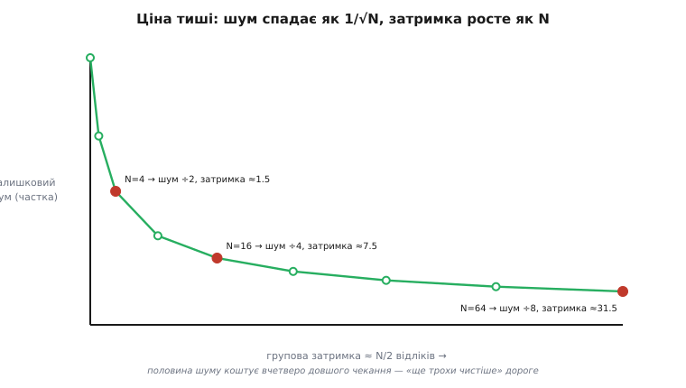
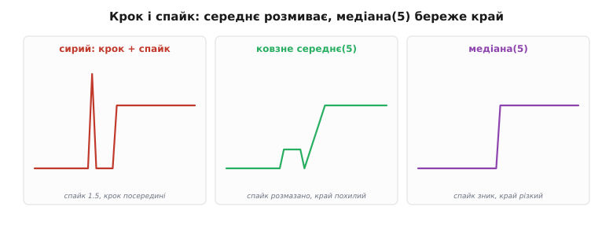
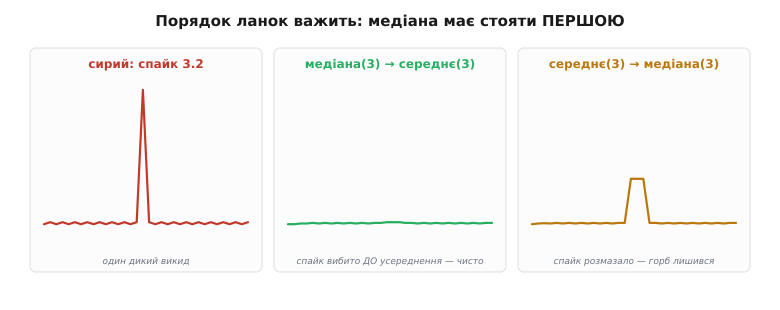
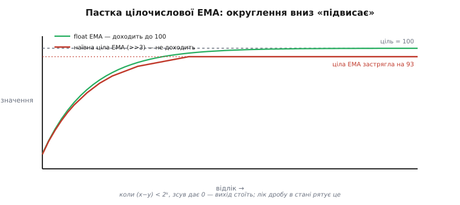

# Вибір фільтра (детально)

Базовий крок дав рамку рішення: спершу **діагноз** (дрейф → калібрування, викиди → медіана, тремтіння → усереднення), тоді **вибір** між ковзним середнім, медіаною та EMA, тоді **налаштування** на межі затримки й **перевірка** на реальних даних. Ця рамка правильна й нею користуються щодня. Але за кожним її кроком стоїть механіка, яку базова версія лише назвала, а не розгорнула: **чому** саме ці три фільтри вичерпують майже всю практику, **скільки точно** шуму зніме кожен і **скільки точно** затримки за це заплатить, **чому** порядок ланок у каскаді змінює результат, і де кожен фільтр **ламається** — на старті, на пропущеному відліку, на цілих числах у прошивці. Розберімо це до дна: не «беріть медіану проти спайків», а **звідки** береться її сила, чим вона за це платить і як порахувати наперед, чи вистачить трійки.

Нитку ведемо ту саму, що в базовій, — діагноз, вибір, налаштування, — але тепер під кожним пунктом кладемо повне виведення. Наприкінці стане видно, що три прості фільтри — це не випадковий набір, а **три канонічні відповіді** на три різні структури похибки, і що вибір між ними — насправді вибір **форми імпульсної характеристики** під форму брехні давача.

### Три фільтри — це три імпульсні характеристики

Почнімо з того, що об'єднує всі три й воднораз їх розрізняє. Будь-який лінійний фільтр без пам'яті про майбутнє повністю описується **однією річчю** — тим, що він робить із поодиноким сплеском на вході (одиничний імпульс: один відлік = 1, решта = 0). Ця реакція зветься **імпульсна характеристика** (англ. *impulse response*), і з неї виводиться геть усе: як фільтр давить шум, на скільки зсуває сигнал, як спотворює краї. Два з наших трьох фільтрів лінійні, тож їхню поведінку можна вирахувати повністю; медіана нелінійна — і саме тому вміє те, чого лінійні не вміють. Ось звідки й почнемо бачити, чому набір саме такий.

**Ковзне середнє** — це імпульсна характеристика з N однакових сходинок висотою 1/N: фільтр «розмазує» поодинокий вхід рівно на N відліків уперед з однаковою вагою. Прямокутник. Уся його поведінка — наслідок цієї прямокутної форми: рівна вага дає **найкращу** для лінійного фільтра боротьбу з випадковим шумом за задану ширину, але різкі краї прямокутника означають кепську поведінку в частотній області (про це — далі й у [ролі фільтра як формувача спектра](topic:com-signal/filter-as-spectrum-shaper)).

**EMA** — це імпульсна характеристика, що **спадає геометрично**: α, тоді α(1−α), тоді α(1−α)², і так нескінченно. Вона ніколи не досягає нуля (тому й «нескінченна» — [БІХ, нескінченна імпульсна характеристика](root:embedded/fir-vs-iir)), але швидко стає мізерною. Вага найсвіжішого відліку найбільша, старіші тьмяніють — саме тому EMA реагує жвавіше за ковзне середнє тієї самої «сили», але й лишає довгий тихий хвіст пам'яті.

**Медіана** імпульсної характеристики **не має** — бо вона не лінійна. Подайте на неї одиничний імпульс у вікні з нулів — і вона видасть **чистий нуль**: поодиноке значення, хоч би яке велике, у відсортованому вікні опиняється скраю й ніколи не потрапляє в середину. Оце і є вся її суть, сформульована через імпульс: **лінійний фільтр поодинокий сплеск розмазує (бо мусить його якось усереднити), а медіана — викидає повністю.** Неможливість описати медіану імпульсною характеристикою — не вада, а точна ознака того, що вона робить принципово іншу роботу.


*Ціна тиші в числах. Кожна точка — ковзне середнє з вікном N: по горизонталі його групова затримка ≈ N/2 відліків, по вертикалі — залишковий шум (частка від вихідного, 1/√N). Крива опукла: перші відліки усереднення дешево збивають шум, далі кожна нова крихта тиші коштує дедалі довшого чекання. Половина шуму (N=4) коштує затримки ≈1.5 відліку; чверть (N=16) — уже ≈7.5; восьма (N=64) — ≈31.5. Квадратична ціна перефільтрування — прямо на очах.*

Ця єдина рамка одразу пояснює, чому трьох фільтрів **досить** для дев'яти десятих задач. Проти рівномірного шуму найкраще працює рівна вага (ковзне середнє) або дешевий геометричний спад (EMA) — це два способи усереднити. Проти поодиноких викидів лінійне усереднення безсиле в принципі (воно **зобов'язане** домішати викид у результат), і потрібен нелінійний відбір — медіана. Дрейф жоден із трьох не бере, бо він не випадковий, а систематичний, — тут працює [калібрування](topic:hw-sensing/calibration). Три структури похибки — три відповіді; четвертої простої відповіді на ці три просто не існує.

### Діагноз як вимірювання, а не як погляд

Базовий крок радив «подивитися на сирий потік очима чи графіком» — і для першого разу цього досить. Але «на око» погано масштабується: коли каналів десятки, коли шум близький до сигналу, коли треба задокументувати рішення, — діагноз варто перевести в **числа**. Кожен із трьох діагнозів має свій кількісний відбиток, який рахується кількома рядками коду прямо на пристрої або в скрипті над логом.

**Рівномірний шум** упізнають за **стандартним відхиленням** відліків навколо локального середнього. Візьміть коротке вікно (скажімо, 32 відліки на ділянці, де величина стабільна), порахуйте середнє й розкид навколо нього — це і є амплітуда шуму σ. Число одразу каже, скільки шуму треба збити: якщо σ = 0.5 °C, а показувати хочете з точністю 0.1 °C, потрібне придушення в 5 разів, тобто (як побачимо нижче) вікно близько N = 25. Розкид відліків — це [сама природа шуму давача](topic:com-signal/signal-noise), і саме він задає **силу** майбутнього фільтра.

**Поодинокі викиди** відрізняють від шуму за **формою розподілу**. Чистий рівномірний шум дає симетричний дзвін навколо середнього — далекі значення трапляються дедалі рідше плавно. Викиди ж сидять **окремими далекими згустками** з майже порожнім проміжком до основної маси. Найпряміша числова ознака — порівняти розкид, порахований звичайно (через квадрати відхилень, чутливий до далеких значень), із **робастним** розкидом через медіану абсолютних відхилень (MAD): якщо звичайний помітно більший за робастний, у даних сидять викиди, які роздувають квадрати. Практичний поріг для одного відліку: він «викид», якщо відхилення від локальної медіани перевищує кілька MAD (типово 3–5).

**Приклад (робастне виявлення викиду перед вибором фільтра).** Проганяємо лог давача, рахуємо частку відліків, які лежать далі за поріг від локальної медіани. Якщо частка помітна — потрібна медіана в тракті; якщо близька до нуля — досить чистого усереднення:

```c
#include <stdint.h>
#include <math.h>

// Частка відліків-викидів у буфері: |x − медіана| > k·MAD.
// Проста O(n²) реалізація для короткого діагностичного вікна (n ≤ ~64).
static float med_of(const float *buf, int n, float *scratch) {
    for (int i = 0; i < n; i++) scratch[i] = buf[i];
    // сортування вставками — дешеве й достатнє для малих n
    for (int i = 1; i < n; i++) {
        float v = scratch[i]; int j = i - 1;
        while (j >= 0 && scratch[j] > v) { scratch[j + 1] = scratch[j]; j--; }
        scratch[j + 1] = v;
    }
    return scratch[n / 2];
}

float outlier_fraction(const float *x, int n, float k) {
    float scratch[64];
    float med = med_of(x, n, scratch);
    for (int i = 0; i < n; i++) scratch[i] = fabsf(x[i] - med);  // |відхилення|
    float mad = med_of(scratch, n, scratch);      // медіана абс. відхилень
    if (mad < 1e-6f) mad = 1e-6f;                  // сталий сигнал: уникаємо ділення на 0
    int hits = 0;
    for (int i = 0; i < n; i++)
        if (fabsf(x[i] - med) > k * mad) hits++;
    return (float)hits / n;                        // 0.00 → шум; помітна частка → викиди
}
```

**Повільний дрейф** — це не розкид і не форма розподілу, а **нахил**: середнє значення поволі повзе за десятки секунд чи хвилини. Його ловлять, порівнюючи середнє на початку довгого вікна із середнім у кінці; якщо різниця стабільно велика в один бік, це дрейф. І тут головне не переплутати причину з наслідком: дрейф **фільтр не лікує** — він лише сповільнить сповзання, лишивши його. Систематичний хід знімає [калібрування](topic:hw-sensing/calibration) (перерахунок сирого показу через відому криву давача), а якщо він повільно змінюється з часом чи температурою — періодичне перекалібрування або компенсація.

> 🔧 **Навіщо це.** Один діагностичний прогін над першим логом нового давача — 30 рядків коду — заощаджує тижні. Три числа (σ шуму, частка викидів, нахил дрейфу) прямо кажуть, які ланки потрібні (медіана? усереднення? калібрування?) і якої сили, ще **до** написання самого тракту. Це та сама порада базового кроку «спершу діагноз», але доведена до інженерного числа, яке можна покласти в специфікацію й перевірити на регресії.

### Ковзне середнє: звідки √N і (N−1)/2

Базова версія назвала два числа ковзного середнього — шум ÷√N, затримка (N−1)/2 — і сказала, що обидва ростуть із N. Виведімо їх, бо саме з виведення видно, **чому** вони такі й коли перестають діяти.

**Придушення шуму.** Ковзне середнє додає N відліків і ділить на N. Кожен відлік несе корисну величину плюс власну порцію шуму. Корисна частина в усіх N відліках майже однакова (сигнал за вікно не встиг сильно змінитися) — тож при усередненні вона лишається собою. А шум у кожному відліку **незалежний** і **випадковий**: у різних відліках він то додатний, то від'ємний, тож при додаванні порції шуму частково **гасять одна одну**. Математика цього гасіння — правило складання незалежних випадкових величин: сумарний розкид росте не як сума розкидів, а як **корінь із суми квадратів**. Складемо N однакових незалежних шумів із розкидом σ і поділимо на N:

```
розкид суми   = √(N · σ²) = σ·√N
розкид ÷ N    = σ·√N / N = σ / √N
```

Ось звідки √N: усереднення N незалежних порцій шуму зменшує розкид рівно у √N разів. Подвоїти придушення — узяти вчетверо ширше вікно; це та сама [квадратична ціна тиші](topic:com-signal/smoothing-vs-lag), тепер виведена з першопринципу. Ключове слово тут — **незалежний**: якщо шум у сусідніх відліках корельований (наприклад, повільна наводка від живлення), він гаситься **гірше** за √N, бо сусідні порції вже не тягнуть у різні боки. Це перша межа формули: √N — це ідеал для білого (незалежного) шуму, і реальний виграш буває меншим.

**Групова затримка.** Тепер друге число. Фільтр видає середнє N останніх відліків — тобто відповідає не «зараз», а **центру ваги** свого вікна. Вікно тягнеться від «зараз» назад на N−1 відліків, його центр лежить посередині, на (N−1)/2 відліку в минулому. Отже вихід відстає від входу рівно на:

```
групова затримка = (N−1)/2 відліків
```

Це точне число для прямокутного вікна, і воно **однакове для всіх частот** — саме це й зветься лінійною фазою (всі складові сигналу зсуваються в часі на однаковий інтервал, тож форма сигналу не спотворюється, лише запізнюється). Ковзне середнє — найпростіший [фільтр із лінійною фазою](root:embedded/fir-vs-iir), і це його головна унікальна перевага: якщо треба синхронно зіставляти кілька відфільтрованих каналів (акселерометр із гіроскопом, два далекоміри), однакова для всіх затримка означає, що після фільтра їх можна просто вирівняти зсувом на (N−1)/2 і вони знову збіжаться в часі. EMA такого не вміє: її затримка залежить від частоти.

**Точний нуль на заданій частоті.** Є в прямокутного вікна й третя, менш очевидна здібність, яку базова версія лише згадала («прицільні нулі частот»). Прямокутне усереднення **повністю вбиває** будь-яку синусоїду, що вкладається в вікно цілим числом періодів: за повний період її додатна половина точно гасить від'ємну, і середнє = нуль. Звідси рецепт проти мережевого гулу: щоб убити 50 Гц, беруть вікно завдовжки рівно в один період гулу.

**Приклад (вікно під мережевий гул 50 Гц).** Давач опитують на 1 кГц. Період гулу — 20 мс, тобто 20 відліків. Вікно N = 20 дає нуль точно на 50 Гц і на всіх її гармоніках (100, 150 Гц…):

```
період 50 Гц = 1 / 50 = 20 мс
відліків на період = 20 мс · 1 кГц = 20
N = 20  →  нуль на 50 Гц, 100 Гц, 150 Гц ...
групова затримка = (20−1)/2 = 9.5 відліку = 9.5 мс
```

За 9.5 мс затримки ви отримуєте **хірургічне** вирізання мережі — те, чого EMA не дасть за жодну α. Тому коли ворог — саме мережевий гул відомої частоти, ковзне середнє (або споріднений [гребінчастий фільтр](topic:com-signal/moving-average)) б'є все інше. Межа рецепта: він працює, лише поки частота опитування стабільна й кратна 50 Гц; «плаваючий» тактовий генератор розмиває нуль, і замість глибокої ями лишається неглибока западина.

### Медіана: точка зламу, ефективність і корені

Медіана — єдиний нелінійний із трьох, і саме тому її «числа» інші за природою: у неї немає ані √N-придушення, ані сталої групової затримки. Її сила описується іншими поняттями, які варто виводити окремо, бо саме вони кажуть, коли брати трійку, коли п'ятірку, і чого від медіани **не** чекати.

**Точка зламу (breakdown point).** Головна характеристика робастного фільтра — скільки зіпсованих значень у вікні він переживає, перш ніж його вихід сам стане сміттям. Медіана бере **середній** елемент відсортованого вікна. Щоб зіпсувати середній елемент, зіпсовані значення мусять дійти до середини — а це стається, лише коли їх **більше половини** вікна. Отже:

```
вікно N = 3:  переживає 1 викид  (2 з 3 — уже більшість)
вікно N = 5:  переживає 2 викиди
вікно N = 7:  переживає 3 викиди
загалом: медіана(N) переживає до (N−1)/2 викидів у вікні
```

Це і є відповідь на питання базової версії «чому трійка». Проти **поодиноких** викидів — а вони найчастіші — трійки досить: вона переживає один зіпсований відлік із трьох без жодної шкоди для виходу. П'ятірку беруть, лише коли викиди йдуть **парами** (два підряд), сімку — коли трійками. Ширше вікно — вища стійкість, але (як побачимо) і більша затримка, і сильніше «з'їдання» дрібних деталей. Точка зламу медіани — 50%; для порівняння, точка зламу середнього — **0%**: один-єдиний нескінченний викид зсуває середнє на скільки завгодно. Ось строга причина, чому проти викидів середнє безсиле в принципі, а не просто «погане».


*Що робить нелінійність. Ліворуч — сирий сигнал: різкий крок посередині плюс один спайк заввишки 1.5. Посередині ковзне середнє(5): спайк розмазало на п'ять відліків у пологий горб, а різкий крок перетворило на похилу рампу — лінійний фільтр не вміє інакше, він **зобов'язаний** усереднити і викид, і край. Праворуч медіана(5): спайк зник безслідно (він у меншості), а крок лишився майже вертикальним — медіана береже різкі переходи, бо на кожному боці краю більшість відліків належить своєму рівню. Це і є та робота, якої лінійний фільтр зробити не може.*

**Збереження краю.** Друга унікальна здібність медіани — не розмивати різкі, але **справжні** переходи (край сходинки, стрибок рівня). Причину видно з тієї самої логіки більшості: коли вікно стоїть цілком по один бік краю, усі його значення належать одному рівню — медіана дає цей рівень. Коли вікно переходить край, більшість його значень усе ще належить тому боку, куди схилилося вікно, — і медіана «перемикається» на новий рівень майже стрибком, щойно новий бік стає більшістю. Ковзне середнє натомість під час переходу змішує обидва рівні пропорційно — і дає похилу рампу. Тому для порогів, детекторів краю, розпізнавання різких подій медіана незамінна: вона давить шум, **не** з'їдаючи саму подію, яку ви ловите.

**Чим платить: ефективність проти шуму.** За все це медіана платить гіршою боротьбою з **дрібним рівномірним** шумом. Проти гаусового шуму медіана вікна дає розкид приблизно в 1.25 раза більший, ніж середнє того самого вікна (строго — коефіцієнт π/2 ≈ 1.57 у дисперсії, тобто √(π/2) ≈ 1.25 у розкиді, для великих вікон). Простими словами: щоб медіаною придушити рівномірний шум так само, як середнім, треба вікно приблизно в півтора раза ширше — а це ще й більша затримка. Ось чому медіану **не** ставлять як основний згладжувач проти тремтіння: у своїй профільній роботі (викиди, краї) вона поза конкуренцією, а в чужій (дрібний шум) — програє дешевшому усередненню. Це кількісно обґрунтовує зв'язку «медіана, **потім** EMA»: кожна ланка робить те, у чому найсильніша.

**Пастка парного вікна.** Тонкість, про яку легко забути: медіана строго визначена лише для **непарного** вікна, де є один середній елемент. Для парного (4, 6) «медіана» — це середнє двох центральних, а це вже частково лінійна операція: вона **розмазує** викид на два значення й **втрачає** ідеальне збереження краю. Тому в прошивці медіанні вікна тримають непарними (3, 5, 7) — інакше непомітно втрачається половина сенсу медіани.

**Корені-сигнали.** І остання глибша річ, яку варто знати про повторну медіану: якщо той самий медіанний фільтр прогнати по сигналу кілька разів поспіль, сигнал сходиться до **кореня** (англ. *root signal*) — форми, яку медіана вже не змінює. Це монотонні ділянки й «плато» завширшки не менше пів-вікна; усе вужче (тонкі піки, поодинокі викиди) медіана дорогою прибирає. Практичний наслідок: медіана природно тяжіє робити вихід **сходинково-плоским**, а не плавним, — ще одна причина ставити після неї EMA, коли потрібна саме гладкість, а не кусково-стала форма.

### EMA: точна стала часу й вибір α

EMA базова версія описала формулою `новий = старий + α·(вхід − старий)` і сталою часу `τ ≈ 1/α`. Виведімо це точно й доведімо до практичних правил вибору α, бо «≈ 1/α» — зручне наближення, що має межі.

**Чому це фільтр низьких частот і чому DC-підсилення = 1.** Перепишімо крок EMA як зважену суму: `y = α·x + (1−α)·y_старий`. Новий вихід — це частка α свіжого входу плюс частка (1−α) всієї накопиченої історії. Розгорнувши історію назад, дістаємо ту саму геометричну імпульсну характеристику: вага відліку, що був k кроків тому, — це α(1−α)ᵏ. Сума всіх ваг:

```
α · Σ (1−α)ᵏ  =  α · 1/(1 − (1−α))  =  α · 1/α  =  1
```

Сума ваг дорівнює **рівно одиниці** — і це критично: означає, що на **стале** значення (постійний вхід) EMA виходить точно на нього, без підсилення й без заниження. Якби сума ваг була не 1, фільтр систематично зсував би рівень — це була б внесена ним самим похибка. Умова «сума ваг = 1» (одиничне підсилення на постійному струмі) — обов'язкова для будь-якого чесного згладжувача; форма `α·x + (1−α)·y` її гарантує автоматично, і саме тому її не можна «спростити», викинувши (1−α).

**Точна стала часу.** Наскільки швидко EMA забуває минуле? Подамо на неї сходинку (вхід стрибає з 0 на 1) і подивімось, коли вихід дійде до кожного рівня. Після кожного кроку залишок відстані до цілі множиться на (1−α):

```
залишок після m кроків = (1−α)^m
```

«Стала часу» τ — це кількість кроків, за яку залишок спадає в e ≈ 2.718 раза (до 37% відстані). Прирівняймо:

```
(1−α)^τ = 1/e
τ · ln(1−α) = −1
τ = −1 / ln(1−α)
```

Ось **точна** стала часу. Наближення τ ≈ 1/α виходить із неї для **малих** α, бо тоді ln(1−α) ≈ −α. Перевіримо межу: при α = 0.1 точне τ = −1/ln(0.9) = 9.49, наближене 1/0.1 = 10 — розбіжність 5%, дрібниця. А при α = 0.5 точне τ = −1/ln(0.5) = 1.44, наближене 1/0.5 = 2 — уже 39% розбіжності. Висновок практичний: для звичних малих α наближення 1/α цілком годиться, а для великих α (жвавий, ледь згладжений фільтр) треба брати точну формулу, інакше сильно переоціните затримку.

**Групова затримка EMA і чому вона «плаває».** Групова затримка EMA на низьких частотах дорівнює (1−α)/α відліків. Для малих α це ≈ 1/α ≈ τ — тобто затримка EMA приблизно дорівнює її сталій часу. Але (на відміну від ковзного середнього) ця затримка **не однакова** для всіх частот: EMA зсуває повільні складові сильніше, ніж швидкі. Тому EMA не дає лінійної фази й **не годиться**, коли потрібно точно синхронізувати кілька каналів у часі, — там повертаються до ковзного середнього.

**Зв'язок α ↔ вікно.** Щоб перекладати між двома усереднювачами, корисно знати, яке ковзне середнє «сильою» дорівнює даній EMA. Прирівнявши групові затримки ((N−1)/2 = (1−α)/α) або сталі часу, дістаємо просте робоче правило:

```
N ≈ 2/α − 1     (однакова затримка)
α ≈ 2/(N+1)     (обернено)
```

Тобто EMA з α = 0.1 поводиться приблизно як ковзне середнє з N ≈ 19: та сама затримка, схоже придушення шуму. Це правило дає **стартову** точку, коли переходите з однієї форми на іншу, не переналаштовуючи все наосліп.

**Приклад (α із бажаної смуги й придушення шуму).** Хочемо, щоб EMA придушила рівномірний шум приблизно вчетверо (як ковзне середнє з N = 16) — яку α взяти й яка вийде затримка?

```
еквівалентне вікно N = 16
α ≈ 2/(N+1) = 2/17 ≈ 0.118  →  беремо 0.12
стала часу τ = −1/ln(1−0.12) = −1/ln(0.88) ≈ 7.8 відліку
групова затримка ≈ (1−α)/α = 0.88/0.12 ≈ 7.3 відліку
```

За ~7 відліків затримки EMA дає ту саму тишу, що вікно на 16, — і коштує **однієї** змінної стану замість буфера на 16. Ось чисельне підтвердження, чому за замовчуванням базова версія схиляє до EMA: та сама робота, вп'ятеро менше пам'яті.

**Прайминг: чому перший відлік — окремий випадок.** Якщо ініціалізувати стан EMA нулем, а реальні значення близькі до 100, фільтр повзтиме від 0 до 100 цілу сталу часу — і всі рішення на старті будуть хибними. Тому перший відлік **саджають прямо в стан** (`ema = raw`), а не проганяють крізь формулу. Це не косметика: без прайминга EMA дає довгий фальшивий перехідний процес на кожному запуску й після кожного скидання. Ту саму проблему має й ковзне середнє (перші N−1 відліків усереднюються по неповному вікну), і її теж лікують примусовим заповненням буфера першим значенням.

> 🔧 **Навіщо це.** У прошивці EMA — найчастіший фільтр саме тому, що коштує один множник, одне віднімання й одну змінну на канал. Але два її «дрібні» місця — прайминг стану й точна τ для великих α — це рівно ті граблі, на які наступають найчастіше: без прайминга давач «прокидається» з довгим фальшивим сповзанням, а з наближенням 1/α при жвавому фільтрі затримку рахують геть неправильно. Обидва виводяться за хвилину — і економлять вечір налагодження «чому показ повзе після ввімкнення».

### Каскад: чому порядок ланок вирішальний

Базова версія сказала правильну річ: ставити медіану й EMA каскадом — норма, і медіану ставлять першою. Тепер доведімо, **чому** порядок не комутативний (переставити не можна) і як порахувати сумарну затримку та шум зв'язки.

**Медіана мусить іти першою — доказ через один спайк.** Уявімо дикий викид посеред чистого потоку. Якщо **спершу медіана**: викид у меншості свого вікна, медіана його викидає, далі на усереднення йде вже чистий сигнал — і на виході викиду немає взагалі. Якщо ж **спершу усереднення**: ковзне середнє (лінійне!) **зобов'язане** домішати викид у результат, розмазавши його на все вікно у вигляді горба. Тепер цей горб — уже не поодиноке значення, а кілька сусідніх завищених відліків; він **більшість** свого маленького вікна, і наступна медіана вже не може його прибрати. Викид, розмазаний лінійною ланкою, стає для медіани «справжнім» сигналом. Отже порядок не косметичний: неправильна черга **втрачає** здатність медіани вбивати викиди.


*Порядок ланок вирішує. Ліворуч — сирий потік із одним диким спайком заввишки 3.2 на рівному фоні 0.5. Посередині правильна черга медіана(3) → середнє(3): медіана вибиває спайк ще до усереднення, і на виході рівна лінія (пік лише 0.52). Праворуч неправильна черга середнє(3) → медіана(3): усереднення першим розмазало спайк на кілька відліків, ті стали локальною більшістю — і медіана вже безсила, лишається помітний горб (пік 1.4). Той самий вхід, ті самі дві ланки, різниця тільки в порядку — а результат несумісний.*

**Сумарна затримка зв'язки — просто сума.** Групові затримки послідовних ланок **додаються** (затримка — це зсув у часі, а зсуви складаються). Для канонічної зв'язки медіана(3) + EMA(α):

```
затримка медіани(3)  ≈ 1 відлік   (їй треба побачити сусідів, щоб судити)
затримка EMA(α)      ≈ (1−α)/α відліків
сумарна             ≈ 1 + (1−α)/α
```

Це те саме число, що базова версія рахувала для далекоміра (1 + 2.8 ≈ 3.8 відліку при α = 0.3), тепер виведене загально. Медіана(5) додала б ~2 відліки замість 1 — і саме тому ширшу медіану беруть лише за реальної потреби: вона прямо їсть бюджет затримки.

**Сумарне придушення шуму — обережно, не просто добуток.** Спокуса перемножити коефіцієнти придушення двох ланок оманлива, бо медіана й лінійна ланка діють на шум по-різному й ланки **не незалежні** (вихід першої корельований у часі, бо вона сама його згладила). Практичне правило: **основне** придушення дрібного шуму бере лінійна ланка (EMA чи середнє), а медіана лише злегка допомагає й головно прибирає викиди. Тому силу зв'язки налаштовують **за лінійною ланкою** (α чи N), а медіану тримають найменшою, що бере наявні викиди. Множити придушення двох ланок як незалежні — типова помилка оцінки, що завищує очікувану тишу.

**Коли треба третя ланка (і коли не треба).** Правило базової версії — «стільки ланок, скільки **різних** бід» — має точний зміст: кожна ланка адресує **один** тип похибки (медіана — викиди, EMA — тремтіння). Третю ланку додають, лише якщо є **третій**, окремий тип: наприклад, [гребінчастий вузол проти вузькосмугового мережевого гулу](topic:com-signal/moving-average) на додачу до широкосмугового шуму. Додавати другу лінійну ланку «щоб було гладше» — помилка: дві EMA поспіль (це вже [подвійна EMA / DEMA](topic:com-signal/double-ema)) не додають нового типу боротьби, лише подвоюють затримку, — якщо потрібне сильніше згладжування, дешевше зменшити α однієї ланки, ніж чіпляти другу. Кожен зайвий ступінь коштує і затримки, і коду, і одного місця, де можна помилитися.

### Ціла арифметика: пастки фільтра в прошивці

Досі всі формули жили в дійсних числах. Але на дешевому мікроконтролері без апаратного дійсного числа фільтр часто рахують у **цілих** — і тут з'являються граблі, яких у дійсній математиці просто немає. Це найглибший практичний шар вибору фільтра, і він вирішує успіх на 8-бітному чи копійчаному 32-бітному ядрі.

**Пастка округлення вниз: EMA «підвисає».** Наївна ціла EMA часто виглядає так: `y += (x − y) >> k` (зсув на k біт замість множення на α = 1/2ᵏ). Проблема: ціле ділення **відкидає** дробову частину. Коли фільтр уже близько до цілі й різниця (x − y) стає меншою за 2ᵏ, зсув дає **нуль** — і вихід **застрягає**, не дійшовши до справжнього значення. Давач показує 97 замість 100 назавжди, бо (100 − 97) = 3, а 3 >> 3 = 0.


*Чому цілу EMA не можна писати наївно. Ціль — сходинка на 100 (пунктир). Зелена крива — правильна EMA в дійсних числах: плавно й повністю доходить до 100. Червона — наївна ціла `y += (x−y)>>3`: спершу йде поряд, але щойно різниця до цілі стає меншою за 2³=8, зсув починає давати нуль — і вихід застрягає, не діставшись цілі (тут — біля 88), назавжди. Дріб, який дійсна математика зберігає в стані, ціла беззастережно викидає — і систематична похибка лишається на виході.*

Лікують це, **тримаючи стан у ширшому масштабі**, ніж вихід: акумулятор веде EMA з дробовими бітами (масштаб 2ᵏ), а назовні віддають зсунене значення. Тоді дріб не губиться між кроками — він накопичується в акумуляторі, і вихід доходить до цілі:

```c
#include <stdint.h>

// EMA у форматі Q (state зберігає значення × 2^SHIFT, тобто з дробовими бітами).
// α = 1/2^SHIFT.  Стан ширший за вихід — дріб не втрачається між кроками.
#define EMA_SHIFT 3            // α = 1/8

int32_t ema_fixed(int32_t x) {
    static int32_t state = 0;  // масштаб ×2^SHIFT (акумулятор із дробом)
    static int primed = 0;
    if (!primed) { state = x << EMA_SHIFT; primed = 1; }   // прайминг у масштабі стану
    // state += α·(x − state):  x підняти в масштаб стану, різницю зсунути на SHIFT
    state += ((x << EMA_SHIFT) - state) >> EMA_SHIFT;
    return state >> EMA_SHIFT;  // повернути у звичайний масштаб (з відкиданням дробу лише на ВИХОДІ)
}
```

Тут відкидання дробу стається **лише на виході**, а не в стані, — і систематичне «підвисання» зникає, бо накопичений дріб рано чи пізно перекидає останній біт. Це той самий фільтр, що й наївний, але з одним зсувом на місці — різниця між «майже працює» і «працює».

**Переповнення акумулятора ковзного середнього.** Ковзне середнє в цілих часто реалізують через **біжучу суму** (running sum): при новому відліку додати його й відняти той, що випав із вікна, тоді поділити на N. Дешево — дві дії замість N. Але біжуча сума тримає суму N відліків, і якщо N велике, а відліки — 16-бітні, сума може **переповнити** 16-бітну змінну (20 відліків по 4000 — уже 80000, за межею 16 біт зі знаком). Тому акумулятор біжучої суми беруть свідомо ширшим (32 біти для 16-бітних відліків) — інакше сума мовчки «загорнеться» й дасть дику похибку рівно тоді, коли сигнал великий. І окремо: біжуча сума накопичує помилку округлення, якщо ділити на кожному кроці; правильно тримати **точну** суму й ділити лише при видачі.

**Дизеринг проти «мертвої зони».** Є й тонший бік округлення: коли корисний сигнал змінюється **повільніше**, ніж крок кванта, ціла ланка може взагалі не помітити зміни (вона тоне в округленні). Тут інколи навмисне додають крихітний **дизер** — контрольований мікрошум, — щоб повільна зміна перетинала межу кванта й фільтр її бачив в середньому. Це протилежність до всього, що робить фільтр (додати шум!), але в цілій арифметиці з грубим квантом воно рятує роздільність. Докладніше про цілочислові тонкощі фільтрів — [реалізація у фіксованій комі](topic:com-signal/fixed-point-implementation).

> 🔧 **Навіщо це.** Той самий фільтр, що бездоганно працює в симуляторі на дійсних числах, на 8-бітному ядрі в цілих може застрягати, переповнюватися чи не помічати повільних змін — і це не рідкісний край, а типовий шлях на дешевому залізі. Ширший акумулятор стану (Q-формат), дільник із запасом і, за потреби, дизер — це різниця між фільтром, що працює на стенді, і фільтром, що працює у виробі. Перевіряти фільтр треба **в тій арифметиці**, у якій він піде в прошивку.

### Граничні умови: старт, пропуски, змінний період

Формули придушення й затримки виведені для сталого потоку рівновіддалених відліків. Реальний потік такий не завжди — і саме на його «швах» фільтр найчастіше дає збій, який легко списати на самий фільтр. Перелічимо граничні умови й те, як їх тримати.

**Перехідний процес на старті.** Одразу після ввімкнення (чи після скидання) фільтр ще не має історії — і його вихід хибний, поки вікно не заповниться (ковзне середнє) чи стан не збіжиться (EMA). Ми вже бачили ліки — прайминг першим відліком, — але важливо ще й **не довіряти виходу** протягом перехідного процесу: керування й пороги мають знати, що фільтр «прогрівається». Практично: піднімають прапорець `settled` після N відліків (для середнього) чи після ~3τ (для EMA), і до нього рішення на відфільтрованому значенні притримують або приймають обережніше.

**Пропущений відлік.** Якщо давач інколи не віддає значення (збій шини, зайнятість), у потоці утворюється **діра**. Для ковзного середнього діру не можна просто «пропустити», зсунувши буфер, — бо тоді вікно перестане відповідати сталому інтервалу часу, і затримка «попливе». Для EMA пропуск гірший тонко: одна її формула припускає **рівний** крок часу між відліками; якщо крок раптом удвічі довший, то й забування мало б бути сильнішим, а наївна EMA цього не врахує. Правильно — вести EMA **за реальним часом**, а не за відліками:

```c
#include <math.h>

// EMA, стійка до нерівних інтервалів: α перераховують із фактичного dt і сталої часу τ.
// Один пропущений відлік → більший dt → більша α → правильно сильніше забування.
float ema_dt(float x, float dt, float tau) {
    static float y = 0;
    static int primed = 0;
    if (!primed) { y = x; primed = 1; return y; }
    float alpha = 1.0f - expf(-dt / tau);   // α залежить від фактичного кроку часу
    y += alpha * (x - y);
    return y;
}
```

Ця форма — та сама EMA, але з α, перерахованою під фактичний dt через сталу часу τ: пропуск подовжує dt, α природно росте, і забування лишається правильним. Для систем із джитером опитування (переривання, RTOS-планувальник) це не розкіш, а необхідна корекція — інакше згладжування то заслабке, то засильне залежно від того, як лягли такти.

**Змінний період опитування.** Ширший випадок того самого: якщо частота опитування взагалі не стала (подієве зчитування, різні режими), усі формули «у відліках» треба переводити «в час» через τ, як вище. Ковзне середнє тут узагалі незручне (його вікно прив'язане до кількості відліків, не до часу), тож на нерівномірному потоці частіше беруть саме EMA за реальним часом.

**Насичення й аномальні значення.** Останній край — коли на вхід приходить не просто викид, а **зіпсоване** значення: насичення АЦП (усі одиниці), від'ємне там, де фізично не буває, чи «не число» від зламаного давача. Медіана поглине поодиноке таке значення (воно в меншості), але потік із них треба **ловити до фільтра** — перевіркою діапазону: значення за фізичними межами не пускають у фільтр узагалі, інакше воно отруїть стан EMA (яка, на відміну від медіани, пам'ятає історію й довго тягтиме отруту). Це змикається з [виявленням відмови давача](root:embedded/sensor-fault-detection): фільтр очищає **правдоподібні** дані, а неправдоподібні відсіює окрема перевірка перед ним.

### Багато каналів і багато частот: чому вибір масштабується

Останній вимір, який базова версія лише торкнула («каналів-давачів десятки → EMA»), варто розгорнути, бо на великій системі вибір фільтра диктується вже не одним каналом, а **сумою** по всіх.

**Ціна на канал.** Порахуймо ресурс на один канал для кожного фільтра. EMA: одна змінна стану (чи дві в цілому Q-форматі) і кілька дій на відлік. Ковзне середнє: буфер на N значень плюс індекс плюс (при біжучій сумі) широкий акумулятор — тобто пам'ять росте з N. Медіана(3): буфер на 3 плюс кілька порівнянь. Тепер помножмо на число каналів: 24 канали IMU-масиву з EMA — це 24 змінні; ті самі 24 канали з ковзним середнім N = 32 — це 24 × 32 = 768 комірок лише під буфери. На копійчаному ядрі з кількома кілобайтами ОЗП різниця вирішальна. Ось строге обґрунтування правила «багато каналів → EMA»: її **стан не залежить від сили**, тоді як у ковзного середнього стан росте з вікном.

**Обчислення на відлік × частота × канали.** Так само з тактами: вартість фільтра — це дії_на_відлік × частота_опитування × число_каналів. Медіана коштує сортування (для трійки — три порівняння, дешево; для широкого вікна — помітно); ковзне середнє з біжучою сумою — дві дії; EMA — кілька. Коли добуток великий (сотні каналів на кілогерцах), навіть різниця між «двома діями» і «сортуванням семи» стає бюджетом процесора. На великому масиві давачів фільтр обирають не за красою кривої, а за **сумарним** навантаженням на пам'ять і такти.

**Коли потрібна фазова синхронність між каналами.** Є, однак, задача, де багатоканальність тягне в **протилежний** бік — до ковзного середнього попри його ціну. Якщо кілька каналів треба потім **зіставляти в часі** (акселерометр із гіроскопом у [злитті давачів](topic:com-signal/sensor-fusion), два далекоміри в стереопарі), то кожен канал мусить мати **однакову й відому** затримку — інакше після фільтра вони «роз'їдуться» в часі й злиття дасть хибу. Тут виграє лінійна фаза ковзного середнього: усі канали фільтрують однаковим вікном, усі відстають рівно на (N−1)/2, і їх легко вирівняти. EMA з її залежною від частоти затримкою таку синхронність не гарантує. Отже правило «багато каналів → EMA» має виняток: **багато каналів, які треба зіставляти в часі → ковзне середнє** (однакова затримка важливіша за економію пам'яті).

Ця вилка — гарний підсумок усієї детальної рамки: не буває «найкращого фільтра» навіть у, здавалося б, однозначному випадку «багато каналів», бо додаткова вимога (фазова синхронність) перевертає вибір. Правильне питання завжди те саме — «найкращий **під цей** набір вимог», — але тепер за ним стоїть повний перелік вимог: придушення, затримка, стійкість до викидів, збереження краю, пам'ять, такти, фазова синхронність, поведінка в цілій арифметиці й на швах потоку.

### Коли простого не досить: чесні межі трьох фільтрів

Три прості фільтри плюс закон затримки покривають більшість практики — але детальний розбір мусить чесно назвати, **де** вони впираються в стелю, бо впирання в стелю треба вміти впізнати, щоб не «лагодити» простий фільтр там, де потрібен інший клас.

**Сигнал і шум перекриваються за частотою.** Головна межа, названа ще в базовій: якщо корисна зміна така сама швидка, як тремтіння шуму, то **[смуга сигналу й смуга шуму перекриваються](topic:com-signal/smoothing-vs-lag)** — і жоден часовий згладжувач їх не розділить, бо він відрізняє корисне від сміття лише за швидкістю. Тут переходять у [частотну область](root:embedded/why-frequency-domain): якщо сигнал і шум усе-таки сидять на **різних** частотах (нехай і близьких), спроєктований під смугу [КІХ- чи БІХ-фільтр](root:embedded/fir-vs-iir) виріже саме потрібне, чого прямокутник і геометричний хвіст «на око» не вміють. Наступні кроки курсу — [специфікація фільтра](root:embedded/filter-specification) й [проєктування КІХ](root:embedded/fir-design) — дають цей інструмент за числами, а не навмання.

**Є модель того, як величина рухається.** Другу стелю видно там, де ми знаємо **фізику** об'єкта: як рухається дрон, як остигає піч. Прості фільтри цієї моделі не використовують — вони згладжують «наосліп». Оцінювач, що тримає модель руху й **передбачає** наступне значення, б'є будь-який сліпий згладжувач: він дає і чистоту, і свіжість, бо частину роботи робить не усередненням минулого, а прогнозом. Це [фільтр Калмана](root:embedded/kalman-filter) і споріднені; вони [платять за чистоту не затримкою, а знанням моделі](topic:com-signal/kalman-filter). Коли модель є й вона добра — це якісно інший рівень, недосяжний трьом простим.

**Потрібно поєднати кілька давачів.** Третя межа — коли одного давача принципово мало (кожен бачить лише частину правди: гіроскоп добрий на коротких часах, акселерометр на довгих). Тут завдання вже не «згладити один потік», а **поєднати** кілька так, щоб кожному вірити рівно за його надійністю, — [злиття давачів](topic:com-signal/sensor-fusion) і найпростіший його випадок, [комплементарний фільтр](topic:com-signal/complementary-filter). Це теж поза трьома простими, бо вони працюють з **одним** потоком.

**Даних просто немає.** І остання, найтвердіша межа, яку варто повторити з базової й довести до кінця: фільтр **не додає інформації** — він лише розумно розпоряджається тією, що вже є у відліках. Якщо вибірка надто рідка (сигнал міняється між відліками, і ми його не бачимо — це [аліасинг, який лікують до АЦП](root:embedded/antialiasing-filter-design)), або давач надто слабкий проти шуму, — жодна зв'язка фільтрів не витягне того, чого в даних немає. Відповідь тоді не в складнішому фільтрі, а в **кращих даних**: частіша вибірка, [тихіший аналоговий тракт](topic:hw-sensing/sensor-input-matching), точніший чи додатковий давач. Уміти впізнати цю стелю — частина майстерності: складніший фільтр над бідними даними лише красивіше бреше.

Уся детальна рамка зводиться в те саме одне речення, що й базова, але тепер за кожним словом стоїть виведення: **діагностуй шум числом, обери фільтр за формою його імпульсної характеристики під форму брехні давача, налаштуй за виведеною затримкою й придушенням, перевір у тій арифметиці й на тих швах, що будуть у виробі, — а коли впираєшся в стелю трьох простих, переходь не до хитрішого простого, а до іншого класу: частотного проєктування, оцінювача з моделлю чи злиття давачів.** Три прості фільтри — це три канонічні відповіді на три структури похибки; знаючи, звідки береться сила й ціна кожного, ви не гадаєте, а **рахуєте** — і саме це відрізняє інженера від того, хто крутить α навмання, поки «на екрані не стане гарно».
