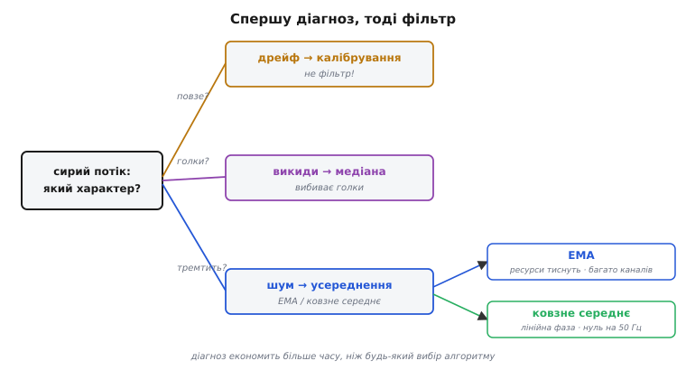
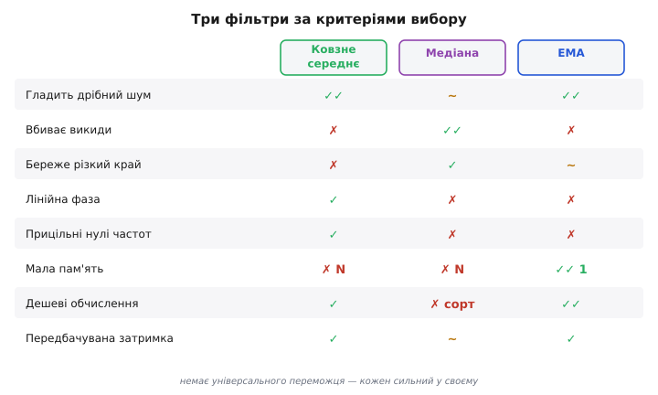
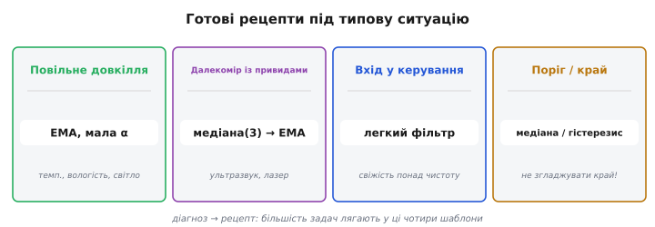
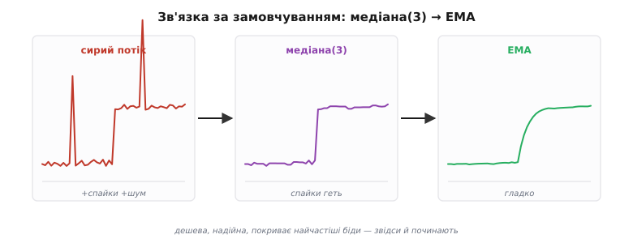
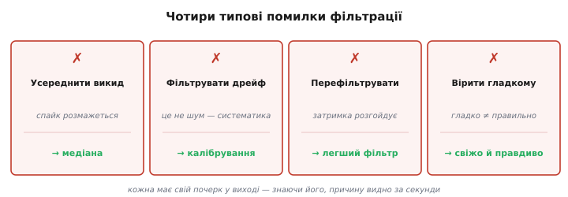
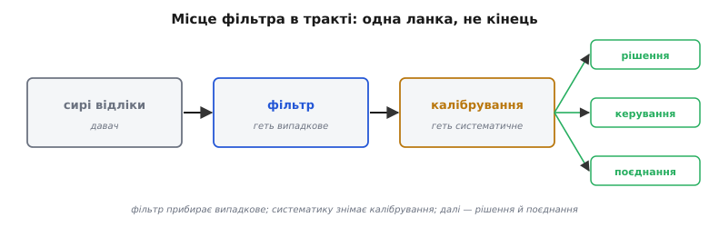

# Вибір фільтра

Три прості часові фільтри — [ковзне середнє](root:com-signal/moving-average), [медіана](root:sf-algorithms/median-filter), [EMA](root:com-signal/ema) — кожен по-своєму давить шум, а [закон затримки](root:com-signal/smoothing-vs-lag) однаково обмежує силу будь-якого з них. Але перед реальним зашумленим потоком постає окреме, суто практичне питання: **який** із них тут узяти? На нього відповідає рамка рішення — спершу **діагноз**, тоді **вибір**, тоді **налаштування**, — плюс кілька готових рецептів на типові випадки й перелік помилок, яких варто уникати. Мета проста: побачивши новий давач, не гадати навмання, а впевнено добирати фільтр під його конкретну брехню.

### Спершу діагноз, тоді фільтр

Найперша й найважливіша порада: **не хапайтеся за фільтр наосліп**. Спочатку назвіть, **яким способом** давач бреше ([рівномірний шум, поодинокі викиди чи повільний дрейф](root:com-signal/signal-noise)), бо від цього прямо залежить вибір. Подивіться на сирий потік: він рівномірно тремтить? зрідка вистрілює дикими значеннями? повільно сповзає вбік?


*З чого починати. Спершу — діагноз: дрейф → калібрування (фільтр безсилий); поодинокі викиди → медіана; рівномірне тремтіння → усереднення (ковзне середнє чи EMA). І лише потім — вибір конкретного усереднювача за ресурсами й вимогами до затримки.*

- **Повільний дрейф** — це **не** задача для фільтра: жоден згладжувач не прибере систематичне сповзання. Лікуйте його [**калібруванням** і компенсацією](root:hw-sensing/calibration), а не фільтром.
- **Поодинокі викиди** (спайки, привиди, збої) — ставте [**медіану**](root:sf-algorithms/median-filter): вона їх викидає, усереднення лише розмаже.
- **Рівномірне тремтіння** — беріть **усереднення**: ковзне середнє або EMA.

Цей крок діагнозу економить більше часу, ніж будь-який вибір алгоритму: половина невдач із фільтрами — це коли усереднюють викиди, фільтрують дрейф чи борються з шумом, якого нема.

Як власне діагностувати? Найпряміше — **подивитися на сирий потік** очима чи графіком, перш ніж щось фільтрувати. Рівне «волохате» тремтіння навколо лінії — це шум для усереднення; поодинокі різкі «голки», що вистрілюють із потоку, — викиди для медіани; повільний нахил усього потоку за хвилини — дрейф для калібрування. Сумніваєтесь між шумом і викидами — гляньте на **гістограму** значень: симетричний дзвін — шум, а окремі далекі «хвости» — викиди. Цей п'ятихвилинний погляд на дані рятує від годин боротьби не з тією бідою; досвідчені інженери завжди дивляться на сирий сигнал **до** того, як писати фільтр.

### Три фільтри поряд: таблиця вибору

Коли діагноз вказав на усереднення (а часто й на медіану перед ним), допомагає звести всі три фільтри в одну таблицю — за тим, що кожен **уміє** й **коштує**.


*Три фільтри за критеріями. Ковзне середнє: гладить шум, лінійна фаза, прицільні нулі частот — але буфер на N значень і розмазує викиди. Медіана: вбиває викиди й береже краї — але дорожча (сортування) і слабша проти дрібного шуму. EMA: найдешевша (одна змінна) — але без захисту від викидів і без нулів частот. Кожен сильний у своєму.*

Коротко: **ковзне середнє** беруть, коли важлива передбачувана затримка, лінійна фаза чи гасіння конкретної частоти (мережевий гул); **медіану** — проти викидів і для збереження різких країв; **EMA** (англ. *exponential moving average* — експоненційно зважене ковзне середнє) — коли тиснуть пам'ять і такти й треба просто дешево згладити.

Головне, що видно з таблиці, — **немає універсального переможця**. Кожен фільтр у чомусь найкращий і в чомусь найгірший: EMA виграє ціною, але програє проти викидів; медіана виграє проти спайків, але програє ціною й проти дрібного шуму; ковзне середнє виграє передбачуваністю, але програє пам'яттю. Тому «найкращий фільтр» — питання без відповіді поза контекстом; правильне питання — «найкращий **для цієї** задачі», а таблиця лише допомагає швидко зіставити сильні й слабкі боки кожного з тим, що вам справді потрібно.

Коли ж діагноз — саме рівномірне тремтіння й вибір звузився до двох усереднювачів, лишається останнє питання: чи тиснуть ресурси й чи потрібна особлива форма затримки? Якщо мікроконтролер і так ледь дихає або каналів-давачів десятки — беріть **EMA**: одна змінна стану на канал, кілька дій на крок. Якщо ж треба передбачувана, однаково-стала для всіх частот затримка (щоб синхронно зіставляти кілька каналів) або прицільний нуль на конкретній частоті (50 Гц мережі) — тоді **ковзне середнє**, бо лінійна фаза й керовані нулі є лише в нього. У більшості ж буденних задач EMA виграє просто дешевизною, тож за замовчуванням схиляйтесь до неї.

### Готові рецепти

Більшість реальних задач лягають у кілька шаблонів — ось перевірені часом зв'язки.


*Рецепти під ситуацію. Повільний давач довкілля (температура, вологість) → EMA з малою α. Далекомір із привидами → медіана(3) проти спайків, далі EMA для гладкості. Вхід у керування (IMU) → легкий фільтр, свіжість понад чистоту. Поріг / детектор краю → медіана (береже край) або гістерезис без згладжування.*

- **Повільний давач довкілля** (температура, вологість, освітленість): величина повзе секундами, затримка байдужа — досить **EMA з малою α** (чи широкого середнього). Дешево й гладко.
- **Далекомір із викидами** (ультразвук, лазер): зрідка привид-метр серед чесних показів — **медіана(3) проти спайків**, потім **EMA** для гладкості. Класична стійка зв'язка.
- **Вхід у контур керування** (кут із [IMU](root:hw-sensing/imu) для стабілізації): тут **свіжість понад чистоту** — легкий фільтр (мала медіана від спайків + легка EMA), щоб не [зруйнувати стійкість затримкою](root:com-signal/smoothing-vs-lag).
- **Поріг чи виявлення краю**: згладжування тут шкідливе (розмиє край) — або **медіана** (береже край), або взагалі без фільтра, з [**гістерезисом**](root:hw-analog/schmitt-trigger) (грец. *hysteresis* — відставання) проти брязкоту порога.

**Тракт для далекоміра.** Ультразвук опитують 20 разів за секунду, зрідка дає привиди, плюс дрібний шум ±1 см. Зберемо стійку зв'язку: медіана(3) вибиває привид, а EMA з α=0.3 згладжує залишок. Уся обробка — кілька дій на відлік, стан — буфер на 3 значення й одна змінна EMA:

```c
#include <stdint.h>

// медіана трьох останніх відліків (вбиває поодинокий спайк)
static float median3(float a, float b, float c) {
    float hi = a > b ? a : b;
    float lo = a > b ? b : a;       // lo ≤ hi
    if (c > hi) return hi;          // c найбільше → середнє = hi
    if (c < lo) return lo;          // c найменше → середнє = lo
    return c;                       // c між ними → середнє = c
}

float range_filter(float raw) {
    static float w0 = 0, w1 = 0, w2 = 0;   // вікно з 3 сирих відліків
    static float ema = 0;                  // стан EMA
    static int   primed = 0;               // чи заповнене вікно й EMA

    w2 = w1; w1 = w0; w0 = raw;            // зсунути вікно, новий — у w0
    float m = median3(w0, w1, w2);

    if (!primed) { ema = m; primed = 1; }  // перший відлік: без стрибка від нуля
    else         { ema += 0.3f * (m - ema); }   // EMA: новий = старий + α·(вхід − старий)
    return ema;
}
```

Затримку зв'язки складають дві ланки. Медіана(3) затримує приблизно на один відлік (їй треба побачити сусідів спайка). EMA з α=0.3 має сталу часу близько `τ = −1/ln(1−α)` відліків:

```
τ = −1 / ln(1 − 0.3) = −1 / ln(0.7) ≈ 2.8 відліку
повна затримка ≈ 1 + 2.8 ≈ 3.8 відліку
при 20 Гц (крок 0.05 с):  3.8 × 0.05 ≈ 0.19 с
```

Близько п'ятої секунди затримки — цілком прийнятно для об'їзду перешкоди, а на виході вже потік без диких стрибків і без дрібного тремтіння, придатний для рішень.

**Давач довкілля.** Кімнатний термометр опитують раз на секунду, шум ±0.2 °C, реальна температура повзе градусами за хвилини. Затримка в секунди тут нікого не турбує, викидів катма — отже, без медіани, лише **EMA з малою α** (скажімо, 0.1): вона згладить дрібне тремтіння до сотих градуса, а на повільний хід температури майже не вплине. Один рядок коду, одна змінна в пам'яті — і рівний показ, що не сіпається в останній цифрі дисплея:

```c
float smooth_temp(float raw) {
    static float ema = 0;
    static int primed = 0;
    if (!primed) { ema = raw; primed = 1; }
    else         { ema += 0.1f * (raw - ema); }
    return ema;
}
```

Два рецепти варті окремого слова. **IMU для стабілізації**: тут затримка — ворог номер один, бо вона прямо [їсть запас стійкості контуру](root:com-signal/smoothing-vs-lag). Тому фільтр тримають **легким** — хіба медіана(3) проти рідких збоїв шини плюс зовсім легка EMA, — а основне згладжування лишають розумнішим [оцінювачам](root:com-signal/kalman-filter), що не платять за чистоту затримкою. **Поріг чи край**: тут згладжування прямо шкодить — розмиває саме той різкий перехід, який ви ловите. Краще медіана (вона край береже) або взагалі сирий сигнал із [**гістерезисом**](root:hw-analog/schmitt-trigger): два пороги замість одного, щоб поодинокий шум не смикав вихід туди-сюди на самій межі спрацювання.

> 🔧 **Навіщо це.** Починайте з **найпростішого**, що може спрацювати (часто це EMA чи медіана+EMA), і **перевіряйте** фільтр, а не вгадуйте: подайте на вхід штучну різку зміну (крок) і гляньте, за скільки відліків вихід її наздогнав і чи чистий він далі. До складнішого переходьте, лише коли просте довело свою недостатність на **реальних** даних. Передчасне ускладнення фільтра — теж помилка, лише протилежна перефільтруванню.

### Стійкий стандарт: медіана + EMA

Якщо забути всі тонкощі й лишити **одну** пораду на випадок «не знаю, з чого почати», то це зв'язка **мала медіана + EMA**. Медіана(3) задешево вибиває поодинокі дикі значення; EMA задешево згладжує решту. Разом вони покривають **обидві** найчастіші біди давача — і спайки, і тремтіння — за мізерну пам'ять (буфер на 3 + одна змінна) і кілька дій на крок.

Чому саме медіана **трьох**, а не ширша? Бо трійка — найдешевша медіана (три значення, майже без затримки), а проти **поодиноких** викидів — а вони найчастіші — її цілком досить: вона переживає один спайк у вікні без шкоди. Ширшу медіану (5, 7) беруть, лише якщо викиди йдуть **пачками** по два-три поспіль. А коефіцієнт α в наступній EMA підбирають уже [за компромісом «гладкість проти затримки»](root:com-signal/smoothing-vs-lag) — під рівень залишкового шуму й допустиму затримку, починаючи з чогось на кшталт 0.2–0.3 і підправляючи на око по графіку.

І ще: ставити фільтри **каскадом** — не хитрість і не надмірність, а норма. Медіана й EMA роблять різну роботу (одна — проти викидів, друга — проти дрібного шуму), тож їхня послідовність — не дублювання, а поділ праці. Головне — не множити ланки без потреби: кожен зайвий ступінь додає і затримку, і код, тож у каскаді лишають рівно стільки, скільки **різних** бід треба прибрати, — а це зазвичай якраз дві.


*Зв'язка за замовчуванням. Сирий потік → медіана(3) (викидає спайки, береже край) → EMA (дешево гладить залишковий шум) → чистий, придатний для рішень сигнал. Дешева, надійна, покриває найчастіші випадки — звідси й починають, коли немає підстав для іншого.*

> 🔧 **Навіщо це.** Коли невідомо, з чого почати, — **медіана(3) плюс EMA**. Це найдешевша зв'язка, що захищає і від викидів, і від тремтіння; вона рідко буває гіршим вибором і майже завжди — досить добрим. Починайте з неї, а до чогось складнішого переходьте, **лише** коли вона довела, що не справляється, а не наперед.

### Чого НЕ робити

Помилки тут повторювані, тож варто знати їх в обличчя.


*Чотири типові помилки. Усереднити викиди (треба медіана). Фільтрувати дрейф (треба калібрування). Перефільтрувати контур керування (втрата стійкості). Повірити гладкому виходу (він може бути запізнілим чи зміщеним). Кожна — пастка, у яку легко впасти «з найкращих міркувань».*

- **Усереднювати викиди.** Спайк [у середньому розмазується на ціле вікно](root:com-signal/moving-average) — проти нього медіана, не середнє.
- **Фільтрувати дрейф.** Систематичне сповзання — не шум; жоден згладжувач його не прибере, потрібне [калібрування](root:hw-sensing/calibration).
- **Перефільтровувати керування.** [Завелика затримка розгойдує контур](root:com-signal/smoothing-vs-lag); у керуванні свіжість важливіша за чистоту.
- **Вірити гладкому виходу.** Гладка лінія оманлива: вона може бути й запізнілою, і зміщеною (фільтр не прибирає систематику). Гладко ≠ правильно.

Кожна з цих помилок має свій характерний почерк, за яким її впізнають у налагодженні. Усереднені викиди дають **повторювані горбики однакової ширини** у виході — слід кожного спайка, [розмазаний на ширину вікна](root:com-signal/moving-average). Спроба «відфільтрувати» дрейф закінчується тим, що показ усе одно повзе, лише плавніше. Перефільтрований контур керування **розгойдується** або мляво проскакує ціль. А надмірно згладжений сигнал виглядає бездоганно — аж поки не порівняти його з реальністю в момент швидкої зміни, де він ганебно **відстає**. Знаючи ці почерки наперед, причину знаходять за секунди, а не за вечір сліпого налагодження.

> 🔧 **Навіщо це.** Спокуса «згладити сильніше, щоб виглядало краще» — найчастіша пастка новачка. Гарний на екрані вихід часто означає лише велику затримку, а не точність. Завжди питайте не «наскільки гладко?», а «наскільки **свіжо й правдиво**?» — і добирайте найслабший фільтр, що дає прийнятний результат.

### Фільтр — лише одна ланка

Наостанок — місце фільтрації в загальній картині. Очищений сигнал — це **ще не** правда: фільтр прибрав випадкове, але систематику (зсув, нелінійність) усе одно знімає [калібрування](root:hw-sensing/calibration), а далі число йде в рішення, у керування, у [поєднання з іншими давачами](root:com-signal/sensor-fusion). Фільтр — одна ланка [тракту обробки сигналу давача](root:hw-sensing/what-is-a-sensor), а не його кінець.

Є й тонкість про **порядок** ланок. Фільтрувати зазвичай краще **до** нелінійного калібрування, поки сигнал ще «сирий» і шкала рівномірна, — бо нелінійна крива калібрування по-різному розтягнула б шум у різних точках діапазону. А **медіану** ставлять найпершою, ще до будь-якого усереднення, щоб викид не встиг розмазатися по сусідах. Загальний потік виходить такий: сирі відліки → медіана (геть викиди) → усереднення (геть шум) → калібрування (геть систематику) → величина в рішення. І вже **очищену й відкалібровану** величину [поєднують із іншими давачами](root:com-signal/sensor-fusion), де кожному вірять рівно за його надійністю.

Варто й нагадати важливу межу: фільтр **не додає** інформації — він лише розумно розпоряджається тією, що вже є у відліках. Тому жодна, навіть найхитріша, зв'язка фільтрів не витягне сигналу, якого в даних просто немає (надто рідка вибірка, надто слабкий проти шуму давач). Коли впираєтесь у цю стелю, відповідь не в складнішому фільтрі, а в **кращих даних**: частіша вибірка, [тихіший аналоговий тракт](root:hw-sensing/sensor-input-matching), точніший давач чи додатковий давач для поєднання. Фільтр — це останній штрих над добрими даними, а не порятунок для поганих.


*Де стоїть фільтр. Сирий потік → фільтр (прибирає випадкове) → калібрування (прибирає систематичне) → величина в рішення, керування, поєднання. Часові фільтри — робочі конячки; коли їх бракує (сигнал і шум перекриваються в часі), переходять у частотну область.*

Уся рамка вибору зводиться в одне речення: **діагностуй шум, обери найпростіший фільтр під нього, налаштуй на межі затримки, перевір на реальних даних**. Дрейф — калібруй, викиди — відсівай медіаною, тремтіння — усереднюй (EMA, як тиснуть ресурси), і ніколи не забувай, що за чистоту платиш свіжістю. Це не сотня окремих рецептів, а одна послідовність думки, що працює майже завжди; конкретику в неї вкладають форма фільтрів, їхня ціна й закон затримки.

І остання думка про межу цих інструментів. Три прості фільтри плюс закон затримки покривають чи не дев'ять десятих практичної фільтрації на мікроконтролері. Та всі вони — **часові**: працюють із відліками в часі. Коли ж сигнал і шум перекриваються в часі, але **розрізняються за частотою**, потрібен інший погляд — розкласти сигнал на частоти й різати в **частотній** області. Саме [мова частот](root:math-analysis/fourier-idea) (за нею стоять інтуїції на кшталт «повільне — корисне, швидке — сміття», «нулі на 50 Гц», «фільтр низьких частот») і пояснює, **чому** фільтри працюють, та відкриває цілий новий клас інструментів. Вона дає те, чого часові фільтри в принципі не вміють: **розділити** два накладені в часі сигнали, якщо вони сидять на різних частотах, і **спроєктувати** фільтр точно під задану смугу — не на око, а за специфікацією.
