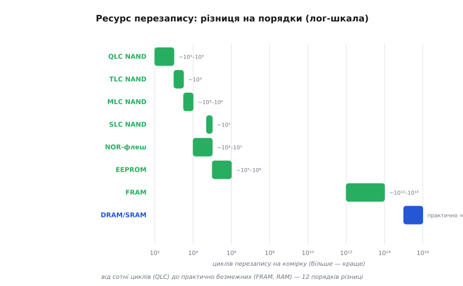
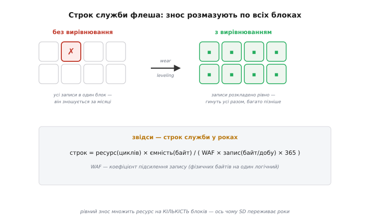
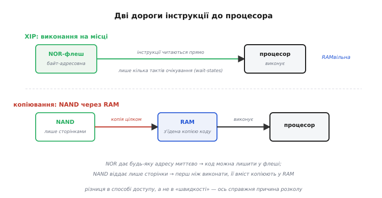

# Вибір пам'яті: від дерева до чисел

У [базовому кроці](root:embedded/choosing-memory) ми звели вибір пам'яті до короткої процедури: перше питання «робоче чи сховище?» ділить усе надвоє, дерево доводить до класу чіпа, а п'ять осей (обсяг, швидкість, ресурс, енергія, ціна) роблять остаточний вибір усередині класу. Цього досить, щоб не помилитися грубо. Але щойно проєкт стає серйозним, кожна з п'яти осей перестає бути гаслом і перетворюється на **число з розмірністю**, яке треба порахувати й порівняти з вимогою. Скільки саме років проживе SD-картка під вашим потоком журналу? Чи встигне QSPI-флеш годувати процесор інструкціями на потрібній частоті, чи він захлинеться в очікуванні? Скільки міліватів з'їдає DRAM на саму лише регенерацію, поки пристрій нібито спить? За якого місячного трафіку EEPROM дешевше замінити на дорожчий FRAM?

Ця детальна версія бере ту саму п'ятірку осей і **розкриває механіку під кожною**: звідки береться формула, які там граничні умови, де інтуїтивне дерево несподівано **згинається** — і як тоді рахувати. Ми не повторюватимемо, що таке леткість чи навіщо код тягне до NOR (це є в базовій); натомість виведемо строк служби флеша з фізики зносу, порахуємо смугу пропускання XIP такт за тактом, зважимо енергію регенерації DRAM у джоулях і побачимо, чому «яку пам'ять обрати» — це майже завжди задача **оптимізації під обмеження**, а не вибір із каталогу.

Порядок буде такий: спершу зробимо кожну вісь **вимірною** — дамо їй розмірність і спосіб порахувати. Тоді пройдемо три осі, у яких найбільше глибини й найбільше пасток — **ресурс**, **швидкість XIP** та **енергію регенерації**, — з повним виведенням і worked-прикладами. Далі глянемо, **де дерево згинається** (проміжні випадки, яких у простій схемі немає). І нарешті зберемо все в один наскрізний розрахунок реального пристрою — уже не на гаслах, а на числах із роками, мегабайтами й міліватами.

### П'ять осей стають вимірними

Щоб осями можна було **рахувати**, кожна мусить мати розмірність і спосіб оцінки. Перепишемо базову п'ятірку вже як інженерні величини — і одразу побачимо, що всі вони зводяться до кількох формул.

**Обсяг** — байти, і тут хитрість не в самому числі, а в **двох різних бюджетах**, які легко сплутати. Робочі дані (RAM) — це пік одночасно живих байтів: найбільший буфер плюс стек плюс купа плюс глобальні змінні в найгіршій точці програми. Сховище (флеш) — це сума всього, що має пережити вимкнення, плюс запас на ріст журналу. Ці два бюджети рахують **окремо** й окремими одиницями: RAM у кілобайтах «пікового одночасного», флеш у мегабайтах «накопиченого». Плутанина між ними — найчастіша помилка новачка: він бачить «256 КБ» у даташиті й не питає, це RAM чи флеш, хоча то дві геть різні цифри з різних бюджетів. (Як саме зводять ці два бюджети для конкретного мікроконтролера — окрема тема [бюджету пам'яті МК](root:embedded/memory-budget-mcu); тут нам важливо лише, що вони роздільні.)

**Швидкість** розпадається на дві незалежні величини, які теж плутають: **латентність** (скільки наносекунд від запиту адреси до першого байта) і **смуга** (скільки мегабайтів за секунду в усталеному потоці). Для XIP критична **латентність випадкового доступу** — процесор стрибає по адресах непередбачувано, і кожен стрибок платить повну затримку. Для потокового читання файлу критична **смуга** — латентність першого байта розмазується по мегабайтах. Пам'яті різняться тим, **яку** з двох цифр вони дають дешево: SRAM — обидві блискучі; DRAM — чудова смуга, але латентність псується на випадкових адресах через відкривання рядків; NAND — пристойна смуга, жахлива латентність; NOR/QSPI — помірна латентність, помірна смуга. Ми виведемо обидві цифри нижче.

**Ресурс** — кількість циклів «стерти-записати» до відмови комірки, і саме тут пам'яті різняться на **дванадцять порядків**. Це вісь, де груба інтуїція найчастіше підводить, бо різниця між «10⁴» та «10¹⁴» на слух здається просто «багато проти дуже багато», а насправді це різниця між «помре за півроку» та «переживе ваших онуків». Ресурс завжди йде в парі з двома множниками — **рівномірністю зносу** (wear leveling) і **підсиленням запису** (write amplification), — без яких сира цифра циклів нічого не означає. Строк служби ми виведемо повною формулою.

**Енергія** — це насправді **три різні енергії**, і плутати їх — значить неправильно оцінити час роботи від батареї. Є енергія **спокою** (скільки тече, коли до пам'яті не звертаються): у флеша й EEPROM вона мізерна, а от DRAM постійно палить струм на регенерацію навіть у простої. Є енергія **читання** (за операцію) і енергія **запису** (за операцію): у флеша запис коштує на порядки дорожче за читання, бо треба проштовхувати заряд крізь ізолятор, а от FRAM пише майже задарма. Для пристрою на батареї домінує та енергія, якої найбільше **за профілем використання**: датчик, що спить і зрідка пише, боїться енергії спокою (тому не любить DRAM); логер, що безперервно строчить, боїться енергії запису (тому FRAM б'є флеш).

**Ціна** — не одна цифра, а **дві**: ціна за біт (домінує на великих обсягах — гігабайтах) і ціна за корпус плюс за місце на платі плюс за складність розведення (домінує на малих обсягах). SRAM програє за біт, але для 4 КБ це неважливо; NAND виграє за біт, але тягне за собою контролер, ECC і файлову систему — приховану ціну, що не стоїть у прайсі чіпа. Справжня вартість — це **сукупна вартість володіння** (ціна чіпа + плата + код підтримки + ризик відмови в полі), і саме вона іноді перевертає вибір, який за самим прайсом здавався очевидним.

Звівши осі до величин, помічаємо головне: вони **не незалежні**. Ресурс тягне за собою енергію запису (обидва ростуть з фізики проштовхування заряду), латентність тягне ціну (швидка SRAM дорога), обсяг тягне ціну за біт. Тому вибір — це не «максимізувати кожну вісь», а **знайти єдину точку**, що вкладається в усі п'ять обмежень водночас. Далі беремо три найглибші осі по черзі й перетворюємо кожну на робочу формулу.

### Ресурс: виводимо строк служби

Почнімо з осі, де інтуїція найслабша, а помилка найдорожча. Питання «скільки років проживе ця флеш-пам'ять під моїм навантаженням?» має точну відповідь — але тільки якщо чесно врахувати три речі: **сирий ресурс комірки**, **як записи розкладено по чипу** й **у скільки разів фізичних записів більше за логічні**.

Сирий ресурс — це де фізика найбезжальніша. Флеш-комірка зберігає біт **зарядом на плаваючому затворі** (ізольованому острівці всередині транзистора); щоб записати, заряд проштовхують крізь тонкий ізолятор тунелюванням, і щоразу цей ізолятор трохи псується — у ньому застрягають окремі електрони, поріг транзистора повзе, аж поки комірку вже не відрізнити «0» від «1». Це знос **фізичний і незворотний**, і що дрібніша комірка та що більше рівнів заряду в ній розрізняють, то менше циклів вона витримує. (Механіку самого плаваючого затвора ми розбирали у [фізиці комірок](root:embedded/memory-cell-physics); тут беремо її як дане й рахуємо наслідки.) Звідси й драбина ресурсу за типом комірки:


*Ресурс перезапису на логарифмічній шкалі — різниця між типами сягає дванадцяти порядків. **QLC NAND** (чотири біти на комірку) витримує лише сотні-тисячу циклів; **TLC** — тисячі; **MLC** — тисячі-десятки тисяч; **SLC** (один біт на комірку) — близько сотні тисяч. **NOR** — десятки-сотні тисяч; **EEPROM** — сотні тисяч-мільйон; **FRAM** — 10¹²–10¹⁴ (практично без межі); **DRAM і SRAM** переписуються безмежно. Ключове: перехід від одного біта на комірку до чотирьох роняє ресурс на два порядки — щільність купують ціною зносу.*

Придивімося, **чому** щільність так дорого коштує ресурсу — це і є та фізика, яку базова версія лише назвала. У SLC комірці два стани: «заряджено» й «ні». Між ними велика прірва за напругою порога, тож навіть коли знос зсуне поріг, розрізнити два стани легко. У QLC ту саму шкалу заряду ділять на **шістнадцять** рівнів (чотири біти), і сусідні рівні тепер відділяє крихітний проміжок напруги. Найменший знос — кілька застряглих електронів — уже зсуває поріг за межу сусіднього рівня, і біт читається неправильно. Тому та сама фізична деградація ізолятора вбиває QLC у сотні разів швидше, ніж SLC: не тому, що QLC-ізолятор гірший, а тому, що QLC **менш терпима** до однакового зсуву. Це прямий компроміс: кожен доданий біт на комірку подвоює щільність (і вдвічі здешевлює за біт), але роняє ресурс приблизно на порядок. Ось чому дешеві масові накопичувачі — QLC/TLC, а промислові, де важить надійність, — MLC/SLC.

Але сира цифра циклів **на комірку** ще не строк служби пристрою. Тут вступає перший множник — **рівномірність зносу**.

**Рівномірний знос (wear leveling).** Уявіть наївну систему: вона щоразу пише лічильник в один і той самий блок флеша. Нехай блок витримує 10⁴ стирань, а ви пишете лічильник раз на хвилину. Тоді 10⁴ ÷ (60 × 24) ≈ **сім днів** — і блок мертвий, хоча решта чипа незаймана. Катастрофа не в ресурсі чипа, а в тому, що весь знос упав на одну комірку. Виправлення просте й геніальне: **розкладати записи по всіх блоках рівно**, щоб жоден не зношувався швидше за інші. Контролер (усередині SD, eMMC, SSD) або файлова система (у сирій NAND/NOR) веде таблицю й щоразу пише в **найменш зношений** блок, а старі дані переносить. Тоді ресурс множиться на **кількість блоків**: ті самі 10⁴ циклів, розмазані по, скажімо, мільйону блоків, дають 10¹⁰ записів лічильника до відмови чипа — уже не тиждень, а тисячоліття.


*Зліва — без вирівнювання: усі записи б'ють один блок, він зношується за місяці, решта чипа марна. Справа — з вирівнюванням: записи розкладено по всіх блоках, вони зношуються разом і набагато пізніше. Знизу — формула, що з цього випливає: строк служби = (ресурс циклів × ємність) ÷ (WAF × запис за добу × 365). Рівний знос множить сирий ресурс комірки на кількість блоків — саме тому SD-картка під журналом переживає роки, а не тижні.*

Другий множник тягне в протилежний бік — це **підсилення запису** (write amplification, WAF): скільки **фізичних** байтів флеш стирає-записує на кожен **логічний** байт, який попросив ваш код. WAF майже завжди більший за одиницю, і ось чому. Флеш стирає тільки **цілими блоками** (десятки-сотні кілобайтів), а пише сторінками. Хочете змінити 4 байти лічильника всередині зайнятого блоку — контролер мусить: вичитати весь блок, поправити 4 байти в копії, стерти цілий блок, записати його назад. Чотири логічні байти коштували стирання й перезапису, скажімо, 128 КБ — WAF тут **32768**. У добре зробленій файловій системі з журналюванням і резервом вільних блоків WAF набагато нижчий (типово 1.5–4 на розумному навантаженні), але **ніколи не одиниця**, і на дрібних частих записах він вибухає. Саме тому дрібні часті уставки — вбивця флеша: не сумарний обсяг даних, а **WAF на кожній дрібній операції**.

Тепер зберемо все в одну формулу строку служби. Флеш живе, поки не вичерпано сумарний ресурс усіх комірок; кожен логічний запис витрачає WAF фізичних байтів; рівний знос гарантує, що витрата розмазана рівно. Звідси:

```
                 ресурс(циклів) × ємність(байт)
строк(років) = ──────────────────────────────────────
                WAF × запис(байт/добу) × 365
```

Чисельник — це **повний бюджет фізичних записів** чипа: скільки байтів можна записати за все життя, якщо знос ідеально рівний (кожен байт ємності витримує «ресурс» перезаписів). Знаменник — **річна витрата** цього бюджету з поправкою на підсилення. Формула проста, але з неї видно всі важелі одразу: побільшити ресурс (SLC замість QLC), побільшити ємність (більша картка зношується повільніше — той самий трафік розмазано на більше комірок!), збити WAF (писати більшими блоками, вирівняно) або зменшити сам трафік.

**Приклад (скільки проживе SD-картка під журналом реєстратора).** Пристрій пише журнал вимірів: 200 байтів раз на секунду, цілу добу. Картка — 8 ГБ TLC (ресурс ~3000 циклів на блок), файлова система дає WAF ≈ 3. Порахуймо строк.

```c
// Дані задачі
const double capacity   = 8.0e9;    // 8 ГБ ємності
const double endurance  = 3000.0;   // TLC: ~3000 циклів на блок
const double waf        = 3.0;      // підсилення запису файлової системи
const double rec_bytes  = 200.0;    // байтів на запис
const double rec_per_s  = 1.0;      // записів за секунду

// Логічний запис за добу
double per_day = rec_bytes * rec_per_s * 86400.0;   // = 17 280 000 байт/добу ≈ 17.3 МБ

// Строк служби
double years = (endurance * capacity) / (waf * per_day * 365.0);
//   = (3000 × 8e9) / (3 × 1.728e7 × 365)
//   = 2.4e13 / 1.893e10
//   ≈ 1268 років
```

**Висновок.** Понад тисяча років — картка переживе пристрій багатократно; ресурс тут **не обмеження**. Але придивімося, які важелі це дали. Головний внесок — **ємність**: 8 ГБ розмазують скромний трафік на океан комірок. Зменшіть картку до 128 МБ (у 64 рази менше) — і строк упаде до ~20 років, усе ще прийнятно. А тепер зробімо навантаження злим: писати не 200 байтів раз на секунду, а **лічильник напрацювання (4 байти) сто разів на секунду** на ту саму картку. Логічний трафік — лише 4 × 100 × 86400 ≈ 34.6 МБ/добу, вдвічі більше за журнал. Але кожен дрібний запис лічильника всередині блоку роздуває WAF: замість 3 стає, скажімо, **500** (бо 4 байти тягнуть перезапис цілого блоку). Тоді:

```c
double waf_counter = 500.0;                          // дрібний запис у зайнятий блок
double per_day_c   = 4.0 * 100.0 * 86400.0;          // ≈ 3.46e7 байт/добу
double years_c = (3000.0 * 8.0e9) / (waf_counter * per_day_c * 365.0);
//   = 2.4e13 / (500 × 3.46e7 × 365)
//   = 2.4e13 / 6.31e12
//   ≈ 3.8 року
```

Той самий чип, майже той самий логічний обсяг — а строк упав з тисячоліття до **менш ніж чотирьох років**, і винен виключно WAF дрібних записів. Ось математичний доказ правила, яке базова версія дала на інтуїції: лічильник, що тикає сто разів на секунду, вбиває флеш — не обсягом даних, а підсиленням. Для нього беруть [FRAM](root:embedded/eeprom-fram) з побайтовим записом (WAF = 1) і ресурсом 10¹⁴: та сама сотня записів за секунду дала б 100 × 86400 × 365 ≈ 3.15×10⁹ циклів на рік, тобто FRAM переживе ~30000 років — межі просто немає.

> 🔧 **Навіщо це.** Перш ніж ставити флеш під дані, що часто змінюються, **порахуйте строк за формулою** — це п'ять хвилин, які рятують від відкликання партії з поля. Три важелі у ваших руках: беріть картку/чип **з запасом ємності** (це множить ресурс задарма), тримайте WAF низьким (пишіть більшими вирівняними блоками, не дрібними байтами в зайняті сектори) і виносьте часті дрібні записи на FRAM. Якщо формула дає менше ніж 3–5 запасів очікуваного строку служби пристрою — вибір пам'яті помилковий, і виправити його на етапі схеми копійчано, а в полі — руйнівно дорого.

Гранична умова, яку варто тримати в голові: усе це справедливо, лише **поки знос рівний**. Сира NAND без файлової системи з вирівнюванням (або з дешевою FS, що пише таблицю розміщення в одне й те саме місце) втрачає множник «кількість блоків» і гине по найгарячішому блоку — тоді дільте розрахунковий строк на десятки-сотні. Тому, обираючи NAND, ви фактично обираєте **ще й якість FTL/файлової системи** над нею; це прихована частина вибору, якої немає в прайсі чипа.

### Швидкість XIP: рахуємо смугу такт за тактом

Друга вісь, де інтуїція часто хибить, — швидкість під **виконанням коду на місці** (XIP). Базова версія пояснила *чому* код тягне до NOR: процесору потрібне миттєве побайтове випадкове читання, а NAND дає лише сторінки. Тепер порахуймо *скільки саме* — бо між «NOR годиться для XIP» і «цей конкретний QSPI-флеш не встигне годувати мій процесор на 200 МГц» лежить арифметика, яку треба вміти робити.

Спершу різниця латентність-проти-смуги стає буквальною. Процесор виконує код не рівним потоком, а стрибками: лінійна ділянка, тоді перехід (гілка, виклик, повернення) на іншу адресу. На **лінійній** ділянці рятує смуга — інструкції течуть підряд, і флеш може віддавати їх пакетом. На **переході** рятує латентність — процесор запитує нову, непередбачену адресу й **чекає** повної затримки першого байта, поки нічого корисного не робить. Тому «швидкість для XIP» — це насправді дві цифри, і вузьким місцем стає то одна, то інша залежно від того, наскільки код «стрибучий».

Розберімо латентність QSPI-читання **потактово** — саме її процесор платить на кожному промаху кеша інструкцій. Транзакція читання з QSPI-флеша складається з чотирьох фаз, і кожна коштує тактів шини:

```
фаза              тактів (типово)   що відбувається
──────────────────────────────────────────────────────────────
команда           2  (8 біт / 4)    процесор шле код «швидке читання»
адреса            6  (24 біт / 4)   шле 24-бітну адресу по 4 лініях
dummy-такти       6–10              флеш «націлюється» на комірку
дані              2  на 8 біт        нарешті течуть байти (4 біти/такт)
```

Перші три фази — це **чиста латентність**: 2 + 6 + 8 ≈ 16 тактів шини, поки не з'явився жоден корисний байт. На частоті шини QSPI 100 МГц це 16 × 10 нс = **160 нс** до першої інструкції. Якщо процесор іде на 200 МГц (такт 5 нс), ці 160 нс — це **32 такти процесора простою** на кожному стрибку коду. Ось чому голий XIP із зовнішнього QSPI помітно повільніший за виконання з внутрішньої флеші: не смуга замала, а **латентність кожного переходу** з'їдає десятки тактів.

Рятує від цього те саме, що й у великих процесорах, — [кеш](topic:hw-arch/cache) інструкцій перед QSPI. Він ховає латентність двома способами: **лінійне випередження** (поки процесор жує поточну лінію, кеш уже тягне наступну пакетним читанням — фаза даних QSPI віддає байти підряд по 4 біти/такт без нової латентності) і **повторне влучання** (цикл, що крутиться в межах кількох кешованих ліній, узагалі не звертається до флеша). Тому реальний XIP майже завжди — це **QSPI-флеш + кеш**, і питання швидкості зводиться до влучань кеша, а не до сирої латентності флеша. Без кеша XIP на високій частоті нежиттєздатний; з кешем — цілком.


*Дві дороги інструкції. Верхня — **XIP**: процесор читає інструкції прямо з байт-адресовної NOR-флеші, платячи лише кілька тактів очікування на промах, а вся RAM лишається під дані. Нижня — **копіювання**: NAND віддає тільки сторінки й не дає довільної адреси, тож перед виконанням її вміст цілком переписують у RAM (з'їдаючи стільки RAM, скільки важить код), і лише тоді процесор виконує з RAM. Справжня причина розколу — **спосіб доступу** (довільний проти сторінкового), а не абстрактна «швидкість».*

Тепер порахуймо смугу для протилежного випадку — коли з NAND треба **завантажити** прошивку в RAM при старті (той самий «shadowing», що його базова версія згадала одним реченням). Це вже не латентність, а чиста смуга: скільки часу займе копіювання. Нехай прошивка 512 КБ, NAND читає сторінку 4 КБ за ~50 мкс (разом із пересиланням по шині):

```c
const double fw_size   = 512.0 * 1024.0;    // 512 КБ прошивки
const double page_size = 4.0 * 1024.0;      // сторінка NAND 4 КБ
const double page_us   = 50.0;              // мкс на читання+пересилання сторінки

double pages   = fw_size / page_size;              // = 128 сторінок
double boot_ms = pages * page_us / 1000.0;         // = 128 × 50 / 1000 = 6.4 мс
```

**Висновок.** 6.4 мс на копіювання прошивки — це затримка старту, яку XIP-система з NOR **не платить узагалі** (вона стартує з першої ж інструкції у флеші). Плюс копія з'їдає 512 КБ RAM. Для пристрою, що має ожити миттєво (медичний монітор, автомобільний блок), ці 6.4 мс і з'їдена RAM — вагомий аргумент за NOR/XIP навіть при вищій ціні за біт. Для пристрою, де старт раз на місяць і RAM надлишок (одноплатний комп'ютер з гігабайтами DDR), 6.4 мс невидимі, і дешева ємна NAND виграє. Ось як одна цифра (час старту) схиляє вибір у різні боки залежно від вимоги.

Гранична умова XIP, про яку варто знати: **не всякий зовнішній флеш можна відобразити в адресний простір**. Для memory-mapped XIP процесор мусить мати контролер QSPI з режимом відображення (він сам генерує команду-адресу-dummy при кожному зверненні ядра до «флеш-адреси»). Якщо такого блоку в мікроконтролері немає, XIP із зовнішнього флеша неможливий у принципі — лишається тільки копіювати в RAM. Тому «можна виконувати код з цього чипа» — це властивість **пари** «флеш + контролер процесора», а не самого флеша; перевіряйте обидва боки, коли закладаєте XIP.

### Енергія регенерації: чому батарея не любить DRAM

Третя глибока вісь — енергія, і найкаверзніша її частина та, що базова версія назвала одним словом «регенерація». DRAM зберігає біт **зарядом на крихітному конденсаторі**, а конденсатор **тече** — заряд стікає за мілісекунди. Щоб дані не пропали, вміст треба **безперервно перечитувати й записувати назад** (регенерація, refresh), і робиться це навіть коли пристрій нічого не робить. Ось чому DRAM — єдина пам'ять, що палить енергію в **повному спокої**, і саме це робить її отрутою для живлення від батареї. Порахуймо, наскільки.

JEDEC (орган стандартів пам'яті) задає ритм регенерації двома числами: **вікно регенерації** tREFW = 64 мс (за цей час треба освіжити **весь** масив, інакше найслабші комірки втратять заряд) і **інтервал** tREFI = 7.8 мкс (середній проміжок між командами регенерації). Ділення дає кількість освіжень за вікно:

```
64 мс / 7.8 мкс = 8192 команди регенерації в кожному 64-мс вікні
```

Тобто чип **8192 рази на кожні 64 мс** — понад сто тисяч разів на секунду — прокидається, читає групу рядків і записує їх назад, **незалежно від того, чи потрібні комусь ці дані**. Кожна така команда будить підсилювачі зчитування по всьому кристалу й качає заряд — це десятки міліампер сплесками. Усереднений струм самої лише регенрації (self-refresh) у типової SDRAM — одиниці міліампер; у ширшої DDR — більше. Прикинемо енергетичну ціну для пристрою на батареї:

**Приклад (що коштує DRAM у сплячому датчику на батареї).** Порівняймо два варіанти буфера: зовнішня SDRAM проти внутрішньої SRAM, пристрій 99% часу спить.

```c
// SDRAM у саморегенерації: усереднений струм ~2 мА, живлення 3.3 В
double p_dram_sleep = 2.0e-3 * 3.3;          // = 6.6 мВт постійно, навіть у сні

// SRAM у режимі утримання: струм витоку ~2 мкА
double p_sram_sleep = 2.0e-6 * 3.3;          // = 6.6 мкВт — у ТИСЯЧУ разів менше

// Батарея CR2032, ~225 мА·год ≈ 0.225 А·год × 3.3 В × 3600 с/год
double batt_j = 0.225 * 3.3 * 3600.0;        // ≈ 2673 Дж запасу

// Скільки протримає лише на струмі спокою пам'яті
double days_dram = batt_j / p_dram_sleep / 86400.0;   // ≈ 4.7 доби
double days_sram = batt_j / p_sram_sleep / 86400.0;    // ≈ 4688 діб ≈ 12.8 року
```

**Висновок.** Сама лише регенерація SDRAM висмоктала б батарейку-таблетку **за п'ять днів** — і це ще до того, як пристрій зробив хоч одне вимірювання. Та сама задача на SRAM тримається **роками** на тій самій батарейці, бо в спокої SRAM майже нічого не їсть. Ось точна причина, чому дерево вибору для батарейних пристроїв **обходить DRAM стороною** й тулиться до SRAM навіть ціною малого обсягу: не «DRAM якось більше споживає», а «регенерація перетворює простій із безкоштовного на дорогий», і на батареї це вирок. Для пристрою від мережі 6.6 мВт непомітні — там DRAM бажана заради обсягу; на батареї ті самі 6.6 мВт з'їдають усе.

Це підводить до проміжного випадку, якого в простому дереві немає, — **PSRAM** (псевдо-статична RAM). Це DRAM-комірки (щільні, дешеві за біт), але з **вбудованим у чип контролером регенерації**, тож зовні вона поводиться як статична: жодного зовнішнього контролера, простий інтерфейс (часто той самий QSPI, що й флеш). PSRAM закриває саме ту дірку, де SRAM замала (треба мегабайти буфера кадру), а повна DRAM з окремим контролером — забагато мороки й енергії. Ціна компромісу: регенерація нікуди не поділася, вона просто **захована всередині**, тож PSRAM теж палить струм у спокої (менше за широку DDR, але більше за SRAM) — на глибоко-батарейному пристрої це все ще проблема, а на живленні від мережі чи в пристрої, що часто активний, — ідеальний середній варіант. Тому чесне дерево має **три** щаблі летної пам'яті за обсягом: SRAM (кілобайти, батарея), PSRAM (мегабайти, простий інтерфейс, помірна енергія), DDR (десятки-сотні мегабайтів, максимальна смуга, окремий контролер, [цілісність сигналу шини](root:embedded/ddr-signal-integrity)).

Гранична умова енергії, яку легко проґавити: регенерація **дорожчає з температурою**. Витоки конденсатора ростуть з нагрівом, тож у гарячому середовищі (85–95 °C) чип мусить освіжати **частіше** (tREFI коротшає вдвічі-вчетверо), і струм спокою відповідно росте. Пристрій, що на столі укладався в енергобюджет, у гарячому корпусі під сонцем може з нього вилетіти — це стосується і DRAM, і флеша (у якого при нагріві коротшає **утримання** записаного). Тому енергію й надійність пам'яті рахують не за кімнатної температури, а за **найгіршої робочої** — інакше поле піднесе сюрприз.

### Де дерево згинається

Досі ми поглиблювали осі; тепер зберемо разом випадки, де просте дерево з базової версії дає завузьку відповідь. Це не спростування дерева — воно правильне для типового вибору, — а **карта його країв**, де треба думати тонше.

**XIP з дешевого QSPI замість дорогої паралельної NOR.** Класичне дерево каже «код → NOR». Але сучасна практика частіше кладе код у **дешевий послідовний QSPI-флеш** і виконує через кеш, як ми порахували вище. Формально це все ще NOR-технологія (побайтове читання), але фізично — крихітний восьминогий чип за копійки замість громіздкої паралельної мікросхеми. Дерево не бреше, просто «NOR» сьогодні майже завжди означає «QSPI NOR + кеш», а не паралельну шину. Край дерева: якщо процесор дуже швидкий, а код дуже стрибучий, навіть QSPI+кеш не встигає — тоді код **копіюють у RAM** (RAM-функції для гарячих ділянок) попри те, що це «нелетке, виконувати на місці». Вимога швидкості перемогла принцип XIP.

**Зовнішня RAM під дані, яких «не буває» в мікроконтролері.** Дерево веде мегабайти робочих даних у DRAM/DDR. Але з'явився масовий проміжний випадок — **машинне навчання на краю**: модель нейромережі важить більше за внутрішню RAM, її [підвантажують із зовнішньої пам'яті](root:embedded/model-zoo/proj-choose-by-budget.md) (QSPI-флеш чи SD) у зовнішню ж PSRAM під час роботи. Тут вибір пам'яті стає **двоступеневим**: сховище для ваг (нелетке, ємне — флеш/SD) плюс робочий простір під розгорнуту модель (летке, швидке — PSRAM). Просте дерево бачить два окремі листки; реальність вимагає **пари**, злагодженої за смугою (щоб підвантаження не гальмувало обчислення).

**FRAM там, де за таблицею мала б бути EEPROM.** Дерево розводить «дрібні часті уставки → EEPROM/FRAM» одним листком, лишаючи вибір усередині на потім. Межа між ними — та сама формула ресурсу, але тепер з боку **енергії й швидкості запису**, а не тільки циклів. EEPROM пише байт **мілісекунди** й помітно споживає; FRAM пише **наносекунди** й майже задарма. Це неважливо для рідкісної уставки, але стає вирішальним у двох випадках: часті записи (ресурс, ми його порахували) і **рятування стану в мить зникнення живлення**. У [аварійному вікні](root:embedded/power-fail-safety) є лише кілька мілісекунд, поки конденсатори тримають заряд; EEPROM зі своїми мілісекундами на байт устигне записати одиниці байтів і, ймовірно, обірве запис напівдорогою, а FRAM устигне зберегти весь критичний стан багатократно. Тому «EEPROM чи FRAM» вирішується не обсягом, а **профілем запису в часі** — вісь, якої в статичному дереві немає взагалі.

**Нові нелеткі пам'яті, що обіцяють злити ролі.** Усе дерево збудоване на тому, що ролі **несумісні** й вимагають різних чипів. [MRAM, RRAM і PCM](root:embedded/mram-rram-pcm) атакують саме це припущення: нелеткі, як флеш, але побайтові й витривалі, як RAM. Якби одна комірка вміла все, дерево схлопнулося б в один листок. Поки що з них реально доступна окремим чипом лише MRAM (нішево, коли FRAM не тягне за ресурсом чи швидкістю), а решта живе всередині інших чипів. Практичний висновок для сьогоднішнього вибору: беріть перевірену трійцю (RAM / флеш / EEPROM-FRAM), але знайте, що край дерева тут **рухається** — за десять років «єдина пам'ять» може стати нормою для дрібних мікроконтролерів.

Спільне в усіх цих краях одне: дерево дає **клас**, а край вимагає врахувати **ще одну вісь**, яку типовий випадок ігнорує (швидкість переможе XIP-принцип; профіль-у-часі розведе EEPROM і FRAM; смуга злагодить пару «сховище+робочий простір»). Тому досвідчений інженер тримає в голові і дерево, і всі п'ять осей: дерево дає перше наближення за секунди, осі уточнюють його, коли задача притиснула до краю.

### Наскрізний розрахунок: реєстратор у числах

Зведімо всю глибину в один розрахунок — той самий реєстратор із базової версії, але тепер **з числами по кожній осі**, а не з гаслами. Пристрій: кольоровий екран 320×240, безперервний журнал вимірів, лічильник напрацювання, живлення від мережі з резервним конденсатором на аварію. Пройдімо чотири потреби, рахуючи кожну.

**Потреба 1 — буфер кадру екрана.** Обсяг: 320 × 240 × 2 байти (16 біт на піксель) = 153 600 байтів на кадр; подвійна буферизація — ~300 КБ. Це **більше** за внутрішню SRAM типового мікроконтролера (десятки-сотні КБ), тож летка гілка веде за SRAM. Швидкість: екран оновлюється десятки разів на секунду, потрібна пристойна смуга, латентність некритична. Енергія: пристрій від мережі, регенерація не лякає. Висновок за осями: **PSRAM** — мегабайтний обсяг, простий QSPI-інтерфейс, помірна енергія (від мережі байдуже), смуги досить під кадри. Повна DDR була б надмірною (окремий контролер, [морока з цілісністю сигналу](root:embedded/ddr-signal-integrity)) заради якихось 300 КБ.

**Потреба 2 — код прошивки.** Обсяг: скажімо, 800 КБ. Нелетке, виконувати на місці. Швидкість: процесор помірний, код не надто стрибучий — QSPI+кеш упорається (латентність промаху ~160 нс сховає кеш, як ми рахували). Висновок: **QSPI NOR-флеш + кеш ядра**, XIP. Стартує миттєво, RAM не витрачає на копію коду. Ресурс тут неважливий — код переписують раз на прошивку.

**Потреба 3 — журнал вимірів.** Обсяг: росте роками, мегабайти-гігабайти. Нелетке, дешево, знімно бажано. Швидкість: потоковий запис, латентність некритична, важить смуга. Ресурс — рахуємо формулою: 200 байтів/с на 8-ГБ TLC-картку з WAF ≈ 3 дали вище **~1268 років**, ресурс не обмеження. Висновок: **SD-картка** з файловою системою (яка дає і вирівнювання зносу, і сумісність із комп'ютером для вивантаження).

**Потреба 4 — лічильник напрацювання + аварійне збереження стану.** Обсяг: десятки байтів. Нелетке, дрібне, **часті** записи (лічильник тикає) плюс запис у мить зникнення живлення. Ресурс: на флеші дрібний частий запис дав вище **~3.8 року** (WAF-вибух) — неприйнятно. Швидкість запису: в [аварійному вікні](root:embedded/power-fail-safety) кілька мілісекунд, EEPROM зі своїми ~5 мс/байт не встигне. Обидві осі — ресурс і швидкість запису — вказують на одне. Висновок: **FRAM** (ресурс 10¹⁴, запис наносекунди, майже без енергії).

```
потреба            обсяг      осі, що вирішили              рішення
──────────────────────────────────────────────────────────────────────────
буфер кадру ×2      ~300 КБ    летке; >SRAM; енергія байдужа  PSRAM (QSPI)
код прошивки        ~800 КБ    нелетке; XIP; кеш ховає лат.    QSPI NOR + кеш
журнал вимірів      ГБ, росте  нелетке; смуга; ресурс 1268 р. SD-картка + FS
лічильник + аварія  десятки Б  ресурс! + запис за нс          FRAM
```

Чотири потреби — чотири різні чипи, і жоден вибір тепер **не на віру**, а на порахованому числі: 300 КБ проти обсягу SRAM гнали кадр у PSRAM; 160 нс латентності проти кеша лишили код у QSPI; 1268 років ресурсу заспокоїли щодо SD; 3.8 року флеша проти 10¹⁴ FRAM і кілька мілісекунд аварійного вікна проти 5 мс/байт EEPROM прирекли лічильник на FRAM. Ось що дає глибина понад дерево: там, де базова версія казала «різні вимоги — різні пам'яті», детальна **показує самі вимоги в цифрах** і робить вибір перевірюваним. Саме так специфікацію пам'яті складають у серйозному проєкті — потреба за потребою, вісь за віссю, кожна цифра проти свого обмеження.

І помітьте наскрізну закономірність, що зшиває весь курс пам'яті: відповідь на «яку пам'ять обрати» майже ніколи не «одну». Швидка летка робоча, ємне нелетке сховище, крихітне незношуване місце під уставки — це **три різні фізики** (заряд конденсатора, заряд плаваючого затвора, поляризація сегнетоелектрика), і жодна не вміє за трьох. Ту саму сходинкову будову ми бачили і всередині процесора ([кеш](topic:hw-arch/cache) перед основною пам'яттю), і в дереві вибору, і тепер у розрахунку реального пристрою: трохи дуже швидкого вгорі, багато повільного внизу, кожен щабель — під свою роль і свою вісь.

---

За всім цим розрахунком, як і в базовій версії, ховається одна незручна правда, яку числа лише підкреслюють: біти **перевертаються**. Заряд стікає (DRAM між регенераціями, флеш із роками), комірка зношується (той самий ресурс, що ми рахували, — це і є накопичення помилок), завада б'є по DDR-шині, частинка космічного випромінювання перекидає біт у SRAM. NAND, яку ми порахували на тисячу років, дефектна **за задумом** і працює лише завдяки виправленню помилок у контролері — обираючи її, ви обираєте ще й [схему контролю цілісності](topic:sf-data/bit-flips) на додачу. Наші формули строку служби мовчазно припускали, що «відмова» настає різко на межі ресурсу; насправді помилки накопичуються поступово, і саме ECC відсуває мить, коли їх стає забагато. Як машина **помічає й виправляє** перевернуті біти — окрема глибока тема, без якої жоден із цих ретельно підібраних чипів не був би надійним.
