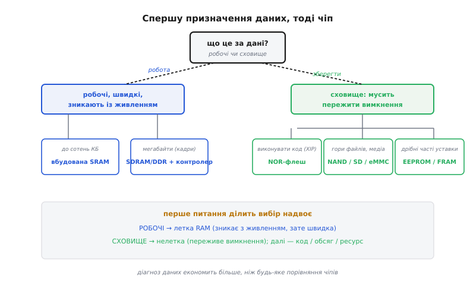
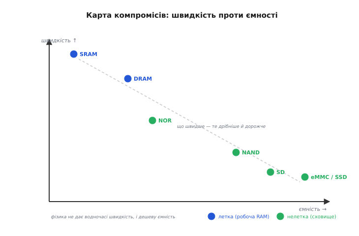
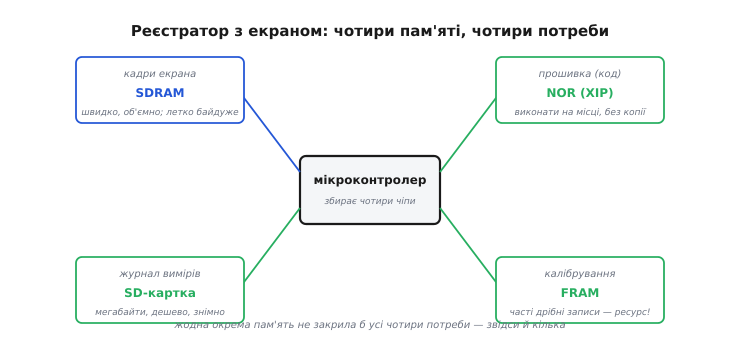

# Як обрати пам'ять для проєкту

Зовнішня пам'ять буває різна: летка [DRAM під контролером](book:electronics/memory-controller), нелеткі флеші [NOR і NAND](root:embedded/nor-vs-nand), [SD-картки](book:electronics/sd-card), [eMMC і SSD](book:electronics/emmc-ssd) з їхнім FTL, крихітні [EEPROM і FRAM](root:embedded/eeprom-fram). У реальному проєкті питання стоїть не «що таке DRAM?», а «яку пам'ять **поставити** під цю конкретну задачу?». Ця тема — практична: вона перетворює знання про різні пам'яті на **процедуру вибору** за п'ятьма критеріями (обсяг, швидкість, ресурс, енергія, ціна) і дерево, що веде від характеру даних до потрібного чіпа.

Усе тримається на одному поділі — **леткості** (від латинського *volatilis* — «летючий, мінливий»). Летка пам'ять тримає вміст, лише доки є живлення: зникне струм — зникнуть і дані. Нелетка береже записане й без живлення. Цей поділ і стане першою розвилкою.

### Перше питання: робоче чи сховище?

Увесь вибір починається з одного поділу: дані **робочі** (швидкі, тимчасові) чи це **сховище** (мусить пережити вимкнення)? Від відповіді розходяться дві великі гілки.


*Дерево вибору: ідіть від призначення даних. **Робочі, швидкі, зникають із живленням** — летка RAM: до сотень КБ вистачить вбудованої **SRAM**, мегабайти (кадри, відео) — зовнішня **SDRAM/DDR з контролером**. **Сховище, мусить пережити вимкнення** — нелетка пам'ять, а далі за уточненнями: виконувати **код** (XIP) — **NOR**; гори файлів і медіа — **NAND / SD / eMMC**; дрібні часті уставки — **EEPROM / FRAM**.*

Логіка дерева проста. Якщо дані **робочі** (буфер кадру, аудіо, проміжні масиви) — потрібна **летка** пам'ять, і питання лише в обсязі: сотні кілобайтів покриє вбудована SRAM, а мегабайти вимагають зовнішньої DRAM, отже й [контролера пам'яті](book:electronics/memory-controller), отже й мікроконтролера, що його має. Якщо дані — **сховище** (мусять лишитися), гілка йде до **нелеткої** пам'яті, де далі вирішують три уточнення: чи треба **виконувати з неї код** (тоді [NOR із XIP](root:embedded/nor-vs-nand)), чи це **великі** файли й медіа (тоді NAND у вигляді [SD](book:electronics/sd-card)/[eMMC/SSD](book:electronics/emmc-ssd)), чи це **дрібні часті** уставки (тоді [EEPROM або FRAM](root:embedded/eeprom-fram)). Одне-два питання — і ви на потрібній гілці.

Чому код тягне саме до NOR — варто пояснити, бо це найменш очевидна гілка. **XIP** (англ. *execute in place* — «виконання на місці») означає, що процесор бере інструкції просто з флеша, не копіюючи прошивку в RAM. Для цього пам'ять мусить бути **побайтово-адресовною** з миттєвим випадковим читанням — NOR саме така (доступ за 50–100 нс до будь-якої адреси). NAND читається **сторінками** по кілька кілобайтів і байт-за-байтом адреси не дає, тож виконувати з неї код напряму не можна — її вміст спершу переписують у RAM. Звідси й розкол: дрібний незмінний код — у NOR, ґіґабайти даних — у NAND.

### П'ять осей компромісу

Дерево дає клас пам'яті; щоб обрати остаточно, зважують **п'ять** осей, за якими пам'яті й різняться. Тримаймо їх усі перед очима.


*Пам'яті на площині **швидкість проти ємності**; колір — летка (синє, робоча RAM) чи нелетка (зелене, сховище). Угорі-ліворуч — найшвидше, але дрібне й дороге (SRAM); праворуч — ємне сховище, та повільніше (NAND, SD, eMMC/SSD); посередині — DRAM (швидка робоча) і NOR (нелетка, але не надто ємна). Пунктир — типовий компроміс: що швидше, те зазвичай дрібніше й дорожче.*

Ось ці п'ять осей, що їх варто прикинути для будь-якого вибору. **Обсяг** — скільки байтів треба (кілобайти, мегабайти, гігабайти): він одразу відкидає половину варіантів. **Швидкість** — як хутко потрібен доступ і чи послідовний він, чи випадковий (DRAM швидка, флеш повільніша; XIP вимагає миттєвого випадкового читання). **Ресурс** — чи багато буде **перезаписів**: тут пам'яті різняться на порядки. NAND витримує лише близько 10 тисяч стирань на блок, EEPROM — близько мільйона, а [FRAM](root:embedded/eeprom-fram) — десятки трильйонів, тобто практично без межі; SRAM і DRAM теж переписуються скільки завгодно. **Енергія** — чи живиться пристрій від батареї: DRAM постійно споживає на [регенерацію](book:electronics/memory-controller), флеш дорого платить за запис (FRAM, навпаки, пише швидко й майже задарма), а нелеткі пам'яті нічого не їдять у спокої. **Ціна** — за біт і за корпус: SRAM дорога, DRAM і NAND дешеві за мегабайт, FRAM дорожчий за EEPROM. Реальне рішення майже завжди **зважує** ці осі одна проти одної: ідеальної пам'яті немає, є та, що найкраще лягає під конкретні вимоги.

Карта компромісів показує головну причину, чому ці осі неможливо задовольнити одним чіпом: вони **тягнуть у різні боки**. Що швидша пам'ять, то вона дрібніша й дорожча (вершина — крихітні швидкі SRAM); що ємніша й дешевша, то повільніша (низ-праворуч — гігабайтні, але неквапні NAND-сховища). Це не недогляд інженерів, а фундаментальний компроміс: фізика не дає водночас і блискавичну швидкість, і дешеву ємність, і нелеткість. Та сама закономірність діє й усередині процесора — там швидкий, але крихітний [кеш](book:programming/cache) стоїть перед повільнішою, зате більшою основною пам'яттю. На рівні цілого пристрою вона повторюється: шикувати пам'яті **сходинками** — трохи дуже швидкої вгорі, багато повільної внизу — це універсальний спосіб мати водночас і швидкість там, де треба, і ємність там, де треба. Тому правильна відповідь на «яку пам'ять обрати» майже завжди — **кілька**, а не одна.

### Зведемо вибір у код

П'ять осей легко тримати в голові як просту функцію: вона бере опис даних і повертає клас пам'яті — рівно тими гілками, що й дерево.

```c
typedef enum { SRAM, SDRAM, NOR, NAND_BULK, EEPROM_FRAM } mem_t;

typedef struct {
    bool   nonvolatile;   // мусить пережити вимкнення?
    bool   exec_in_place;  // виконувати код напряму (XIP)?
    bool   byte_writes;    // дрібні побайтові уставки (не блоками)?
    size_t bytes;          // потрібний обсяг
} need_t;

mem_t pick_memory(need_t n) {
    if (!n.nonvolatile)                       // робочі дані → летка RAM
        return (n.bytes <= 256 * 1024) ? SRAM : SDRAM;
    if (n.exec_in_place)                       // код на місці → лише NOR
        return NOR;
    if (n.byte_writes && n.bytes < 64 * 1024)  // дрібні часті уставки
        return EEPROM_FRAM;
    return NAND_BULK;                          // гори файлів і медіа
}
```

Перша гілка віддає летку RAM і вибирає SRAM чи SDRAM лише за обсягом. Далі, вже в сховищі, код розводить три потреби: виконання на місці тягне строго до NOR, дрібні часті записи — до EEPROM/FRAM, а все об'ємне падає в NAND. Це той самий діагноз, тільки записаний так, що його видно одним поглядом.

> 🔧 **Навіщо це.** Беручись за пристрій, не питайте «яка пам'ять найкраща» (такої немає) — питайте **за кожною групою даних окремо**: робочі вони чи сховище, який обсяг, як часто перезаписуються, чи критична енергія, скільки можна витратити. Перше питання (робоче/сховище) одразу ділить вибір надвоє; обсяг і код звужують далі; ресурс і енергія роблять остаточний вибір усередині класу. Тримайте перед очима дерево вибору й п'ять осей — і вибір пам'яті з лотереї перетвориться на коротку інженерну процедуру.

### Кожна роль просить свою пам'ять

Корисно дивитися на пам'ять і з іншого боку — не «який чіп», а «під яку **роль**»: робочі змінні, незмінний конфіг, код, логи, лічильники. Ролі прив'язані до класів пам'яті досить жорстко, і це найшвидший спосіб одразу вгадати потрібний тип.

**Робочі змінні** (буфери, стек, проміжні масиви) живуть у **RAM** — їм байдуже до леткості, бо вони й так гинуть із кожним перезапуском; важливі лише швидкість і обсяг. **Прошивка-код** лежить у **NOR** або у вбудованій флеш-пам'яті мікроконтролера, бо її треба виконувати на місці й майже ніколи не переписувати. **Конфіг і калібрування** — дрібні, але мусять пережити вимкнення й змінюватися без стирання цілих блоків; це класична робота для **EEPROM**, а якщо записи часті — для **FRAM**, що не зношується. **Журнали й файли** — мегабайти-гігабайти, які ростуть постійно, — лягають на **SD-картку** чи **eMMC**, де є файлова система й дешева ємність. А **лічильники напрацювання**, що тикають тисячі разів на день, уб'ють EEPROM за місяці — їм потрібен саме незношуваний **FRAM**. Знаючи роль даних, тип пам'яті часто видно ще до будь-яких розрахунків.

### Реальний пристрій поєднує кілька пам'ятей

Найважливіше для практики: серйозний пристрій рідко обходиться **однією** пам'яттю. Зазвичай у ньому співіснує **кілька** — кожна закриває свою роль.


*Реєстратор з екраном поєднує чотири пам'яті, кожну — під свою потребу. **Кадри екрана** — зовнішня **SDRAM** (швидко, об'ємно; летко байдуже). **Прошивка (код)** — внутрішня або **NOR**-флеш (XIP, без копіювання). **Журнал вимірів** (мегабайти) — **SD-картка** (ємно, знімно, дешево). **Калібрування й лічильник** (часті дрібні записи) — **FRAM** чи **EEPROM**. Жодна окрема пам'ять не закрила б усі чотири потреби.*

**Приклад (підбираємо комплект під реєстратор).** Пройдімо вибір для пристрою з екраном, що пише журнал, по кожній потребі окремо.

```
потреба                  → ось вибору                  → рішення
─────────────────────────────────────────────────────────────────
кадр 320×240, подвійний   обсяг ~300 КБ, швидко, летко   зовнішня SDRAM
буфер  (робочі дані)       байдуже                       (+ контролер)

прошивка застосунку        нелетке, виконувати код        NOR-флеш (XIP)
(код)                      на місці

журнал вимірів, дні        нелетке, мегабайти, дешево,    SD-картка
роботи (сховище)           знімне                        (SPI або SD-режим)

калібрування + лічильник   нелетке, дрібне, ЧАСТІ         FRAM
напрацювання               перезаписи → ресурс!          (безмежний ресурс)
```

Кожна з чотирьох потреб лягає на **різну** пам'ять, бо в них різні вимоги за обсягом, швидкістю, нелеткістю й ресурсом. Зібравши ці чотири чіпи навколо мікроконтролера, ми й дістаємо специфікацію пам'яті реального пристрою. Саме так — потреба за потребою — її й складають на практиці. І не дивуйтеся, що пам'ятей у пристрої виявиться **кілька**: швидкій робочій RAM, ємному сховищу й крихітному місцю під уставки знайдеться окреме місце, бо вимоги в них несумісні.

---

За всім цим вибором ховається одна незручна правда: біти в пам'яті бувають **перевернуті** — заряд стік, комірка зносилася, завада спотворила сигнал, частинка вдарила в кристал. NAND взагалі дефектна **за задумом** і працює лише завдяки виправленню помилок, тож обираючи її під логи, ви насправді обираєте ще й схему контролю цілісності на додачу. Як машина [помічає й виправляє зіпсовані біти](book:algorithms/bit-flips) — окрема глибока тема, без якої жоден із цих чіпів не був би надійним.
