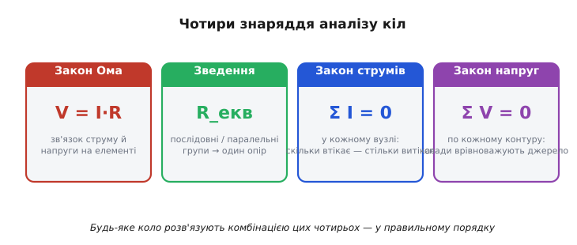
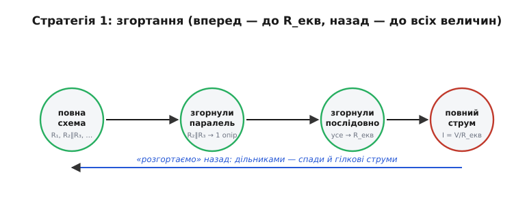
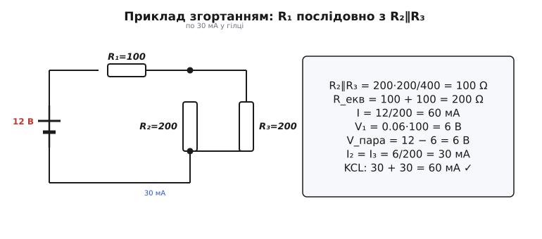
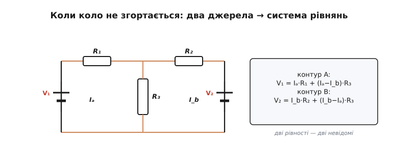
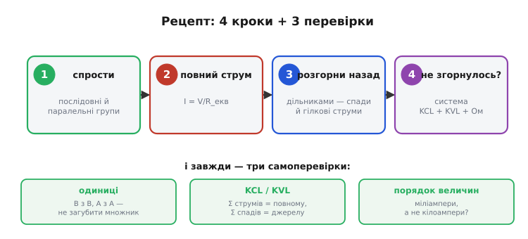

# Аналіз кіл

<preknowlist>
- [Лінійні системи](topic:math-algebra/linear-systems) — коли невідомих стільки ж, скільки рівнянь, набір має єдиний розв'язок; на цьому стоїть «систематичний» спосіб аналізу.
</preknowlist>

Ти вже знаєш окремі закони — Ома, Кірхгофа, зведення послідовних і паралельних груп. Та реальна схема не приходить із поміткою, котрий закон і де застосувати. **Аналіз кіл** (*аналіз* — від грецького *análysis*, «розкладання на частини») — це вміння скерувати всі ці знаряддя **разом, за чітким порядком**, щоб за відомою схемою знайти всі невідомі напруги й струми. Це практична серцевина теорії кіл — те, заради чого взагалі вчать окремі закони.

### Чотири знаряддя, які працюють разом

Арсенал невеликий — лише чотири інструменти, і кожен ти вже знаєш окремо. Уся майстерність аналізу — не у володінні кожним, а в тому, **коли** який пускати в хід.


*Чотири інструменти, що працюють разом: закон Ома (зв'язок V–I на одному елементі), послідовне й паралельне зведення (групу резисторів — в один R_екв), закон струмів (баланс у вузлі) і закон напруг (баланс по контуру). Будь-яке коло розв'язують їхньою комбінацією.*

Перше — **закон Ома**: V = I·R на кожному окремому елементі; знаючи будь-які дві величини з трьох, третю дістаєш миттєво. Друге — **зведення** послідовних і паралельних груп: жменя резисторів, з'єднаних типово, поводиться як один опір R_екв, і це різко спрощує картину. Третє — **закон струмів** (ΣI = 0 у вузлі): скільки заряду втікає, стільки й витікає, бо заряд нікуди не дівається. Четверте — **закон напруг** (ΣV = 0 по контуру): обійдеш замкнений шлях і повернешся в ту саму точку — отже, всі спади вздовж нього мусять урівноважити джерело.

Два закони Кірхгофа — це, по суті, два закони збереження, перекладені мовою кіл: збереження заряду дає закон струмів, збереження енергії — закон напруг. Тому вони працюють **завжди**, хоч якою заплутаною була б схема. Саме на цій надійності й стоїть увесь аналіз. А далі — питання тактики: як скерувати ці чотири знаряддя на конкретну схему.

### Стратегія 1: згортання

Для більшості повсякденних схем — тих, де елементи складаються в охайні послідовно-паралельні групи, — найшвидший шлях зветься **згортання** (схему згортають, як підзорну трубу).


*Згортання: паралельні й послідовні групи по черзі замінюють одним еквівалентом, доки від схеми не лишиться єдиний R_екв. Тоді знаходять повний струм, а далі «розгортають» назад — дільниками шукають спади на групах і струми в гілках.*

Ідея проста: **спрощуй поетапно**. Побачив паралельну групу — заміни її одним опором; побачив послідовну — додай; і так крок за кроком, доки від цілої схеми не лишиться **один** R_екв. Тепер коло — це просто джерело й один резистор, тож одним діленням знаходиш повний струм від джерела: I = V/R_екв. А далі найцікавіше — рухаєшся **назад**, ніби розгортаючи схему: дільником напруги знаходиш, скільки вольтів спадає на кожній групі, а дільником струму — як повний струм поділився по окремих гілках.

Чому цей хід туди-сюди працює? Бо згортання нічого не викидає — воно лише тимчасово ховає внутрішню будову групи за одним числом. Знайшов струм крізь еквівалентний опір — знайшов і струм, що входить у справжню групу замість нього; а знаючи цей струм і пам'ятаючи, з чого група складалася, однозначно відновлюєш усе, що в ній діється. Тому розгортання — не окремий фокус, а те саме згортання, прокручене у зворотний бік. На практиці незамінна звичка — щоразу **перемальовувати** спрощену схему: кожен крок крихітний і легко перевіряється очима, тож на описку майже не лишається місця.

### Приклад згортанням

Слова найкраще перевіряти числами. Візьмемо найтиповішу схемку — резистор послідовно з парою однакових паралельних — і пройдемо її повністю, туди й назад.


*Приклад: R₁ послідовно з парою R₂∥R₃. Спершу пара згортається в 100 Ω, тоді R_екв = 200 Ω, повний струм 60 мА; на R₁ спадає 6 В, на парі — теж 6 В, і кожна гілка бере по 30 мА. Перевірка закону струмів: 30 + 30 = 60 мА.*

**Приклад (згортанням). V = 12 В; R₁ = 100 Ω послідовно з парою R₂ = 200 Ω ∥ R₃ = 200 Ω.**

```
1. Згортаємо пару:  R₂∥R₃ = 200·200/400         = 100 Ω
2. Послідовно:      R_екв = R₁ + 100 = 100 + 100 = 200 Ω
3. Повний струм:    I = V/R_екв = 12/200         = 60 мА
4. Спад на R₁:      V₁ = I·R₁ = 0.06·100         = 6 В
5. Спад на парі:    V_пара = 12 − 6              = 6 В
6. Гілкові струми:  I₂ = I₃ = 6/200              = 30 мА
   перевірка KCL:   30 + 30                      = 60 мА  ✓
```

**Уперед** ми спростили схему до одного R_екв і знайшли повний струм; **назад** — розподілили знайдену напругу й струм по частинах. Фізично відповідь читається легко, і це найкраща перевірка здорового глузду: опір R₁ дорівнює опору пари, тож 12 В діляться навпіл (6 і 6 В), а рівні гілки пари ділять струм порівну — по 30 мА. Кожне число має зрозумілий сенс — добра ознака, що розв'язок правильний, а не випадково «зійшовся».

### Стратегія 2: коли коло не згортається

Та не всі кола згортаються — і тут починається друга половина мистецтва. Якщо в схемі **кілька джерел** або «місткове» з'єднання (як міст Вітстона, де резистори зчеплені так, що жодна пара не виходить ані суто послідовною, ані суто паралельною), послідовно-паралельне спрощення впирається в глухий кут: згортати просто немає чого. Тоді діють **напряму** — так, як замислив сам Кірхгоф.


*Коли коло не зводиться (два джерела, місткове з'єднання), діють напряму: призначають контурні (або гілкові) струми й пишуть рівняння законів Кірхгофа. Тут дві рівності контурів дають систему на два невідомі струми.*

Рецепт систематичний і **завжди** працює: познач невідомі струми, напиши по одному рівнянню закону струмів на кожен незалежний вузол і по одному рівнянню закону напруг на кожен незалежний контур, додай V = I·R для кожного резистора — і дістанеш рівно стільки рівнянь, скільки невідомих. На зв'язній схемі незалежних балансів струмів рівно **N − 1** (N — число вузлів), а незалежних контурів — рівно **B − N + 1** (B — число гілок); зазвичай беруть **один** метод, щоб не плодити зайвих залежних рівнянь. Для показаного кола з двох джерел це дві контурні рівності:

```
контур A:  V₁ = Iₐ·R₁ + (Iₐ − I_b)·R₃
контур B:  V₂ = I_b·R₂ + (I_b − Iₐ)·R₃
```

> 📜 Чому за невідомі беруть саме **контурні** струми (Iₐ, I_b), а не гілкові? Бо тоді закон струмів виконується сам собою й рівнянь виходить менше — цю хитрість ще 1873 року вигадав Джеймс Клерк Максвелл: [Контурні струми Максвелла](root:embedded/circuit-analysis/hist-maxwell-mesh.md).

Лишається розв'язати систему. Її розв'язок дає **знакові** струми: якщо котрийсь вийшов від'ємним — це не помилка, а підказка, що реальний струм тече проти навмання обраного напрямку. Метод сам виправляє наш довільний вибір, і боятися мінусів не треба. Спосіб не такий швидкий, як згортання, зате **універсальний**: ним береться будь-яке лінійне коло без винятку — і саме тому він лежить в основі кожного комп'ютерного розрахунку.

### Вузловий метод і машина

У контурного методу є рідний брат — **метод вузлових напруг**: за невідомі тут беруть не струми, а потенціали вузлів (один вузол оголошують нульовим — «землею», точкою відліку), пишуть закон струмів у кожному вузлі й розв'язують систему. Обидва методи дають **ту саму** відповідь — це лише два способи систематично застосувати ті самі закони Кірхгофа, обравши за невідоме різні величини. Який вибрати? Порахуй, чого в схемі менше — незалежних контурів (B − N + 1) чи вузлів без одного (N − 1), — і бери той метод: менше невідомих означає меншу систему й менше праці.

> ⚙️ **Як це робить комп'ютер.** Саме вузловий метод (із хитрою «модифікацією» під джерела напруги) автоматизує SPICE — програму, що з'явилася 1973 року в Берклі й відтоді стала стандартом галузі: зі списку з'єднань вона **штампує** матрицю й розв'язує її методом Гаусса. Покроково — у вставці [Як SPICE розв'язує кола: модифікований вузловий аналіз](root:embedded/circuit-analysis/proj-mna-spice.md).

> ⚙️ **Перевірити коло до паяння.** Перш ніж брати паяльник, схему варто прогнати в інтерактивному симуляторі: намалював коло мишею — рушій сам розв'язав рівняння Кірхгофа й показав напруги та струми наживо. Дешевий проміжний крок, де ціна помилки нульова: [Симулятор кіл як «нульова ітерація»](root:embedded/circuit-analysis/proj-circuit-sim.md).

### Рецепт і три самоперевірки

Зведімо весь метод у єдиний порядок дій, який можна тримати в голові й застосовувати до будь-якої схеми.


*Рецепт: (1) спрости групи, (2) знайди повний струм, (3) розгорни назад дільниками; (4) якщо не згортається — система рівнянь. І завжди — три самоперевірки: одиниці, баланси Кірхгофа, порядок величин.*

Порядок такий: **(1)** спрости послідовні й паралельні групи; **(2)** знайди повний струм I = V/R_екв; **(3)** розгорни назад — дільниками знайди спади на групах і струми в гілках; **(4)** якщо коло не згортається, переходь до системи рівнянь (закони струмів і напруг плюс закон Ома). А наприкінці кожного розрахунку — три обов'язкові самоперевірки, які відрізняють інженера від угадувача.

> 🔧 **Навіщо це.** Звичка перевіряти себе економить години. **Одиниці:** вольти з вольтами, ампери з амперами — чи не загубився десь множник на тисячу (кілооми проти омів, міліампери проти ампер)? **Баланси Кірхгофа:** сума гілкових струмів = повному, сума спадів = напрузі джерела — якщо не сходяться, десь порушено збереження заряду чи енергії. **Порядок величин:** чи взагалі розумна відповідь — на батарейці очікуєш міліампери, а не кілоампери. Якщо щось не сходиться — спиняйся й шукай помилку, не йди далі з кривим числом.

Ці три перевірки не випадкові, і варто бачити, від чого кожна страхує. Перевірка одиниць ловить найбанальнішу й найпідступнішу помилку — переплутаний множник. Перевірка балансами — це повернення до самих законів збереження: не сходяться струми у вузлі, значить, ти десь порушив збереження заряду, а такого фізика не пробачає. А перевірка порядку величин — це здоровий глузд, перекладений на числа: відповідь, що відрізняється від очікуваної в тисячу разів, майже напевно хибна, навіть якщо формули виглядають охайно.

---

Знарядь лишається ті самі чотири — змінюється лише тактика, яку диктує сама схема: проста згортається, зчеплена вимагає системи рівнянь. Саме тому аналіз кіл — навичка, а не формула; а опанувавши її руками, ти точно знаєш, **що** рахує машина в кожному [SPICE](root:embedded/circuit-analysis/proj-mna-spice.md) — і коли їй можна вірити.

---
