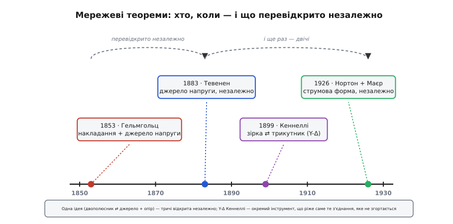

# 📜 Мережеві теореми: одна ідея, тричі відкрита незалежно

Є прийоми, до яких повертаєшся щодня, навіть не називаючи їх на ім'я. Коли ти кажеш «внутрішній опір батареї», «вихідний опір каскаду», «дільник просів під навантаженням» — за кожною з цих буденних фраз стоїть та сама глибока теорема: **будь-яку складну лінійну схему, хоч зі ста елементів, з двох затискачів можна замінити одним джерелом і одним опором**. Дві числа замість цілого лабіринту. Це настільки корисно, що сьогодні ми беремо це за очевидне.

А колись — не брали. І найцікавіше в цій історії не сама формула, а те, **скільки разів людство мусило відкривати її наново**, не знаючи, що це вже відкрито. Одну й ту саму ідею незалежно натрапляли фізіолог, який вивчав нерви жаб, французький телеграфіст, американський інженер зі студії Белла і німець із «Сіменса». Історія цих теорем — чудовий приклад того, як **винахід майже ніколи не належить одній людині**, і як ім'я в підручнику закріплюється зовсім не завжди за тим, хто був перший.

Одразу зробімо чесну межу. Хитрість Максвелла з [контурними струмами](root:embedded/circuit-analysis/hist-maxwell-mesh.md) — про **інше**: як записати меншу систему рівнянь для цілого кола. Тут ми говоримо не про це, а про **теореми еквівалентності**: як цілий шматок кола згорнути до простішого еквівалента. Це дві різні гілки думки, і плутати їх не варто, хоч жили їхні автори майже водночас.

### Що взагалі треба було відкрити

Перш ніж називати імена й дати, домовмося, **про які саме твердження** йдеться — інакше «хто перший» повисне в повітрі. Мережевих теорем, що нас цікавлять, по суті три, і кожна відповідає на своє питання.

Перша — **накладання** ([принцип суперпозиції](topic:hw-analog/superposition)). Питання: як рахувати коло, у якому не одне джерело, а кілька? Відповідь: у лінійному колі відгук (будь-який струм чи напруга) від кількох джерел дорівнює **сумі відгуків від кожного джерела окремо**, коли решту тимчасово вимкнено. Розклав задачу на прості одноджерельні, розв'язав кожну, склав — і маєш повну відповідь.

Друга — **еквівалент джерела** ([теорема Тевенена](topic:hw-analog/thevenin) і її дуальна форма, [теорема Нортона](topic:hw-analog/norton)). Питання: чим є складна схема з погляду двох затискачів, до яких ми чіпляємо навантаження? Відповідь: одним джерелом послідовно з одним опором (форма напруги, Тевенен) — або, дзеркально, одним джерелом струму паралельно з тим самим опором (форма струму, Нортон). Обидві форми описують те саме коло й переводяться одна в одну простим [перетворенням джерела](topic:hw-analog/source-transformation).

Третя — **зірка ⇄ трикутник** (Y-Δ). Питання: що робити зі з'єднанням трьох опорів «трикутником» (чи «зіркою»), яке заклинює послідовно-паралельне згортання — як у [мості Вітстона](topic:hw-sensing/wheatstone-bridge)? Відповідь: трикутник можна точно замінити еквівалентною зіркою (і навпаки), і після такої заміни згортання знову оживає.

Три різні теореми — три різні дійові особи. Простежмо кожну від її справжнього початку.

*Одна ідея еквівалентного джерела народилася 1853 року в Гельмгольца й була перевідкрита незалежно ще двічі: Тевененом (1883, форма напруги) і водночас Нортоном та Маєром (1926, дуальна струмова форма). Осторонь стоїть Кеннеллі (1899) з перетворенням зірка-трикутник — окремим інструментом, що ріже саме те з'єднання, яке не піддається згортанню.*

### Гельмгольц, 1853: усе почалося з нервів жаби

Найдивовижніше тут — звідки прийшла ідея. Не від інженера, що будував телеграф, і не від фізика, що бавився з батареями заради самих батарей. Джерелом і накладання, і теореми еквівалентного джерела був **Герман фон Гельмгольц** (*Hermann von Helmholtz*, 1821–1894) — німецький лікар за освітою і один із найуніверсальніших природознавців XIX століття, чоловік, що приклав руку до збереження енергії, оптики ока, акустики й термодинаміки. А до кіл він прийшов через **фізіологію**.

Гельмгольц вивчав «тваринну електрику» — ті самі струми в нервах і м'язах, що на них колись натрапив Гальвані. Щоб розібратися, як струм розтікається по живій тканині, йому потрібна була строга теорія розтікання струму в **об'ємному провіднику** з багатьма джерелами всередині. І ось, будуючи цю теорію, він 1853 року вивів — як побічний, суто математичний плід — обидва наші фундаментальні твердження. Праця називалася **«Ueber einige Gesetze der Vertheilung elektrischer Ströme in körperlichen Leitern mit Anwendung auf die thierisch-elektrischen Versuche»** («Про деякі закони розподілу електричних струмів у об'ємних провідниках із застосуванням до дослідів над тваринною електрикою») і вийшла в поважному часописі *Annalen der Physik und Chemie*.

У ній Гельмгольц прямо формулює узагальнений принцип накладання: напруга в кожній точці системи, крізь яку тече струм, дорівнює **алгебричній сумі тих напруг, які створила б кожна з електрорушійних сил окремо, незалежно від інших**. Це і є накладання, слово в слово. А з нього — за кілька кроків — випливає й те, що зовні будь-яка така система поводиться як одне джерело з одним внутрішнім опором. Тобто **теорема, яку ми звемо Тевеніновою, з'явилася в друці за тридцять років до Тевеніна** — під пером фізіолога, що цікавився жаб'ячими нервами.

> 🔧 **Навіщо це.** Що накладання й еквівалент джерела виросли з однієї праці — не історична випадковість, а підказка про їхню суть: **обидва тримаються на самій лінійності кола**. Тому, тільки-но в схемі з'являється нелінійний елемент (діод, транзистор у крутому режимі), обидва прийоми перестають працювати водночас. Хто пам'ятає спільний корінь, той не намагатиметься накласти струми на діоді чи звести нелінійний вузол до Тевеніна — і не витратить годину на розрахунок, що приречений.

Статус цього факту — **усталений**: авторство Гельмгольца стоїть у первісному тексті 1853 року, це не пізніша реконструкція й не легенда. Чому ж тоді теорему звуть не його ім'ям? Почасти тому, що Гельмгольц подав її як технічну лему всередині фізіологічної праці, не виокремивши як інженерне знаряддя; а почасти — бо через тридцять років її переоткрив і подав уже мовою електротехніки інший чоловік, чиє формулювання лягло рівно під потреби інженерів.

### Тевенен, 1883: телеграфіст, якому спершу не повірили

Той чоловік — **Леон Шарль Тевенен** (*Léon Charles Thévenin*, 1857–1926), французький інженер-телеграфіст. Народився він у Мо (*Meaux*) під Парижем, закінчив славетну Політехнічну школу (*École polytechnique*) 1878 року й одразу пішов у Корпус телеграфних інженерів — той самий, що згодом став французьким поштово-телеграфним відомством (*Postes et Télégraphes*, пізніше PTT). Спершу тягнув підземні лінії дальнього зв'язку, а 1882 року став викладачем-інспектором Вищої школи телеграфії, і ось там, розбираючи зі студентами закони Кірхгофа й [закон Ома](topic:hw-analog/ohms-law), уперше замислився над тим, як спростити розрахунок складних кіл.

Наслідком стала його теорема, оприлюднена **1883 року**. Тевенен опублікував її двічі того ж року: коротшою нотаткою «Sur un nouveau théorème d'électricité dynamique» («Про нову теорему динамічної електрики») у звітах Паризької академії наук (*Comptes rendus*, том 97, с. 159–161) і докладніше — «Extension de la loi d'Ohm aux circuits électromoteurs complexes» («Поширення закону Ома на складні електрорушійні кола») у фаховому *Annales Télégraphiques* (том 10, с. 222–224). Уже сама назва другої статті влучна: він і справді **поширив закон Ома** з одного резистора на цілу схему — бо його еквівалент дозволяє порахувати струм у навантаженні простим діленням, наче схема була одним-єдиним опором.

Про Гельмгольцову працю 1853 року Тевенен, за всіма ознаками, **не знав** — це незалежне перевідкриття, а не запозичення; так це й оцінює історія (статус — **усталено**). І тут історія додає повчальний штрих. Певний своєї правоти, Тевенен показав рукопис відомому математику-фізику **Еме Вашı** (*Aimé Vaschy*, 1857–1899) — і той **визнав результат хибним**. Тевенен звернувся ще до кількох колег; думки розділилися. Уяви становище: молодий телеграфіст стоїть із простим і красивим твердженням, а авторитетний фахівець каже, що воно неправильне. Багато хто відступив би. Тевенен не відступив — і час показав, що правий був він: його доведення **коректне й загальне**, а Вашı помилявся. Урок для інженера тут понадчасовий: авторитет, який каже «так не буває», не завжди має рацію — перевіряй саму суть, а не регалії того, хто заперечує.

> 🔧 **Навіщо це.** Дарма що теорема давніша за Тевеніна, у світі вона зветься **його** ім'ям — і це не помилка, а закономірність. Гельмгольц дав твердження як фізіологічну лему; Тевенен дав його як **інженерний метод**, у формі, готовій до вжитку в розрахунку кіл, і саме ця форма прижилася в електротехніці. Так буває раз у раз: закріплюється не той, хто перший **подумав**, а той, чиє формулювання виявилося **найзручнішим** для тих, кому воно щодня потрібне.

Про самого Тевеніна варто знати ще дрібницю, що додає теплоти цій сухій хронології. Він так і лишився при телеграфі до самої пенсії 1914 року — став 1896-го директором тієї ж телеграфної школи, потім головним інженером телеграфних майстерень. Був завзятим скрипалем і рибалкою, не одружився, зате взяв на виховання й усиновив двох дітей овдовілої родички. Свою теорему він ніколи не патентував і не роздмухував — просто подав і пішов працювати далі; слава прийшла до неї сама, вже без нього.

### Нортон і Маєр, 1926: та сама ідея, вивернута навиворіт — і знову двічі

Мине ще сорок років, і та сама ідея еквівалентного джерела зробить свій третій незалежний вихід — цього разу в **дуальній, струмовій** формі. Якщо Тевенен каже «джерело **напруги** послідовно з опором», то дзеркальне твердження звучить «джерело **струму** паралельно з тим самим опором». Це [теорема Нортона](topic:hw-analog/norton), і вона — не окреме відкриття, а другий бік уже відомої монети: обидві форми зв'язані [перетворенням джерела](topic:hw-analog/source-transformation) V = I·R і описують одне й те саме коло.

І ось знову — не одна людина, а **дві, незалежно, того самого 1926 року**.

Перший — **Едвард Лорі Нортон** (*Edward Lawry Norton*, 1898–1983), американський інженер-електрик із дослідницьких лабораторій компанії Белла (*Bell Labs*). Він описав дуальну форму у **внутрішньому** технічному звіті фірми (Technical Memorandum TM26-0-1680, «Design of finite networks for uniform frequency characteristic») — тобто у документі, що назовні майже не вийшов. Другий — **Ганс Фердинанд Маєр** (*Hans Ferdinand Mayer*, 1895–1980), німецький фізик і інженер із дослідницької лабораторії «Сіменс і Гальске» (*Siemens & Halske*) у Берліні. Маєр **опублікував** результат по-справжньому — статтею «Ueber das Ersatzschema der Verstärkerröhre» («Про еквівалентну схему підсилювальної лампи») у часописі *Telegraphen- und Fernsprech-Technik* (1926, том 15, с. 335–337).

Зверни увагу на іронію, дзеркальну до Тевенінової. Тут **опублікував саме Маєр**, а Нортонів результат лишився в закритому звіті фірми — і все ж у світі теорема зветься **Нортоновою**. Чому? Тут працює вже не «зручність формулювання», а вага **школи й мови**. Bell Labs була найвпливовішим осередком зв'язкової інженерії свого часу, її внутрішня традиція розійшлася підручниками англомовного світу — і ім'я Нортона поїхало разом із нею. Точніша, чесніша назва — **теорема Маєра-Нортона**, і в деяких джерелах вона саме так і стоїть; але щоденний ужиток стягнув її до самого «Нортона». Статус усього цього — **усталено**: незалежність двох відкриттів і те, хто де опублікував, задокументовані добре.

А доля Маєра — окрема, разюча історія, що виходить далеко за межі теорії кіл, і її варто знати, щоб за сухим прізвищем у формулі побачити живу людину складної епохи. Той самий Ганс Фердинанд Маєр 1939 року, під час службової поїздки до Осло, анонімно передав британцям так званий **«звіт з Осло»** (*Oslo Report*) — один із найважливіших витоків технічної розвідки початку Другої світової, де німецький науковець «на вашому боці» виклав відомості про радари, торпеди й ракетні розробки Рейху. Пізніше Маєра заарештували за слухання Бі-Бі-Сі й критику режиму, і він пройшов Дахау та ще кілька концтаборів, але вижив. Людина, чиє ім'я ми мимохідь згадуємо, вимикаючи джерела в навчальній задачі, ризикнула життям проти нацизму — маленьке нагадування, що за кожним прізвищем у підручнику стоїть не формула, а доля.

### Кеннеллі, 1899: інструмент для того, що не згортається

Осторонь від трилогії про еквівалентне джерело стоїть четверта теорема — **перетворення зірка-трикутник** (Y-Δ). Вона розв'язує зовсім інше питання. Пригадаймо: більшість кіл беруться простим згортанням послідовних і паралельних груп. Але існують з'єднання, де три опори зчеплені «трикутником» так, що жодна пара не виходить ані суто послідовною, ані суто паралельною, — класичний приклад це незрівноважений [міст Вітстона](topic:hw-sensing/wheatstone-bridge). Згортати немає чого: інструмент упирається в стіну.

Вихід знайшов **Артур Едвін Кеннеллі** (*Arthur Edwin Kennelly*, 1861–1939) — і його самого варто представити точно, бо національність тут не така проста, як здається з «американський інженер». Народився він 17 грудня 1861 року в **Колабі** (*Colaba*) — тоді це передмістя Бомбея в Британській Індії, — у родині **ірландця**, морського офіцера Девіда Джозефа Кеннеллі. Тобто етнічно він ірландець, за місцем народження — уродженець Британської Індії, а вже інженерну кар'єру зробив у США: працював у лабораторії Едісона в Вест-Оранджі (1887–1894), а з 1902 року й до пенсії був професором Гарвардського університету. Точний опис — **американський інженер ірландського роду, народжений у Британській Індії**; коротке «американець» правдиве лише про громадянство й місце праці.

Свою теорему Кеннеллі оприлюднив **1899 року** статтею з говіркою назвою **«The Equivalence of Triangles and Three-Pointed Stars in Conducting Networks»** («Еквівалентність трикутників і трипроменевих зірок у провідних мережах») у часописі *Electrical World and Engineer* (том 34, с. 413–414). Ідея та сама, що й у попередніх теорем, — **еквівалентність**, лише прикладена до трьох опорів: трикутник із трьох сторін і зірку з трьох променів можна підібрати так, що ззовні, з погляду трьох спільних вузлів, вони **непомітно різні** — той самий опір між кожною парою. А коли непомітно різні, то в будь-якій схемі одне вільно міняється на інше; і варто підмінити трикутник зіркою, як зчепленість, що глушила згортання, зникає — і схема доганяється до кінця простими послідовно-паралельними кроками.

> 🔧 **Навіщо це.** Y-Δ — не музейна рідкість, а робочий інструмент для **мостових давачів**: тензодавач, [міст Вітстона](topic:hw-sensing/wheatstone-bridge) під тиск чи температуру. Там треба швидко оцінити повний опір і струм, а тягати щоразу цілу систему рівнянь марнотратно — одна підміна трикутника зіркою повертає задачу в русло звичайного згортання. Ім'я Кеннеллі на цьому перетворенні закріпилося міцно (його так і звуть — перетворення Кеннеллі), і тут, на відміну від Тевеніна й Нортона, першовідкривач і «власник назви» — та сама людина.

### Що ця історія каже про самі винаходи

Складімо чотири нитки докупи — і проступить візерунок, вартий більше за будь-яку окрему дату.

Спершу — про **колективність відкриття**. Ідея еквівалентного джерела виходила на світ **тричі, незалежно**: Гельмгольц (1853), Тевенен (1883), Нортон і Маєр (1926) — а останнього разу навіть **двічі водночас**, по різні боки Атлантики. Це не химерний збіг, а закономірність зрілої науки: коли ґрунт готовий (лінійні кола, закони Кірхгофа й Ома вже в ужитку), потрібна теорема **дозріває** й дається різним людям майже одночасно. Тому чесна відповідь на «хто винайшов теорему Тевеніна» — не одне прізвище, а ланцюжок, у якому кожна ланка розрізняється: хто **першим подумав і надрукував** (Гельмгольц), хто дав **зручну інженерну форму** (Тевенен), хто **вивернув її в дуальну** (Нортон і Маєр).

Далі — про **імена в підручниках**. Вони закріплюються не за першістю, а за впливом: за зручністю формулювання (Тевенен обійшов Гельмгольца) і за вагою школи та мови (Нортон обійшов Маєра, дарма що друком вийшов Маєр). Знати це корисно не задля прискіпливості, а щоб **правильно шукати й правильно цінувати**: за звичним ярликом «теорема N» майже завжди ховається довша й справедливіша історія, і той, чиє ім'я на дверях, не конче той, хто ці двері прорубав.

І насамкінець — тонка, але важлива межа, з якої ми почали. Усі чотири теореми — про **еквівалентність**: як щось складне замінити чимось простішим, не змінивши поведінки ззовні. Це ріднить їх між собою — і водночас **відрізняє** від зовсім іншої за духом хитрості Максвелла з [контурними струмами](root:embedded/circuit-analysis/hist-maxwell-mesh.md), яка не спрощує схему, а лише розумніше **записує рівняння** для неї цілої. Дві філософії розрахунку кіл — «спрости частину» і «запиши систему коротше» — визрівали поряд, у тих самих десятиліттях, у тих самих людей. Той, хто бачить цю розвилку ясно, ніколи не сплутає, який інструмент бере в руки: він **згортає** двополюсник до пари чисел за Гельмгольцем-Тевеніном-Нортоном — чи **пише меншу систему** за Максвеллом. А різні задачі просять різного.
