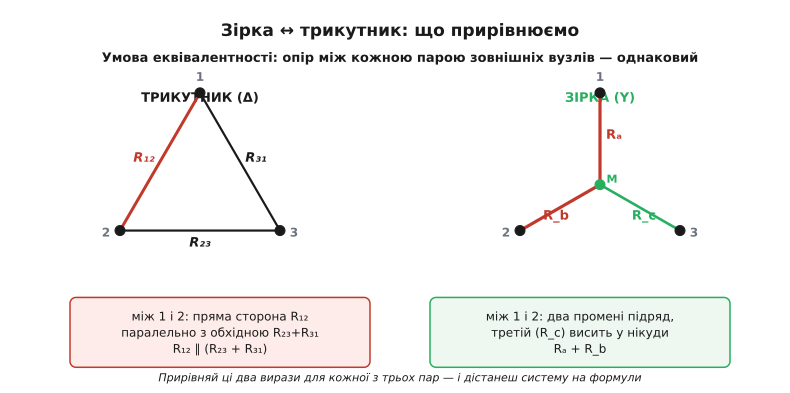
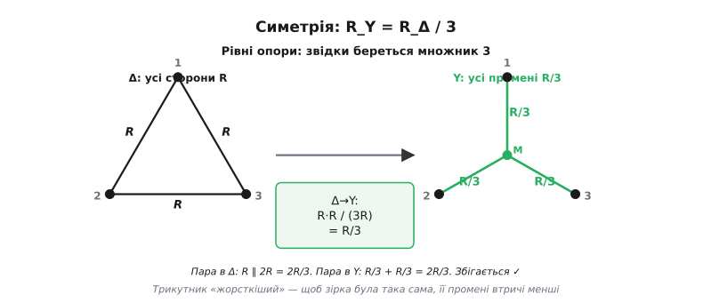

# 🧮 Виведення формул зірка ↔ трикутник

У детальному кроці ми взяли формули перетворення **зірка ↔ трикутник** (Y-Δ) готовими — щоб не рвати нитку розв'язання містка. Тут повертаємо борг: виводимо їх від самої основи, руками, нічого не запам'ятовуючи наперед. Наприкінці ти не «знатимеш формулу», а **бачитимеш, звідки кожна дужка**, — і зможеш відновити її будь-коли на клаптику паперу, навіть якщо забудеш, що куди множиться.

Мета не суто академічна. Ці формули — єдиний спосіб узяти згортанням [міст Вітстона](topic:hw-sensing/wheatstone-bridge) і будь-яку іншу схему зі «зчепленими» резисторами, а мостові вмикання — це половина всіх точних давачів (тензодавач, термоміст, давач тиску). Хто розуміє **чому** промінь зірки — це добуток прилеглих сторін на периметр, той не плутає індекси й не лізе щоразу в довідник.

## Що взагалі означає «еквівалентні»

Почнімо з єдиного, на чому все тримається, — з означення еквівалентності. Уяви **чорну скриньку** з трьома виводами: вузол 1, вузол 2, вузол 3. Усередині — або три резистори, з'єднані в **зірку** (три промені з одного спільного центра M), або три резистори, з'єднані в **трикутник** (три сторони по колу, без жодного центрального вузла). Зовнішня схема під'єднана лише до трьох виводів; що коїться всередині скриньки, вона «побачити» не може — тільки помацати з боку виводів.

> 🔧 **Навіщо це.** Уся сила перетворення — саме в цій «неможливості зазирнути»: якщо зовні дві скриньки не відрізнити жодним вимірюванням, їх можна вільно міняти місцями в схемі. Ти замінюєш зчеплений трикутник на зірку — і на її місці раптом проступають звичайні послідовні й паралельні пари, яких доти не було. Схема, що не згорталася, згортається.

А чим узагалі можна «помацати» пасивну трибрамку ззовні? Лише опором. Причому не одним числом — між трьома виводами є **три різні пари**: 1–2, 2–3, 3–1. Вимірюєш опір між кожною парою (два щупи омметра на два виводи, третій вивід ні до чого не під'єднаний і висить у повітрі) — і дістаєш три числа. Ось повний «портрет» скриньки з боку виводів: **три попарні опори**. Якщо в зірки й у трикутника ці три числа збігаються, то жоден зовнішній дослід їх не розрізнить — вони еквівалентні за означенням.

> 🔧 **Навіщо це.** Може здатися, що трьох чисел замало — раптом лишилася якась «прихована» відмінність, яку попарний опір не ловить? Ні, не лишилася, і це принципово. У кожній фігурі рівно **три** незалежні резистори — три невідомі. Три попарні опори дають рівно три рівняння. Скільки в системи ступенів вільності, стільки й умов ми накладаємо; більше просто немає чого зіставляти. Тому три рівності — не «достатньо для практики», а **вичерпний** критерій.

Отже, весь план виведення вже видно наперед, і він скромний: **виразити кожен із трьох попарних опорів двічі** — раз через сторони трикутника, раз через промені зірки, — **прирівняти** ці вирази попарно й **розв'язати** отриману систему трьох рівнянь. Жодної магії далі не буде — сама лише акуратна алгебра. Тримаймося за цей план.

Домовмося про позначення раз і назавжди — ті самі, що в детальному кроці, щоб формули збіглися буква в букву:

```
Зірка (Y):  Rₐ — промінь до вузла 1
            R_b — промінь до вузла 2
            R_c — промінь до вузла 3   (усі сходяться в центрі M)

Трикутник (Δ):  R₁₂ — сторона між вузлами 1 і 2  (протилежна вузлові 3)
                R₂₃ — сторона між вузлами 2 і 3  (протилежна вузлові 1)
                R₃₁ — сторона між вузлами 3 і 1  (протилежна вузлові 2)
```

Індекс сторони — це просто **два її кінці**; індекс променя — **єдиний зовнішній вузол**, до якого він тягнеться (другий кінець кожного променя — спільний центр M). Ця дрібна охайність позначень потім сама підкаже структуру відповіді.

## Опір між парою: два різні погляди

Тепер — ключовий крок, з якого все виростає: **чому дорівнює опір між вибраною парою виводів у кожній із фігур**. Розберімо пару 1–2; дві інші вийдуть за тим самим зразком простою заміною індексів.


*Ліворуч — трикутник: між вузлами 1 і 2 струм має два шляхи — пряму сторону R₁₂ і обхідну R₂₃+R₃₁, тож опір пари = R₁₂ ∥ (R₂₃ + R₃₁). Праворуч — зірка: третій вивід висить у повітрі, тож промінь R_c мертвий, а між 1 і 2 лишаються два промені підряд, Rₐ + R_b. Прирівнявши ці вирази для всіх трьох пар, дістаємо систему.*

**Зірка — легший бік, почнімо з нього.** Прикладаємо омметр до виводів 1 і 2; вивід 3 висить у повітрі, ні до чого не під'єднаний. Куди піде струм? Він заходить у вузол 1, тече променем Rₐ до центра M, звідти променем R_b до вузла 2 — і виходить. А промінь R_c? Його дальній кінець (вузол 3) обірваний, кола немає, тому крізь R_c **не тече ані краплі струму**. Мертва гілка — наче її й немає. Отже, між 1 і 2 в зірки — просто два промені **послідовно**:

```
R₁₂(зірка) = Rₐ + R_b
```

Ось де захована вся простота зірки й водночас підказка до мнемоніки, до якої ще дійдемо: у попарному опорі зірки завжди беруть участь **рівно два** промені — ті, що ведуть до двох вимірюваних вузлів, — а третій завжди випадає.

**Трикутник — трохи цікавіший.** Знову омметр на 1 і 2, вивід 3 висить. Тепер шляхів для струму **два**. Перший — навпростець, прямою стороною R₁₂ (вона ж і з'єднує вузли 1 і 2). Другий — в обхід: із вузла 1 стороною R₃₁ до вузла 3, а звідти стороною R₂₃ до вузла 2. Друга дорога — це R₃₁ і R₂₃ **послідовно**, разом R₂₃ + R₃₁. А що вузол 3 висить у повітрі? Це не заважає струмові проходити **крізь** нього транзитом: вузол 3 — просто перехрестя двох сторін, струм не мусить у ньому «виходити назовні», йому досить пройти наскрізь. (Мертвим вивід 3 був у зірки лише тому, що там він — **кінець** окремого променя; у трикутнику він — прохідна точка на обхідному шляху. Ось де аналогія «висить у повітрі» ламається: висіти-то висить, але роль зовсім інша.)

Маємо два паралельні шляхи між 1 і 2: пряма сторона R₁₂ і обхід R₂₃ + R₃₁. Опір пари — їхнє паралельне з'єднання:

```
R₁₂(трикутник) = R₁₂ ∥ (R₂₃ + R₃₁) = R₁₂·(R₂₃ + R₃₁) / (R₁₂ + R₂₃ + R₃₁)
```

Знаменник тут — **сума всіх трьох сторін**. Це не випадковість і не збіг: паралельне з'єднання R₁₂ ∥ (R₂₃ + R₃₁) дає в знаменнику суму обох гілок, R₁₂ + (R₂₃ + R₃₁), а це і є периметр трикутника. Запам'ятай цей знаменник — він з'явиться в кожному з трьох рівнянь однаковим, і саме його сталість дозволить нам потім усе розплутати. Позначмо його однією буквою, щоб не переписувати щоразу:

```
S = R₁₂ + R₂₃ + R₃₁      (периметр трикутника)
```

## Три рівняння еквівалентності

Тепер механічно повторюємо ту саму думку для решти двох пар — заміною індексів по колу (1→2→3→1). Для пари 2–3: пряма сторона — R₂₃, обхід — через вузол 1, тобто R₁₂ + R₃₁. Для пари 3–1: пряма сторона — R₃₁, обхід — через вузол 2, тобто R₁₂ + R₂₃. У зірки так само просто: між 2 і 3 працюють промені R_b + R_c, між 3 і 1 — R_c + Rₐ. Прирівнюємо «зірку = трикутнику» для кожної пари й дістаємо систему трьох рівнянь:

```
(1-2):  Rₐ + R_b = R₁₂·(R₂₃ + R₃₁) / S
(2-3):  R_b + R_c = R₂₃·(R₃₁ + R₁₂) / S
(3-1):  R_c + Rₐ = R₃₁·(R₁₂ + R₂₃) / S
```

Ось і все, що дає фізика. Далі — чиста алгебра: у нас три рівняння й, залежно від того, куди перетворюємо, три невідомі. Якщо відомі сторони трикутника й шукаємо промені зірки (Δ→Y) — невідомі Rₐ, R_b, R_c, і система відносно них **лінійна**, розв'язується миттєво. Якщо навпаки, відомі промені й шукаємо сторони (Y→Δ) — трохи більше мороки, бо невідомі сидять у знаменнику; підемо в обхід. Розберімо обидва напрями.

## Напрям Δ → Y: розв'язуємо на промені

Це найлегший напрям, і трюк для нього — з тих, що варто мати в арсеналі назавжди, бо він працює щоразу, коли з трьох рівнянь треба виколупати одну змінну.

Придивись до лівих частин системи: це попарні суми Rₐ + R_b, R_b + R_c, R_c + Rₐ. Кожен промінь входить рівно у **два** рівняння й відсутній у третьому. Скажімо, Rₐ є в (1-2) і (3-1), але його **немає** в (2-3). Отже, якщо ми хочемо лишити самий Rₐ, треба скласти ті два рівняння, де він є, і **відняти** те, де його немає, — тоді R_b і R_c, які теж усюди по двічі, взаємно скоротяться. Перевіримо на лівих частинах:

```
(1-2) − (2-3) + (3-1):
(Rₐ + R_b) − (R_b + R_c) + (R_c + Rₐ) = Rₐ + R_b − R_b − R_c + R_c + Rₐ = 2·Rₐ
```

Спрацювало: усе, крім 2·Rₐ, скоротилося. Тепер та сама комбінація для правих частин. Спільний знаменник у всіх S, тож складаємо самі чисельники:

```
чисельник = R₁₂·(R₂₃ + R₃₁) − R₂₃·(R₃₁ + R₁₂) + R₃₁·(R₁₂ + R₂₃)

розкриваємо дужки:
  = R₁₂·R₂₃ + R₁₂·R₃₁          (від першого доданка)
  − R₂₃·R₃₁ − R₂₃·R₁₂          (від другого, зі знаком мінус)
  + R₃₁·R₁₂ + R₃₁·R₂₃          (від третього)
```

Тепер найприємніше — глянути, що з чим гине. Член R₁₂·R₂₃ і член −R₂₃·R₁₂ — це те саме з різними знаками, скорочуються. Так само R₂₃·R₃₁ (з мінусом у другому рядку) і +R₃₁·R₂₃ (у третьому) — гинуть. Лишаються тільки два члени зі стороною R₃₁, обидва додатні: R₁₂·R₃₁ + R₃₁·R₁₂ = 2·R₁₂·R₃₁. Отже:

```
2·Rₐ = 2·R₁₂·R₃₁ / S      →      Rₐ = R₁₂·R₃₁ / S
```

Двійки скорочуються, і ми **вивели перший промінь**. Розпишемо його повністю, підставивши S назад:

```
Rₐ = R₁₂·R₃₁ / (R₁₂ + R₂₃ + R₃₁)
```

Два інші промені навіть виводити окремо не треба — вони вискакують із симетрії. Наша система переходить сама в себе, якщо крутнути індекси по колу 1→2→3→1: тоді Rₐ→R_b, а сторони, прилеглі до вузла 1 (це R₁₂ і R₃₁), переходять у сторони, прилеглі до вузла 2 (це R₁₂ і R₂₃). Тобто у формулі для наступного променя в чисельнику стоятимуть дві сторони, що сходяться вже в **його** вузлі:

```
Rₐ = R₁₂·R₃₁ / S       (сторони при вузлі 1: R₁₂ і R₃₁)
R_b = R₁₂·R₂₃ / S       (сторони при вузлі 2: R₁₂ і R₂₃)
R_c = R₂₃·R₃₁ / S       (сторони при вузлі 3: R₂₃ і R₃₁)
```

Прочитай ці три рядки не як формули, а як **одне правило**: *промінь до вузла = добуток двох сторін, що в цьому вузлі сходяться, поділений на периметр*. Він одразу зрозумілий по-людськи. Промінь «представляє» свій вузол, а до вузла в трикутнику підходять рівно дві сторони — ось вони й перемножуються. А периметр у знаменнику лишається той самий для всіх трьох, бо це та сама фігура. Хто тримає в голові цю фразу, той ніколи не помилиться з тим, які саме дві сторони брати: беруться **прилеглі до потрібного вузла**, і крапка.

## Напрям Y → Δ: у знаменнику сидить невідоме

Зворотний напрям — коли відомі промені зірки, а шукаємо сторони трикутника — хитріший, і варто побачити чому. Можна було б знову скласти-відняти вихідні рівняння, але тепер невідомі R₁₂, R₂₃, R₃₁ заплутані в правих частинах усередині добутків і суми, поділених на S (який сам із них складається). У лоб не розв'яжеться. Тож зробимо розумніше: **скористаємося тим, що напрям Δ→Y ми вже вивели**, і повернемо його назад алгебраїчно. Це типовий і дуже практичний хід — не починати з нуля, а обернути готовий результат.

Візьмімо три щойно виведені формули для променів і подивімося на **попарні добутки** променів — Rₐ·R_b, R_b·R_c, R_c·Rₐ. Чому саме попарні добутки? Бо в чисельнику кожного променя стоїть добуток двох сторін; перемноживши два промені, ми дістанемо добуток **чотирьох** сторін (з деяким повтором), і є надія, що ці добутки красиво згорнуться. Спробуймо — випишемо всі три, кожен зі спільним знаменником S²:

```
Rₐ·R_b = (R₁₂·R₃₁)·(R₁₂·R₂₃) / S² = R₁₂²·R₂₃·R₃₁ / S²
R_b·R_c = (R₁₂·R₂₃)·(R₂₃·R₃₁) / S² = R₁₂·R₂₃²·R₃₁ / S²
R_c·Rₐ = (R₂₃·R₃₁)·(R₁₂·R₃₁) / S² = R₁₂·R₂₃·R₃₁² / S²
```

А тепер **складімо** всі три докупи. У кожному чисельнику є спільний множник R₁₂·R₂₃·R₃₁ (добуток усіх трьох сторін) — винесімо його за дужку:

```
Rₐ·R_b + R_b·R_c + R_c·Rₐ = (R₁₂·R₂₃·R₃₁)·(R₁₂ + R₂₃ + R₃₁) / S²
```

У другій дужці — сума всіх трьох сторін, тобто рівно S. Один множник S у чисельнику скорочується з S² у знаменнику, лишаючи S у першому степені:

```
Rₐ·R_b + R_b·R_c + R_c·Rₐ = R₁₂·R₂₃·R₃₁ / S
```

Гарний проміжний результат — його варто розшифрувати вголос: **сума попарних добутків променів зірки дорівнює добутку всіх сторін трикутника, поділеному на периметр**. Позначмо цю суму окремою буквою, вона нам зараз знадобиться:

```
Q = Rₐ·R_b + R_b·R_c + R_c·Rₐ = R₁₂·R₂₃·R₃₁ / S
```

Тепер — фінальний хід, і він майже фокус. Поділімо Q на будь-який **один** промінь. Візьмімо R_c (промінь до вузла 3):

```
Q / R_c = (R₁₂·R₂₃·R₃₁ / S) / (R₂₃·R₃₁ / S)
```

Знаменник S в обох частинах ділення скорочується, а зі сторін — R₂₃ і R₃₁ скорочуються теж (вони є і зверху, і знизу). Лишається рівно одна сторона:

```
Q / R_c = R₁₂
```

Дивись, що сталося: поділивши суму попарних добутків Q на промінь до вузла 3, ми дістали сторону R₁₂ — а це якраз сторона, **протилежна** вузлові 3 (вона з'єднує 1 і 2, вузла 3 не торкається). Це не випадковість: у чисельнику R_c стоять сторони R₂₃ і R₃₁ (обидві прилеглі до вузла 3), а в Q — добуток усіх трьох; ділення прибирає саме ці дві прилеглі, лишаючи третю, протилежну. Отже маємо **правило зворотного напряму**, і знову виводити решту не треба — досить крутнути індекси:

```
R₁₂ = Q / R_c       (протилежний вузлові 3 промінь — R_c)
R₂₃ = Q / Rₐ       (протилежний вузлові 1 промінь — Rₐ)
R₃₁ = Q / R_b       (протилежний вузлові 2 промінь — R_b)

де  Q = Rₐ·R_b + R_b·R_c + R_c·Rₐ
```

По-людськи: *сторона трикутника = сума попарних добутків усіх променів, поділена на промінь, протилежний до цієї сторони*. Знову правило, а не набір символів. І знову видно причину, чому в знаменнику саме **протилежний** промінь: сторона з'єднує два вузли, а «не бере участі» в ній лише третій, протилежний, — його промінь і йде в дільник.

## Мнемоніка — з причини, не з букв

Тепер, коли обидва напрями виведено, стає ясно, чому їх легко переплутати, якщо зубрити символи, і чому неможливо переплутати, якщо тримати **причину**. Ось обидва правила поруч, кожне однією фразою:

```
Δ → Y:  промінь до вузла = (добуток двох СТОРІН при цьому вузлі) / периметр
Y → Δ:  сторона        = (сума попарних добутків усіх ПРОМЕНІВ) / протилежний промінь
```

Помічаєш дзеркальність? В обох напрямах у знаменнику стоїть **те, що «не при ділі»**. Коли рахуємо промінь до вузла, у чисельнику — сторони при цьому вузлі, а периметр (усе разом) — у знаменнику. Коли рахуємо сторону, у знаменнику — промінь **протилежний**, той єдиний, що цієї сторони не торкається. Обидва рази ти питаєш себе одне: «що тут головне, а що — фон, який іде вниз?» — і відповідь диктує геометрія, а не пам'ять.

Є ще одна перевірка, яку варто робити автоматично, — **розмірність**. Опір має вимірюватися в омах; глянь, чи сходиться:

```
Δ → Y:  Ω·Ω / Ω = Ω          ✓   (два опори множимо, на один ділимо)
Y → Δ:  Ω·Ω / Ω = Ω          ✓   (сума добутків Ω² поділена на Ω)
```

В обох формулах — «опір у квадраті, поділений на опір». Якби ти випадково написав, наприклад, суму сторін у чисельнику Δ→Y замість добутку, розмірність одразу дала б Ω замість Ω²/Ω — тобто безрозмірний коефіцієнт помножений на щось не те, і помилку видно ще до чисел. Ця звірка коштує секунди й ловить добру частину описок.

## Симетричний випадок: звідки береться трійка

Найкраща перевірка будь-якої формули — загнати її в окремий випадок, де відповідь відома наперед або її легко відчути. Візьмімо **всі три опори рівними**: у трикутнику кожна сторона R. Що дасть Δ→Y?


*Коли всі сторони трикутника однакові (R), усі промені еквівалентної зірки теж однакові й дорівнюють R/3. Перевірка збоку: опір між парою вузлів у трикутнику — R ∥ 2R = 2R/3, у зірці — R/3 + R/3 = 2R/3; збігається. Трикутник «жорсткіший», тому його зірка-двійник має втричі менші промені.*

Периметр S = R + R + R = 3R, у чисельнику будь-якого променя — добуток двох сторін R·R = R². Отже:

```
R_Y = R·R / 3R = R / 3
```

Звідси знаменита рівність, яку варто просто пам'ятати як орієнтир:

```
R_Y = R_Δ / 3          (для симетричного випадку, усі опори рівні)
```

Промінь симетричної зірки **втричі менший** за сторону еквівалентного трикутника. Звідки трійка? Вона прямо з периметра: у знаменнику стоїть сума **трьох** однакових сторін, а в чисельнику — добуток **двох**, тож одна пара скорочується й лишається ділення на три. Трійка — це буквально «три сторони трикутника».

Перевіримо цю відповідь незалежно, з боку попарного опору, — щоб переконатися, що ми не наплутали. У симетричному трикутнику між парою вузлів: пряма сторона R паралельно з обходом R + R = 2R, тобто R ∥ 2R = R·2R/(3R) = 2R/3. У симетричній зірці між тією ж парою: два промені R/3 + R/3 = 2R/3. Збігається точнісінько — отже, R_Y = R/3 таки правильне.

І фізична картинка за цією трійкою. Трикутник «жорсткіший» на дотик ззовні: між будь-якими двома вузлами він дає **аж три** шляхи струмові (пряму сторону й обхід через третій вузол), тож повний опір пари виходить малий — 2R/3, менше за одну сторону. Щоб зірка мала такий самий малий опір пари, її промені мусять бути помітно тонші за сторону трикутника — саме втричі. Число 3 — не магія формули, а плата за те, що зірка дає між парою лише **один** шлях (два промені підряд) там, де трикутник давав два.

## Обернути напрям без переписування

Насамкінець — маленька, але корисна економія думки. Якщо симетричний трикутник зі стороною R стає зіркою з променем R/3, то симетрична зірка з променем r має ставати трикутником зі стороною 3r. Перевіримо це нашою загальною формулою Y→Δ, щоб побачити її в дії. Усі промені r; тоді Q = r·r + r·r + r·r = 3r², а протилежний промінь — теж r:

```
R_Δ = Q / r = 3r² / r = 3r          ✓
```

Сходиться: R_Δ = 3·R_Y для симетрії — та сама трійка, лише прочитана у зворотний бік. Це дрібний, але надійний спосіб самоконтролю: **два напрями мусять бути точними оберненнями один одного**. Перетворив трикутник у зірку, а потім зірку назад у трикутник — і зобов'язаний дістати вихідні сторони до останнього ома. Якщо не дістав — десь у виведенні або в арифметиці закралася помилка, і ловити її треба негайно, поки крива відповідь не пішла далі по розрахунку схеми. У несиметричному випадку ця звірка так само чинна, просто рахувати доводиться всі три числа окремо.

---

Отже, обидві формули ми не «взяли», а **побудували** — з одного-єдиного означення еквівалентності (три попарні опори збігаються) плюс акуратної алгебри. Δ→Y виходить прямим складанням-відніманням трьох рівнянь: *промінь = добуток прилеглих сторін / периметр*. Y→Δ — оберненням цього результату через суму попарних добутків Q: *сторона = Q / протилежний промінь*. Мнемоніка тримається не на буквах, а на причині — у знаменнику завжди те, що «не при ділі» (периметр або протилежний промінь), і на розмірності Ω²/Ω = Ω. А симетричний випадок R_Y = R_Δ/3 і його дзеркало R_Δ = 3·R_Y дають і числовий орієнтир, і безкоштовну самоперевірку через круговий обхід. Тепер, повертаючись до [розв'язання містка згортанням](root:embedded/circuit-analysis/detail), ти застосовуєш ці формули не як заклинання, а розуміючи кожен їхній символ.
