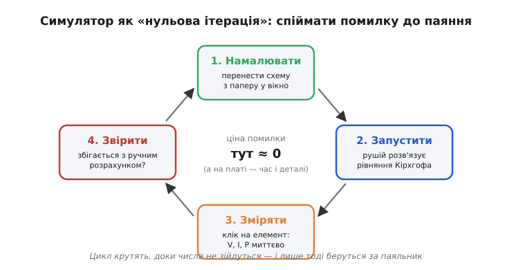
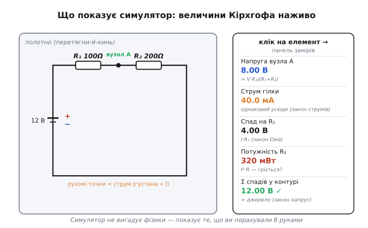

# ⚙️ Симулятор кіл (CircuitJS-клас): перевірити коло до паяння

Рахувати коло руками — спростити групи, знайти струм, розгорнути назад дільниками — добре для розуміння, але повільно й не страхує від описок. Ту саму систему рівнянь Кірхгофа машина розв'язує [методом Гаусса](root:math-algebra/gauss-elimination) усередині [SPICE](root:embedded/circuit-analysis/proj-mna-spice.md). Тут — про інший, найбуденніший інструмент інженера: як **користуватися** готовим інтерактивним симулятором (на кшталт відомого **CircuitJS** / *Falstad*-класу — схемних симуляторів, що працюють прямо в браузері), щоб **перевірити коло на екрані, перш ніж торкнутися паяльника**.

### Задача

Ви склали схему на папері — порахували струми, спади, потужності, усе ніби сходиться. Та папір не ловить **описок**: переплутаний номінал, забута земля, резистор припаяний не між тими вузлами. Спаяти й «подивитися, що буде» — дорого: згорілий світлодіод, перегрітий до запаху резистор, а інколи й мертва мікросхема — та ще й потім годину шукай, **де саме** ховається помилка. Бракує **дешевого проміжного кроку** між папером і платою: місця, де помилка коштує рівно нуль і виявляється за секунди. Саме цю роль грає інтерактивний симулятор кіл: ви малюєте схему мишею, тиснете «пуск» — і бачите розраховані напруги й струми **наживо**, ще не торкнувшись заліза.


*Цикл «перевір до паяння»: намалювати схему → запустити → клікнути на елементи й зчитати напругу, струм, потужність → звірити з ручним розрахунком. Поки числа не зійдуться — крутимо цикл; ціна помилки тут майже нульова, а на платі — це втрачений час і спалені деталі.*

### Ідея: намалював коло — рушій сам розв'язав рівняння Кірхгофа

Симулятор CircuitJS-класу влаштовано напрочуд просто **для користувача**: екран — це **полотно** (*canvas*), на яке ви перетягуєте елементи (джерело, резистори, провід, світлодіод) і з'єднуєте їх дротами. Кожне з'єднання дротом — це той самий **вузол**, а кожен елемент — **гілка** [графа кола](root:hw-analog/nodes-branches-loops). Тобто, малюючи, ви фактично будуєте граф кола — рівно той, який інакше розписували б на папері від руки.

Натиснувши «пуск», ви передаєте цей граф рушієві. А далі він робить **точнісінько те, що робив би руками інженер**, тільки автоматично й щомиті: складає рівняння Кірхгофа (закон струмів у вузлах, закон напруг у контурах, закон Ома на елементах) і розв'язує систему. Як саме він її **штампує** й розв'язує — це і є [модифікований вузловий аналіз із методом Гаусса](root:embedded/circuit-analysis/proj-mna-spice.md) із сусідньої вставки. Для вас же ця кухня схована: ви бачите лише **результат** — і бачите його **наочно**.


*Ліворуч — полотно: дільник 12 В на R₁=100 Ω і R₂=200 Ω, по дротах біжать точки струму (їхня густина пропорційна струму — там, де струму менше, потічок рідший). Праворуч — панель замірів: клікнув на елемент і одразу читаєш напругу вузла, струм гілки, спад, потужність. Це ті самі числа, що дає ручний розрахунок: напруга у вузлі A = V·R₂/(R₁+R₂) = 8 В, струм 40 мА, сума спадів = 12 В.*

Дві речі роблять такий симулятор саме **навчальним**, а не просто «калькулятором схеми». По-перше, **рухомі точки** на дротах: рушій малює струм як потічок крапок, а їхня густина та швидкість пропорційні величині струму — ви буквально **бачите**, де струму більше, де він розгалужується у вузлі (ось він, закон струмів на власні очі!) і де зовсім не тече через обрив. По-друге, **клік-замір**: тицьнувши на будь-який елемент чи вузол, ви миттєво дістаєте його напругу, струм і потужність — як ідеальний мультиметр, що не вносить похибки й не має щупів, які зісковзують. Разом це перетворює абстрактні ΣI=0 і ΣV=0 на картинку, яку видно очима.

### Робочий цикл «перевір до паяння»

Сам **порядок користування** — це короткий цикл, який варто проганяти для кожної нетривіальної схеми перед монтажем:

```
1. ПОБУДУВАТИ
   перенеси схему з паперу на полотно:
   джерело, резистори (з номіналами!), дроти-вузли;
   обов'язково постав ЗЕМЛЮ (опорний вузол) — інакше рушієві немає від чого рахувати

2. ЗАПУСТИТИ
   «пуск» → рушій складає рівняння Кірхгофа й розв'язує систему;
   глянь на рухомі точки: струм тече туди, куди задумано?

3. ЗМІРЯТИ (клік на кожен елемент)
   напруга на вузлах, струм у гілках, потужність на резисторах

4. ЗВІРИТИ із ручним розрахунком:
   для кожної величини  |симулятор − рука|  має бути малим
   ↳ якщо РОЗБІЖНІСТЬ → шукай причину:
       • описка в схемі (номінал, не той вузол, забута земля)?
       • описка в ручному розрахунку?
   ↳ повтори з кроку 1, доки не зійдеться

5. ПЕРЕВІРИТИ МЕЖІ (те, чого папір не нагадує)
   • потужність на кожному резисторі ≤ його межі (¼ Вт тощо) — не згорить?
   • струм крізь світлодіод у безпечних мА?
   • що буде, якщо номінал «попливе» на ±5 %? (покрути — побачиш чутливість)

# і лише ТЕПЕР береш паяльник
```

Ключ — крок 4: симулятор і ручний розрахунок **перевіряють одне одного**. Збіглося — ви впевнені і в схемі, і у власній арифметиці. Розійшлося — ви впіймали помилку **до** того, як вона коштувала деталей.

### Той самий розрахунок у коді прошивки

Звіряти симулятор з олівцем добре, та коли тих самих дільників десятки, рахунок зручно зробити кодом — і цей-таки клапоть стане в пригоді у прошивці, коли мікроконтролер за виміряним кодом [АЦП](root:hw-analog/adc) відновлює реальну напругу до подільника. Ось коротка, цілком робоча функція на C, що рахує те саме, що показує панель замірів симулятора, — напругу у вузлі дільника, струм і потужність на кожному резисторі:

**Дільник 12 В на R₁=100 Ω (верхнє плече) і R₂=200 Ω (нижнє): напруга у вузлі, струм, потужності.**

```c
#include <stdio.h>

typedef struct { float v_node, i, p1, p2; } Divider;

/* Vin — живлення; r1 — верхнє плече, r2 — нижнє (на землю). */
static Divider solve_divider(float vin, float r1, float r2) {
    Divider d;
    d.i      = vin / (r1 + r2);   /* спільний струм гілки  */
    d.v_node = vin * r2 / (r1 + r2); /* напруга у вузлі = спад на R2 */
    d.p1     = d.i * d.i * r1;     /* P = I²·R на кожному плечі */
    d.p2     = d.i * d.i * r2;
    return d;
}

int main(void) {
    Divider d = solve_divider(12.0f, 100.0f, 200.0f);
    printf("V(вузол) = %.2f В\n", d.v_node);  /* 8.00 В  */
    printf("I        = %.1f мА\n", d.i * 1e3f); /* 40.0 мА */
    printf("P(R1)    = %.3f Вт\n", d.p1);      /* 0.160 Вт */
    printf("P(R2)    = %.3f Вт\n", d.p2);      /* 0.320 Вт */
    return 0;
}
```

Проженімо числа в голові, щоб переконатися, що код і симулятор кажуть те саме. Спільний струм гілки: 12/(100+200) = 12/300 = 40 мА. Напруга у вузлі — це спад на нижньому плечі: 12·200/300 = 8 В (рівно те, що на панелі замірів вище). Потужності: на R₁ це 0.04²·100 = 0.16 Вт, на R₂ — 0.04²·200 = 0.32 Вт. Останнє число — корисний сигнал тривоги: 0.32 Вт уже близько до межі звичайного ¼-ватного резистора, тож R₂ варто брати щонайменше на ½ Вт. Симулятор показав би ту саму потужність — але **попередити** про перевищення межі мусите ви; це і є крок 5 циклу.

### Складність і пастки на МК

«Складність» тут не про час роботи рушія (для навчальних кіл він миттєвий), а про те, **де симулятор бреше** й чого від нього **не** варто чекати — інакше довіра до зеленої галочки на екрані зіграє злий жарт уже на реальній платі.

- **Ідеальний світ за замовчуванням.** Рушій рахує **ідеальні** елементи: дроти без опору, джерело без [внутрішнього опору](root:hw-analog/internal-resistance), резистори рівно номінальні. Реальна плата інакша: дроти й доріжки мають [власний опір](root:ph-condensed/resistivity), батарея просідає під навантаженням, номінали гуляють у межах допуску. Тому ідеальна симуляція — це **верхня межа** охайності; розбіжність із залізом нормальна, і серйозні відхилення треба моделювати свідомо — додати резистор внутрішнього опору, опір проводів абощо.
- **Збіжність і «singular matrix».** Якщо вузол **висить** (немає шляху до землі) або ви забули саму землю — система вироджена, і рушій або скаржиться, або показує нісенітні напруги. Це **та сама** вироджена матриця, що й в [MNA-вставці](root:embedded/circuit-analysis/proj-mna-spice.md): лікують її, додаючи землю й прибираючи висячі вузли. Перше правило: **спершу постав землю**.
- **Не плутати з паянням.** Симулятор перевіряє **електрику** (топологію й номінали), але не ловить **фізику монтажу**: холодну пайку, перемичку не в той рядок [макетної плати](root:hw-analog/nodes-branches-loops/comp-breadboard.md) з її підступною серединною канавкою, переплутану в житті полярність. Зелена симуляція — необхідна, але не достатня умова.
- **Межі потужності — окремо.** Рушій порахує потужність на резисторі, та сам по собі не зупинить вас від ¼-ватного резистора, що в схемі розсіює 2 Вт. Дивитися на потужність і звіряти з межею деталі, яку диктує [нагрів струмом](root:ph-electromagnetism/joule-heating), — **ваша** робота; симулятор лише дає число (як та функція вище дала 0.32 Вт — а висновок робите ви).
- **Зв'язок із теорією.** Усе, що показує симулятор, — це базова теорія кіл: [вузли й гілки](root:hw-analog/nodes-branches-loops), [закон струмів](root:hw-analog/kcl) і [закон напруг](root:hw-analog/kvl), [послідовне](root:hw-analog/series-connection) й [паралельне](root:hw-analog/parallel-connection) зведення, [дільники](root:hw-analog/voltage-divider). Тому симулятор — не «чорна скринька з відповіддю», а **тренажер інтуїції**: ви бачите наживо те, що вивели на папері, і дві картини сходяться.

Отже, інтерактивний симулятор кіл — це дешева «нульова ітерація» перед паяльником: малюєш граф кола мишею, рушій розв'язує за тебе рівняння Кірхгофа, а ти звіряєш його числа зі своїми — на папері або кодом. Він не замінює ні ручного розрахунку (бо саме розрахунок ловить помилки симуляції — і навпаки), ні фізичної перевірки на платі (бо рахує ідеальний світ). Та як проміжний фільтр він безцінний: переважна частина «дурних» помилок ловиться на екрані за секунди, а не паяльником за годину.
