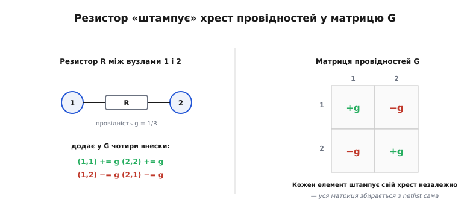
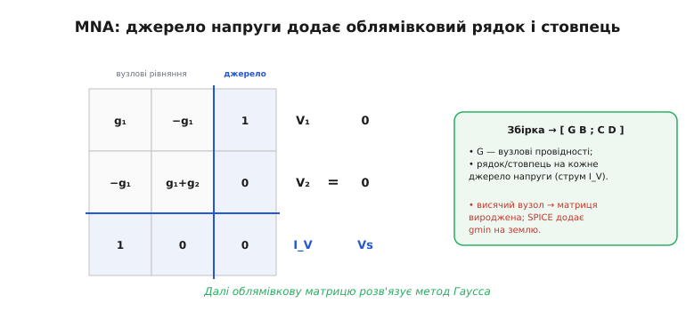

# ⚙️ Як SPICE розв'язує кола: модифікований вузловий аналіз (MNA)

Систематичний шлях розв'язати коло — це [рівняння Кірхгофа](root:embedded/circuit-analysis), а [метод Гаусса](topic:math/gauss-elimination) (послідовне виключення невідомих) їх розв'язує. Лишається питання, на яке ручний метод відповіді не дає: як **програма автоматично**, без жодної людської алгебри, перетворює намальовану схему на ту систему рівнянь? Відповідь зветься **модифікований вузловий аналіз** (*Modified Nodal Analysis*, MNA) — це робочий кінь, що б'ється в серці кожного SPICE.

### Задача

На вхід маємо **список з'єднань** (*netlist*) — суху таблицю на кшталт «резистор R1 між вузлами 1 і 2», «джерело V між вузлом 1 і землею». На виході треба **самотужки**, без участі людини, скласти матричне рівняння для невідомих і розв'язати його. За основу беруть **вузловий аналіз**: невідомі — це **потенціали вузлів** (один вузол, землю, оголошують нульовим відліком), а рівняння — [закон струмів у кожному вузлі](topic:electronics/kcl), записаний через ці потенціали й провідності. Підхід гарний тим, що рівняння виходять майже механічно. Та чистий вузловий аналіз боляче спотикається об **ідеальне джерело напруги**: воно задає різницю потенціалів, але його власний струм невідомий, а провідність «нескінченна» (опір R=0) у матрицю провідностей просто не влазить. MNA — це акуратна латка саме на цю діру.

### Ідея: штампування плюс зайві рядки

Перша половина MNA — **штампування** (*stamping*). Думка тут проста до краси: кожен елемент схеми **незалежно від усіх інших** додає свій фіксований внесок у матрицю провідностей G, ніби прикладає до неї маленький штамп у строго визначені клітинки.


*Резистор провідністю g = 1/R між вузлами 1 і 2 додає в матрицю G чотири внески: +g на діагональ у клітинки (1,1) і (2,2) та −g поза діагоналлю у (1,2) і (2,1). Кожен елемент штампує свій хрест незалежно — і вся матриця збирається з netlist сама собою, без жодної алгебри.*

Чому саме такий «хрест»? Бо рівняння вузла a — це закон струмів: сума струмів, що з нього витікають, дорівнює нулю. Струм крізь резистор із a в b дорівнює g·(V(a)−V(b)). Розкривши дужки, бачимо: потенціал самого вузла V(a) входить із плюсом (тому +g на діагональ (a,a)), а потенціал сусіда V(b) — з мінусом (тому −g у (a,b)). Той самий резистор так само з'являється і в рівнянні вузла b — звідси друга пара внесків. Джерело струму ще простіше: воно нічого не множить на потенціали, а лише вкидає свій струм у праву частину рівнянь двох вузлів, до яких приєднане. Так уся матриця G збирається одним прямим проходом по netlist.

Друга половина — власне **модифікація** заради джерел напруги, від якої метод і дістав своє ім'я. Раз струм джерела напруги нам невідомий — зробімо його **новою невідомою**, припишемо до вектора шуканих ще один рядок. А рівнянням, що його замикає, буде сама умова джерела: V(a)−V(b) = Vs. Матриця через це обростає «рамкою» — додатковим рядком і стовпцем на кожне джерело напруги.


*Структура MNA: блок G — звичайні вузлові провідності; на кожне джерело напруги додається зайвий рядок і стовпець (його струм як нова невідома та рівняння V₁=Vs). Виходить облямівкова матриця [G B; C D]·[V; I] = [Iдж; Eдж], яку далі розв'язує метод Гаусса.*

### Псевдокод складання матриці

Спершу — суть алгоритму в найчистішому вигляді, без турбот про мову:

```
G ← 0 (нулі);  rhs ← 0;  k ← число вузлів
для кожного елемента в netlist:
    якщо R між (a, b):
        g ← 1/R
        G[a][a] += g;  G[b][b] += g
        G[a][b] −= g;  G[b][a] −= g
    якщо джерело струму I з a в b:
        rhs[a] −= I;  rhs[b] += I
    якщо джерело напруги V між (a, b):     # модифікація
        k ← k+1                            # новий індекс (струм джерела)
        G[a][k] += 1;  G[k][a] += 1
        G[b][k] −= 1;  G[k][b] −= 1
        rhs[k] += V
викинути рядок і стовпець землі (вузол 0)
розв'язати  G · x = rhs                     # метод Гаусса
```

Краса в тому, що жоден елемент не «знає» про інші — кожен лише ставить свій штамп, а ціла система складається сама.

### Той самий штамп у коді

Псевдокод гарний для розуміння, та переконливіше бачити, що це справді кілька рядків робочого C, які крутяться навіть на мікроконтролері для малих кіл. Ось компактна збірка матриці резисторного кола й розв'язок прямим методом Гаусса. Для стислості тут самі резистори й джерела струму (рамку під джерела напруги дописують за тим самим псевдокодом вище):

**Дільник: джерело струму 0.12 А вкидаємо у вузол 1; R1=100 Ω між вузлами 1 і 2; R2=200 Ω від вузла 2 на землю. Знайти потенціали вузлів.**

```c
#include <stdio.h>

#define N 2                 /* вузлів, окрім землі (вузол 0) */
static double G[N][N], rhs[N];

/* штамп резистора між вузлами a і b (0 = земля, його рядок не пишемо) */
static void stamp_R(int a, int b, double r) {
    double g = 1.0 / r;
    if (a) G[a-1][a-1] += g;
    if (b) G[b-1][b-1] += g;
    if (a && b) { G[a-1][b-1] -= g;  G[b-1][a-1] -= g; }
}
/* штамп джерела струму: тече з a в b (у правій частині) */
static void stamp_I(int a, int b, double i) {
    if (a) rhs[a-1] -= i;
    if (b) rhs[b-1] += i;
}
/* розв'язок G·x = rhs на місці, метод Гаусса з вибором головного елемента */
static void gauss(int n, double A[N][N], double b[N], double x[N]) {
    for (int c = 0; c < n; c++) {
        int piv = c;
        for (int r = c+1; r < n; r++)
            if (A[r][c]*A[r][c] > A[piv][c]*A[piv][c]) piv = r;
        for (int j = 0; j < n; j++) { double t=A[c][j]; A[c][j]=A[piv][j]; A[piv][j]=t; }
        double t=b[c]; b[c]=b[piv]; b[piv]=t;
        for (int r = 0; r < n; r++) if (r != c) {
            double f = A[r][c] / A[c][c];
            for (int j = c; j < n; j++) A[r][j] -= f * A[c][j];
            b[r] -= f * b[c];
        }
    }
    for (int i = 0; i < n; i++) x[i] = b[i] / A[i][i];
}

int main(void) {
    stamp_I(0, 1, 0.12);     /* 0.12 А у вузол 1            */
    stamp_R(1, 2, 100.0);    /* R1 між 1 і 2               */
    stamp_R(2, 0, 200.0);    /* R2 від 2 на землю          */
    double x[N];
    gauss(N, G, rhs, x);
    printf("V(1) = %.2f В\n", x[0]);   /* 36.00 В */
    printf("V(2) = %.2f В\n", x[1]);   /* 24.00 В */
    return 0;
}
```

Перевіримо результат на пальцях, бо «зійшлося в голові» — найкраща гарантія, що код не бреше. Уся 0.12 А мусить пройти крізь обидва резистори послідовно (іншого шляху немає), тож вузол 2 сидить на 0.12·200 = 24 В над землею, а вузол 1 — ще на 0.12·100 = 12 В вище, тобто на 36 В. Саме це й друкує програма. А головне — ми ці числа **не виводили вручну**: ми лише поставили три штампи, і матриця з правою частиною склалися самі, точно як у великому SPICE, тільки в мініатюрі.

### Складність і пастки на МК

- **Складність.** Збірка матриці — O(числа елементів), а розв'язок методом Гаусса — O(N³); саме розв'язок і коштує найдорожче, що добре видно з потрійного циклу в коді вище. Та реальна матриця кола **розріджена** (кожен вузол зв'язаний лише з кількома сусідами, решта клітинок — нулі), тож SPICE бере **розріджені** розв'язувачі й виграє на порядки. На мікроконтролері для малих кіл згодиться й показаний повний Гаусс.
- **Вироджена матриця.** Якщо вузол **висить** — не має шляху до землі по постійному струму, — система не має єдиного розв'язку, і Гаусс наткнеться на нульовий головний елемент (ділення на нуль). SPICE підстраховується, нишком додаючи між кожним вузлом і землею крихітну провідність **gmin**, — і матриця перестає бути виродженою.
- **Суперечлива топологія.** Контур із самих лише джерел напруги або розрив із самих джерел струму переозначує систему — це теж виродження, але вже помилка самої схеми, а не методу. Машина чесно про неї скаржиться.
- **Земля обов'язкова.** Має бути опорний вузол 0, і його рядок зі стовпцем викидають із системи (у коді вище це робить кожне `if (a)` / `if (b)`). Без землі потенціали нема від чого відлічувати, і одне рівняння стає зайвим.
- **Нелінійні елементи.** Діод чи транзистор не лінійні, тож їхній «опір» залежить від напруги, якої ми ще не знаємо. MNA через це обертають у цикл **Ньютона–Рафсона**: лінеаризують елемент у поточній здогадці робочої точки, розв'язують лінійну систему, уточнюють здогадку — і так до збіжності. Але це вже наступний поверх історії.

### Звідки це взялося

Варто знати, кому ми завдячуємо цим механізмом, бо історія тут точніша за розхожу легенду «SPICE усе винайшов». Сам **SPICE** народився в Каліфорнійському університеті в Берклі: його написав **Лоренс Нейгел** (*Laurence Nagel*) під орудою наукового керівника **Дональда Педерсона** (*Donald Pederson*), розвиваючи давнішу програму CANCER. Світ почув про SPICE, коли Педерсон представив доповідь про нього на симпозіумі з теорії кіл у **квітні 1973 року**. Але — і це ключова поправка — **сам MNA у тому першому SPICE ще не використовувався**: ранні версії спиралися на звичайний вузловий аналіз із хитрою перестановкою рядків під джерела напруги. Власне модифікований вузловий аналіз сформулювали окремо — **Чун-Вень Хо, Альберт Руелі й Пірс Бреннан** з IBM у статті *«The Modified Nodal Approach to Network Analysis»* (**1975**), — і саме звідти він прийшов у SPICE2 (теж 1975) та став відтоді стандартним способом складати рівняння в усіх симуляторах. Тобто метод і програма — праця різних людей у різні роки, і плутати їх не варто.

Отак банальний netlist силою штампування й однієї «модифікації» обертається на матрицю, яку метод Гаусса розв'язує за один прохід. Знаючи цей механізм зсередини, ви розумієте і чому SPICE іноді скаржиться на «singular matrix», і чому велике коло рахується довше за мале, — бо тепер бачите машину не як чорну скриньку, а як той самий закон Кірхгофа, лише поставлений на конвеєр.
