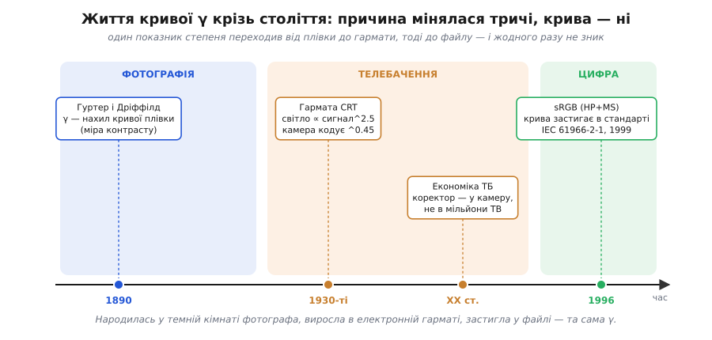

# 📜 Від електронної гармати до sRGB: життя кривої, що пережила свою причину

> Це історія однієї кривої, яка двічі змінила сенс свого існування й жодного разу не зникла. Народилася вона **не** в телевізорі, а в темній кімнаті вікторіанського фотографа — і навіть саму літеру **γ** ми носимо звідти, з 1890 року, коли про електронно-променеву трубку ще ніхто не чув. Потім цю криву привласнила фізика електронної гармати, потім — економіка телемовлення, а коли гармата зникла, крива не пішла за нею, бо до того часу за неї вже трималося пів цивілізації. Розберімо, як випадковий нахил на фотопластинці став контрактом, якого дотримується кожен PNG на вашому екрані.

У [темі-власниці](root:embedded/color-management) ми вже з'ясували головне: число в пікселі — не яскравість, між ними стоїть степенева крива з показником близько 2.2, і дісталася вона нам від CRT, та втрималася, бо ще й збігається з нелінійністю ока. Це **правда**, але правда стиснута до одного абзацу. За кожним її словом — конкретні люди, конкретні суперечки й кілька фактів, що, чесно кажучи, суперечать спрощеній версії. Розгорнімо.

---

## Літера, яку ми вкрали у фотографів

Почнімо з найприкрішого непорозуміння. Майже всюди вам скажуть, що «гама — це крива CRT». Але **слово** *gamma* у цьому значенні з'явилося за пів століття до телебачення й не має до трубки жодного стосунку. Воно прийшло з **фотографічної сенситометрії** — науки про те, як срібло на плівці чорніє від світла.

Двоє людей, що її заклали, — пара, гідна окремої повісти. **Фердинанд Гуртер** (*Ferdinand Hurter*, 1844–1898) — швейцарський хімік, що вчився в самого **Роберта Бунзена** (хімія) і **Густава Кірхгофа** (фізика), а 1871 року став головним хіміком содового заводу Ґаскелла-Дікона в містечку Віднес у Ланкаширі. Його напарник **Веро Чарлз Дріффілд** (*Vero Charles Driffield*, 1848–1915) — англійський інженер-хімік, що прийшов на той самий завод того ж 1871 року. Подружилися вони **через музику**, а близько 1876-го Дріффілд умовив Гуртера взятися за фотографію як хобі. Двоє заводських хіміків від нудьги вирішили зробити фотографію **точною наукою** — і зробили.

До них експозиція була шаманством: «потримай довше», «прояви на око». Гуртер і Дріффілд 1890 року опублікували працю, де вперше **виміряли** зв'язок між кількістю світла, що впало на пластину, і **почорнінням** (оптичною щільністю) проявленого срібла. Якщо відкласти щільність проти **логарифма** експозиції, виходить характерна крива у формі витягнутої букви S — її й досі звуть **кривою Гуртера-Дріффілда** (*H&D curve*), або характеристичною кривою плівки. Унизу (недодержка) і вгорі (передержка) криву загинає в плечі, а посередині йде **рівна пряма** ділянка — робочий діапазон плівки.

І ось ключ. Нахил тієї прямої ділянки — наскільки круто щільність росте з логарифмом світла — Гуртер і Дріффілд позначили грецькою буквою **гама**, **γ**. Це була міра **контрастности** плівки: велика γ — контрастна, «жорстка» плівка; мала γ — м'яка, з плавними переходами.

```
γ (фотографічна) = нахил прямої ділянки кривої щільність-проти-log(експозиція)
                 = міра контрастности плівки
```

Тобто від самого народження **гама означала «показник степеня, що описує контраст відгуку на світло»**. Коли через десятиліття інженери телебачення зіткнулися з трубкою, чия яскравість теж залежить від сигналу за степеневим законом, вони, не вигадуючи нового, **позичили готову букву** в фотографів — бо математично це те саме: показник степеня контрастної передачі. Так слово переїхало з плівки на екран, лишивши по дорозі плутанину, яка триває донині.

> 🔧 **Навіщо це.** Знати справжнє коріння терміна — не педантизм. Це одразу пояснює, чому «гама» означає геть різні речі в різних розмовах: для фотографа це **контраст** (нахил), для відеоінженера — **показник степеня EOTF**, для дизайнера — «та крива в налаштуваннях монітора». Усе це **одна сім'я**, але плутати їх — пряма дорога до помилки. Коли в документації на ваш контролер дисплея написано «gamma 2.2», ви тепер знаєте, що це нащадок нахилу на вікторіанській фотопластинці, а не якесь окреме магічне число.

Цікаво, що Гуртер до тріумфу не дожив: він помер 1898 року, того самого, коли Королівське фотографічне товариство присудило обом напарникам свою Медаль за поступ. Швейцарський хімік, що приніс число в темну кімнату, залишив по собі літеру, якою ми досі міряємо світло на екранах. Статус цього факту — **усталений**: і авторство кривої, і походження терміна добре задокументовані первинними публікаціями.

---

## Гармата: чому світло росте швидше за сигнал

Тепер до трубки — і тут теж є нюанс, повз який спрощені пояснення прослизають. У [темі](root:embedded/color-management) сказано: яскравість CRT росте «приблизно як степінь 2.2–2.5 напруги», бо «така геометрія гармати». Це правильно, але варто зрозуміти **механізм**, бо інакше легко повірити в поширену хибну версію.

Згадаймо, як влаштована [електронно-променева трубка](book:electronics/crt-tube). Розжарений катод кидає хмару електронів. Перед ним стоїть **сітка** (*grid*) — електрод із керованою напругою. Що від'ємніша напруга на сітці, то сильніше вона **відштовхує** електрони назад до катода, і то менший пучок проривається крізь неї до екрана. Ослабивши сітку (зробивши напругу менш від'ємною), ми відкриваємо більший потік. Тобто **напруга сигналу на сітці керує струмом пучка**, а струм пучка визначає, скільки світла дасть люмінофор.

Перша спокуса — пояснити степінь через **закон Чайлда-Ленґмюра** (*Child-Langmuir law*), знаменитий «закон трьох других»: у вакуумному діоді струм, обмежений просторовим зарядом, росте як напруга **в степені 1.5**.

```
закон Чайлда-Ленґмюра (діод):  струм ∝ напруга^1.5
```

Гарно — але це **не та цифра** й, строго кажучи, **не той механізм**. 1.5 — це степінь для простого діода в режимі просторового заряду. Гама ж реальної трубки — близько **2.5** (а в різних трубок від 2.2 до 2.8). Звідки зайва степінь?

Відповідь, яку дають фахівці (і яку варто запам'ятати правильно): гама CRT походить **не** з простого закону діода, а з **геометрії триодної частини гармати** — з того, як саме змодельовано форму електричного поля між сіткою й катодом, з відстаней між електродами, з так званої **характеристики відсікання** сітки. Сітка не просто «менше пропускає» — вона нелінійно **формує** пучок, і ця нелінійність накладається на нелінійність самого просторового заряду. У підсумку залежність *світло від напруги сигналу* виходить крутіша за чистий діодний закон і лягає десь на 2.2–2.8, з типовим значенням близько 2.5. Цей показник **фіксований** для даної трубки з правильно виставленим рівнем чорного — він не налаштовується, бо вшитий у фізичну будову гармати.

```
світло на люмінофорі ≈ напруга_сигналу^γ_трубки     γ_трубки ≈ 2.5  (2.2 … 2.8)
                                                     причина — геометрія гармати,
                                                     а НЕ лише закон Чайлда-Ленґмюра
```

> 🔧 **Навіщо це.** Тут схована типова пастка інженерного мислення: знайти красивий закон (1.5) і притягнути його до явища, де він майже, але **не зовсім** працює. Закон Чайлда-Ленґмюра реальний і важливий, але число CRT-гами він **сам по собі не дає** — потрібна геометрія конкретної гармати. Корисний рефлекс на все життя: коли формула дає «майже те, але не зовсім», не натягуйте її — шукайте, який **додатковий** фізичний чинник дотягує решту. Тут цей чинник — форма поля в триоді гармати.

Найважливіше для нас — наслідок, а не точний вивід. Будь-яка CRT мала круту степеневу криву близько 2.5: **малий сигнал давав непропорційно мало світла**. Подай половину розмаху напруги — отримаєш не половину яскравости, а близько 0.5²·⁵ ≈ **0.18**, менш ніж п'яту частину. Картина на такому екрані без виправлення була б провально темною в усіх середніх тонах.

---

## Розумна лінь телебачення: де поставити коректор

Раз трубка темнить, картину треба **висвітлити** наперед — закодувати сигнал оберненою кривою, щоб трубка своєю кривою його випрямила. Питання лише одне, але **доленосне**: де поставити цей коректор — у кожному телевізорі чи в камері?

І ось рішення, у якому видно холодний інженерний розрахунок, що визначив усе наступне. У 1930-х, коли народжувалося електронне телебачення, **камер були одиниці, а приймачів — мільйони**. Покласти коригувальну схему в кожен домашній телевізор означало б помножити вартість і складність на мільйони пристроїв. Покласти її **в камеру** — означало заплатити за неї лічену кількість разів, на боці мовника. Вибір очевидний: **коригуй біля джерела**.

Так усталилася асиметрія, що живе досі. **Камера** кодує сигнал оберненою кривою — приблизно у степені **0.45** (це майже точно 1/2.2). Її так і звуть — **OETF**, оптично-електронна передавальна функція (*opto-electronic transfer function*): світло сцени → електричний сигнал. А **приймач** не робить **нічого спеціального** — він просто показує сигнал на трубці, і та своєю фізичною кривою 2.5 виконує зворотне перетворення задарма. Це **EOTF**, електронно-оптична функція (*electro-optical transfer function*): сигнал → світло екрана.

```
КАМЕРА (OETF):   сигнал = світло_сцени^0.45      ← навмисний коректор, платимо раз
ПРИЙМАЧ (EOTF):  світло_екрана = сигнал^2.5       ← фізика трубки, безкоштовно
```

Геніальність у тому, що дорогу частину поставили туди, де її мало, а безкоштовну фізику трубки **використали** замість того, щоб із нею боротися. Половину «нелінійности» взяв на себе мовник, другу половину дарма зробила сама природа CRT. Це, мабуть, найекономніше інженерне рішення в історії медіа — і саме воно прирекло гаму на безсмертя: коректор тепер сидів **у форматі сигналу**, тобто в кожній плівці, у кожному записі, у кожній майбутній цифровій картинці.

> 🔧 **Навіщо це.** Цей сюжет — еталон принципу «постав вартість туди, де її помножиться найменше». Він повторюється у вбудованих системах щодня: винести обчислення з гарячого циклу в передобчислення, з кожного пристрою — на сервер, із рантайму — у таблицю. Гама-кодування — історично перший масовий приклад: одну операцію зробили один раз на боці одиничного джерела, замість мільйонів разів на боці приймачів. Коли проєктуєте систему, питайте те саме: де ця дія коштуватиме найдешевше, якщо її там зосередити?

---

## Несподіванка: на виході **не** пряма лінія

А тепер факт, який спрощена версія обходить, а він — справжній і важливий. У [темі](root:embedded/color-management) сказано, що дві криві, 0.45 і 2.2, «навмисне підібрані одна під одну, дають у підсумку пряму лінію». Це **корисне наближення**, але **не зовсім правда**, і неправда — навмисна.

Перемножимо показники чесно. Якби камера кодувала рівно у 0.45, а трубка декодувала рівно у 2.2, наскрізний степінь був би 0.45 × 2.2 ≈ **1.0** — справді пряма. Але реальні стандарти телебачення цілять **не** в одиницю. Наскрізна «системна гама» (її звуть **OOTF**, оптично-оптична функція, або *end-to-end gamma*) сучасного телебачення задумана близько **1.2**, а не 1.0.

```
наскрізний степінь = OETF × EOTF
наївно очікуване:    0.45 × 2.2 ≈ 1.0   (рівно пряма)
насправді задумане:  ≈ 1.2              (навмисний легкий «контраст»)
```

Навіщо ламати ідеальну пряму? Через **умови перегляду**. Картину дивляться не в тій яскравій студії, де її знято, а в **затемненій** кімнаті, на екрані, що світиться серед темряви. А око в темному оточенні сприймає контраст **інакше**: те саме зображення здається **пласкішим**, ніж у яскравому світлі. Це давно виміряний психофізичний ефект (його пов'язують з іменами **Бартлсона** і **Бренемана**, *Bartleson-Breneman*): темне оточення «з'їдає» відчуття контрасту. Щоб глядач у темній вітальні побачив **той самий** контраст, що був на сцені, картину навмисне роблять трохи контрастнішою — наскрізну гаму піднімають з 1.0 до ~1.2.

Отже, телевізійний ланцюг **ніколи не цілив у чесну пряму**. Він цілив у пряму **плюс свідома поправка на психологію темної кімнати**. Спрощення «дві криві гасять одна одну» добре передає головну ідею, але інженер мусить знати, що насправді там сидить ще й тонке око психофізики. Статус — **усталений факт**: системна гама ~1.2 прямо записана в обґрунтуваннях телевізійних стандартів.


*Один показник степеня крізь століття. Синє — фотографія: Гуртер і Дріффілд (1890) дають кривій ім'я γ як мірі контрасту плівки. Помаранчеве — телебачення: фізика гармати CRT (≈2.5) і дзеркальний коректор камери (≈0.45), зведені економікою «коригуй у джерелі». Зелене — цифрова доба: коли трубка зникає, галузь не скидає криву, а закріплює її стандартом sRGB (1996). Причина кривої тричі мінялася — крива лишалася та сама.*

---

## Коли причина зникла, а звичка лишилася

1990-ті. Електронно-променева трубка доживає віку: на стіл приходять плаский [рідкокристалічний дисплей](root:embedded/display-classes) і згодом OLED. Ні той, ні той **не мають електронної гармати** — отже, не мають і її фізичної кривої 2.5. Здавалося б, настала мить скинути історичний баласт: будуймо нові панелі **лінійними**, число = яскравість, і покінчимо з гамою назавжди.

Цього **не сталося** — і не через інерцію, а через два тверезі розрахунки.

**Перший — гори вже наявного матеріалу.** За пів століття під трубку викривили **геть усе**: кожен телезапис, кожну плівку, кожен цифровий файл зображення. Усі вони містять сигнал, **уже закодований** оберненою кривою в розрахунку на декодування степенем ~2.2. Випусти на ринок «чесний лінійний» дисплей — і він покаже **весь цей світ неправильно**, провально темним. Нова панель **мусила** прикидатися трубкою, інакше була б несумісна з усім, що людство назнімало. Простіше навчити панель (чи її контролер) **відтворювати** стару криву декодування, ніж переробити всі архіви світу.

**Другий — той самий збіг з оком**, який ми розбирали в [темі](root:embedded/color-management): гама-кодування ще й **ощадливе**, бо віддає темним тонам більше кодів там, де око гостріше. Навіть якби сумісність не тиснула, кодувати яскравість степеневою кривою все одно вигідно при 8 бітах на канал. Дві причини — сумісність і перцепція — знову вказали в один бік.

Тож галузь зробила прагматичну річ: **зберегла криву, але домовилася про її точну форму**. Доти кожен виробник викривлював сигнал «приблизно на 2.2», без єдиної міри — і та сама картинка на різних екранах виглядала по-різному. Час було прибити цифру цвяхом.

---

## sRGB: коли «приблизно 2.2» стало законом

**1996 року** дві компанії — **Hewlett-Packard** і **Microsoft** — запропонували спільний стандарт колірного простору для моніторів, принтерів та інтернету. Назвали його **sRGB** (*standard RGB*). Точну дату й авторів варто назвати поіменно, бо це добре задокументовано: специфікацію оприлюднено **5 листопада 1996 року**; автори — **Майкл Стокс** (*Michael Stokes*) і **Рікардо Мотта** (*Ricardo Motta*) від Hewlett-Packard, **Метью Андерсон** (*Matthew Anderson*) і **Срінівасан Чандрасекар** (*Srinivasan Chandrasekar*) від Microsoft. Через три роки стандарт закріпили міжнародно: **IEC 61966-2-1**, виданий у **жовтні 1999 року**.

Мотивація була цілком практична й дуже «свого часу»: народжувався масовий веб, картинки гуляли між незнайомими пристроями, і конче бракувало **спільного припущення за замовчуванням** — у якому просторі вважати колір, якщо про нього нічого не сказано. sRGB і став цим припущенням. Донині: якщо до зображення не додано колірного профілю, його майже напевно слід читати як sRGB. Ваші іконки, скриншоти, фото з телефона — усе це числа в sRGB, поки не сказано інше.

> 🔧 **Навіщо це.** Сила sRGB — не в точності (є простори ширші й вірніші), а в тому, що це **спільна мова за замовчуванням**. Для вас як розробника вбудованої системи це означає просту річ: коли дизайнер дає вам колір «#3A7BD5», він майже напевно має на увазі sRGB — і ваша панель, що декодує приблизно тією ж кривою 2.2, покаже його приблизно правильно **без жодного зусилля з вашого боку**. Уся ця історія працює на вас мовчки. Знати її треба рівно для того, щоб не зламати, коли почнете кольори **рахувати**, а не лише показувати.

---

## Складена крива: чому чистого степеня виявилося замало

І остання тонкість, заради якої sRGB вартий окремого слова. У [темі](root:embedded/color-management) згадано, що замість чистого степеня sRGB бере **складену** криву: коротка пряма ділянка біля чорного плюс степенева для решти. Розгорнімо, **чому** так, бо причина гарна й повчальна.

Уявіть чистий степінь зі зворотним показником, скажімо код = світло^(1/2.4), біля самого нуля. Похідна такої функції в нулі **вистрілює в нескінченність**: нескінченно малій зміні світла відповідає скінченна зміна коду. На практиці це означає, що в найтемніших тонах крива стає божевільно крутою — найдрібніший шум сенсора чи округлення роздуваються у видимі стрибки. Геометрично чистий степінь біля нуля **погано поводиться**.

Розв'язок елегантний: біля чорного криву **підміняють короткою прямою** з кінцевим нахилом, а далі, де степінь уже поводиться чемно, переходять на степеневу частину. Точні числа sRGB такі (їх варто бачити хоч раз, навіть якщо ви ними не користуватиметеся щодня):

```
кодування (лінійне світло L → код C, обидва в [0..1]):

    C = 12.92 · L                       якщо L ≤ 0.0031308     ← пряма біля чорного
    C = 1.055 · L^(1/2.4) − 0.055       якщо L > 0.0031308     ← степенева частина
```

Зверніть увагу на дрібну несподіванку: показник у формулі — **2.4**, а не 2.2. Як же sRGB лишається «гамою 2.2»? А отак: коротка лінійна ділянка біля чорного трохи висвітлює тіні, і **в сумі** складена крива (лінійна вставка плюс степінь 2.4) поводиться **в середньому** як чистий степінь близько **2.2**. Тобто 2.2 — це **ефективний** показник усієї складеної кривої, а 2.4 — показник лише її степеневої частини. Звідси й вічна плутанина «sRGB — це 2.2 чи 2.4?»: обидва числа правильні, просто про різні речі.

```
2.4  →  показник СТЕПЕНЕВОЇ частини формули
2.2  →  ЕФЕКТИВНА гама всієї складеної кривої (степінь + лінійна вставка)
```

Є й тонша причина саме такого нахилу. sRGB задумано для перегляду в **тьмяно освітленій** кімнаті (стандарт називає орієнтир оточення близько 64 люкс) — тобто з тією самою поправкою на психологію оточення, що ми бачили в телебаченні. Ефективні 2.2 на яскравому моніторі в напівтемряві дають оку приблизно той контраст, який глибші 2.4 дали б у зовсім темному кінозалі. Усе той самий мотив: крива підлаштована не лише під фізику, а й під **умови, в яких дивляться**.

Для вбудованої системи всю цю точність зазвичай **не розгортають**: степінь 2.2 — цілком добре наближення sRGB, а складену формулу з лінійною вставкою беруть, лише коли треба бездоганна якість (колориметр, медичний екран). Але знати, що під «гамою 2.2» ховається складена крива з показником 2.4 і прямою біля чорного, — корисно: одного дня ви побачите в datasheet контролера саме ці числа й не розгубитеся.

---

## Що з цієї історії забрати

Зведімо нитку, бо вона варта того. Крива, якою ми щодня кодуємо колір, прожила **три життя** під одним ім'ям. Спершу це був **нахил на фотопластинці** — міра контрастности плівки, яку швейцарський хімік Гуртер і англійський інженер Дріффілд 1890 року позначили буквою γ. Потім фізика **електронної гармати** дала трубці круту криву близько 2.5 (через геометрію триода, а не лише через закон Чайлда-Ленґмюра), і телебачення дзеркально випрямило її коректором ~0.45 — поставивши його в камеру, а не в мільйони приймачів, із холодного економічного розрахунку, та ще й з навмисною поправкою на темну кімнату (наскрізна гама ~1.2, не 1.0). А коли трубка зникла, крива **не пішла за своєю причиною**: її втримали гори вже закодованого матеріалу й щасливий збіг з нелінійністю ока — і 1996 року HP з Microsoft закарбували її в стандарті sRGB (IEC 61966-2-1, 1999), де чистий степінь обережно замінили складеною кривою з лінійною вставкою біля чорного.

Головний урок — не про колір, а про **техніку взагалі**. Інженерне рішення живе **довше за причину**, що його породила, якщо встигає вкорінитися в усьому, що від нього залежить. Гама-крива пережила і фотоплівку, і електронну гармату, бо до моменту смерті кожної своєї причини вона вже сиділа в форматах, файлах і звичках усієї галузі. Коли ви закладаєте формат, протокол чи угоду за замовчуванням — пам'ятайте: якщо за неї вхопляться, вона переживе ваші мотиви на десятиліття. Гама — найдовший такий контракт у всій історії зображення, і ви тримаєте його кінець щоразу, коли пишете байт у кадровий буфер.
