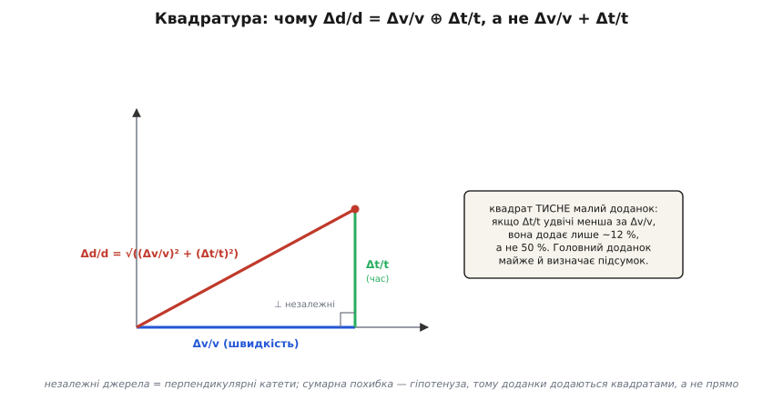
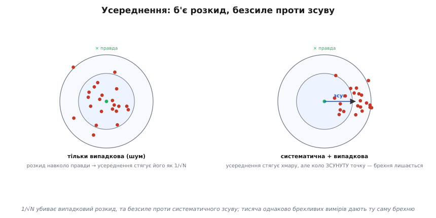

# 🧮 Звідки береться ± у далекомірі: поширення похибок часу польоту

У детальному розборі ми записали, що повна похибка вимірювання часом польоту складається за правилом

```
Δd/d = Δv/v ⊕ Δt/t
```

і пообіцяли довести це «до кістки»: чому саме **квадратура** (той значок ⊕), а не проста сума; чому один доданок **усереднюється**, а другий — ні; і як із цього зібрати чесну цифру ± для конкретного давача. Оце й зробимо. Тема здається сухою — «поширення похибок», формули з частковими похідними, — але за нею стоїть дуже конкретне інженерне питання: **коли давач напише «3.43 метра», скільки в цьому числі правди?** Не «яка в нього точність за паспортом», а звідки та точність береться, які її складники, котрий із них головний саме у вас — і що з кожним можна вдіяти.

Ниткою веде одна формула, яку ми вже знаємо напам'ять:

```
d = v · t / 2
```

Уся гра тут у тому, що ні `v`, ні `t` ми **не знаємо точно**. Швидкість `v` ми звідкись **взяли** (з таблиці, з датчика температури, зі стелі), і вона може бути не та. Час `t` ми **зміряли**, а будь-який вимір несе шум і має скінченний крок. Дві недосконалі величини перемножуються — і питання в тому, як їхні недосконалості **проходять крізь множення** й що дають на виході. Це і є поширення похибок (англ. *error propagation* — «поширення похибки»): простежити, як невизначеність входу перетворюється на невизначеність результату.

## Спершу — одна змінна: похідна як передавальне число

Почнімо з найпростішого й найважливішого. Забудьмо на хвилину про швидкість — хай `v` **точно відома**, а хитається лише час `t`. Наскільки схибить `d`, якщо `t` зміряно з маленькою похибкою Δt?

Відповідь дає сама форма функції. Візьмімо `d = v·t/2` й погляньмо, як `d` реагує на **крихітний** приріст `t`. Приросту Δt відповідає приріст Δd, і зв'язок між ними — це **похідна** функції `d` по `t`:

```
d = v·t/2
∂d/∂t = v/2
⇒  Δd = (∂d/∂t) · Δt = (v/2) · Δt
```

Ось де ховається глибша ідея, ніж «взяли похідну». Похідна ∂d/∂t — це **передавальне число** входу на вихід: наскільки сильно маленьке ворушіння входу штовхає вихід. Для добутку `d = v·t/2` це число дорівнює `v/2` — і воно **стале**, не залежить від того, де ми на шкалі. Тому похибка часу входить у похибку відстані **лінійно**, помножена на `v/2`. Це той самий важіль, який у детальному розборі робив звук і світло різними інструментами: `v/2` для звуку — крихітне, для світла — велетенське, тож та сама Δt дає радикально різні Δd.

> 🔧 **Навіщо це.** Похідна ∂d/∂t = v/2 — це не абстракція, а готова відповідь на питання «чи вистачить мого таймера?». Передавальне число каже: кожна мікросекунда невизначеності часу коштує `v/2` мікросекунд-на-метр похибки відстані. Знаєш `v` — знаєш ціну секунди у метрах, і одразу видно, наносекундний тобі потрібен годинник чи вистачить простого лічильника.

Чому взагалі можна обійтися **похідною**, а не рахувати точно? Бо похибки — **малі**. Δt — це не «пів-часу», а його дрібна частка: тремтіння в кілька мікросекунд на тлі мілісекунд польоту. А для малих приростів будь-яка гладка функція поводиться як **пряма** — це і є суть лінеаризації (лат. *linea* — лінія): у малому околі криву заступає її дотична, а нахил дотичної — то й є похідна. Тому Δd ≈ (нахил)·Δt тим точніше, чим менша Δt; для реальних похибок далекоміра ця точність більш ніж достатня. Якби похибки були величезними, довелося б рахувати чесно, через саму функцію, — але тоді й казати «похибка ±» уже не мало б сенсу.

## Дві змінні: часткові похідні й повний диференціал

Тепер відпустимо друге припущення. Насправді хитаються **обидві** величини: і час `t`, і швидкість `v`. Це принципово міняє картину, бо тепер похибка `d` набігає з **двох джерел** одразу, і треба зрозуміти, як вони складаються.

Ідея та сама — лінеаризація, — лише тепер функція двох змінних `d(v, t) = v·t/2`. Маленький зсув результату Δd набігає від зсуву `v` **і** від зсуву `t`. Внесок кожного окремо — це знову передавальне число цієї змінної (тепер **часткова** похідна: наскільки міняється `d`, коли ворушимо **тільки цю** змінну, а друга заморожена) на зсув самої змінної:

```
∂d/∂v = t/2      (наскільки d реагує на зсув швидкості; час заморожений)
∂d/∂t = v/2      (наскільки d реагує на зсув часу; швидкість заморожена)
```

А повний зсув результату — **сума** двох внесків. Це називають повним диференціалом (лат. *differentia* — різниця):

```
Δd = (∂d/∂v)·Δv + (∂d/∂t)·Δt = (t/2)·Δv + (v/2)·Δt
```

Прочитаймо цей рядок. Він каже: помилка у відстані — це помилка у швидкості, помножена на `t/2`, **плюс** помилка в часі, помножена на `v/2`. Кожне джерело йде зі своїм передавальним числом. Поки що це проста сума — але вона описує **найгірший** випадок, коли обидві помилки штовхають результат в один бік водночас. Чи так буде насправді — залежить від того, **пов'язані** джерела чи ні. До цього ми зараз і дійдемо; спершу перепишемо суму в зручнішому вигляді.

## Від абсолютних до відносних: чому виходить чиста квадратура множників

Абсолютні похибки (`Δd` у метрах, `Δv` у м/с, `Δt` у секундах) незручні — вони в різних одиницях, їх важко порівнювати. Куди природніше говорити **відносно**: «на скільки відсотків» хитається кожна величина. Поділімо весь попередній рядок на `d = v·t/2`:

```
Δd     (t/2)·Δv     (v/2)·Δt
──  =  ─────────  +  ─────────
 d       v·t/2         v·t/2
```

І тут стається краса, заради якої добуток узагалі люблять аналізувати у відносних величинах. У першому доданку `t/2` згори скорочується з `t/2` знизу; у другому — `v/2` скорочується з `v/2`. Залишається:

```
Δd     Δv     Δt
──  =  ──  +  ──
 d      v      t
```

Ось воно — те, що обіцяли: **відносна похибка добутку — це сума відносних похибок множників**. Жодних передавальних чисел `t/2` чи `v/2` не лишилося: для добутку (і для частки — там те саме з мінусом, що для квадрата похибки байдуже) вони чарівно випаровуються. Це загальне правило, а не властивість саме далекоміра: коли величина є **добутком** інших, її відносна похибка складається з відносних похибок співмножників. Двійка в `v·t/2` теж зникла — стала множник на **відносну** похибку не впливає (він однаково згори й знизу). Двійка живе в самому значенні `d`, але не в тому, на скільки відсотків воно непевне.

Це вже дуже практично: не треба тягати одиниці, досить сказати «швидкість непевна на 8 %, час — на 0.5 %». Але формула вище ще неповна: вона знову описує **найгірший** випадок — коли обидві відсоткові похибки складаються в один бік. Пора розібратися, коли це справедливо, а коли — надто песимістично.

## Серце теми: чому незалежні похибки додаються квадратами

Питання, від якого залежить усе: коли давач помиляється у **швидкості** на +8 % — чи означає це, що він **водночас** помилиться в часі теж «угору», щоб обидві біди склалися? Чи ці дві помилки живуть **окремо**, кожна сама по собі?

Відповідь очевидна, щойно спитати прямо. Похибка швидкості береться з того, що ми **заклали не ту `v`** (взяли для 20 °C, а надворі мороз). Похибка часу — з **шуму засічки** й кроку таймера. Ці дві речі **не мають спільної причини**: температура повітря ніяк не змовляється з тремтінням компаратора. Вони **незалежні**. А незалежні помилки не тримаються за руки: коли одна тягне результат угору, друга з рівною ймовірністю тягне вниз, угору чи вбік — вони не знають одна про одну.

Що це дає числово? Уявімо, ми міряємо **багато** разів. Похибка швидкості (якщо вона теж випадкова від виміру до виміру — скажімо, шум датчика температури) щоразу трохи інша, і похибка часу теж. Іноді обидві збіглися вгору — велика сумарна помилка; іноді одна вгору, друга вниз — вони **погасили** одна одну; частіше — щось середнє. Простою сумою `Δv/v + Δt/t` ми б рахували так, ніби вони **завжди** збігаються, — а це буває **рідко**. Правильна міра типового розкиду суми двох незалежних випадкових доданків — не сума їхніх розмахів, а **корінь із суми квадратів**:

```
Δd     ┌────────────────
──  =  │ (Δv/v)² + (Δt/t)²
 d     └√
```

Саме це й ховається за значком ⊕ у скороченому записі `Δd/d = Δv/v ⊕ Δt/t`: «додати у квадратурі», тобто скласти квадрати й узяти корінь. Це не інженерна умовність, а прямий наслідок статистики: дисперсія (міра розкиду) суми незалежних величин дорівнює **сумі дисперсій**, а дисперсія — це квадрат типового відхилення. Тому складаються саме **квадрати** відхилень, а корінь повертає нас до звичайних одиниць похибки.

Є навдивовижу наочний спосіб це побачити — **геометричний**. Уявіть дві незалежні похибки як два відрізки, спрямовані **під прямим кутом** один до одного: незалежність — це і є «перпендикулярність», відсутність спільного напрямку. Тоді сумарна похибка — не сума довжин катетів, а **гіпотенуза** трикутника, а її дає теорема Піфагора: корінь із суми квадратів. Залежні похибки лежали б **уздовж однієї прямої** (спільна причина — спільний напрямок), і тоді довжини й справді склалися б просто. Незалежні стоять поперек — і працює Піфагор.


*Чому квадратура, а не сума. Незалежність джерел — це прямий кут між ними: похибка швидкості Δv/v і похибка часу Δt/t не мають спільного напрямку. Сумарна відносна похибка — гіпотенуза, а не сума катетів. Наслідок практичний: квадрат тисне менший доданок, тож головне джерело майже само визначає підсумок.*

З квадратури випливає наслідок, який заощаджує купу зусиль. **Квадрат безжально тисне менший доданок.** Хай похибка часу вдвічі менша за похибку швидкості: Δt/t = 0.5·(Δv/v). Порахуймо, скільки вона додає:

```
Δd/d = √( (Δv/v)² + (0.5·Δv/v)² ) = (Δv/v)·√(1 + 0.25) = (Δv/v)·√1.25 ≈ 1.118·(Δv/v)
```

Менший доданок, удвічі менший за головний, роздув підсумок лише на **~12 %**, а не на 50 %, як дала б наївна сума. А якби він був утричі менший, додав би взагалі ~5 %. Звідси золоте правило бюджету похибок: **знайди найбільше джерело — воно майже й визначає підсумок; дрібні можна навіть не рахувати точно.** Це не лінь, а математика кореня зі суми квадратів.

> 🔧 **Навіщо це.** Оце й є найкорисніший висновок усієї теми для практика. Не треба героїчно вилизувати кожне джерело похибки — треба знайти **домінантне** й бити по ньому. В ультразвуковому далекомірі на вулиці домінує майже завжди `Δv/v` від температури: вона легко 8 %, тоді як `Δt/t` доброго таймера — частки відсотка. Отже, поставив датчик температури — прибрав 8 %, а підсумкова похибка впала майже до рівня самого таймера. Вилизувати таймер до пікосекунд, поки в тебе гуляє швидкість, — це шліфувати ручку, коли протікає дах.

Одне важливе застереження, щоб не збрехати. Квадратура законна **тільки** для **незалежних** джерел. Якщо два джерела мають **спільну** причину (наприклад, і швидкість, і затримку електроніки веде та сама температура плати), вони **корельовані** — тягнуть в один бік разом, — і квадратура **занижує** реальну похибку; там треба або складати прямо, або враховувати кореляцію чесно. Тому перший тест перед квадратурою — спитати: **чи справді ці джерела нічого спільного не мають?** Для «швидкість від погоди» проти «шум таймера» — так, вони незалежні. Але сліпо квадратурити все підряд не можна.

## Два характери похибки: систематична проти випадкової

Тепер найважливіше розрізнення в усій метрології, і воно змінює те, **що з похибкою можна вдіяти**. Два доданки нашої формули — `Δv/v` і `Δt/t` — не просто мають різну величину. Вони мають різну **природу**, і через це на них діють різні ліки.

Придивімося до похибки **часу** `Δt/t`. Звідки вона: шум компаратора, тремтіння моменту перетину порогу, дискретність таймера (про це окремо нижче). Спільне в них те, що **від виміру до виміру вона різна** — щоразу трохи інша, то плюс, то мінус, без пам'яті про попередній раз. Така похибка дає **розкид** навколо правильного значення: справжня відстань стала, а покази стрибають довкола неї хмаркою. Це **випадкова** похибка (лат. *casus* — випадок).

Тепер похибка **швидкості** `Δv/v`, коли ми зашили сталу `v = 343` для 20 °C, а надворі −10 °C. Вона **однакова в кожному вимірі**: щоразу ми ділимо на ту саму невірну швидкість, тож кожен показ завищений **на той самий множник**. Це не розкид — це **зсув** усієї шкали в один бік. Така похибка зветься **систематичною** (гр. *sýstēma* — злагоджене ціле): вона діє злагоджено, однаково, у кожному вимірі.

І ось у чому вся сіль — **лікуються вони протилежно**:

- **Випадкову вбиває усереднення.** Зроби N вимірів і візьми середнє: випадкові відхилення, будучи то плюс, то мінус, у середньому **гасяться**. Не до нуля, але передбачувано: розкид середнього спадає як **1/√N**. Сто вимірів — розкид у десять разів менший. Це прямий наслідок тієї ж статистики незалежних величин, що дала квадратуру.
- **Систематичну усереднення НЕ бере.** Якщо кожен вимір завищений на 5 %, то й середнє тисячі вимірів завищене рівно на ті самі 5 %. Тисяча однаково брехливих чисел дають ту саму брехню, лише з гарними трьома знаками після коми. Зсув прибирається **не статистикою, а знанням**: треба виміряти справжню `v` (датчиком температури) або відкалібрувати нуль.


*Два характери похибки під усередненням. Ліворуч — лише випадкова: покази розсипані навколо правди, і усереднення стягує хмару до центру як 1/√N. Праворуч — плюс систематичний зсув: усереднення так само стягує хмару, але коло **зсунуту** точку — брехня лишається. Тому 1/√N рятує від шуму, але безсиле проти невірної швидкості.*

Це найпрактичніша дихотомія далекоміра. Побачив у показах **розкид** навколо правильного значення — це шум, лікуй усередненням (або медіаною, щоб відкинути поодинокі викиди). Побачив **сталий зсув** — тут усереднення марне, шукай його причину: не та швидкість, затримка електроніки, забута двійка. Плутати їх — марнувати зусилля: усереднювати систематику (безрезультатно) або калібрувати нуль проти шуму (неможливо).

> 🔧 **Навіщо це.** Ось діагностичний рецепт на бенчі. Постав ціль на **відому** відстань і зніми сотню показів. Порахуй **середнє** й **розкид** (стандартне відхилення). Розкид — це твоя **випадкова** похибка: якщо великий, дай усереднення чи медіану. Різниця середнього від істини — це **систематична**: якщо середнє стабільно завищене на 18 см, жодне усереднення не поможе — шукай зсув (найчастіше температуру або затримку). Дві цифри — розкид і зсув — і ти точно знаєш, яка з двох бід у тебе головна й чим її бити.

## Квант таймера: скляна стеля роздільності

Один складник випадкової похибки заслуговує окремого розгляду, бо він не шум, а **дискретність** — і поводиться по-особливому. Час у мікроконтролері міряють, рахуючи такти лічильника. Лічильник цокає з якимось періодом `Δt_кв` (наприклад, 1 мкс за частоти 1 МГц), і **дрібніше за один цок він не бачить**: між сусідніми тактами час для нього не існує. Це квант часу (лат. *quantum* — скільки), і він задає **найдрібнішу відмінність відстані**, яку давач узагалі здатний розрізнити, — його роздільність (англ. *resolution* — здатність розрізняти).

Проженімо квант часу крізь наше передавальне число `v/2` — і дістанемо квант **відстані**:

```
Δd_кв = (v/2) · Δt_кв
```

Це та сама формула Δd = (v/2)·Δt, лише тепер Δt — не шум, а **крок сітки**. Порахуймо для звуку з таймером 1 МГц:

**Крок відстані від кванта таймера (звук, таймер 1 МГц).**

```
Δt_кв = 1 / 1_000_000              = 1 мкс = 10⁻⁶ с
Δd_кв = (343 / 2) · 10⁻⁶           ≈ 1.7 × 10⁻⁴ м ≈ 0.17 мм
```

Давач фізично не відрізнить відстаней, ближчих за 0.17 мм: обидві дадуть той самий відлік лічильника. Хочеш дрібнішу сітку — цокай частіше: таймер 16 МГц дасть Δt_кв = 62.5 нс і крок ≈ 11 мкм. Для звуку це надлишок; уся практична похибка тут — від температури, не від сітки.

А для світла та сама сітка — катастрофа:

**Крок відстані від кванта таймера (світло, таймер 1 МГц).**

```
Δd_кв = (3·10⁸ / 2) · 10⁻⁶         = 150 м
```

Крок у **150 метрів**! Простий таймер для світлового ToF безнадійний — звідси й уся окрема наносекундна схема (або фазовий трюк) у [вимірі світлом](topic:electronics/tof-laser).

Тепер тонкість, через яку квант — **не зовсім** звичайна похибка. Дискретність дає похибку, обмежену **±½ кванта**: справжній момент лежить десь усередині такту, і ми округлюємо його до межі, схибивши щонайбільше на пів-кроку. І — головне — квант можна **перехитрити усередненням**, але лише коли поверх нього є **трохи шуму**. Звучить дивно: шум **допомагає**? Так. Якби сигнал був ідеально чистий, він щоразу падав би в **той самий** такт, і тисяча вимірів дала б тисячу однакових чисел — сітка стала б непробивною стелею. Але з невеликим шумом момент **гуляє** через межу такту: іноді округлюється вниз, іноді вгору, і **середнє** сідає між вузлами сітки, ближче до істини. Цей прийом звуть передискретизацією (англ. *oversampling*), і саме він дозволяє вичавити з грубого таймера роздільність, тоншу за його крок, — той самий 1/√N, але вже проти дискретності.

> 🔧 **Навіщо це.** Дві практичні речі. Перша: роздільність твого далекоміра **не може бути кращою** за (v/2)·Δt_кв від одного виміру — це фізична стеля, задана частотою таймера, і жодна прошивка її одним відліком не пробʼє. Друга, контрінтуїтивна: якщо покази «прилипають» до дискретних значень і не хочуть усереднюватися, тобі **бракує шуму** — додай крихту (або поклади її природа) і усереднюй. Чистий сигнал на грубій сітці гірший за трохи зашумлений: перший бреше стабільно на пів-кванта, другий усереднюється до правди.

## Двійка: чому подвійний шлях грає на нас — і як спотикається

Двійка в `d = v·t/2` заслуговує окремого погляду саме з боку похибок, бо її роль тут двоїста. З одного боку, вона **на нашому боці**; з іншого — це найлегша в світі помилка, і коштує вона рівно вдвічі.

Спершу — чому вона допомагає. Хвиля долає шлях **двічі** (туди й назад), тож на ту саму відстань `d` припадає **вдвічі більший** час польоту, ніж було б в один кінець. А більший час легше зміряти: та сама абсолютна похибка таймера Δt_кв на тлі **довшого** інтервалу дає **меншу відносну** похибку. Подвійний шлях безкоштовно подвоює наш «важіль часу». Це видно й прямо: якби ми міряли шлях в один кінець (`d = v·t`), передавальне число було б `v`, а не `v/2`, — тобто вдвічі **більша** чутливість до похибки часу. Двійка ділить цю чутливість навпіл. Дарунок геометрії.

Тепер — де вона кусає. Двійка — це **стала**, тож на **відносну** похибку вона не впливає (ми бачили, як вона скоротилася). Але забути її — це не похибка виміру, а **груба помилка в самій формулі**, і вона дає рівно **двократний** систематичний зсув усієї шкали:

```
правильно:  d = v·t/2
забули «/2»: d = v·t   → усі відстані завищені рівно вдвічі
```

Це найчистіший приклад **систематичної** похибки з попереднього розділу: стала, однакова в кожному вимірі, усередненням непробивна. І почерк у неї впізнаваний — рівно ×2. Тому в діагностиці далекоміра є золоте перше питання: піднеси ціль на відому відстань, і якщо показ **удвічі більший** — це майже напевно забута двійка, а не «поганий давач».

## Зберімо все: чисельний бюджет для звуку й для світла

Тепер маємо всі частини й складімо їх у **бюджет похибок** (англ. *error budget* — розпис внесків) — рядок за рядком, як роблять інженери, коли треба назвати чесне ± приладу. Візьмімо два наші полюси й порахуймо їх до кінця.

Спершу звук, бо там усе цікаве. Візьмімо реальний ультразвуковий далекомір на вулиці: міряє стіну, справжня відстань 3 метри. Порахуймо два внески й складімо у квадратурі.

**Бюджет ультразвукового далекоміра (ціль 3 м, вулиця).**

Внесок швидкості. Прошивка зашила `v = 343` м/с (для 20 °C), а надворі гуляє від −10 до +35 °C. Швидкість звуку добре описує лінійна формула коло кімнатних температур (перевірено; це стандартне наближення √-закону через біноміальний розклад):

```
v(T) ≈ 331.3 + 0.606·T          (T у °C, v у м/с)
v(−10) = 331.3 + 0.606·(−10)    ≈ 325.2 м/с
v(+35) = 331.3 + 0.606·(+35)    ≈ 352.5 м/с
```

Найбільше відхилення від зашитих 343 — на морозі: 343 − 325.2 = 17.8 м/с. У відносних:

```
Δv/v = 17.8 / 343              ≈ 0.052  = 5.2 %
```

Внесок часу. Таймер 1 МГц, шум засічки додає ще пару квантів; хай сукупно Δt ≈ 3 мкс. Повний час польоту на 3 м:

```
t = 2·d / v = 2·3 / 343        ≈ 0.0175 с = 17_500 мкс
Δt/t = 3 / 17_500             ≈ 0.00017 = 0.017 %
```

Складаємо у квадратурі:

```
Δd/d = √( (0.052)² + (0.00017)² ) = √( 0.002704 + 0.00000003 ) ≈ √0.002704 ≈ 0.052  = 5.2 %
Δd   = 0.052 · 3 м            ≈ 0.156 м ≈ 16 см
```

Погляньте, що сталося з часовим доданком: під квадратом він **зник** — 0.00000003 проти 0.0027, різниця в десятки тисяч разів. Уся похибка — це **швидкість**, тобто **температура**; таймер тут не має жодного значення. Ось чому для звукового далекоміра на вулиці боротьба за точність — це боротьба за знання температури, і копійчаний датчик прибирає майже все 16-сантиметрове ± одним рядком поправки в [вимірі звуком](topic:electronics/tof-ultrasonic). А те, що лишиться після поправки, — це вже випадковий розкид від таймера й шуму, і **його** можна дотиснути усередненням.

Тепер світло — і картина перевертається.

**Бюджет світлового далекоміра (ціль 3 м, прямий імпульсний ToF).**

Внесок швидкості. Швидкість світла в повітрі відома з фантастичною точністю й майже не залежить від погоди (показник заломлення повітря коло одиниці; поправки — мільйонні частки). Тож:

```
Δv/v ≈ 10⁻⁶  (мільйонні частки — практично нуль)
```

Внесок часу. Ось де вся біда. Хай у нас непоганий таймер на 100 МГц, тобто Δt_кв = 10 нс. Повний час польоту на 3 м:

```
t = 2·d / c = 2·3 / 3·10⁸      = 2·10⁻⁸ с = 20 нс
Δt/t = 10 / 20                 = 0.5  = 50 %
```

Складаємо:

```
Δd/d = √( (10⁻⁶)² + (0.5)² )   ≈ 0.5  = 50 %
Δd   = 0.5 · 3 м               = 1.5 м
```

Тепер **зникає** доданок швидкості, а панує **час**: похибка ±1.5 метра на трьох — прилад майже марний. І це з таймером на 100 МГц! Щоб дістати ту саму сантиметрову точність, що звук дає задарма, світлу потрібен таймер у **тисячі разів** дрібніший — пікосекундний, — або зовсім інший підхід: не міряти момент, а перекласти час на **фазу** й міряти її повільною електронікою ([фазовий метод](topic:physics/phase)), обходячи наносекундну засічку взагалі.

Два бюджети поруч розповідають усю історію теми одним контрастом. **Та сама формула, той самий апарат поширення похибок — а домінантне джерело протилежне.** У звуку править швидкість (температура), час не видно під квадратом; у світла править час (роздільність таймера), швидкість не видно. Тому це два різні інженерні світи, дарма що математика одна: у звуковому далекомірі ти воюєш із термометром, у світловому — з годинником. Апарат квадратури не просто дає цифру ± — він **показує, з ким саме воювати**, бо під коренем зі суми квадратів менший ворог просто зникає.

І в цьому — уся користь поширення похибок для інженера. Воно перетворює туманне «наскільки точний мій давач?» на конкретний розпис: ось джерела, ось їхні відносні внески, ось хто з них головний, ось що з головним робити (знання — проти систематики, усереднення — проти випадковості), а решту під квадратом можна навіть не рахувати. Одна формула `Δd/d = Δv/v ⊕ Δt/t` — і ти не гадаєш про точність, а **керуєш** нею.

Джерела: [Speed of sound — Wikipedia](https://en.wikipedia.org/wiki/Speed_of_sound); [Propagation of uncertainty — Wikipedia](https://en.wikipedia.org/wiki/Propagation_of_uncertainty); [Propagation of Errors — Taylor, Univ. of Washington](https://courses.washington.edu/phys431/propagation_errors_UCh.pdf).
