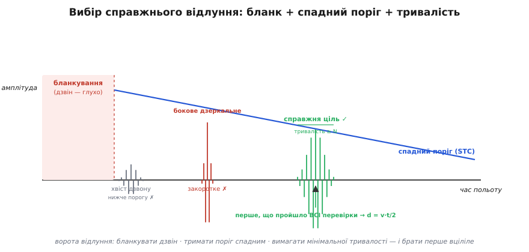
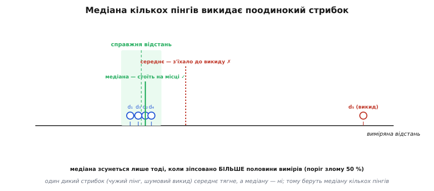

# ⚙️ Вибір справжнього відлуння: повний цикл ультразвукового далекоміра на C

**Задача.** Ми вже знаємо кожну біду ультразвукового далекоміра окремо: пластина після імпульсу ще **дзвенить** і глушить близьке відлуння; поріг то зависокий (пропускає далеку ціль), то занизький (ловить шум); бокова стіна дає **дзеркальне** відлуння раніше за пряме; швидкість звуку **пливе** з температурою; сусідній давач тієї ж частоти підкидає **чужі** сплески. Кожну лічили окремо — а працювати давач мусить проти **всіх одразу**, в одному циклі, на дешевому мікроконтролері, десятки разів на секунду. Питання цієї вставки гранично конкретне: як виглядає той єдиний робочий цикл на C, що з галасливої мішанини відлунь витягує **одне** число — чесну відстань до цілі, — і не бреше ні на морозі, ні поряд із базіками-сусідами?

Це не абстракція. Голий модуль на кшталт HC-SR04 «з коробки» робить рівно найпростіше: пускає пінг, чекає перший фронт на виводі Echo вище фіксованого порога, віддає час. У чистій кімнаті перед пласкою стіною цього досить. Винесіть його на вулицю, у цех, на робота поруч із трьома такими самими — і він почне «іноді показувати дурню»: то стрибок на пів-метра, то злипання з найближчою стіною, то систематичний зсув із сезоном. Уся різниця між тим модулем і **приладом** — не в залізі (пластина та сама), а в тих кількох десятках рядків C, що ми зараз складемо докупи. Зберемо їх шар за шаром, і кожен шар прибиратиме одну конкретну брехню.

## Ідея: не «зловити відлуння», а провести його крізь ворота

Наївна картинка каже: «пустив звук — дочекався відлуння — поділив час навпіл». Насправді до приймача вертається не одне відлуння, а **ціла процесія** сплесків у часі: спершу власний дзвін пластини (гучний, зовсім ранній), потім, можливо, коротке дзеркальне від бокової стіни, потім справжнє від цілі, потім кілька затухлих перевідбить, і весь цей час — рівний шум електроніки, у який зрідка встромляється чужий пінг сусіда. Робота прошивки — не «взяти відлуння», а **розсудити** цю процесію: котрий сплеск справжній.

Правильна метафора — не «мікрофон, що чекає звук», а **ворота з кількома контролерами** на вході. Кожен сплеск, що претендує на звання «відлуння цілі», мусить пройти **всі** перевірки по черзі, і лише перший, хто пройшов усі, оголошується ціллю. Ось ці ворота, у порядку, в якому сплеск їх проходить:

1. **Бланкування** (*blanking*) — перші сотні мікросекунд після пуску пластина ще дзвенить власним затуханням, тож у цей час ворота **зачинені наглухо**: що б не прийшло, це не ціль, а наш власний гул. Слухати починаємо лише коли дзвін затих.
2. **Спадний поріг** (*sensitivity-time control*, STC) — амплітуда мусить перевищити поріг, але сам поріг **не сталий**: одразу після бланка він високий (щоб відсікти хвіст дзвону й гучні близькі перевідбиття), а з часом плавно **знижується** — бо справжнє далеке відлуння приходить пізнім і слабким, і низький поріг потрібен, щоб його не проґавити.
3. **Мінімальна тривалість + гістерезис** — сплеск має протриматися над порогом **досить довго**, не один відлік. Поодинокий голковий викид (шум, іскра, дзенькіт ключів) підскакує й миттю падає — його відсіює вимога тривалості. А гістерезис (два різні пороги на «увімкнути» й «вимкнути») не дає voротам тремтіти на межі.
4. **Медіанний відсів** (*median rejection*) — навіть після трьох попередніх воріт один вимір із кількох зрідка стрибне (рідкісний збіг чужого пінгу з вікном). Тож ми робимо не один пінг, а **кілька**, і беремо **медіану** — вона стійка до поодиноких дикунів.
5. **Температурна поправка** — час ми зміряли чесно, але щоб перевести його у **метри**, потрібна жива швидкість звуку, а вона залежить від температури повітря. Один вимір температури й правильна формула прибирають систематичний сезонний зсув.
6. **Кодована посилка** (*coded ping*, чирп + звірка з шаблоном) — найвищий рівень захисту: якщо навколо багато таких самих давачів, ми шлемо не голий пінг, а **впізнаваний візерунок** і приймаємо лише відлуння, що з ним збігається. Чужий звук візерунка не має — і відсіюється ще до всіх воріт.


*Ворота відлуння на одній часовій осі. Одразу після імпульсу — **бланкування** (червона зона): пластина ще дзвенить, слухати марно. Далі діє **спадний поріг STC** (синя лінія): високий зблизька, низький удалині. Хвіст дзвону не дотягує до порога — відкинуто. Бокове дзеркальне сильне, але **закоротке** — не проходить вимоги тривалості. Справжнє відлуння і вище спадного порога, і досить довге — його й беремо як перше, що пройшло **всі** перевірки.*

Далі — кожні ворота окремим шаром коду, від найпростішого до найтоншого, а наприкінці зберемо їх в один цикл `measure()`. Домовмося про залізо, щоб код був конкретний: пластина 40 кГц, спільна на випромінювання й прийом; підсилений і випрямлений сигнал приймача заведено на вхід [АЦП](root:hw-analog/adc) мікроконтролера, який ми читаємо функцією `adc_read()` (миттєва амплітуда обвідної, 12 біт); час рахуємо мікросекундним [таймером](root:hw-arch/timer-counter) через `micros()`. Це найтиповіша схема аматорського й промислового ультразвукового далекоміра.

## Шар 1: пуск пінгу й бланкування дзвону

Почнімо з фізичної неминучості. Щоб випромінити потужний імпульс, пластину розгойдують на резонансі — б'ють кількома періодами напруги 40 кГц, і вона набирає амплітуду, як гойдалка від поштовхів у такт. Знявши збудження, вона **не спиняється миттєво**: резонатор із добротністю Q ще дзвенить власним затуханням, амплітуда спадає експонентою a(t) = a₀·e^(−t/τ), стала часу τ ≈ Q/(π·f). Поки цей власний дзвін гучніший за очікуване відлуння, приймач **глухий** — слабкий відбиток тоне у власному гулі.

Звідси й бланкування: після пуску ми навмисне **ігноруємо** приймач перші `BLANK_US` мікросекунд, поки пластина не замовкне. Порахуймо, скільки саме чекати.

**Приклад (скільки триває дзвін і в яку сліпу зону виливається).** Пластина 40 кГц, добротність Q ≈ 20. Оцінімо τ і час, за який дзвін впаде разів у 20 (щоб надійно не плутати його з відлунням):

```
τ = Q/(π·f) = 20/(π·40000)        ≈ 1.6 × 10⁻⁴ с = 160 мкс
падіння в 20 разів ≈ 3·τ          ≈ 480 мкс   (бо e⁻³ ≈ 1/20)
відповідна сліпа зона: d_min = v·t/2 = 343·480×10⁻⁶/2 ≈ 8 см
```

Отже, `BLANK_US ≈ 500` — розумний старт: перечекати власний дзвін і прийняти, що ближче ~8 см давач не бачить. Ось пуск і бланкування в коді:

```c
#include <stdint.h>

#define PING_CYCLES   8        // скільки періодів 40 кГц ударити в пластину
#define BLANK_US      500      // перечекати власний дзвін (сліпа зона ~8 см)

// Ударити пластину пачкою імпульсів 40 кГц (генерує сам таймер/ШІМ).
extern void      drive_transducer(uint8_t cycles);
extern uint32_t  micros(void);      // мікросекундний лічильник
extern uint16_t  adc_read(void);    // миттєва амплітуда обвідної, 0..4095

// Пустити пінг і повернути мить t0 — від неї рахуємо весь час польоту.
static uint32_t send_ping(void) {
    drive_transducer(PING_CYCLES);
    uint32_t t0 = micros();               // нуль відліку часу польоту
    while ((micros() - t0) < BLANK_US) {
        /* глуха зона: пластина ще дзвенить, слухати марно */
    }
    return t0;
}
```

> 🔧 **Навіщо це.** Бланкування — це прямий обмін «сліпа зона проти хибних близьких спрацювань». Коротший `BLANK_US` — менша сліпа зона, але більший ризик зловити хвіст власного дзвону як хибну **близьку** ціль (давач «побачить» стіну за 3 см, якої немає). Довший `BLANK_US` — надійніше, але ближче до давача ростe мертва зона. Тому `BLANK_US` підбирають під **свою** пластину: пустіть пінг у порожнечу (ціль далеко) і гляньте на осцилографі, коли власний дзвін падає нижче шуму, — це і є мінімальний безпечний `BLANK_US`. Двоперетворювачева схема (окремий випромінювач і окремий приймач) сліпої зони майже не має — вухо не мусить чекати, поки замовкне голос, — але коштує дві деталі замість однієї.

## Шар 2: спадний поріг STC — серце вибору

Тепер головні ворота — поріг. Наївний далекомір ставить його сталим, і тут пастка з двох рогів. Постав **зависоко** — слабке відлуння від далекої чи діфузної цілі його не дістане, давач «не побачить» реальну стіну (пропуск). Постав **занизько** — шум і залишок дзвону перестрибнуть його одразу за бланком, давач ухопить **хибне** близьке (хибне спрацювання). Сталим порогом ці дві біди не помирити: те, що добре для близького, погане для далекого.

Ключ — зрозуміти, як амплітуда справжнього відлуння **сама** залежить від дальності. Звук розходиться, відбивається, вертається розходячись — і сила відлуння падає з відстанню круто (для розсіяної цілі — швидше за обернений квадрат). Тобто **близька** ціль дає гучний відбиток, **далека** — кволий. А отже, і поріг має бути таким самим: **високим зблизька** (де і дзвін, і сильні близькі перевідбиття, і справжнє відлуння все одно гучне) і **низьким удалині** (де справжнє відлуння вже ледь чутне). Це і є **sensitivity-time control** — поріг, що спадає з часом польоту рівно так, як спадає очікувана сила відлуння. Радарники винайшли цей прийом ще в 1940-х під назвою STC (його ще звуть *swept-gain* — «плавне підсилення»), і він дослівно копіює логіку відлуння: не карай далеке за те, що воно тихе.

Найпростіша, і цілком робоча, форма STC — **лінійно** спадний поріг від `THR_MAX` одразу після бланка до `THR_MIN` наприкінці вікна:

:::tabs
```c
#include <stdint.h>

#define THR_MAX     3200      // поріг одразу після бланка (гучне близьке)
#define THR_MIN      280      // поріг наприкінці вікна (кволе далеке)
#define TIMEOUT_US  20000     // макс. час польоту (20 мс ≈ 3.4 м стелі)

// Спадний поріг STC у момент t (мкс від пуску): лінійно THR_MAX → THR_MIN.
static inline uint16_t stc_threshold(uint32_t t) {
    if (t >= TIMEOUT_US) return THR_MIN;
    // лінійна інтерполяція; множимо ДО ділення, щоб не втратити точність
    uint32_t span = (uint32_t)(THR_MAX - THR_MIN);
    return (uint16_t)(THR_MIN + span * (TIMEOUT_US - t) / TIMEOUT_US);
}
```
```python
THR_MAX    = 3200     # поріг одразу після бланка (гучне близьке)
THR_MIN    = 280      # поріг наприкінці вікна (кволе далеке)
TIMEOUT_US = 20000    # макс. час польоту (20 мс ≈ 3.4 м стелі)

# Спадний поріг STC у момент t (мкс від пуску): лінійно THR_MAX → THR_MIN.
def stc_threshold(t):
    if t >= TIMEOUT_US:
        return THR_MIN
    # лінійна інтерполяція
    span = THR_MAX - THR_MIN
    return THR_MIN + span * (TIMEOUT_US - t) // TIMEOUT_US
```
:::

Лінійний спад — груба, але чесна апроксимація справжнього спаду сили відлуння. Хто хоче ближче до фізики, робить поріг **експоненційно** спадним (ближчим до реального ~1/d² відлуння) — таблицею наперед порахованих значень або зсувами. Але навіть проста лінія прибирає більшість хибних близьких спрацювань, тож починають з неї.

**Приклад (як спадний поріг рятує там, де сталий не може).** Хай близький хвіст дзвону дає амплітуду ≈ 900, а справжнє відлуння від стіни за 3 м (час польоту ≈ 17.5 мс) — лише ≈ 320. Порівняймо сталий поріг і STC у цих двох точках:

```
момент хвоста дзвону: t ≈ 600 мкс   → STC-поріг ≈ 3200 - 2920·(600 близько до 0) ≈ 3115
момент справжнього:   t ≈ 17500 мкс → STC-поріг ≈ 280 + 2920·(2500/20000) ≈ 645
```

Сталий поріг довелося б поставити нижче 320, щоб побачити далеку стіну, — і тоді хвіст дзвону (900) його б перестрибнув, давши хибні 10 см. STC ставить у момент хвоста поріг ≈ 3115 (хвіст 900 не дотягує — відкинуто), а в момент справжнього відлуння — ≈ 645; справжнє 320 його теж не дотягує? Ні — і це підказка, що `THR_MIN` тут завищений: для 3 м його треба опустити до ~250. Саме так STC-поріг і калібрують — не з голови, а **по кривій справжнього відлуння** від еталонної цілі на різних дальнях. У цьому й сила: один профіль порога тримає весь діапазон, чого сталий поріг не вміє в принципі.

## Шар 3: мінімальна тривалість і гістерезис проти голок

Спадний поріг відсіює те, що **тихе не в свій час**. Але лишається інша порода брехні — **короткі гучні голки**: одиничний шумовий викид, електрична завада від двигуна поруч, іскра, різкий стук. Такий викид підскакує **вище** будь-якого порога — і миттю падає. Від справжнього відлуння він відрізняється саме **тривалістю**: реальний сплеск від пачки з 8 періодів 40 кГц триває помітний час (пластина відгукується не миттєво), а голка — це один-два відліки.

Отже, ще одні ворота: сплеск зараховуємо, лише якщо він протримався над порогом **щонайменше** `MIN_HITS` послідовних вимірів. А щоб на самій межі порога рахунок не «мерехтів» (амплітуда гуляє коло порога, то трохи вище, то трохи нижче, і лічильник збивається), додаємо **гістерезис**: щоб *почати* рахувати, треба перевищити поріг, а щоб *скинути* лічильник — впасти помітно **нижче** (скажімо, на чверть). Це та сама ідея, що в термостаті, який не клацає безперервно коло уставки. Гістерезис детально розібрано в темі [компаратора](root:hw-analog/comparator); тут він у програмній формі.

```c
#include <stdint.h>

#define MIN_HITS    4         // стільки послідовних відліків над порогом = справжнє
#define HYST_NUM    3         // скидати лічильник, якщо впало нижче 3/4 порога
#define HYST_DEN    4

// Шукати ПЕРШЕ відлуння: вище спадного порога + досить довге + з гістерезисом.
// Повертає час польоту в мкс, або 0 — цілі в діапазоні нема.
static uint32_t find_echo(uint32_t t0) {
    uint16_t hits = 0;              // скільки відліків поспіль тримаємось над порогом
    uint32_t t_start = 0;           // мить, коли сплеск почався

    for (;;) {
        uint32_t t = micros() - t0;
        if (t >= TIMEOUT_US) return 0;         // тиша до кінця вікна — цілі нема

        uint16_t a   = adc_read();             // миттєва амплітуда
        uint16_t thr = stc_threshold(t);       // живий спадний поріг

        if (a > thr) {
            if (hits == 0) t_start = t;        // засікли початок сплеску
            if (++hits >= MIN_HITS)
                return t_start;                // сплеск досить довгий → це ціль
        } else if (a < (uint16_t)((uint32_t)thr * HYST_NUM / HYST_DEN)) {
            hits = 0;                           // впало нижче гістерезису → голка, скидаємо
        }
        /* між thr і 3/4·thr — «сіра зона»: лічильник не рушимо, чекаємо */
    }
}
```

Зверніть увагу на два тонкі місця. По-перше, час польоту ми віддаємо `t_start` — **початок** сплеску, а не мить, коли лічильник дозрів до `MIN_HITS`; інакше кожне відлуння давало б систематичний зсув на `MIN_HITS` відліків уперед (ціль здавалася б трохи далі). По-друге, «сіра зона» між `thr` і `¾·thr` — це і є гістерезис: у ній ми лічильник **не чіпаємо**, тож дрібне тремтіння амплітуди коло порога не збиває рахунок.

> 🔧 **Навіщо це.** Вимога тривалості — найдешевший спосіб відсіяти електричні завади, яких на реальній платі повно (двигуни, реле, силові ключі). Голка від увімкнення двигуна дасть один відлік вище порога — і `MIN_HITS` її вб'є, бо вона не протримається. Але не переборщіть: завелике `MIN_HITS` з'їсть і **справжнє** коротке відлуння від дрібної або скісної цілі, що дає лише кілька відліків. Правило: `MIN_HITS` беруть трохи меншим за кількість відліків, яку АЦП встигає зняти за тривалість найкоротшого очікуваного відлуння. Виміряйте це один раз на осцилографі — і не вгадуйте.

## Шар 4: медіанний відсів кількох пінгів

Три попередні ворота стоять **усередині** одного пінгу. Та навіть після них один вимір із багатьох зрідка стрибне: рідкісний збіг, коли чужий сплеск саме потрапив у вікно й саме протримався достатньо, або коли давач на мить ухопив бокове перевідбиття замість прямого. Проти таких поодиноких дикунів є класичний, майже безкоштовний прийом — зробити **кілька** пінгів поспіль і взяти **медіану** їхніх відстаней.

Чому саме медіана, а не середнє? Бо середнє дикун **тягне до себе**: один вимір 5 м серед чотирьох по 1 м дає середнє 1.8 м — брехня. Медіана ж — це **середній за рангом** елемент: вона зсунеться, лише якщо зіпсовано **більше половини** вимірів. Ця властивість у статистиці зветься **точкою злому** (*breakdown point*), і для медіани вона дорівнює рівно 50 % (усталений факт робастної статистики): щоб зрушити медіану за межі здорових значень, дикунів мусить бути більшість. Один-два стрибки серед п'яти вона просто **ігнорує** — вони опиняються скраю відсортованого ряду, а ми беремо серединний.


*Чому медіана, а не середнє. П'ять вимірів: чотири збилися коло справжньої відстані (зелена зона), один дико стрибнув праворуч (чужий пінг чи бокове відлуння). **Середнє** (червоний пунктир) дикун тягне до себе — воно з'їхало з правди. **Медіана** (зелена лінія) — серединний за рангом елемент — стоїть на місці: щоб її зрушити, треба зіпсувати більше половини вимірів (поріг злому 50 %).*

Медіану п'яти чисел рахують без повного сортування — досить часткового; але на такому мікроскопічному масиві навіть проста вставка коштує копійки й читається ясніше:

:::tabs
```c
#include <stdint.h>

#define N_PINGS   5           // непарне — щоб медіана була одним елементом

// Медіана масиву (проста вставка; для N=5 це дешевше за будь-яку хитрість).
static uint32_t median_us(uint32_t *a, int n) {
    for (int i = 1; i < n; i++) {          // сортування вставкою
        uint32_t key = a[i];
        int j = i - 1;
        while (j >= 0 && a[j] > key) { a[j + 1] = a[j]; j--; }
        a[j + 1] = key;
    }
    return a[n / 2];                        // серединний елемент
}
```
```python
N_PINGS = 5           # непарне — щоб медіана була одним елементом

# Медіана масиву (серединний за рангом елемент відсортованого ряду).
def median_us(a):
    return sorted(a)[len(a) // 2]           # серединний елемент
```
:::

Медіанний фільтр — окрема добре вивчена тема; його стійкість до викидів і те, чому він зберігає різкі краї (на відміну від усереднення), розібрано в [медіанному фільтрі](root:sf-algorithms/median-filter). Тут нам вистачає його головної риси: **один дикун його не зрушить**.

Є тонкість: пінги не можна пускати **надто швидко** один за одним, бо затухлі перевідбиття від **попереднього** пінгу ще блукають у повітрі й можуть потрапити в вікно наступного, вдаючи хибну ціль. Тому між пінгами витримують паузу, щоб луна попереднього встигла згаснути, — типово кілька десятків мілісекунд (звук за 30 мс пробігає ~10 м туди-й-назад, тобто перевідбиття від будь-чого ближчого встигне зникнути).

## Шар 5: температурна поправка швидкості звуку

Досі ми чесно міряли **час**. Але віддати треба **метри**, а перехід t → d вимагає швидкості звуку v, і саме тут ховається найбільша **систематична** брехня. Швидкість звуку в повітрі помітно росте з температурою; зашити сталу v — означає влітку й узимку показувати різну відстань до тієї самої стіни, і жодне усереднення чи медіана цього не виправлять, бо помилка **однакова** в кожному вимірі (це зсув, не розкид).

Швидкість звуку в повітрі коло звичайних температур добре описує лінійна формула (перевірено; точніша за √-закон на вузькому діапазоні):

```
v(T) ≈ 331.3 + 0.606·T        (T у °C, v у м/с)
```

**Приклад (мороз проти спеки на тій самій стіні).** Порахуймо v на −10 °C і +35 °C і побачимо ціну зашитої сталої:

```
v(−10) = 331.3 + 0.606·(−10) ≈ 325.2 м/с
v(+35) = 331.3 + 0.606·(+35) ≈ 352.5 м/с        → розмах 27.3 м/с ≈ 8.4 %
```

Якщо прошивка «зашила» v = 343 м/с (для 20 °C), а насправді мороз −10 °C і відлуння від стіни вертається за t = 20 мс:

```
показ (v=343):     d = 343 · 0.020 / 2      = 3.43 м
правда (v=325.2):  d = 325.2 · 0.020 / 2    = 3.25 м        → помилка 18 см!
```

Вісімнадцять сантиметрів на трьох метрах — і жодна медіана їх не прибере. А копійчаний давач температури (той, що часто вже стоїть на платі) і правильна v(T) прибирають цю похибку до нуля:

:::tabs
```c
// Швидкість звуку з поправкою на температуру (°C → м/с).
static inline float sound_speed(float t_celsius) {
    return 331.3f + 0.606f * t_celsius;
}

// Час польоту (мкс) → відстань (м) з ЖИВОЮ швидкістю, з двійкою за шлях туди-й-назад.
static inline float tof_to_distance_m(uint32_t echo_us, float t_celsius) {
    float v = sound_speed(t_celsius);          // жива v, не константа!
    return v * (echo_us * 1e-6f) * 0.5f;       // d = v·t/2
}
```
```python
# Швидкість звуку з поправкою на температуру (°C → м/с).
def sound_speed(t_celsius):
    return 331.3 + 0.606 * t_celsius

# Час польоту (мкс) → відстань (м) з ЖИВОЮ швидкістю, з двійкою за шлях туди-й-назад.
def tof_to_distance_m(echo_us, t_celsius):
    v = sound_speed(t_celsius)                 # жива v, не константа!
    return v * (echo_us * 1e-6) * 0.5          # d = v·t/2
```
:::

> 🔧 **Навіщо це.** Це найдешевша й найнедооціненіша поправка в ультразвуковій далекометрії: один аналоговий вхід і один рядок коду прибирають до 8–9 % систематичного зсуву в реальному діапазоні вулиці. Далекоміри, що ігнорують температуру, — це «іграшки», що чесно міряють час і брешуть метри. Хто хоче ще точніше — додає поправку на **вологість** (волоże повітря трохи швидше проводить звук) і на **тиск**, але це вже треті знаки; температура дає левову частку. Хитрий трюк для найвищої точності — взагалі **не** зашивати v, а раз на цикл виміряти час відлуння від **еталона на відомій відстані** (пластинка за фіксовані 20 см у корпусі давача) і з нього вивести живу v «на місці» — так поправка враховує все середовище одразу.

## Шар 6: кодована посилка проти чужого ультразвуку

Останні, найтонші ворота потрібні там, де давачів **багато**: парктронік з вісьмома сенсорами, рій роботів, цех із пневматикою (клапани свистять якраз на десятках кілогерц). Усі вони сиплять на ~40 кГц, і **чужий** пінг для нашого давача виглядає точнісінько як власне відлуння — простий поріг проти нього безсилий, бо чужий сплеск і гучний, і досить довгий.

Рятунок — послати не голий пінг, а **впізнаваний візерунок**, якого чужі давачі не мають, і приймати лише відлуння, що з цим візерунком **збігається**. Найпоширеніший візерунок — **чирп** (*chirp*): короткий свист, у якому частота плавно **повзе** від вищої до нижчої (або навпаки) протягом посилки. Природа винайшла це першою — кажан видає саме таку частотну розгортку в кожному писку (як ми бачили в [історії сонара](root:embedded/contactless-distance/hist-sonar.md)); інженери радарів прийшли до того самого незалежно й дали ім'я «чирп» (сам термін пустив у обіг Б. М. Олівер із Bell Labs у внутрішній записці «Not with a Bang, but a Chirp» 1951 року, а строгу теорію виклали Клаудер зі співавторами в Bell System Technical Journal 1960-го — усталена, добре задокументована історія).

Чому саме розгортка частоти, а не проста довша посилка? Бо чирп дає приймачу **впізнаваний часовий підпис**: звіряючи прийнятий сигнал із формою посланого (математично — **кореляція**, ковзне множення-й-сумування), ми дістаємо гострий пік рівно в ту мить, коли прийняте найкраще лягає на шаблон. Чужий звук, що не має цієї розгортки, дає з нашим шаблоном лише розмазаний низький відгук — і відсіюється. Приймач, налаштований на форму власної посилки, у теорії зв'язку зветься **узгодженим фільтром** (*matched filter*); він видобуває максимум відношення сигнал/шум саме тому, що «знає», що шукає.

Ось спрощена звірка з шаблоном: ми копимо прийняті амплітуди у ковзне вікно й рахуємо кореляцію з наперед відомим шаблоном чирпу; «відлуння» оголошуємо там, де кореляція перескочила поріг.

:::tabs
```c
#include <stdint.h>
#include <stdlib.h>

#define TPL_LEN   16          // довжина шаблону чирпу (відліків)

// Наперед знятий/змодельований шаблон посланого чирпу (нормований, ±).
static const int16_t chirp_tpl[TPL_LEN] = {
    120, 90, 30, -60, -115, -110, -40, 55,
    118, 100, 20, -80, -120, -70, 20, 100
};

// Кореляція ковзного вікна з шаблоном: великий вихід = «наш» чирп прийшов.
// buf — кільцевий буфер останніх TPL_LEN амплітуд приймача (з віднятим середнім).
static int32_t chirp_match(const int16_t *buf) {
    int32_t acc = 0;
    for (int i = 0; i < TPL_LEN; i++)
        acc += (int32_t)buf[i] * chirp_tpl[i];    // ковзне множення-й-сумування
    return acc;                                    // пік — коли форми збіглися
}
```
```python
import numpy as np

TPL_LEN = 16          # довжина шаблону чирпу (відліків)

# Наперед знятий/змодельований шаблон посланого чирпу (нормований, ±).
chirp_tpl = np.array([
    120, 90, 30, -60, -115, -110, -40, 55,
    118, 100, 20, -80, -120, -70, 20, 100
])

# Кореляція ковзного вікна з шаблоном: великий вихід = «наш» чирп прийшов.
# buf — останні TPL_LEN амплітуд приймача (з віднятим середнім).
def chirp_match(buf):
    return int(np.dot(buf, chirp_tpl))            # пік — коли форми збіглися
```
:::

```c
// Пошук відлуння за КОРЕЛЯЦІЄЮ (замість простого порога амплітуди).
static uint32_t find_echo_coded(uint32_t t0, int32_t corr_thr) {
    int16_t win[TPL_LEN] = {0};
    int     head = 0;
    for (;;) {
        uint32_t t = micros() - t0;
        if (t >= TIMEOUT_US) return 0;

        // зсунути вікно й покласти свіжий відлік (з грубим відніманням середини шкали)
        win[head] = (int16_t)((int)adc_read() - 2048);
        head = (head + 1) % TPL_LEN;

        if (t > BLANK_US && abs(chirp_match(win)) > corr_thr)
            return t;                              // збіг із нашим чирпом → це наше відлуння
    }
}
```

Це вже спрощення справжнього узгодженого фільтра (реальний рахує кореляцію правильно вирівняною й нормованою), але суть та сама: **корелюй прийняте з посланим і бери пік**. Чужий пінг сусіда, навіть гучний, форми нашого чирпу не має — кореляція з ним низька, і він проходить повз ворота. Глибше кодування посилки й вибір форми — це вже [ультразвукова далекометрія](root:hw-sensing/ultrasonic-tof-method) у повному обсязі; тут важливо бачити, що це остання лінія оборони, коли давачів багато.

> 🔧 **Навіщо це.** Кодована посилка — різниця між «один давач у лабораторії» і «вісім давачів на бампері, що не глушать одне одного». Без неї сусідні однакові сенсори сліплять один одного взаємними пінгами, і показ стрибає без видимої причини. З нею кожен давач упізнає лише **своє** відлуння (а різні давачі беруть трохи різні чирпи — і геть перестають заважати). Ціна — складніший випромінювач (пластину треба гнати змінною частотою, а не однією) і трохи обчислень на кореляцію; але на будь-якому МК із апаратним множенням це дрібниця. Простий поріг лишіть для одинокого давача; щойно їх більше одного поруч — переходьте на код.

## Збираємо все в один цикл measure()

Тепер з'єднаймо шість шарів в один робочий цикл. Він робить `N_PINGS` пінгів, кожен проводить крізь бланкування → спадний поріг → тривалість+гістерезис, збирає часи, викидає викиди медіаною, і лише вцілілу медіану перетворює на метри з живою температурою. Це і є той код, що відрізняє прилад від іграшки.

```c
#include <stdint.h>

#define N_PINGS       5
#define PING_GAP_MS   40        // пауза між пінгами: щоб луна попереднього згасла

extern void     delay_ms(uint32_t ms);
extern float    read_temperature_c(void);   // копійчаний давач температури

// Результат виміру: distance_m < 0 означає «цілі в діапазоні нема».
typedef struct { float distance_m; uint8_t valid; } range_t;

range_t measure(void) {
    uint32_t times[N_PINGS];
    int      got = 0;

    // 1) кілька пінгів, кожен — крізь усі внутрішні ворота
    for (int i = 0; i < N_PINGS; i++) {
        uint32_t t0   = send_ping();           // пуск + бланкування дзвону
        uint32_t echo = find_echo(t0);         // спадний поріг + тривалість + гістерезис
        if (echo > 0)
            times[got++] = echo;               // зберігаємо лише вдалі засічки
        delay_ms(PING_GAP_MS);                 // дати луні згаснути перед наступним
    }

    range_t r = { .distance_m = -1.0f, .valid = 0 };

    // 2) потрібна більшість вдалих засічок — інакше цілі надійно нема
    if (got < (N_PINGS / 2 + 1))
        return r;                              // забагато тиші/шуму → чесно кажемо «нема»

    // 3) медіана вцілілих часів — викидає поодинокі стрибки
    uint32_t t_med = median_us(times, got);

    // 4) час → метри з ЖИВОЮ швидкістю звуку (температурна поправка)
    r.distance_m = tof_to_distance_m(t_med, read_temperature_c());
    r.valid      = 1;
    return r;
}
```

Зверніть увагу на рішення в кроці 2: ми вимагаємо **більшості** вдалих засічок (`N_PINGS/2 + 1`). Це не дрібниця, а прямий наслідок логіки медіани: якщо вдалих менше половини, медіана рахувалася б по жменьці випадкових спрацювань і сама стала б ненадійною. Чесніше сказати «цілі нема» (наприклад, ціль м'яка й не відбиває, або її просто немає в діапазоні), ніж видати впевнене число з двох випадкових пінгів. Далекомір, що вміє чесно мовчати, кращий за той, що завжди щось показує.

І ще: цикл `measure()` **блоківний** — він чекає всі пінги з паузами, тобто з'їдає `N_PINGS × (TIMEOUT_US + PING_GAP_MS)` ≈ 5×(20+40) ≈ 300 мс на один вимір, даючи ~3 виміри на секунду. Для парктроніка чи стеження за рівнем цього досить. Де треба частіше або де МК не можна блокувати, весь цикл переписують на **скінченний автомат**, керований [перериваннями](root:hw-arch/interrupts) таймера й АЦП: пінг у стані PING, слухання в стані LISTEN на кожне переривання АЦП, пауза в стані GAP, — щоб процесор тим часом робив інше. Логіка воріт та сама, лише розкладена в часі; але почати завжди варто з блоківної версії — вона зрозуміліша й легша в налагодженні.

## Складність і пастки

Цикл короткий, але кожен шар має місце, де новачок спотикається. Зберемо граблі в одному місці — це і є та частина, що відрізняє робочий далекомір від «чомусь бреше».

- **Занизький поріг → близькі хибні спрацювання.** Найчастіша біда: `THR_MIN` чи весь профіль STC опущено надто низько, і хвіст власного дзвону або шум одразу за бланком перестрибує його, даючи стабільні хибні «3 см». Симптом — далекомір показує дуже близьку ціль, якої немає. Лік: підняти поріг у ранній частині вікна (STC на те й спадний) або подовжити `BLANK_US`.

- **Зависокий поріг → пропуск далекої цілі.** Дзеркальна біда: `THR_MIN` завищено, і кволе далеке відлуння його не дістає — давач «не бачить» стіну, що є. Симптом — за певною дальністю ціль зникає раптово, хоч фізично вона ще в діапазоні. Лік: опустити хвіст профілю STC, звіряючись із **реальною** кривою сили відлуння від еталонної цілі на різних дальнях, а не з голови.

- **Бокове дзеркальне відлуння як хибно-близька ціль.** Гладка стіна чи одвірок **збоку** конуса дає сильне дзеркальне відлуння, що може прийти **раніше** за слабке пряме від справжньої цілі, — і «перше сильне» вхопить його, показавши меншу відстань «нізвідки». Проти цього частково працює вимога тривалості (дзеркальний зблиск часто коротший), але надійніше — **вузити промінь** (сфокусована пластина) або звіряти кілька пінгів медіаною: бокове відлуння часто нестабільне й випадає як викид.

- **Хвіст дзвону як хибна близька ціль.** Якщо `BLANK_US` замалий, приймач вмикається, поки пластина ще дзвенить, — і власний дзвін зараховується як відлуння цілі за кілька сантиметрів. Симптом — стабільна хибна близька ціль, що не залежить від того, що перед давачем. Лік: подовжити бланкування до реального часу затихання дзвону (виміряти на осцилографі, не вгадувати).

- **Забули двійку в d = v·t/2.** Класика: пропустив `·0.5` — і вся шкала **вдвічі** брехлива (показує подвоєну відстань). Перевірка: піднесіть ціль на відомий 1 м; якщо показує ~2 м — забута двійка.

- **Зашита стала швидкість звуку.** Без температурної поправки давач показує різне влітку й узимку до тієї самої стіни — до 8–9 % зсуву. Це не шум (медіана не допоможе), а систематична брехня; лік один — жива v(T) або еталон на відомій відстані.

- **`MIN_HITS` завелике → втрата коротких відлунь.** Спокуса зробити вимогу тривалості суворішою, щоб надійніше вбити голки, з'їдає й **справжнє** коротке відлуння від дрібної чи скісної цілі. Симптом — давач бачить велику стіну, але не помічає тонкого стовпчика. Лік: `MIN_HITS` трохи менше за кількість відліків найкоротшого очікуваного відлуння.

- **Пінги надто часто → луна попереднього в наступному.** Якщо `PING_GAP_MS` замалий, затухле перевідбиття від попереднього пінгу блукає в наступному вікні й дає хибну ціль. Симптом — стрибки, що з'являються лише при швидкому опитуванні. Лік: пауза, за яку луна пробігає весь діапазон туди-й-назад і гасне (десятки мс).

- **Медіана з парної кількості або з жменьки вдалих.** Беріть **непарне** `N_PINGS` (медіана — один елемент, без усереднення двох середніх, що знову впустило б викид у результат). І не рахуйте медіану, якщо вдалих засічок менше більшості, — краще чесне «цілі нема».

- **Кореляція без віднятого середнього.** Якщо перед звіркою з шаблоном чирпу не прибрати постійну складову сигналу (середину шкали АЦП), кореляція «попливе» від сталого зсуву, і поріг спрацьовуватиме будь-де. Завжди корелюйте **знакозмінний** сигнал (відлік мінус середина шкали), як у коді вище.

- **Стан між вимірами не скинули.** Лічильники `hits`, `head`, кільцеве вікно кореляції мусять обнулятися на початку кожного пінгу; інакше «хвіст» попереднього виміру засмітить початок наступного хибним спрацюванням. Скидайте стан у `send_ping()`/на вході в `find_echo`.

Підсумок виходить такий. Ультразвуковий далекомір, що не бреше, — це не хитра пластина, а акуратно складені **ворота відлуння** поверх звичайної. Бланкування прибирає власний дзвін; спадний поріг STC ловить і близьке, і далеке одним профілем; вимога тривалості з гістерезисом убиває голки; медіана кількох пінгів викидає поодинокі стрибки; температурна поправка перетворює чесний час у чесні метри; а кодований чирп рятує там, де давачів багато. Кожен шар — кілька рядків C поверх того самого АЦП і таймера, що вже є в плати. І саме ці шари дають те, заради чого все затівалося: одне надійне число замість галасливої процесії відлунь — відстань, якій можна вірити і на морозі, і поряд із сусідами.
