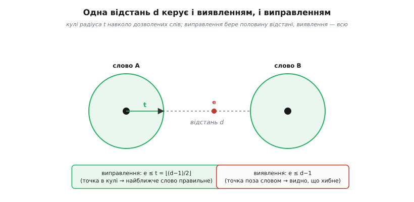
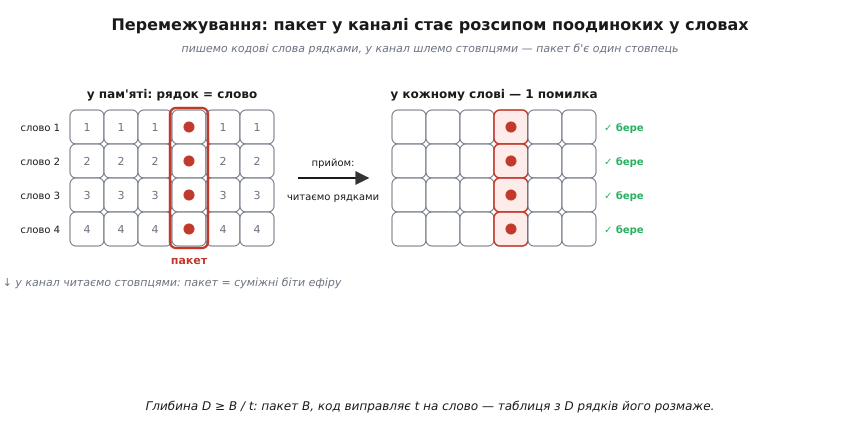
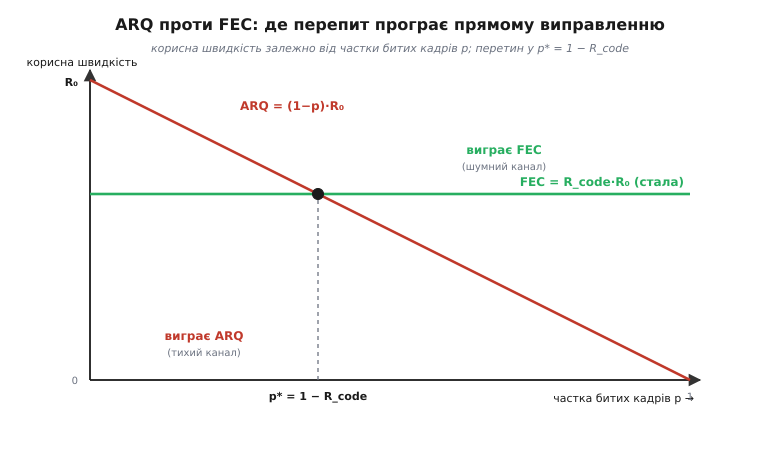
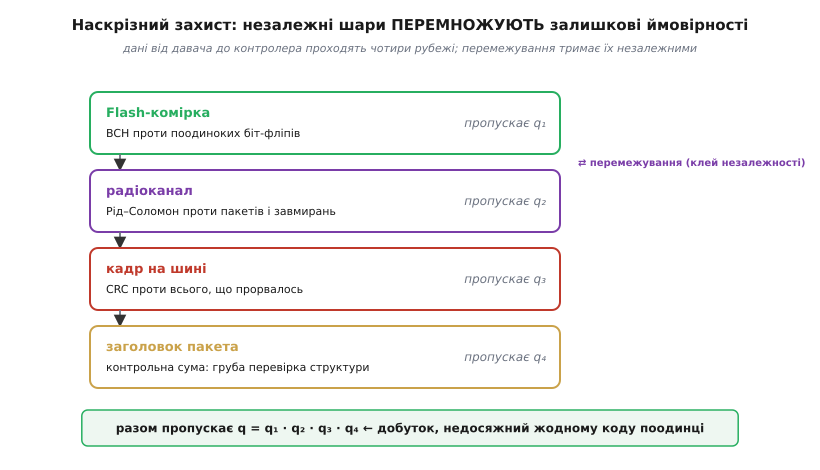

# Надійність даних — детально

Базова версія дала нам карту: [сходи від парності до Рід–Соломона](root:embedded/data-reliability), дві стратегії (перепитати чи виправити самому), думку про шари. Карта відповідає на питання «**що** ставити». Але щойно доходить до реального проєкту, під кожною сходинкою відкривається друге дно, і замість «постав CRC» починається «CRC якої довжини, з яким многочленом, і що станеться з тими помилками, які він **не** побачить». Карта показує материк; тепер спускаємось у долини й міряємо їх кроками.

Тут ми зробимо з якісного вибору **кількісний**. За кожним «дешевше / дорожче», «слабше / сильніше», «поодинокі / пакетні» стоїть формула, і поки ми її не виведемо, вибір лишається на дотик. Ми виведемо, **чому** відстань між кодовими словами визначає, скільки помилок код бачить і скільки лагодить; **скільки** саме ми платимо надлишком і чому за цю ціну є жорстка теоретична межа; **яку частку** помилок код виявлення тихо пропускає повз себе; і **де саме** — за якого рівня помилок — перепитування програє прямому виправленню. Наприкінці збудуємо справжній багатошаровий стек — той, що літає до Плутона й крутиться в кожному CD-плеєрі, — і побачимо, чому шари не просто складаються, а **перемножуються**.

Одне застереження про межі теми. Механіку самого перепитування — підтвердження, таймери, номери кадрів, рухоме вікно, Go-Back-N проти вибіркового повтору — ми детально розбираємо в окремому кроці про [стратегії ARQ](root:embedded/arq-strategies); тут ARQ цікавить нас лише як **одна чаша терезів** проти прямого виправлення, і ми виведемо саме те, чого там немає, — коли яка чаша переважує в числах. Так само внутрішній устрій кожного коду живе у своїй статті книги; ми вмонтовуємо їх попапами там, де без них не обійтися, а самі будуємо **інженерію вибору поверх** них.

### Геометрія, що керує всім: відстань між словами

Почнімо з питання, повз яке базова версія проскочила одним рядком: **чому** одні коди лише бачать помилку, а інші її лагодять? Відповідь не в хитрощах конкретного коду, а в чистій геометрії, спільній для **всіх** блокових кодів одразу. Зрозумівши її раз, ми зрозуміємо межі кожної сходинки.

Уявімо кодове слово завдовжки n біт як **точку** в просторі всіх можливих n-бітових рядків. Відстань між двома такими точками — це [відстань Геммінга](topic:com-modulation/hamming-distance): число позицій, у яких вони різняться. Скажімо, `1011` і `1001` різняться в одній позиції — відстань 1; `1011` і `0100` — у всіх чотирьох, відстань 4.

> 🔧 **Навіщо це.** [Відстань Геммінга](topic:com-modulation/hamming-distance) — це число позицій, у яких різняться два двійкові слова однакової довжини. Помилка на k бітів **зсуває** передане слово рівно на відстань k від оригіналу. Уся сила будь-якого блокового коду вимірюється **мінімальною** відстанню між його кодовими словами — і саме її ми зараз перетворимо на формули виявлення й виправлення.

Код бере всі можливі повідомлення й призначає кожному одне кодове слово. З усіх 2ⁿ точок простору **дозволені** лише ці — решта є «діри», яких відправник ніколи не шле. Ключова величина коду — його **мінімальна відстань** d: найменша відстань між будь-якою парою дозволених слів. Тепер дивимось, що робить помилка. Помилка на одному біті зсуває передане слово на **сусідню** точку — на відстань 1. Помилка на k бітах — на відстань k. Приймач ловить якусь точку й питає: чи це дозволене слово, чи ні?

Звідси одразу випливає **виявлення**. Поки помилка зсунула нас у «діру» — у недозволену точку, — приймач бачить, що слово хибне: щось перевернулося. Зіб'ємось ми лише тоді, коли помилка зсуне передане слово **точно в інше дозволене** слово — тоді приймач прийме його за правду. А найближче інше дозволене слово лежить на відстані d. Отже, щоб гарантовано **не** влучити в чуже слово, помилка має зсунути нас менш ніж на d кроків:

```
код із мінімальною відстанню d
гарантовано ВИЯВЛЯЄ будь-яку помилку вагою до   d − 1  бітів
```

Один біт парності дає d = 2 (будь-які два дозволені слова різняться щонайменше двома бітами — одним інформаційним і зміною самого біта парності), тож виявляє d − 1 = 1 помилку. Саме тому [парність](topic:com-modulation/parity-bit) сліпа до двох одночасних перевертів: два переверти можуть зсунути нас точно в інше дозволене слово (парність збережеться), і це рівно межа d − 1 = 1.

Тепер **виправлення** — і тут геометрія особливо гарна. Виправити означає не просто помітити «слово хибне», а **вгадати, яке дозволене слово надсилали**. Розумна ставка: найближче. Приймач бере впіймане слово й обирає дозволене слово, до якого воно **найближче** за Геммінгом (це зветься декодуванням за максимальною правдоподібністю на симетричному каналі). Коли ця ставка правильна? Уявімо навколо кожного дозволеного слова **кулю** радіуса t — усі точки в межах t перевертів від нього. Якщо ці кулі **не перетинаються**, то будь-яка точка всередині кулі однозначно «належить» своєму центрові, і найближче слово — правильне. Кулі радіуса t навколо двох слів на відстані d не перетинаються, поки їхні радіуси в сумі менші за d, тобто поки 2t < d, тобто t ≤ (d − 1)/2. Оскільки t ціле:

```
t = ⌊(d − 1) / 2⌋        ← скільки помилок код ГАРАНТОВАНО виправляє
```

Ось звідки всі відомі числа. Код Геммінга (7,4) має d = 3 → виправляє t = 1 біт **або** (якщо не намагатися виправляти) виявляє d − 1 = 2. Не можна одночасно: або ти витрачаєш «запас» відстані на виправлення одного, або на виявлення двох. [SECDED](topic:com-modulation/secded) (виправити один, виявити два) робить трюк — додає ще один біт до d = 4, і тоді вистачає на t = 1 виправлення **плюс** розрізнення «це двобітова помилка, яку я не виправлю, але побачу». Рід–Соломон із мінімальною відстанню d виправляє (d − 1)/2 **символів** — та сама формула, лише одиниця виміру інша.


*Чому одна відстань d керує і виявленням, і виправленням. Дозволені слова — темні точки; навколо кожного куля радіуса t = ⌊(d−1)/2⌋. Помилка зсуває передане слово від центра. Поки вона лишається в кулі, найближче слово — правильне: код виправляє. Поки вона не досягла іншого дозволеного слова (менш ніж d кроків), код принаймні бачить, що слово хибне: виявляє. Виправлення «з'їдає» половину відстані з обох боків, тому виправити завжди можна вдвічі менше, ніж виявити.*

Ця картинка пояснює і головний компроміс, який в базовій версії звучав як гасло «виявлення дешевше за виправлення». Тепер видно **чому**: виявлення користується **всією** відстанню d − 1, а виправлення — лише її половиною, бо мусить лишити «нейтральну смугу» між кулями. За ту саму відстань (ту саму ціну в надлишку!) ти отримуєш або вдвічі більше виявлення, або вдвічі менше виправлення. Це не інженерна умовність, а теорема геометрії — і саме вона робить ARQ (виявлення) фундаментально дешевшим за FEC (виправлення) **за однакового надлишку**.

Є і третій режим, про який базова версія промовчала, а він рятує пакетні канали: **стирання** (англ. *erasure* — «стирання»). Якщо приймач не просто отримав хибний символ, а **знає, що символ битий** (наприклад, зовнішній детектор позначив його як ненадійний), то невідома лише його **значення**, а не позиція. Це вдвічі легша задача: код із відстанню d виправляє **d − 1 стирань** — рівно як виявлення, бо позиція вже відома й половину відстані на неї витрачати не треба. Звідси загальна формула, що об'єднує всі три режими: код одночасно виправляє e стирань і t помилок, поки

```
2t + e ≤ d − 1
```

Це не абстракція. У каскадних системах внутрішній декодер часто каже зовнішньому не тільки «ось символ», а й «я в ньому не впевнений» — і зовнішній Рід–Соломон, приймаючи це як стирання, виправляє **вдвічі більше**, ніж якби гадав наосліп. Ми повернемось до цього, коли будуватимемо стек.

### Ціна надлишку — і чому вона має теоретичну стелю

Третє питання вибору — «скільки платити» — базова версія лишила якісним: «кожен зайвий біт це втрачена пропускна здатність». Зробимо його точним, бо саме на ціні найлегше і переплатити, і — гірше — недоплатити, гадаючи, що заплатив достатньо.

Плата вимірюється **швидкістю коду** (англ. *code rate* — «швидкість коду»): часткою корисних бітів у переданому потоці.

```
R = k / n           k — інформаційних символів, n — усіх переданих
надлишок = n − k     «зайві» символи, накладні витрати
```

Код (7,4) має R = 4/7 ≈ 0.57 — майже половина ефіру йде на захист. CRC-32 на кадрі в 1500 байтів: n − k = 4 байти на 1504, R ≈ 0.997 — плата копійчана. Рід–Соломон (255,223), той самий, що літав на «Вояджерах»: R ≈ 0.875, тобто 12.5% надлишку купують виправлення 16 символьних помилок. Ось чому сходи мають саме такий порядок цін: парність і CRC майже безплатні за швидкістю, ECC бере відчутну частку, важкий FEC — ще більше.

Але скільки надлишку **треба** на бажану силу? Тут працює та сама геометрія куль, тепер у зворотний бік. Щоб виправляти t помилок, навколо кожного з 2ᵏ кодових слів має вміститися неперетинна куля. Скільки точок у кулі радіуса t у n-бітовому просторі? Сама точка (нуль перевертів), плюс C(n,1) точок на відстані 1, плюс C(n,2) на відстані 2, і так до t:

```
|куля| = C(n,0) + C(n,1) + … + C(n,t)
```

Усі 2ᵏ куль мусять уміститися в 2ⁿ точок простору, не перетинаючись. Звідси **межа Геммінга** (сферична упаковка):

```
2ᵏ · [ C(n,0) + C(n,1) + … + C(n,t) ] ≤ 2ⁿ
```

Це фундаментальна стеля: **жоден** код, що виправляє t помилок у блоці n, не може мати більше корисних бітів, ніж дозволяє ця нерівність. Перепишемо її як мінімальний надлишок:

```
n − k ≥ log₂ [ C(n,0) + C(n,1) + … + C(n,t) ]
```

**Скільки бітів контролю треба на виправлення однієї помилки.** Візьмімо t = 1 і подивимось, чому саме код Геммінга такий економний.

```
куля радіуса 1 у блоці n:   1 + n  точок
межа:   n − k ≥ log₂(1 + n)
для блоку n = 7:            n − k ≥ log₂(8) = 3  біти контролю
```

Код Геммінга (7,4) має рівно n − k = 3 — він **точно** досягає межі, жодного біта не марнує. Такі коди, що впираються в стелю Геммінга без зазору, звуться [досконалими](topic:com-modulation/perfect-codes): їхні кулі замощують увесь простір без діри. Досконалих кодів дуже мало (Геммінг, Голей, тривіальні) — це радше рідкісні перлини, ніж правило. Для більшості t і n у нерівності лишається зазор: реальний код платить трохи більше за теоретичний мінімум, і це нормально.

> 🔧 **Навіщо це.** Межа Геммінга — це ваш «детектор брехні» для чужих обіцянок. Коли даташит чи стаття каже «наш код виправляє t помилок у блоці n за m бітів контролю», підставте числа: якщо m < log₂(C(n,0)+…+C(n,t)), обіцянка **математично неможлива** — десь підміна понять (напевно, «виправляє в середньому», а не «гарантовано»). І навпаки: якщо вам треба гарантовано виправляти t помилок, ця формула дає **нижню межу** плати — менше не буде за жодних хитрощів, тож закладайте її в бюджет пам'яті й ефіру одразу.

Є і симетрична межа з іншого боку — **межа Синглтона**: d ≤ n − k + 1 для будь-якого коду. Вона каже, що мінімальна відстань не може перевищити надлишок плюс один. Коди, що досягають її з рівністю (d = n − k + 1), звуться **MDS** (англ. *maximum distance separable* — «роздільні з максимальною відстанню») — вони видобувають з кожного надлишкового символу максимум можливої відстані. [Рід–Соломон](topic:com-modulation/reed-solomon) — головний практичний MDS-код: RS(n,k) має рівно d = n − k + 1, тобто виправляє (n − k)/2 символів. Ось чому RS такий бажаний для дорогих каналів: він **не марнує жодного символу надлишку**, кожен доданий символ підіймає стелю виправлення рівно на пів-символа. Для RS(255,223): d = 33, виправляє 16 символів — і жодного зайвого байта.

За всіма цими межами стоїть найглибша теорема галузі — [теорема Шеннона про кодування каналу](topic:math-information/channel-coding-theorem): доки швидкість коду нижча за **ємність каналу**, існує код, що робить імовірність помилки як завгодно малою. Шеннон 1948 року довів, що ідеальний код **існує**, не сказавши, як його побудувати; уся дальша історія — від Геммінга до LDPC — це полювання на конструкції, що підбираються до його межі. Практична мораль для нас проста: є фізична стеля (ємність), нижче якої надійність безплатна лише в теорії, а на практиці коштує складності декодера. Що ближче до стелі — то дорожчий у роботі код.

### Сліпа пляма виявлення: скільки помилок код тихо пропускає

Тепер найтонше й найнебезпечніше місце всієї теми — те, від чого в польових багах сивіє більше голів, ніж від будь-чого іншого. Код виявлення **не бачить усього**. У нього є сліпа пляма, і поки ти не знаєш її **розмір у числах**, ти не знаєш, наскільки насправді надійна твоя система.

Повернімось до геометрії. Код виявлення з відстанню d ловить усе до d − 1 перевертів. Але помилка **рівно на d бітів** може влучити в інше дозволене слово — і тоді приймач прийме брехню за правду, бо слово виглядає бездоганно. Це **невиявлена помилка** (англ. *undetected error* — «невиявлена помилка»), і вона страшніша за виявлену: виявлену ми хоч знаємо як зіпсовану й можемо перепитати, а невиявлену **приймаємо як істину**.

Порахуймо її ймовірність для контрольної суми та CRC. Груба, але корисна оцінка: додаючи r бітів контролю, ми ділимо простір слів на 2ʳ «синдромів» — можливих значень контрольного поля. Випадкова спотворена комбінація дасть **правильний** синдром приблизно з імовірністю 1 на 2ʳ. Звідси знамените правило великого пальця:

```
P(невиявлена) ≈ 2⁻ʳ        r — число бітів контрольної суми / CRC
CRC-16:  2⁻¹⁶ ≈ 1.5·10⁻⁵    ← ~15 з мільйона битих кадрів проскочать
CRC-32:  2⁻³² ≈ 2.3·10⁻¹⁰   ← ~2 з десяти мільярдів
```

Ця оцінка чесно каже головне: **кожен** код виявлення пропускає якусь частку, і ця частка падає рівно вдвічі з кожним доданим бітом. Але вона й оманлива, і тут ховається пастка. Реальна ймовірність невиявленої помилки залежить **не від r самого по собі**, а від того, наскільки многочлен CRC вдало розкидав кодові слова — від його **розподілу ваг** (скільки кодових слів має яку вагу). Добрий многочлен на коротких кадрах працює **краще** за 2⁻ʳ; поганий або невдало підібраний під довжину — **гірше**. Тому 2⁻ʳ — це орієнтир порядку величини, а не гарантія; справжнє число рахують під конкретний многочлен і довжину кадру.

Зате CRC дає **тверді гарантії** там, де контрольна сума пасує, — і саме за це його всюди й ставлять. На відміну від імовірнісного «десь раз на 2ʳ», [CRC](topic:com-modulation/crc) з многочленом степеня r гарантовано, зі стовідсотковою певністю, ловить:

```
• будь-яку помилку в 1 біт;
• будь-яку помилку в непарне число бітів (якщо многочлен має множник (x+1));
• будь-які 2 переверти (для правильно підібраного многочлена, у межах довжини кадру);
• БУДЬ-ЯКИЙ пакет помилок завдовжки до r бітів — цілком, без винятків.
```

Останній рядок — ключ до того, чому CRC цар кадрового виявлення: пакетні помилки (а на шинах і в радіо саме такі) до довжини контрольного поля він не пропустить **жодної**. Контрольна ж сума тут слабка принципово: проста сума байтів не бачить перестановки байтів (сума та сама), не бачить парної кількості компенсаційних змін, і взагалі має мізерну мінімальну відстань. Саме тому [контрольні суми](topic:com-modulation/checksums) лишають легким протоколам і файлам, а на серйозний кадр ставлять CRC. Проміжний варіант — сума Флетчера чи Адлера, що **зважує байт його позицією** (накопичує дві суми, друга додає першу на кожному кроці), — ловить перестановки, які проста сума проґавлює, коштом кількох зайвих операцій; це розумний компроміс, коли апаратного CRC немає, а гола сума заслабка.

**Демонстрація сліпої плями простої суми.** Ось код, що показує, чому навіть 16-бітова сума проґавлює цілий клас реальних помилок, а Флетчер — ні.

```c
#include <stdint.h>

// Проста сума: не бачить перестановки й компенсаційних змін.
uint16_t sum16(const uint8_t *d, int n) {
    uint16_t s = 0;
    for (int i = 0; i < n; i++) s += d[i];
    return s;                       // 0x12,0x34 і 0x34,0x12 дадуть ОДНЕ й те саме
}

// Флетчер-16: друга сума накопичує першу, тож позиція байта впливає на результат.
uint16_t fletcher16(const uint8_t *d, int n) {
    uint16_t a = 0, b = 0;
    for (int i = 0; i < n; i++) {
        a = (a + d[i]) % 255;
        b = (b + a)    % 255;       // b «пам'ятає», КОЛИ прийшов кожен байт
    }
    return (b << 8) | a;            // перестановка байтів → інше b → помилку видно
}
```

> 🔧 **Навіщо це.** Ця сліпа пляма — головна причина, чому не можна ліпити «якусь контрольну суму, аби була». Порахуйте очікуване число невиявлених помилок за весь строк служби: візьміть темп кадрів, помножте на роки, на бітову ймовірність помилки каналу й на 2⁻ʳ вашого коду. Якщо вийде «одна невиявлена за століття» — спіть спокійно; якщо «одна на тиждень» — беріть довше поле або сильніший многочлен. Для CAN, Ethernet, SD, USB інженери це вже порахували й закріпили в стандарті CRC саме тієї довжини; коли ж ви робите **власний** протокол поверх UART чи радіо — рахувати доводиться самому, і 8-бітова сума «на око» тут регулярно стає джерелом тихих, невідтворюваних збоїв.

### Поодинокі проти пакетних: чому символ б'є біт, і як це полагодити перестановкою

Друге питання вибору — «поодинокі чи пакетні помилки» — базова версія теж лишила якісним: бітовий код на поодинокі, символьний на пакетні. Виведемо, **чому** саме, бо в цьому «чому» — ключ до найпотужнішого прийому всієї теми.

Різниця між бітовим і символьним кодом — в **одиниці рахунку помилок**. [Код Геммінга](topic:com-modulation/hamming-code) чи [BCH](topic:com-modulation/bch-codes) рахують перевернуті **біти**: виправляють t бітів, де б вони не лежали. [Рід–Соломон](topic:com-modulation/reed-solomon) рахує зіпсовані **символи** (зазвичай байти): виправляє t символів, і — ось головне — **байдуже, скільки бітів зіпсовано всередині символу**. Один перевернутий біт у байті й вісім перевернутих бітів у тому самому байті для RS — це **одна** символьна помилка, ціна однакова.

Тепер уявімо пакетну помилку — подряпину на диску, завмирання в радіо, — що поспіль спалила 20 бітів. Для бітового коду це **20 окремих помилок**: щоб їх виправити, потрібен код із t ≥ 20, а це величезний надлишок (згадайте межу Геммінга — куля радіуса 20 велетенська). Для символьного коду ті самі 20 послідовних бітів лежать щонайбільше в ⌈20/8⌉ + 1 = 4 сусідніх байтах — тобто це лише **3–4 символьні помилки**. RS(255,223) виправляє 16 символів, тобто пакет до ~120 суміжних бітів, майже задарма порівняно з бітовим кодом. Ось точна причина, чому «пакетні вимагають символьного»: символьний код **пакує** послідовні бітові помилки в жменю символьних, а виправляти жменю символів набагато дешевше, ніж хмару бітів.

Але що робити, коли в тебе **гарний бітовий код** (дешевий, апаратний), а канал раптом дає пакети? Не міняти код — а **перетасувати дані**. Це [перемежування](topic:com-modulation/interleaving) (англ. *interleaving* — «чергування, перемежування»), і воно геніальне у своїй простоті. Ідея: розкидати біти кожного кодового слова так, щоб сусідні в ефірі біти належали **різним** словам. Тоді пакет, що спалив підряд 20 бітів ефіру, б'є по 20 **різних** кодових словах — по одному біту в кожне. А один біт на слово будь-який слабенький код виправляє легко.

Розберімо на числах, наскільки глибоко треба тасувати. Хай кожне кодове слово виправляє t помилок, а найдовший пакет каналу — B бітів. Записуємо слова рядками в таблицю з D рядків, а **читаємо в ефір стовпцями**. Тоді два біти, сусідні в ефірі, у таблиці стоять на відстані D — тобто в межах одного слова. Пакет завдовжки B, влучивши в потік, зачепить у кожному слові приблизно ⌈B/D⌉ бітів. Щоб код упорався (⌈B/D⌉ ≤ t), потрібна **глибина перемежування**:

```
D ≥ B / t        D — глибина перемежування (рядків у таблиці)
```

**Розрахунок глибини перемежування.** Канал дає пакети до 200 бітів; наш код виправляє t = 2 біти на слово. Скільки тасувати?

```
D ≥ B / t = 200 / 2 = 100
беремо D = 100 кодових слів у блок перемежування.
пакет 200 бітів розмаже по 100 словах → ≈ 2 біти в кожне → код (t=2) кожне виправить.
```

Ціна перемежування — **затримка й пам'ять**: щоб читати стовпцями, треба спершу зібрати всю таблицю (D слів) у буфер, а це затримка на D слів і буфер на D слів. Тому в реальному часі глибину не роздувають без потреби — вона прямо перетворюється на лаг. Це той самий компроміс «сила проти затримки», що й у ARQ з вікном: більше стійкості коштує більше пам'яті й часу.


*Як перемежування перетворює пакет на розсип поодиноких помилок. Кодові слова пишуть у таблицю рядками, а в канал відправляють стовпцями. Пакетна помилка в каналі б'є по суміжних переданих бітах — тобто по одному стовпцю таблиці. Після приймання таблицю читають назад рядками, і той стовпець розсипається на по одному битому біту в кожному слові — навантаження, яке навіть слабкий код виправляє. Глибша таблиця витримує довший пакет, але коштує буфера й затримки на всю свою висоту.*

Реальні пакетні канали не бувають «або поодинокі, або пакетні» — вони перемикаються між тихим і бурхливим станом. Цю поведінку моделює [канал Гілберта–Еліотта](topic:com-modulation/gilbert-elliott-model) — два стани, «добрий» з рідкими помилками й «поганий» із частими, і випадкові переходи між ними. Саме тому проектувати треба не під середню ймовірність помилки (вона бреше — усереднює тишу з бурею), а під **поведінку в поганому стані**: скільки триває найгірше завмирання й скільки помилок воно сипле. Перемежування якраз і розраховане на те, щоб пережити один «поганий» період, розмазавши його по багатьох словах, поки канал не повернувся в «добрий».

### Дві стратегії в числах: де перепит програє виправленню

Тепер — кількісне серце всієї теми, те, заради чого ми виводили решту. Базова версія сказала: ARQ дешевий за малих помилок, FEC тримає сталу швидкість завжди, а серйозні системи беруть обидва. Але **де саме** межа? За якого рівня помилок перепитування, доти дешеве, раптом обвалюється й програє прямому виправленню? Це число можна вивести — і воно вирішує архітектуру лінка.

Домовимось про величину. Хай p — імовірність, що **кадр** дійде зіпсованим (не окремий біт, а весь кадр; для кадру з L бітів і бітової помилки Pбіт це приблизно p ≈ 1 − (1 − Pбіт)ᴸ ≈ L·Pбіт, поки p малий). Питаємо: яку **корисну пропускну здатність** дає кожна стратегія?

**ARQ (перепитування).** Візьмімо найпростіший stop-and-wait: відправник шле кадр і чекає квитанції, а зіпсований кадр шле знову. Скільки разів у середньому доводиться слати кадр, щоб він дійшов? Це геометричний розподіл: із імовірністю (1 − p) з першого разу, з імовірністю p·(1 − p) з другого, і так далі. Середнє число спроб:

```
E[спроб] = 1 / (1 − p)
```

Кожна зайва спроба — це змарнований оберт каналу. Плюс навіть за ідеального каналу stop-and-wait простоює, чекаючи ACK цілий RTT (це ми детально розбираємо в [стратегіях ARQ](root:embedded/arq-strategies) і лікуємо рухомим вікном). Візьмімо для чистоти картину без простою (велике вікно, канал наповнений) — тоді вся втрата ARQ саме в повторах, і корисна швидкість:

```
R_ARQ = (1 − p) · R₀        R₀ — «сира» швидкість без помилок
```

Логіка проста: частка (1 − p) кадрів долітає з першого разу й несе користь, решта p — це повтори, викинутий ефір. Поки p малий, (1 − p) ≈ 1 — ARQ майже безплатний, ми майже не переплачуємо. Але коли p росте, R_ARQ падає **лінійно**, а за p → 1 (майже кожен кадр битий) обвалюється в нуль: канал захлинається повторами. Ось точна ціна ARQ — вона **росте з погіршенням каналу**.

**FEC (пряме виправлення).** Тут плата стала: код зі швидкістю R_code їде **в кожному** кадрі, і поки помилок не більше, ніж код виправляє, кадр долітає з першого разу — жодних повторів, жодного зворотного каналу.

```
R_FEC = R_code · R₀        R_code = k/n, СТАЛА, не залежить від p
```

FEC переплачує **завжди** — навіть бездоганний кадр везе повний надлишок, — зате ця переплата **не росте** з погіршенням каналу (аж до порогу, за яким код здається; про це нижче). Ось два різні характери в чистому вигляді: ARQ дешевий у тиші й дорожчає в бурю; FEC однаково дорогий завжди, зате не боїться бурі.

**Крапка перетину.** Прирівняймо й знайдемо, за якого p стратегії коштують однаково:

```
(1 − p) · R₀ = R_code · R₀
1 − p = R_code
p* = 1 − R_code        ← КРАПКА ПЕРЕТИНУ
```

Разюче просте число. Візьмімо FEC зі швидкістю R_code = 0.9 (10% надлишку). Тоді p* = 0.1: поки битих кадрів менше 10%, ARQ виграє (переплачуємо на повтори менше, ніж FEC на сталий надлишок); коли битих більше 10% — виграє FEC (повтори з'їдають більше, ніж коштує надлишок). Ось кількісна відповідь на «яку стратегію»: порахуй частку битих кадрів свого каналу й порівняй її з надлишком свого FEC.


*Кількісний вибір між перепитуванням і прямим виправленням. Похила лінія — корисна швидкість ARQ: за чистого каналу майже повна, але падає з часткою битих кадрів, бо повтори марнують ефір. Горизонталь — FEC: стала переплата за надлишок незалежно від якості каналу. Вони перетинаються в p* = 1 − R_code. Ліворуч (тихий канал) дешевший ARQ; праворуч (шумний) — FEC. Реальні системи ставлять FEC знизу, щоб зсунути робочу точку в зону, де перепитів майже немає.*

Тепер видно й **чому серйозні системи беруть обидва** — і це не «про всяк випадок», а точна оптимізація. Ставимо FEC знизу: він **знижує** ефективну частку битих кадрів p, бо більшість помилок виправляє на льоту. Це зсуває робочу точку далеко ліворуч від p*, у зону, де ARQ майже безплатний. А CRC згори ловить ті рідкісні пакети, що пробили FEC, і вмикає перепит **лише** для них. Виходить найкраще з двох світів: FEC тримає p низьким (мало повторів), ARQ добиває рідкісний залишок без сталої переплати на його виправлення. Ця зв'язка так і зветься — **гібридний ARQ** (англ. *hybrid ARQ*, HARQ), і саме на ній стоять сучасні мобільні мережі та серйозні радіолінки.

Є і третій, підступний бік ARQ, якого немає в самій швидкості: **затримка** й **її розкид**. Кожен повтор додає цілий RTT до часу доставки кадру, і на поганому каналі затримка не просто росте — вона **стрибає** (один кадр дійшов миттю, сусідній — з трьох спроб). Для потокового відео чи керування в реальному часі цей розкид (джитер) часто **гірший** за саму втрату: краще стала невелика затримка FEC, ніж непередбачувані стрибки ARQ. Ось чому для телеметрії й відео дрона тяжіють до FEC навіть там, де зворотний канал є: важить не середня швидкість, а **передбачуваність** доставки. Детальніше цей бік — у кроці про [стратегії ARQ](root:embedded/arq-strategies).

> 🔧 **Навіщо це.** Крапка перетину p* = 1 − R_code — це число, яким ви обираєте архітектуру лінка ще до першого рядка коду. Порядок дій: (1) виміряйте або оцініть частку битих кадрів свого каналу (з бітової ймовірності помилки й довжини кадру); (2) якщо вона надійно нижча за надлишок вашого FEC — беріть ARQ, він дешевший; (3) якщо вища або якщо зворотного каналу немає — FEC; (4) якщо канал буває і тихим, і бурхливим (майже завжди так) — беріть HARQ: легкий FEC знизу зсуває p ліворуч, CRC+ARQ згори добиває залишок. І окремо спитайте себе про **джитер**: якщо застосунок реального часу — схиляйтеся до FEC навіть усередині зони ARQ, бо стрибки затримки від повторів уб'ють вас раніше за втрати.

### Коли код здається: пороги, стирання й тиха хиба

Перш ніж будувати стек, треба чесно подивитись у вічі тому, про що в базовій версії не було й слова: **що стається, коли помилок більше, ніж код тягне**. Бо код не «намагається як може» — у нього є різкий поріг, за яким поведінка стрибком змінюється, і одна з можливих поведінок — найгірша з усіх.

У декодера з силою t (виправляє t помилок) є три різні режими залежно від того, скільки помилок e прийшло насправді:

```
e ≤ t            → декодер ВИПРАВЛЯЄ: віддає правильне слово. Добре.
t < e, впіймав   → декодер ВІДМОВЛЯЄ: «не можу декодувати». Погано, але ЧЕСНО.
t < e, не впіймав→ декодер МИСДЕКОДУЄ: віддає ІНШЕ слово як правильне. КАТАСТРОФА.
```

Третій рядок — **мисдекодування** (англ. *miscorrection* — «хибне виправлення»): помилок було більше, ніж t, але вони так лягли, що зсунули впіймане слово в кулю **чужого** кодового слова. Декодер щиро «виправляє» до цього чужого слова й віддає його як істину — тиха хиба, гірша за будь-яку виявлену помилку. Різниця між чесною відмовою й катастрофою — у **запасі відстані**. Якщо між кулями лишається смуга (код не досконалий, d > 2t+1), то багато конфігурацій з e > t падають у «нічию землю» між кулями — декодер бачить, що слово не в жодній кулі, і **чесно відмовляє**. Що більший зазор — то частіше відмова замість катастрофи.

Ось де знову виблискує режим **стирання**. Пригадаймо формулу 2t + e_ерз ≤ d − 1: за стирань код бере вдвічі більше. Але важливіше інше — **стирання майже не мисдекодує**. Коли позиції битих символів **відомі** (позначені як стирання), декодер не гадає, де помилка, а лише відновлює значення у відомих дірках; шансів «випадково влучити в чуже слово» майже немає. Тому каскадні системи так люблять передавати стирання від внутрішнього коду до зовнішнього: це не тільки подвоює силу, а й перетворює можливу тиху катастрофу на чесне «не зміг».

Для [Рід–Соломона](topic:com-modulation/reed-solomon) ці режими особливо чіткі, і їх варто знати кількісно перед вибором. RS(n,k) з d = n − k + 1 виправляє t = (n − k)/2 символів **гарантовано**. За e > t декодер (класично — за алгоритмом Берлекампа–Массі, який Елвін Берлекамп дав 1968 року для BCH, а Джеймс Массі спростив 1969-го) або чесно повідомляє «помилок понад силу» (найчастіше), або зрідка мисдекодує. Ймовірність мисдекодування RS мала (грубо, спадає з надлишком), але **не нульова** — і в системах, де тиха хиба недопустима, згори RS ставлять ще й CRC саме для того, щоб зловити той рідкісний випадок, коли RS «виправив» у нікуди. Ось іще одна причина шарувати: верхній дешевий детектор страхує нижній потужний коректор від його **власних** тихих помилок.

Практична мораль різка: **знай свій поріг і що за ним**. Питай не тільки «скільки код виправляє», а й «що він робить, коли помилок більше — чесно відмовляє чи може збрехати». Для критичних даних (керування, гроші, конфігурація) завжди май згори незалежний детектор, щоб перетворити можливе мисдекодування нижнього шару на виявлену помилку, яку можна перепитати чи відкинути.

### Будуємо стек: чому шари перемножуються

Тепер зберімо все в те, заради чого була вся стаття, — у справжній багатошаровий захист. Базова версія показала шари як картинку «ECC у комірці, RS у каналі, CRC у кадрі». Тепер ми розуміємо кожен шар зсередини й можемо відповісти на головне питання архітектури: **чому** шарувати вигідніше, ніж поставити один дуже сильний код? Відповідь у одному слові — **перемноження**.

Уявімо два незалежні шари захисту. Нижній пропускає повз себе (не виправляє / не бачить) частку помилок q₁; верхній, ловлячи те, що лишилось, пропускає частку q₂. Скільки помилок прорветься крізь **обидва**? Оскільки шари незалежні, помилка мусить прорватися крізь перший **і** крізь другий:

```
q_разом = q₁ · q₂
```

Це множення — і воно все змінює. Хай нижній ECC зменшує ймовірність з 10⁻⁶ до 10⁻¹⁰ (пропускає q₁ = 10⁻⁴ вхідних), а верхній CRC пропускає q₂ = 2⁻³² ≈ 2·10⁻¹⁰. Разом: 10⁻¹⁰ · 2·10⁻¹⁰ = 2·10⁻²⁰ — надійність, якої **жоден із них поодинці не дав би** і якої одним кодом довелося б добиватися шаленою складністю декодера (близько до межі Шеннона, де ціна росте вибухово). Два помірні коди, перемножившись, дають експоненту, недосяжну кожному окремо за розумну ціну. Ось точна причина, чому інженерія надійності **шарує**, а не громадить один монстр-код: перемноження дешевше за наближення до стелі.

Але множення чесне лише за **однієї умови** — шари мають бути **незалежні**: помилка, що пробила перший, не повинна робити пробій другого ймовірнішим. І ось тут ховається головна пастка багатошарового захисту. Пакетна помилка природно **корелює** сусідні біти — а корельовані помилки б'ють по обох шарах разом, і множення ламається (q_разом стає набагато більшим за q₁·q₂). Що рятує незалежність? Знову **перемежування**: воно стоїть **між** шарами саме для того, щоб розсипати корельований пакет, який пробив нижній код, у некорельований розсип на вході верхнього. Перемежування — це не окремий шар захисту, а **клей**, що робить множення шарів чесним. Ось чому в канонічних стеках воно завжди між кодами, а не збоку.

Канонічний приклад цього перемноження — **каскадний код** (англ. *concatenated code* — «зчеплений код»): внутрішній код виправляє більшість помилок каналу, лишаючи рідкий залишок, а зовнішній Рід–Соломон добиває цей залишок. Класика — [зчеплення](topic:com-modulation/concatenated-codes) згорткового коду (внутрішній, добрий проти поодиноких помилок шумного ефіру) з RS зовні (добрий проти пакетів, які згортковий декодер лишає купками). Це не теорія: саме такий стек 1977 року полетів на «Вояджерах» — зовнішній RS плюс внутрішній згортковий (7,1/2) з декодером Вітербі, — і дав близько 2 дБ виграшу над попередньою схемою, що для далекого космосу означає відчутно більше даних із тієї самої антени. А коли Вітербі-декодер помиляється, він робить це **пачками** — рівно те, проти чого сильний RS зовні; шари підібрані так, що слабкість одного — спеціальність іншого.


*Наскрізний багатошаровий захист і чому він працює. Дані від давача до контролера проходять чотири рубежі: BCH у Flash-комірці проти поодиноких біт-фліпів, Рід–Соломон у радіоканалі проти пакетів і завмирань, CRC у кадрі проти всього, що прорвалось, контрольна сума в заголовку для грубої перевірки структури. Між канальними шарами стоїть перемежування — клей, що розсипає корельовані пакети, аби залишкові ймовірності шарів чесно перемножувалися. Кінцева надійність — добуток пропусків усіх шарів, недосяжний жодному коду поодинці за розумну ціну.*

Найвідоміший масовий приклад того самого принципу крутиться в кожному CD-плеєрі. Компакт-диск 1982 року захищає музику схемою **CIRC** — двома шарами Рід–Соломона, C1 (28,24) і C2 (32,28), розділеними глибоким перемежувачем. Перемежування тут — головний герой: воно розтягує кожне кодове слово по фізичній доріжці так, що подряпина, яка спалює тисячі суміжних бітів, після зворотної перестановки розсипається по багатьох словах, і кожне з них C1/C2 виправляє. CIRC гарантовано виправляє пакет до ~4000 бітів (подряпина ~2.5 мм) і **приховує** (інтерполяцією між сусідніми відліками) пакет до ~12000 бітів (~7.5 мм). Ось чому подряпаний диск грає без чутного збою — не тому, що подряпини малі, а тому, що два шари RS плюс перемежування перемелюють їх на дрібниці, які код бере.

> 🔧 **Навіщо це.** Шарування — це ваша головна зброя проти дилеми «дешево, але слабко / сильно, але дорого». Не женіться за одним кодом, що закриє все, — він або заслабкий, або впреться в межу Шеннона й потоне у складності декодера. Натомість: (1) поставте на кожен рубіж помірний код, найсильніший саме проти загрози **цього** рубежа (ECC у пам'яті, RS у каналі, CRC у кадрі); (2) переконайтеся, що вони **незалежні**, — а якщо між ними канал із пакетними помилками, вставте перемежування, інакше множення надійностей збрешеться; (3) згори критичного коректора завжди майте дешевий детектор, щоб ловити його рідкі тихі мисдекодування. Перемножені залишкові ймовірності дадуть вам експоненційну надійність за лінійну ціну — і саме так побудовані всі системи, яким справді не можна відмовити, від диска у вашій кишені до апарата на межі Сонячної системи.

### Зведення карти вибору в числа

Зробімо повне коло. Базова версія дала карту з якісними осями; ми перетворили кожну вісь на формулу, і тепер той самий вибір читається в числах.

Питання «виявляти чи виправляти» — це геометрія куль: за ту саму відстань d − 1 виявлення бере вдвічі більше, ніж виправлення (t = ⌊(d−1)/2⌋), бо виправлення мусить лишити нейтральну смугу між кулями. Тому виявлення принципово дешевше — і ARQ дешевше за FEC за однакового надлишку. Питання «скільки платити» — це швидкість коду R = k/n і жорстка стеля межі Геммінга: менше надлишку за бажану силу не буде за жодних хитрощів, а MDS-коди (Рід–Соломон) видобувають з кожного символу максимум відстані. Питання «поодинокі чи пакетні» — це одиниця рахунку помилок: символьний код пакує пакет у жменю символів, а перемежування з глибиною D ≥ B/t перетворює пакет на розсип поодиноких для будь-якого коду. Питання «яку стратегію» — це крапка перетину p* = 1 − R_code: нижче — ARQ, вище — FEC, а на реальному мінливому каналі — HARQ з обома. І над усім — принцип шарів: незалежні рубежі перемножують залишкові ймовірності, даючи експоненційну надійність за лінійну ціну, аби перемежування тримало їх незалежними, а верхній детектор страхував нижній коректор від тихих мисдекодувань.

Наскрізна нитка та сама, що в базовій версії, але тепер із інструментом у руках: **надлишок, обчислений за даними, перетворює випадкову помилку на щось, що видно — а часто й можна виправити**; а скільки саме видно, скільки можна виправити й скільки це коштує — уже не питання чуття, а чотири формули, які ви тепер виводите самі. Захистити пакет — це те, що ми щойно розібрали до дна; а як [збудувати сам пакет](topic:com-transport/packet-design) — куди покласти CRC, як позначити довжину, як приймач упізнає межі кадру — то вже сусідня інженерна задача, на яку ця надійність лягає фундаментом.
