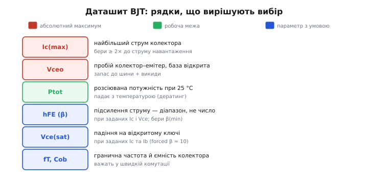
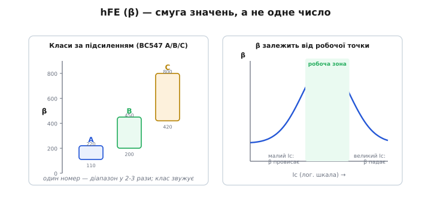
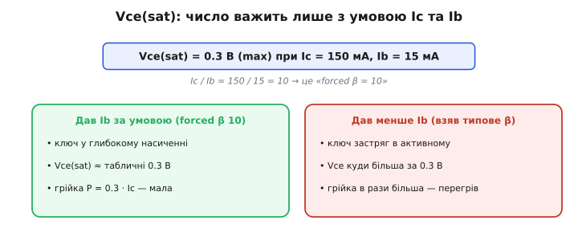
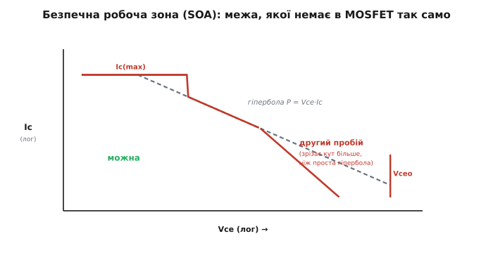

# Практикум даташитів: BJT

<preknowlist>
- [Тепловий опір](topic:physics/thermal-resistance) — Rθ як «тепловий закон Ома»: різниця температур = потужність · тепловий опір; звідси й береться дозволена потужність.
- [Тепловий розгін](topic:electronics/thermal-runaway) — нагрів піднімає провідність переходу, а вона піднімає нагрів: додатний зворотний зв'язок, що живить другий пробій.
- [Граничні режими](topic:electronics/abs-max-ratings) — абсолютні максимуми як межі руйнування приладу, окремі від його робочих параметрів.
</preknowlist>

Даташит діода читається майже як список: одна робоча точка, кілька однозначних чисел. З біполярним транзистором *(англ. bipolar junction transistor, BJT)* так не вийде — і саме на ньому ясно видно річ, яку на простіших приладах легко проґавити: **майже кожне важливе число в даташиті BJT — не число, а функція**. Підсилення залежить від струму й температури. Напруга насичення важить лише разом з умовою, за якої її виміряли. Дозволена потужність тане з нагрівом. А над усім цим висить межа, якої на діоді просто немає, — зона безпечної роботи з вигризеним кутом другого пробою.

Драйвер реле ми вже зібрали [за числами з даташита](root:embedded/bjt-load-driving): взяли Ic(max) з подвійним запасом, порахували струм бази на β(min), перезалили базу для насичення. Це був погляд **схемотехніка** — як обрати транзистор і обрахувати обв'язку. Тепер погляд інший, ближчий до паперу: **як читається сам аркуш**. Чому β в ньому — стовпчик, а не клітинка; чому Vce(sat) без своєї умови бреше; де ховається другий пробій і навіщо інженер дивиться на криву дератингу раніше, ніж радіє гучному числу потужності. Це і є практикум — не «що таке транзистор», а «що насправді каже його паспорт і де він каже неправду тому, хто читає неуважно».

### Чому даташит BJT — найкаверзніший серед простих

Діод описується кількома рядками, бо в ньому одна робоча точка: відкритий або закритий. Біполярний транзистор живе **скрізь між** цими станами, і його поведінка пливе вздовж усього діапазону струмів та температур. Тому виробник не може дати одне чесне число — він дає **смугу**, **умову** й **графік**. Хто шукає в такому документі єдину «правильну» цифру, той або бере вітринну (найкрасивішу, виміряну в найзручнішій точці), або плутає типове значення з гарантованим. І те, і те призводить до схеми, що «працює на столі» й відмовляє в полі.


*Червоне — абсолютні максимуми (Ic(max), Vceo), яких не торкаються. Зелене — Ptot, робоча межа, що сама падає з температурою. Синє — параметри, кожен зі своєю умовою: β дають при заданих Ic і Vce, Vce(sat) — при заданих Ic та Ib, fT з Cob важать лише у швидкій комутації.*

Поділ той самий, що ми бачили на діоді й MOSFET: абсолютні межі (де прилад **гине**) окремо від робочих параметрів (як він **поводиться** в дозволеній зоні). Але на BJT синій блок — найгустіший і найпідступніший, бо кожне його число тягне за собою умову. Розберімо ці рядки по черзі, від найгучнішого непорозуміння до найтоншого.

### hFE — це смуга, а не число

Найперша й найдорожча пастка даташита BJT — поставитися до коефіцієнта підсилення *(hFE, або β — гр. bḗta, друга літера абетки, позначення в теорії транзисторів)* як до однієї цифри. У документі ви побачите щось на кшталт «hFE: 110 … 800». Це не діапазон вимірювальної похибки — це **чесне зізнання**, що два сусідні транзистори з тієї самої котушки стрічки можуть мати підсилення, що різниться в **сім разів**. Так влаштоване виробництво: розкид параметрів кристала величезний, і виробник гарантує лише, що β не вийде за ці береги.

Звідси правило, яке ми вже застосовували в драйвері реле, але тепер бачимо його корінь: **для розрахунку ключа беруть β(min)**, найменше число зі стовпчика. Якщо порахувати резистор бази на типове β = 200, а в коробці трапиться екземпляр із β = 110, у базу піде замало струму, ключ не ввійде в насичення, застрягне в активному режимі — і перегріється. Чесне число тут — найгірше, бо схема має працювати з **будь-яким** екземпляром, що ви впаяєте.

Виробники навчилися робити з цього розкиду користь: ту саму мікросхему **сортують за виміряним β на класи** й дописують літеру до партномера. Класичний приклад — європейська серія BC547: суфікс задає вузький підкоридор замість широкого діапазону.

```
BC547A:  hFE = 110 … 220   (низьке підсилення)
BC547B:  hFE = 200 … 450   (середнє)
BC547C:  hFE = 420 … 800   (високе)
```

Усі три виміряні за однієї умови — Vce = 5 В, Ic = 2 мА; різниться лише, у який кошик потрапив кристал після тесту.¹ Літера не змінює транзистор фізично — вона **звужує гарантію**. Замовив BC547C — і знаєш, що β не нижче 420; узяв безіменний BC547 без літери — мусиш закладатися на 110. Це дрібниця, поки β з запасом перекриває потребу, і вирішальна річ у підсилювачі, де від β залежить робоча точка.


*Ліворуч: один номер охоплює діапазон у два-три рази; сортування на класи A/B/C звужує його. Праворуч: навіть усередині одного екземпляра β не сталий — провисає на малих струмах, тримає горб у робочій зоні й падає на великих. Тому β беруть за свого Ic, а не «взагалі».*

Та навіть вибравши клас, ви не отримуєте сталого числа — і це друга половина тієї самої пастки. **β залежить від робочої точки.** У даташиті майже завжди є крива «hFE від Ic»: на ній видно горб — підсилення провисає на дуже малих струмах, тримає максимум десь у середині діапазону й помітно падає на великих струмах, коли транзистор наближається до своєї стелі Ic(max). Тому табличне «hFE = 100 при Ic = 150 мА» нічого не каже про те, яке β буде при ваших робочих 800 мА, — а там воно може просісти вдвічі. Чесний хід: знайти на кривій точку **свого** струму й узяти β звідти, а не з рядка таблиці, виміряного там, де приладу зручно.

> 🔧 **Навіщо це.** Підсилювач, спроєктований на типове β, «гуляє» від екземпляра до екземпляра: робоча точка зсувається, спотворення ростуть, на спекотній платі все попливе ще дужче. Ключ, порахований на типове β, частина екземплярів **не дотягне** в насичення й тихо перегріє. Звичка читати β як смугу — і брати з неї найгірший для своєї задачі край — це різниця між «працює в мене на одній платі» і «працює на тисячі плат із будь-якою стрічкою компонентів».

### Vce(sat): число без умови — порожнє

Напруга насичення *(Vce(sat) — лат. saturatio, насичення)* — це та невелика напруга, що лишається на [відкритому ключі в режимі насичення](topic:electronics/bjt-regions). Чим вона менша, тим менше тепла на транзисторі й тим більше живлення дістається навантаженню. У даташиті ви знайдете, скажімо, «Vce(sat) = 0.3 В (max)». І ось ключовий момент, який відрізняє читача від невдахи: **це число важить виключно разом з умовою, за якої його виміряли**.

Поруч завжди стоять два струми, наприклад: «при Ic = 150 мА, Ib = 15 мА». Поділіть одне на одне:

```
Ic / Ib = 150 мА / 15 мА = 10
```

Це відношення називають **forced β** *(англ. forced beta — «нав'язане» β)* — підсилення, яке ви силоміць задаєте транзистору, ллючи в базу аж десяту частину струму колектора. Природне β транзистора — сотні; нав'язавши йому β = 10, ви заливаєте базу набагато щедріше, ніж їй «треба» для проведення цього струму, і саме це заганяє транзистор у **глибоке** насичення, де Vce(sat) найменша. Майже всі даташити дають Vce(sat) саме за forced β ≈ 10 (інколи 20) — це галузева угода, що робить числа різних виробників порівнянними.²


*Рядок «Vce(sat) = 0.3 В при Ic = 150 мА, Ib = 15 мА» означає forced β = 10. Зліва: дали базі стільки, скільки вимагає умова, — ключ у глибокому насиченні, Vce(sat) близька до табличної. Справа: пожаліли струму бази (заклалися на типове β) — ключ застряг в активному режимі, Vce куди більша, грійка в рази вища.*

Звідси практичний висновок, який змикається з тим, що ми робили в драйвері реле. Табличні 0.3 В ви отримаєте **тільки якщо самі дасте в базу не менше, ніж за forced β = 10**. Саме тому ми тоді «перезаливали» базу — давали струм у кілька разів більший за мінімальний `Ib = Ic/β`. Якщо ж порахувати резистор бази на природне β транзистора (хай 150) і влити в базу лише `Ic/150`, ви опинитеся далеко від умови даташита: транзистор насититься ледь-ледь, реальна Vce буде не 0.3, а, скажімо, 0.8 В і вище, і грійка зросте втричі. Число з паспорта не збреше — збреше той, хто візьме його, не виконавши умову.

**Перевірка чесної грійки ключа.** Транзистор комутує 0.5 А. Даташит дає Vce(sat) = 0.3 В при forced β = 10, тобто умова вимагає Ib = 50 мА. Але вивід мікроконтролера стільки не дасть — ми ллємо в базу лише 8 мА. Який це forced β і що з грійкою?

```
наш forced β:   Ic / Ib = 500 мА / 8 мА ≈ 62   — далеко від 10
насичення:      неглибоке → реальна Vce ≈ 0.7…1.0 В (не 0.3!)
грійка вітринна: P = 0.3 В · 0.5 А = 0.15 Вт
грійка чесна:    P ≈ 0.9 В · 0.5 А = 0.45 Вт    — утричі більша
```

Вибір очевидний: або дати в базу більше струму (а вивід МК стільки не тягне — отже, проміжний транзистор чи драйвер), або взяти ключ із меншим природним β-провисанням, або, якщо струм такий, що базу однаково ситно не нагодувати, — перейти на [польовий транзистор, де керують напругою](root:embedded/bjt-vs-mosfet) і струм у керування майже не йде. Один рядок даташита, прочитаний з умовою, одразу показує, що схема впирається в бюджет струму бази.

Поруч із Vce(sat) у тому самому блоці часто стоїть **Vbe(sat)** — напруга база–емітер у насиченні, теж за своєю умовою. Вона потрібна для точного розрахунку резистора бази: на переході падає не абстрактні «0.7 В», а конкретні Vbe(on) чи Vbe(sat) з паспорта (бувають 0.9…1.2 В на великих струмах), і ця різниця помітна, коли напруга сигналу мала.

> 🔧 **Навіщо це.** Найчастіша причина «ключ гріється, хоч даташит обіцяв 0.3 В» — узяли Vce(sat), не глянувши на умову Ib. На столі при кімнатній температурі це сходить з рук; у замкненому гарячому корпусі недооцінена втричі грійка доганяє Ptot — і спрацьовує тепловий захист або вигорає перехід. Правило коротке: **Vce(sat) без свого Ic та Ib — порожнє число**; виконав умову — віриш, не виконав — рахуй гіршу напругу.

### Абсолютні максимуми BJT: Ic, Vceo і троє братів напруги

Верхній, червоний блок даташита — [абсолютні максимуми](topic:electronics/abs-max-ratings): межі **руйнування**, а не робочі точки. На BJT їх читають з двома особливостями.

**Ic(max)** — найбільший тривалий струм колектора. Правило з драйвера реле лишається: бери прилад, де Ic(max) щонайменше вдвічі більший за струм навантаження. Запас — на пускові кидки, на старіння й на те, що поблизу Ic(max) β різко падає (той самий правий схил горба), тож працювати «під стелю» означає втратити підсилення саме там, де воно потрібне.

З напругою на BJT тонше, ніж на діоді: пробійних напруг **кілька**, і вони різні. Найчастіше в око впадає **Vceo** *(англ. collector-emitter, base open — колектор–емітер за відкритої бази)* — пробій між колектором і емітером, коли база ні до чого не під'єднана. Це **найменша** і **найобережніша** з пробійних напруг, і саме її беруть за орієнтир запасу до шини: на колекторі ключа в закритому стані лягає напруга живлення, а індуктивне навантаження [додає викид](topic:electronics/inductor-kickback), що може в рази перевищити живлення, — тому Vceo має перевищувати шину з добрим запасом. Поруч стоять **Vcbo** (колектор–база за відкритого емітера) — вона завжди вища за Vceo — і **Vebo** (емітер–база зворотно), часто дуже скромна, лише 5…6 В. Останню легко проґавити й спалити: якщо на емітерний перехід випадково ляже зворотна напруга більша за Vebo (буває в деяких схемах перемикання чи на вході), перехід пробивається й β деградує **назавжди**, навіть якщо транзистор вижив. Тому в червоному блоці BJT читають не одне число напруги, а **всі три**, і звіряють кожне зі своєю схемою.

> 🔧 **Навіщо це.** Vebo — класична тиха міна. Транзистор «начебто цілий», працює, але підсилення впало й шумить, бо емітерний перехід колись пробило зворотною напругою понад 5…6 В. Якщо в схемі на базу-емітер може лягти зворотна напруга (двополярний сигнал, швидке вимикання індуктивності з боку бази), цей рядок звіряють першим — і за потреби ставлять діод, що боронить перехід.

### Ptot і дератинг: дозволена потужність тане з нагрівом

**Ptot (Pd)** *(англ. total power dissipation — повна розсіювана потужність)* — скільки тепла транзистор віддасть, не перегрівшись. Це робоча межа, і її особливість ми вже зустрічали на MOSFET: **вона дається при 25 °C і падає зі зростанням температури корпусу** *(англ. derating — зниження норми)*. Маленький TO-92 із паспортними 500 мВт при 25 °C у реальному гарячому корпусі витримає помітно менше; силовий TO-220 із гучними «2 Вт» дасть ці вати лише на доброму радіаторі, а сам по собі, без тепловідводу, — частку від них.

Чому так — стає очевидно, щойно подивитися, **звідки** береться Ptot. Транзистор гине, коли температура його кристала *(англ. junction — перехід, Tj)* переходить межу, типово 150 °C. Тепло від кристала тече назовні через тепловий опір [«перехід → середовище»](topic:physics/thermal-resistance) (Rθ), і вся дозволена потужність — це просто

```
Ptot = (Tj(max) − T(оточення)) / Rθ
```

При 25 °C різниця температур велика, тож і дозволена потужність велика. Що гарячіше довкола, то менший чисельник — і та сама формула дає меншу Ptot. Графік дератингу в даташиті — це буквально пряма, що сповзає від повної потужності при 25 °C до нуля при Tj(max). Тому інженер дивиться на криву дератингу **раніше**, ніж радіє числу «2 Вт»: його цікавить потужність при **своїй** робочій температурі, а не у вітринній кімнаті.

Як цим користуватися на практиці й до чого тут вибір радіатора — окрема арифметика, яку варто пройти руками.

> 🧮 **Математична вставка:** [Дератинг і SOA руками: від Ptot до радіатора](root:embedded/datasheet-bjt/math-soa-derating.md). Як прочитати криву дератингу й порахувати дозволену потужність при своїй температурі; як із теплового опору «перехід → корпус → радіатор → повітря» вийти на потрібний радіатор; як прочитати лог-лог графік SOA і де на ньому лежить ваша робоча точка з усіма межами разом.

### SOA і другий пробій: межа, якої немає на діоді

Тепер найтонше — і саме тут BJT принципово відрізняється від простих приладів. Здавалося б, дозволену зону роботи задають дві межі: горизонтальна стеля Ic(max) і похила лінія сталої потужності `Vce·Ic = Ptot` (на лог-лог графіку — пряма). Усе, що під ними, — можна. Для діода так і є. Для біполярного транзистора **ні**: у нього існує власний механізм загибелі, що вигризає **додатковий кут** із цієї дозволеної зони, — **другий пробій** *(англ. second breakdown, secondary breakdown)*.


*Дозволену зону зверху обмежує Ic(max), праворуч — Vceo. Пунктир — гіпербола сталої потужності P = Vce·Ic. Та на високих напругах червона межа SOA падає крутіше за гіперболу: це другий пробій вигризає кут, якого на діоді немає. Робоча точка має лежати в зеленому «можна» — під усіма межами разом.*

Механізм причинно простий, а наслідок жорстокий. Струм через перехід тече не ідеально рівномірно: де кристал трохи тепліший, там перехід трохи краще проводить (у BJT провідність із нагрівом росте). Більший струм у тій точці гріє її ще дужче — і струм збігається у вузький **гарячий канал** *(англ. current filament, hot spot)*. Це місцевий [тепловий розгін](topic:electronics/thermal-runaway): нагрівся → пропустив більше → нагрівся ще → … Канал проплавлює кристал за мікросекунди, навіть якщо **середня** потужність ще під гіперболою Ptot. Тому другий пробій — не про загальний нагрів, а про **локальне** скупчення струму; і небезпечний він саме на високій Vce з помітним струмом, де енергія, що падає на крихітну пляму, найбільша.

Через це межа SOA на високих напругах **крутіше**, ніж проста лінія сталої потужності: транзистор гине раніше, ніж його загальна грійка дійшла б до Ptot. На графіку видно характерний злам — зрізаний кут праворуч-знизу. Інженер, що читає SOA, не вірить самій лише гіперболі потужності: він дивиться, чи лежить його робоча точка під **червоною** межею з усіма зломами, особливо якщо транзистор працює на високій напрузі в активному режимі (лінійний підсилювач, повільне перемикання індуктивності, обмежувач струму).

Тут варто відчути зв'язок із сусіднім приладом. У [MOSFET своя SOA](root:embedded/bjt-vs-mosfet), і кремнієві польові транзистори значною мірою **вільні** від класичного другого пробою — у звичайному режимі температурний коефіцієнт каналу від'ємний, тож гарячіша ділянка проводить **гірше**, і струм сам розтікається замість збігатися. Це одна з тихих причин, чому в силовому лінійному режимі (а не лише в перемиканні) часто беруть MOSFET: у BJT за нього доводиться платити пильністю до SOA. Аналогія «два транзистори — два ключі» працює до межі руйнування, а на ній прилади поводяться по-різному: один збирає струм у гарячу пляму, другий розганяє його.

> 🔧 **Навіщо це.** Класичний спосіб спалити «недонавантажений» транзистор — поставити його лінійним обмежувачем чи повільним ключем на високій напрузі, порахувавши лише `Vce·Ic < Ptot`, і не глянути на SOA. Грійка ніби в нормі, а транзистор гине від другого пробою на першому ж кидку. Для лінійних режимів на високій напрузі SOA читають **обов'язково** — і часто беруть прилад із запасом по ній або переходять на польовий.

### Швидкісні рядки: fT, Cob і час розсмоктування

Якщо транзистор не просто вмикає реле раз на секунду, а перемикається часто — у ШІМ-керуванні моторчиком, у перетворювачі живлення, у радіотракті, — у гру вступають рядки, які для повільного ключа байдужі.

**fT** *(англ. transition frequency — гранична частота)* — частота, на якій підсилення струму падає до одиниці; груба міра того, наскільки швидко транзистор узагалі здатний працювати. Для звичайних малопотужних BJT це сотні мегагерц; цього з запасом вистачає на будь-який ШІМ, але стає вирішальним у радіо. **Cob** *(англ. output capacitance — вихідна ємність, колектор–база)* — паразитна ємність, яку драйвер мусить заряджати й розряджати на кожному перемиканні; вона задає динамічні втрати й потрібний струм керування. А ще в BJT є власна повільність, якої немає в польового: **час розсмоктування** *(англ. storage time)* — затримка вимикання через те, що з глибоко насиченого переходу треба спершу «вимести» накопичені носії заряду. Чим глибше ви загнали ключ у насичення (щедрішою базою заради малої Vce(sat)), тим **довше** він потім вимикається — пряма плата за низьку напругу насичення.

Це той самий внутрішній конфлікт, що пронизує весь даташит BJT: щедра база дає малу Vce(sat) і малу грійку в статиці, але повільне вимикання й більші динамічні втрати. Повільному ключу (реле) важить лише статика — заливай базу. Швидкому (ШІМ на десятки кілогерц) щедре насичення може коштувати більше, ніж зекономило, — і тут читають уже [швидкісні характеристики й час розсмоктування](topic:electronics/bjt-switching-speed), а не саму лише Vce(sat).

> 🔧 **Навіщо це.** Транзистор, що чудово вмикав реле, у ШІМ на 20 кГц несподівано гріється сильніше, ніж рахувалося за Vce(sat): динамічні втрати на заряд Cob і на повільне вимикання з'їдають усю економію статики. На швидких задачах рядок fT і час розсмоктування читають нарівні з Vce(sat) — інакше «холодний у DC» ключ стає теплим на перемиканнях.

### Корпус і розпіновка: де ніжки і скільки тепла

Останнє, але не за важливістю, — [корпус і розпіновка](topic:electronics/packages-pinout). Корпус задає дві речі одразу: скільки тепла прилад здатен віддати (а отже, реальну Ptot) і як ніжки лягають на плату. TO-92 — маленький пластиковий, до приблизно половини ампера без радіатора; TO-220 — силовий, із металевою пластиною під радіатор, на ампери; SOT-23 та інші SMD-корпуси — для дрібних струмів і щільного монтажу.

І окрема, болюча для BJT дрібниця: **розпіновка не універсальна**. У популярних малопотужних транзисторів порядок виводів база-колектор-емітер різниться між серіями — наприклад, у американського 2N3904 і європейського BC547 він **дзеркальний**. Узяти «такий самий» транзистор із чужої серії й упаяти, не звіривши цоколівку, — класична причина, чому свіжозібрана плата не працює, а транзистор гріється чи нічого не робить. Тому навіть для копійчаної «робочої конячки» останній погляд у даташит — на картинку розпіновки під **цей** партномер.

> 📜 **Історія до теми:** [Як 2N2222 і BC547 стали стандартними транзисторами світу](root:embedded/datasheet-bjt/hist-jellybean-npn.md). Звідки взялися ці «робочі конячки», даташити яких ми читаємо: американський 2N2222 (Motorola, інженер Джек Геніхен, реєстрація в EIA 1962) і європейська серія BC із системою Pro Electron, де літера-суфікс A/B/C кодує клас підсилення. Чому в одних виводи в одному порядку, а в інших — дзеркально, і як угоди про найменування досі стирчать у кожному сучасному паспорті.

### Той самий маршрут, інша глибина

Зведімо докупи те, **чим паспорт BJT відрізняється від паспорта діода**: замість одного числа напруги — троє (Vceo, Vcbo, Vebo); замість сталої дозволеної потужності — крива, що тане з нагрівом; замість клітинки β — смуга з горбом; а під гіперболою потужності — вигризений кут другого пробою, якого на діоді немає.

Серцевина практикуму одна: **на BJT майже немає чесних окремих чисел — є числа з умовами й числа-функції**. Хто це засвоїв, той читає паспорт біполярного транзистора так само спокійно, як паспорт діода, тільки уважніше: бере β по найгіршому краю свого струму, перевіряє умову Ic/Ib під кожним Vce(sat), дивиться SOA для лінійних режимів і звіряє розпіновку перед паянням. Тоді транзистор робить рівно те, що обіцяв його аркуш, — і на столі, і в гарячому корпусі влітку, і на тисячному екземплярі з будь-якої котушки стрічки.

---

¹ Класи A/B/C серії BC547/BC548: hFE 110–220 / 200–450 / 420–800, виміряні за Vce = 5 В, Ic = 2 мА — узгоджено між даташитами кількох виробників (Taiwan Semiconductor, onsemi/Fairchild). Статус: усталено.

² Forced β ≈ 10 (Ib = Ic/10) як умова виміру Vce(sat) — галузева угода; для 2N2222A Vce(sat) = 0.3 В (max) дано саме при Ic = 150 мА, Ib = 15 мА. Негативний температурний коефіцієнт Vbe ≈ −2 мВ/°C, що живить тепловий розгін, — усталений факт. Статус: усталено.
