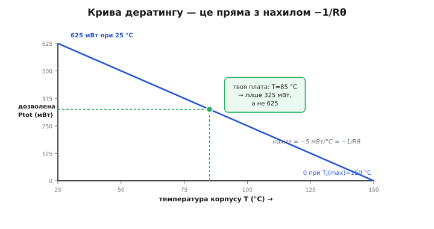
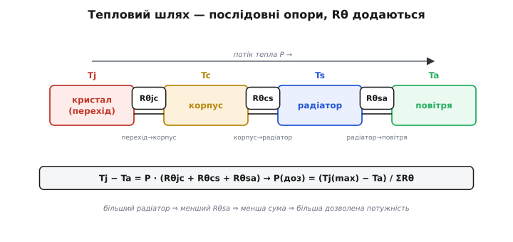
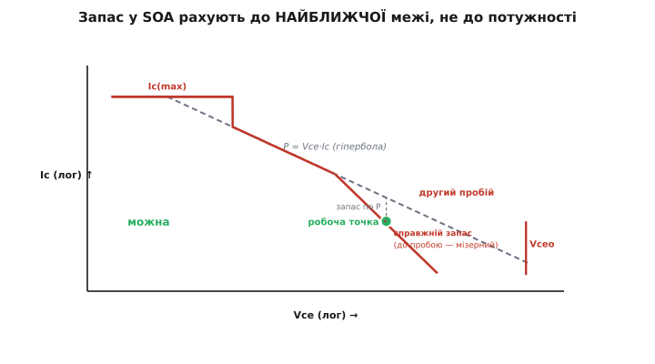

# 🧮 Дератинг і SOA руками: від Ptot до радіатора

Ми вже домовилися дивитися на криву дератингу раніше, ніж радіти гучному числу потужності, і бачили на графіку зрізаний кут другого пробою. Але «дивитися» — ще не «рахувати». У прошивці й на платі рано чи пізно постає конкретне питання з одним числом у відповіді: **скільки ват цей транзистор дозволить розсіяти саме тут — на цій платі, за цієї температури, з цим радіатором або без нього — і чи лежить моя робоча точка в безпеці?** На нього не відповісти, зчитавши цифру з даташита: цифра дана для вітринних 25 °C, а ваша плата влітку в закритому корпусі гарячіша. Треба вміти перерахувати.

Ця вставка — саме про перерахунок. Ми виведемо криву дератингу з першопринципу (а не приймемо як дану), покажемо, що її нахил — це в точності обернений тепловий опір, зберемо тепловий шлях «перехід → корпус → радіатор → повітря» як ланцюг послідовних опорів і на реальних числах порахуємо, який радіатор потрібен. А тоді навчимося читати лог-лог графік області безпечної роботи так, щоб знаходити на ньому свою точку з **усіма** межами разом і рахувати запас до найближчої з них — бо саме там, а не там, де зручно, транзистор помре першим.

Уся арифметика тут крутиться довкола одного рівняння, тож із нього й почнімо — не як з формули, а як з фізичного факту, який видно очима.

## Одне рівняння теплового потоку — і чому воно схоже на закон Ома

Транзистор гріється, бо на ньому падає потужність: у ключі це `P = Vce(sat)·Ic`, у лінійному режимі `P = Vce·Ic`. Це тепло народжується в крихітному об'ємі кристала — у самому переході *(англ. junction — перехід; звідси індекс j у Tj)* — і мусить кудись піти, інакше кристал розігріється й загине. Іти йому нікуди, крім як **назовні**: через тіло кристала до корпусу, з корпусу — у повітря чи в радіатор, звідти — в атмосферу. Що більший потік тепла й що гірше воно тече, то більший перепад температур між гарячим кристалом і холодним довкіллям.

Це формулюється точнісінько як [закон Ома](book:electronics/ohms-law), лише замість електрики — тепло. Роль напруги грає **різниця температур** `ΔT` (що жене потік), роль струму — **потужність** `P` (сам потік тепла у ватах), а роль опору — [**тепловий опір** `Rθ`](book:physics/thermal-resistance) *(англ. thermal resistance; θ — грец. thḗta, традиційне позначення температури)*, що показує, наскільки важко теплу протиснутися даним шляхом:

```
ΔT  =  P · Rθ          ⟷  теплова версія  U = I · R
```

> 🔧 **Навіщо ця аналогія.** Вона не косметична — вона працює як інструмент. Раз тепловий опір поводиться як електричний, то й **складається** він за тими самими правилами: послідовні ділянки шляху (кристал→корпус, корпус→радіатор, радіатор→повітря) додають свої Rθ так само, як послідовні резистори додають опір. Саме на цьому побудований весь розрахунок радіатора нижче. Хто відчув `ΔT = P·Rθ` як «тепловий закон Ома», тому далі не треба запам'ятовувати жодної окремої формули — усі вони випливають з цієї.

Одиниця теплового опору — градус на ват, °C/W (або, що те саме за розміром різниці, К/W). Читається буквально: «стільки градусів перегріву на кожен розсіяний ват». Якщо `Rθ = 200 °C/W`, то кожен ват, який ви примусили транзистор розсіяти, піднімає його кристал на 200 градусів над довкіллям. Пів-вата — на сто градусів. Одразу видно, чому маленький корпус без радіатора не терпить великої потужності: його Rθ величезний, і навіть скромний ват розжарює кристал за межу.

Тепер із цього однорядкового закону виведімо всю криву дератингу — вона випаде сама.

## Звідки береться дозволена потужність: дератинг — не окремий закон, а той самий Ом

Кристал гине, коли його температура переходить стелю — **максимальну температуру переходу** `Tj(max)`. Для звичайних кремнієвих транзисторів у пластиковому корпусі це типово **150 °C**; для кристалів у металевому корпусі буває й **200 °C** (нижче побачимо, що 2N2222 у металі має саме 200). Це та фізична межа, за якою кремній перестає бути напівпровідником так, як треба: провідність підкладки росте некеровано, переходи «попливають».

Питання «скільки потужності можна» — це насправді питання «яку потужність можна розсіяти, не перегрівши кристал понад `Tj(max)`». Візьмімо тепловий закон Ома й запишемо різницю температур як «стеля кристала мінус те, що довкола»:

```
Tj − T(оточення)  =  P · Rθ
```

Найбільша дозволена потужність — та, за якої `Tj` рівно дотягується до `Tj(max)` і не вище. Підставмо цю межу й розв'яжімо відносно P:

```
Ptot  =  ( Tj(max) − T(оточення) ) / Rθ
```

Ось і вся дозволена потужність. І тут — головне прозріння: **дератинг не треба нізвідки брати, він уже сидить у цій формулі.** Дивіться на чисельник. `Tj(max)` — стала (властивість кристала). `Rθ` — теж стала (властивість корпусу й шляху). Єдине, що змінюється, — `T(оточення)`. Що гарячіше довкола, то менший чисельник `Tj(max) − T(оточення)`, а знаменник той самий — отже, та сама формула дає **меншу** дозволену потужність. Не «падає окремо за якимось правилом дератингу» — просто менша різниця температур пропускає менший потік тепла крізь незмінний опір.

Побудуймо з цього криву. Відкладемо по горизонталі температуру оточення `T`, по вертикалі — дозволену `Ptot`. Формула `Ptot = (Tj(max) − T)/Rθ` — це рівняння **прямої**: лінійна за `T`, з від'ємним нахилом. Дві точки задають її повністю:

- при `T = Tj(max)` перегрівати вже нікуди, різниця нульова → `Ptot = 0`;
- при `T = 25 °C` (вітринна умова даташита) різниця найбільша → `Ptot` максимальна, і саме це число виробник друкує великим шрифтом.


*Дозволена потужність спадає прямою від паспортного максимуму при 25 °C до нуля при Tj(max) = 150 °C. Нахил цієї прямої — не довільний: він дорівнює −1/Rθ, тобто крутість спаду й є оберненим тепловим опором. На реальних 85 °C (зелена точка) від 625 мВт лишається тільки 325 — і саме це число, а не вітринне, треба порівнювати зі своєю грійкою.*

А тепер — найкорисніше спостереження, яке пов'язує криву з тепловим опором намертво. Нахил цієї прямої — це похідна `Ptot` по `T`:

```
dPtot/dT  =  −1 / Rθ
```

Нахил кривої дератингу **дорівнює оберненому тепловому опору** зі знаком мінус. Це не окремий факт, який треба зазубрити, — це те саме `Rθ` з теплового закону Ома, побачене під іншим кутом. Тому в даташитах криву дератингу й число `Rθ` часто дають як взаємозамінні: знаєш одне — маєш друге. Виробник пише «derate above 25 °C: 5.0 mW/°C» — це і є нахил, і з нього миттєво `Rθ = 1/5.0 = 200 °C/W`. Або навпаки: бачиш `RθJA = 200 °C/W` — знаєш, що на кожен градус понад 25 дозволена потужність тане на 5 мВт.

> 🔧 **Навіщо це.** Два записи — «крива дератингу» і «тепловий опір» — це одна й та сама інформація. Якщо даташит дав лише нахил у мВт/°C, а вам потрібен Rθ (щоб додати радіатор), — просто оберніть: `Rθ = 1/нахил`. Якщо дав лише Rθ, а хочете знати, скільки втратите на гарячій платі, — множте перегрів на нахил `1/Rθ`. Плутанина тут коштує дорого: інженер, що бере вітринні 625 мВт для плати з температурою 85 °C, закладає **вдвічі** більший бюджет, ніж є насправді.

## Перший worked-приклад: скільки насправді дозволяє TO-92 на гарячій платі

Візьмімо реальний транзистор — робочу конячку [P2N2222A у пластиковому корпусі TO-92](root:embedded/bjt-load-driving) від onsemi — і прочитаймо його тепловий рядок як належить.¹ Даташит дає:

```
Total Device Dissipation @ TA = 25 °C:   625 мВт   (derate 5.0 мВт/°C)
Thermal Resistance, Junction-to-Ambient:  RθJA = 200 °C/W
Operating Junction Temperature Tj(max):    150 °C
```

Спершу переконаймося, що ці три числа узгоджені між собою — це добра звичка, вона ловить друкарські помилки в даташитах. Нахил 5.0 мВт/°C мусить дорівнювати `1/RθJA`:

```
1 / RθJA  =  1 / 200  =  0.005 Вт/°C  =  5.0 мВт/°C   ✓ збігається
```

А паспортні 625 мВт мусять випадати з формули при 25 °C:

```
Ptot(25°)  =  (150 − 25) / 200  =  125 / 200  =  0.625 Вт  =  625 мВт   ✓
```

Числа сходяться — даташит внутрішньо чесний. Тепер головне питання: **плата не при 25 °C**. Уявімо реалістичну картину — прилад у закритому пластиковому корпусі, влітку, поряд гріються інші компоненти; повітря довкола транзистора має, скажімо, **60 °C**. Скільки тепер дозволено?

```
Ptot(60°)  =  (150 − 60) / 200  =  90 / 200  =  0.45 Вт  =  450 мВт
```

Уже не 625, а 450 мВт — від вітринного числа лишилося 72 %. А якщо корпус тісний і повітря розігрілося до **85 °C**:

```
Ptot(85°)  =  (150 − 85) / 200  =  65 / 200  =  0.325 Вт  =  325 мВт
```

**Трохи більше половини** паспортного числа. Ось чому інженер дивиться на дератинг раніше, ніж радіє: транзистор, який «за паспортом тягне 625 мВт», у реальному гарячому корпусі має бюджет 325 — і якщо ваша грійка `Vce(sat)·Ic` вийшла 0.4 Вт, ви **вже за межею**, хоч вітринне число вас заспокоювало.

**Скільки перегріється кристал за реальної грійки.** Нехай транзистор у тому самому 60-градусному повітрі розсіює 0.3 Вт. Куди дійде температура кристала?

```
Tj  =  T(повітря) + P · RθJA  =  60 + 0.3 · 200  =  60 + 60  =  120 °C
```

120 °C — під стелею 150, запас 30 градусів. Терпимо, але не з комфортом: варто трохи піднятися температурі в корпусі чи грійці — і ми впритул. А якби ми наївно вважали, що «розсіюємо ж усього 0.3 Вт, а дозволено 0.625» — то й не помітили б, як близько край, бо рахували від вітрини.

> 🔧 **Навіщо це.** `Tj = Ta + P·Rθ` — найкорисніша формула цієї вставки для прошивки й схеми. Вона дає **справжню** температуру кристала, а не «скільки дозволено». Хочете знати, чи виживе ключ у гарячому корпусі, — не порівнюйте потужність із паспортом, а порахуйте `Tj` і зіставте з `Tj(max)` із запасом. Запас беруть недаремно щедрий (кристал не любить жити на межі — деградує швидше): здорове правило — тримати `Tj` не вище приблизно 100…110 °C у важких умовах, навіть якщо стеля 150.

## Тепловий шлях — це ланцюг послідовних опорів

Досі ми брали один опір `RθJA` — «перехід → навколишнє повітря» одним стрибком. Але фізично тепло долає цей шлях **по ділянках**, і кожна має свій опір. Спочатку від кристала до поверхні корпусу (`Rθjc`, junction-to-case), потім від корпусу до радіатора через теплопровідну пасту чи прокладку (`Rθcs`, case-to-sink), а вже з радіатора — у повітря (`Rθsa`, sink-to-ambient). Ці ділянки йдуть **одна за одною**, послідовно, — і, за тепловим законом Ома, їхні опори **додаються**, як послідовні резистори:

```
RθJA(з радіатором)  =  Rθjc + Rθcs + Rθsa
```


*Тепло тече крізь три послідовні ділянки, кожна зі своїм Rθ; повний опір «перехід → повітря» — їхня сума. Дві перші ланки (кристал→корпус, корпус→радіатор) фіксовані конструкцією транзистора й монтажем; керована — лише остання: більший радіатор зменшує Rθsa, а з ним і всю суму, піднімаючи дозволену потужність.*

Чому це так важливо для практики? Бо з трьох доданків **два перші ви майже не можете змінити** — вони визначені кристалом і способом кріплення, і виробник дає їх у даташиті (`Rθjc`) чи в довіднику на прокладку (`Rθcs`). А третій, `Rθsa`, — **у ваших руках**: це опір радіатора, і що більший радіатор, то менший `Rθsa`, то менша вся сума, то більша дозволена потужність. Радіатор — це буквально спосіб зменшити один доданок у ланцюзі опорів.

Тепер видно й межу можливого. Скільки б велетенський не поставили радіатор, `Rθsa` можна зробити малим, але `Rθjc + Rθcs` лишаються — і повний опір **не може стати меншим за цю суму двох перших ланок**. Тобто існує стеля тепловіддачі, яку не пробити жодним радіатором: тепло однаково мусить спершу вийти з кристала до корпусу через незмінний `Rθjc`. Це фізичний ліміт корпусу.

> 🔧 **Навіщо це.** Коли схема гріється, перший інстинкт — «поставлю більший радіатор». Ланцюг опорів каже, коли це поможе, а коли ні. Якщо в сумі домінує `Rθsa` (маленький радіатор або зовсім без нього) — більший радіатор різко допоможе. Якщо ж `Rθjc` вже сам великий (дрібний корпус на кшталт SOT-23) — радіатор майже нічого не дасть, бо тепло застрягає ще до корпусу; тоді рятує лише інший, більший корпус транзистора або зменшення самої грійки. Знання, який доданок домінує, вирішує, куди витрачати зусилля.

## Другий worked-приклад: який радіатор потрібен силовому ключу

Тепер зберемо все докупи на задачі, де радіатор справді потрібен. Візьмімо той самий тип кристала, але подивімося на **два** записи потужності, які onsemi дає для TO-92, — вони чудово ілюструють роль корпусу.¹ Поряд із «625 мВт при TA = 25 °C» у тому ж даташиті стоїть друге число:

```
Total Device Dissipation @ TC = 25 °C:   1.5 Вт    (derate 12 мВт/°C)
Thermal Resistance, Junction-to-Case:     RθJC = 83.3 °C/W
```

Спершу — чому **1.5 Вт** проти **625 мВт**, коли транзистор той самий? Бо мірялися від різних точок. Перше число (625 мВт) — від навколишнього **повітря** (`TA`), крізь повний опір `RθJA = 200 °C/W`. Друге (1.5 Вт) — від **корпусу** (`TC`), крізь куди менший опір `RθJC = 83.3 °C/W`, ніби корпус тримають на ідеальних 25 °C. Перевірмо узгодженість і тут:

```
Ptot(TC=25°)  =  (150 − 25) / 83.3  =  125 / 83.3  =  1.5 Вт   ✓
нахил:         1 / 83.3  =  0.012 Вт/°C  =  12 мВт/°C   ✓
```

Друге число більше не тому, що транзистор став міцніший, а тому, що з нього прибрали найгіршу ділянку шляху — «корпус → повітря» — і сказали: «якщо ви **самі** втримаєте корпус холодним (радіатором), кристал дозволить 1.5 Вт». Число `1.5 Вт` — це обіцянка **за умови ідеального тепловідводу**, така сама умовна, як Vce(sat) за умови forced β. Без радіатора вона недосяжна: маленький TO-92 однаково впирається у свій великий `RθJA`, і паспортні «1.5 Вт по корпусу» на практиці лишаються теоретичною стелею. Задачу нижче саме тому доведеться перенести в силовий корпус.

**Задача.** Ключ має тривало розсіювати **1.2 Вт** у корпусі, де повітря `TA = 45 °C`. Кристал тримати не вище комфортних `Tj = 110 °C` (запас 40 градусів до стелі 150). Який радіатор (яке `Rθsa`) потрібен? Прокладка дає `Rθcs = 1.5 °C/W` (типова паста).

Крок 1. Скільки всього градусів перегріву ми дозволяємо на весь шлях, і який повний опір це задає для нашого потоку:

```
допустимий перегрів:   ΔT = Tj − TA = 110 − 45 = 65 °C
повний дозволений опір: RθJA = ΔT / P = 65 / 1.2 = 54.2 °C/W
```

Тобто весь шлях «перехід → повітря» мусить мати опір не більший за 54.2 °C/W, інакше 1.2 Вт перегріють кристал понад 110. Крок 2 — розкладемо цей бюджет на ланки й вивільнимо радіатор. Спробуймо спершу лишити транзистор у TO-92 з його `Rθjc = 83.3 °C/W`:

```
RθJA = Rθjc + Rθcs + Rθsa
54.2 = 83.3 + 1.5 + Rθsa   ← стоп!
```

Числа не сходяться: сам лише `Rθjc = 83.3` вже **більший** за весь дозволений бюджет 54.2. Це не помилка арифметики — це фізика, що каже правду: **у корпусі TO-92 1.2 Вт із таким запасом не втримати жодним радіатором**. Навіть з ідеальним `Rθsa = 0` повний опір був би `83.3 + 1.5 = 84.8 °C/W`, і кристал за 1.2 Вт розігрівся б до `45 + 1.2·84.8 = 147 °C` — впритул до стелі, без жодного запасу.

Це і є та стеля корпусу, про яку ми говорили. Висновок задачі — не «підберіть радіатор побільше», а **«візьміть інший корпус»**: силовий TO-220 має `Rθjc` порядку одиниць °C/W (типово 2…4), бо кристал у ньому припаяно до масивної металевої пластини. Перерахуймо для TO-220 із `Rθjc = 3 °C/W`:

```
Rθsa(потрібний)  =  RθJA − Rθjc − Rθcs  =  54.2 − 3 − 1.5  =  49.7 °C/W
```

Тепер бюджет додатний і великий: потрібен радіатор із `Rθsa ≤ 49.7 °C/W` — це зовсім скромний, майже будь-який маленький ребристий профіль або навіть достатня площа міді на платі. Різниця між «неможливо» і «тривіально» — лише в корпусі, тобто в `Rθjc`.

> 🔧 **Навіщо це.** Порядок дій завжди той самий: (1) з `Tj(max)` (із запасом) і `TA` дістати дозволений перегрів `ΔT`; (2) поділити на потужність — маєте повний дозволений `RθJA`; (3) відняти незмінні `Rθjc` і `Rθcs` — лишається потрібний `Rθsa` радіатора. Якщо на кроці 3 виходить від'ємне число — радіатор не врятує, треба менша грійка або більший корпус. Ця арифметика на трьох рядках замінює всі «на око» здогади про охолодження й одразу відрізняє «поставлю радіатор» від «взяв не той корпус».

## SOA: чому меж кілька і чому вони саме такі на лог-лог графіку

Дератинг відповідав на питання «скільки **потужності**». Але потужність — не єдина межа: та сама грійка `P = Vce·Ic` набирається по-різному — малим струмом на великій напрузі або великим струмом на малій, — і транзистору ці варіанти геть не однакові. Тому дозволену зону задають **чотири** різні межі водночас, і всі їх зводять на один графік — **область безпечної роботи** *(англ. safe operating area, SOA)*. Розберімо, звідки береться кожна межа й чому графік малюють у лог-лог.

Осі SOA — струм колектора `Ic` проти напруги `Vce`, **обидві в логарифмічному масштабі**. Чому не в звичайному? Бо межі на BJT охоплюють діапазони в тисячі разів — від міліампер до ампер, від вольта до сотні вольт, — і в лінійних осях усе цікаве збилося б у куток. А є ще й глибша причина: у лог-лог осях **степеневі залежності стають прямими лініями**, і кожна межа SOA — саме степенева. Тримається це на властивості [логарифма](book:math/logarithms): він перетворює добуток на суму (`log(Vce·Ic) = log Vce + log Ic`), тож степеневий закон `Ic ∝ Vce^k` стає прямою `log Ic = k·log Vce + const` з нахилом рівно `k`. Нахил прямої в лог-лог осях і є показником степеня — це весь секрет читання таких графіків.

Пройдімо по чотирьох межах, кожна — окрема фізична причина загибелі:

**1. Стеля струму `Ic(max)` — горизонтальна лінія зверху.** Найбільший тривалий струм, який витримують дротики виводів і металізація кристала (перегорять, як запобіжник). Не залежить від напруги, тож на графіку — горизонталь: `Ic = const`.

**2. Межа потужності `P = Vce·Ic` — пряма з нахилом −1.** Це та сама грійка, яку обмежує дератинг. Візьмімо `Vce·Ic = Ptot` (стала) і прологарифмуймо обидві частини:

```
Vce · Ic = Ptot
log Ic  =  log Ptot − log Vce
```

Це рівняння прямої `y = const − x` у координатах (`log Vce`, `log Ic`): нахил рівно **−1**. Ось чому лінія сталої потужності в лог-лог осях — акуратна пряма під −45°: кожна її точка несе однакову потужність. Праворуч (вища напруга) вона дозволяє менший струм, ліворуч — більший, добуток скрізь один.

**3. Другий пробій — пряма, що падає КРУТІШЕ за −1.** Ось де BJT показує свою окрему природу. Якби межею була лише потужність, транзистор гинув би скрізь на лінії `P = Ptot`. Але на високих напругах він гине **раніше** — при меншій потужності, ніж дозволяє гіпербола. Чому саме там, ми вже бачили якісно; тепер — чому це дає **крутіший** нахил. [Другий пробій](book:electronics/thermal-runaway) — це локальне збігання струму в гарячу пляму: де кристал трохи тепліший, там перехід краще проводить (у BJT напруга `Vbe` падає з нагрівом на ≈ −2 мВ/°C, тож гаряча ділянка «перетягує» струм на себе²), пляма гріється ще дужче — місцевий тепловий розгін. А енергія, що вливається в цю пляму, тим більша, чим вища `Vce`: заряд, пролітаючи більший перепад напруги, віддає більше. Тому загроза росте з напругою швидше, ніж проста потужність, — і межа мусить падати крутіше, з нахилом більшим за одиницю (типово −1.5…−2 у лог-лог). На графіку це видно як **злам донизу** праворуч: гіпербола потужності йде під −1, а справжня межа відхиляється від неї вниз — вигризений кут.

**4. Стеля напруги `Vceo` — вертикальна лінія праворуч.** Пробій колектор-емітер за відкритої бази (ми розбирали трьох братів напруги в основній темі). Не залежить від струму → вертикаль: `Vce = const`.


*Чотири межі разом: горизонтальна Ic(max), пунктирна гіпербола потужності (нахил −1), крутіший зріз другого пробою і вертикальна Vceo. Зелена робоча точка стоїть на високій напрузі: до гіперболи потужності (вертикальний пунктир) запас великий і оманливий, а до реальної межі — зрізу другого пробою праворуч — запас мізерний. Рахувати треба саме до найближчої межі.*

## Третій worked-приклад: читаємо запас у SOA правильно

Тепер — головна помилка, від якої ця вставка страхує, на числах. Транзистор із `Ptot = 1 Вт` (на потрібній температурі, вже з дератингом) працює лінійним обмежувачем: тримає `Vce = 30 В` при `Ic = 20 мА`. Порахуймо грійку й «запас по потужності»:

```
P = Vce · Ic = 30 · 0.02 = 0.6 Вт
запас по потужності: 1.0 Вт / 0.6 Вт ≈ 1.7×    — начебто комфортно
```

За потужністю — півтора з гаком рази запасу, спокійно. Але це **не той** запас, що вирішує долю приладу. Точка стоїть на **високій напрузі** 30 В, а там межа — не гіпербола потужності, а зріз другого пробою, який лежить **нижче**. Уявімо, що даташит на цій напрузі дозволяє в постійному режимі лише `Ic(SB) = 25 мА` (крива SOA на 30 В обривається тут, задовго до 33 мА, які дала б гіпербола `1 Вт / 30 В`):

```
що дала б гіпербола на 30 В:   Ic = Ptot/Vce = 1.0/30 ≈ 33 мА
що реально дозволяє SOA на 30 В (другий пробій):  ≈ 25 мА
наша точка:                     20 мА
справжній запас (до пробою):    25 мА / 20 мА = 1.25×    — куди тонше!
```

Різниця разюча: «запас 1.7×» за потужністю перетворюється на «запас 1.25×» до справжньої найближчої межі — а на першому ж кидку струму (увімкнення, перехідний процес) ці 25 % з'їдаються миттєво, і транзистор гине від другого пробою, хоч «за потужністю все було добре». Ось чому запас у SOA рахують **до найближчої межі на вашій напрузі**, а не до гіперболи потужності: на високій `Vce` найближчою майже завжди виявляється зріз другого пробою, а не потужність.

Є ще одна тонкість, яку графік SOA підказує уважному оку: **криві часто дано для різних тривалостей**. Постійний режим (DC) — найтісніша межа; для коротких імпульсів (`10 мкс`, `1 мс`, `10 мс`) SOA **розширюється** — крива відсувається вгору-праворуч, дозволяючи більший струм і напругу. Причина фізична: за короткий імпульс кристал не встигає прогрітися, теплова інерція рятує, і гарячій плямі бракує часу розігнатися. Тому «недонавантажений» ключ, що спокійно комутує імпульсами, у **лінійному** (постійному) режимі на тій самій робочій точці може загинути — треба брати саме DC-криву, якщо режим тривалий.

> 🔧 **Навіщо це.** Три речі, які ця арифметика вбиває в звичку. Перше: на високій напрузі запас рахують не до потужності, а до найближчої межі SOA — майже завжди це другий пробій, і він ближче, ніж здається. Друге: для тривалого (лінійного) режиму беруть **DC**-криву SOA, а не пульсовану — інакше запас фіктивний. Третє: якщо запас до другого пробою виходить тонкий, розумніше не «дотягувати», а взяти прилад із запасом по SOA або перейти на [польовий транзистор](root:embedded/bjt-vs-mosfet) — кремнієві MOSFET у звичайному режимі майже вільні від класичного другого пробою, бо їхній канал має від'ємний температурний коефіцієнт: гарячіша ділянка проводить **гірше**, і струм сам розтікається, замість збиратися в пляму.

## Що з усього цього виносити

Уся теплова частина даташита BJT стоїть на одному рівнянні — тепловому законі Ома `ΔT = P·Rθ`, — і решта випливає з нього, як наслідки, а не як окремі правила. Дозволена потужність — це `Ptot = (Tj(max) − T)/Rθ`; крива дератингу — просто ця пряма, і її нахил дорівнює `−1/Rθ`, тобто «крива» і «тепловий опір» — одна й та сама інформація в двох записах. Справжня температура кристала — `Tj = Ta + P·Rθ`, і саме її, а не порівняння з вітринним ватом, зіставляють зі стелею із щедрим запасом. Тепловий шлях «перехід → корпус → радіатор → повітря» — ланцюг послідовних опорів, що додаються; радіатор зменшує лише останню ланку, а `Rθjc` ставить стелю тепловіддачі, яку не пробити нічим, крім іншого корпусу. Розрахунок радіатора — три рядки: дозволений перегрів → повний дозволений опір → відняти незмінні ланки → лишається `Rθsa`; від'ємний результат означає «не той корпус», а не «більший радіатор». А SOA — це чотири межі водночас у лог-лог осях, де степеневі закони стають прямими: горизонталь `Ic(max)`, гіпербола потужності з нахилом −1, крутіший зріз другого пробою і вертикаль `Vceo`; запас рахують до **найближчої** межі на вашій напрузі (на високій `Vce` це майже завжди другий пробій) і по DC-кривій для тривалих режимів. Хто тримає в голові це одне рівняння і його наслідки, той рахує охолодження й безпеку ключа не «на око», а на трьох рядках арифметики — і транзистор служить рівно стільки, скільки обіцяв його паспорт, а не гине тихо в гарячому кутку корпусу.

---

¹ Числа P2N2222A (onsemi, корпус TO-92): Total Device Dissipation 625 мВт @ TA = 25 °C, derate 5.0 мВт/°C, RθJA = 200 °C/W; 1.5 Вт @ TC = 25 °C, derate 12 мВт/°C, RθJC = 83.3 °C/W; Tj(max) = 150 °C; Ic = 600 мА; Vceo = 40 В. Джерело — даташит onsemi P2N2222A (Rev. 7). Металевий 2N2222A у корпусі TO-18 має вищу стелю Tj = 200 °C і RθJA ≈ 300…350 °C/W. Статус: усталено (паспортні значення виробника).

² Механізм другого пробою — локальне збігання струму (current crowding / hot spot) через додатний температурний зв'язок: `Vbe` падає з нагрівом на ≈ −2 мВ/°C, тож гарячіша ділянка переходу перетягує струм на себе й розганяється в місцевий тепловий пробій; наслідок — межа SOA на високій напрузі падає крутіше за лінію сталої потужності (нахил у лог-лог −1.5…−2 проти −1). Кремнієві MOSFET у звичайному режимі значною мірою вільні від нього (від'ємний температурний коефіцієнт каналу). Статус: усталений напівпровідниковий факт (описано в довідковій літературі з силових приладів).
