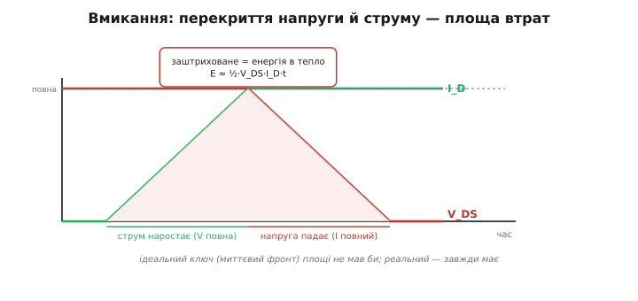
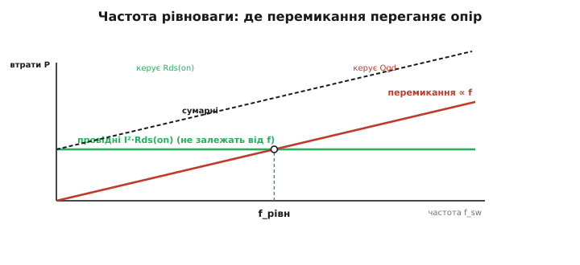

# 🧮 Втрати перемикання з заряду затвора: повне виведення

У детальному кроці ми лишили результат і інтуїцію: плато Міллера розтягує вікно втрат, довжина плато = Qgd / I_G, а потужність перемикання росте лінійно з частотою. Тепер зробімо те, що там свідомо винесли за дужки, — **виведемо кожну з цих формул від першопричини**, крок за кроком, так, щоб узяти чесне число прямо з рядка Qgd у даташиті й порахувати, чи потрібен ключу радіатор і на якій частоті провідні втрати поступляться перемиканню.

Мета вставки вузька й практична. У паспорті MOSFET є рядок Qgd (нанокулони) і крива заряду затвора; є Rds(on) і струм. Треба зв'язати їх в одне число ват і в одну частоту рівноваги. Дорога туди проста, якщо йти нею послідовно: спершу побудуємо криву напруги затвора в часі й побачимо, **чому** посередині вона застигає; тоді з цього застою дістанемо час перемикання; тоді накладемо на цей час напругу й струм на ключі й порахуємо енергію одного переходу як площу трикутника; помножимо на частоту — дістанемо потужність; і нарешті порівняємо її з провідними втратами й знайдемо точку, де вони зрівнюються.

Одна домовленість спрощує все виведення. **Драйвер затвора під час фронту віддає майже постійний струм I_G.** Це не точно (насправді струм трохи міняється, бо міняється різниця напруг на резисторі затвора), але дуже близько до правди й неймовірно зручно: якщо заряд тече сталим струмом, то заряд і час пов'язані прямо, Q = I_G · t, і **вісь заряду стає віссю часу з точністю до множника I_G**. Уся крива заряду затвора з даташита читається тоді як крива в часі — а саме час нам і потрібен, щоб дійти до втрат.

## Крива Qg(t): три ділянки й що заряджається на кожній

Почнімо з нуля — ключ закритий, затвор порожній — і повільно ллємо в нього сталий струм I_G, стежачи за напругою затвора V_GS. Уся хитрість у тому, що затвор MOSFET — **не один** конденсатор, а два, з різною роллю: ємність затвор-витік C_gs (між керуючим електродом і землею витоку) і ємність затвор-стік C_gd (місток між затвором і стоком, той самий, що дає ефект Міллера). На різних етапах фронту заряд іде переважно в різну з них — звідси й три ділянки кривої.

**Ділянка перша — підйом до порога.** Поки напруга затвора нижча за поріг V_GS(th), канал закритий, стоку струм не тече, напруга на стоці стоїть на повній V_DS шини й не рухається. Раз стік нерухомий, місток C_gd свою напругу не міняє й заряду майже не бере — увесь струм драйвера йде в C_gs. Ємність тут стала, тож напруга росте лінійно:

```
V_GS(t) = (I_G / C_gs) · t        (лінійний підйом, поки V_GS < V_GS(th))
```

Ключ ще повністю вимкнений; це «розгін» затвора до точки, з якої почнеться щось цікаве. Заряд, витрачений тут, — частина повного Qgs (заряду затвор-витік).

**Ділянка друга — плато Міллера.** Як тільки V_GS переходить поріг, канал прочиняється й починає проводити струм. Струм стоку швидко наростає до повного струму навантаження I_D — і ось у цей момент напруга затвора **застигає** на місці. Це плато, і саме воно — серце всієї історії втрат, тож розберімо застій ретельно, бо в ньому не одне «дивно», а чіткий механізм.

Чому напруга затвора перестає рости, хоча струм у неї далі тече? Тому що щойно канал повів повний струм, стік більше не може лишатися на повній напрузі — він мусить **падати** з V_DS до майже нуля (до I_D·Rds(on)). А стік і затвор зв'язані містком C_gd. Коли стік стрімко валиться вниз на величезні вольти, крізь цей місток тече великий струм перезаряду — і весь струм драйвера I_G іде саме на нього, на «перекидання» напруги стоку, а не на підняття напруги затвора. Затвор ніби стоїть на гальмі: скільки заряду в нього не лий, він увесь витікає крізь C_gd назустріч падаючому стоку.

Тут вступає ефект Міллера й робить застій довгим. Місток C_gd — це та сама ємність, що охоплює підсилювальний прилад між входом (затвор) і виходом (стік), який під час фронту йде в протилежний бік і в багато разів дужче. Тому з боку затвора вона виглядає не як голий C_gd, а як **роздута** ємність C_gd·(1+A), де A — миттєве підсилення каскаду на фронті. Механіку цього множення — чому саме (1+A), а не A чи (1+A)² — виводить окрема [тема ефекту Міллера](topic:electronics/miller-effect/math-miller-derivation.md): коротко, вихід тікає назустріч входу й на кожен вольт затвора додає A вольтів зустрічного розмаху стоку, тож заряду треба влити стільки, наче ємність у (1+A) разів більша. Ось чому плато таке помітне: перезаряджати доводиться не малий C_gd, а його роздутий Міллером образ.

> 🔧 **Навіщо це.** Плато Міллера — не академічна цікавинка, а місце, де ключ гріється найдужче й де народжується половина проблем силового каскаду. Поки триває плато, на ключі водночас майже повна напруга й майже повний струм — це піковий стан розсіювання. Хто розуміє, що застій — це «стік валиться крізь C_gd», той відразу знає ліки від довгого гарячого плато: лити в затвор більший струм I_G (потужніший драйвер), бо весь заряд Qgd тоді виноситься швидше.

**Ділянка третя — дозаряд до повної напруги.** Коли стік досягнув дна (ключ повністю відкрився, напруга на ньому вже мала), перекидати більше нічого — місток C_gd перестає красти струм. Драйвер знову заряджає ємності затвора, і напруга V_GS доростає від рівня плато до повної напруги керування V_dr. Ця ділянка добиває канал у глибоке відкриття (дотискає Rds(on) до паспортного мінімуму), але напруги й струму на ключі вже майже не перекриваються, тож для втрат вона другорядна. Заряд тут — решта Qgs плюс частина, яку в даташиті часом звуть Qgd-хвостом.

Три ділянки — і ключова серед них середня. Саме на плато напруга на ключі проходить увесь свій шлях від повної до нуля, а струм уже повний; саме там перекриття напруги й струму, а отже — втрати. Тому далі нас цікавить довжина рівно цієї ділянки.

## Довжина плато: t_плато = Qgd / I_G

Тепер найкоротший, але найважливіший крок виведення — і він майже безкоштовний завдяки нашій домовленості про сталий струм. Заряд, який треба вилити крізь місток C_gd, щоб перекинути стік з повної напруги до нуля, — це і є **заряд Міллера Qgd**, окремий рядок даташита. Драйвер вливає його сталим струмом I_G. Час = заряд / струм:

```
t_плато = Q_gd / I_G
```

От і все виведення — але прочитаймо, що воно каже, бо тут ховається неочевидне. **Час перемикання — це не властивість транзистора.** Це частка від двох чисел: паспортного заряду Qgd (це від транзистора) і струму драйвера I_G (це від нашої схеми). Той самий MOSFET на слабкому драйвері перемикається повільно, на потужному — швидко, у стільки разів, у скільки різні I_G. Даташитний «час перемикання» без указаного струму затвора — половина фрази; повна фраза завжди «за такого-то I_G».

Струм драйвера, своєю чергою, задає резистор затвора R_G і напруга на ньому. У найгрубішому наближенні під час плато напруга затвора стоїть на рівні плато V_plateau, драйвер тримає на виході V_dr, і струм крізь резистор:

```
I_G ≈ (V_dr − V_plateau) / R_G
```

Тому на практиці довжину плато міняють двома ручками: беруть менший R_G (більший струм, коротше плато, менше втрат — але «брудніше» в ефірі, більше завад) або вищу V_dr. Це та сама розмінна монета, що в темі [ємності затвора](topic:electronics/gate-capacitance): швидше — холодніше, але галасливіше.

Той самий приклад із детального кроку тепер стоїть на власному виведенні. Даташит дає Qgd = 15 нКл, драйвер жене I_G = 1 А:

```
t_плато = Q_gd / I_G = 15·10⁻⁹ / 1 = 15 нс   (на один фронт)
```

П'ятнадцять наносекунд стік валиться з повної напруги до нуля. Ослабили драйвер удесятеро, до 0.1 А, — плато розтяглося б до 150 нс, і, як побачимо нижче, втрати перемикання зросли б рівно вдесятеро. Ось де рядок Qgd з даташита прямо перетворюється на тепло.

## Енергія одного переходу: трикутник перекриття

Маємо час, на якому напруга й струм на ключі перекриваються. Тепер накладемо на цей час самі напругу й струм і порахуємо енергію — бо енергія і є те, що гріє.

Спершу чесна картина фронту, бо в ній є тонкість, яку варто бачити, перш ніж спрощувати. Під час **вмикання** події йдуть у такому порядку: спочатку, щойно канал відкрився, наростає **струм** стоку — від нуля до повного I_D (напруга на ключі при цьому ще майже повна, бо струм тече крізь індуктивне навантаження, а стік ще не почав падати); і лише **після** того, на плато Міллера, падає **напруга** V_DS — від повної до нуля (струм при цьому вже повний). Тобто перекриття є на обох підінтервалах: спершу «повна напруга × наростаючий струм», тоді «спадна напруга × повний струм». При **вимиканні** порядок дзеркальний: спершу піднімається напруга, тоді спадає струм.

На кожному з цих підінтервалів добуток миттєвих напруги й струму — це трикутник: одна величина повна, друга лінійно проходить від нуля до повної (чи навпаки). Площа під добутком за час переходу — енергія. Візьмімо повний час перекриття на вмиканні t_on (сума наростання струму й спаду напруги) і усереднімо: одна з величин увесь час близька до повної (V_DS або I_D), друга в середньому проходить половину шляху. Звідси класична оцінка енергії одного вмикання як **половини добутку повних напруги й струму на час перекриття**:

```
E_on ≈ ½ · V_DS · I_D · t_on
```


*Вмикання: спершу наростає струм (напруга ще повна), тоді на плато Міллера падає напруга (струм уже повний). На обох підінтервалах напруга й струм перекриваються — заштрихована площа і є енергія, що йде в тепло. Ідеальний ключ (миттєвий фронт) площі не мав би зовсім; реальний фронт скінченної довжини завжди її має, і вона тим більша, чим довший фронт.*

Звідки береться множник ½ — видно з трикутника без формул. Якби обидві величини були повні весь час t_on, енергія була б V_DS·I_D·t_on — площа прямокутника. Але одна з них лінійно повзе від нуля до повної, тобто в середньому дорівнює половині, — і прямокутник стає трикутником удвічі меншої площі. Ось і ½. Це наближення (форма фронту не ідеально лінійна, а перекриття — з двох трикутників), але для оцінки, яку читають прямо з даташита, воно чесне й стандартне: саме так виробники визначають паспортні енергії E_on і E_off.

Вимикання дає таку саму за формою енергію, тільки з часом вимикання t_off:

```
E_off ≈ ½ · V_DS · I_D · t_off
```

Повна енергія, втрачена за **один цикл** перемикання (одне вмикання плюс одне вимикання):

```
E_sw = E_on + E_off ≈ ½ · V_DS · I_D · (t_on + t_off)
```

Тут V_DS — напруга шини, яку ключ блокує в закритому стані, а I_D — струм, який він проводить у відкритому. Обидві повні, бо саме їхнє перекриття ми й ловимо. А час перемикання в найпростішому наближенні — це ті самі плато Міллера на кожному фронті: t_on ≈ t_off ≈ Qgd / I_G. Підставивши, дістаємо енергію циклу прямо з рядка Qgd:

```
E_sw ≈ ½ · V_DS · I_D · (2·Q_gd / I_G) = V_DS · I_D · Q_gd / I_G
```

Ця форма промовиста: енергія втрат на перемикання прямо пропорційна заряду Міллера Qgd і обернено — струму драйвера I_G. Обидві ручки видно відразу: менший Qgd (кращий транзистор для швидких ключів) або більший I_G (потужніший драйвер) — і енергія кожного переходу менша.

## Від енергії до потужності: чому втрати ростуть із частотою

Енергія E_sw губиться **на кожному** циклі перемикання. Якщо ключ перемикається f_sw разів на секунду, то втрачена за секунду енергія — тобто потужність — це просто E_sw, помножена на кількість циклів:

```
P_sw = E_sw · f_sw ≈ ½ · V_DS · I_D · (t_on + t_off) · f_sw
```

Це і є та формула, яку детальний крок дав готовою. Тепер вона стоїть на повному виведенні: кожен її множник ми здобули окремо — ½ з трикутника перекриття, V_DS·I_D з накладання напруги й струму на час фронту, (t_on+t_off) з довжини плато, а f_sw з того, що трикутник повторюється щоцикла.

Найважливіше в ній — **лінійна залежність від частоти**. Провідні втрати (нижче) від частоти не залежать зовсім; втрати перемикання ростуть із нею прямо. Ось чому на низькій частоті перемикання майже не гріє, а на високій стає головним джерелом тепла: не тому, що кожен перехід став дорожчим, а тому, що переходів за секунду стало більше.

Підставимо повний набір чисел з детального кроку — ключ комутує I_D = 5 А від шини V_DS = 24 В на f_sw = 100 кГц, драйвер дає I_G = 1 А, заряд Qgd = 15 нКл:

```
t_плато на фронт:  t = Q_gd / I_G = 15·10⁻⁹ / 1 = 15 нс
час перекриття:    t_on + t_off ≈ 2 · 15 нс = 30 нс
енергія циклу:     E_sw = ½ · 24 · 5 · 30·10⁻⁹ = 1.8·10⁻⁶ Дж = 1.8 мкДж
потужність:        P_sw = E_sw · f_sw = 1.8·10⁻⁶ · 100·10³ = 0.18 Вт
```

Ті самі 0.18 Вт, що в детальному кроці, — але тепер ми знаємо, звідки кожне число, і можемо перерахувати їх під будь-який інший ключ, драйвер чи частоту, а не приймати результат на віру. Наприклад, підняли б частоту до 500 кГц — і лише ця складова дала б 0.9 Вт, уже серйозний нагрів; ослабили б драйвер до 0.2 А — плато розтяглося б до 75 нс, і P_sw піднялася б до 0.9 Вт на тій самій сотні кілогерц. Обидві ручки — частота й драйвер — тягнуть той самий трикутник.

## Дві втрати поряд і частота рівноваги

Тепер поставмо втрати перемикання поруч із їхнім двійником — **провідними втратами** — бо разом вони й вирішують долю ключа, і разом визначають, до якої частоти взагалі варто його розганяти.

Провідні втрати — тепло, яке ключ виділяє, поки просто проводить струм у відкритому стані. Тут працює опір відкритого каналу [Rds(on)](topic:electronics/rds-on), і потужність — звичайне джоулеве I²·R:

```
P_cond = I_D² · Rds(on)
```

(Точніше, з поправкою на робочий цикл D — частку часу, коли ключ відкритий, — P_cond = D · I_D² · Rds(on); для оцінки й порівняння з перемиканням візьмімо ключ, що більшість часу відкритий, D ≈ 1.) Головне в цій формулі — чого в ній **немає**: частоти. Скільки б разів на секунду ключ не перемикався, поки він відкритий, він гріється однаково — від струму й опору. Провідні втрати — горизонтальна лінія на графіку «втрати від частоти».

А втрати перемикання, ми щойно вивели, ростуть із частотою лінійно — це похила пряма з нуля. Дві прямі — горизонтальна й похила — неодмінно перетинаються в одній точці. Ця точка й є **частота рівноваги** f_рівн: нижче неї головні втрати провідні (дивись на Rds(on)), вище — перемикання (дивись на Qgd і драйвер). Знайдемо її, прирівнявши обидві потужності:

```
P_cond = P_sw
I_D² · Rds(on) = ½ · V_DS · I_D · (t_on + t_off) · f_рівн
```

Скоротимо один множник I_D й виразимо частоту:

```
f_рівн = (I_D · Rds(on)) / (½ · V_DS · (t_on + t_off))
       = 2 · I_D · Rds(on) / (V_DS · (t_on + t_off))
```


*Провідні втрати (горизонталь) від частоти не залежать; втрати перемикання (похила з нуля) ростуть із частотою прямо; сумарні — їхня сума. Точка перетину — частота рівноваги: ліворуч від неї ключ гріється переважно опором каналу, праворуч — перемиканнями. Вибираючи транзистор під частоту, дивляться, з якого боку цієї точки працюватимуть.*

Порахуймо для нашого прикладу, де провідні втрати (з гарячим опором 14.4 мОм із детального кроку) дорівнюють 0.36 Вт, а перекриття тримається 30 нс:

```
f_рівн = 2 · 5 · 0.0144 / (24 · 30·10⁻⁹)
       = 0.144 / (7.2·10⁻⁷)
       = 2.0·10⁵ Гц = 200 кГц
```

Ось конкретна відповідь для цього ключа: до 200 кГц він гріється переважно опором каналу, вище — переважно перемиканнями. Наші робочі 100 кГц лежать нижче рівноваги, тож провідні втрати (0.36 Вт) справді переважають перемикання (0.18 Вт) — рівно вдвічі, як і має бути на половині частоти рівноваги. А якби задача вимагала 400 кГц, картина перевернулася б: перемикання дало б 0.72 Вт проти тих самих 0.36 Вт провідних, і вирішальним рядком даташита став би вже не Rds(on), а Qgd — довелося б брати транзистор з меншим зарядом Міллера, навіть ціною трохи більшого опору.

Ця частота рівноваги і є та розвилка, що ділить вибір MOSFET на два світи, про які каже [тема ємності затвора](topic:electronics/gate-capacitance): для рідкісних перемикань (реле, повільний ключ) шукаєш найменший Rds(on), а Qgd байдужий; для високочастотного перетворювача — навпаки, найменший Qgd і потужний драйвер, бо саме перемикання переганяють провідність. Формула f_рівн дає точну межу між цими світами під конкретні числа, а не на око.

## Що з цього винести

Уся дорога від рядка Qgd до ват і до частоти рівноваги пройдена без жодного стрибка. Ключ до неї — домовленість, що драйвер віддає сталий струм I_G, після якої вісь заряду в даташиті стає віссю часу. Крива Qg(t) має три ділянки, бо затвор — це два конденсатори з різною роллю: спершу струм іде в C_gs і напруга затвора лінійно росте до порога; тоді канал відкривається, стік мусить упасти, і весь струм драйвера йде крізь місток C_gd на перекидання напруги стоку — напруга затвора застигає на плато Міллера, довгому саме тому, що ефект Міллера роздуває C_gd у (1+A) разів; а після дна стоку драйвер добиває затвор до повної напруги. Довжина плато — це просто заряд Міллера, поділений на струм драйвера, t_плато = Qgd / I_G, і звідси головна теза: час перемикання не властивість транзистора, а частка двох чисел, одне з паспорта (Qgd), друге зі схеми (I_G). На цьому часі напруга й струм на ключі перекриваються трикутником, і його площа — енергія одного переходу E ≈ ½·V_DS·I_D·t (множник ½ — бо одна величина в середньому проходить половину, тобто прямокутник стає трикутником). Помноживши на кількість переходів за секунду, дістаємо P_sw ≈ ½·V_DS·I_D·(t_on+t_off)·f_sw — потужність, що, на відміну від провідної I²·Rds(on), росте лінійно з частотою. Поставивши обидві поряд і прирівнявши, знаходимо частоту рівноваги f_рівн = 2·I_D·Rds(on) / (V_DS·(t_on+t_off)) — точку, нижче якої ключ гріється опором, вище — перемиканнями, і саме вона каже, на який рядок даташита — Rds(on) чи Qgd — дивитися під свою частоту.

Наостанок — про статус чисел, бо це прямо стосується практикуму даташитів. Qgd (як і весь заряд затвора) виробник майже завжди дає **типовим**, без гарантованого `max`: це той самотній `typ`, якому в темі анатомії числа ми не довіряли як контракту. Тому f_рівн і P_sw, пораховані з нього, — оцінка порядку, а не гарантія до вата; закладати радіатор і запас треба з полем на розкид Qgd від партії до партії. А ще пам'ятаймо межу самої моделі: трикутник перекриття — чесне наближення для «жорсткого» перемикання на індуктивне навантаження, але в схемах м'якого перемикання (резонансних, з перемиканням у нулі напруги) перекриття навмисне зводять до нуля, і ця формула там уже не працює — там втрати рахують інакше. Для звичайного ж імпульсного ключа вона дає саме те, що треба: чесне число ват із рядка Qgd і чесну частоту, за якою його вже не варто розганяти.
