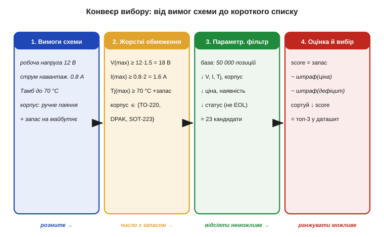
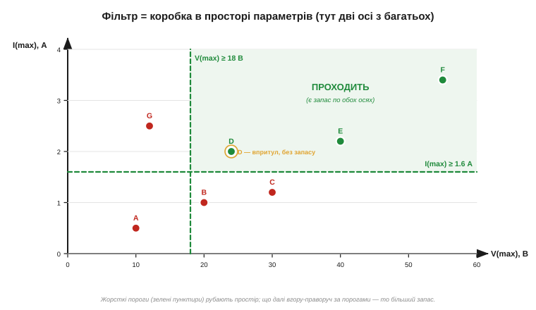

# ⚙️ Чеклист вибору компонента: від вимог схеми до параметричного пошуку

> Уміти **прочитати** [даташит конкретного приладу](root:embedded/datasheet-practice) — півсправи. Тут — крок назад: як від **вимог схеми** дійти до самого приладу, коли в каталозі їх десятки тисяч. Це проста, але дисциплінуюча процедура — фільтр плюс оцінка — і вона лягає в основу будь-якого **параметричного пошуку** *(parametric search)* на сайтах дистриб'юторів.

### Задача

Схема каже: «тут потрібен MOSFET», «сюди — стабілітрон», «оце місце просить операційний підсилювач». Але «MOSFET» — це не один прилад, а полиця з **десятків тисяч** позицій, що різняться напругою, струмом, корпусом, ціною, наявністю. Вибрати навмання — означає або взяти завеликий і дорогий, або впертися у межу й спалити його в першому ж стрес-тесті, перевищивши [абсолютний максимум](topic:hw-components/abs-max-ratings).

Завдання формулюється так: маючи **розмиті** вимоги схеми (робоча напруга, струм, температура, спосіб монтажу), отримати **короткий список** із 2–3 конкретних приладів, чиї даташити варто прочитати уважно. Усе, що стоїть між цими двома точками, — суто алгоритм.

### Ідея: жорсткі обмеження → фільтр → оцінка

Розв'язок розпадається на чотири кроки, і порядок тут важливий.


*Чотири етапи. (1) Витягаємо вимоги зі схеми — поки що розмиті. (2) Перетворюємо їх на **жорсткі обмеження** з уже закладеним запасом: робочу напругу множимо на коефіцієнт, струм — теж, корпус зводимо до списку «що паяється». (3) **Фільтр** проганяє повну базу крізь ці пороги й лишає кандидатів. (4) **Оцінка** ранжує тих, хто пройшов, і дає топ-3.*

Перший крок — **кількісно** записати вимоги. Не «напруга невелика», а «робоча 12 В». Другий — і це серце процедури — перевести кожну вимогу в **жорстке обмеження із запасом** *(margin)*. Робоча напруга 12 В не означає «шукаю прилад на 12 В»: береться запас (типово ×1.5…×2 для напруги, ×2 для струму), тож обмеження стає «V(max) ≥ 18 В». Запас тут — не забаганка, а пряме застосування правила про [абсолютні максимуми](topic:hw-components/abs-max-ratings): між робочою точкою й абсолютним максимумом мусить лишатися прірва. На цьому ж кроці враховуємо derating за температурою — [графіки даташита](topic:hw-components/datasheet-graphs) показують, як спадає допустиме навантаження: якщо довкола гаряче, поріг по струму чи потужності ще піднімається.

Третій крок — **фільтр**. Кожне жорстке обмеження — це поріг на одній з осей простору параметрів. Прилад **проходить** лише тоді, коли задовольняє **всі** пороги одночасно.


*Дві осі простору параметрів (а їх більше): максимальна напруга й струм. Зелені пунктири — пороги (V(max) ≥ 18 В, I(max) ≥ 1.6 А). Прилади A, B, C, G не дотягують хоч по одній осі — відсіюються. D, E, F проходять. Але D сидить **упритул** до порога — формально пройшов, а запасу обмаль; справжній вибір — серед тих, хто далі вгору-праворуч.*

Четвертий крок — **оцінка**. Тих, хто пройшов фільтр, лишається ще багато, і всі вони формально придатні. Тепер їх треба впорядкувати за «м'якими» критеріями: більший запас — добре, нижча ціна — добре, краща наявність — добре, статус «не EOL» *(end-of-life, знято з виробництва)* — обов'язково. Складаємо просту **оцінну функцію** (score) і сортуємо за нею спадно. Верхівка списку — і є кандидати в даташит.

### Процедура в коді

Ось той самий конвеєр робочим кодом на C. Величини тримаємо в цілих (мВ, мА) — як на мікроконтролері без плаваючої коми, — а хід точно повторює чотири кроки вище: вимоги → пороги → фільтр → оцінка.

```c
#include <stdint.h>
#include <stddef.h>
#include <stdlib.h>
#include <stdio.h>

/* Корпуси; лише перші три паяються вручну — решту фільтр відкине. */
typedef enum { PKG_TO220, PKG_DPAK, PKG_SOT223, PKG_SOIC, PKG_QFN } Package;

/* Рядок бази: один прилад із його граничними параметрами. */
typedef struct {
    const char *name;
    int32_t v_max_mv;   /* абсолютний максимум по напрузі, мВ    */
    int32_t i_max_ma;   /* гранично допустимий струм, мА          */
    int32_t tj_max_c;   /* макс. температура кристала, °C         */
    Package pkg;
    int32_t price;      /* ціна, грн                              */
    int32_t deficit;    /* 0 — на складі … 100 — не дістати       */
    int      eol;       /* 1 — знято з виробництва (end-of-life)  */
} Part;

/* Жорсткі пороги: нижче них кандидата навіть не розглядаємо. */
typedef struct {
    int32_t v_min_mv;
    int32_t i_min_ma;
    int32_t tj_min_c;
} Hard;

/* Крок 1–2: розмиті вимоги схеми → жорсткі пороги із запасом.
   Множимо ДО ділення (×3/2 = ×1.5), щоб не втратити точності на
   цілих; для реальних напруг int32 не переповнюється. */
static Hard make_hard(int32_t work_v_mv, int32_t work_i_ma, int32_t t_amb_c)
{
    Hard h;
    h.v_min_mv = work_v_mv * 3 / 2;   /* ×1.5 запас по напрузі    */
    h.i_min_ma = work_i_ma * 2;       /* ×2  запас по струму      */
    h.tj_min_c = t_amb_c + 40;        /* +40 °C запас по кристалу  */
    return h;
}

static int solderable_by_hand(Package p)
{
    return p == PKG_TO220 || p == PKG_DPAK || p == PKG_SOT223;
}

/* Крок 3: фільтр. Один провалений поріг — і кандидат вибуває,
   хай би якими блискучими були решта параметрів (це AND, не OR). */
static int passes(const Part *p, const Hard *h)
{
    if (p->v_max_mv < h->v_min_mv)   return 0;   /* не тримає напругу   */
    if (p->i_max_ma < h->i_min_ma)   return 0;   /* не тримає струм     */
    if (p->tj_max_c < h->tj_min_c)   return 0;   /* перегріється        */
    if (!solderable_by_hand(p->pkg)) return 0;   /* не той корпус       */
    if (p->eol)                      return 0;   /* знято з виробництва */
    return 1;
}

/* Вузьке місце запасу — менший із двох коефіцієнтів, у відсотках.
   64-бітний проміжок множення страхує від переповнення. */
static int32_t margin_pct(const Part *p, const Hard *h)
{
    int32_t mv = (int32_t)((int64_t)p->v_max_mv * 100 / h->v_min_mv);
    int32_t mi = (int32_t)((int64_t)p->i_max_ma * 100 / h->i_min_ma);
    return mv < mi ? mv : mi;
}

/* Оцінна функція: більший запас — краще, ціна й дефіцит — гірше.
   Малий запас окремо не штрафуємо: його вже закладено в пороги
   make_hard. Ваги — цілі, під ваш пріоритет. */
static int32_t score(const Part *p, const Hard *h)
{
    enum { W_MARGIN = 1, W_PRICE = 1, W_DEFICIT = 2 };
    return W_MARGIN  * margin_pct(p, h)
         - W_PRICE   * p->price
         - W_DEFICIT * p->deficit;
}

/* Кандидат, що пройшов фільтр, із уже порахованою оцінкою —
   так компаратор сортування не потребує доступу до Hard. */
typedef struct { const Part *part; int32_t score; } Ranked;

static int by_score_desc(const void *a, const void *b)
{
    int32_t sa = ((const Ranked *)a)->score;
    int32_t sb = ((const Ranked *)b)->score;
    return (sb > sa) - (sb < sa);   /* спадання, без ризику переповнення */
}

/* Фільтр (O(n)) → оцінка → сортування тих, хто пройшов (O(m·log m)).
   cand/cap — буфер кандидатів (для повної бази його розмір беруть
   динамічно; тут вистачає статичного). Повертає m — скільки пройшло. */
static size_t select_parts(const Part *base, size_t n, const Hard *h,
                           Ranked *cand, size_t cap)
{
    size_t m = 0;
    for (size_t i = 0; i < n; ++i) {          /* крок 3: один прохід  */
        if (!passes(&base[i], h))
            continue;
        if (m < cap) {                        /* крок 4: одразу score */
            cand[m].part  = &base[i];
            cand[m].score = score(&base[i], h);
            ++m;
        }
    }
    qsort(cand, m, sizeof cand[0], by_score_desc);
    return m;                                  /* верхівка cand[0..2]  */
}

int main(void)
{
    /* Вимоги схеми: робочі 12 В, 0.8 А, довкола до 70 °C. */
    Hard h = make_hard(12000, 800, 70);  /* → Vmax≥18 В, Imax≥1.6 А, Tj≥110 °C */

    static const Part base[] = {
        /* name         Vmax   Imax  Tj   корпус       грн  деф eol */
        { "A 40V/2A",   40000, 2000, 150, PKG_TO220,   18,  0, 0 },
        { "B 30V/3A",   30000, 3000, 150, PKG_DPAK,    25, 10, 0 },
        { "C 20V/1A",   20000, 1000, 125, PKG_SOT223,  12,  0, 0 }, /* струм < 1.6 А */
        { "D 18V/1.6A", 18000, 1600, 150, PKG_TO220,    9,  0, 0 }, /* упритул       */
        { "E 60V/2A",   60000, 2000, 175, PKG_QFN,     15,  0, 0 }, /* корпус        */
        { "F 60V/4A",   60000, 4000, 150, PKG_DPAK,    30, 50, 0 },
        { "G 40V/2A",   40000, 2000, 150, PKG_TO220,   17,  0, 1 }, /* знято з випуску */
    };
    enum { N = sizeof base / sizeof base[0] };

    Ranked cand[N];
    size_t m = select_parts(base, N, &h, cand, N);

    size_t top = m < 3 ? m : 3;
    for (size_t i = 0; i < top; ++i)
        printf("%zu. %-10s  score=%ld\n",
               i + 1, cand[i].part->name, (long)cand[i].score);
    return 0;
}
```

### Складність і пастки на МК

- **Складність.** Фільтр — один прохід по базі, **O(N)**; сортування тих, хто пройшов, — O(M log M), де M ≪ N. Для типової бази (N ~ 50 000) це мить навіть на скромному залізі. На самому МК такий пошук роблять рідко (база велика), але та сама логіка — фільтр потім оцінка — лежить, наприклад, у виборі режиму чи профілю з таблиці налаштувань.
- **Порядок: спершу фільтр, потім оцінка.** Не міняйте місцями. Оцінювати треба лише тих, хто **фізично придатний**; інакше дешевий, але заслабкий прилад спливе нагору завдяки низькій ціні — і ви візьмете те, що згорить.
- **«Впритул» — це не «проходить».** Кандидат на самій межі порога (прилад D на рисунку вище) формально пройшов, та запас у нього нульовий. Або закладайте запас одразу в пороги (як вище), або штрафуйте малий запас у score — інакше фільтр пропустить кандидатів без жодного резерву.
- **AND, а не OR.** Прилад мусить задовольняти **всі** обмеження разом. Часта помилка новачка — зрадіти, що знайшовся прилад із чудовим струмом, і не помітити, що по напрузі він не дотягує. Один провалений поріг — і кандидат вибуває, хай би якими блискучими були решта параметрів.
- **Одиниці й порівняння.** Перш ніж порівнювати, зведіть усе до **однакових одиниць** (мА проти А, мВт проти Вт): база й вимоги легко розходяться. На МК без плаваючої коми тримайте величини в цілих (мкА, мВ) і пильнуйте переповнення при множенні на коефіцієнт запасу.
- **«Тихі» осі.** Найпідступніші вимоги ті, що в схемі не написані прямо: швидкодія, струм спокою, мінімальна робоча напруга, температурний діапазон. Їх легко забути внести у фільтр — і дістати прилад, що проходить за струмом і напругою, але не лізе у ваш бюджет живлення. Складіть постійний список осей наперед.

Отак «підбери компонент» виявляється не магією досвіду, а відтворюваною процедурою: записав вимоги числом, додав запас, відсіяв неможливе, відсортував можливе. Параметричний пошук на сайтах дистриб'юторів — це рівно цей алгоритм із зручною формою; а зрозумівши його кістяк, ви однаково впевнено шукаєте і там, і в офлайновому каталозі, і в голові.
