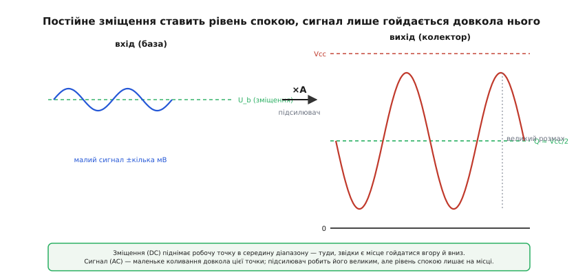
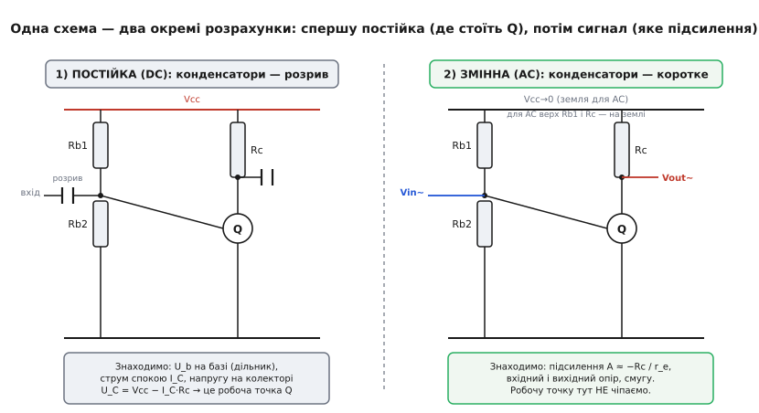
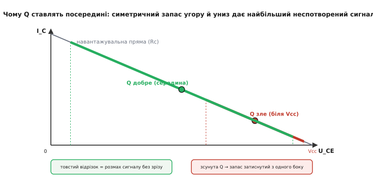

# DC-зміщення і AC-сигнал у підсилювачі

<preknowlist>
- [BJT-підсилювач зі спільним емітером](topic:electronics/bjt-amplifier) — мала зміна напруги на базі дає в кілька десятків разів більшу, до того ж перевернуту, зміну напруги на колекторі.
- [Мала-сигнальна модель BJT](topic:electronics/bjt-small-signal) — біля робочої точки транзистор поводиться майже лінійно, як підсилювач із малим внутрішнім опором емітера, що й задає підсилення по змінному сигналу.
</preknowlist>

Транзистор — пристрій однобічний. Струм у ньому тече в один бік; база, що відкриває біполярний транзистор, теж тягне струм лише в один бік. А музика, голос, сигнал давача вібрації — гойдаються в **обидва**: то вгору від нуля, то вниз. Як змусити однобічний прилад чесно підсилити двобічний сигнал, не зрізавши йому половину?

Відповідь — той прийом, на якому стоїть уся аналогова схемотехніка: ми **не** просимо транзистор працювати «від нуля». Ми спершу подаємо постійний струм, що ставить його в робочий стан **посеред** його можливостей — а корисний сигнал лише трохи **розгойдує** прилад навколо цього стану. Постійна складова тримає прилад «увімкненим і готовим», змінна — несе інформацію. Це розділення на сталий **зсув** і змінний **сигнал** — і є тема цього кроку.

Ми вже не раз торкалися його з різних боків. Стикаючи каскади, ми бачили, що на колекторі в спокої стоїть якась стала напруга, а сигнал лиш коливається навколо неї. Зміщуючи [сигнал у середину однополярного живлення](root:embedded/single-supply-opamp), ми навмисне піднімали «нуль сигналу» до Vcc/2. Це були окремі прояви одного загального принципу. Тепер зберемо його докупи й доведемо до чисел — бо без нього не порахувати жодного підсилювального каскаду.

## Чому без зміщення не обійтися

Уявімо найнаївніший задум: подати кволий змінний сигнал просто на базу біполярного транзистора й чекати підсиленого струму на колекторі. Що вийде?

Біполярний транзистор починає проводити, лише коли напруга база-емітер перевищить десь 0.6 В — нижче цього порога він замкнений. Наш сигнал гойдається на кілька мілівольтів навколо нуля. Майже весь час він **нижчий за поріг** — транзистор просто замкнений, на виході нічого. Лише найвищі вершечки сигналу, якщо вони взагалі дотягнуться до 0.6 В, на мить його відімкнуть. На виході — не підсилена копія сигналу, а покалічені уламки самих верхівок. Те саме слово для цього каліцтва — **відсічка** (англ. *cut-off*): прилад відсікає все, що не дотяглося до порога.

Корінь біди в тому, що **робочий діапазон приладу не там, де гойдається сигнал**. Транзистор «оживає» біля 0.6 В на базі, а сигнал крутиться біля нуля. Між ними прірва, і сигнал у неї провалюється.

Полагодити це можна одним рухом: **підняти сигнал туди, де прилад уже працює**. Додамо до бази постійні 0.65 В — і транзистор тепер постійно відкритий, пропускає сталий струм спокою. Кволий сигнал, доданий згори, гойдає базу навколо 0.65 В: трохи більше відкрив, трохи менше, але **ніколи не замикає** прилад. Колекторний струм слухняно повторює ці коливання — уже підсиленими. Ось ця постійна добавка, що зрушує прилад у робочу зону, і зветься **зміщенням**.

> 🔧 **Навіщо це.** Перше, що перевіряють у мертвому аналоговому каскаді, — зміщення. Немає сигналу на виході, хоч на вхід щось подаєш? Виміряй постійну напругу на базі (чи на вході ОП) **без сигналу**. Якщо вона не там, де треба для відкритого приладу, — каскад просто замкнений, і жодне підсилення не врятує. Зміщення — це «увімкнути прилад», і лише потім має сенс говорити про сигнал.

## Робоча точка: стан спокою приладу

Назвемо стан, у який зміщення ставить прилад, точно. Коли сигналу **немає** — на вхід нічого не подано, — у схемі течуть лише сталі струми від джерела живлення, і на кожному виводі стоїть якась стала напруга. Цей набір сталих струмів і напруг називають **робочою точкою**, або **точкою спокою** (англ. *quiescent point*, скорочено Q; від лат. *quiescere* — спочивати: прилад «спочиває», поки сигнал мовчить). Слово «точка» тут буквальне: якщо намалювати стан приладу на графіку «струм проти напруги», робоча точка — це одна-єдина крапка на ньому.

Зміщення — це **те, чим ми ставимо робочу точку туди, куди хочемо**. Подаємо більше струму в базу — точка спокою повзе в один бік; менше — в інший. Уся справа проєктувальника постійного боку схеми зводиться до одного: поставити робочу точку в **правильне місце**.

А де правильне? Там, звідки сигналу **зручно гойдатися в обидва боки**, не впираючись у межі. Колектор не може піднятися вище живлення Vcc і не може опуститися нижче майже-нуля. Якщо ми поставимо робочу точку колектора близько до Vcc, угору сигналу майже нема куди рости — він зріжеться об стелю на першій же гучнішій ноті. Поставимо близько до нуля — зріжеться об підлогу. А поставимо **посередині**, скажімо на Vcc/2 — і вгору, і вниз буде однаковий, найбільший можливий простір. Тому класичний вибір робочої точки підсилювального каскаду — **середина діапазону**.


*Постійне зміщення ставить рівень спокою колектора посеред живлення (зелена лінія Q). Малий сигнал на базі (ліворуч) гойдає прилад навколо цього рівня, і колектор віддає велику, перевернуту копію (праворуч), не впираючись ні в Vcc, ні в нуль.*

Зверніть увагу на дрібницю, видну на фігурі: вихід **перевернутий** відносно входу. Коли база відкривається сильніше, колекторний струм росте, падіння на колекторному резисторі більшає — і напруга на самому колекторі **падає**. Більший вхід дає менший вихід — і навпаки. Це природна риса каскаду зі спільним емітером, і зміщення тут ні до чого; згадуємо лише щоб не злякатися перевернутої хвилі на екрані.

> Чому саме «зміщення» (англ. *bias* — нахил, ухил) і звідки взялося це слово в електроніці — окрема невелика історія, що тягнеться від першої батареї-«зсувниці» у лампових приймачах. Коротко — у вставці [про походження зміщення](root:embedded/dc-ac-bias/hist-bias-origin.md).

## Головна ідея: розділити постійне й змінне

Тепер — серце теми, прийом, що робить аналогову схемотехніку взагалі осяжною. Ми **розглядаємо постійну складову й змінний сигнал окремо**, ніби це дві різні задачі, а потім просто складаємо результати. Це не хитрість і не наближення «на пальцях» — це строгий наслідок [принципу суперпозиції](topic:electronics/superposition) для кіл: відгук на суму впливів дорівнює сумі відгуків на кожен вплив окремо.

> Принцип суперпозиції каже: якщо в колі діє кілька незалежних джерел, повний струм (чи напруга) у будь-якій точці дорівнює сумі відгуків від кожного джерела, коли решту «вимкнути». Вимкнути джерело напруги — замінити коротким проводом, джерело струму — розривом. Для лінійних кіл це точно. Докладніше — [принцип суперпозиції](topic:electronics/superposition).

У нашому каскаді два «джерела впливу»: стале живлення (Vcc) і змінний сигнал. Суперпозиція дозволяє рахувати їхні дії нарізно.

**Постійний погляд (DC).** Уявляємо, що сигналу немає взагалі — лишається тільки живлення. Рахуємо всі сталі струми й напруги: де стоїть робоча точка, чи відкритий прилад, чи влізли всі напруги в дозволений діапазон. Це **статика** схеми, її «скелет».

**Змінний погляд (AC).** Тепер навпаки: подумки **вимикаємо** стале живлення (джерело Vcc для змінної складової — це коротке на землю, бо ідеальне джерело напруги не дає на собі ніяких **коливань**) і лишаємо тільки маленький сигнал. Рахуємо, як він поширюється: яке підсилення, який вхідний і вихідний опір, яка смуга. Це **динаміка**, «рух» навколо робочої точки.

Повна картина — сума двох: стала робоча точка **плюс** мале коливання навколо неї. Чому ми взагалі маємо право так ділити? Бо поки сигнал **малий**, прилад поводиться навколо робочої точки майже лінійно — однаково підсилює маленький рух угору й маленький рух униз. Тоді його можна замінити простою лінійною моделлю, і змінний погляд стає звичайною лінійною задачею. Саме тому цей метод зветься аналізом **малого сигналу**: він чесний рівно доти, доки сигнал не такий великий, щоб вигнати робочу точку в нелінійні краї.


*Той самий каскад, розкладений суперпозицією. Ліворуч — постійний погляд: конденсатори розривають кола, лишається лише статика, з якої знаходимо робочу точку Q. Праворуч — змінний погляд: конденсатори стають дротом, живлення «сідає» на землю, і перед нами чиста задача про підсилення сигналу.*

> 🔧 **Навіщо це.** Це не академічний фокус, а **робочий метод** розрахунку будь-якого каскаду. Зустрів схему підсилювача — не намагайся осягнути її цілком. Спершу зітри в уяві всі конденсатори (розрив) і порахуй постійку: де робоча точка. Потім заземли живлення, заміни конденсатори дротом і порахуй сигнал: яке підсилення. Дві прості задачі замість однієї заплутаної. Той самий поділ ми вже застосовували [до однополярного ОП](root:embedded/single-supply-opamp) — він універсальний.

## Постійний погляд: ставимо робочу точку

Доведімо метод до чисел на найкласичнішому каскаді — біполярному транзисторі зі спільним емітером. Постійний бік тут — це **як налити в прилад потрібний струм спокою**.

Найгрубіший спосіб задати зміщення — один резистор від живлення до бази. Він простий, але кепський: струм бази, а отже й робоча точка, тоді залежать від коефіцієнта підсилення транзистора β, а той гуляє від екземпляра до екземпляра вдвічі-втричі й повзе з температурою. Робоча точка попливе. Тому на практиці майже завжди беруть **дільник напруги** на базі: два резистори від Vcc до землі задають базі стабільну напругу, майже не залежну від β.

> Дільник напруги — два послідовні резистори від джерела до землі; у середній точці напруга дорівнює частці живлення, заданій відношенням плечей: U = Vcc·R₂/(R₁+R₂). Поки струм, що відгалужується із середньої точки, малий проти струму крізь самі резистори, напруга тримається твердо. Основи — [дільник напруги](topic:electronics/voltage-divider).

До дільника додають **резистор в емітері** — він робить робочу точку ще стійкішою через самовирівнювання (потече більший струм — на емітері підскочить напруга — база «причиниться» — струм впаде назад). А колекторний резистор Rc перетворює струм спокою на напругу спокою колектора. Порахуймо все це.

**Каскад зі спільним емітером: ставимо робочу точку колектора на середину.**

```
Дано: Vcc = 5 В, хочемо струм спокою I_C ≈ 1 мА,
      колектор у спокої посеред діапазону (≈ 2.5 В).
Транзистор: U_BE ≈ 0.65 В у відкритому стані.

1) Емітерний резистор задає струм. Поставимо на емітері ≈ 1 В
   (досить, щоб стабілізувати, і не шкода від 5 В):
   Re = U_E / I_E ≈ 1 В / 1 мА = 1 кΩ      (I_E ≈ I_C)

2) Напруга бази має тримати емітер на 1 В:
   U_B = U_E + U_BE = 1 + 0.65 = 1.65 В

3) Дільник задає U_B. Беремо струм крізь дільник ≈ 10× базового,
   щоб β не впливав; хай крізь дільник тече 0.1 мА:
   нижнє плече: R2 = U_B / I_дільн = 1.65 В / 0.1 мА = 16.5 кΩ → 16 кΩ
   верхнє плече: R1 = (Vcc − U_B)/I_дільн = (5 − 1.65)/0.1 мА = 33.5 кΩ → 33 кΩ

4) Колекторний резистор ставить напругу спокою колектора.
   Хочемо U_C ≈ 2.5 В, тобто падіння на Rc = Vcc − U_C = 2.5 В:
   Rc = (Vcc − U_C) / I_C = 2.5 В / 1 мА = 2.5 кΩ → 2.7 кΩ
```

Перевіримо результат: крізь дільник 33к/16к база сидить десь на 1.6 В, емітер — на ~0.95 В, струм спокою ~0.95 мА, падіння на Rc ~2.6 В, тож колектор у спокої стоїть на ~2.4 В — практично посеред 0…5 В. Робоча точка на місці: прилад відкритий, колектор має однаковий запас угору й униз. Жодного сигналу ми ще не торкнулися — це чиста статика.

> 🔧 **Навіщо це.** Ці чотири кроки — кістяк розрахунку будь-якого транзисторного каскаду, і порядок саме такий: спершу обери струм спокою, тоді емітер, тоді дільник бази, наостанок колекторний резистор під потрібну напругу спокою. Помилишся на постійці — і хоч би яким гарним був твій сигнальний розрахунок, каскад або замкнений, або зрізає. Робоча точка — фундамент, сигнал — другий поверх.

## Чому робочу точку тягнуть на середину: навантажувальна пряма

Чому саме «середина» — найкраще видно на одній картинці. Колектор і його резистор пов'язані жорстким законом: яка б не була напруга на колекторі U_CE, струм крізь Rc дорівнює (Vcc − U_CE)/Rc. Це рівняння прямої лінії на графіку «струм колектора проти напруги колектора». Її звуть **навантажувальною прямою** (англ. *load line*) — вона показує всі дозволені пари «струм-напруга», які допускає колекторний резистор. Робоча точка завжди сидить **на** цій прямій; зміщенням ми лише пересуваємо її вздовж лінії.

> Навантажувальна пряма — геометричне місце всіх станів, сумісних із колекторним резистором і живленням: від «прилад замкнений» (U_CE = Vcc, струм 0) до «прилад повністю відкритий» (U_CE ≈ 0, струм максимальний). Робоча точка — конкретна точка на ній, задана зміщенням. Як її будують і читають — [навантажувальна пряма](topic:electronics/load-line).

Тепер сигнал — це **рух робочої точки туди-сюди вздовж навантажувальної прямої**. Чим гучніший сигнал, тим далі точка від'їжджає від спокою в обидва боки. І ось чому середина оптимальна: звідти точка може від'їхати **однаково далеко** і вгору, і вниз, перш ніж упреться в кінець прямої (де починається зріз). Поставиш робочу точку близько до краю — і той бік сигналу, що тягне точку до близького кінця, зріжеться першим, хоча протилежний бік ще має купу запасу. Симетрія марнується.


*Сигнал — це коливання робочої точки вздовж навантажувальної прямої. Точка посередині (зелена) має рівний запас в обидва боки, тож пропускає найбільший неспотворений розмах. Зсунута до Vcc (червона) упирається в край з одного боку — той бік сигналу зрізається раніше.*

Звідси практичний висновок: **запас по обидва боки** робочої точки — це і є максимальний неспотворений розмах сигналу. Його англійською звуть *headroom* — «простір над головою». Центрована робоча точка дає найбільший headroom; зсунута марнує половину. Бувають винятки — наприклад, якщо сигнал свідомо однобічний, робочу точку зсувають навмисне, — але за замовчуванням ціль одна: посередині.

## Змінний погляд: сигнал їде на спині постійки

Тепер другий бік суперпозиції — сам сигнал. Робоча точка стоїть, прилад відкритий; подаємо маленьке коливання. Що з ним стається?

Біля своєї робочої точки відкритий транзистор поводиться як майже лінійний підсилювач: маленька зміна напруги на базі дає пропорційну зміну струму колектора, а та — пропорційну (і перевернуту) зміну напруги на колекторі. Коефіцієнт цієї пропорції й є **підсилення каскаду по змінному сигналу**. Для каскаду зі спільним емітером він приблизно дорівнює відношенню колекторного опору до власного малого «опору» емітерного переходу:

```
A ≈ − Rc / r_e        де r_e ≈ 26 мВ / I_C  (внутрішній опір емітера)
```

Підставимо наші числа: за I_C ≈ 1 мА маємо r_e ≈ 26 Ом, тож A ≈ −2700/26 ≈ −104. Каскад підсилює напругу разів у сто й перевертає — і це **залежить від робочої точки**: r_e визначається струмом спокою I_C, який ми задали на постійному боці. Ось де два погляди стикаються: постійка задала струм спокою, а він **визначив** підсилення сигналу. Розділивши задачі, ми не розірвали їхній зв'язок — робоча точка лишається містком між ними.

Найважливіше у змінному погляді — як він **спрощує** схему. Для сигналу стале живлення Vcc — нерухомий рівень, тобто **коротке на землю** (на ідеальному джерелі напруги ніяких коливань нема). Тому верхній кінець колекторного резистора для сигналу «висить на землі». Так само емітерний резистор часто **шунтують конденсатором** — щоб для сигналу емітер сів просто на землю й не з'їдав підсилення (по постійці той самий резистор лишається й стабілізує робочу точку). Один елемент — два різні буття: для постійки резистор, для змінної майже коротке.

> 🔧 **Навіщо це.** Звідси найкорисніша звичка читання аналогових схем: побачивши конденсатор, спитай «що він робить **по постійці** і що **по змінній**?». Послідовний конденсатор по постійці — розрив (розділяє рівні), по змінній — дріт (пропускає сигнал). Конденсатор з резистора на землю (шунтуючий) по постійці нічого не робить, по змінній — заземлює вузол. Майже вся обв'язка аналогового каскаду — це конденсатори, що по-різному виглядають для двох поглядів. Навчишся бачити обидва — читатимеш схеми як відкриту книгу.

## Що тримає два світи нарізно: розв'язка конденсатором

Лишається питання, без якого вся конструкція розсипалася б: ми ретельно виставили робочу точку — як **завести сигнал**, не збивши її, і **зняти** результат, не потягнувши за собою постійні 2.4 В колектора?

Якби ми під'єднали джерело сигналу до бази напряму дротом, воно нав'язало б базі **свою** постійну складову (зазвичай нуль) і зруйнувало б наше зміщення 1.65 В — робоча точка попливла б, прилад замкнувся. Так само, з'єднавши колектор напряму з наступним каскадом, ми передали б йому 2.4 В спокою й збили б **його** робочу точку. Постійні рівні різних каскадів мусять жити незалежно.

Розв'язує це **розв'язувальний (розділовий) конденсатор** (англ. *coupling capacitor*) на вході й на виході. Для постійного струму конденсатор — розрив: робоча точка по його боці лишається недоторканою, бо джерело сигналу та наступний каскад «не бачать» наших сталих напруг. А змінний сигнал крізь конденсатор проходить вільно. Один елемент розв'язав дві вимоги: **пропустити сигнал** і **не пустити постійку**.

> Послідовний конденсатор разом з опором, який стоїть після нього, утворює фільтр високих частот: змінне проходить, постійне й найповільніше — ні. Нижню межу смуги задає f = 1/(2πRC), тож конденсатор беруть достатньо великим, щоб не різати найнижчу корисну частоту. Цей самий прийом — основа [зв'язку по змінному струму](topic:electronics/ac-coupling); деталі вибору номіналу — [фільтр високих частот](topic:electronics/rc-high-pass).

Платою за зручність є те, що розв'язувальний конденсатор **ріже постійну складову й найнижчі частоти**. Для звуку це навіть на руку — постійну складову однаково не передають. Але якщо сигнал несе саме повільну зміну чи постійний рівень (вихід давача температури, рівень освітлення), конденсатор на стику **неприпустимий** — він з'їсть корисну інформацію. Тоді каскади доводиться зв'язувати **напряму**, ретельно узгоджуючи робочі точки одну з одною. Саме так влаштовано всередині операційного підсилювача: його каскади з'єднані прямо, тому він підсилює аж до постійного струму.

> 🔧 **Навіщо це.** Перше питання до будь-якого стику в підсилювачі: **чи треба передавати постійну складову?** Ні (звук, радіо, вібрація) — став розв'язувальний конденсатор, він і сигнал пропустить, і робочі точки розв'яже задарма. Так (повільний сигнал давача, рівень) — конденсатор заборонений, потрібна пряма зв'язка або готовий ОП. Це рішення визначає всю топологію входу й виходу каскаду.

## Чому операційний підсилювач ховає все це від нас

Тепер видно, чому з [операційним підсилювачем](topic:electronics/opamp) так легко працювати порівняно з голим транзистором. Усю турботу про робочу точку його розробник узяв на себе. Усередині ОП — ланцюжок каскадів, кожному з яких хтось колись виставив зміщення, звів робочі точки, зв'язав прямо. Коли ми беремо ОП і чіпляємо два резистори, ми **не думаємо про зміщення взагалі** — воно вже вшите.

Та сама суперпозиція там нікуди не зникла — вона просто схована. Коли ми кажемо «вихід ОП у спокої сидить на нулі» (за двополярного живлення) або «на Vcc/2» (за однополярного) — ми говоримо про **його робочу точку**. А коли рахуємо підсилення через резистори зворотного зв'язку — це **змінний погляд**. Навіть працюючи з готовим ОП, ми весь час розділяємо постійне й змінне; просто DC-бік за нас уже зведений. Зробити цей DC-бік власноруч на однополярному живленні — окрема вправа, яку ми вже [проходили детально](root:embedded/single-supply-opamp): там видно, як «віртуальна земля» Vcc/2 — це не що інше, як **штучно поставлена робоча точка** для входу й виходу ОП.

> Усередині ОП стоїть саме такий багатокаскадний тракт із прямою зв'язкою каскадів. Як він влаштований і чому всі його каскади зв'язані напряму (тому й тягне постійку) — [багатокаскадний підсилювач](root:embedded/multistage-amplifier). Малосигнальну модель самого транзистора, що стоїть за оцінкою підсилення, — [мала сигнальна модель BJT](topic:electronics/bjt-small-signal).

## Як це бачить прошивка

Розділення постійного й змінного доходить аж до коду — і там воно стає дзеркальним відбитком схеми. Сигнал, що сидить на робочій точці, заведений в АЦП, дає код, який коливається **навколо рівня спокою**, а не навколо нуля. Якщо робоча точка — Vcc/2, тиша в АЦП — це **половина шкали**, а не нуль.

Отже, у коді ми робимо те саме, що конденсатор у залізі: **віднімаємо постійну складову**, лишаючи чистий сигнал. Це «цифрова розв'язка» — програмний аналог розділового конденсатора.

```c
// Сигнал заведено в АЦП БЕЗ вихідного розділового конденсатора:
// рівень спокою (робоча точка) сидить на середині шкали, а не на нулі.
// 12-бітний АЦП, опора = Vcc  →  Vcc/2 ≈ код 2048.

static int32_t dc_level = 2048;   // оцінка постійної складової (робочої точки в кодах)

int16_t read_ac_sample(void) {
    int32_t raw = adc_read();              // 0..4095, тиша ≈ 2048
    // повільний слідкувальний фільтр оцінює "постійку" наживо:
    dc_level += (raw - dc_level) >> 8;     // дуже повільне усереднення (ФНЧ)
    return (int16_t)(raw - dc_level);      // лишається тільки змінна складова
}
```

Тут варто зробити те саме, що й у залізі. Жорстко зашита константа 2048 наївна: реальна робоча точка трохи відхилена через розкид резисторів дільника й дрейф живлення. Тому постійну складову **оцінюють наживо** — повільним усереднювальним фільтром, що сам «знаходить» поточний рівень спокою й віднімає його. Це програмний фільтр високих частот, рівноцінний розділовому конденсатору: повільне (постійку й дрейф) він відкидає, швидке (сигнал) лишає.

> 🔧 **Навіщо це.** Це та межа, де схемотехніка зустрічається з прошивкою. Забудеш, що сигнал зміщений до робочої точки, — програма братиме тишу за сталий сигнал у половину діапазону, і будь-яка обробка (гучність, поріг, спектр) піде нанівець. Віднімання робочої точки в коді — рівно те саме розділення постійного й змінного, тільки в цифрі. У залізі його робить конденсатор, у коді — віднімання середнього; принцип один.

## Ціна спокою

За робочу точку платять безперервно. Струм спокою тече й тоді, коли сигналу немає взагалі, — прилад гріється, батарея сідає, а на виході нічого не діється. Це не марнотратство, а плата за лінійність: аби прилад був готовий тієї ж миті підсилити рух і вгору, і вниз, він мусить постійно сидіти відкритим посеред діапазону. Тому «скільки струму лити в тиші» — завжди компроміс між готовністю та витратою, і різні відповіді на нього породжують різні класи підсилювачів: від щедрого класу A, що тримає повний струм спокою заради найчистішого сигналу, до ощадливих, що зміщують прилад лише «на порозі» й економлять живлення ціною спотворень.

І прийом цей — не про сам біполярний транзистор. Так само зміщують затвор польового транзистора, вхід операційного підсилювача, вакуумну лампу — будь-який активний прилад: постав його в робочу точку посеред можливостей, і малий сигнал гойдатиме його лінійно. Каскад зі спільним емітером був лише найнаочнішим взірцем; сам поділ на сталий зсув і мале коливання навколо нього — універсальний спосіб змусити однобічний активний прилад чесно працювати з двобічним сигналом.

Запам'ятати варто одне головне: **спершу постав прилад у робочу точку, і лише потім говори про сигнал**. Усе аналогове підсилення — це маленький рух навколо ретельно обраної точки спокою.
