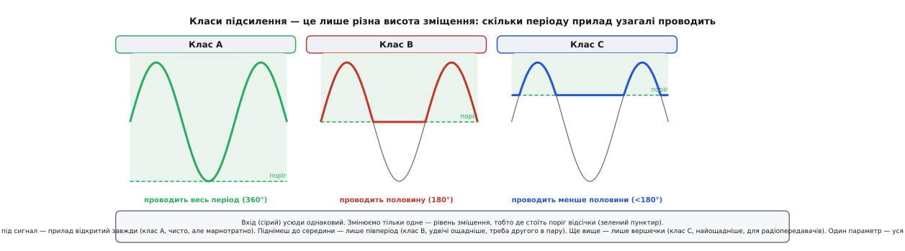

# 📜 Звідки взялося «зміщення»

Слово, яким ми щодня називаємо постійну добавку до сигналу, прийшло в електроніку здалеку й кружним шляхом — і сам цей шлях добре пояснює, чому термін означає саме «сталий зсув убік». А ще за цим словом стоїть ціла лампова епоха, у якій зміщення було не абстракцією з розрахунку, а окремою батареєю на полиці приймача; і навіть звичний поділ підсилювачів на класи A, B, C — це, якщо придивитися, лише питання про те, **де поставлене зміщення**. Розплутаймо все по черзі.

## Спочатку був косий крій

Англійське *bias* з'явилося в мові ще в 1520-х роках і спершу не мало жодного стосунку ні до струму, ні навіть до техніки. Воно прийшло з французького *biais* — «скіс, навскіс, навкоси» — і означало **косу, діагональну лінію**. Глибше, за реконструкцією етимологів, корінь тягнеться, ймовірно, через народну латину й старопровансальську (можливо, до вульгарнолатинського *biaxius* — «двовісний»); доказовість на цьому давньому кінці — правдоподібна, але не цілком певна, тоді як ближній французький відрізок усталений.

Кравці кроїли тканину «по косій» (*on the bias*), щоб вона тягнулася й лягала по фігурі. А найвиразніший образ дала англійська гра в кулі (*bowls*): куля там навмисне несиметрична — з одного боку важча або сплюснута, — і тому, котячись, **постійно завертає** в один бік. Цей сталий, вбудований у саму кулю ухил і звався *bias*. Уже в XVI столітті від такого буквального «косого ухилу» виросло переносне значення, яким ми користуємося й поза технікою: **стала схильність, упередження** — те, що завжди тягне в один бік. Звідси й сучасне «упередженість».

Спільне в усіх цих значеннях — одне: **сталий, незмінний зсув в один бік**. Не випадкове відхилення туди-сюди, а постійна добавка, вбудована в річ, що зрушує все ціле. Саме цю серцевину змісту електроніка згодом і запозичила, коли їй знадобилося слово для сталого струму чи напруги, що зрушують прилад у робочу зону. Коса куля з англійського газону й постійна напруга на базі транзистора — це, як не дивно, одне й те саме поняття, розтягнуте на чотири століття.

## Прилад, який треба було зрушувати

Шлях у схемотехніку відкрився, коли з'явився перший прилад, який конче треба було **зрушувати в робочу зону**, щоб він працював чисто. Таким приладом стала **вакуумна лампа з керувальною сіткою** — тріод.

Тут історію часто спрощують до «Лі де Форест винайшов підсилювальну лампу», і варто відразу бути точним, бо насправді це вузол із кількох окремих внесків. У 1906 році американський винахідник Лі де Форест (Lee de Forest) додав до вакуумної лампи третій електрод — **сітку** (*grid*; назву він, за поширеною розповіддю, узяв за схожість на ґратчасту розмітку американського футбольного поля, *gridiron*). Дводіодну версію свого «Audion» він запатентував ще того-таки 1906-го (патент США 841 387, виданий у січні 1907-го), а триелектродну — **тріод** — подав на патент у січні 1907-го й дістав його 18 лютого 1908 року (патент США 879 532, під назвою «Space Telegraphy»). Маленька напруга на сітці керувала великим струмом від розжареної нитки до пластини.

Але сам де Форест на той час **не розумів, чому** його прилад працює: він гадав, що для дії потрібен залишковий газ у балоні, і навіть остерігався надто глибокого вакууму. Його «Audion» був радше примхливим детектором, ніж чесним підсилювачем. Справжню фізику прояснили інші — і окремо від винаходу самого приладу. У 1912–1913 роках **Гаролд Арнольд** (Harold D. Arnold) з компанії AT&T збагнув, що блакитне світіння в лампі — це іонізований газ, і зробив **високовакуумну** лампу, що працювала чисто на високій напрузі без жодного газу. Незалежно **Ірвінг Ленгмюр** (Irving Langmuir) у General Electric першим **пояснив теорію** приладу через термоелектронну емісію у вакуумі й теж збудував високовакуумну лампу.

Не забуваймо й про паралельний винахід по той бік океану. Австрійський фізик **Роберт фон Лібен** (Robert von Lieben) ще в березні 1906-го запатентував свою триелектродну лампу — газонаповнену, з керувальним електродом, — і задумав її саме як **підсилювач слабких телефонних сигналів**, а не як детектор. Тобто ідея «третій електрод керує струмом лампи заради підсилення» дозріла на двох континентах майже одночасно й незалежно.

Для нашої теми з усього цього важливий не пріоритет на слово «підсилювач», а простий підсумок: з'явилася **сітка** — електрод, стан якого треба було якось **виставити на сталий рівень**, щоб лампа підсилювала чисто, а не спотворювала. І ось тут знадобилося старе слово про косий ухил.

## Чому сітці конче потрібен від'ємний зсув

Щоб зрозуміти, звідки взялося зміщення саме як **прийом**, згадаймо, як працює тріод. Розжарена нитка (катод) кидає хмару електронів; пластина (анод) під високою додатною напругою їх притягує — тече анодний струм. Сітка стоїть між ними, і її потенціал вирішує, скільки електронів пролетить крізь неї до пластини. Що від'ємніша сітка, то дужче вона відштовхує електрони назад до катода, і то менший струм; досить від'ємна сітка **замикає** лампу зовсім.

Тепер уявімо, що ми подали на сітку тільки змінний сигнал, який гойдається навколо нуля. Поки сигнал у мінусі — усе гаразд, лампа прикрита. Та щойно сигнал заходить у **плюс**, сітка стає додатною відносно катода й починає **сама притягувати електрони** — крізь неї тече сітковий струм. А сітка тоненька, вона на такий струм не розрахована; до того ж вона тепер вантажить джерело сигналу й спотворює його. Верхівки сигналу калічаться, робота йде брудно.

Ліки — рівно ті самі, що ми застосовуємо в транзисторному каскаді: **зрушити всю робочу зону**. На сітку подають невеликий сталий **від'ємний** рівень — так, щоб навіть на піках сигналу вона лишалася від'ємною відносно катода й ніколи не бралася проводити струм. Сигнал тепер гойдається навколо цього від'ємного рівня, лампа весь час у чистій керованій зоні, спотворень нема. Цей сталий від'ємний рівень на сітці й назвали — за давнім значенням «постійний ухил убік» — **grid bias**, зміщення сітки.

> 🔧 **Навіщо це.** Механіка старша за транзистор на покоління, але думка буквально та сама, що в основному кроці: прилад «оживає» не там, де крутиться сирий сигнал, тож ми сталою добавкою переносимо робочу зону туди, де сигналу зручно. У лампі добавка від'ємна (бо сітку треба тримати нижче катода), у біполярного транзистора — додатна (бо базу треба тримати вище порога 0.6 В). Знак протилежний, ідея тотожна: спершу постав прилад зміщенням, потім говори про сигнал.

## Батарея на ім'я «C»

Найвиразніший слід ця історія лишила в назвах батарей лампових приймачів 1920-х — коли радіо живилося не від розетки (її в більшості домівок ще просто не було), а від набору окремих батарей. Їх позначали літерами **за порядком електронного потоку** в лампі — так, як електрони її проходять:

- **A-батарея** гріла нитку (*filament*) — низька напруга, великий струм; часто звичайний свинцевий акумулятор на 2 чи 6 В. Сідала швидко, бо нитка живиться сталим чималим струмом.
- **B-батарея** живила пластину (*plate*) — висока напруга, десятки-сотні вольтів (типово 45, 67.5 чи 90 В, а в яскравіших ламп і до 120–135 В). Розряджалася поволі: анодний струм малий.
- **C-батарея** задавала **зміщення сітки** (*grid*) — той самий сталий від'ємний рівень.

Літеру «C» сітка дістала просто тому, що A і B уже були зайняті ниткою й пластиною: коли до діода додали керувальну сітку й вийшов тріод, наступному електроду логічно припала наступна буква. У Британії та подекуди її так і звали навпростець — **GB-батарея**, від *grid bias*, «сіткове зміщення».

І ось деталь, що прямо випливає з природи зміщення. C-батарея майже **не віддавала струму** — сітка в правильно зміщеній лампі струму не бере (ми ж для того її й тримаємо від'ємною). Вона лише **задавала рівень**, а не живила навантаження. Тому C-батарея не мала від чого сідати: її «строком служби» була не ємність, а власний саморозряд на полиці. Це дослівна, залізна ілюстрація того, що зміщення — це **постановка робочої точки, а не джерело потужності**. Воно ставить рівень, з якого гойдається сигнал, і саме по собі енергії в сигнал не вкладає; енергію підсилення дає B-батарея (в транзисторі — живлення Vcc через колекторний резистор), а зміщення лише каже приладу, звідки починати.

## Класи A, B, C — це просто три висоти зміщення

Тепер — місток до чогось, що зазвичай подають окремо й таємничо: поділ підсилювачів на **класи A, B, C**. Ці літери теж народилися в лампову епоху, і за ними ховається на диво проста думка. Клас підсилення — це **не окрема схема й не окремий прилад**. Це відповідь на одне-єдине питання: **наскільки глибоко зміщено прилад**, тобто яку частку періоду сигналу він узагалі проводить струм.

*Вхідний сигнал (сірий) в усіх трьох випадках однаковий. Змінюємо тільки висоту зміщення — де стоїть поріг відсічки. Опустиш поріг під сигнал (клас A) — прилад відкритий увесь період; поставиш на середину (клас B) — проводить рівно половину; піднімеш вище (клас C) — лише короткі вершечки. Клас — це параметр зміщення, а не окрема схема.*

Пройдімо по фігурі уважно, бо в ній уся суть.

**Клас A.** Зміщення поставлено глибоко — робоча точка сидить посеред діапазону, а поріг відсічки лежить **нижче** за найнижчу точку сигналу. Прилад провідний **увесь період, усі 360°**: і на піку сигналу, і в западині крізь нього тече струм. Саме цим ми й займалися в основному кроці — центрована робоча точка, симетричний запас, найчистіше підсилення. Плата — марнотратність: прилад весь час «горить» на повний струм спокою, навіть коли сигналу нема й підсилювати нічого. Тому клас A розкішний за якістю, але ненажерливий; звідси його улюблена царина — тихі малопотужні каскади, де якість важливіша за струм.

**Клас B.** Зміщення підняли рівно до **порога** — прилад у спокої ледь замкнений. Тепер він проводить лише **половину періоду**: пропускає ту півхвилю, що штовхає його у провідність, і мовчить на протилежній. Струм спокою майже нульовий, тож коли сигналу нема — прилад майже нічого не споживає. Це набагато ощадніше. Але одна лампа сама по собі віддала б лише пів-сигналу; тому клас B майже завжди роблять **у пару** — два прилади, кожен веде свою половину, а разом складають повну хвилю. Цей прийом — **двотактний** (*push-pull*, «штовхай-тягни») — і народився в лампову добу телефонних підсилювачів, де ощадність живлення була критична. Плата за перемикання між двома половинами — **спотворення переходу** (*crossover distortion*) на самому стику півхвиль, де жоден прилад ще як слід не відкрився.

**Клас C.** Зміщення заганяють ще **глибше за поріг** — так, що прилад «оживає» лише на **коротких вершечках** найдужчих піків, набагато менше за пів-періоду. Як підсилювач звуку це нікуди не годиться: від сигналу лишаються самі уламки верхівок. Але для **радіопередавача** це геніально. Прилад тут не мусить чесно копіювати форму — він короткими поштовхами розгойдує коливальний контур, налаштований на потрібну частоту, а контур сам добудовує з поштовхів чистий синус. Через те, що прилад відкритий лише коротку мить, він майже не гріється — **коефіцієнт корисної дії класу C сягає 80–90 %**, куди більше за клас A. Тому вихідні каскади потужних радіопередавачів традиційно робили саме в класі C.

Отже вся «таблиця класів» — це насправді **одна вісь**, уздовж якої повзе зміщення: від глибокого (клас A, повний період, чисто, марнотратно) через пороговий (клас B, півперіод, ощадно, у пару) до захопорогового (клас C, вершечки, найощадніше, для радіо). Пізніше додали проміжний **клас AB** — зміщення трохи вище за суто-B, щоб прилади трохи перекривалися й прибрати спотворення переходу, лишившись майже таким самим ощадним; так роблять більшість звукових підсилювачів потужності досі. А ще пізніші «цифрові» класи (D і далі) — вже інша філософія, ключування, — але й вони живуть на тій-таки думці про робочу точку.

Ці позначення A/B/C усталилися в інженерній практиці й літературі до початку 1930-х: наприклад, теорію роботи лампи саме в режимах B і C докладно розібрали в статті Bell System Technical Journal 1932 року — тобто на той час класи вже були спільною мовою, яку не треба було пояснювати з нуля.

> 🔧 **Навіщо це.** Коли в довіднику на транзистор чи в описі підсилювача зустрінеш «Class A», «Class AB», «Class C» — не читай це як назву загадкової схеми. Читай як **вказівку, де стоїть зміщення** й скільки періоду прилад проводить: A — увесь (чисто, гаряче, для якості), B/AB — коло половини у двотактній парі (ощадно, для потужного звуку), C — вершечки (для радіочастоти з коливальним контуром). Один погляд на клас відразу каже і про якість, і про ККД, і про те, чи чекати на виході чесну копію, чи лише поживу для резонансного контуру.

## Як зміщення навчилося робити себе саме

Повернімося до постійного рівня й простежмо ще один прийом, що теж переїхав із ламп у транзистори без єдиної зміни. Окрема C-батарея мала прихований сенс саме тому, що сітка струму майже не бере: батареї не було від чого розряджатися. Але щойно приймачі почали живити **від мережі**, окрема батарея стала незручною. Зробити ще одне — від'ємне — джерело від мережі означало додати випрямляч, фільтр, а то й окрему обмотку трансформатора. Заради кволого зміщення, що й струму не споживає, це було марнотратно.

Інженери знайшли елегантніший хід — **самозміщення** (англ. *self-bias*, *cathode bias*, «катодне» чи «автоматичне зміщення»). Замість окремого джерела поставили **резистор у ніжку катода**. Робочий струм лампи тече з катода крізь цей резистор і піднімає катод на невелику **додатну** напругу. А сітку лишають на нулі — притягнутою до землі через високоомний резистор. Тоді сітка виявляється **від'ємною відносно катода** рівно на падіння на резисторі — а саме це й є потрібне зміщення. Жодного окремого джерела: прилад **сам собі** ставить робочу точку власним струмом.

Краса прийому — у самовирівнюванні. Спробує струм підрости — більшає падіння на катодному резисторі — катод підіймається — сітка стає ще від'ємнішою відносно катода — лампа причиняється, і струм вертається назад. Робоча точка тримається сама, без ручного підбору, попри розкид ламп і дрейф напруг.

Хто пройшов основну частину цього кроку, уже впізнав знайоме. **Це той самий резистор в емітері**, яким ми стабілізуємо робочу точку транзисторного каскаду, і той самий механізм самовирівнювання, слово в слово. Поміняйте «катод» на «емітер», «сітку» на «базу» — і опис збігається повністю. Прийом старший за транзистор на покоління, але фізична ідея — поставити робочу точку падінням на власному резисторі — переїхала з ламп у напівпровідники без жодної переробки. І плата за зручність теж лишилася та сама: цей резистор з'їдає частину підсилення сигналу, тож для змінної складової його **шунтують конденсатором** — у лампах робили буквально те саме, що ми робимо в транзисторному каскаді.

## Те саме слово — той самий зміст

Лампи відійшли, прийшли транзистори, потім інтегральні мікросхеми — а слово лишилося, бо лишилася сама річ. Транзистор винайшли 1947-го в Bell Labs (Джон Бардін, Волтер Браттейн, Вільям Шоклі — John Bardeen, Walter Brattain, William Shockley), і разом зі всім лампового спадку в нього перекочувало й зміщення: у біполярного транзистора ми так само мусимо подати сталий струм у базу, щоб поставити робочу точку; у польового — сталу напругу на затвор (і навіть знову з'являється самозміщення резистором у витоку — прямий нащадок катодного); у схемі на операційному підсилювачі — сталий рівень, навколо якого гойдається вихід. Усе це — **bias**, зміщення: постійний зсув убік, що зрушує прилад у робочу зону, рівно в тому ж сенсі, у якому коса куля завжди завертала вбік чотири століття тому.

Тож коли наступного разу виставлятимете напругу на дільнику бази чи «віртуальну землю» Vcc/2, варто пам'ятати: ви робите буквально те саме, що інженер 1925 року, який підбирав C-батарею до сітки своєї лампи, — ставите сталий ухил, з якого житиме сигнал. Змінилися прилади, назви виводів і знак напруги; незмінною лишилася думка, вбудована в слово ще на англійському газоні: спершу дай речі сталий ухил у потрібний бік — і лише потім чекай від неї чесної роботи.
