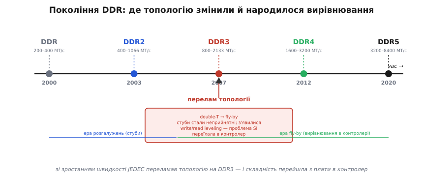
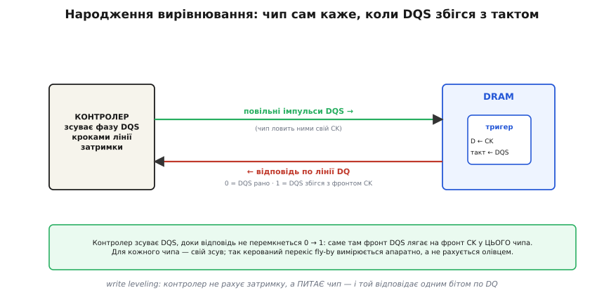

# 📜 Від подвійного Т до fly-by: як народилося вирівнювання

У головній темі ми вже бачили розв'язок: командно-адресну жилу DDR3 ведуть **повз** усі чипи в ряд (fly-by), а перекіс прибуття, що з цього виник, контролер прибирає **вирівнюванням**. Це готова відповідь. Але відповідь стає по-справжньому зрозумілою лише тоді, коли бачиш питання, на яке вона відповідала — і ціну, яку за неї заплатили. Бо fly-by не з'явилося з міркувань елегантності. Його **витиснула** з інженерів проста, вперта фізика: швидкість росла рік за роком, доки стара топологія просто не перестала давати читабельний сигнал. А коли її змінили, проблема не зникла — вона **перетворилася** з однієї біди на іншу й **переїхала** з плати в кремній контролера. Ось ця історія перетворення й переїзду — найцінніше, що тут можна винести: вона показує, як насправді розвивається залізо.

## Покоління, що штовхали швидкість угору

Щоб зрозуміти злам, треба відчути темп. JEDEC (*Joint Electron Device Engineering Council* — галузевий комітет, що пише стандарти на пам'ять) випускав покоління DDR одне за одним, і кожне приблизно подвоювало швидкість шини.

```
DDR    (JESD79,   червень 2000)   ≈ 200…400  МТ/с
DDR2   (JESD79-2, вересень 2003)  ≈ 400…1066 МТ/с
DDR3   (JESD79-3, червень 2007)   ≈ 800…2133 МТ/с
DDR4   (JESD79-4, вересень 2012)  ≈ 1600…3200 МТ/с
DDR5   (JESD79-5, липень 2020)    ≈ 3200…8400 МТ/с
```

(Дати й стандарти — за публікаціями JEDEC; статус: усталено. МТ/с — *мегатрансфери за секунду*, тобто скільки передач даних на секунду; у DDR їх дві на період такту, бо дані йдуть на обох фронтах.)

Цифри ростуть рівно, але за ними ховається нерівний злам. Перехід від DDR до DDR2 — це здебільшого **те саме, тільки швидше**: ті самі ідеї розгону, припасовані до вищої частоти. А от перехід від DDR2 до DDR3 — це **зміна самого способу** з'єднати контролер із чипами. Чому саме на цьому кроці довелося ламати топологію, а не просто знову піддати газу?


*Кожне покоління приблизно подвоює швидкість шини. Та зростання плавне лише на вигляд: на DDR3 (2007) JEDEC переламав топологію командно-адресної шини з розгалуженого подвійного Т на послідовний fly-by й увів write/read leveling. До цього зламу боролися зі стубами на платі; після нього перекіс прибирає контролер. Проблема цілісності сигналу не зникла — вона стала проблемою таймінгу й переїхала в кремній.*

Відповідь — у тому, що деякі біди ростуть **разом** зі швидкістю, а деякі **раптом** перестають бути терпимими, коли фронт переходить певний поріг. Стуби — саме з других.

## Чому стуб, який раніше прощали, раптом перестав прощати

Згадаймо з головної теми, що таке стуб. У DDR2 командно-адресну доріжку розгалужували деревом — топологією **подвійного Т** (*double-T*, за формою двох послідовних Т-розгалужень): головна жила ділиться надвоє, кожна половина ще надвоє, і на кінчику кожної гілочки сидить чип. Кожне таке відгалуження — коротка тупикова доріжка, **стуб** (*stub* — короткий тупиковий відросток). Фронт добігає до місця розгалуження, частина енергії звертає у стуб, відбивається від його кінця (входу чипа) і повертається назад на головну жилу.

Тут ключове питання: **чому** на DDR2 це терпіли, а на DDR3 — ні? Адже стуб нікуди не подівся, фізика відбиття та сама. Уся справа в тому, **наскільки довгим** виглядає стуб для конкретного фронту.

Доріжка поводиться як лінія передачі — тобто **відбиває** — тоді, коли її довжина стає помітною часткою довжини фронту. А довжина фронту — це його час наростання, помножений на швидкість сигналу в доріжці. Скоротився час наростання вдвічі — і та сама фізична доріжка раптом «подовшала» вдвічі в одиницях фронту. Стуб, що на повільному фронті DDR2 був короткою, майже невидимою цяткою, на крутому фронті DDR3 стає повноцінним відбивачем.

**Прикинемо на пальцях, як стуб «росте» зі швидкістю.** Візьмемо стуб фізичною довжиною 5 мм; сигнал у доріжці йде приблизно 6 пс на міліметр, тож хвиля туди-назад по стубу обертається за:

```
затримка стуба в один бік = 5 мм · 6 пс/мм   = 30 пс
обертання туди-назад       = 2 · 30 пс         = 60 пс
```

Тепер порівняймо це обертання з часом наростання фронту. Груба межа: поки обертання набагато коротше за фронт, стуб майже не шкодить; коли воно стає з фронтом одного порядку — стуб дзвенить на повну.

```
DDR2, фронт наростання ≈ 600 пс:  60 пс — лише ~1/10 фронту → стуб ще терпимий
DDR3, фронт наростання ≈ 200 пс:  60 пс — вже ~1/3 фронту   → стуб явно відбиває
```

Той самий стуб, та сама плата — але вдвічі-втричі крутіший фронт перевів його з «дрібниці» в «руйнівника ока». А тепер пригадаймо, що стубів у подвійному Т **багато** — по одному на кожен чип, та ще й різної довжини, бо гілки дерева не однакові. Їхні відбиття приходять у різні моменти, накладаються одне на одне й на корисний фронт — і око сигналу зачиняється не від однієї великої завади, а від хору дрібних. На швидкостях, що їх JEDEC націлював на DDR3, цей хор переходив межу читабельності. Не «погіршувався» — **переставав працювати**.

> 🔧 **Навіщо це.** Звідси практичне чуття, корисне далеко за межами DDR: коли розганяєте будь-яку шину, першими «прокидаються» не довгі лінії, а **короткі тупикові відростки** — недотерміновані гілочки, довгі перехідні отвори, навіть нога тестової точки. На повільному фронті їх не видно; піднімете швидкість — і вони перші почнуть дзвонити. Стуб небезпечний не абсолютною довжиною, а довжиною **відносно фронту**.

## Радикальний хід JEDEC: випрямити дерево в ряд

Коли стало ясно, що розгалуження більше не тримає сигнал, у JEDEC зробили крок, який лише на перший погляд простий, а насправді міняє філософію: **прибрати розгалуження взагалі**. Замість дерева — один ряд. Командно-адресна жила в DDR3 проходить **повз** усі чипи по черзі (звідси й назва, англ. fly-by — «пролітаючи повз»), від кожного відходить лише дуже коротка кукса, а в самому кінці лінії стоїть термінатор. Це **топологія-ланцюжок** (*daisy-chain* — послідовне нанизування): сигнал нанизує чипи один за одним, як намистини на нитку.

Виграш прямий і вимірний. Стуби стали короткими — отже майже не відбивають (повернімося до нашого прикидання: скоротіть стуб удесятеро, і його обертання впаде до одиниць пікосекунд, далеко нижче за будь-який поріг). Кінцева термінація поглинає хвилю, не пускаючи її назад. Око розплющується. Та сама плата, та сама швидкість — але сигнал знову читабельний.

Здавалося б, чиста перемога. Але придивімося, що ми зробили геометрично. Дерево роздавало сигнал усім гілкам **порівну** — від точки розгалуження до кожного чипа був приблизно однаковий шлях, тож фронт приходив до всіх чипів **майже одночасно**. А ланцюжок веде жилу повз чипи **послідовно**: до ближнього фронт долітає раніше, до дальнього — пізніше. Ми виміняли симетрію дерева на короткі стуби ряду. І за цю виміну заплатили **часом**.

## Перекіс: як проблема сигналу стала проблемою часу

Ось де відбувається найцікавіше в усій історії — і саме це варто винести як головну думку. Ми не **прибрали** складність. Ми **перетворили** її на складність іншого роду.

Простежмо ланцюжок причин уважно. Розгалуження давало відбиття — це проблема **цілісності сигналу**: форма хвилі псувалася, око зачинялося, природа біди — аналогова, у площині напруги. Випрямивши дерево в ряд, ми відбиття прибрали — і ту, аналогову, біду зняли. Але навзамін отримали детермінований **перекіс** прибуття: ближній чип чує команду раніше за дальній на цілком конкретну, передбачувану величину. А це вже проблема не форми сигналу, а **часу** — у якому з'являється і свій бік, бо дані кожного чипа летять назад до контролера зі своєю затримкою, тож і строби DQS від різних байтових смуг повертаються неодночасно.

> 🔧 **Навіщо це.** Це той випадок, коли варто зупинитися й роздивитися механізм перетворення, бо він повторюється всюди в інженерії. Складну задачу рідко вдається **знищити** — частіше її вдається **перевести** в таку форму, з якою є чим упоратися. Тут аналогову біду (відбиття, що псують хвилю) перевели в цифрову, числову (відома затримка, яку можна виміряти й відняти). Перша не піддавалася керуванню — з відбиттями на платі борються лише геометрією, наперед і наосліп. Друга піддається: затримку можна **виміряти в роботі** й точно скомпенсувати. У цьому весь сенс розміну.

Чому ж цей розмін вигідний? Бо детермінований перекіс має одну золоту властивість: він **сталий і вимірний**. Відбиття залежать від форми кожного фронту, від нелінійностей, від миттєвого стану шини — їх наперед точно не порахуєш. А перекіс fly-by — це просто різниця довжин шляху до різних чипів; вона не міняється від такту до такту. Раз виміряв — і знаєш. А що знаєш і що стале — те можна **скомпенсувати**. Лишилося питання: хто і як вимірює?

## Народження вирівнювання: чип сам каже, коли збігся

Перша спокуса — порахувати перекіс наперед, олівцем чи симулятором: знаємо довжини доріжок, знаємо швидкість сигналу, додамо затримки й закладемо потрібні зсуви в контролер. Так не вийде, і ось чому. Реальна затримка до кожного чипа складається не лише з довжини доріжки, яку видно на платі: туди входять розкид виробництва самих чипів, дрейф із температурою й напругою, неоднаковість корпусів. Порахувати це наперед з точністю до десятків пікосекунд — а саме така точність потрібна — неможливо. Розрахунок дасть приблизне число, а DDR не прощає приблизного.

Тому JEDEC заклав у DDR3 принципово інший підхід — **вирівнювання** (*leveling*; ширше — *training*, тренування): не рахувати, а **виміряти на живому залізі**. І найгарніша частина — як саме контролер це вимірює для запису (**write leveling**). Він не має лінійки, якою дотягнувся б до кожного чипа. Тож він робить дотепніше — він **питає сам чип**, а чип **відповідає**.

Механізм гідний того, щоб розібрати по кроках, бо в ньому — уся винахідливість рішення. У режимі write leveling чип пам'яті тимчасово перемикає свою вхідну схему так: бере **свій такт CK** (*clock* — тактовий сигнал, що приходить тією самою fly-by жилою) як дані на вхід внутрішнього тригера, а **строб DQS від контролера** — як тактовий фронт цього тригера. Інакше кажучи, фронтом DQS чип «фотографує» миттєвий рівень свого CK. Результат цієї фотографії — один біт — чип віддає назад контролеру **по звичайній лінії даних DQ**.

Тепер уся хитрість стає видимою. Контролер шле повільні, широко рознесені імпульси DQS і дивиться на відповідь:

```
DQS приходить РАНО (до фронту CK):   чип фотографує CK ще в нулі → відповідь 0
DQS приходить ПІЗНО (після фронту):  чип фотографує CK вже в одиниці → відповідь 1
```

Контролер починає з явно раннього DQS (відповідь — нуль) і **зсуває його малими кроками** своєю вбудованою лінією затримки, щораз перепитуючи. Доти, доки відповідь не перемкнеться **0 → 1**. Той крок, на якому стався перехід, — це момент, коли фронт DQS точно ліг на фронт CK **у цього конкретного чипа**. Не порахований — намацаний на живому. І так для кожного чипа окремо: у кожного свій зсув, бо до кожного своя затримка. Керований перекіс fly-by виміряний апаратно, до десятків пікосекунд, без жодного олівця.


*Серце write leveling — діалог, а не розрахунок. Контролер шле повільні імпульси DQS. Чип усередині бере свій такт CK як D-вхід тригера, а DQS — як його тактовий фронт, і Q віддає назад по лінії даних DQ: нуль, поки DQS приходить раніше за фронт CK, одиниця — щойно збігся. Контролер зсуває DQS кроками, доки відповідь не перемкнеться 0→1, — і це точка збігу для цього чипа. Перекіс вимірюється на живому залізі, для кожного чипа свій.*

Читання вирівнюють дзеркально (**read leveling**): тепер дані й строб ідуть від чипів до контролера, кожен зі своєю затримкою, і контролер так само експериментально центрує **свій** приймальний строб на дані кожної смуги, зсуваючи фазу й шукаючи край вікна. Запис вирівнює DQS під такт на боці чипа; читання центрує строб на боці контролера. Дві половини одного принципу — намацати найкращий момент пробами, а не вірити розрахунку.

Наскільки великий той перекіс, який усе це прибирає? На реальному модулі різниця затримки від найближчого чипа до найдальшого може сягати приблизно **1.6 нс** — а це **більше за цілий період такту** на швидкому DDR3 (де період — близько 1 нс). Без вирівнювання дальні чипи контролер писав би повз їхній такт зовсім — промах не на частку вікна, а на ціле вікно й більше. Тому write leveling — не тонке доведення, а умова, без якої fly-by-модуль просто не запрацював би. (Величина перекосу — за нотами застосування виробників контролерів; статус: усталено.)

## Чому складність переїхала саме в контролер

Лишилося зрозуміти останнє — і, можливо, найважливіше для інженера. Уся ця машинерія вирівнювання живе **в контролері пам'яті**, а не на платі й не в чипі DRAM. Чому JEDEC скинув тягар саме туди?

Бо це єдине місце, де його **дешево нести багато разів**. Плата — застигла: що розвів, те й маєш, підправити геометрію після виготовлення не можна. Чип пам'яті хочуть тримати простим і дешевим — його роблять мільярдними тиражами, і кожен зайвий транзистор у ньому коштує дорого помножено на тираж. А контролер — складна цифрова схема, яку й так проєктують один раз, а потім ставлять у кожен виріб; додати в нього лінії затримки й скінченний автомат тренування — це **разовий** коштовний крок, що далі повторюється задарма в кожному пристрої. Тому й вийшло так, що чип DRAM у схемі write leveling робить дрібницю (один тригер, один біт відповіді), а весь розум — пошук, зсуви, рішення — лежить на контролері.

І ось вона, наскрізна нитка цієї історії, видима цілком. Складність ішла шляхом найменшого опору, але не **зникала** на жодному кроці:

- спершу вона сиділа на **платі** — як відбиття від стубів, з якими боролися геометрією розведення;
- зростання швидкості зробило цей спосіб безсилим, і JEDEC fly-by **прибрав відбиття** — але тим самим **створив перекіс**;
- перекіс — це вже не аналогова біда сигналу, а **числова біда часу**, і її, на відміну від відбиттів, **можна виміряти й відняти**;
- вимірювання й віднімання звалили на **контролер** — бо там його дешево повторювати в кожному виробі.

Складність не випарувалася — вона **перетекла** з мідної геометрії плати в цифрову логіку контролера, дорогою щоразу змінюючи форму на зручнішу для керування. Це і є суть інженерної еволюції DDR, і саме тому варто було розповісти не лише **що** зробили, а **як одне виросло з іншого**.

Для практика звідси є цілком земний наслідок, що змикається з головною темою. Коли ви вмикаєте кроки тренування в конфігурації контролера DDR — ви не «налаштовуєте дрібну опцію». Ви запускаєте той самий діалог-намацування, який JEDEC винайшов на заміну неможливому розрахунку: контролер питає кожен чип, де лягає його строб, і сам ставить його в потрібну точку. Розумієте цей діалог — розумієте, **чому** DDR-код оживає на одній платі й мовчить на іншій, і **де** шукати, коли мовчить. Бо вся складність, яку колись несла плата, тепер відповідає вам бітами в регістрах контролера — треба лише знати, що вона там і звідки взялася.
