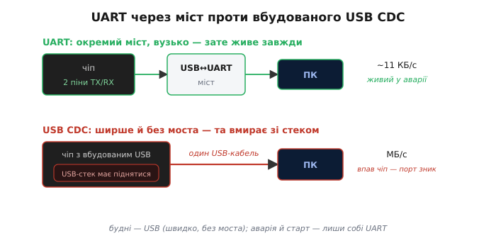
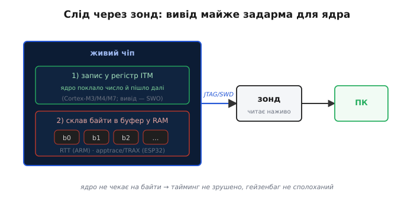

# Порівняння каналів налагоджувального виводу

Коли ми [розкидали по коду `Serial.println`](root:embedded/jtag-swd-tools), мовчки припустили одну річ: що надруковане **доїде** до нас по тому самому дроту, яким ми заливаємо прошивку. Для першого знайомства це чесне спрощення. Та варто пожити з відлагодженням довше — і виявляється, що «надрукувати» і «доставити надруковане на ПК» — це **два різні питання**, і друге має не одну відповідь.

Бо будь-який друк — чи `Serial.println` в Arduino, чи `ESP_LOGI` в ESP-IDF, чи `printf` на STM32 — лише складає рядок і віддає його кудись. А куди саме — у звичайний UART, у USB, в окремий слід через зонд, у мережу — це вже **окреме рішення**, з власною ціною. І ціна ця не дрібниця: один канал майже не чіпає час програми, інший — спотворює його так, що баг тікає; один живий ще до `main()`, інший вмирає разом із чипом у мить аварії. Тож якщо ми колись зловимо баг, до якого «звичайний друк» просто не дотягнеться, — рятунком буде не геніальніший `println`, а **інший канал** під тим самим друком.

Цей крок — про те, **якими шляхами** налагоджувальні байти залишають чіп, і чим ці шляхи різняться. Ми вже знаємо два полюси: легкий Serial і важкий зонд. Тепер заповнимо проміжок між ними й побачимо, що «вивід для відлагодження» — це ціле сімейство каналів, з якого розумний інженер обирає **під випадок**, а не бере перше-ліпше за звичкою.

### Що насправді ми порівнюємо

Перш ніж перелічувати канали, домовмося, **за чим** їх міряти. Інакше порівняння зведеться до «цей кращий» без жодного сенсу. Корисних осей небагато, і кожна з них — це реальне питання, яке колись постане на робочому столі.

- **Як сильно канал краде час програми.** Друк не безкоштовний: поки байти йдуть дротом, ядро або **чекає** на них, або принаймні витрачає такти на віддачу. Що повільніший канал — то довша ця затримка, і то більша загроза, що друк **зрушить тайминг** і сполохає [гейзенбаг](root:embedded/jtag-swd-tools) — баг, що зникає від самого спостереження.
- **Скільки даних канал пропускає за секунду** (його **пропускна спроможність**, англ. *throughput*). Перевірити одну змінну вистачить і найповільнішого; а от вилити безперервний потік із давача, що читається тисячі разів на секунду, здатен лише швидкий.
- **Чи живий канал до `main()` і в мить аварії.** Найцінніші підказки часто потрібні саме там, де звичайний друк ще (або вже) не працює: у перші такти старту, поки периферію не ввімкнено, і в секунду падіння, коли чіп валиться.
- **Чого канал коштує в залізі й пінах.** Один потребує лише однієї вільної ніжки, інший — цілого USB-роз'єму, третій — окремого зонда за гроші. На тісній платі це часом і вирішує.
- **Чи можна каналом не лише слухати чіп, а й слати йому команди** (двобічність). «Вивід» — це пів історії; іноді в розпал відлагодження хочеться на льоту перемкнути режим чи попросити дамп, не перепрошиваючи пристрій.


*П'ять осей, за якими варто міряти будь-який канал виводу. Жоден не виграє за всіма одразу — швидкий просить заліза, дешевий гальмує, найживучіший потребує зонда. Вибір каналу — це вибір, чим саме пожертвувати цього разу.*

Жоден канал не найкращий за всіма осями водночас — інакше й порівнювати не було б чого. Тримаймо ці п'ять питань у голові: пройдемо канали по черзі, і кожен покаже, де він сильний, а де ламається.

> 🔧 **Навіщо це.** Ці осі — не теорія, а готовий чекліст біля реальної загадки. Баг чутливий до часу — дивись на **інтрузивність**. Треба зловити потік даних — на **пропускну спроможність**. Чіп падає до першого друку — на **живучість до `main`**. Замість питати «який канал кращий» питай «що в моєму випадку болить найдужче» — і відповідь випаде сама.

### UART: знайомий базовий рівень

Почнемо з того, що вже в руках. Коли програма відкриває послідовний порт на 115 200 бодів — `Serial.begin(115200)` в Arduino, `uart_param_config()` в ESP-IDF, `HAL_UART_Init()` на STM32, — байти течуть по **UART** (англ. *Universal Asynchronous Receiver/Transmitter*, «універсальний асинхронний приймач-передавач») — найстарішому й найпростішому послідовному каналі. Два дроти (один — від чипа, другий — до нього), узгоджена з обох боків швидкість, і жодного спільного такту: кожен бік сам відлічує час біта за домовленою [швидкістю в бодах](root:embedded/jtag-swd-tools). На платі його зазвичай ловить копійчаний [перетворювач USB↔UART](root:embedded/usb-uart-bridge), що показує себе на ПК звичайним послідовним портом.

Сила UART — у тому ж, у чому й сила Serial узагалі: він є **скрізь і завжди**, працює з перших тактів і не потребує нічого, крім двох ніжок. Саме тому він — базовий рівень, відносно якого ми міритимемо решту.

А тепер — його стеля, через яку й виростають усі інші канали. UART **повільний**: типові 115 200 бодів — це близько 11 кілобайтів за секунду, і кожен такий байт ядро штовхає в лінію власноруч. Поки символи їдуть, або ядро **блокується** на передавачі, або (якщо віддавати через [DMA чи переривання](root:embedded/dma-spi-i2s)) принаймні витрачає такти на обслуговування. Один рядок раз на секунду цього не помітить; а от друк у гарячому циклі легко **з'їдає більше часу, ніж сама корисна робота**, — і тоді канал виводу спотворює саме те, що ми прийшли вимірювати.

**Скільки часу краде один рядок по UART.** Порахуймо чесно, на пальцях. Рядок `"adc=2731\n"` — це 9 символів, тобто 9 байтів:

```
один байт по UART  = 10 бітів (8 даних + старт + стоп)
9 байтів           = 90 бітів
на 115200 бодів    = 90 / 115200 ≈ 0.78 мс
```

Майже **мілісекунда** на один коротенький рядок. Якщо такий друк стоїть у циклі, що крутиться раз на 100 мкс, картина руйнівна: на корисну ітерацію — 100 мкс, а на друк про неї — 780 мкс. Канал виводу став **у вісім разів повільнішим** за саму програму й повністю перекроїв її тайминг. Звідси проста мораль: чим частіша подія, яку хочеться надрукувати, тим дорожчий звичайний UART — і тим бажаніший канал, що віддає байти, не змушуючи ядро на них чекати.

> 🔧 **Навіщо це.** Перш ніж винуватити «глючну периферію», порахуй, скільки забирає сам друк. Незліченні «плаваючі» баги виявляються наслідком того, що друк у швидкому циклі переїв увесь часовий бюджет. Знаєш формулу `біти / швидкість` — заздалегідь бачиш, де UART стане гальмом, і не ставиш його туди.

### USB CDC: той самий друк, але швидше й без моста

Перший очевидний крок угору — зробити канал ширшим, не міняючи звички `println`. Тут на сцену виходить **USB CDC** (англ. *Communications Device Class*, «клас комунікаційних пристроїв» — той розділ стандарту USB, що описує віртуальний послідовний порт). Ідея проста: замість тягнути байти через зовнішній UART-міст, чіп сам прикидається перед ПК послідовним портом — **прямо по USB**.

На боці коду майже нічого не міняється: той самий звичний друк, та сама консоль на ПК. Зате під капотом канал стає **в рази ширшим** за UART: USB повної швидкості — це мегабайти за секунду, а не десяток кілобайтів. Великі дампи, що по UART повзли б секундами, тут вилітають миттю. До того ж зникає окремий міст-мікросхема на платі — економія, що для дрібного пристрою важить і грошима, і місцем.

Сучасні чипи курсу мають це **на борту**. Як ми згадували, [ESP32-S3 і C3 несуть вбудований USB](root:embedded/jtag-swd-tools), і там є особливий блок — **USB Serial/JTAG**: жорстко прошитий апаратний вузол, що одночасно дає і віртуальний послідовний порт (CDC), і канал відлагодження по JTAG — **тим самим USB-кабелем**, яким чіп і так під'єднано, без жодного зовнішнього моста чи зонда. Це підтверджено документацією Espressif: вузол реалізовано повністю в залізі й перепризначити його ні на що інше не можна — він завжди або консоль, або JTAG.

За цю ширину доводиться платити трьома речами, і всі три — про **залежність від живого USB-стеку**.

По-перше, USB складніший за UART: щоб порт з'явився, у чипі має піднятися ціла USB-машинерія. Доти, поки вона не готова (а це вже **після** старту), канал мовчить — на відміну від UART, що цвірінькає з перших тактів.

По-друге, і це найболючіше для відлагодження: коли чіп **падає чи зависає**, USB-стек умирає разом із ним — і віртуальний порт **відвалюється** від ПК. Останні, найцінніші слова перед аварією тонуть разом зі стеком, що їх віз. UART у цю саму мить часто ще встигає виштовхнути символ-два просто з апаратного передавача, бо йому не потрібен живий програмний стек.

По-третє, є тонка, але злюча пастка саме вбудованого USB Serial/JTAG: за документацією Espressif, він **блокується**, якщо хост не вичитує байти. Звичайний UART-міст у цьому разі просто кинув би символи в порожнечу й поїхав далі; а вбудований вузол **зупинить вашу програму** на спробі друку, доки відкриють монітор. Підключив пристрій, забув відкрити термінал — і він мертво стоїть на першому ж `println`, наче завис, хоча насправді лише чемно чекає читача. До того ж цей вузол **не працює уві сні**: тактів USB у сплячці нема, і для ПК пристрій просто зникає.


*Угорі — звичний UART: окремий міст, вузенький канал, зате живий з перших тактів і навіть у мить аварії. Унизу — вбудований USB CDC: ширше в рази й без моста, але порт з'являється лише по старті USB-стеку й відвалюється разом із ним, коли чіп падає.*

**Той самий друк двома каналами.** Покажемо, що для коду різниця — буквально в одному виклику, а наслідки геть різні:

:::tabs
```arduino
// Звичайний UART через зовнішній міст: живий з перших тактів, але ~11 КБ/с
Serial.begin(115200);
Serial.println("link up");          // повзе дротом ~0.6 мс на рядок

// Вбудований USB CDC (ESP32-S3/C3): мегабайти/с, без моста на платі…
USBSerial.begin();
USBSerial.println("link up");       // летить миттю — ПОКИ тримається USB-стек
// …але впаде чіп — порт відвалиться; а без відкритого монітора друк ще й
//   заблокує програму, бо вбудований вузол чекає, доки байти вичитають
```
```esp-idf
#include "driver/uart.h"
#include "driver/usb_serial_jtag.h"

// Звичайний UART через зовнішній міст: живий з перших тактів, але ~11 КБ/с
const uart_config_t ucfg = { .baud_rate = 115200, .data_bits = UART_DATA_8_BITS,
                             .parity = UART_PARITY_DISABLE, .stop_bits = UART_STOP_BITS_1 };
uart_param_config(UART_NUM_0, &ucfg);
uart_write_bytes(UART_NUM_0, "link up\n", 8);   // повзе дротом ~0.7 мс на рядок

// Вбудований USB Serial/JTAG (ESP32-S3/C3): мегабайти/с, без моста на платі…
usb_serial_jtag_driver_config_t jcfg = USB_SERIAL_JTAG_DRIVER_CONFIG_DEFAULT();
usb_serial_jtag_driver_install(&jcfg);
usb_serial_jtag_write_bytes("link up\n", 8, portMAX_DELAY);
// …але впаде чіп — порт відвалиться; а з portMAX_DELAY і без відкритого
//   монітора цей виклик чекатиме, доки байти вичитають
```
```stm32
#include "usbd_cdc_if.h"            // CDC_Transmit_FS — із середника USB Device

extern UART_HandleTypeDef huart2;
static const char msg[] = "link up\n";

// Звичайний UART (у роз'єм ST-LINK VCP): живий з перших тактів, але ~11 КБ/с
HAL_UART_Transmit(&huart2, (uint8_t *)msg, sizeof(msg) - 1, HAL_MAX_DELAY);

// Вбудований USB CDC (F4/L4/H7 з USB-периферією): мегабайти/с, без моста…
CDC_Transmit_FS((uint8_t *)msg, sizeof(msg) - 1);
// …але впаде чіп — порт відвалиться; а поки хост не забрав попередній пакет,
//   виклик поверне USBD_BUSY і рядок просто зникне, якщо не повторити
```
:::

Звідси практичне правило: USB CDC — чудовий **робочий** канал, коли треба багато й швидко, а пристрій під рукою й здоровий. Та покладатися на нього в **аварійному** виводі чи в перші такти старту наївно: саме там, де він найпотрібніший, його несе разом зі стеком, що падає.

> 🔧 **Навіщо це.** На платі з ESP32-S3 спокуса викинути UART-міст і лишити сам USB велика — і часто слушна. Але лиши собі **запасний** UART (бодай на гребінці) для двох випадків, де USB зрадить: ловити паніку, що валить стек, і дивитися старт до того, як USB підніметься. Один канал для буднів, другий — для аварій: дешева страховка, що рятує саме в найгіршу мить.

### Слід через зонд: друк, що майже не коштує ядру

UART і USB мають спільну ваду: байти йдуть **по дроту даних**, і за них так чи так платить ядро. А що, як віддавати їх **не дротом даних зовсім** — а через той самий канал відлагодження, яким зонд і так зазирає в чіп? Тоді друк перестає бути «передаванням» і стає майже задарма. На цій ідеї стоїть ціла родина каналів, і вони — найцінніше, що є для багів, чутливих до часу.

Найпростіший представник у світі ARM — **SWO** (англ. *Serial Wire Output*, «вивід по послідовному дроту»): один-єдиний вивід, яким блок усередині ядра, **ITM** (англ. *Instrumentation Trace Macrocell*, «макроблок слідового інструментування»), виштовхує повідомлення майже без участі процесора. Програма лише кладе число в регістр ITM і йде далі — а сам потік на ПК збирає вже зонд. За документацією ARM, ITM є в ядрах Cortex-M3/M4/M7, але не в найменших M0/M0+; дані з нього їдуть по SWO, який фізично входить до інтерфейсу [SWD](root:embedded/jtag-swd-tools). Ключове: ядро **не чекає**, поки байти підуть, — а отже, тут немає тієї затримки, що сполохує гейзенбаг. Це той самий друк, але **без ціни UART**.

Ще далі йде підхід, де навіть окремий вивід не потрібен. Замість слати байти кудись, чіп просто **складає їх у буфер у власній RAM**, а зонд **вичитує цей буфер прямо з пам'яті** по JTAG/SWD — наживо, не спиняючи ядро. Програмі лишається найдешевше з можливого: записати кілька байтів у масив. У світі ARM найвідоміше втілення цієї ідеї — **RTT** (англ. *Real-Time Transfer*, «передавання в реальному часі») від німецької фірми SEGGER; працює воно так: у пам'яті лежить керівний блок із кільцевими буферами на кожен канал, зонд знаходить його за міткою й читає **фоновим доступом** до пам'яті — тим самим, яким налагоджувач підглядає змінні. Пропускна спроможність — від пів- до двох мегабайтів за секунду залежно від моделі зонда, та ще й **двобічно** (хост може й слати байти чипу), і все це — кількома вільними ніжками зонда, без жодного зайвого дроту на платі.

Чіпи нашого курсу теж уміють цей трюк. У ESP-IDF є **трасування рівня застосунку** (англ. *application-level tracing*, вузол `apptrace`): чіп складає дані в буфер, а OpenOCD по JTAG забирає їх через апаратний слідовий вузол **TRAX**. За документацією Espressif, буфер TRAX — 16 КБ, і саме цим каналом годуються інструменти аналізу поведінки системи на кшталт SystemView. Тобто та сама ідея «склади в пам'ять — зонд вичитає», лише іменами під ESP32.


*Замість гнати байти дротом даних чіп або штовхає їх у регістр ITM (SWO), або просто складає в буфер у власній RAM. Зонд забирає це по тій самій лінії відлагодження, якою й так зазирає в чіп. Ядро майже не платить — тому слід не зрушує тайминг і не лякає гейзенбаг.*

Ціна в цієї родини одна, зате велика: потрібен **зонд** (або вбудований у чіп блок відлагодження). Без апаратури, що читає лінію JTAG/SWD чи буфер у пам'яті, ці канали мертві. Тому вони — не «щоденний» інструмент, а саме та важка артилерія, по яку тягнуться, коли звичайний друк надто змінює час або захлинається в потоці даних.

> 🔧 **Навіщо це.** Ось точна відповідь на гейзенбаг із [кроку про Serial](root:embedded/jtag-swd-tools): коли `println` зрушує тайминг і баг тікає, береш слід — SWO на ARM чи `apptrace` на ESP32 — і дивишся всередину, **майже не зворушивши** поведінки. Ця «прозорість без ціни» — головна причина тримати зонд під рукою навіть тоді, коли спиняти ядро й не збираєшся.

### Семіхостинг: хай друкує сам ПК

Є ще один, зовсім окремий за духом спосіб — і його варто знати бодай щоб **не наступити** на нього з розгону. Зветься він **семіхостинг** (англ. *semihosting*, «напівхостинг» — бо частину роботи чіп перекладає на хост-ПК). Ідея зухвало проста: коли програмі на чипі треба щось надрукувати, вона не шле байти жодним дротом — вона **спиняє сама себе** особливою інструкцією, а підключений на ПК налагоджувач помічає цю зупинку, виконує введення-виведення **на боці ПК** (друкує у своє вікно, читає файл із диска ПК) і відпускає чіп далі.

Механізм, за документацією ARM, ось який: програма виконує інструкцію переривання (`BKPT` на Cortex-M), що працює як [точка зупину](root:embedded/jtag-swd-tools); налагоджувач, упізнавши за номером саме семіхостинговий виклик, робить замовлену операцію на ПК і вертає керування. Принада очевидна: `printf` працює **без жодного рядка коду під нього** на самому чипі — ні UART, ні USB, ні буферів; функції стандартної бібліотеки просто «дотягуються» до диска й консолі ПК.

І тут-таки криється його згуба, через яку для постійного друку семіхостинг майже не беруть. **Кожен** виклик — це повна зупинка ядра, обмін із ПК через канал зонда й повернення. Це **страшенно повільно**: швидкість упирається в смугу JTAG-зв'язку, тож, як прямо застерігає ARM, «на диво чекати не варто». Один `printf` може коштувати тисячі тактів простою. Гірше: якщо програму запустити **без** під'єднаного налагоджувача, та сама інструкція `BKPT` нікому не «відповість» — і чіп **спіткнеться на ній**, бо її нема кому обробити. Тобто прошивка із семіхостингом узагалі **не їздить сама по собі**, без зонда на дроті.

Тому місце семіхостингу вузьке й чесне: коли зонд і так під'єднано, а хочеться найдешевшим зусиллям дати `printf` чи навіть почитати-записати файл на диску ПК прямо з прошивки — наприклад, залити тестові дані чи зняти лог у файл. Для буденного ж виводу він надто повільний і надто прив'язаний до зонда.

> 🔧 **Навіщо це.** Запам'ятай головну пастку: прошивка із семіхостингом **зависає на старті без зонда**, спіткнувшись об першу ж зупинку. Якщо колись пристрій намертво стає, щойно його від'єднали від налагоджувача, — підозрюй забутий семіхостинговий `printf`. А для звичайного логу не став семіхостинг зовсім: він повільніший за все інше в цьому переліку.

### Мережа: коли пристрій уже не на столі

Останній канал з'являється тоді, коли зникає сама передумова всіх попередніх — **дріт до пристрою**. Поки плата на столі, її видно UART-ом чи USB. А коли пристрій працює в полі, на висоті, за кілометр, — лишається віддавати лог **по тому ж каналу зв'язку**, яким він і так спілкується: по Wi-Fi, радіо чи [телеметрії](root:embedded/mavlink-from-ground). Найчастіше це короткі пакети [UDP](topic:communications/tcp-vs-udp) на сервер, що збирає логи з усього парку пристроїв.

Сила тут унікальна й нічим не заміниться: це **єдиний** спосіб бачити, що коїться з пристроєм, до якого фізично не дотягтися. Для рою дронів чи розкиданих по місту давачів іншого вікна в їхнє нутро просто нема.

Зате й вад у цього каналу більше, ніж у всіх попередніх разом. Він **найважчий**: під ним крутиться цілий мережевий стек, що з'їдає і пам'ять, і такти, і живлення. Він **найкрихкіший** для аварій: коли чіп падає, мережа гине так само певно, як USB, — та ще й пакети дорогою губляться, тож «останнє слово» може просто не долетіти. І він **повільно оживає**: доки підніметься з'єднання, найперші — часто найважливіші — рядки старту вже згоріли. Мережевий лог — це не заміна Serial, а **доповнення для зовсім іншого випадку**: коли пристрій недосяжний, і будь-яке вікно в нього краще за повну темряву.

> 🔧 **Навіщо це.** Не сподівайся зловити мережею аварію чи проблему старту — там вона гине першою. Її роль інша: бачити **поведінку** розгорнутого парку — які пристрої живі, що в них коїться, де назріває біда. А критичні «останні слова» однаково мусять лягати ще й [у кільцевий буфер на самому чипі](root:embedded/jtag-swd-tools/proj-logging.md), щоб пережити те, чого мережа не донесе.

### Зведімо все докупи

Тепер видно, що канали — не «гірші» й «кращі», а **різні точки тієї самої п'ятірки осей**, які ми поклали на початку. Кожен на чомусь виграє ціною чогось іншого.

| Канал | Час програми | Швидкість | Живий до `main` / в аварії | Залізо й піни | Двобічний |
|---|---|---|---|---|---|
| **UART** | помітно гальмує | низька (~11 КБ/с) | так / часто так | 2 піни + дешевий міст | так |
| **USB CDC** | мало | висока (МБ/с) | ні / ні | USB (часто вбудований) | так |
| **Слід (SWO/RTT/apptrace)** | майже задарма | висока | так / так | потрібен зонд | RTT — так |
| **Семіхостинг** | дуже гальмує | дуже низька | лише із зондом | потрібен зонд | так |
| **Мережа** | важко | середня | ні / ні | стек + радіо | так |


*Канали від найлегшого до найважчого. UART — завжди напохваті, та вузький і повільний. USB — ширший і без моста, але вмирає зі стеком. Слід через зонд — майже без ціни для ядра, але потребує заліза. Семіхостинг — `printf` задарма, та повільний і без зонда не їде. Мережа — єдине вікно в далекий пристрій, зате найкрихкіше.*

З таблиці сам собою випадає робочий лад вибору — той самий принцип [«простіше за замовчуванням»](root:embedded/baremetal-vs-framework), що вже не раз нас вів:

**UART** лишається першим вибором для буднів — він є завжди й не вимагає нічого. Коли його смуга **захлинається** під потоком даних, але пристрій під рукою, переходь на **USB CDC** (на сучасних чипах — вбудований, ще й без моста). Коли друк **зрушує тайминг** і баг тікає, бери **слід через зонд** — SWO на ARM, `apptrace` на ESP32: він віддає байти, майже не чіпаючи ядро. **Семіхостинг** тримай для рідкісного випадку, коли зонд і так на дроті, а треба дешевий `printf` чи доступ до файлів ПК. А **мережу** додавай лише там, де пристрій фізично недосяжний, — і ніколи не покладай на неї аварійний вивід.

І наскрізна нитка, що римується з усім курсом відлагодження: **збір** рядка завжди тримай окремо від **каналу**, яким той рядок поїде. Тоді перемкнути пристрій з UART на USB чи на слід — це правка в одному місці, а не переписування всього коду; саме так влаштоване [логування як система](root:embedded/jtag-swd-tools/proj-logging.md), де конкретний виклик друку (`Serial.println`, `ESP_LOGI`, `HAL_UART_Transmit`) — лише один зі змінних виходів. Канал — це деталь доставки; цінне ж — що саме ти вирішив надрукувати й навіщо.
