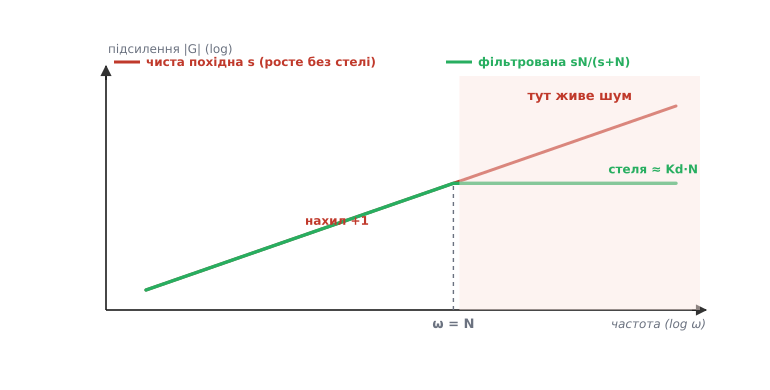
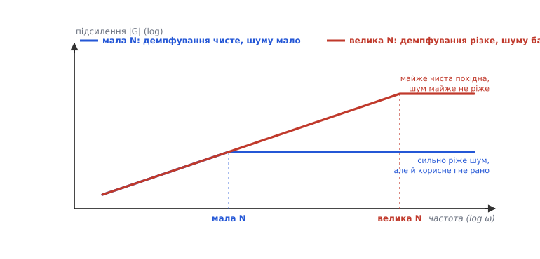
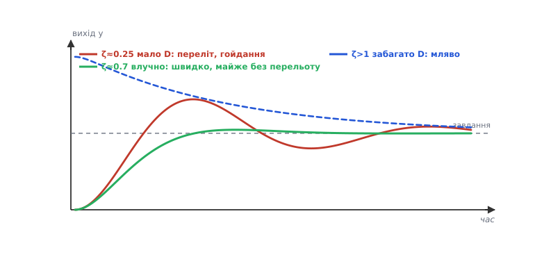
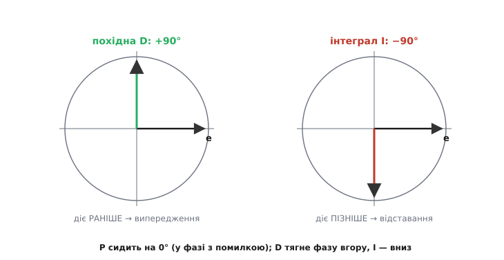

# Диференційна складова (D): механіка передбачення

У [базовому огляді](root:embedded/derivative-control) ми з'ясували головне: диференційна складова дивиться на **швидкість зміни** помилки, діє як гальмо й демпфер, гасить коливання наперед — і платить за це чутливістю до шуму, яку знімають фільтр, «похідна від виміру» та гіроскоп. Цього досить, щоб користуватися D свідомо. Але «діє як демпфер» і «підсилює шум» — це поки що словесні картини. Тут ми **розберемо кожне з цих тверджень до першопричини**: чому саме демпфер (і рівно наскільки), звідки береться шумове підсилення (і чому воно нескінченне для чистої похідної), як фільтр його обмежує (і чим саме платить), як D пересуває полюси системи (і чому це і є «гасіння наперед»), і чому гіроскоп — не просто зручність, а фізично інший, чистий шлях до того самого числа.

Ми будемо спиратися на пройдене без повторів. Похідну de/dt як нахил кривої, гальмівну інтуїцію, похідний поштовх, «D on gyro» — усе це вже засвоєно; тут ми йдемо **під** ці факти, до механіки, що їх породжує. Ниткою слугуватиме одне запитання: **що насправді робить із системою член Kd·de/dt** — не в метафорах, а в русі полюсів, у спектрі підсилення та в рядках коду, що крутяться сто разів на секунду.

### Розмірність Kd: чому це «час випередження»

Почнімо з того, на що рідко зважають, — з **розмірності** коефіцієнта Kd. Вона багато що прояснює. Запишімо повний закон і придивімося до одиниць кожного члена:

```
 u = Kp·e  +  Ki·∫e dt  +  Kd·de/dt

   [e]      — одиниці помилки (напр. градуси °)
   [de/dt]  — одиниці помилки за секунду (°/с)
   [u]      — одиниці впливу (напр. частка тяги, або %)
```

Щоб усі три члени давали **однакові** одиниці впливу [u], коефіцієнти мусять мати такі розмірності:

```
 [Kp] = [u]/[e]                 — вплив на одиницю помилки
 [Ki] = [u]/([e]·с) = [Kp]/с    — вплив на одиницю помилки·секунду
 [Kd] = [u]/([e]/с) = [Kp]·с    — вплив на одиницю (помилка/секунда)
```

Тут ховається глибока думка. Відношення **Kd/Kp має розмірність секунд** — це **час**. Його звуть **сталою часу диференціювання** або, влучніше, **часом випередження** (англійською *derivative time*, Td): Kd = Kp·Td. Що означає цей час фізично? Перепишімо пропорційно-диференційну частину через нього:

```
 Kp·e + Kd·de/dt  =  Kp·(e + Td·de/dt)
```

Вираз у дужках, `e + Td·de/dt`, — це **лінійна екстраполяція помилки на Td секунд уперед**. Адже за означенням похідної, майбутня помилка приблизно дорівнює теперішній плюс нахил, помножений на проміжок: e(t + Td) ≈ e(t) + Td·de/dt. Отже ПД-регулятор — це насправді **пропорційний регулятор, що реагує не на теперішню помилку, а на її прогноз через Td секунд**. Ось звідки та «передбачливість», про яку ми говорили в базовому огляді: вона тут не метафора, а точний зміст формули. Td — це буквально **на скільки секунд наперед дивиться регулятор**.

Ця подвійна оптика — Kd як «вага похідної» і Td як «горизонт передбачення» — надзвичайно корисна на практиці. Коли ви думаєте «наскільки сильно тиснути на швидкість зміни», зручний Kd; коли думаєте «на скільки часу вперед варто дивитися, зважаючи на інерцію апарата», зручний Td. Дрон із його миттєвою динамікою дивиться на десятки мілісекунд уперед (малий Td), важка піч — на десятки секунд (великий Td). І те, і те — той самий член Kd·de/dt, лише побачений з двох боків.

> 🔧 **Навіщо це.** Коли переносите коефіцієнти між двома апаратами різного масштабу, думайте в **Td**, а не в голому Kd. Td прив'язаний до **часових сталих об'єкта** (як швидко він рухається), а не до випадкових одиниць впливу. Регулятор швидкого контуру струму й повільного контуру температури можуть мати Td, що різняться в тисячі разів, — і саме це співвідношення підказує здоровий діапазон, у якому варто шукати.

### Дискретна похідна: чому «різниця / крок» — це лише перше наближення

У коді неперервної похідної немає — мікроконтролер бачить помилку відліками через крок Δt. Базовий огляд і [вставка про дискретний ПІД](book:algorithms/discrete-pid) дають робочу формулу: `de ≈ (e − e_попередній)/Δt`. Тут ми розберемо, **звідки** вона береться, **наскільки** точна й **чому** саме її крихкість перед шумом невіддільна від її користі.

Формула виростає прямо з **ряду Тейлора**. Розкладімо помилку в попередній момент навколо теперішнього:

```
 e(t − Δt) = e(t) − Δt·e'(t) + (Δt²/2)·e''(t) − …
```

Виразимо звідси похідну e'(t):

```
 e'(t) = [e(t) − e(t − Δt)]/Δt  +  (Δt/2)·e''(t) − …
              └─── зворотна різниця ───┘   └─ похибка ─┘
```

Отже проста «різниця назад», поділена на крок, дорівнює справжній похідній **плюс похибка порядку Δt** (пропорційна кроку й другій похідній). Це називають зворотною різницею першого порядку, і саме її беруть у переважній більшості реалізацій ПІД: вона потребує лише **один** попередній відлік і не додає жодної затримки понад природну.

Чому не точніші формули? Бувають — наприклад, центральна різниця `[e(t+Δt) − e(t−Δt)]/(2Δt)` має похибку вже порядку Δt² (удвічі кращу). Але вона вимагає **майбутнього** відліку e(t+Δt), якого регулятор у реальному часі не має; узяти замість нього затриманий відлік означає внести **запізнення на Δt** — а запізнення для регулятора отрута (воно, як ми пам'ятаємо з базового огляду про фазу, штовхає контур до коливань). Тож у керуванні майже завжди лишаються при зворотній різниці: вона причинна (не заглядає в майбутнє) і без затримки. Точність тут програє причинності — і це усвідомлений вибір, не недогляд.

А тепер — ключове спостереження, що пояснює всю подальшу боротьбу з шумом. Погляньмо на знаменник: ми **ділимо на Δt**, а Δt мале (для дрона — мілісекунди чи менше). Ділення на мале число — це **множення на велике**. Якщо у вимірі є похибка δ (шум одного відліку), то в похідну вона входить як δ/Δt:

```
 крок Δt = 0.001 с (1 кГц);  шумовий стрибок виміру δ = 0.05°
 внесок у похідну: δ/Δt = 0.05/0.001 = 50 °/с

 той самий шум за Δt = 0.0001 с (10 кГц):
 δ/Δt = 0.05/0.0001 = 500 °/с  — удесятеро гірше!
```

Ось перший твердий, кількісний висновок: **що частіше ви дискретизуєте, то сильніше сира похідна підсилює шум одного відліку**. Це контрінтуїтивно — зазвичай частіша дискретизація краща. Для P та I вона й справді краща; для сирого D вона **погіршує** шумове підсилення лінійно з частотою. Причина проста: шум сусідніх відліків майже не корельований, тож його стрибок δ від кроку не меншає, а от дільник Δt меншає — і відношення δ/Δt росте. Це не вада конкретної формули, а сама природа диференціювання дискретного сигналу; вона й жене нас до фільтра, до якого ми зараз і перейдемо.

> 🔧 **Навіщо це.** Не піддавайтеся спокусі «підняти частоту D-контуру, щоб було точніше». Для похідної це б'є у зворотний бік: шумове підсилення δ/Δt росте з частотою. Правильний важіль — не частота, а **фільтр** на D-член (нижче) і чистота самого виміру. Якщо мусите тактувати часто (бо цього вимагають P та I), тим паче не лишайте D сирим — на високій частоті він найбрудніший.

### Спектр підсилення: чому чиста похідна — фільтр верхніх частот без стелі

Базовий огляд сказав: «диференціювання — це фільтр верхніх частот, воно підсилює високі частоти». Тепер доведімо це й, головне, побачимо **наскільки** — бо саме безмежність цього підсилення робить сиру похідну непридатною.

Візьмімо чистий синусоїдальний сигнал помилки частоти ω: e(t) = A·sin(ωt). Його похідна — теж синусоїда, але з амплітудою, помноженою на ω:

```
 e(t)      = A·sin(ωt)
 de/dt     = A·ω·cos(ωt)

 амплітуда виходу / амплітуда входу = ω   ← підсилення похідної
```

Ось воно, чорним по білому: **підсилення диференціатора дорівнює частоті ω**. Не залежить від амплітуди — лише від того, **як швидко** сигнал коливається. На низькій частоті (повільна, корисна зміна помилки) підсилення мале; на високій (швидкий шум) — велике; і воно **росте без межі** — чим вища частота, тим більше. Немає такої частоти, вище за яку диференціатор перестав би підкручувати гучність. У мові перетворення Лапласа це записують гранично коротко: передавальна функція ідеального диференціатора — це просто **s**, а її амплітудна характеристика |jω| = ω — та сама пряма, що росте без стелі.

Тепер згадаймо, **де** в цьому спектрі живе що. Корисний сигнал — повільна зміна помилки — сидить у **низьких** частотах. Шум давача — швидкі, некорельовані стрибки — розмазаний по **високих** частотах, аж до половини частоти дискретизації. Диференціатор підсилює пропорційно частоті, тобто **найдужче б'є саме туди, де живе шум, і майже не чіпає те, де живе користь**. Це найгірший можливий розподіл уваги для брудного давача: підсилити його найбруднішу частину в багато разів, корисну — ледь.


*Спектр підсилення D у логарифмічних осях. Чиста похідна s (червона) росте без межі — на будь-якій високій частоті вона підсилює тим більше, чим частота вища, тож увесь високочастотний шум проходить підсиленим. Фільтрована похідна sN/(s+N) (зелена) поводиться як чиста до кутової частоти N, а вище виходить на **полицю**: підсилення впирається у стелю ≈ Kd·N і далі не росте. Саме ця полиця й рятує мотори від деренчання — шум вище N уже не підкручується без упину.*

Звідси випливає й **математична причина**, чому чисту похідну взагалі не можна реалізувати чесно. Передавальна функція s означає, що вихід реагує на нескінченно швидкі зміни входу нескінченно сильно. Фізична система так не може — це **непричинна**, нереалізовувана поведінка (вона вимагала б реагувати на подію раніше, ніж та стається). Будь-яка реальна «похідна» — насправді наближення s на скінченній смузі частот, що вище певної межі мусить перестати рости. Тобто фільтр на D-член — не косметичне вдосконалення проти шуму, а **єдиний спосіб зробити похідну взагалі реалізовною**. Питання не «фільтрувати чи ні», а «де поставити межу».

### Реальна похідна: полиця sN/(s+N) і стеля шумового підсилення

Отже, чисту похідну s замінюють **фільтрованою**. Стандартна форма, яку ви побачите і в підручниках, і в промислових контролерах, і в блоці PID середовища Simulink, — це похідна, пропущена крізь фільтр нижніх частот першого порядку:

```
 ідеальна:     D(s) = Kd·s
 реальна:      D(s) = Kd· s·N/(s + N)   =   Kd·s / (1 + s/N)
```

Розгляньмо цю функцію на двох краях частоти й переконаймося, що вона робить рівно те, що треба:

```
 низькі частоти (ω ≪ N):  s/N → 0,  тож  D ≈ Kd·s   ← поводиться як чиста похідна
 високі частоти (ω ≫ N):  s домінує, N/(s+N) → N/s,
                           тож  D ≈ Kd·s·(N/s) = Kd·N  ← стала, полиця!
```

Ось у чому вся суть. **Нижче** кутової частоти N фільтрована похідна майже не відрізняється від справжньої — корисне демпфування зберігається повністю. **Вище** N підсилення виходить на **горизонтальну полицю** заввишки Kd·N і **більше не росте**. Тобто ми зрізали безмежне зростання чистої похідної на скінченній стелі. Найвище можливе підсилення шуму тепер — **скінченне** число Kd·N, а не нескінченність. Параметр N (його звуть **коефіцієнтом фільтра**, англійською *filter coefficient*) задає, **де** ламається характеристика й **наскільки високо** стоїть полиця.

Це прямо перегукується з базовою рамкою «почистіть вимір і профільтруйте сам D-член»: фільтр `sN/(s+N)` — і є той профільтрований D-член, лише записаний у мові частот. Вибір N — центральний компроміс диференційної складової:

```
 велике N (напр. 100):  полиця висока → похідна майже «чиста»,
                        демпфування різке, АЛЕ шуму пропускає багато.
 мале N (напр. 2…20):   полиця низька → шум сильно зрізаний,
                        АЛЕ й корисне демпфування «згинається» рано.
```


*Вибір N — це компроміс. Мала N (синя) ставить полицю низько: шуму проходить мало, зате характеристика «згинається» від чистої похідної вже на порівняно низькій частоті, тож частину корисного демпфування теж утрачено. Велика N (червона) тримає полицю високо: демпфування різке й майже «чисте», зате й шуму пропускає майже стільки ж, скільки нефільтрована похідна. Немає «правильного» N — є лише баланс під конкретний рівень шуму й потрібну гостроту демпфування.*

На практиці N часто беруть у діапазоні приблизно від 2 до 20 (сильне придушення шуму, як у більшості промислових контурів), а там, де вимір дуже чистий і потрібна гостра похідна, — і до сотні. У багатьох середовищах проєктування типове значення за замовчуванням — близько N = 100, тобто «майже чиста» похідна; його свідомо зменшують, щойно вилазить шум. Зручний спосіб думати про N — через **сталу часу фільтра** τ = 1/N: це «пам'ять» усереднення похідної. Мала N — довга τ — сильно згладжено, повільніша реакція D; велика N — коротка τ — реакція гостра, шум майже не згладжено.

> 🔧 **Навіщо це.** Налаштовуючи реальний ПІД, тримайте в голові **дві** ручки диференційної складової, а не одну: Kd (скільки демпфування) і N (наскільки чистий D-член). Типова помилка — крутити лише Kd: якщо мотори деренчать, зменшують Kd й утрачають потрібне демпфування, тоді як правильно було б **опустити N** (сильніше профільтрувати), лишивши Kd. І навпаки: якщо демпфування «мляве», не завжди винен малий Kd — інколи N задерто вниз і фільтр «з'їв» корисну похідну разом із шумом.

Повне виведення цієї передавальної функції — від того, чому чиста s непричинна, через послідовне з'єднання диференціатора з ФНЧ, до точної формули стелі та зв'язку N із частотою зрізу, — ми виносимо в окрему [математичну вставку про спектр і фільтр похідної](root:embedded/derivative-control/math-derivative-filter.md), щоб не рвати тут нитку. Там же — чому саме фільтр **першого** порядку (а не крутіший) — стандартний компроміс між придушенням шуму й доданим фазовим відставанням.

### Від передавальної функції — до коду: рекурентний фільтрований D-член

Формула `sN/(s+N)` гарна на папері, але в мікроконтролері крутиться **різницеве рівняння**. Виведімо його, бо в ньому ховається кілька тонкощів, повз які легко пройти. Фільтрований D-член — це похідна, згладжена одним полюсом ФНЧ. Дискретизувавши (докладний перехід — у [вставці про дискретний ПІД](book:algorithms/discrete-pid)), дістаємо ось таку **поточну** формулу, яку зручно й прозоро реалізувати:

```c
// Стан регулятора (живе між викликами!)
static float meas_prev = 0.0f;   // попередній вимір
static float d_filt    = 0.0f;   // відфільтрований D-член

// Один такт, викликається рівномірно кожні dt:
float d_raw = (meas_prev - meas) / dt;   // −dy/dt: похідна ВІД ВИМІРУ
float alpha = dt / (dt + tau);           // tau = 1/N, коеф. згладжування 0…1
d_filt += alpha * (d_raw - d_filt);      // однополюсний ФНЧ (EMA)
float u_D = Kd * d_filt;                  // внесок диференційної складової
meas_prev = meas;                         // запам'ятати для наступного такту
```

Розберімо, що тут насправді відбувається, бо кожен рядок несе окрему думку.

По-перше, `d_raw` беремо як `(meas_prev − meas)/dt`, тобто **−dy/dt** — похідну від виміру зі знаком мінус, а не de/dt. Це і є «похідна від виміру» з базового огляду, тепер у коді. Знак мінус тут не примха: коли вимір **росте** (наближається до завдання згори), −dy/dt від'ємний — D тисне вниз, гальмуючи наближення, точно як має демпфер. А головне — оскільки завдання r у цю формулу взагалі **не входить**, різка зміна r не дає похідного поштовху **за побудовою**: стрибнути може лише r, а y (реальний вихід апарата) міняється плавно. Похідний поштовх тут не «лікують» — його просто **немає звідки взятися**.

По-друге, рядок `d_filt += alpha*(d_raw − d_filt)` — це і є той самий однополюсний ФНЧ `sN/(s+N)`, тільки в дискретній, рекурентній формі (її ще звуть експоненційним ковзним середнім). Коефіцієнт `alpha = dt/(dt+tau)` — між 0 і 1: якщо tau велике (мала N, сильний фільтр), alpha мале — новий відлік майже не зрушує d_filt, згладжування сильне; якщо tau → 0 (велика N), alpha → 1 — d_filt майже дорівнює сирій похідній. Тобто одна стала tau = 1/N керує всім характером D-члена, і це рівно той самий N, що задавав полицю у спектрі. Мова частот і рядок коду тут — те саме, сказане двічі.

По-третє — те, повз що спотикаються найчастіше: `meas_prev` і `d_filt` **мусять жити між викликами** (тут вони `static`, у справжньому коді — поля структури стану). Забути про це — типова помилка: похідна щоразу починає «з чистого аркуша», d_filt не накопичує згладжування, а meas_prev дорівнює нулю на кожному такті, тож `d_raw` перетворюється на дику величину `−meas/dt`. Симптом — D наче «не працює» або смикає без причини; корінь — незбережений стан.

**Приклад (фільтр гасить шумовий сплеск).** Kd = 0.5, dt = 0.01 с, N = 10 (tau = 0.1 с, alpha = 0.01/0.11 ≈ 0.091).

```
 Корисний, стійкий нахил (вимір повільно спадає, −dy/dt = −40 °/с):
   d_filt поступово, за кілька тактів, сходить до −40 (фільтр майже не заважає
   повільній зміні), u_D = 0.5·(−40) = −20 — демпфування збережене.

 Одиничний шумовий стрибок виміру (+0.3° за такт → d_raw = −30 °/с на ОДИН такт):
   без фільтра:  u_D = 0.5·(−30) = −15  — різкий сплеск у мотор.
   з фільтром:   d_filt += 0.091·(−30 − 0) = −2.73;  u_D = 0.5·(−2.73) ≈ −1.4
   — сплеск ослаблено більш ніж удесятеро, і він ще й розтягнеться в часі,
     а не вдарить одним різким поштовхом.
```

Той самий стійкий нахил фільтр пропускає майже без втрат, а поодинокий стрибок душить у ~11 разів (одиниця поділена на alpha). Це і є полиця Kd·N у дії, побачена в часовій області: фільтр розрізняє «довгу правду» від «короткої брехні» саме тому, що правда живе в низьких частотах, а брехня — у високих.

> 🔧 **Навіщо це.** Реалізуючи D, **ніколи** не пишіть голе `Kd*(e − e_prev)/dt`. Це рівно та «сира похідна», що змушує мотори деренчати. Мінімальна професійна форма — три речі разом: похідна **від виміру** (проти поштовху), **фільтр** (проти шуму) і **збережений стан** (щоб те й те працювало). Порядок захистів у повному такті ПІД (де D стоїть відносно антивіндапу й обмеження виходу) — окрема тонкість; її розібрано у [вставці про надійний дискретний ПІД](book:algorithms/discrete-pid/proj-pid-c.md).

### Що D робить із динамікою: рух полюсів і демпфування

Досі ми дивилися на D зсередини регулятора. Тепер погляньмо ззовні — **на систему в цілому** — і відповімо на найглибше питання: чому додавання Kd·de/dt **гасить коливання**? Слово «демпфер» ми вживали як картину; зробімо його точним.

Візьмімо найпростіший об'єкт, що коливається, — щось із інерцією та поверненням до рівноваги. Це система **другого порядку**: маса на пружині, кут дрона під моментом інерції, будь-що, що описується рівнянням виду `m·y'' + b·y' + k·y = сила`. Її поведінка визначається двома числами — власною частотою ω₀ (як швидко коливається) і **коефіцієнтом згасання** ζ (дзета, англійською *damping ratio*): наскільки швидко коливання затухають.

```
 ζ < 1  — недозгасання: система перелітає й гойдається, поки затухне
 ζ = 1  — критичне згасання: найшвидший вихід БЕЗ перельоту
 ζ > 1  — перезгасання: без перельоту, але мляво, повільно
```

Тепер замкнімо на цей об'єкт ПД-регулятор і подивімося, куди входять його коефіцієнти. Пропорційний член Kp·e додає до рівняння силу, пропорційну відхиленню, — тобто **підсилює пружину** (збільшує ефективне k). А диференційний член Kd·de/dt (візьмімо, як і має бути, від виміру: −Kd·y') додає силу, пропорційну **швидкості** й спрямовану проти неї, — тобто **підсилює тертя** (збільшує ефективне b). Підставмо й гляньмо на коефіцієнт згасання:

```
 без D:   ζ = b / (2·√(k·m))
 з ПД:    k_еф = k + Kp,   b_еф = b + Kd
          ζ = (b + Kd) / (2·√((k+Kp)·m))
```

Ось математичний доказ усього, що ми знали інтуїтивно. **Kd стоїть у чисельнику ζ** — збільшуючи Kd, ми **прямо піднімаємо коефіцієнт згасання**. Мало D — ζ < 1 — переліт і гойдання. Більше D — ζ росте до 1 — переліт зникає, вихід сідає на завдання найшвидше з можливого. Ще більше — ζ > 1 — система перезгашена, рухається мляво. «Демпфер» виявився не аналогією, а **буквальним фактом**: диференційний член додає в рівняння руху доданок, математично тотожний в'язкому тертю. Аналогія з амортизатором авто з базового огляду тепер має під собою рівняння — і воно точне до букви.


*Як Kd керує коефіцієнтом згасання ζ. Малий Kd (ζ≈0.2, червона) лишає систему недозгашеною — вона перелітає завдання й довго гойдається. Влучний Kd (ζ≈0.7, зелена) дає майже критичне згасання: швидкий вихід майже без перельоту — це зазвичай і є мета. Завеликий Kd (ζ>1, синя пунктирна) перезгашує систему: перельоту немає, але вихід повзе до завдання мляво. Kd — це буквально ручка, що обертає гойдання на плавне приземлення, а тоді, якщо перекрутити, — на в'ялість.*

Той самий факт зручно бачити й **очима полюсів** — коренів характеристичного рівняння, що визначають, як система рухається. У недозгашеної системи полюси — комплексна пара; уявна частина відповідає за частоту коливань, дійсна (від'ємна) — за швидкість їх затухання. Збільшення Kd (тобто ефективного тертя b) **зсуває полюси ліворуч**, углиб від'ємної півплощини, — а що лівіше полюс, то швидше затухає відповідний рух. У цьому й полягає «гасіння наперед» строго: D **пересуває полюси в бік більшого затухання**, тоді як I (додаючи інтегратор) додає полюс поблизу нуля й тягне систему до нестійкості. Ось чому в базовому огляді ми казали, що I та D — протилежності за характером: одне зсуває полюси до нестійкості, друге — від неї.

Звідси ж строго випливає й «бонус» із базового огляду — що з D можна безпечно підняти Kp. Дивіться на формулу ζ: більший Kp сидить у **знаменнику** (через k_еф), тобто **зменшує** ζ — розхитує. Але Kd в чисельнику це компенсує: піднявши обидва, можна тримати ζ біля потрібного (скажімо, 0.7), водночас збільшивши власну частоту ω₀ = √((k+Kp)/m) — тобто **зробивши систему швидшою, не втративши згасання**. Швидкодію дає Kp, згасання повертає Kd. Ось чому «швидко» і «стійко», що раніше виключали одне одного, з диференційною складовою уживаються — і це видно прямо в двох формулах, не на віру.

> 🔧 **Навіщо це.** Мета налаштування D для більшості контурів — вивести ζ приблизно в район 0.6–0.8: там переліт уже малий (одиниці відсотків), а система ще не стала млявою. Якщо переліт великий — ζ замалий, підніміть Kd; якщо вихід «в'язне» й повзе до завдання без жодного перельоту — ви, найпевніше, перебрали з Kd (ζ > 1), відступіть. І пам'ятайте зв'язок: підняли Kp заради швидкості — майже напевно доведеться підняти й Kd, щоб утримати ζ, інакше система розгойдається.

### Межа D: чому сам по собі він навіть не втримає систему

Базовий огляд слушно наголосив, що D завжди працює **в парі** й у сталому режимі мовчить. Тепер побачмо це строго — через ті самі полюси — бо тут ховається глибока причина, а не просто спостереження.

Уявімо гіпотетичний «чисто-Д» регулятор: u = Kd·de/dt, без P та I. Що станеться? Розгляньмо будь-який **сталий** стан — систему, що завмерла на якомусь виході, хай навіть далекому від завдання. Помилка стала, отже de/dt = 0, отже u = 0. Регулятор **не дає жодного впливу**. Це означає, що чисто-Д регулятор **не має власної рівноваги на завданні**: він байдужий до того, **де** система стоїть, — його хвилює лише, **чи рухається** вона. Формально: у передавальній функції замкненого контуру з самим лише членом s у чисельнику регулятора з'являється **нуль у початку координат**, який робить статичне підсилення нульовим — система не «бачить» стале завдання взагалі.

Наочно: чисто-Д «регулятор» поводиться як **чисте тертя без пружини**. Штовхніть таку систему — вона сповільниться й спиниться, але спиниться **будь-де**, куди її занесло, бо ніщо не тягне її до завдання. Тертя гасить рух, але не задає, **куди** прийти. Прийти кудись конкретно — робота пружини (P) і наполегливості (I); D лише впорядковує, **як** туди приходити. Тому D — принципово **відточувальна**, а не несуча складова: він модифікує перехідний процес (робить його плавним), але не визначає усталений стан. Це не вада реалізації — це фундаментальна властивість похідної: вона нечутлива до сталої складової сигналу (похідна константи — нуль).

Звідси й практичне правило з базового огляду отримує тверду опору: спершу P (задати несучу силу й напрямок до завдання), тоді D (причесати перехід), і аж наостанок I (виїсти сталий зсув). D посередині не тому, що «так заведено», а тому, що йому **нічого демпфувати**, доки P не створив рух до завдання; і йому **нема сенсу** боротися зі сталим зсувом, бо він його **не бачить** — це вже клопіт I. Кожна складова робить рівно те, на що здатна її математика, і ні на йоту більше.

### Похідний поштовх і два бренди 2-DOF: вага завдання

Базовий огляд дав ліки від похідного поштовху — «похідна від виміру». Тут узагальнимо їх до ширшої й дуже практичної ідеї — **зважування завдання** (англійською *setpoint weighting*), яка охоплює і поштовх, і дещо більше.

Згадаймо джерело поштовху: коли завдання r стрибає, помилка e = r − y стрибає разом із ним, і де/dt дає сплеск, хоч апарат ще не зрушив. «Похідна від виміру» прибирає це, рахуючи D від −y замість e. Але це — окремий випадок загальнішого прийому. Введімо в **кожну** складову власну **вагу завдання**: коефіцієнт b для пропорційної й c для диференційної:

```
 u = Kp·(b·r − y)  +  Ki·∫(r − y)dt  +  Kd· d(c·r − y)/dt

   b, c ∈ [0, 1] — скільки завдання «пропускати» в P- і D-канал
   інтеграл — ЗАВЖДИ від повної помилки (r − y), інакше лишиться зсув
```

Придивімося, що дають крайні значення c:

```
 c = 1:  D рахує від повної помилки d(r−y)/dt  → повний похідний поштовх
 c = 0:  D рахує від −y (лише вимір)           → поштовху НЕМАЄ
```

Отже «похідна від виміру» — це просто **c = 0**. Але тепер видно, що c — не двійковий перемикач, а **повзунок**: між 0 і 1 можна вибирати, скільки різкості реакції на зміну завдання лишити. Так само b керує тим, наскільки різко P реагує на новий setpoint: менший b — м'якший старт, менший переліт при зміні завдання. Регулятор із такими вагами звуть **двоступеневим за свободою** (англійською *two-degree-of-freedom*, 2-DOF): він дозволяє **окремо** налаштувати реакцію на зміну завдання (керовану b, c) і реакцію на збурення (керовану самими Kp, Ki, Kd). Класичний одноступеневий ПІД плутає ці дві задачі в одних коефіцієнтах; ваги b, c їх **розчіплюють**.

Чому це важливо саме для D? Бо для нього майже завжди беруть **c = 0** — і не лише проти поштовху. Подумаймо: реакція на **збурення** (вітер штовхнув дрон) виявляється як рух **виходу** y, і D має на неї відповісти повною силою — тут c ролі не грає, бо збурення входить через y, не через r. А реакція на **зміну завдання** (пілот дав нову команду) з c = 0 стає плавною, без ривка. Тобто c = 0 дає **найкраще з обох світів**: повне демпфування збурень і жодного поштовху від команд. Саме тому «похідна від виміру» — не компроміс, а майже завжди строго краще рішення; аналіз через 2-DOF пояснює, **чому** воно нічого не коштує.

> 🔧 **Навіщо це.** У більшості вбудованих реалізацій достатньо жорстко взяти c = 0 (похідна від виміру) — це стандарт і майже безкоштовний виграш. Ваги b (для P) варто згадати, коли апарат добре тримає завдання, але **некрасиво стартує** на різку зміну команди: невеликий b < 1 згладить старт, не чіпаючи ні швидкості придушення збурень, ні точності (нею відає інтеграл від повної помилки). Головне не забути: **інтеграл завжди рахують від повної помилки** r − y — інакше зникне його єдина суперсила, точне зведення зсуву в нуль.

### Гіроскоп як апаратна похідна: чому це фізично інший шлях

Найкраща звістка базового огляду — для орієнтації D беруть **прямо з гіроскопа**, бо той міряє кутову швидкість, а це і є похідна кута. Тепер розберімо, **чому** це не просто зручність, а якісно чистіше джерело — і де межі цього дарунка.

Ключ — у **порядку операцій із шумом**. Розгляньмо два шляхи до кутової швидкості дрона.

**Шлях перший, чисельний.** Оцінити кут θ (наприклад, злиттям [показань акселерометра й гіроскопа](root:embedded/attitude-estimation)), а тоді **продиференціювати** його в коді: ω ≈ (θ − θ_prev)/dt. Але оцінений кут θ несе шум оцінювання; диференціювання, як ми довели, **підсилює** його пропорційно частоті. Тобто ми беремо вже не найчистіший сигнал і ще й прогортаємо його крізь операцію, що спеціально роздуває високі частоти. Шум входить **двічі**: спершу в оцінку кута, потім підсилений диференціюванням.

**Шлях другий, апаратний.** Гіроскоп міряє кутову швидкість ω **безпосередньо** — це фізична величина, яку давач віддає готовою, **без жодного диференціювання**. Його власний шум є, звісно, але він **не помножений** на ω-підсилення диференціатора: ми не диференціюємо нічого, ми **читаємо** похідну, яку виміряла сама фізика. Різниця та сама, що між «виміряти швидкість спідометром» і «поставити два стовпчики, засікти секундоміром час між ними й поділити»: перше дає число прямо, друге накопичує похибки відстані й часу та ще й ділить одну на одну.

Ось чому «D on gyro» — **якісний** стрибок, а не косметика: він **обходить** саму операцію, що породжує головну ваду D. Немає диференціювання — немає ω-підсилення шуму — немає деренчання від чисельної похідної. Заразом, як ми бачили, зникає й похідний поштовх (бо кутова швидкість апарата не стрибає від зміни завдання — стрибнути може лише команда, не фізика). Природа буквально подарувала нам ідеальний D-член: чистий, миттєвий, без поштовху.

Але точність вимагає назвати й **межі** дарунка — інакше ми б повторювали міф. По-перше, гіроскоп має власні вади — **зсув нуля** (bias) і його **дрейф** із температурою й часом: давач показує ненульову швидкість навіть у спокої. Для D-члена це, на щастя, майже нешкідливо — сталий зсув швидкості дає лише малий сталий доданок демпфування, який тоне в роботі P та I; на відміну від інтегрування кута, де той самий дрейф накопичувався б у величезну помилку. По-друге, «D прямо з гіроскопа» працює лише тоді, коли давач міряє похідну **саме тієї величини, якою ви керуєте**. Для кутової орієнтації — так, гіроскоп ідеальний. Для керування, скажімо, **висотою** гіроскоп не поможе — там похідна висоти (вертикальна швидкість) або оцінюється злиттям [барометра](root:embedded/barometric-altimeter) з акселерометром, або міряється іншим давачем; чисто-гіроскопного шляху немає. Дарунок конкретний: він працює там, де є **фізичний давач самої похідної**.

> 🔧 **Навіщо це.** Правило ширше за дрони: **щоразу, коли у вашій задачі є давач самої швидкості потрібної величини — беріть D з нього, а не диференціюйте положення.** Тахогенератор для швидкості вала, гіроскоп для кута, давач потоку для похідної рівня — усі вони дають похідну чисто, апаратно, обходячи ω-підсилення шуму. Чисельне диференціювання лишайте на крайній випадок, коли фізичного давача похідної просто немає, — і тоді вже обов'язково з фільтром.

### Фаза: чому D — випередження, а I — відставання

Наостанок зведімо характер D в одну картину, що об'єднує все сказане, — **фазову**. Базовий огляд назвав D «фазовим випередженням», а I «фазовим відставанням»; тепер побачмо це наочно й зрозуміймо, чому саме звідси випливає стабілізувальна дія.

Повернімося до синусоїдального погляду. Нехай помилка коливається: e = A·sin(ωt). Тоді:

```
 P:  Kp·e        = Kp·A·sin(ωt)              ← у ФАЗІ з помилкою (зсув 0°)
 D:  Kd·de/dt    = Kd·A·ω·cos(ωt)            ← cos = sin, зсунутий на +90°
 I:  Ki·∫e dt    = −(Ki·A/ω)·cos(ωt)         ← зсунутий на −90°
```

Погляньмо на зсуви фаз. Пропорційна дія **збігається** з помилкою — вона ні поспішає, ні відстає. Диференційна дія — це косинус, тобто синус, **зсунутий на чверть періоду вперед**: D досягає піку **раніше**, ніж помилка, — він реагує на те, що **настане**, випереджаючи подію на 90°. Інтегральна — навпаки, відстає на 90°: її пік настає **пізніше**, вона тягнеться за минулим.


*Фазовий характер трьох складових як фазори (вектори, що обертаються). Вектор помилки e — опорний, спрямований праворуч (0°). Диференційна дія (зелений вектор) випереджає його на +90° — вона «дивиться вперед», діючи проти того, що ще тільки настане. Інтегральна (червоний) відстає на −90° — тягнеться за минулим. Пропорційна сиділа б рівно на 0°, у фазі з помилкою. Саме +90° випередження D додає контуру запас фази й тим гасить схильність до коливань, тоді як −90° відставання I цей запас з'їдає.*

Чому це визначає стійкість? Коливання в контурі народжуються, коли на якійсь частоті сумарний зсув фази сягає −180°: тоді від'ємний зворотний зв'язок обертається на додатний, гасіння — на підкачку, і система розгойдується (це серцевина [запасу стійкості](root:embedded/loop-stability)). Кожна складова додає свій внесок у цей фазовий баланс. Інтеграл, відстаючи на −90°, **штовхає** сумарну фазу до небезпечних −180° — тому й розхитує. Диференціал, випереджаючи на +90°, **відтягує** фазу від −180° — додає системі **запасу фази**, того самого «буфера», що відділяє стійкий контур від розгойданого. Ось найглибша, найзагальніша причина, чому D заспокоює, а I розхитує: не в метафорах про демпфер і наполегливість, а в тому, **куди кожен зсуває фазу** на критичній частоті. Демпфування, рух полюсів ліворуч і фазове випередження — це **три погляди на одне й те саме**: додатковий +90° від D і є те, що зсуває полюси в бік більшого затухання і що ми відчуваємо як згасання коливань.

І тут же — межа цього дарунка, що замикає коло з фільтром. Ідеальна похідна дає рівно +90° на **всіх** частотах. Але реальна, фільтрована `sN/(s+N)`, як ми бачили, вище частоти N поводиться як стала — а стала фазу **не зсуває**. Тобто фільтр, рятуючи від шуму, **забирає частину фазового випередження** на високих частотах: чим нижче N (сильніший фільтр), тим менше корисного +90° лишається там, де воно могло б стабілізувати. Ось математична ціна компромісу N, тепер видна з боку фази: **придушення шуму й фазове випередження — це одна ручка, покручена в різні боки**. Опустили N — тихіше в моторах, але й менше стабілізувального ефекту D на високих частотах. У цьому — уся драма диференційної складової в одному реченні.

### Підсумок: одна дія, багато облич

Ми почали з наміру зробити словесні картини базового огляду точними — і побачили, що всі вони сходяться до **однієї** математичної дії й розходяться лише поглядами на неї. Член Kd·de/dt — це:

- **прогноз** помилки на Td = Kd/Kp секунд уперед (оптика часу випередження);
- **фільтр верхніх частот** із підсиленням |G| = ω, який доводиться зрізати полицею sN/(s+N), бо чиста похідна непричинна й безмежно підсилює шум (оптика спектра);
- доданок **в'язкого тертя** в рівнянні руху, що піднімає коефіцієнт згасання ζ і зсуває полюси ліворуч (оптика динаміки);
- **фазове випередження +90°**, що додає контуру запас фази (оптика фази).

Це не чотири різні речі, а **одна**, побачена з чотирьох боків, — і кожен бік підказує свій практичний важіль: Td для перенесення між масштабами, N для боротьби з шумом, ζ для цілі налаштування, запас фази для розуміння стійкості. Ціна теж одна й та сама з усіх боків: підсилення шуму = висока полиця в спектрі = багато пропущеного шуму = але й повне фазове випередження; і навпаки. Фільтр, «похідна від виміру» (c = 0) і — там, де можна, — гіроскоп як апаратна похідна є трьома способами взяти корисну дію D, віддавши за неї якнайменше.

Лишається зібрати все це в надійний код (дискретний час, збережений стан, порядок захистів — [практична реалізація ПІД](book:algorithms/discrete-pid)) і, найтонше, **налаштувати** три коефіцієнти під конкретний апарат та поєднати контури в [каскади](root:embedded/pid-tuning-cascade). Саме там — коли ви крутите Kd й дивитеся, як переліт обертається на плавне приземлення, — уся ця механіка з паперу оживає в русі реального апарата.

---
