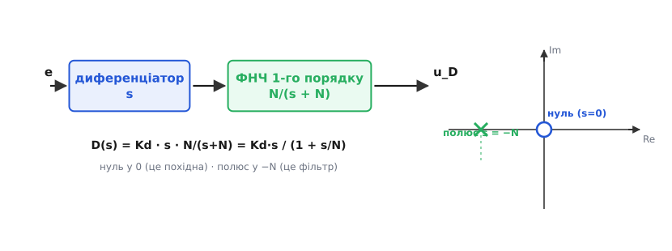
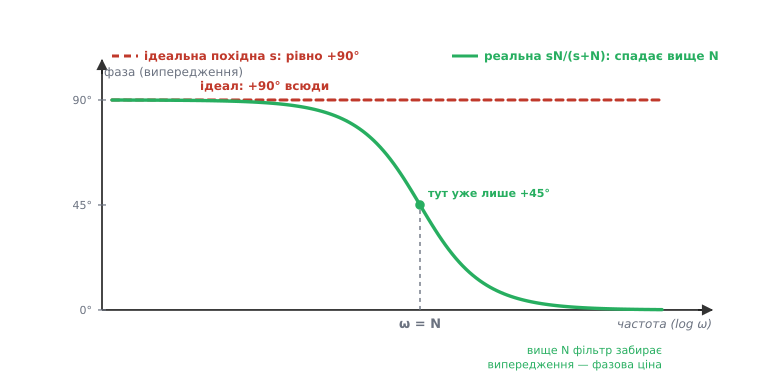

# 🧮 Спектр і фільтр похідної: повне частотне виведення

Ми вже знаємо словами: чиста похідна підсилює високі частоти без межі, тому її фільтрують ФНЧ першого порядку, і за це платять частиною фазового випередження. Тут ми виведемо кожне з цих тверджень **строго**, у мові частот — від передавальної функції `s` до різницевого рівняння в мікроконтролері. Мета не в тому, щоб замінити інтуїцію формулами, а в тому, щоб побачити, звідки та інтуїція **береться**: чому саме `ω` (а не `ω²` чи `√ω`), чому «без межі» — це не перебільшення, а математичний факт, і чому фільтр першого порядку — не випадковий вибір, а точка рівноваги двох сил, які тягнуть у різні боки.

Одразу домовимося про мову. **Передавальна функція** — це те саме, що робить система з синусоїдою кожної частоти: наскільки підсилює її амплітуду і на скільки зсуває фазу. Її записують як функцію змінної **s** (комплексної частоти з перетворення Лапласа); щоб дістати відгук саме на чисту синусоїду частоти ω, підставляють **s = jω**, де j — уявна одиниця. Модуль `|G(jω)|` — це підсилення амплітуди на частоті ω; аргумент (кут) `∠G(jω)` — фазовий зсув. Уся подальша розмова — це два графіки цих двох величин від частоти. Більше нічого з теорії Лапласа нам не знадобиться.

### Ідеальний диференціатор: чому його передавальна функція — це рівно s

Почнімо з означення й переконаймося, що диференціюванню в мові частот відповідає множення на s. Це не постулат — це прямий наслідок того, що похідна синусоїди є знову синусоїда, лише масштабована й зсунута. Візьмімо чистий тон і продиференціюймо його:

```
 вхід:   x(t)  = A·sin(ωt)
 вихід:  dx/dt = A·ω·cos(ωt) = A·ω·sin(ωt + 90°)
```

Читаємо результат по частинах. По-перше, амплітуда виходу — `A·ω`, тобто вхідна амплітуда, **помножена на ω**. Значить, підсилення диференціатора — це рівно частота:

```
 |G(jω)| = (амплітуда виходу)/(амплітуда входу) = A·ω / A = ω
```

По-друге, `cos` — це `sin`, зсунутий рівно на чверть періоду **вперед**: вихід досягає піку раніше за вхід на 90°. Тобто фаза диференціатора — сталі **+90°** на будь-якій частоті. Обидва факти разом лаконічно вкладаються в один символ комплексної частоти: підставивши s = jω, дістаємо, що передавальна функція диференціатора — це просто

```
 G(s) = s        →   G(jω) = jω
 |jω| = ω        (модуль: підсилення)
 ∠(jω) = +90°    (аргумент j: фаза, бо j = 1·e^{j90°})
```

Ось чому «диференціювати» і «помножити на s» — синоніми. Множник j несе рівно +90° повороту (це і є геометричний зміст уявної одиниці — поворот на прямий кут), а множник ω — зростання амплітуди з частотою. Один символ `s` кодує обидві половини поведінки похідної. Це не позначення заради краси: воно дозволяє з'єднувати ланки просто перемножуючи їхні передавальні функції, чим ми зараз і скористаємося.

> 🔧 **Навіщо це.** Тримайте в голові переклад «диференціювати ⇄ множити на s (⇄ множити на jω на частоті ω)». Він перетворює важкі часові міркування про шум і затримки на прості множення й додавання кутів. Питання «що зробить D зі стрибком на такій-то частоті?» стає арифметикою: підсилення ω, поворот +90° — і все.

### Чому пряма |jω| = ω без стелі означає нереалізовність

Тепер придивімося до формули `|G| = ω` не як до рядка, а як до **поведінки, розтягнутої на всі частоти**. Підсилення дорівнює частоті й **росте без межі**: немає такого ω, вище за яке диференціатор перестав би підкручувати гучність. Подвоїли частоту — подвоїли підсилення; узяли ще вдесятеро вищу — ще вдесятеро сильніше. Пряма з нахилом +1 у логарифмічних осях (кожна декада частоти додає декаду підсилення) не має верхньої точки взагалі.

Це прямо суперечить фізиці. Реальна система живиться скінченною енергією й не може реагувати на нескінченно швидкі коливання нескінченно сильно. Але глибша, точніша причина навіть не енергетична, а **причиннісна**. Розгляньмо, що означало б реалізувати чисту похідну чесно. Похідна в момент t — це нахил **прямо зараз**; щоб знати миттєвий нахил, треба порівняти значення до й після моменту t, тобто зазирнути в майбутнє на нескінченно малий, але ненульовий проміжок. Система, що видає точну миттєву похідну, мусила б реагувати на подію **раніше**, ніж та повністю сталася. Такі системи звуть **непричинними** (англ. *non-causal*) — вони вимагають знання майбутнього входу, а фізичний пристрій його не має.

Ось чому чистий диференціатор `s` неможливо побудувати — ні аналогово, ні в коді. Будь-яка реальна «похідна» — це насправді наближення `s` на **скінченній** смузі частот: нижче певної межі вона поводиться як справжня похідна, а вище мусить перестати рости, інакше стала б непричинною й підсилила б увесь високочастотний шум без упину. Це переставляє питання з ніг на голову: фільтр на D-член — не косметичне «щоб тихіше було», а **єдиний спосіб зробити похідну взагалі реалізовною**. Питання не «фільтрувати чи ні», а «де саме поставити межу, вище якої ми свідомо відмовляємося диференціювати».

### Реальна похідна: послідовне з'єднання диференціатора з однополюсним ФНЧ

Раз межу поставити **треба**, поставмо її найпростішим способом — пропустивши похідну крізь фільтр нижніх частот першого порядку. «Першого порядку» тут означає — з **одним полюсом**: найпростіший згладжувач, той самий, що математично тотожний RC-ланці (резистор і конденсатор) або експоненційному ковзному середньому. Його передавальна функція — класична:

```
 ФНЧ 1-го порядку:   L(s) = N / (s + N)
```

Число **N** тут — **кутова частота** фільтра (радіан за секунду): нижче неї фільтр майже все пропускає, вище — гасить. Переконаймося, що це справді ФНЧ, тими самими двома підстановками s = jω на краях:

```
 низькі частоти (ω ≪ N):  jω мале проти N → L ≈ N/N = 1     ← пропускає повністю
 високі частоти (ω ≫ N):  jω велике        → L ≈ N/(jω)      ← гасне як 1/ω
```

На низах фільтр прозорий (підсилення 1), на верхах гасить пропорційно 1/ω. Тепер **з'єднаймо його послідовно** з диференціатором. Послідовне з'єднання ланок у мові частот — це просто **добуток** їхніх передавальних функцій (сигнал проходить одну, тоді другу; кожна множить свій множник). Домноживши ще на коефіцієнт Kd (вагу D-члена), дістаємо реальну, реалізовну похідну:

```
 ідеальна:   D(s) = Kd · s
 реальна:    D(s) = Kd · s · N/(s + N)  =  Kd · s / (1 + s/N)
```

Дві форми праворуч — те саме, поділене на N чисельника й знаменника; друга, `Kd·s/(1 + s/N)`, зручніша, бо явно показує: це похідна `Kd·s`, «пригальмована» знаменником `1 + s/N`, який стає помітним лише коли s дотягується до N.


*Виведення реальної похідної як ланцюга. Диференціатор s (він дає нуль передавальної функції в початку координат — саме він робить характеристику «похідною») послідовно з ФНЧ першого порядку N/(s+N) (він додає полюс у s = −N — саме він її обмежує). Добуток Kd·s/(1+s/N) і є те, що реалізують у коді. Карта праворуч показує суть однією картинкою: **нуль у нулі** тягне підсилення з частотою вгору, а **полюс у −N** зрізає це зростання на полиці.*

Ця конструкція «диференціатор × один полюс» — стандарт, який ви побачите і в підручниках, і в промислових ПІД-контролерах, і в блоці PID середовища Simulink (там її параметризують саме коефіцієнтом N). Далі ми розберемо її дві головні властивості — **асимптоти амплітуди** (звідки полиця й наскільки вона висока) і **фазу** (яку ціну беруть за цю полицю).

### Асимптоти амплітуди: нахил +1 знизу, горизонтальна полиця Kd·N згори

Дослідімо `|D(jω)|` на двох краях частоти — і побачимо точні асимптоти, про які йшлося словами. Підставмо s = jω і візьмімо модуль. Модуль добутку — це добуток модулів, тож рахуємо їх окремо: `|jω| = ω`, а `|N/(jω+N)| = N/√(ω²+N²)`. Разом:

```
 |D(jω)| = Kd · ω · N / √(ω² + N²)
```

Тепер два краї:

```
 знизу (ω ≪ N):  √(ω²+N²) ≈ N,  тож  |D| ≈ Kd·ω·N/N = Kd·ω   ← як чиста похідна
 згори (ω ≫ N):  √(ω²+N²) ≈ ω,  тож  |D| ≈ Kd·ω·N/ω = Kd·N   ← СТАЛА: полиця!
```

Ось воно, строго. **Нижче** кутової частоти N реальна похідна майже не відрізняється від ідеальної `Kd·ω` — нахил +1 у логарифмічних осях, усе корисне демпфування збережене. **Вище** N підсилення виходить на **горизонтальну полицю** заввишки рівно `Kd·N` і більше не росте. Ми зрізали безмежне зростання чистої похідної на скінченній стелі. Найвище можливе підсилення шуму тепер — **конкретне число**:

```
 стеля шумового підсилення  =  Kd · N
```

Це і є та формула стелі, заради якої все затівалося. Була нескінченність — стало `Kd·N`. Зверніть увагу на структуру: у стелі **обидва** множники, які ми крутимо на практиці. Kd задає, як високо стоїть уся характеристика (вага похідної), а N — де вона ламається й, отже, як високо забирається до полиці. Подвоїли N — удвічі вища полиця — удвічі більше шуму проходить у найгіршому разі. Це прямий, кількісний зв'язок «наскільки чистий D-член» ↔ «скільки шуму він пропустить».

Корисно назвати й **точку зламу** точно. Де саме характеристика «згинається»? На ω = N модуль дорівнює:

```
 |D(jN)| = Kd · N · N / √(N²+N²) = Kd·N/√2 ≈ 0.707·(Kd·N)
```

Тобто на самій кутовій частоті N підсилення вже на **3 децибели нижче** полиці (множник 1/√2 ≈ 0.707 — це і є класичні −3 дБ, універсальна ознака частоти зрізу фільтра першого порядку). N — це не абстрактний параметр, а **частота зрізу** нашого згладжувача похідної, у точнісінько тому ж сенсі, що й для будь-якого RC-фільтра.

Звідси природний місток до часової сталої. Кутова частота й **стала часу** фільтра — це обернені величини:

```
 τ = 1/N        (стала часу згладжування, секунди)
```

Ця подвійна оптика зручна на практиці. Думаєте в частотах — N каже, до якої частоти похідна «чиста». Думаєте в часі — τ = 1/N каже, наскільки довга «пам'ять» усереднення: за скільки секунд фільтр забуває старий відлік. Мале N — велике τ — довга пам'ять, сильне згладжування, повільніша й спокійніша реакція D. Велике N — мале τ — коротка пам'ять, гостра, майже нефільтрована похідна. Той самий один параметр, побачений з двох боків; у коді, як побачимо, він увійде саме через τ.

> 🔧 **Навіщо це.** Реальний D-член має **дві** ручки, і плутати їх — типова помилка. Kd — скільки демпфування (висота всієї характеристики). N (або τ = 1/N) — наскільки чистий D-член (де полиця). Мотори деренчать? Спокуса зменшити Kd й утратити потрібне демпфування; правильно — **опустити N** (сильніше профільтрувати), лишивши Kd. Демпфування мляве? Не завжди винен малий Kd — інколи N задерто вниз, і фільтр «з'їв» корисну похідну разом із шумом. Стеля `Kd·N` підказує обидва важелі одразу.

### Чому фільтр саме першого порядку

Ми взяли найпростіший фільтр — з одним полюсом. Виникає розумне питання: якщо мета — гасити шум, чому б не взяти крутіший фільтр (другого, третього порядку), який ріже високі частоти набагато різкіше? Відповідь — у **фазі**, і саме тут ховається головний компроміс диференційної складової.

Кожен полюс фільтра, купуючи придушення амплітуди, **платить фазовим відставанням**. Один полюс ФНЧ додає до фази від 0° (на низах) до −90° (на верхах); два полюси — до −180°; три — до −270°. А фазове відставання для контуру керування — отрута: воно з'їдає **запас фази** (той буфер, що відділяє стійкий контур від розгойданого — про нього окремий крок про [запас стійкості](root:embedded/loop-stability)). Коливання народжуються, коли сумарний зсув фази в контурі дотягується до −180°; кожен зайвий градус відставання підсуває систему ближче до цієї межі.

Тепер порахуймо баланс саме для D. Уся суть диференційної складової в тому, що вона дає **+90° випередження** — додає запасу фази, стабілізує. Але фільтр, який робить її реалізовною, забирає частину цього випередження назад. Порівняймо, скільки забирає фільтр різного порядку **на робочих частотах** (нижче кутової N, де D має працювати):

```
 фільтр 1-го порядку:  максимум −90° відставання (і то лише далеко за N)
                       на робочих частотах віднімає мало — випередження D зберігається
 фільтр 2-го порядку:  до −180° відставання — здатний САМОТУЖ довести контур до межі
 фільтр 3-го й вище:   ще гірше — відставання накопичується стрімко
```

Ось чому фільтр першого порядку — **точка рівноваги**, а не лінь. Він додає рівно один полюс — мінімум, потрібний, щоб зробити похідну причинною й зрізати шум полицею, — і за це бере найменшу можливу фазову плату (максимум −90°, та й то на частотах, вищих за робочі). Крутіший фільтр придушив би шум різкіше, але його фазове відставання почало б «з'їдати» те саме +90° випередження, заради якого D і потрібен: ми боролися б сам проти себе, стабілізуючи однією рукою й дестабілізуючи другою. Один полюс — це найдешевша ціна за реалізовність, і саме тому він став стандартом. Коли шуму так багато, що одного полюса замало, правильніше чистити **сам вимір** окремим фільтром (де фазова плата не б'є прямо по контуру керування — про це крок про [вибір фільтра](root:embedded/choosing-a-filter)), ніж нарощувати порядок фільтра похідної.

> 🔧 **Навіщо це.** Не піддавайтеся спокусі поставити на D «фільтр покрутіше», щоб добити шум. Кожен зайвий полюс тут прямо віднімає запас стійкості — ви можете придушити деренчання й натомість дістати повільне розгойдування контуру, яке ще важче діагностувати. Стандарт «один полюс на D-члені» — усвідомлений компроміс; якщо його не вистачає, чистьте вимір **до** входу в регулятор, а не D **всередині** нього.

### Фаза реальної похідної: де фільтр забирає випередження

Розберімо фазову ціну точно — бо вона і є друге обличчя того самого компромісу N. Фаза добутку — це **сума** фаз множників. Диференціатор дає сталі +90°; однополюсний ФНЧ додає `−arctan(ω/N)`. Разом:

```
 ∠D(jω) = 90° − arctan(ω/N)
```

Пройдімося по цій формулі очима, від низьких частот до високих:

```
 ω ≪ N:  arctan(ω/N) → 0°,   тож  ∠D ≈ +90°   ← повне випередження, як в ідеалу
 ω = N:  arctan(1)    = 45°,  тож  ∠D = +45°    ← половину випередження вже втрачено
 ω ≫ N:  arctan(ω/N)  → 90°,  тож  ∠D → 0°      ← випередження зникло геть
```

Ось математична ціна фільтра, видна з боку фази. Ідеальна похідна давала рівно +90° на **всіх** частотах. Реальна тримає ці +90° лише на низах; на кутовій частоті N вона вже спала до +45° (рівно половина), а далеко за N — до нуля: полиця амплітуди (стала характеристика) фазу не зсуває взагалі, бо стала ланка нічого не випереджає. Фільтр, рятуючи від шуму, **забирає частину фазового випередження** саме на високих частотах.


*Фазова характеристика похідної. Ідеальна s (червоний пунктир) дає рівно +90° на будь-якій частоті. Реальна sN/(s+N) (зелена) тримає ці +90° лише нижче кутової частоти N, на самій N спадає до +45°, а вище N котиться до 0° — стала полиця амплітуди випередження не дає. Це та сама ручка N, що керує амплітудою, побачена з боку фази: **придушення шуму й фазове випередження — це одна ручка, покручена в різні боки**.*

І тут замикається коло всього компромісу. Опустили N (сильніший фільтр, нижча полиця, тихіше в моторах) — і водночас **раніше** починаєте втрачати +90° випередження, тобто менше стабілізувального ефекту D лишається там, де він міг би допомогти. Підняли N (гостра, майже чиста похідна, повне випередження) — і пропустили майже стільки ж шуму, скільки нефільтрована похідна. **Придушення шуму й фазове випередження керуються одним параметром N, покрученим у протилежні боки.** У цьому — уся драма диференційної складової в одному рівнянні: `∠D = 90° − arctan(ω/N)` каже і скільки випередження ви маєте, і (через ту саму N у стелі Kd·N) скільки шуму заплатите за нього.

### Дискретизація: від sN/(s+N) до різницевого рівняння EMA

Формула `Kd·s/(1+s/N)` живе в неперервному часі, а мікроконтролер працює тактами через крок Δt. Треба перекласти передавальну функцію в **різницеве рівняння** — рецепт «новий вихід із старих входів і виходів». Способів такого перекладу є кілька — вони різняться тим, як наближають неперервну похідну скінченним кроком. Почнімо з **найпростішого чесного** — задньої різниці (англ. *backward difference*, вона ж задній, неявний метод Ойлера): миттєву похідну `s` наближаємо різницею двох сусідніх відліків, поділеною на крок.

Запишімо цю заміну — усюди в передавальній функції неперервну s міняємо на її дискретний відповідник, задню різницю:

```
 задня різниця:   s  →  (1 − z⁻¹)/Δt
```

Тут z⁻¹ — оператор зсуву на такт назад (z⁻¹·xₙ = xₙ₋₁, «попередній відлік»), тож `(1 − z⁻¹)·xₙ = xₙ − xₙ₋₁` — приріст сигналу за один такт, а поділений на Δt дає наближення похідної. Підставмо цю заміну в однополюсний ФНЧ `L(s) = N/(s+N)`; на відміну від хитріших дискретизацій, тут алгебра коротка, тож пройдімо її повністю, без пропусків:

```
 L(z) = N / ( (1 − z⁻¹)/Δt + N )          ← підставили s
      = N·Δt / ( (1 − z⁻¹) + N·Δt )       ← ×Δt чисельник і знаменник
      = N·Δt / ( (1 + N·Δt) − z⁻¹ )       ← згрупували сталі знаменника
```

Ця передавальна функція означає рівність `Y·((1 + N·Δt) − z⁻¹) = N·Δt·X`. Розкриємо z⁻¹ як «попередній відлік» (z⁻¹·yₙ = yₙ₋₁) і зберемо поточний вихід yₙ по один бік:

```
 (1 + N·Δt)·yₙ − yₙ₋₁ = N·Δt·xₙ
 yₙ = ( yₙ₋₁ + N·Δt·xₙ ) / (1 + N·Δt)
```

Назвемо дріб `N·Δt/(1 + N·Δt)` одним символом α (тоді `1 − α = 1/(1 + N·Δt)`, бо `1 − N·Δt/(1+N·Δt) = 1/(1+N·Δt)`) — і рівняння згортається у знайому форму:

```
 yₙ = (1 − α)·yₙ₋₁ + α·xₙ            ← однополюсний ФНЧ у дискретному часі
```

Це — **експоненційне ковзне середнє** (англ. *exponential moving average*, EMA): новий вихід є старий вихід, трохи підтягнутий до нового входу. Коефіцієнт α (між 0 і 1) — і є вся суть фільтра: мале α — вихід ледь ворушиться, сильне згладжування (мала N, довга τ); α → 1 — вихід майже дорівнює входу, згладжування зникає (велика N, коротка τ). Той самий один полюс `N/(s+N)`, та сама одна стала N — тепер у формі одного рядка коду. Мова частот і рекурентний фільтр — це те саме, сказане двічі.

Тепер видно, чому ми почали саме із задньої різниці. Точніші переклади є: трапецієвидне **білінійне перетворення Тастіна** (`s → (2/Δt)·(z−1)/(z+1)`) — метод другого порядку, — але для `N/(s+N)` воно дає **двотактну** форму, де `yₙ` залежить і від `xₙ`, і від `xₙ₋₁`; точна дискретизація через експоненту дала б інший коефіцієнт, `α = 1 − e^(−Δt/τ)`. На дрібному кроці `Δt ≪ τ` усі три майже збігаються. Тож для згладжувача похідної в прошивці беруть саме задню різницю: вона так само не псує стійкості (стійка неперервна ланка лишається стійкою дискретною), але коштує найменше — один вхідний доданок і рівно один рядок коду.

Тепер зберемо повний D-член: спершу сира похідна (різниця відліків), тоді цей EMA-згладжувач, тоді множення на Kd. Ось прозора, робоча форма для мікроконтролера — реальний C, не псевдокод:

```c
// Стан регулятора — ЖИВЕ між викликами (поля структури стану, тут static):
static float meas_prev = 0.0f;   // попередній вимір
static float d_filt    = 0.0f;   // відфільтрований D-член (стан EMA)

// Один такт, викликається рівномірно кожні dt секунд:
float d_raw = (meas_prev - meas) / dt;   // −dy/dt: сира похідна ВІД ВИМІРУ
float alpha = dt / (dt + tau);           // tau = 1/N; коеф. згладжування 0…1
d_filt += alpha * (d_raw - d_filt);      // однополюсний ФНЧ (EMA) = N/(s+N)
float u_D = Kd * d_filt;                  // внесок диференційної складової
meas_prev = meas;                         // запам'ятати для наступного такту
```

Три речі в цьому коді варто зрозуміти до кінця, бо кожна прямо втілює щось із виведеного вище.

**Перше — звідки береться `alpha = dt/(dt+tau)`.** Це не магічне число, а рівно α з виведення задньою різницею вище: ми дістали `α = N·Δt/(1 + N·Δt)`, а поділивши чисельник і знаменник на N (пам'ятаючи, що τ = 1/N), маємо `α = Δt/(Δt + τ)` — точно той самий рядок коду. Перевірмо на краях, і стане ясно, що вона робить правильне:

```
 tau велике (мала N, сильний фільтр):  alpha ≈ dt/tau → мале → d_filt ледь рухається
 tau → 0    (велика N, слабкий фільтр): alpha → dt/dt = 1 → d_filt ≈ сира похідна
```

Одна стала τ = 1/N керує всім характером D-члена — рівно та сама N, що задавала полицю Kd·N у спектрі й точку +45° у фазі. Спектр, фаза й рядок коду — три записи одного числа.

**Друге — чому похідна саме `(meas_prev − meas)/dt`, тобто −dy/dt.** Ми беремо похідну **від виміру** зі знаком мінус, а не від помилки. Це не примха дискретизації: коли завдання r у формулу взагалі не входить (а тут його немає), різка зміна r **за побудовою** не може дати похідного сплеску-поштовху — стрибнути може лише r, а реальний вихід апарата y міняється плавно. Знак мінус ставить дію в правильний бік: коли вимір росте (наближається згори), −dy/dt від'ємний, D тисне вниз — гальмує наближення, як і має демпфер.

**Третє — і найпідступніше — `meas_prev` і `d_filt` мусять жити між викликами.** Тут вони `static`, у справжній прошивці — поля структури стану регулятора. Забути про це — класична помилка: похідна щотакту починатиме «з чистого аркуша», d_filt не накопичуватиме згладжування, а meas_prev дорівнюватиме нулю щоразу, тож `d_raw` перетвориться на дику величину `−meas/dt`. Симптом — D наче «не працює» або смикає без причини; корінь — незбережений стан фільтра. EMA — рекурентний фільтр; уся його пам'ять сидить у цих двох змінних, і стерти їх — це стерти фільтр.

**Приклад (фільтр гасить одиничний шумовий сплеск).** Kd = 0.5, dt = 0.01 с, N = 10 → τ = 0.1 с, α = 0.01/0.11 ≈ 0.091.

```
 Корисний стійкий нахил (вимір повільно спадає, −dy/dt = −40 °/с):
   d_filt за кілька тактів плавно сходить до −40 (фільтр майже не заважає
   повільній, «низькочастотній» зміні),  u_D = 0.5·(−40) = −20 — демпфування ціле.

 Одиничний шумовий стрибок виміру (+0.3° за ОДИН такт → d_raw = −30 °/с на цей такт):
   без фільтра:  u_D = 0.5·(−30) = −15         — різкий сплеск прямо в мотор.
   з фільтром:   d_filt += 0.091·(−30 − 0) = −2.73;  u_D = 0.5·(−2.73) ≈ −1.4
                 — сплеск ослаблено у ~11 разів (1/α) і ще й розтягнуто в часі,
                   а не вдарено одним поштовхом.
```

Той самий стійкий нахил фільтр пропускає майже без утрат, а поодинокий стрибок душить у ~11 разів — і це **полиця Kd·N у дії, побачена в часовій області**. Фільтр розрізняє «довгу правду» й «коротку брехню» рівно тому, що правда (корисний нахил) живе в низьких частотах, під полицею, а брехня (шум) — у високих, де полиця її зрізає. Частотне виведення й часовий приклад — той самий факт із двох боків.

> 🔧 **Навіщо це.** Реалізуючи D, **ніколи** не пишіть голе `Kd*(e − e_prev)/dt`. Це рівно та «сира похідна» `Kd·s`, що непричинна в теорії й змушує мотори деренчати на практиці. Мінімальна професійна форма — три речі разом, і кожна тут не випадкова: похідна **від виміру** (проти поштовху), **однополюсний фільтр** (проти шуму, він же — те, що робить похідну реалізовною), і **збережений стан** (без нього не працює ні те, ні те). Порядок цього D-члена відносно антивіндапу й обмеження виходу в повному такті ПІД — окрема тонкість реалізації, її розібрано у [вставці про надійний дискретний ПІД](root:com-signal/discrete-pid/proj-pid-c.md).

### Підсумок: одне число N з трьох боків

Ми виводили частотну картину похідної й раз за разом натрапляли на **одне** число — N (або, що те саме, τ = 1/N), яке проступає всюди, де ми ставили межу між користю й шумом:

- у **спектрі амплітуди** — N ставить точку зламу й висоту полиці `Kd·N` (стеля шумового підсилення), а на самій N підсилення вже на −3 дБ;
- у **фазі** — та сама N є точкою, де випередження спадає з +90° до +45° (`∠D = 90° − arctan(ω/N)`), а вище N зникає геть;
- у **коді** — та сама N входить через τ = 1/N у коефіцієнт EMA `α = dt/(dt+τ)`, керуючи всім характером рекурентного фільтра.

Це не три різні параметри, а **один**, побачений із трьох боків, — і ціна за нього щоразу одна: висока N дає гостру похідну з повним випередженням, але пропускає шум; низька N глушить шум, але згинає похідну рано й забирає випередження. Уся конструкція виросла з єдиної необхідності: чиста похідна `s` непричинна (безмежно підсилює й вимагала б знання майбутнього), тож її **обов'язково** обмежують — і найдешевший спосіб обмежити, з мінімальною фазовою платою, — один полюс `N/(s+N)`. Звідси й полиця, і фазова ціна, і рядок EMA в прошивці; усе це — наслідки одного рішення, де поставити N.
