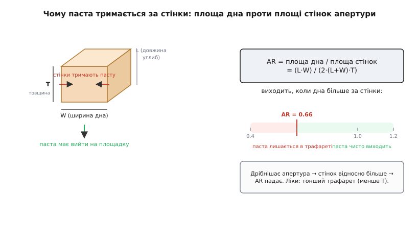
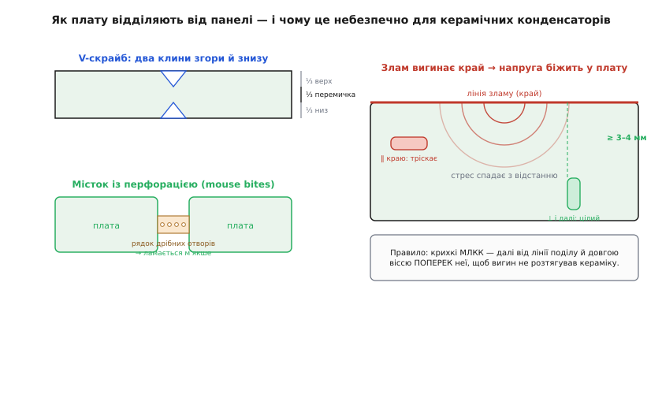
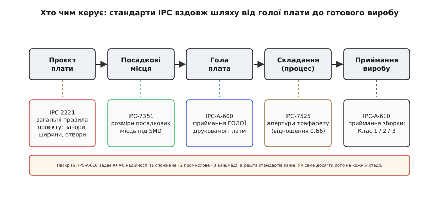

# DFM: проєктувати так, щоб можна було виготовити

<preknowlist>
- [Оплавлення (reflow)](book:electronics/reflow-soldering) — температурний профіль печі й змочування припою: без нього не зрозуміти, чому тепло вирішує все.
- [Тепловий опір і відведення тепла](book:physics/thermal-resistance) — тепло тече крізь опір, як струм крізь резистор; на цьому стоїть уся механіка надгробка.
- [Дільник напруги](book:electronics/voltage-divider) — два резистори ділять напругу в пропорції опорів; знадобиться в АЦП-варіанті страпів ревізії.
</preknowlist>

У базовому кроці ми вивели головне: коли ти переходиш від однієї плати, спаяної власною рукою, до партії, зібраної конвеєром, питання змінюється з «чи спаяю я це?» на «чи не зашкодить цьому жодна зі сліпих операцій конвеєра?». Ми пройшли плату по чотирьох станціях — друк пасти, розстановка, оплавлення, контроль — і побачили, що кожна ставить своє правило, а найпідступніший брак, надгробок, народжується з теплової несиметрії. Цього досить, щоб не запороти першу партію.

Але «досить, щоб не запороти» і «розумію до дна» — різні глибини. Коли завод відмовляється робити твою плату дешево, коли з партії стабільно випадає два відсотки, коли ревізія 3 раптом почала тумбстонити там, де ревізії 1 і 2 були чисті, — тобі вже мало правил-заборон. Тобі треба **число**, за яким ти сам вирішиш, де межа: наскільки дрібну апертуру трафарет фізично віддасть, скільки часу площадка на суцільній міді відстає від сусідки, як далеко від лінії розлому має сидіти керамічний конденсатор, щоб не тріснути. Саме ці числа й механізми за ними ми тепер і виведемо — не приймемо на віру з таблиці виробника, а покажемо, звідки вони беруться з фізики. Тоді таблиця виробника перестане бути магією й стане тим, чим є: набором меж, які ти вмієш прочитати й перевірити.

## Перше сито глибше: чому паста тримається за стінки трафарету

У базовій версії ми сказали просто: «дуже дрібні апертури друкуються погано — паста або не пролазить, або лишається в трафареті». Це правда, але це не пояснення, а спостереження. Розберімо **чому** — бо з цього «чому» випадає точне число, яким користуються всі, хто проєктує під дрібний крок.

Уяви одну апертуру трафарету: наскрізне вікно у сталевому листі товщиною T, з дном (тим, що дивиться на площадку плати) розміром L на W. Ракель проштовхнув пасту в це вікно, вікно заповнене. Тепер трафарет піднімають — і паста мусить **вирішити**, з ким їй лишитися: з площадкою плати внизу чи зі стінками апертури з боків. Це буквально боротьба двох зчеплень. Паста тримається за площадку силою адгезії по **площі дна**; паста тримається за стінки силою адгезії (і тертя) по **площі бічних стінок**. Хто більший, той і переможе.

Порахуймо ці дві площі. Площа дна, якою паста тримається за площадку:

```
A_дна = L · W
```

Площа всіх чотирьох стінок вікна (периметр помножити на товщину):

```
A_стінок = 2·(L + W) · T
```

Їхнє відношення й називають **площинним відношенням** (*area ratio*, AR) — головним числом друку:

```
AR = A_дна / A_стінок = (L · W) / (2·(L + W)·T)
```


*Уся боротьба друку — на одному відношенні. Паста хоче зійти на площадку (площа дна) і не хоче відпускати стінки (площа стінок). Що дрібніша апертура, то більше стінок припадає на одиницю дна, тож AR падає, і стінки перемагають — паста лишається у трафареті. Порогом якісного відділення галузь узяла AR ≈ 0.66; нижче — брак пасти. Найпростіші ліки видно прямо з формули: зменшити T, тобто взяти тонший трафарет.*

Тепер відчуй, що каже формула. Візьми велику апертуру, скажімо, 2 на 2 мм, у трафареті 0.12 мм:

```
AR = (2 · 2) / (2·(2 + 2)·0.12) = 4 / 1.92 ≈ 2.08
```

Дна вдвічі з гаком більше за стінки — паста радо йде на площадку. А тепер стисни апертуру до крихітної, під вивід дрібної мікросхеми, 0.25 на 0.25 мм, у тому ж трафареті:

```
AR = (0.25 · 0.25) / (2·(0.25 + 0.25)·0.12) = 0.0625 / 0.12 ≈ 0.52
```

Дна вже вдвічі **менше** за стінки — стінки перетягують, паста лишається у вікні, площадка виходить голодна. Ось воно, спостереження з базової версії, тепер уже як число: не «дрібне друкується погано взагалі», а «AR впав нижче межі». А межа ця не з голови — її встановили експериментально, міряючи **ефективність перенесення** (*transfer efficiency*): скільки відсотків пасти, що влізла у вікно, реально лишилося на площадці. Галузевий звід на трафарети, IPC-7525, задає її так: при AR ≥ 0.66 перенесення стабільне (типово понад 80 %), нижче — падає обривом і починає гуляти від апертури до апертури. (Число підтверджене відкритою галузевою практикою; це усталений порядок для звичайної пасти Type 3. Дрібнозернистіша паста Type 4/5, де кульки припою менші, спускає межу приблизно до 0.58 — про це нижче.)

> 🔧 **Навіщо це.** Формула AR — це не академія, а важіль, за який ти реально смикаєш при розводці дрібного. Дивись: у знаменнику стоїть T. Якщо твоя дрібна апертура дає AR = 0.52 і паста голодує — ти не мусиш викидати компонент. Ти просиш у заводу **тонший трафарет**: узяв T = 0.10 замість 0.12 — і той самий отвір 0.25 мм дає AR = 0.0625/0.10 ≈ 0.63, майже на межі; T = 0.09 дасть 0.69, уже норма. Але тонший трафарет означає менше пасти **всюди** — і на великих площадках її може забракнути для доброго галтеля. Тому реальний хід — не тоншати весь трафарет, а зробити його **ступінчастим** (*step stencil*): товстішим над великими деталями, тоншим над дрібними. Ти цього не намалюєш у Gerber — це рядок у листі до заводу. Але знати межу мусиш саме ти, бо це твій компонент вимагає дрібної апертури, і саме ти вирішуєш, ставити його чи взяти корпус із ширшим кроком.

### Де формула AR ламається

Кожна формула має межу застосовності, і чесно її назвати. AR припускає, що паста — суцільне тіло, чиє зчеплення пропорційне площі. Насправді паста — це **кульки припою** певного розміру в клейкому флюсі, і коли апертура стає лише в кілька кульок завширшки, «суцільне тіло» вже не працює: одна кулька, застрягла в куті вікна, псує всю статистику. Ось тому й з'явилися типи пасти за розміром зерна (Type 3 — кульки 25–45 мкм, Type 4 — 20–38, Type 5 — 15–25): дрібніше зерно рівніше заповнює маленьке вікно й тому дозволяє нижчий AR. Друга межа: формула не бачить **форми** апертури. Реальні апертури роблять із заокругленими кутами й іноді трапецієподібними в перерізі (ширшими знизу), щоб паста легше зісковзувала, — і це зсуває поріг. Тому 0.66 — не закон природи, а добрий інженерний орієнтир для типового випадку; точну межу для конкретного заводу дає його таблиця. [Повне виведення ефективності перенесення — від балансу адгезійних сил до впливу розміру зерна й кута стінки](root:embedded/dfm-basics/math-area-ratio.md) винесено окремо; тут нам досить головного зв'язку: дрібнішає апертура — росте частка стінок — падає перенесення.

## Друге сито глибше: гонка тепла й повний баланс моментів надгробка

Тепер найцікавіше — надгробок. У базовій версії ми записали умову перекидання балансом моментів і побачили, що вага деталі мізерна, тож боротися треба з причиною, а не з наслідком. Тут ми виведемо **обидва** боки цієї нерівності до кінця: і момент від тепла (звідки береться сила натягу й **коли** саме вона діє), і момент від ваги (чому він програє з таким запасом) — і, найважливіше, покажемо, що керує **часом**, бо надгробок — це задача про час, а не про силу.

### Бік перший: чому одна площадка відстає — тепловий RC

Почнімо з питання, яке базова версія лишила на інтуїції: **наскільки** саме площадка на суцільній міді холодніша за площадку на тонкій доріжці, і як це залежить від конструкції. Виявляється, тут працює точно та сама математика, що й у зарядці конденсатора через резистор, — і це не аналогія для краси, а буквально той самий закон.

Проведи паралель між теплом і електрикою, вона строга. Різниця температур — це «напруга», що жене тепло. Тепловий потік — це «струм». [Тепловий опір](book:physics/thermal-resistance) Rθ — це опір, крізь який тепло тече від печі до площадки. А **теплоємність** C — скільки джоулів треба влити, щоб нагріти масу металу на градус, — це «конденсатор», що накопичує тепло. Площадка з припоєм, яку піч гріє крізь тепловий опір, — це буквально RC-ланка: температура наростає не миттєво, а з **тепловою сталою часу**:

```
τ = Rθ · C
```

І температура площадки над початковою йде тим самим експоненційним законом, що й напруга на конденсаторі:

```
T(t) = T_піч · (1 − e^(−t/τ))
```

Тепер дивись, що робить конструкція. Площадка, приварена до **великої мідної заливки**, має величезну теплоємність C — уся ця мідь мусить нагрітися разом із нею, — і водночас заливка розносить тепло вбік, ефективно збільшуючи шлях. Її τ **велика**, вона нагрівається **повільно**. Площадка на **тонкій доріжці** гріє тільки крихітну свою масу — C мала, τ мала, вона вистрілює до температури печі **швидко**. Обидві прямують до однієї кінцевої температури, але з різною швидкістю — і саме розрив у швидкості вирішує долю деталі.


*Надгробок — це задача про час. Обидві площадки гріються до однієї температури, але з різними тепловими сталими часу: тонка доріжка (синя) розплавляє припій раніше, суцільна мідь (зелена) — пізніше. У проміжку Δt між перетинами лінії ліквідусу один кінець деталі вже плаває в рідкому припої й тягне, а другий ще приморожений до твердого — і саме тоді сила натягу безборонно перекидає деталь навколо припаяного кінця. Зменшити Δt (звузивши тепловий міст спицями) — значить прибрати саме вікно, у якому катастрофа можлива.*

Знайдімо це вікно точно. Припій плавиться, коли площадка досягає температури ліквідусу T_liq. Час, за який площадка з тепловою сталою τ дійде до цієї температури, дістаємо, розв'язавши експоненту:

```
T_liq = T_піч · (1 − e^(−t/τ))
  →  e^(−t/τ) = 1 − T_liq/T_піч
  →  t_розплав = −τ · ln(1 − T_liq/T_піч)
```

Ключове тут — час перетину **прямо пропорційний τ**. Тож розрив між двома площадками:

```
Δt = t_повільна − t_швидка = (τ_мідь − τ_доріжка) · [ −ln(1 − T_liq/T_піч) ]
```

Логарифм у дужках — спільний множник, він однаковий для обох; **різницю робить лише різниця теплових сталих часу**. Це і є точна відповідь на «наскільки». Хочеш прибрати надгробок — тобі не треба чіпати профіль печі чи вагу деталі. Тобі треба **зблизити τ двох площадок**. А τ = Rθ·C, і найлегше керувати Rθ теплового мосту між площадкою й заливкою. Теплова розв'язка (*thermal relief*) — ті кілька вузьких спиць замість суцільного з'єднання — це навмисне **великий тепловий опір** цього мосту: він відрізає площадку від гігантської теплоємності заливки саме в тепловому сенсі, лишаючи електричний зв'язок (для струму спиці — майже нічого, бо переріз міді сумарно достатній). τ_мідь падає майже до τ_доріжка, Δt стискається до нуля, обидва припої розплавляються майже разом — і перекидати вже нема коли.

> 🔧 **Навіщо це.** Оце і є справжня причина, чому теплову розв'язку закладають на етапі малювання площадок, а не рятують нею партію постфактум. Порахуй грубо для 0402 на суцільному полігоні: маса площадки з припоєм дає C порядку одиниць мілліджоулів на градус, тепловий опір до заливки без спиць — одиниці градусів на ват, тож τ_мідь може бути в кілька разів більша за τ_доріжка. У печі, де реальне вікно оплавлення — секунди, різниця в частку секунди вже фатальна для легкої деталі. Спиці зрізають цю різницю в рази одним рішенням у бібліотеці посадкових місць. Ти платиш нуль грамів і нуль грошей — лише правильно намальована площадка. А без цього кожна дрібна деталь, чия одна нога впала на велику мідь, — заряджений надгробок, що вистрелить на певному екземплярі за певної температури печі.

### Бік другий: звідки сила натягу й чому вага не рятує

Тепер другий бік нерівності — самі сили, що діють у те вікно Δt. Коли один кінець деталі плаває в рідкому припої, а другий приморожений, рідкий припій **тягне** деталь. Звідки ця тяга? З того самого поверхневого натягу, що збирає воду в краплю. Рідкий припій прагне **мінімізувати свою вільну поверхню** — а найменша поверхня буде, коли припій стягнеться в компактну краплю під деталлю, підтягнувши кінець деталі до себе, до центру площадки. Сила, з якою він тягне, — це поверхневий натяг γ, помножений на довжину лінії контакту (периметр змочування) p:

```
F_натягу ≈ γ · p
```

Для припою γ ≈ 0.4–0.5 Н/м (порядок для безсвинцевих сплавів у розплаві), а периметр торця деталі 0402 — близько міліметра. Підставмо:

```
F_натягу ≈ 0.45 Н/м · 1.0·10⁻³ м ≈ 4.5·10⁻⁴ Н
```

Ця сила прикладена на плечі — висоті деталі h над площадкою — і крутить деталь навколо припаяного кінця. Момент, що перекидає:

```
M_перекид = F_натягу · h ≈ 4.5·10⁻⁴ · 0.25·10⁻³ ≈ 1.1·10⁻⁷ Н·м
```

А тепер утримний момент — вага. Вага деталі m·g тягне вниз у центрі мас, на плечі половини довжини L/2 від осі. Для 0402 маса ≈ 0.6 мг:

```
M_утрим = m · g · (L/2) ≈ 0.6·10⁻⁶ · 9.8 · 0.5·10⁻³ ≈ 3·10⁻⁹ Н·м
```

Постав їх поруч і відчуй прірву:

```
M_перекид / M_утрим ≈ 1.1·10⁻⁷ / 3·10⁻⁹ ≈ 37
```

Момент перекидання **на порядок-два більший** за утримний. Тобто щойно виникло вікно Δt із несиметрією — деталь не «може» перекинутися, вона **приречена**: вага чинить опір у десятки разів слабший за тягу. Ось строге обґрунтування моралі з базової версії: не «беріть важчі деталі» — важчі не врятують, прірва завелика, — а «не давайте виникнути несиметрії». Ти б'єшся не з силою натягу (її не здолати конструкцією), а з **часом**, у який вона діє: прибери Δt — і не важить, яка сила, бо нема моменту, коли один бік вільний, а другий тримає.

### Чому 0201 і 01005 тумбстонлять зліше — і як тут працює масштаб

Це виведення дарує ще й безкоштовний висновок про розмір, який на самих правилах не видно. Дивись, як обидва моменти масштабуються, коли деталь зменшується в лінійних розмірах у k разів. Сила натягу йде по периметру — падає як k (лінійно). Її плече h падає як k. Отже момент перекидання падає як k². А вага — це об'єм, падає як k³, і плече L/2 падає як k, тож утримний момент падає як **k⁴**. Відношення:

```
M_перекид / M_утрим  ∝  k² / k⁴  =  1/k²
```

Зменшив деталь удвічі (0402 → 0201, груба оцінка) — і схильність до перекидання зросла **вчетверо**. Тому 0201, а тим паче 01005, — це вже клас деталей, де теплова симетрія площадок не «бажана», а **обов'язкова**: запас, який у 0402 ще прощав дрібну несиметрію, у 0201 з'їдений масштабом дощенту. Ось чому перехід на дрібніші пасиви — це не лише питання, чи їх поставить автомат, а й вирок бібліотеці посадкових місць: кожна площадка мусить мати теплову розв'язку, інакше вихід партії просяде. [Повне виведення балансу — тепловий RC обох площадок, сила змочування з геометрії меніска, момент і закон масштабу k²](root:embedded/dfm-basics/math-tombstone-balance.md) винесено окремо; тут ми взяли з нього те, що прямо диктує розводку.

## Що плата віддає конвеєру: панель до кінця, і чому вона калічить кераміку

Базова версія показала, що автомат тягне не одну плату, а **панель** — лист із кількох плат у спільній рамці з технологічними полями, реперами й вільною смугою по краю. Це половина історії. Друга половина — **як плату потім із панелі виймають**, бо саме тут ховається брак, якого на конвеєрі ще не було й який виникає вже після нього: тріщини в компонентах від механічного стресу поділу. Виготовність — це весь життєвий цикл плати, і поділ панелі — його повноправна станція.

Панель треба **розділити** (*depaneling*) на окремі плати, і робиться це одним із трьох способів, кожен зі своєю фізикою й своєю ціною для конструкції.

**V-скрайб** (*V-score*) — найпоширеніший для прямокутних плат. Уздовж лінії поділу з обох боків листа прорізають V-подібні клини, знімаючи приблизно по третині товщини згори й знизу й лишаючи третину як тонку **перемичку** (правило «⅓–⅓–⅓»). Плату потім просто відламують або прокочують ножем-роликом по цій ослабленій лінії. Дешево, швидко, край рівний — але злам **вигинає** плату по лінії, і цей вигин розтягує все, що сидить поруч.

**Містки з перфорацією** (*mouse bites*, «мишачі укуси») — між платами лишають кілька вузьких перешийків, у кожному просвердлено рядок дрібних отворів. Плата тримається за ці перешийки, а відділяється, ламаючи їх по перфорації. Стресу менше, ніж від V-скрайбу (перешийок вузький, ламається локально), край лишається трохи «зубчастим» від укусів. Годиться для непрямокутних плат, куди V-скрайб прямою лінією не лягає.

**Фрезерування** (*tab routing*) — фреза обходить повний контур кожної плати, лишаючи кілька суцільних містків-язичків, які потім вирізають окремо (часто фрезою ж або лазером). Найм'якший до плати, будь-яка форма контуру — але найповільніший і лишає найбільше відходів.


*Дві механіки поділу й головна небезпека. V-скрайб знімає по третині товщини з боків, лишаючи тонку перемичку; злам по ній вигинає плату. Це вигинання породжує поле механічної напруги, що згасає з відстанню від краю. Багатошаровий керамічний конденсатор (MLCC) — крихкий: якщо він сидить близько до лінії поділу й **довгою віссю вздовж неї**, вигин розтягує кераміку між його електродами й дає внутрішню тріщину, яку не видно оком. Ліки: тримати крихкі MLCC на відступі 3–4 мм від лінії поділу й орієнтувати їх довгою віссю **поперек** неї, щоб вигин не працював на розтяг усередині корпусу.*

Ось де замикається ланцюг на конкретному, дуже поширеному й дуже підступному браку. [Багатошаровий керамічний конденсатор](book:electronics/capacitor) (MLCC) усередині — це стос тонких керамічних шарів між металевими електродами. Кераміка міцна на стиск, але **крихка на розтяг і на згин**: досить малого вигину плати під нею, щоб десь усередині стосу пішла мікротріщина. Вона не видно ні оком, ні навіть на AOI — плата працює, проходить контроль, їде до клієнта. А потім, від термоциклів чи вібрації, тріщина розростається — і конденсатор або йде в обрив, або, гірше, у **короткочасне замикання**, здатне спалити вузол живлення. І народжується ця бомба уповільненої дії саме на поділі панелі: вигин по лінії V-скрайбу розтягнув кераміку конденсатора, що сидів упритул до краю.

Звідси DFM-правила поділу, які закладають ще при розміщенні:

- **Крихкі компоненти — геть від лінії поділу.** Мінімальний відступ MLCC (і будь-якої кераміки — резонаторів, деяких давачів) від V-скрайбу — порядку 3–4 мм; для великих типорозмірів конденсаторів більше. Що далі від краю, то менша напруга: поле згасає, і на кількох міліметрах уже безпечне.
- **Орієнтація має значення.** Якщо MLCC мусить бути близько до краю, поверни його довгою віссю **поперек** лінії поділу, а не вздовж. Тоді вигин по лінії розтягує корпус уздовж короткої осі, де важіль менший, і обидва термінали не ловлять вигин одночасно.
- **Форма контуру диктує спосіб.** Прямокутна плата з простим контуром — V-скрайб (дешево). Плата з вирізами, скругленнями, вузькими виступами — містки з перфорацією або фрезерування, бо V-скрайб прямою лінією там не проходить. І тоді містки теж треба ставити **не поруч** із крихким, бо ламання перешийка теж вигинає край.

> 🔧 **Навіщо це.** Це той брак, що не з'явиться в тебе на прототипі й не спливе на приймальному контролі — а вилізе в полі, через місяці, і буде найдорожчим із можливих: повернення з експлуатації. Прототип ти виломлював руками акуратно й повільно, MLCC вцілів. Завод розділятиме сотні панелей автоматом, швидко, з реальним зусиллям — і кожен конденсатор, що сидить упритул до V-скрайбу довгою віссю вздовж нього, отримає свій вигин. Правило відступу й орієнтації коштує тобі нуль — лише розумне розміщення в редакторі. Порушення коштує партії, що почне помирати в клієнтів через півроку, і репутації, яку тим уже не повернеш.

## Третє й четверте сита глибше: місце деталі та її доступність

Базова версія назвала правила розстановки й контролю коротко: репери, полярність, вільний край, «не тісни високі деталі до дрібних», «лишай що перевірити оком і чим торкнутися голкою». Розгорнімо механіку — бо тут теж числа й теж фізика конкретних машин.

### Двір деталі: чому автомат вимагає порожнього кола навколо

Автомат розстановки не просто «кладе деталь у координату». Він підлітає **соплом** (вакуумною насадкою), що тримає деталь, опускає її на пасту, відпускає вакуум і відлітає. Сопло має фізичний габарит, ширший за деталь, і воно **рухається**, тож йому потрібен вільний простір навколо місця посадки — інакше при опусканні воно зачепить сусідній, уже поставлений компонент і зіб'є його. Тому кожне посадкове місце несе навколо себе **двір** (*courtyard*) — зону, куди не має заходити сусід. Це не примха бібліотеки, а габарит сопла плюс допуск на точність позиціювання.

Двір задає той самий стандарт, що й самі посадкові місця, — [IPC-7351](book:electronics/footprint-design): він визначає не лише розмір мідних площадок під деталь, а й розмір двору навколо, причому в трьох градаціях щільності. **Most (максимум)** — просторі площадки й широкий двір: легко паяти, легко ремонтувати, багато місця — для надійної техніки, де площа не тисне. **Nominal (номінал)** — золота середина. **Least (мінімум)** — тісні площадки й вузький двір: щільно, дорожче в складанні, менше запасу — для компактних виробів, де кожен міліметр на рахунку. Обираючи щільність, ти напряму торгуєш площею плати проти легкості й надійності складання: щільніше — менша плата, але вужчий двір, більше шансів, що сопло зачепить сусіда чи камера не роздивиться паяння.

І звідси ж — правило висоти з базової версії, тепер із причиною. Високий компонент, поставлений впритул до дрібного, робить дві шкоди. Перша — **тінь для сопла**: підлітаючи ставити дрібний, сопло має розминутися з високим сусідом. Друга — **тінь для контролю**: камера AOI дивиться згори (часто під кутом), і високий компонент **затуляє** паяння дрібного, що ховається в його тіні, — інспекція його не бачить і брак пропускає. Обидві тіні — геометрія, і обидві знімаються відступом: високе не тулять до дрібного, лишаючи двір із запасом на габарит сопла й кут зору камери.

### Полярність і репери: чому симетрія — ворог

Друге сито ставить вимогу однозначної **орієнтації**, і глибша причина тут — боротьба із симетрією, бо машина розрізняє тільки те, що несиметричне. Автомат прив'язує систему координат плати до реальності за **реперами** (*fiducials*, від лат. *fiducia* — «довіра») — крихітними колами голої міді, які камера впевнено бачить на контрастному тлі. Але сама наявність реперів не рятує, якщо їх **розставлено симетрично**: три репери в кутах правильного прямокутника не кажуть, де верх, — плату можна прив'язати чотирма способами, і автомат обере не той. Тому глобальні репери ставлять **асиметрично** (класично — три, у розкладі, що не має осей симетрії): тоді існує рівно одна орієнтація, у якій репери збігаються, і двозначність зникає. Це та сама логіка, що й ключ у роз'ємі: несиметрія — єдиний спосіб унеможливити неправильне складання.

Та сама вимога — до **полярних деталей**. Діод, електролітичний конденсатор, мікросхема мають «правильний» бік, і якщо посадкове місце симетричне, автомат (і людина на ремонті) не знає, якою стороною класти. Тому полярність позначають несиметрично **в міді й у шовкографії одразу**: зрізаний кут площадки, точка-маркер катода, «1»-й вивід. Причому позначка має лишатися **видимою після паяння** — якщо її ховає сама деталь, вона не допоможе ні камері, ні ремонтнику. Це знову геометрія однозначності: конструкція мусить фізично унеможливити неправильну орієнтацію, а не покладатися на увагу.

### Четверте сито: доступність голці — і чому це окрема дисципліна

Контроль ділиться надвоє. **AOI** (*automated optical inspection*) — камера порівнює зібрану плату зі зразком: деталі на місці, правильно повернуті, немає видимих замкнень; її вимога — щоб паяння були **видимі** (не в тіні високого сусіда, не під самою деталлю). А перевірка, що плата **працює**, притискає до неї підпружинені голки й міряє напруги в контрольних точках — і це висуває вже свою, окрему вимогу до конструкції: **доступність голці**. Голка (пружинний щуп, *pogo pin*) має фізичний габарит і мусить надійно наколотися на відкриту мідь. Звідси числа, які теж закладають при розводці: контрольна точка — відкрита пляма міді діаметром порядку 1.0 мм (менше 0.9 мм голка вже промахується), відступ від сусіднього металу — щоб щуп не замкнув два, крок між точками — щоб голки в оснастці фізично помістилися. Це вже окрема дисципліна — **проєктування під тестопридатність** (*Design for Test, DFT*), і в ній свій набір правил: скільки точок, де їх ставити, як не лишити вузол без доступу. Ми розбираємо її на своєму кроці про [тест-джиг і ложе голок](root:embedded/test-jig-design); тут важливо одне — четверте сито ставить вимогу конструкції нарівні з рештою, і закладати доступ голкам треба **на розводці**, бо після неї відкритої міді вже не додаси.

## DFM як діалог із заводом: карта стандартів, а не звід чисел

Базова версія завершилася головним застереженням: DFM — не універсальний звід чисел, бо найтонший зазор, найдрібніший отвір, найменша деталь **залежать від конкретного заводу**, і перша дія DFM — взяти таблицю можливостей виробника й правила з галузевих стандартів. Тепер, коли ми вивели фізику окремих сит, складімо **карту** цих стандартів — бо їх не один, і кожен керує своєю стадією. Плутанина «який стандарт про що» — часта, а карта знімає її раз і назавжди.


*Стандарти IPC вздовж шляху плати. IPC — це Association Connecting Electronics Industries, галузеве об'єднання, чиї зводи стали фактичним світовим каноном електронного складання. Кожна стадія має свій документ: загальні правила проєкту (зазори, ширини доріжок, отвори) задає IPC-2221; розміри посадкових місць під SMD — IPC-7351; приймання голої друкованої плати — IPC-A-600; апертури трафарету — IPC-7525; приймання готової зборки — IPC-A-610. Наскрізь усе прошиває IPC-A-610 своїм поділом на класи надійності: він каже, наскільки суворі допуски потрібні, а решта стандартів — як саме їх досягти на кожній стадії.*

Пройдімо карту зліва направо, бо порядок стадій — це і є життєвий шлях плати.

**IPC-2221 — загальний фундамент проєкту.** Це базовий звід на конструкцію плати як такої: мінімальні зазори між провідниками (зокрема залежно від напруги — щоб не пробило), ширини доріжок під струм, розміри й відступи отворів, кільця навколо перехідних отворів. Саме числа звідси ти закладаєш у **правила проєкту** (*design rules*) свого редактора ще до першої доріжки — і тоді редактор сам не дасть їх порушити, а не ти ловитимеш це очима наприкінці.

**IPC-7351 — посадкові місця під поверхневий монтаж.** Ми вже спиралися на нього двічі: він задає розмір мідних площадок під кожен тип корпусу, їхню геометрію (щоб змочування було симетричне — прямий стосунок до надгробка) і двір навколо в трьох градаціях щільності (Most/Nominal/Least). Це стандарт **бібліотеки** — того, з чого ти складаєш плату.

**IPC-A-600 — приймання голої плати.** Перш ніж на плату щось поставлять, вона приходить із заводу-виготовлювача плат голою — і цей стандарт каже, яка гола плата придатна: чи достатні кільця навколо отворів, чи немає розшарувань, чи витримані ширини й зазори міді. Це контроль **до** складання.

**IPC-7525 — трафарет.** Той самий, з якого ми взяли площинне відношення 0.66. Він про виготовлення трафарету: розміри апертур, їхнє співвідношення до площадок, товщину, форму стінок — усе, що вирішує, чи чисто ляже паста.

**IPC-A-610 — приймання зборки, і головне — класи.** Це найвідоміший документ: критерії, за якими готову плату визнають придатною або бракованою (яке паяння прийнятне, який перекіс деталі допустимий, які замикання неприпустимі). І саме він задає **клас надійності** — те, що прошиває всю карту наскрізь.

### Класи надійності — конкретні допуски, а не гасло

Базова версія назвала три класи; тепер розберімо, що кожен реально означає, бо це визначає, скільки ти заплатиш і що отримаєш.

**Клас 1 — загальна електроніка (*General Electronic Products*).** Головна вимога — щоб працювало. Косметичні недоліки, дрібні відхилення виконання допустимі, поки виріб функціонує. Це дешеві, недовговічні речі: іграшки, прості побутові дрібнички, одноразова електроніка. Найширші допуски, найдешевше складання.

**Клас 2 — техніка тривалого користування (*Dedicated Service Electronic Products*).** Потрібна надійна, довга служба; безперебійність бажана, але збій не катастрофа. Це найпоширеніший клас для комерційної та промислової техніки — те, що має справно працювати роками. Допуски суворіші за Клас 1.

**Клас 3 — високонадійна електроніка (*High Performance Electronic Products*).** Безвідмовна робота критична, збій неприпустимий. Це авіація, оборона, медичні прилади — і сюди ж потрапляє **автопілот дрона**, коли від нього залежить, чи впаде апарат комусь на голову. Найвужчі допуски: більше міді навколо отворів, суворіші вимоги до галтелів паяння, менші допустимі перекоси, повніший контроль. Кожна така вимога — це конкретно вужче число в правилах проєкту й конкретно вища ціна складання.

І тут головна практична думка: клас треба обрати **свідомо**, бо помилка коштує в обидва боки. Обереш зависокий для іграшки — переплатиш за надійність, якої їй не треба. Обереш занизький для того, що літає й вібрує, — отримаєш партію, яка не переживе експлуатації: паяння, прийнятне за Класом 2, може тріснути там, де Клас 3 вимагав би повнішого галтеля. Клас — це не самопохвала «ми робимо якісно», а інженерне рішення, за яке завод виставляє рахунок і від якого залежить, доживе виріб до кінця служби чи ні. Для дрона, з якого ми ведемо цей курс, відповідь зазвичай Клас 3 на критичних вузлах — політний контролер, живлення, — і можна Клас 2 на некритичній периферії.

## DFM за межами міді: плата, що сама себе впізнає

Досі — фізика складання й поділу. Але виготовність, як ми домовилися в базовій версії, живе не лише в міді: серія, яку випускаєш роками, майже неминуче народжує **ревізії**, і плата має вміти сказати прошивці, хто вона, — інакше на заводі рано чи пізно заллють образ від ревізії 1 у ревізію 2, і апарат поїде мертвий. Базова версія назвала рішення — **страпи ревізії**: кілька вільних пінів мікроконтролера, кожен зовнішнім резистором притягнутий до живлення (читається 1) або до землі (читається 0); комбінація бітів — номер ревізії, який один образ прошивки читає на старті й підлаштовується. N пінів дають 2ᴺ ревізій; три піни (вісім ревізій) — типовий розумний вибір.

Тут поглибимо одну грань, яку базова версія лишила згорнутою: що робити, коли **вільних пінів обмаль**. Цифрові страпи їдять по піну на біт — три ревізійні біти забирають три піни, а на щільній платі кожен пін уже розписаний під периферію. Є елегантніший варіант тієї самої ідеї, що коштує **один** пін: **резисторний дільник на вхід АЦП**.

Замість кількох цифрових входів береш один вхід [аналого-цифрового перетворювача](book:electronics/adc) і вішаєш на нього [дільник напруги](book:electronics/voltage-divider) — верхній резистор до `VCC`, нижній до `GND`. Напруга на середині:

```
V_вх = VCC · R_низ / (R_верх + R_низ)
```

Різним ревізіям даєш різні номінали резисторів — отже різну частку `VCC` на вході. Прошивка міряє її АЦП і за рівнем визначає ревізію. Скільки ревізій розрізниш одним піном? Стільки, скільки різних рівнів напруги ти можеш **надійно** відділити один від одного попри розкид. А розкид тут реальний і його треба порахувати. Візьми звичайні резистори з допуском ±1 %: кожен рівень напруги «розмазується» на певну смугу навколо номіналу. Щоб два сусідні рівні не злилися, крок між ними має бути **ширший за суму їхніх смуг** плюс запас на похибку самого АЦП і на шум. На практиці це дає надійних 8 рівнів легко, 16 — з ретельним підбором номіналів так, щоб рівні стояли **не рівномірно**, а розсунуто там, де допуски найгірше складаються. Приклад розкладки на вісім рівнів:

```
ревізія 0 → R_низ/R_верх дає V_вх ≈ 0.06·VCC
ревізія 1 → ≈ 0.19·VCC
ревізія 2 → ≈ 0.31·VCC
...        (рівні з проміжком ≈ 0.125·VCC, ширшим за розкид ±1 %)
ревізія 7 → ≈ 0.94·VCC
```

Прошивка читає АЦП, ділить діапазон на вісім «вікон» і дивиться, у яке потрапив вимір. Один пін — вісім ревізій, ціною двох резисторів. Компроміс проти цифрових страпів прямий: цифрові простіші й безвідмовніші (біт є біт), але їдять піни; АЦП-дільник ощадливий на піни, але вимагає точнішого підбору номіналів і чутливіший до шуму й точності опорної напруги АЦП.

Обидва підходи — це чистий DFM: конструкцію (плату разом із прошивкою) змінюють так, щоб виготовлення й обслуговування серії спростилися. Один образ, який неможливо залити «не на ту плату»; оновлення в полі, що самі підлаштовуються під ревізію. А от **як це читати надійно в прошивці** — коли саме читати (живлення має встоятися), чому внутрішню підтяжку контролера треба вимкнути, щоб не спотворити зовнішній резистор, як усереднити проти шуму, як не повірити рівню на непідключеному піні — це вже задача коду з десятком тонких пасток. Її ми розбираємо повністю, з робочим C/C++ на STM32, окремо: [плата, що сама себе впізнає — читаємо страпи ревізії в прошивці](root:embedded/dfm-basics/proj-board-rev-strap.md). Тут головне засвоїти саму архітектурну ідею: виготовність — це і про те, щоб виріб **сам себе ідентифікував**, а не покладався на людину з очима, якої на сліпому конвеєрі немає.

## Звідки взялася сама дисципліна

Варто на мить озирнутися на те, чому DFM узагалі став окремим кутом зору, — бо це пояснює його головний принцип краще за будь-яке правило. Дисципліна виросла тоді, коли складання перейшло від людей до машин: доки плату збирала рука, вона компенсувала хиби конструкції на льоту, і «конструювати під складання» окремо не було потреби. Щойно за складання взявся сліпий конвеєр, ціна незручної для складання конструкції стала видимою й вимірною — і в 1970–80-х інженери формалізували підхід, показавши **цифрами**, скільки коштує деталь, яку важко поставити. Їхня наскрізна думка, з якої випливає геть усе решта: **найдешевша операція складання — та, якої взагалі немає**; тому скорочуй кількість деталей і кроків, а не лише вартість кожного. Ця думка старша за поверхневий монтаж і переживе його — вона про будь-яке масове виробництво. [Як народилися DFM і DFMA — Бутройд, Дюгерст, гранти й цифри, що змінили галузь](root:embedded/dfm-basics/hist-dfm-origin.md) винесено окремо; тут досить знати, що правила, які ми виводили з фізики, спираються ще й на економіку, виміряну задовго до нас.

## Що з усього цього несе розводка

Складімо докупи. DFM — не список заборон і не звід чисел зі стелі, а **один зсув мислення**, доведений тепер до фізики й чисел: перестань питати «чи спаяю я це?» і питай «чи пройде це сліпий конвеєр — від друку пасти до контролю голкою й до поділу панелі — без єдиної розумної руки?». І кожне сито цього конвеєра ти тепер не боїшся, а **рахуєш**:

- друк пасти — площинним відношенням AR = (L·W)/(2·(L+W)·T), яке мусить лишатися вище ≈ 0.66, а керуєш ти ним товщиною трафарету;
- оплавлення — зближенням теплових сталих часу τ = Rθ·C двох площадок деталі, бо надгробок народжується в проміжку Δt, який дає теплова несиметрія, і лікується тепловою розв'язкою;
- розстановка й контроль — двором навколо деталі, асиметрією реперів і полярності, доступом голці до відкритої міді;
- поділ панелі — відступом і орієнтацією крихкої кераміки геть від лінії розлому.

Усі ці числа ти береш із двох джерел разом: **таблиці можливостей конкретного заводу** й **галузевих стандартів IPC** — і закладаєш у правила проєкту ще до першої доріжки, обравши свідомо **клас надійності** під те, що виріб робитиме в житті. Тоді редактор сам стереже межі, а плата з тисячі виходить тисячею однакових. І, як і в базовій версії, відповідь на це питання ти даєш не наприкінці, а **кожною доріжкою й кожною площадкою** — тому й проєктувати під виготовлення треба з першої лінії, а не рятувати партію, що вже прийшла сторч. Далі — [заводське прошивання й провізіонування](root:embedded/factory-provisioning): як ту саму серію, що ми навчилися робити придатною до складання, зробити ще й придатною до того, щоб залити в неї прошивку й унікальні дані просто на конвеєрі.
