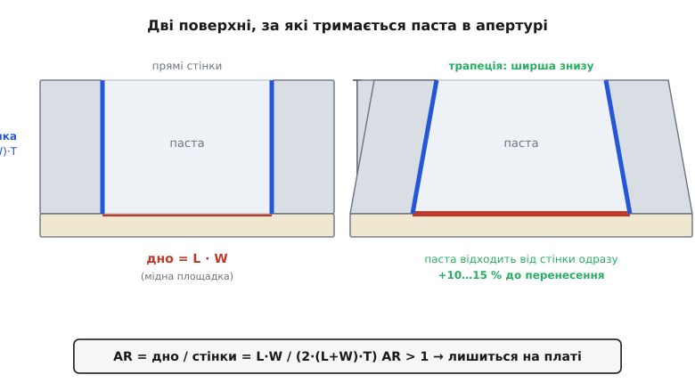
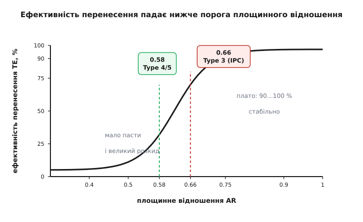

# 🧮 Площинне відношення: чому паста лишається на площадці, а не в трафареті

У головній статті ми сказали коротко: «дуже дрібні деталі й тісні площадки друкуються погано — паста або не пролазить, або лишається у трафареті». Це правильно, але це ще не пояснення — це наслідок. Пояснення живе в одному числі, яке інженер трафарету рахує для кожного найдрібнішого вікна ще до того, як лазер його виріже. Число зветься **площинне відношення** (*area ratio*, AR), і воно з точністю до кількох відсотків передбачає, скільки пасти реально ляже на площадку. Тут ми виведемо його не як формулу з довідника, а з простого силового балансу — бо коли видно, звідки береться дріб, стає очевидним і поріг 0.66, і чому дрібніша паста його зсуває, і чому єдиний важіль у руках конструктора — товщина трафарету.

## Паста застрягла між двох поверхонь

Уяви одне вікно трафарету в мить, коли ракель уже пройшов. Вікно заповнене пастою — це прямокутна цеглинка припою в клейкому флюсі. Знизу вона торкається **мідної площадки** на платі, з боків — **стінок вікна** в металі трафарету. Через секунду трафарет піднімуть вертикально вгору. Паста мусить зробити вибір: поїхати вгору зі стінками або лишитися внизу на площадці. Куди вона поїде — вирішує не «хотіння» пасти, а те, за яку поверхню вона тримається сильніше.

А тримається паста за поверхню силою прилипання (адгезією), і ця сила — приблизно **пропорційна площі контакту**. Це головна фізична передумова всього виведення, тож варто зупинитися, чому так. Флюс змочує метал: між пастою й міддю (і між пастою й стінкою) виникає тонкий шар, який тримається молекулярним притяганням. Що більший клаптик поверхні змочено — то більше таких зчеплень працює паралельно, то більша сумарна сила відриву. Подвоїш площу — подвоїш силу. Тому силу прилипання до будь-якої поверхні можна записати як питому силу на одиницю площі (назвімо її *τ*, вона однакова для дна й стінок, бо метал і флюс ті самі) помножену на площу цього контакту:

```
F_прилипання = τ · S
```

Тепер порахуймо обидві площі для прямокутного вікна з довжиною L, шириною W і глибиною T (T — це товщина трафарету, бо вікно проходить його наскрізь).

**Площа дна** — це просто прямокутник площадки, який паста накриває:

```
S_дно = L · W
```

**Площа стінок** — це бічна поверхня цеглинки, чотири стінки. Дві стінки завдовжки L і заввишки T, дві завдовжки W і заввишки T:

```
S_стінки = 2·L·T + 2·W·T = 2·(L + W)·T
```

Ось і всі дійові особи. Паста лишиться на платі (друк вдався), якщо тримається за дно сильніше, ніж за стінки:

```
τ · S_дно  >  τ · S_стінки
```

Питома сила *τ* стоїть з обох боків і скорочується — і це найважливіший момент усього виведення. Хімія флюсу, змочуваність, гладкість металу — усе, що ховається в *τ*, з нерівності зникає. Лишається **чиста геометрія**:

```
S_дно  >  S_стінки
```

> 🔧 **Навіщо це.** Саме через це скорочення DFM-правило можна записати одним числом, не знаючи ні марки пасти, ні матеріалу трафарету. Умова «паста лишиться внизу» звелася до порівняння двох площ — а площі рахуються з креслення. Тому інженер трафарету оцінює друкованість вікна ще до того, як його виготовлено: йому не треба нічого паяти, щоб побачити приреченість.

## Відношення, яке все вирішує

Перепишімо нерівність як відношення — поділимо площу дна на площу стінок. Цей дріб і є площинне відношення:

```
        S_дно        L · W
AR =  ───────── = ─────────────
      S_стінки    2·(L + W)·T
```

Умова вдалого друку тепер гранично проста:

```
AR > 1   →   паста тримається за дно сильніше → лишається на платі
AR < 1   →   паста тримається за стінки сильніше → їде вгору з трафаретом
```


*Паста в апертурі затиснута між дном (червона мідна площадка, площа L·W) і чотирма стінками (сині, сумарна площа 2·(L+W)·T). Куди вона поїде при підйомі трафарету, вирішує, котра площа більша. Праворуч — той самий переріз, але стінки похилені назовні: ширше дно й миттєвий відрив дають плюс до перенесення.*

Розберімо, як AR поводиться, бо в цьому вся інтуїція. Чисельник L·W росте як **площа** вікна — квадратично з розміром. Знаменник 2·(L+W)·T росте як **периметр**, помножений на товщину — лінійно з розміром. Тому у великого вікна дно легко перемагає стінки: площа обганяє периметр. А в дрібного вікна периметр і глибина беруть гору — стінок відносно багато, дна мало, паста «обіймає» стінки всім боком і їде з ними. Це та сама причина, чому дрібні краплі води тримаються купи, а великі калюжі розтікаються: у малих об'єктах поверхня домінує над об'ємом. Тут — стінка домінує над дном.

Корисно побачити це на квадратному вікні (L = W = a), де формула згортається до наочного вигляду:

```
       a · a        a²        a
AR =  ─────────  =  ───── =  ─────
      2·(2a)·T      4aT       4T
```

Для квадрата площинне відношення — це просто чверть від відношення сторони до товщини. Хочеш AR = 1 на квадратному вікні — зроби сторону вчетверо більшою за товщину трафарету. Апертура 0.30 мм крізь трафарет 0.10 мм дає AR = 0.30/(4·0.10) = 0.75. Зменши сторону до 0.20 мм — і AR падає до 0.50: те саме вікно, той самий трафарет, а паста вже приречена лишитися всередині.

## Чому поріг не 1.0, а 0.66

Виведення дало красивий рубіж AR = 1, але на реальному конвеєрі паста починає нормально друкуватися вже при AR помітно меншому за одиницю — індустрія орієнтується на **0.66**. Чому межа з'їхала вниз, і звідки саме таке число?

Наша модель була навмисно чиста: «тримається за дно сильніше — лишається». Реальність додає три речі, що допомагають пасті відірватися від стінок ще до того, як дно формально переможе. По-перше, трафарет піднімають **вертикально**, і сам рух зриву працює на відділення від стінок — стінки ковзають угору вздовж пасти, а не тягнуть її. По-друге, стінки полірують (електрополіруванням), навмисне роблячи *τ* стінки **меншим** за *τ* дна, — а ми в моделі вважали їх рівними; насправді дно чіпляє трохи міцніше, ніж каже гола геометрія. По-третє, флюс липкий, і паста радше **рветься** по собі, лишаючи частину на площадці, ніж чисто злітає вся. Усе це зміщує практичний поріг нижче теоретичної одиниці.

Але 0.66 — не результат розрахунку цих поправок, і чесно сказати про це прямо. Це **емпіричне** число: його вивели не з формули, а з масиву реальних вимірів. Ставлять сотні вікон із різним AR, друкують, зважують кожен відбиток і будують криву **ефективності перенесення** (*transfer efficiency*, TE) — скільки відсотків розрахункового об'єму пасти реально лягло:

```
                об'єм пасти, що ліг на площадку
TE = ───────────────────────────────────────────── · 100%
      об'єм апертури (L · W · T, скільки мало б лягти)
```

Крива виходить характерна. При великому AR (десь від 0.8) TE тримається біля 90–100 % і майже плоска — пасти лягає скільки треба, від вікна до вікна однаково. Униз від приблизно 0.66 крива **круто завалюється**: TE падає до 70–80 % і, що гірше, стає **розкидана** — сусідні однакові вікна дають то 80 %, то 40 %.


*Скільки відсотків пасти реально лягає залежно від площинного відношення. Праворуч від коліна — плато: багато й стабільно. Ліворуч крива валиться, і головна біда не сам спад, а розкид: пороги 0.66 (Type 3) і 0.58 (дрібніша Type 4/5) проводять там, де стабільність ще прийнятна.*

За стандартом [IPC-7525 (галузевий звід на проєктування трафаретів)](root:hw-pcb/footprint-design) 0.66 узяли як робочу межу саме тому, що це коліно кривої: вище — друк передбачуваний, нижче — і мало, і нестабільно. А нестабільність гірша за брак: якби всі вікна давали рівно 60 %, це компенсували б товщиною; але коли розкид великий, на одній площадці пасти доста, на сусідній — голод, і саме звідти беруться пропуски й надгробки, про які йшлося в темі.

> 🔧 **Навіщо це.** Розрізняй два числа. AR = 1 — це фізичний рубіж нашої моделі, «дно нарешті перемогло стінки». 0.66 — це інженерний поріг з практики, «нижче не гарантуємо стабільний друк». Модель пояснює, ЧОМУ поріг узагалі існує й де він приблизно; вимір каже, ДЕ саме його провести для реального процесу. DFM спирається на друге, але без першого воно було б магічним числом із таблиці.

## Звідки береться 0.58 для дрібнішої пасти

Тепер найтонше місце брифу. Паста Type 3 хоче AR ≥ 0.66, а Type 4 і Type 5 дозволяють спуститися до **0.58** — тобто дрібнішою пастою можна друкувати вужчі вікна. Наше площинне виведення цього не пояснює: у формулі AR немає розміру кульок припою взагалі. Отже, працює **інший**, незалежний механізм — і його теж треба зрозуміти, бо саме він визначає, чи взагалі можна застосувати площинну умову.

Паста — не суцільна рідина, а **зернистий** матеріал: дрібні кульки припою у флюсі. І крізь вузьке вікно ця зернистість дається взнаки. Тут вступає правило, яке інженери називають **правилом п'яти кульок** (*five-ball rule*): щоб паста нормально проходила крізь апертуру й чисто відділялася, найменший розмір вікна має вміщати **щонайменше п'ять** найбільших кульок припою в ряд.

Чому саме поперек кульки складаються у стінку, яка заважає пасті випасти. Дві кульки біля протилежних стінок плюс кілька між ними — і вони заклинюються, як камені в арці, спираючись одна на одну й на стінки. Флюс уже не може винести їх униз: вузьке вікно «мостить» пробкою з кульок і лишається напівпорожнім. П'ять — емпіричний мінімум, за якого арка ще не тримає: кульок замало, щоб надійно перекрити проліт, і паста випадає на площадку. Менше п'яти — ризик мосту росте лавиною.

Тепер порахуймо, що це дає в мікрометрах. Розміри кульок стандартизує [J-STD-005 (специфікація на паяльну пасту)](root:hw-pcb/reflow-soldering); візьмімо найбільші кульки кожного типу, бо саме вони визначають арку (тут дані слушні за станом на 2026 рік, звірені за таблицями постачальників припою):

```
Type 3:  зерно 25–45 мкм   →  D_max ≈ 45 мкм  →  5·D = 225 мкм
Type 4:  зерно 20–38 мкм   →  D_max ≈ 38 мкм  →  5·D = 190 мкм
Type 5:  зерно 15–25 мкм   →  D_max ≈ 25 мкм  →  5·D = 125 мкм
```

Ось звідки виграш. Дрібніша паста дозволяє фізично **вужче** вікно, перш ніж кульки почнуть мостити: Type 4 проходить крізь вікно 0.19 мм, Type 5 — крізь 0.125 мм, тоді як Type 3 клинить уже на 0.225 мм. А коли можна робити вужчі вікна тим самим трафаретом, знаменник AR (він містить периметр) поводиться поблажливіше, і практичний поріг стабільного друку зсувається з 0.66 до **0.58** — це теж емпіричне коліно кривої TE, але вже зняте на дрібній пасті, де зернистість менше псує відрив. Правило п'яти кульок і площинне відношення — **дві різні умови**, які вікно мусить пройти обидві: одна каже «кульки пролізуть і не змостяться», друга — «паста відліпиться від стінок на площадку».

> 🔧 **Навіщо це.** Не змішуй ці два числа в одну купу. 0.66 vs 0.58 — це зсув **площинного** порогу, наслідок того, що дрібніша паста дає менший розкид TE. А 225 vs 125 мкм — це **інша** межа, мінімальна ширина вікна з правила п'яти кульок. Дрібніша паста послаблює обидві межі одразу, тому фраза «Type 4 для дрібного кроку» насправді містить два незалежні полегшення. Але дрібніша паста дорожча й гірше зберігається — тому беруть найгрубішу, яка ще проходить твоє найдрібніше вікно, а не найдрібнішу «про запас».

## Стінки насправді не прямовисні

Досі ми рахували вікно як ідеальну прямокутну призму: чотири прямовисні стінки, площа кожної рівно L·T або W·T. Реальне вікно, вирізане лазером, — не таке. Промінь трохи розходиться донизу (або наладнаний навмисне), і вікно виходить **трапецієподібним у перерізі**: вужче зверху, ширше знизу. Ця, здавалося б, дрібниця працює прямо на користь друку — і наше виведення показує, чому.

Розглянь стінку в перерізі. Якщо вона нахилена назовні на кут *α* від вертикалі, то паста при вертикальному підйомі трафарету **одразу відходить** від неї: щойно цеглинка рушила вгору хоч на волосину, між нею й похилою стінкою утворюється клин порожнечі, контакт зривається миттю. У прямовисної стінки паста ковзає вздовж усієї глибини T, тручись об неї весь шлях; у похилої — відліплюється відразу. Плюс до того, ширше дно означає більшу S_дно при тій самій S_стінки згори: чисельник AR трохи виграє, знаменник трохи програє — і те, й те штовхає відношення вгору. На практиці трапецієподібна апертура (ширша знизу) піднімає ефективність перенесення на **10–15 %** проти прямостінної — і це один із головних прийомів для найдрібніших вікон.

Зворотний бік монети — якщо стінка похилена **не туди** (вужче знизу, ширше зверху, як буває від зношеного лазера або поганого налаштування), паста при підйомі **защемлюється**: стінка нависає над нею й тягне вгору. Тоді все навпаки — TE падає, вікно недодає пасти. Тому інженер трафарету дбає не лише про розмір вікна, а й про **знак нахилу**: назовні донизу — добре, всередину — погибель. Це та деталь, яку площинна формула в чистому вигляді не ловить (вона знає лише L, W, T), і саме тому реальний поріг 0.66 містить у собі й невеликий подарунок від правильного нахилу.

## Єдиний важіль у руках конструктора

Дивлячись на формулу AR = L·W / (2·(L+W)·T), спитаймо чесно: що з трьох величин конструктор плати може змінити? L і W — **не може**: їх диктує деталь. Крок ніжок QFN, розмір термалпаду під мікросхемою, посадкове місце резистора 0201 — усе це задано корпусом, і звузити площадку означало б спаяти гірше або взагалі не спаяти. Отже, чисельник L·W заморожений реальністю деталей.

Лишається **T — товщина трафарету**. І це справді єдиний вільний важіль, причому потужний: T стоїть тільки в знаменнику, тож тонший трафарет **прямо** піднімає AR усіх вікон одразу. Порахуймо на квадратному вікні 0.25 мм:

```
трафарет 0.127 мм (5 mil):  AR = 0.25 / (4·0.127) = 0.49   — приречено
трафарет 0.100 мм (4 mil):  AR = 0.25 / (4·0.100) = 0.63   — на межі
трафарет 0.080 мм (3 mil):  AR = 0.25 / (4·0.080) = 0.78   — впевнено
```

Те саме вікно, та сама деталь — а перехід від 5 mil до 3 mil трафарету перевів приречене вікно в надійне. Але тут ховається компроміс, який робить DFM цікавим, а не механічним. Об'єм пасти — це L·W·**T**: тонший трафарет дає менше пасти **всюди**. Для дрібної ніжки QFN це рятунок (їй багато й не треба), а от для сусіднього роз'єму живлення чи великого термалпаду тонкого шару пасти **замало** — з'єднання вийде голодне, механічно кволе. Один трафарет не може бути водночас тонким для дрібного й товстим для великого.

Саме звідси народжується **ступінчастий трафарет** (*step stencil*) — трафарет змінної товщини: тонший на ділянці з найдрібнішими вікнами, товщий там, де сидять великі компоненти. Локально стоншуючи метал під проблемною мікросхемою, ти піднімаєш її AR над порогом, не обкрадаючи решту плати. Це прямий інженерний висновок із формули: якщо AR можна крутити тільки товщиною, а товщину хочеться різну в різних місцях — зроби її різною. Ступінька коштує грошей (складніший трафарет), тому її замовляють точково, лише коли розрахунок AR показує, що суцільний трафарет одної товщини не задовольняє всіх вікон одразу.

## Складаємо докупи: як пройти вікно наскрізь

Отже, чи ляже паста на дане вікно — це не одне число, а послідовність перевірок, кожна з яких випливає з окремої фізики. Пройдімо їх по черзі, як робить інженер трафарету:

```
Дано вікно L × W, трафарет T, обрана паста (Type 3/4/5):

  1. Правило 5 кульок:  min(L, W) ≥ 5 · D_max(паста)?
       — ні → кульки змостять вікно; узяти дрібнішу пасту або ширше вікно
  2. Площинне відношення:  AR = L·W / (2·(L+W)·T)
  3. Поріг за пастою:  AR ≥ 0.66 (Type 3)  або  ≥ 0.58 (Type 4/5)?
       — ні → стоншити трафарет T (аж до ступінчастого) або дрібніша паста
  4. Знак нахилу стінки:  вікно ширше знизу (трапеція назовні)?
       — так → бонус +10–15 % до TE; ні → защемлення, переробити трафарет
```

**Умова.** Термалпад QFN 0.24 × 0.24 мм, трафарет 0.12 мм, паста Type 4 (D_max ≈ 38 мкм).

```
1. 5 кульок:  min(0.24, 0.24) = 240 мкм ≥ 5·38 = 190 мкм        ✓ (проходить)
2. AR = (0.24 · 0.24) / (2 · (0.24 + 0.24) · 0.12)
      = 0.0576 / (2 · 0.48 · 0.12)
      = 0.0576 / 0.1152
      = 0.50
3. Поріг Type 4 = 0.58.   0.50 < 0.58                            ✗ (не проходить)
```

Правило кульок вікно пройшло (240 > 190 мкм — арки не буде), а от за площинним відношенням воно провалилося: 0.50 замало навіть для дрібної пасти. Формула одразу підказує лік — крутити можна тільки T. Щоб дотягти AR до 0.58 при незмінному вікні:

```
T_треба = L·W / (2·(L+W)·AR) = 0.0576 / (2 · 0.48 · 0.58) = 0.103 мм
```

Стоншивши трафарет із 0.12 до 0.10 мм (тобто локальною ступінькою під цією мікросхемою, щоб не обкрасти пастою решту плати), піднімаємо AR цього вікна до ≈ 0.60 — над порогом. Ось повний ланцюг DFM у мініатюрі: побачив приречене вікно **на кресленні** (не на браку!), зрозумів із формули єдиний доступний важіль, застосував ступінчастий трафарет точково. Жодної спаяної плати не знадобилося, щоб це передбачити, — і в цьому вся сила того, що одне відношення площ вирішує, лишиться паста внизу чи поїде вгору.
