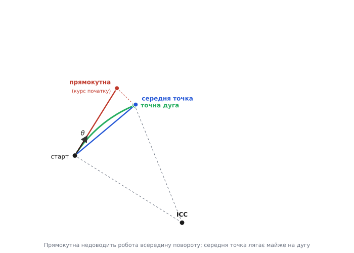
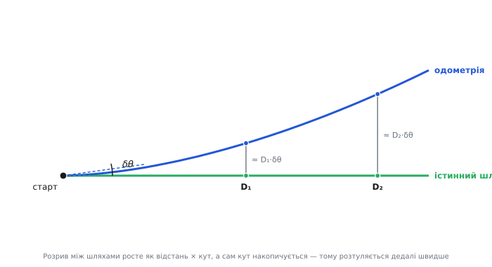

# Кінематика диференціального приводу — детально

<preknowlist>
- [Синус і косинус](book:math/sine-cosine) — проєкція відрізка на осі через кут; мала-кутові наближення sin θ ≈ θ, cos θ ≈ 1.
</preknowlist>

У базовому кроці ми вивели серце диференціального приводу: дві швидкості коліс через жорстку геометрію осі стають поступальною v і кутовою ω швидкістю корпуса, а ті, накопичені в часі, стають позою (x, y, θ). Ми зробили це швидко — додали й відняли два рівняння, отримали формули, написали цикл прошивки. Для «поїхати й повернути» цього досить.

Але за кожним із тих кроків ховається другий шар, який на практиці і вирішує, поїде ваш робот туди, куди наказано, чи ні. **Чому** саме ω однакова для всього корпуса, а не тільки для коліс? Формула пози, яку ми написали (крок уперед, тоді доворот), — це наближення; яке саме, наскільки грубе й коли воно розсипається на крутій дузі? Звідки взагалі береться число «пройдений шлях колеса», перш ніж потрапити у формулу, — і які дві похибки в цьому числі псують одометрію найдужче? І коли команда просить більше, ніж мотори можуть, — як зрізати швидкості, щоб робот сповільнився, але не збився з траєкторії?

Ця стаття розгортає кожне з цих питань до дна. Ми виведемо кінематику не з готового рисунка, а з двох механічних обмежень на колесо; побудуємо **точне** інтегрування дуги й порівняємо його з тим наближенням, що в базовому коді; простежимо шлях числа від валу мотора до формули з усіма множниками; і розберемо, як похибка курсу математично роз'їдає координату. Наприкінці подивимось, де межа самої моделі — на гусеничному шасі, яке порушує її свідомо.

## Колесо як обмеження: звідки насправді беруться v і ω

У базовому кроці ми прийняли на віру, що обидва колеса обертаються навколо спільного центра ICC з однаковою кутовою швидкістю, і з цього вивели формули. Це правда, але це наслідок, а не вихідний факт. Копнімо глибше: що взагалі дозволено колесу робити, а що заборонено, — і побачимо, як v і ω випливають самі, без жодного припущення про спільний центр.

Колесо, що стоїть вертикально й котиться по підлозі, скуте двома незалежними механічними умовами. Перша — **кочення без проковзування вздовж**: точка контакту в мить дотику не ковзає вперед-назад, тож лінійна швидкість обода в напрямку кочення точно дорівнює тому, що «намотує» обертання, r·φ̇ (радіус колеса на кутову швидкість його валу). Друга, і про неї часто забувають, — **відсутність бокового ковзання**: звичайне колесо не вміє їхати вбік, перпендикулярно своїй площині. Ролик під візком крамниці — вміє; колесо ровера — ні. Ця друга умова і є та невидима рука, що змушує робота повертати саме так, а не інакше.

> 🔧 **Навіщо це.** Заборона бокового ковзання — не абстракція, а те, що ви фізично відчуваєте, штовхаючи вимкнений ровер убік: він упирається. У прошивці ця сама заборона означає, що вам **не треба** окремо задавати «бічну швидкість» — її просто не існує в моделі, і весь рух описується всього двома числами (v, ω) замість трьох. Уся економія диференціального керування росте з цього обмеження.

Тепер формалізуймо. Плаский рух твердого тіла в кожну мить повністю описують три числа: швидкість якоїсь опорної точки корпуса (два складники, уздовж і впоперек) плюс кутова швидкість ω, з якою тіло провертається. Візьмімо за опорну точку середину осі й поставимо в неї систему координат корпуса: вісь **вперед** (куди дивиться робот) і вісь **вбік** (уздовж осі коліс, праворуч). У цих осях швидкість середини осі — це (v_вперед, v_вбік), а корпус іще й крутиться з ω.

Ключова властивість твердого тіла: якщо ви знаєте швидкість однієї його точки й кутову ω, ви знаєте швидкість **будь-якої** іншої точки. Точка, зміщена від опорної на вектор (a вперед, b вбік), рухається зі швидкістю опорної **плюс** внесок обертання ω навколо опорної. Обертання з кутовою ω додає точці, що лежить на відстані-плечі від центра, лінійну швидкість ω, спрямовану **перпендикулярно** плечу. Для точки, зсунутої на b убік від середини осі, це плече b дає додаткову швидкість ω·b **вперед**; для точки, зсунутої на a вперед, — швидкість ω·a **вбік** (з протилежним знаком). Запишімо швидкість кожного колеса — вони обидва лежать на самій осі, тобто зсунуті тільки вбік, ліве на −L/2, праве на +L/2:

```
праве колесо (зсув +L/2 убік):
   вперед:  v_вперед + ω·(L/2)
   вбік:    v_вбік

ліве колесо (зсув −L/2 убік):
   вперед:  v_вперед − ω·(L/2)
   вбік:    v_вбік
```

І ось тут вступає друга умова — заборона бокового ковзання. Вона каже: **бічний складник швидкості кожного колеса дорівнює нулю**. Дивимось на рядки «вбік»: обидва дорівнюють v_вбік. Прирівнюємо до нуля — і одразу маємо

```
v_вбік = 0
```

Тобто сама заборона бокового ковзання **вимагає**, щоб середина осі рухалася строго вперед, ніколи не вбік. Ось звідки береться те, що положенням робота ми вважаємо саме середину осі й що корпус їде «туди, куди дивиться»: не з нашого вибору, а з механіки колеса. Три ступені вільності плаского руху ця умова обрізає до двох: лишаються тільки v_вперед (яку далі звемо просто v) і ω. Саме тому диференціальний робот — **неголономна** система: він рухається на площині, що має три виміри (x, y, θ), але в кожну мить може розганятися лише у двох із них; дістатися будь-якої точки він годен, але не будь-яким шляхом — боком не проїде.

> Слова «голономний» і «неголономний» увів Генріх Герц у «Принципах механіки» (*Die Prinzipien der Mechanik*, 1894), від грецького *hólos* — «увесь, цілий» + *nómos* — «закон»: голономна умова зводиться до закону на самі координати (проінтегрувалася в обмеження положення), неголономна — лише на швидкості й не інтегрується. Заборона бокового ковзання — хрестоматійний приклад неголономної умови: вона забороняє миттєвий боковий рух, але не забороняє **потрапити** вбік — розворотами й дугами робот дістанеться будь-куди. *(Усталений історичний факт; Герц — німецький фізик, народжений у Гамбурзі.)*

Друга умова дала нам, чого робот НЕ може. Перша — кочення без проковзування вздовж — дає, як його «вперед» пов'язане з обертами валів. Кожне колесо котиться вперед зі своєю лінійною швидкістю обода: праве v_R = r·φ̇_R, ліве v_L = r·φ̇_L (радіус колеса на кутову швидкість вала). Підставмо їх у рядки «вперед» вище:

```
v_R = v + ω·(L/2)
v_L = v − ω·(L/2)
```

Це вже знайома пара — але тепер вона не постульована з рисунка ICC, а **виведена** з двох обмежень на колесо. Розв'язуємо її відносно v і ω (додати й відняти — як у базовому кроці):

```
v = (v_R + v_L) / 2
ω = (v_R − v_L) / L
```

Ті самі дві формули прямої кінематики — але тепер видно їхнє коріння. Однаковість ω для всього корпуса, з якої в базовому кроці все починалося, тут з'явилась сама: ω — це властивість твердого тіла, одна на все тіло за означенням, а не окрема примха коліс. А спільний центр ICC — просто та точка, де повний швидкісний вектор корпуса перетворюється на нуль: підставте туди зсув, за якого і «вперед», і «вбік» гасяться, і дістанете рівно R = v/ω убік від середини осі. ICC — не причина повороту, а його геометрична **тінь**.

## Точна дуга проти прямокутного кроку: як насправді рухати позу

Тепер до інтегрування пози — і тут ховається найтонше місце всієї кінематики. У базовому кроці ми оновлювали позу так: спроєктували крок уперед Δs за **поточним** курсом θ, тоді довернули курс на Δθ. Це працює, ми навіть застерегли, що воно наближене. Розгорнімо, **чому** воно наближене й **наскільки**, — бо на крутих дугах різниця стає відчутною, а виправлення коштує один рядок коду.

Придивімось, що робот справді робить за малий крок Δt, коли обидві швидкості сталі. Ми щойно з'ясували: він рухається строго вперед і водночас крутиться з ω. «Прямо вперед, весь час дещо довертаючись» — це і є рух по **дузі кола** сталого радіуса R = v/ω. Не по прямій, потім поворот; а по гладкій дузі, де курс змінюється **неперервно** протягом усього кроку. Базова схема бере курс сталим (значення на початку кроку) і лише наприкінці доверне — тобто підміняє дугу її хордою-дотичною. За малесенької дуги хорда майже збігається з дугою, похибка дрібна; за помітної — вилазить.

Виведімо точний зсув за дугу — це чиста геометрія кола. За крок курс змінюється з θ на θ + Δθ, робот проходить дугою довжину Δs, а радіус дуги R = Δs/Δθ. Центр дуги (той самий ICC) лежить перпендикулярно курсу на відстані R. Зсув по прямій між початком і кінцем дуги — це хорда; спроєктуймо її на світові осі. Акуратна тригонометрія кола дає точні прирости:

```
Δθ = (Δs_R − Δs_L) / L
R  = Δs / Δθ                        (радіус дуги за цей крок)

Δx = R · ( sin(θ + Δθ) − sin θ )    точний зсув по осі X
Δy = R · ( −cos(θ + Δθ) + cos θ )   точний зсув по осі Y
```

Ці два рядки — **точне** оновлення координати за будь-яку дугу сталої кривини, хоч за півкола. Курс же оновлюється просто: θ += Δθ. Порівняймо з базовою «прямокутною» схемою (Δx = Δs·cos θ, Δy = Δs·sin θ): різниця в тому, що точна формула розмазує поворот по всьому кроку, а прямокутна робить увесь крок під одним кутом. Є й золота середина — узяти курс **посередині** кроку, θ + Δθ/2:

```
Δx = Δs · cos(θ + Δθ/2)     схема середньої точки
Δy = Δs · sin(θ + Δθ/2)
```

Три схеми — і варто чітко бачити, як росте їхня похибка з розміром кроку Δθ. Прямокутна (курс на початку) хибить у **першому** порядку по Δθ: половину кроку вона їде під уже застарілим курсом. Схема середньої точки хибить у **другому** порядку — бере курс саме там, де він у середньому за крок, і перша поправка гаситься; це, по суті, метод Рунге — Кутти 2-го порядку для нашої дуги. Точна дугова формула не хибить узагалі (доки самі v, ω сталі в межах кроку). Практичний висновок прямий: за типового керуючого циклу в кілька мілісекунд і скромних ω різниця мізерна, і прямокутна схема цілком годиться; але на повільному циклі, на крутих розворотах чи коли одометрію інтегрують нечасто — беріть щонайменше середню точку, бо вона коштує рівно стільки ж (два виклики тригонометрії), а похибка на порядок менша.


*За крок робот іде дугою, а не прямою. Прямокутна схема підміняє дугу дотичною під початковим курсом і систематично недоводить робота всередину повороту; схема середньої точки бере курс у середині кроку й лягає майже на дугу; точна формула йде по дузі. Що крутіша дуга й довший крок, то далі розходяться кінці.*

Є одна пастка, спільна для точної й «радіусної» форми: коли робот їде майже прямо, Δθ → 0, і в R = Δs/Δθ знаменник провалюється в нуль. Формально це не біда — границя існує й дорівнює прямому кроку, — але процесор поділить на майже-нуль і видасть сміття або NaN. Тому точну дугову формулу завжди захищають перевіркою: якщо |Δθ| нижче маленького порога, перемикайся на прямий крок (Δx = Δs·cos θ, Δy = Δs·sin θ). Схема середньої точки цієї болячки не має зовсім — у ній ніде не ділиться на Δθ, — і це ще один аргумент на її користь як розумного припущення за замовчуванням. Складімо це в код.

**Оновлення пози точною дугою із захистом від прямої.** Дано прирости шляху коліс за крок; оновити (x, y, θ) точною дуговою формулою, а на майже-прямому кроці — впасти на прямий крок, щоб не ділити на нуль.

```c
#include <math.h>

#define TRACK_WIDTH_M   0.185f    // L: колія, м
#define STRAIGHT_EPS    1e-4f     // поріг |Δθ|, нижче якого крок вважаємо прямим

typedef struct { float x, y, theta; } pose_t;

// ds_left, ds_right — пройдений шлях кожного колеса за крок, м
void odometry_update_exact(pose_t *p, float ds_left, float ds_right)
{
    float ds     = 0.5f * (ds_right + ds_left);           // крок уперед
    float dtheta = (ds_right - ds_left) / TRACK_WIDTH_M;  // приріст курсу

    if (fabsf(dtheta) < STRAIGHT_EPS) {
        // Майже пряма: дуга виродилась, беремо прямий крок за поточним курсом
        p->x += ds * cosf(p->theta);
        p->y += ds * sinf(p->theta);
    } else {
        // Точна дуга: радіус R = ds/dtheta, зсув по хорді через кути кінців
        float R  = ds / dtheta;
        float th2 = p->theta + dtheta;
        p->x += R * (sinf(th2)  - sinf(p->theta));
        p->y += R * (cosf(p->theta) - cosf(th2));
    }
    p->theta += dtheta;

    // Тримати курс у (−π, π]
    if (p->theta >  (float)M_PI) p->theta -= 2.0f * (float)M_PI;
    if (p->theta <= -(float)M_PI) p->theta += 2.0f * (float)M_PI;
}
```

Зверніть увагу: гілка «дуга» коштує чотири виклики тригонометрії проти двох у прямокутної — все одно копійки для мікроконтролера, і навіть це можна вполовинити, кешуючи cosf/sinf між кроками. Якщо ця економія колись стане критичною (наприклад, тисячі роботів у симуляції), беріть середню точку: два виклики, другий порядок точності, жодного ділення на Δθ. Для реального ровера різниця між цими трьома схемами майже завжди тоне під похибкою самих енкодерів — до якої ми зараз і дійдемо, бо саме вона, а не вибір інтегратора, визначає, наскільки одометрія бреше.

## Звідки береться «пройдений шлях колеса»: увесь ланцюг множників

Усі формули вище споживають на вході Δs_L і Δs_R — прирости шляху коліс у метрах. У базовому коді ми просто прийняли, що драйвер енкодера їх дає. Але саме тут, у перетворенні обертів валу в метри, і живуть головні систематичні похибки одометрії. Пройдімо весь ланцюг — від зубця енкодера до метра — з усіма множниками, бо кожен множник, узятий трохи неправильно, тихо викривляє траєкторію.

[Оптичний енкодер](book:electronics/optical-incremental-encoder) на валу видає **імпульси**: за повний оберт диска — фіксоване число N рисок (англ. *counts per revolution*, CPR); два зсунуті на чверть періоду канали (A і B) кодують іще й напрямок обертання, а їхній взаємний порядок дає квадратуру, з якої ми зараз витиснемо роздільність. Але вал енкодера здебільшого стоїть **до** редуктора (так точніше й дешевше), тож на один оберт самого колеса вал прокручується стільки разів, яке передавальне число редуктора g. І ще один множник ховається в тому, як лічильник рахує квадратуру. Енкодер віддає два зсунуті канали (A і B); дешеве рахування ловить фронти лише одного каналу, але апаратний квадратурний лічильник у мікроконтролері вміє рахувати **всі чотири** фронти обох каналів за період риски — це множить роздільність на 4 (англ. *4× quadrature*) і задарма вчетверо здрібнює крок відліку. Складімо повний ланцюг: скільки метрів шляху колеса припадає на один зафіксований відлік лічильника.

```
N   — рисок на оберт вала енкодера (CPR)
g   — передавальне число редуктора (обертів вала на 1 оберт колеса)
x4  — множник квадратури (1, 2 або 4 — скільки фронтів рахуємо за риску)
r   — радіус колеса, м  (довжина кола колеса = 2π·r)

відліків на один оберт КОЛЕСА:   N · g · x4
шлях колеса на один відлік:      k = 2π·r / (N · g · x4)   [м/відлік]

приріст шляху колеса за цикл:    Δs = k · (нове_число − старе_число)
```

Множник k (метрів на відлік) — це та єдина стала, що перекладає «мову лічильника» на метри; обчислюють її раз при налаштуванні шасі й далі тільки множать. Приклад робить масштаби відчутними.

**Скільки важить один відлік.** Колесо радіуса 32 мм, енкодер 12 рисок на оберт вала, редуктор 30:1, квадратура 4×. Знайти шлях на один відлік і скільки відліків набіжить за метр.

```c
// Дано:
//   r  = 0.032 м
//   N  = 12  (CPR вала)
//   g  = 30  (редуктор)
//   x4 = 4   (квадратура)
float k = 2.0f * 3.14159265f * 0.032f / (12.0f * 30.0f * 4.0f);
//        = 0.201062 / 1440
//        ≈ 1.3963e-4 м/відлік   (≈ 0.14 мм на відлік)

// За метр шляху колеса:
// 1 / k = 1440 / 0.201062 ≈ 7162 відліків/м
```

Приблизно 0.14 мм на відлік і понад сім тисяч відліків на метр — ось звідки береться дрібнозернистість одометрії: навіть куций 12-рисковий енкодер після редуктора й квадратури дає роздільність краще десятої частки міліметра. І водночас видно, де підстерігає біда: **k стоїть множником на кожному кроці**, тож будь-яка похибка в k (не точно виміряний радіус колеса, не той редуктор у специфікації) не гаситься, а лінійно накопичується у весь пройдений шлях.

Тепер про два найтяжчі гріхи — ті самі, що їх виявили й назвали Йоганн Боренштайн і Лян Фен у класичній роботі 1996 року про систематичні похибки одометрії (там же вони запропонували тест UMBmark — робот проходить квадрат за годинниковою й проти, і за розкидом кінцевих точок відділяють ці дві похибки). Гріх перший — **нерівні діаметри коліс**. Два колеса ніколи не однакові до мікрона: різний знос протектора, різне навантаження сплющує гуму, сам допуск виготовлення. Якщо праве колесо трішки більше за ліве, то за однакового числа обертів воно проходить трохи більший шлях — і робот, якому наказано їхати **прямо**, тихо викручує пологу дугу. Причому одометрія цього не помічає: у формулу v = (v_R+v_L)/2 закладено, що обидва k однакові; насправді вони різні, і в ω = (v_R−v_L)/L з'являється фальшива ненульова різниця. Гріх другий — **невірна колія L**. Її беруть із креслення, але реальна відстань між точками контакту гуми залежить від того, де саме широка шина торкається підлоги, як вона просіла під вагою. А L стоїть у знаменнику ω: візьміть її на кілька відсотків більшою за справжню — і кожен поворот робот **недокрутить** рівно на стільки ж відсотків, накопичуючи помилку курсу з кожним маневром.

> 🔧 **Навіщо це.** Ці дві похибки лікуються не кращим кодом, а **калібруванням**: реальні k_L, k_R і реальне L підганяють, ганяючи робота відомим шляхом і міряючи розбіжність. Виправлення нерівних діаметрів — це окремі множники k_L ≠ k_R для лівого й правого колеса; виправлення колії — поправковий коефіцієнт на L. Один раз відкалібрувати шасі за UMBmark — і систематичний дрейф падає в рази, безкоштовно, самою лише правкою трьох чисел у прошивці. Це найдешевше поліпшення точності, яке взагалі існує в колісному роботі.

## Насичення швидкостей: чому масштабуємо пару, а не ріжемо поодинці

У базовому коді ми вже зустріли `twist_to_wheels` із насиченням і сказали головне: коли команда просить більше, ніж мотори можуть, зрізати кожне колесо окремо — помилка, бо псується різниця, а з нею й поворот; правильно ділити обидва на спільний коефіцієнт. Тепер розгорнімо, **чому** саме так геометрично, і що робити, коли самого пропорційного масштабування замало.

Погляньмо на простір швидкостей коліс — площину, де по осях відкладені v_L і v_R. Мотори мають стелю: |v_L| ≤ v_max і |v_R| ≤ v_max. У цій площині множина досяжних пар (v_L, v_R) — **квадрат** зі стороною 2·v_max. А тепер згадаймо обернену кінематику: пара (v, ω) через v_R = v + ωL/2, v_L = v − ωL/2 — це просто інші координати тієї самої площини, повернуті на 45°. Вісь чистого «вперед» (ω = 0, v_L = v_R) іде діагоналлю квадрата; вісь чистого «повороту» (v = 0, v_R = −v_L) — іншою діагоналлю. Тобто **область досяжних команд (v, ω) — це квадрат, поставлений на кут (ромб)**: чим швидше хочеш їхати вперед, тим менший запас лишається на поворот, і навпаки. Коли ваша команда випадає за межі ромба — мотори фізично не можуть її виконати, і треба вибрати, чим пожертвувати.


*Область досяжних команд у координатах (v, ω) — це квадрат обмежень моторів, поставлений на кут. Пропорційне масштабування веде недосяжну команду по промені до центра — робот їде тією ж дугою, лише повільніше. Просте зрізання загнало б точку на грань квадрата збоку — це зберегло б v, але змінило ω, і робот з'їхав би з дуги.*

Тепер видно геометрію рішення. Недосяжна команда — точка поза ромбом. **Пропорційне масштабування** (поділити обидві швидкості на спільний коефіцієнт k = v_max/max(|v_L|,|v_R|)) тягне цю точку **по прямій до початку координат**, доки вона не сяде на межу. А рух по промені через центр у координатах (v, ω) означає, що **відношення v до ω лишається незмінним** — а це відношення і є радіус дуги R = v/ω. Отже, робот їде **тією самою дугою**, просто повільніше: траєкторія збережена, страждає лише темп. Натомість просте зрізання загнало б точку на найближчу **грань** квадрата збоку — а це змінило б співвідношення v і ω, тобто радіус, тобто дугу: робот з'їхав би з наказаної траєкторії. Ось точна причина, чому масштабуємо пару.

Але пропорційне масштабування — не єдина розумна політика, і вибір залежить від того, що для робота важливіше. Іноді курс святий (робот об'їжджає перешкоду, точний кут — питання зіткнення), а швидкість — ні. Тоді розумніше **зберегти ω** й пожертвувати v: обрізати поступальну складову так, щоб поворот лишився точним. Іноді навпаки — тримати задану v (їдемо в колоні, темп заданий згори), а поворот хай трохи прослабне. Пропорційне масштабування — золота середина, що жертвує обома порівну й тому зберігає дугу; але свідомий вибір «що недоторканне» дає керуванню тонший контроль. Складімо у код гнучкіший обмежувач.

**Насичення з вибором пріоритету.** Дано бажані (v, ω); повернути швидкості коліс у межах v_max, зберігаючи або дугу (пропорційно), або поворот (жертвуючи v).

```c
#define WHEEL_V_MAX  0.6f    // стеля лінійної швидкості колеса, м/с

typedef struct { float left, right; } wheel_speeds_t;

typedef enum { KEEP_ARC, KEEP_TURN } sat_policy_t;

wheel_speeds_t twist_to_wheels_ex(float v, float w, sat_policy_t pol)
{
    float half = 0.5f * w * TRACK_WIDTH_M;   // внесок повороту, ω·L/2

    if (pol == KEEP_TURN) {
        // Поворот недоторканний: спершу вписуємо саму «половинку» повороту,
        // тоді доливаємо стільки v, скільки лишилось запасу.
        if (half >  WHEEL_V_MAX) half =  WHEEL_V_MAX;
        if (half < -WHEEL_V_MAX) half = -WHEEL_V_MAX;
        float v_room = WHEEL_V_MAX - fabsf(half);   // залишок під поступальний рух
        if (v >  v_room) v =  v_room;
        if (v < -v_room) v = -v_room;
    }

    wheel_speeds_t out;
    out.right = v + half;
    out.left  = v - half;

    if (pol == KEEP_ARC) {
        // Дуга недоторканна: жоден не за стелю, масштабуємо ПАРУ разом.
        float m = fmaxf(fabsf(out.left), fabsf(out.right));
        if (m > WHEEL_V_MAX) {
            float k = WHEEL_V_MAX / m;
            out.left  *= k;
            out.right *= k;
        }
    }
    return out;
}
```

Лишається ще один рівень, про який мовчить чиста кінематика, — **прискорення**. Дві швидкості коліс можна вписати в стелю ідеально, але якщо між циклами вони стрибають ривком, мотори упруться в струмову межу, ремінь підскочить, а колесо — забуксує (і привіт, похибка одометрії, з якої ми почали). Тому поверх насичення за швидкістю кладуть **обмеження темпу зміни** (англ. *slew-rate limit*): за один цикл швидкість колеса не сміє мінятися більше ніж на задану дельту. Це вже не кінематика, а місток до динаміки — але без нього гарно порахована траєкторія розсипається на першому ж різкому маневрі, коли колесо зривається в проковзування.

## Як похибка курсу роз'їдає координату

У базовому кроці ми сказали головну правду про одометрію: вона добрий короткочасний здогад і безнадійний довгостроковий, а найпідступніша — похибка курсу θ, бо вона тягне за собою весь наступний шлях. Тепер покажімо це **кількісно** — бо одна річ знати, що курс важливий, і зовсім інша — бачити, з якою швидкістю дрібна помилка кута перетворюється на метри збоку.

Розділімо похибки за тим, як вони ростуть із пройденим шляхом. Похибка **пройденого шляху** (не точний k, легке проковзування вздовж) додає до координати помилку, що росте приблизно **пропорційно** шляху: проїхав удвічі далі — накопичив удвічі більший лінійний недоліт. Це неприємно, але передбачувано й повільно. Похибка **курсу** поводиться зовсім інакше, і гірше. Уявіть, що після якогось маневру ваш курс θ хибний на маленький кут δθ. Ви цього не знаєте й далі чесно проєктуєте кожен крок уперед — але **весь наступний шлях** лягає під кутом, зсунутим на δθ від правди. Проїхавши після цієї помилки ще відстань D, ви опинитесь збоку від справжнього положення приблизно на

```
бічне зміщення ≈ D · sin(δθ) ≈ D · δθ     (при малому δθ, у радіанах)
```

Тобто помилка курсу перетворюється на бічний промах, **помножений на всю пройдену після неї відстань**. Хиба в один градус (≈ 0.0175 рад) сама по собі мізерна — але через десять метрів шляху вона стає 10 · 0.0175 ≈ 0.17 м убік, майже два десятки сантиметрів з нічого. А головне, що помилки курсу **накопичуються самі**: кожен крок додає до θ крихітну випадкову похибку від дискретності енкодера й дрібного проковзування, вони не гасяться, і сумарний δθ повільно росте з числом кроків. Через це бічний дрейф одометрії росте не лінійно зі шляхом, а **швидше** — приблизно як шлях у степені півтора для чисто випадкових похибок курсу, бо довжина плеча D і сам накопичений кут δθ ростуть **разом**.


*Дрібна похибка курсу δθ не зникає — вона нахиляє весь подальший шлях. Бічний розрив між істинним і одометричним положенням росте як добуток пройденої відстані на кут; а що сам кут повільно накопичується з кожним кроком, розрив розтуляється дедалі швидше. Тому курс — найцінніше й найкрихкіше число одометрії.*

Звідси випливає, чому в серйозній навігації курс лікують **окремо й насамперед**. Гіроскоп ([IMU](root:embedded/imu-barometer)) міряє кутову швидкість напряму, незалежно від коліс, — і навіть недосконалий гіроскоп рятує одометрію рівно там, де вона найслабша, бо його похибка курсу не помножується на пройдений шлях так, як одометрична. Саме тому в парі «одометрія + гіро» одометрії лишають рахувати **відстань** (там вона сильна), а курс дедалі більше довіряють гіроскопу — і два потоки зводять [фільтром Калмана](root:embedded/kalman-filter), який знає, якому джерелу в якій компоненті вірити. Повне виведення того, як саме коваріація пози росте зі шляхом і чому саме курсова складова домінує, — у темі [інерціальна навігація](root:embedded/inertial-navigation): там та сама математика накопичення розписана для строба гіроскопа, але корінь спільний із нашим — інтеграл дрібних кутових похибок, помножений на плече руху.

## Де модель ламається за задумом: гусениці й ковзання коліс

Уся стаття стоїть на одній умові, яку ми на початку зробили каменем усього, — заборона бокового ковзання, з якої й вивелися дві швидкості (v, ω) замість трьох. Але існує цілий клас машин, де цю умову **свідомо порушують**, і кінематика диференціального приводу застосовується до них не точно, а як наближення, яке доводиться підправляти. Розібратися в цьому важливо, бо гусеничний ровер чи чотириколісний скід-стір — найпоширеніші наземні платформи, і наївне застосування наших формул на них систематично бреше.

Візьмімо **гусеничне** шасі. Гусениця — не одне колесо в точці, а довга опорна смуга, притиснута до ґрунту по всій довжині. Щоб таке шасі повернуло, зовнішня й внутрішня гусениці мусять їхати з різною швидкістю — поки що все як у нас. Але щоб корпус **провернувся**, гусениці змушені **ковзати вбік** відносно ґрунту по всій площі контакту: та сама заборона бокового ковзання, яку ми поклали в основу, тут фізично неможлива — довгий контакт не дає корпусу вільно обернутися без тертя ковзання. Тому гусеничний поворот — це завжди боротьба тяги проти бокового тертя, і реальна кутова швидкість виходить **меншою** за ту, що дає формула ω = (v_R − v_L)/L: частину «різниці швидкостей» з'їдає проковзування, яке формула не бачить.

Той самий ефект, слабший, живе й у **чотириколісному** роботі зі скід-стіром (англ. *skid-steer* — «поворот проковзуванням»), де замість двох коліс з кожного боку по два, жорстко зв'язані. Пара коліс на борту — це коротка «гусениця»: щоб корпус обернувся, передні й задні колеса мусять трохи ковзати вбік, бо вони рознесені вздовж і не можуть усі йти по концентричних дугах одного центра. Практичний наслідок: у скід-стіра «ефективна колія» в формулі ω — **не** фізична відстань між колесами; реальний поворот виходить кволішим, ніби колія більша. Тому інженери підставляють у ω не геометричне L, а **ефективну колію** L_eff, більшу за фізичну, — калібрувальний коефіцієнт, що вбирає в себе все це ковзання. Наша формула не викидається — вона лишається кістяком, але з чесно підігнаним під ковзання числом замість наївного геометричного.

> 🔧 **Навіщо це.** Практичний висновок для прошивки прямий: на гусеницях і скід-стірі **не** беріть L із креслення для одометрії — виміряйте L_eff калібруванням (ганяючи робота на відомий кут і підганяючи число, доки формула не зійдеться з дійсністю). І тримайте в голові, що одометрія на таких платформах систематично гірша за колісну: ковзання не просто додає шуму, воно **порушує саму модель**, тож зовнішнє джерело курсу (гіроскоп) тут не розкіш, а необхідність. Кінематика двоколісного диференціала лишається для них рідною мовою — але з поправкою на те, що ґрунт під гусеницею живе за іншими правилами.

Так замикається повне коло теми. Ми почали з двох механічних обмежень на колесо й вивели з них, що робот описується всього двома числами (v, ω); побудували точне інтегрування дуги й побачили, коли базове наближення досить, а коли ні; простежили число «шлях колеса» від зубця енкодера через редуктор і квадратуру до метра з усіма множниками, знайшовши там дві систематичні похибки, що лікуються калібруванням; розібрали, чому насичення масштабує пару швидкостей, а не ріже поодинці, і як похибка курсу помножується на весь подальший шлях. І нарешті побачили, де сама модель ламається — там, де колесо порушує свою головну заборону. Уся ця глибина служить одному: щоб потік (v, ω, поза), яким кінематика годує решту навігації, був не лише швидким, а й чесно розуміючим власні межі — бо на цей потік спираються всі верхні шари керування, до яких модуль переходить далі.
