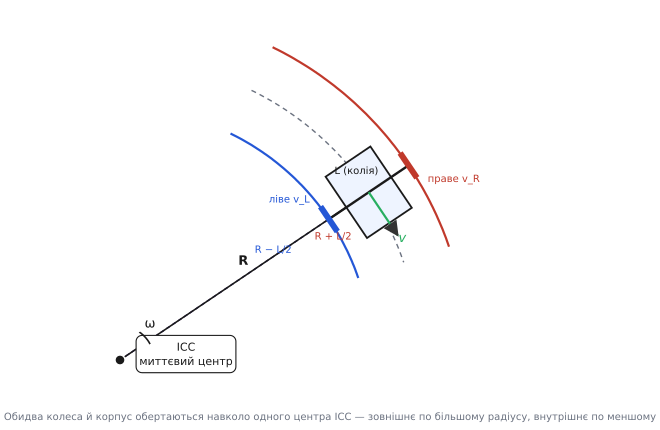
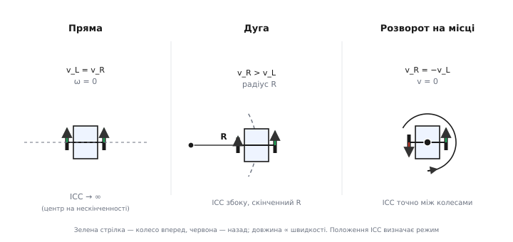

# Кінематика диференціального приводу

Ровер, який ми зібрали на попередньому кроці, не має ні керма, ні рейки, ні поворотної осі — самі лише два колеса на одній осі, кожне зі своїм мотором. І все ж він повертає. Крутиться на місці, виписує дуги, їде рівно — усе це виходить із єдиної речі: **різниці швидкостей двох коліс**. Звідси й назва приводу — **диференціальний** (лат. *differentia* — різниця, від *dis-* «нарізно» + *ferre* «нести»): напрямок задається не окремим кермом, а тим, наскільки одне колесо випереджає інше.

Це не просто зручний спосіб керувати. Це означає, що весь рух робота — куди він їде і як швидко обертається — однозначно випливає з двох чисел, які ми й так задаємо моторам: швидкості лівого колеса й швидкості правого. А якщо на кожному колесі стоїть [енкодер](topic:hw-sensing/optical-incremental-encoder), то ці ж два числа можна не тільки **задавати**, а й **читати** — і тоді робот сам рахує, де він опинився, не маючи жодного зовнішнього орієнтира. Уся ця стаття — про те, як від двох швидкостей коліс дійти до руху корпуса, а від нього — до координати робота на підлозі.

> 🔧 **Навіщо це.** Кінематика диференціального приводу — це міст між двома світами прошивки, які інакше не стикуються. З одного боку — контур [ПІД](root:embedded/calculus-for-pid), що вміє тримати задану швидкість **кожного колеса** окремо. З іншого — команда згори: «їдь уперед 0.4 м/с і повертай ліворуч зі швидкістю 30°/с». Перекласти таку команду в дві швидкості коліс (і навпаки — зі швидкостей коліс дізнатися, куди насправді їде корпус) — саме те, що робить кінематика. Без неї у вас є два незалежні мотори, але немає робота.

## Чому взагалі виникає поворот

Почнімо з найпростішого й найдивнішого питання: чому робот повертає, якщо жодна деталь у ньому не «повертається» навмисне? Відповідь — у жорсткій геометрії.

Два колеса насаджені на спільну вісь, а вісь жорстко закріплена в корпусі. Відстань між точками контакту коліс із підлогою — величина стала; назвемо її **колією** (англ. *track width*) і позначимо L. Це число не міняється, хоч би що робили мотори.

Тепер уявімо, що ліве колесо котиться повільніше за праве. Кожне колесо, поки воно котиться без проковзування, змушене проходити рівно той шлях, який «відмотує» його обертання: швидше колесо проходить більше, повільніше — менше. Але вони скуті однією віссю сталої довжини. Дві точки, що проходять різні дуги за той самий час і при цьому весь час лишаються на незмінній відстані одна від одної, — це геометрично можливо лише в один спосіб: обидві точки обертаються навколо **одного спільного центра**. Швидше колесо просто йде по дузі більшого радіуса, повільніше — меншого, а корпус між ними повертається.

Цей спільний центр обертання називають **миттєвим центром кривини** (англ. *instantaneous center of curvature*, ICC) — «миттєвим», бо в кожну мить він свій: щойно зміняться швидкості коліс, центр стрибне в нове місце. У цю конкретну мить робот рухається так, ніби його намертво прив'язали тросом до ICC і закрутили навколо нього.


*Джерело повороту — одна геометрична вимога: два колеса на жорсткій осі мусять обертатися навколо спільного центра. Швидше колесо йде по зовнішній дузі, повільніше — по внутрішній; корпус посередині обертається навколо ICC із кутовою швидкістю ω. Радіус повороту R відлічують до середини осі.*

Ключ до всієї кінематики — одне спостереження про цей центр. Оскільки колеса жорстко скуті, вони обертаються навколо ICC **з однаковою кутовою швидкістю** ω. Не з однаковою лінійною — лінійна в них різна, бо радіуси дуг різні, — а саме з однаковою кутовою: за одну секунду весь робот, як тверде тіло, провертається навколо ICC на той самий кут. Ця рівність кутових швидкостей — та єдина ниточка, за яку ми зараз витягнемо всі формули.

## Дві швидкості коліс → рух корпуса

Позначимо радіус повороту R — відстань від ICC до **середини осі** (до точки між колесами; саме її ми вважатимемо «положенням робота»). Тоді праве колесо їде по дузі радіуса R + L/2, а ліве — по дузі R − L/2. Обидва обертаються навколо ICC з кутовою швидкістю ω, а лінійна швидкість на дузі — це радіус, помножений на ω. Звідси одразу два рівняння:

```
v_R = ω · (R + L/2)      праве колесо
v_L = ω · (R − L/2)      ліве колесо
```

Це вся фізика; далі — чиста алгебра. Спочатку **додамо** ці два рівняння. Доданки з L/2 гасяться:

```
v_R + v_L = ω · (R + L/2) + ω · (R − L/2) = 2ωR = 2v
```

де v = ωR — лінійна швидкість самої середини осі (радіус R на кутову ω). Виходить перша формула — **поступальна швидкість корпуса**:

```
v = (v_R + v_L) / 2
```

Читається просто: робот як ціле їде вперед зі швидкістю, що дорівнює **середньому** швидкостей двох коліс. Логічно — середина осі рівно посередині між колесами, тож і швидкість її посередині.

Тепер **віднімемо** ті самі два рівняння. Тепер гасяться доданки з R:

```
v_R − v_L = ω · (R + L/2) − ω · (R − L/2) = ω · L
```

і ми дістаємо другу формулу — **кутову швидкість корпуса**:

```
ω = (v_R − v_L) / L
```

Ось де математично проступає слово «диференціальний»: кутова швидкість — це буквально **різниця** швидкостей коліс, поділена на колію. Однакові швидкості (різниця нуль) — обертання немає, робот їде прямо. Що більша різниця — то жвавіше він крутиться. Знак різниці задає бік повороту.

Ці дві формули разом і є **пряма кінематика** диференціального приводу — з того, що роблять колеса, до того, як рухається корпус:

```
v = (v_R + v_L) / 2        швидкість уперед  (м/с)
ω = (v_R − v_L) / L        швидкість повороту (рад/с)
```

Пару чисел (v, ω) — поступальну й кутову швидкість — у робототехніці називають **твіст** (англ. *twist*, «закрут»): повний опис миттєвого руху плаского тіла. Дві формули вище перетворюють «мову моторів» (v_L, v_R) на «мову руху» (v, ω).

> 🔧 **Навіщо це.** У прошивці ці дві формули стоять просто на виході з енкодерів. Кожен цикл ви читаєте фактичні швидкості коліс, за двома рядками отримуєте фактичні v і ω корпуса — і вже знаєте, чи справді робот їде туди й так швидко, як ви наказали. Це той сигнал, за яким верхній контур керування бачить реальний рух, а не тільки оберти окремих валів.

### Зворотний бік: команда → швидкості коліс

На практиці частіше треба навпаки. Згори приходить бажаний рух — «їдь зі швидкістю v уперед і повертай зі швидкістю ω». Треба знайти, які швидкості задати кожному колесу. Це **обернена кінематика**, і виводиться вона з тих самих двох формул простою підстановкою. З v = (v_R + v_L)/2 і ω·L = v_R − v_L:

```
v_R = v + ω · L / 2        задати правому колесу
v_L = v − ω · L / 2        задати лівому колесу
```

Половину «повороту» додаємо одному колесу й віднімаємо в другого. Хочемо їхати прямо (ω = 0) — обом порівну. Хочемо крутіше повертати — розводимо швидкості коліс далі. Саме ці два числа v_L і v_R стають **уставками** для двох окремих ПІД-контурів швидкості коліс. Це і є той самий переклад команди в мотори, з якого ми почали.

## Три режими руху

Уся поведінка диференціального робота вкладається у три випадки — залежно від того, як співвідносяться швидкості коліс. Розберімо кожен через ті самі формули.

**Пряма їзда.** Швидкості рівні: v_L = v_R. Різниця нуль, тож ω = 0 — обертання немає, робот котиться рівно вперед зі швидкістю v = v_L = v_R. ICC при цьому відлітає на нескінченність (радіус R нескінченний — пряма це дуга нескінченного радіуса). Здавалося б, тривіальний випадок, але саме він найпідступніший на практиці: щоб їхати справді прямо, обидва колеса мають котитися **точно** однаково, а дрібна різниця в діаметрах коліс чи в силі моторів тихо зводить робота вбік. Тому пряма їзда — це не «дати обом однакову напругу», а робота ПІД-контурів, що вирівнюють фактичні швидкості.

**Дуга.** Швидкості різні, але одного знаку (обидва колеса вперед, просто одне швидше). Різниця ненульова — є і поступальний рух v, і поворот ω. Робот виписує дугу скінченного радіуса. Радіус легко дістати з наших формул: R = v/ω, тобто

```
R = (L/2) · (v_R + v_L) / (v_R − v_L)
```

Що ближчі швидкості коліс, то більший знаменник-різниця мала — і радіус великий (пологий поворот). Що дужче вони розходяться, то радіус менший (крутіший поворот).

**Розворот на місці.** Швидкості рівні за величиною, але **протилежні** за знаком: v_R = −v_L. Сума нуль, тож v = 0 — робот нікуди не їде. А різниця максимальна, тож ω велике — робот крутиться. ICC при цьому лежить рівно **посередині осі**, між колесами (R = 0): робот обертається навколо власного центра, не зрушуючи з місця. Це фірмова здатність диференціального приводу, якої немає в автомобіля з кермом: розвернутися в точці, у коридорі завширшки з сам робот.


*Три режими руху — і всі три з однієї пари формул. Рівні швидкості дають пряму (центр на нескінченності); різні одного знаку — дугу радіуса R; рівні протилежні — розворот на місці навколо середини осі. Положення ICC цілком визначає характер руху.*

Між цими трьома крайніми випадками — суцільний спектр: плавно зсуваючи одну швидкість відносно іншої, ви плавно ведете ICC від нескінченності (пряма) до центра осі (розворот). Керувати диференціальним роботом — це, по суті, керувати тим, **де зараз стоїть його миттєвий центр**.

## Від обертів коліс до положення на підлозі

Тепер — заради чого все й затівалося. Ми вміємо з швидкостей коліс дістати рух корпуса (v, ω). Але «швидкість повороту 30°/с» сама собою не каже, **де** робот. Щоб знати положення, швидкості треба **накопичити в часі** — так само, як інтеграл накопичує похибку в ПІД. Це називають **числення шляху** (англ. *dead reckoning*, від морського «deduced reckoning» — визначати місце розрахунком, без зовнішнього орієнтира) або **одометрією** (гр. *hodós* — шлях + *métron* — міра).

Стан робота на площині — три числа, які разом звуть **позою** (англ. *pose*): координати середини осі x, y і курс θ (кут, куди робот дивиться). Мета — оновлювати цю трійку крок за кроком, поки надходять дані з енкодерів.

Логіка одна крок-за-кроком. За малий проміжок Δt робот проходить малу дугу. З швидкостей коліс (їх дають енкодери) рахуємо два прирости:

```
Δs = (Δs_R + Δs_L) / 2       наскільки корпус просунувся вперед (м)
Δθ = (Δs_R − Δs_L) / L       наскільки повернувся курс      (рад)
```

Це ті самі дві формули прямої кінематики, тільки в **приростах шляху** за крок замість швидкостей — енкодер природно рахує саме пройдений шлях (кількість імпульсів × шлях на імпульс), тож так навіть зручніше. Тепер цей локальний крок «уперед на Δs, повернувся на Δθ» треба перенести у **світові** координати x, y. Робот просунувся в напрямку, куди дивився, тож проєкції кроку на осі беруть через його курс:

```
x  += Δs · cos(θ)
y  += Δs · sin(θ)
θ  += Δθ
```

За малих кроків це і є вся одометрія: щоцикл додаємо крихітний відрізок у поточному напрямку, тоді довертаємо курс — і поза повзе слідом за реальним рухом робота. Робот, який не бачить нічого навколо, все одно веде рахунок, де він, спираючись самими лише обертами власних коліс. Глибше про сам метод, порядок оновлення й тонкощі накопичення — у темі [одометрія](topic:com-signal/odometry).

> 🔧 **Навіщо це.** Одометрія — найдешевша навігація, яка існує: жодного окремого давача, самі енкодери, що й так стоять на моторах для ПІД. Її вистачає, щоб проїхати задану відстань, зупинитися за метр до стіни чи вернутися в точку старту. Тому вона — перший і базовий шар локалізації в будь-якому ровері; усе решта (супутник, лідар, камера) лише **уточнює** цей рахунок, а не заміняє його.

## Робочий код: від енкодерів до пози

Складемо все докупи в реальний цикл прошивки. Припустимо, драйвери енкодерів уже дають нам приріст шляху кожного колеса за цикл у метрах — тобто прочитану різницю лічильника імпульсів, помножену на шлях, який колесо проходить за один імпульс. Геометрію робота (колію L) знаємо з креслення шасі.

**Оновлення пози за один цикл одометрії.** Дано приріст шляху лівого й правого коліс за крок; оновити позу (x, y, θ) і принагідно віддати фактичні v, ω корпуса.

```c
#include <math.h>

// Геометрія робота — з креслення шасі
#define TRACK_WIDTH_M   0.185f   // L: відстань між колесами, м

typedef struct {
    float x;      // координата середини осі, м
    float y;      // координата середини осі, м
    float theta;  // курс, рад (0 = уздовж осі X світу)
} pose_t;

// ds_left, ds_right — пройдений шлях кожного колеса за цей цикл, м
// dt — тривалість циклу, с (для швидкостей)
void odometry_update(pose_t *p, float ds_left, float ds_right, float dt,
                     float *v_out, float *w_out)
{
    // Пряма кінематика в приростах шляху
    float ds     = 0.5f * (ds_right + ds_left);          // крок уперед
    float dtheta = (ds_right - ds_left) / TRACK_WIDTH_M; // приріст курсу

    // Проєкція кроку в світові координати за ПОТОЧНИМ курсом
    p->x     += ds * cosf(p->theta);
    p->y     += ds * sinf(p->theta);
    p->theta += dtheta;

    // Тримати курс у діапазоні (−π, π], щоб він не ріс без меж
    if (p->theta >  (float)M_PI) p->theta -= 2.0f * (float)M_PI;
    if (p->theta <= -(float)M_PI) p->theta += 2.0f * (float)M_PI;

    // Принагідно — фактичні швидкості корпуса для верхнього контуру
    *v_out = ds     / dt;   // м/с
    *w_out = dtheta / dt;   // рад/с
}
```

Кілька місць варті окремої уваги. Проєкцію ми беремо за курсом θ **на початку** кроку, а довертаємо θ уже після — це найпростіша, «прямокутна» схема інтегрування; за малих Δs вона цілком точна, а зменшити похибку на крутих дугах можна, узявши курс посередині кроку (θ + Δθ/2). Обгортання кута обов'язкове: без нього θ після кількох кругів наросте до величезних значень, і `cosf`/`sinf` втратять точність. І зверніть увагу, що вся навігація тут коштує двох викликів тригонометрії на цикл — дрібниця навіть для скромного мікроконтролера.

Тепер зворотний бік — переклад команди руху у швидкості коліс, той самий, що живить ПІД-контури.

**Команда руху → уставки швидкості коліс.** Дано бажані v (уперед) і ω (поворот); повернути швидкості, які задати лівому й правому колесу, обмеживши їх фізичною стелею мотора.

```c
#define WHEEL_V_MAX_MPS  0.6f    // максимальна лінійна швидкість колеса, м/с

typedef struct { float left, right; } wheel_speeds_t;

wheel_speeds_t twist_to_wheels(float v, float w)
{
    wheel_speeds_t out;
    float half = 0.5f * w * TRACK_WIDTH_M;   // внесок повороту, ω·L/2

    out.right = v + half;   // обернена кінематика
    out.left  = v - half;

    // Насичення: жодне колесо не може бігти швидше за свою межу.
    // Масштабуємо ОБИДВІ швидкості разом, щоб не спотворити поворот.
    float m = fmaxf(fabsf(out.left), fabsf(out.right));
    if (m > WHEEL_V_MAX_MPS) {
        float k = WHEEL_V_MAX_MPS / m;
        out.left  *= k;
        out.right *= k;
    }
    return out;
}
```

Тут ховається пастка, яку легко проґавити. Коли команда просить більше, ніж мотори можуть, зрізати кожну швидкість окремо (просто обрубати по стелі) — помилка: у зрізаного колеса зміниться **різниця**, а отже й ω, і робот поїде не туди, куди наказали. Правильно — поділити обидві швидкості на **спільний** коефіцієнт, зберігши їхнє відношення: робот поїде повільніше, але **по тій самій дузі**. Це маленьке рішення — чому насичення масштабує пару, а не ріже поодинці — і відрізняє робота, що тримає траєкторію, від того, що зривається з неї на кожному різкому маневрі.

## Де кінематика ламається: чому одометрія завжди бреше

Усі наші формули стоять на одному прихованому припущенні: колесо **котиться без проковзування**, і пройдений ним шлях точно дорівнює тому, що «намотав» енкодер. У ідеальному світі цього досить. У реальному — ні, і розуміти, де саме тріщина, важливіше за самі формули.

Проковзування (англ. *slip*) — головний ворог. Колесо буксує на пилі чи мокрій плитці, підстрибує на порозі, ковзає боком у заносі на швидкому повороті — і в кожному такому разі енкодер бадьоро рахує оберти, яких на підлозі **не було**. Одометрія цього не бачить у принципі: вона вірить обертам колеса, а не реальному переміщенню. Кожен такий епізод залишає в позі похибку, яку вже нічим не прибрати.

І це не разова біда, а така, що **накопичується без меж**. Похибка курсу θ особливо підступна: помилившись у куті на крихітну частку градуса, робот далі проєктує **весь наступний шлях** у трохи хибному напрямку, і ця помилка тягне за собою дедалі більше відхилення в x, y. Що довше робот їде, то далі його уявлення про власне місце розходиться з дійсністю. Через десяток метрів по нерівній підлозі «я вдома» за одометрією може означати «я за півметра від дому» насправді. Як саме дрібні похибки курсу переростають у велике зміщення координат — розібрано в темі [інерціальна навігація](root:embedded/inertial-navigation) (там та сама математика накопичення діє для гіроскопа, але корінь один).

Звідси випливає головний практичний висновок про всю цю кінематику: одометрія — **чудовий короткочасний** здогад і **безнадійний довгостроковий**. Тому в серйозному ровері її ніколи не лишають наодинці. Її з'єднують із давачем, що має незалежне джерело правди — гіроскоп ([IMU](root:embedded/imu-barometer)) уточнює курс, супутник дає абсолютну прив'язку, — і два джерела зводять докупи [фільтром Калмана](root:embedded/kalman-filter). Одометрія при цьому нікуди не зникає: вона лишається тим швидким, щільним потоком, який заповнює проміжки між рідкими зовнішніми вимірами. Кінематика диференціального приводу дає нам цей потік — а вже як не дати йому збрехати надто сильно, вирішує наступний шар навігації.

Так замикається дуга від двох моторів до робота, що знає, де він. Два числа — швидкості коліс — через жорстку геометрію осі стають рухом корпуса; рух корпуса, накопичений у часі, стає позою; а поза, чесно визнана неточною, стає першим шаром навігації, на який спираються всі інші. Далі в цьому модулі ми поставимо на цей рух керування — як перекладати команди пульта й автопілота у ці самі v та ω.
