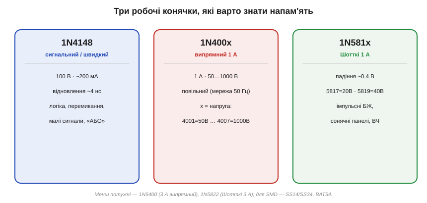
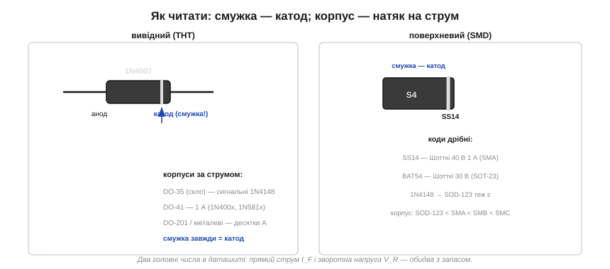

# 🔌 Сімейства діодів: 1N4148, 1N400x, Шотткі — що коли брати

Те, *чим* звичайний діод відрізняється від [Зенера й Шотткі](root:embedded/zener-schottky) за фізикою, — лише півсправи. На практиці важить геть приземлене питання: які **конкретні** типономінали лежать у кожній шухляді, як прочитати маркування на корпусі й за двома числами обрати діод під свою задачу. Кілька позначень варто знати напам'ять — вони покривають дев'ять задач із десяти.

### Три робочі конячки

Майже вся аматорська й значна частина професійної електроніки тримається на трьох серіях:


*1N4148 — сигнальний і швидкий; 1N400x — випрямний на 1 А з різною зворотною напругою; 1N581x — Шотткі з малим падінням. Три імені, що закривають більшість потреб.*

**1N4148** — сигнальний (перемикальний, *small-signal switching*) діод: ~100 В, малий струм (близько 200 мА), але дуже **швидкий** (зворотне відновлення ~4 нс). Швидкість тут — не випадковий бонус, а ключова властивість, заради якої його й тримають у шухляді; за нею стоїть механізм накопиченого заряду. Це робоча конячка логіки й малих сигналів. Розв'язати два сигнали в схему «АБО», обмежити рівень (клампер), зробити швидкий перемикач, прибрати брязкіт кнопки — коли треба «просто діод» для сигналу, це майже завжди 1N4148.

**1N400x** — випрямна серія на **1 А**. Усі сім номерів однакові, крім одного: зворотної напруги. 1N4001 тримає 50 В, а далі по наростаючій до 1N4007 на 1000 В:

```
1N4001 = 50 В     1N4004 = 400 В     1N4007 = 1000 В
1N4002 = 100 В    1N4005 = 600 В
1N4003 = 200 В    1N4006 = 800 В
```

Це повільні діоди для **мережевого** випрямлення (50/60 Гц), де швидкість не потрібна. Повільні вони не випадково: щоб тримати 1000 В, базу роблять товстою й слабо легованою, а в товстій базі під час прямої провідності встигає накопичитися багато неосновних носіїв — саме той заряд, який потім доведеться «вигрібати» при вимиканні. Для мережі це не вада: за 50 Гц напрямок струму змінюється раз на 10 мс, а кільканадцять мікросекунд на відновлення тут ніхто й не помітить. Практичний хід: коли сумніваєтесь, беріть одразу **1N4007** — він коштує стільки ж, а тримає максимум; зайвий запас зворотної напруги ніколи не шкодить, бо в провідності діод поводиться однаково незалежно від того, на 50 чи на 1000 В розрахований його зворотний бар'єр.

> 🔧 **Навіщо це.** У мережевому блоці живлення (трансформатор 50 Гц → міст → конденсатор) 1N400x — стандартний вибір. На вторинній обмотці 12 В піковий зворотний потенціал на закритому діоді доходить до ~17 В, тож 1N4001 на 50 В формально вистачає — але дешевший за копійки запас до 1N4007 рятує від кидків напруги в мережі.

**1N581x** — Шотткі (*Schottky*) на 1 А з малим падінням (~0.4 В) і високою швидкістю: 1N5817 на 20 В, 1N5819 на 40 В. Це вибір для імпульсних блоків живлення, захисту сонячних панелей від зворотного струму й усюди, де борються за ефективність. Чому в Шотткі падіння менше і чому він швидший — не просто «такий уже він є», а пряме наслідок його будови.

Потрібно більше струму — є потужніші родичі: **1N5400-серія** (3 А випрямні), **1N5822** (Шотткі 3 А). Для поверхневого монтажу ті самі ролі грають **SS14**/**SS34** (Шотткі 1 А/3 А) і **BAT54** (сигнальний Шотткі).

### Чому Шотткі падає лише ~0.4 В

Звичайний кремнієвий діод — це стик двох легованих напівпровідників, p і n. На їхній межі дифузія носіїв оголює нерухомі іони й будує [**збіднену область** із вбудованим полем](topic:ph-condensed/pn-junction). Щоб відкрити такий перехід, прикладена напруга мусить спершу подолати цей вбудований дифузійний потенціал — і саме він задає характерні ~0.6–0.7 В прямого падіння на кремнії.

Шотткі влаштований інакше: це стик **металу й напівпровідника**, а не двох напівпровідників.

```
звичайний діод:  p-Si ── [PN-перехід] ── n-Si
Шотткі:          метал ── [бар'єр Шотткі] ── n-Si
```

Коли метал торкається легованого n-кремнію, на межі теж виникає бар'єр (його звуть **бар'єром Шотткі**, *Schottky barrier*) — електрони перетікають, доки рівні енергії не вирівняються, і лишається контактна різниця потенціалів. Але висота цього бар'єра визначається не дифузійним потенціалом PN-переходу, а різницею роботи виходу металу й електронної спорідненості напівпровідника — і для звичайних пар метал/кремній вона менша: типово ~0.3–0.4 В замість ~0.7 В. Менший бар'єр треба подолати — менше пряме падіння. Ось перша й головна причина, чому Шотткі «відкривається легше».

Та є й глибша, друга причина, і вона ж пояснить швидкість. У звичайному PN-діоді струм несуть **неосновні носії**: коли діод відкритий, з p-боку в n-область упорскуються дірки, а з n-боку в p — електрони, і вони деякий час «живуть» там як чужі, накопичуючись. У Шотткі провідність забезпечують **основні носії** — електрони, які з n-кремнію переходять у метал, де електронів і так безліч. Жодного впорскування чужих носіїв, жодного їх накопичення на «не своєму» боці. Це **уніполярний** прилад (лат. *uni-* — один: один тип носіїв) на противагу **біполярному** (лат. *bi-* — два) PN-діоду. Саме відсутність накопиченого диркового заряду й робить Шотткі таким швидким.

> 🔧 **Навіщо це.** В імпульсному перетворювачі (DC-DC, як у будь-якій USB-зарядці чи на платі ESP32) випрямний діод відкривається й закривається сотні тисяч разів на секунду, і на ньому щоразу падає напруга, поки тече струм. Замінивши 0.7 В на 0.4 В при струмі 1 А, ви економите 0.3 Вт втрат на самому діоді — менше тепла, вищий ККД, менший радіатор. Тому в КРОК-перетворювачах майже завжди стоїть Шотткі.

Де ця аналогія ламається? «Метал замість другого напівпровідника» звучить так, наче Шотткі — у всьому кращий. Це не так. За малий бар'єр платять **великим зворотним струмом витоку**: той самий низький бар'єр, що легко пропускає струм уперед, гірше тримає його назад, тож закритий Шотткі підтікає помітно сильніше за PN-діод, і витік швидко росте з температурою. Тому Шотткі рідко роблять на високу зворотну напругу (звідси й скромні 20–40 В у 1N581x проти 1000 В у 1N4007): тонкий слабко-бар'єрний прилад просто не втримає сотні вольтів.

### Чому 1N4148 «швидкий»: накопичений заряд і зворотне відновлення

Коли біполярний PN-діод проводить струм уперед, в його базі накопичується **заряд неосновних носіїв** — упорснуті дірки й електрони, що ще не встигли рекомбінувати. Поки вони там сидять, діод фізично лишається провідним: ці носії — готовий «запас» рухомого заряду на хибному боці переходу.

Що станеться, якщо різко прикласти зворотну напругу? Інтуїтивно очікуєш, що діод миттю закриється. Але ні: спершу треба **вигребти весь накопичений заряд**. Доки ці носії не витягнуться полем назад (або не рекомбінують), діод проводить струм **у зворотному напрямку** — короткий, але цілком реальний імпульс зворотного струму:

```
струм через діод при різкому вимиканні:
        ┌─────────  пряма провідність
   I_F ─┤
        │          ← момент перемикання напруги
      0 ┼──────────╮───────────
        │          │  зворотний кидок (вигрібання заряду)
  −I_RM ┤          ╰──╮
        │             ╰──── діод нарешті закрився
                  └ t_rr ┘
```

Час, поки триває цей кидок, і є **час зворотного відновлення** (*reverse recovery time*, t_rr). У повільного 1N4007 заряду накопичується багато (товста слабко-легована база — ціна високої зворотної напруги), тож t_rr сягає одиниць мікросекунд. У 1N4148 базу зроблено тонкою, а в кремній додано центрів рекомбінації (часто легуванням золотом), які швидко «гасять» неосновні носії — заряд або малий, або миттю зникає, тому t_rr ~4 нс. У Шотткі вигрібати взагалі майже нічого: він уніполярний, накопиченого диркового заряду в нього немає за конструкцією — лишається тільки перезарядити власну ємність переходу, а це теж дуже швидко.

Звідси й практичне правило стає очевидним: для швидких кіл (логіка, високочастотне перемикання) беруть 1N4148 чи Шотткі, бо повільний 1N400x під час кожного перемикання пропускав би помітний зворотний кидок струму — а в мережевому випрямлячі на 50 Гц цей самий кидок розчиняється в десятках мілісекунд півперіоду й нікому не заважає.

### Як прочитати корпус

Перше, що треба знайти на діоді, — де **катод**. Правило універсальне: **смужка позначає катод**:


*На вивідних і на SMD-діодах смужка завжди з боку катода. Розмір корпусу грубо підказує струм: скляний DO-35 — сигнальні міліампери, DO-41 — ампер, великі металеві — десятки ампер.*

Позначення з префіксом **1N** — це стара система JEDEC; число нічого не «кодує», його просто треба знати чи подивитися в довіднику. Корпус натомість одразу підказує діапазон струму — і не випадково, а з фізики тепловідводу: весь струм, помножений на пряме падіння, виділяється як тепло, і відвести його корпус може лише через свою поверхню та виводи. Більший струм — більше тепла — потрібен більший корпус. Тому крихітний скляний **DO-35** — це сигнальний 1N4148 на міліампери; чорний **DO-41** — амперні 1N400x і 1N581x; великі металеві корпуси — десятки ампер. Для SMD логіка та сама, лише дрібніша: чим більший корпус (SOD-123 < SMA < SMB < SMC), тим більша площа контакту з платою, тим краще тепло йде в мідь — тим більший струм. SMD-діоди підписані коротким кодом (наприклад, «S4» на корпусі SS14) — його розшифровують за даташитом.

### Вибір за двома числами

Хоч би яку серію ви брали, вибір зводиться до двох паспортних чисел із [вольт-амперної характеристики](topic:hw-components/diode-iv-curve): **прямий струм** I_F (*forward current* — скільки витримає, не перегрівшись) і **зворотна напруга** V_R (*reverse voltage* — щоб не пробило). Чому саме із запасом, а не «впритул»? Бо обидві межі — теплові й пробійні, а реальність завжди дає кидки понад розрахунок: стрибок навантаження підкине струм, перехідний процес у мережі підкине напругу. Робочий струм тому беруть удвічі-втричі нижчим за межу (тоді й діод грітиметься помірно, і запас на пік є), а зворотну напругу — з добрим запасом над піком у вашому колі. Для швидких кіл додається третє число — час відновлення t_rr: тоді 1N4148 чи Шотткі, а не повільний 1N400x, бо інакше зворотний кидок струму при кожному перемиканні гріє діод і засмічує сигнал.

**Worked example: який Шотткі поставити на вхід захисту від переполюсу для плати ESP32.**

Плата живиться від 5 В, споживає до 0.5 А, і ми ставимо діод послідовно, щоб переплутана полярність живлення не спалила схему. Перевіримо обидва числа й оцінимо нагрів на кандидаті 1N5819 (Шотткі 1 А / 40 В):

```
вхідна напруга:        V_in = 5 В
макс. струм плати:     I    = 0.5 А
кандидат:              1N5819 → I_F(max) = 1 А, V_R(max) = 40 В

запас по струму:       1 А / 0.5 А = 2×           ✓ (правило «×2…×3»)
запас по напрузі:      зворотний пік при переполюсі ≈ 5 В
                       40 В / 5 В = 8×             ✓ із величезним запасом

пряме падіння при 0.5 А (з даташита) ≈ 0.35 В
втрати на діоді:       P = V_F · I = 0.35 · 0.5 = 0.175 Вт
напруга, що дійде до плати: 5 − 0.35 = 4.65 В     ✓ ESP32-LDO ще тягне
```

Висновок: 1N5819 проходить за обома числами із запасом, гріється лише на ~0.18 Вт (корпус DO-41 відведе це без радіатора), і завдяки малому падінню Шотткі лишає платі 4.65 В замість 4.3 В, які з'їв би звичайний кремнієвий діод. Якби струм був 2 А — той самий розрахунок одразу відкинув би 1N5819 (запасу по струму нема) і вказав на 1N5822 (Шотткі 3 А).

> 🔧 **Навіщо це.** Чотири імені на всі випадки: **1N4148** — сигнал і перемикання (тонка база, малий накопичений заряд → швидкий); **1N4007** — мережевий випрямляч на 1 А (бери максимальну напругу про запас, повільність тут не заважає); **1N5819** — Шотткі там, де важать падіння та ефективність (метал-напівпровідник → ~0.4 В і немає вигрібання заряду); **BAT54/SS14** — те саме для SMD. Шукайте смужку (катод), беріть I_F і V_R із запасом — і дев'ять задач із десяти закриті, а на десяту (потужність, висока частота, точна опора) даташит підкаже спеціальний тип.
