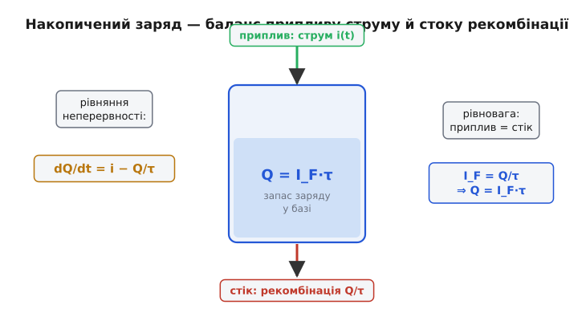
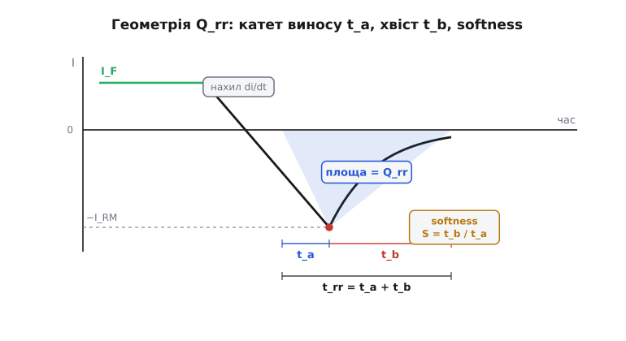

# 🧮 Заряд-контроль: від Q = I·τ до втрат на зворотному відновленні

У детальній темі ми вже бачили механізм зворотного відновлення й дістали три робочі формули: заряд Q_rr ≈ ½·I_RM·t_rr, зв'язок піка з крутістю фронту I_RM ≈ √(2·Q_rr·di/dt) і втрати E_rr ≈ Q_rr·U. Там вони з'явилися майже готовими — «спростимо форму сплеску до трикутника». Тут ми **виведемо** кожну з них з однієї-єдиної фізичної тотожності — рівняння неперервності для заряду — і побачимо, звідки насправді береться множник ½, куди в піковий струм ховається softness factor, і чому та сама величина Q = I·τ, що керує вимиканням, водночас працює як ємність. Мета не в тому, щоб переписати формули, а в тому, щоб жодна з них більше не була чарівною: кожна виросте на очах з балансу «скільки заряду прийшло — скільки пішло».

Це кут суто математичний, тож він спирається на два вже пройдені результати. Перший — [експонента Шоклі](root:hw-components/diode-iv-curve/math-shockley-equation.md): струм крізь відкритий перехід росте як e^(U/(n·U_T)), а тепловий потенціал U_T = kT/q ≈ 26 мВ за кімнатної температури; саме з цієї експоненти ми дістанемо дифузійну ємність. Другий — якісна картина накопиченого заряду з самої теми діодів: у прямій провідності база біполярного діода повна неосновних носіїв, і поки вони там, діод лишається провідним. Усе інше виведемо тут.

### Одне рівняння, з якого все випливає

Почнімо з бухгалтерії. У базі діода в будь-яку мить сидить певний заряд неосновних носіїв — назвемо його Q (кулони). Що може змінити цей запас? Лише дві речі: носії **надходять** (їх приносить струм i, що тече крізь діод) і носії **зникають** (рекомбінують, гинуть на пастках). Запишемо це як швидкість зміни запасу — рівняння неперервності в його найощаднішій, «зарядовій» формі:

```
dQ/dt = i(t) − Q/τ
```

Розберімо кожен член, бо в ньому вся фізика. Ліва частина — темп зміни накопиченого заряду. Перший доданок праворуч, i(t), — приплив: скільки кулонів за секунду вносить струм. Другий, −Q/τ, — стік від рекомбінації, і його форма не випадкова. Якщо кожен носій живе в середньому час τ (**час життя неосновних носіїв**, *minority carrier lifetime*), то за секунду гине частка 1/τ усього запасу; при запасі Q це Q/τ кулонів за секунду. Мінус — бо рекомбінація запас **зменшує**. Це той самий закон, що керує розпадом чого завгодно з фіксованою «тривалістю життя»: темп зникнення пропорційний тому, скільки ще лишилось.


*Заряд у базі — це бак. Струм i(t) наливає його зверху, рекомбінація Q/τ зливає знизу з темпом, пропорційним рівню. У рівновазі приплив дорівнює стоку — і рівень застигає на Q = I_F·τ. Уся динаміка вмикання й вимикання діода — це наповнення й спорожнення цього бака.*

Тепер дві розвилки, і з кожної випаде своя формула теми. Перша — **сталий стан** (діод давно проводить). Друга — **різке вимикання** (прикладаємо зворотний струм). Одне рівняння, два режими.

### Сталий стан: звідки Q = I_F·τ

Хай крізь діод давно тече незмінний прямий струм I_F. «Давно» означає, що запас уже застиг: він не росте й не спадає, тобто dQ/dt = 0. Підставмо нуль у ліву частину:

```
0 = I_F − Q/τ     ⇒     Q = I_F · τ
```

Ось і перша формула теми — але тепер не постульована, а **виведена** з балансу. Її зміст прозорий: у рівновазі скільки заряду приносить струм, стільки й з'їдає рекомбінація. Приплив I_F зрівноважується стоком Q/τ рівно тоді, коли запас дорівнює добутку струму на час життя.

Аналогія з чергою тут точна, і варто побачити, де вона точна саме тому, що обидва боки описує **те саме** рівняння балансу. Люди заходять до зали з темпом I_F осіб за секунду й кожен проводить усередині час τ. Скільки людей у залі в усталеному потоці? Рівно Q = I_F·τ. Подвоїть темп входу — вдвічі більше людей; подвоїть час перебування — знову вдвічі. Ось і два важелі накопиченого заряду: **більший струм — більше заряду; довший час життя — більше заряду.** І ось де ключ до «швидких» діодів: єдиний спосіб зменшити запас за того самого робочого струму — **вкоротити τ**. Саме це роблять, [легуючи кремній золотом чи платиною](root:embedded/diodes/hist-gold-doping.md): глибокі рівні-пастки різко прискорюють рекомбінацію, τ падає з мікросекунд до наносекунд — а з ним лінійно падає й накопичений заряд.

> 🔧 **Навіщо це.** Q = I_F·τ — це той самий заряд, який доведеться «вигребти» при вимиканні. Тому вже тут, ще не почавши рахувати відновлення, видно бюджет: діод, що проводив 10 А з τ = 1 мкс, тримає в базі 10 мкКл — і всі вони стануть зворотним кидком, якщо вимкнути його різко. Той самий діод з τ = 50 нс тримає лише 0.5 мкКл. Різниця в двадцять разів у майбутньому кидку — закладена вже в статиці, задовго до перемикання.

### Вимикання: скільки триває «застрягання» струму

Тепер найцікавіше — сам перехід у закритий стан. Діод проводив I_F; у мить t = 0 зовнішнє коло починає **виводити** заряд, заганяючи в діод сталий зворотний струм −I_R (поки що вважаймо його сталим — так робить класична модель, а реальний лінійний спад розберемо далі). Струм у рівнянні тепер від'ємний: i = −I_R. Підставмо:

```
dQ/dt = −I_R − Q/τ
```

Це лінійне диференціальне рівняння, і його не треба «вгадувати» — його зміст фізичний. Запас Q починає падати з двох причин одразу: його **виносить** зовнішній струм I_R і його **доїдає** рекомбінація Q/τ. Розв'язок — спадна експонента, що прямує не до нуля, а до уявного від'ємного рівня −I_R·τ (куди Q ніколи не дійде, бо діод раніше закриється):

```
Q(t) = τ · [ (I_F + I_R) · e^(−t/τ) − I_R ]
```

Перевірмо його на межах, щоб повірити. При t = 0: Q = τ·(I_F + I_R − I_R) = I_F·τ — правильно, стартуємо з рівноважного запасу. При t → ∞ (якби діод не закрився): Q → −I_R·τ — той рівень, на якому приплив −I_R зрівноважив би стік. Розв'язок узгоджується з обома кінцями, отже він і є.

Коли ж діод нарешті починає тримати зворотну напругу? Аж тоді, коли надлишковий заряд у базі вичерпано — коли Q(t) впаде до нуля. Час до цього моменту звуть **часом застрягання** (*storage time*, t_s): це та фаза, коли струм уже пішов у мінус, але діод **ще проводить**, бо в базі лишається заряд. Прирівняймо Q(t_s) = 0 і розв'яжімо відносно t_s:

```
(I_F + I_R) · e^(−t_s/τ) = I_R
e^(−t_s/τ) = I_R / (I_F + I_R)
t_s = τ · ln( (I_F + I_R) / I_R ) = τ · ln( 1 + I_F/I_R )
```

Оце результат, якого не було в основній темі, — **точний вираз для часу застрягання**. Прочитаймо його. По-перше, t_s прямо пропорційний τ: коротший час життя — швидше застрягання минає (знову той самий важіль, знову золото в кремнії). По-друге, t_s залежить від **відношення** струмів I_F/I_R, і залежить логарифмічно, тобто слабко. Хочете вдвічі скоротити застрягання, збільшуючи зворотний струм виносу? Не вийде дешево: логарифм пручається. Щоб I_F/I_R впало настільки, щоб ln зменшився вдвічі, зворотний струм треба піднімати в рази.

**Приклад: час застрягання за різної «жорсткості» виносу.**

Діод проводив I_F = 1 А, час життя τ = 100 нс. Порівняймо два способи його вимкнути — м'яко (малий зворотний струм) і жорстко (великий):

```
м'який вивід, I_R = 0.5 А:
   t_s = 100 нс · ln(1 + 1/0.5) = 100 нс · ln 3 = 100 · 1.099 ≈ 110 нс

жорсткий вивід, I_R = 5 А:
   t_s = 100 нс · ln(1 + 1/5) = 100 нс · ln 1.2 = 100 · 0.182 ≈ 18 нс
```

Десятикратне збільшення зворотного струму скоротило застрягання лише вшестеро — логарифм з'їв частину виграшу. Але головне видно й так: **чим сильніше «висмоктуєш» заряд, тим швидше діод закривається** — саме тому в швидких схемах намагаються забезпечити крутий зворотний фронт. І водночас саме крутий фронт дає великий піковий струм, до якого ми зараз і перейдемо. Ця напруга між «швидше закрити» й «менший кидок» — стрижень усього розрахунку відновлення.

### Від застрягання до Q_rr: геометрія трикутника

Модель зі сталим I_R була зручна для виведення t_s, але в реальному колі струм при вимиканні спадає **не стрибком у −I_R, а лінійно** — з певною крутістю di/dt, яку задає зовнішня індуктивність і прикладена зворотна напруга (U = L·di/dt). Струм лінійно йде вниз, проходить нуль і рушає в мінус — і тут ми повертаємось до знайомої з теми картини, але тепер розберемо її геометрію точно.


*Форма зворотного струму, розкладена на дві фази. Фаза t_a: струм лінійно падає з крутістю di/dt від нуля до піка −I_RM — це триває, доки заряд активно виноситься. Фаза t_b: заряд майже вичерпано, перехід відновлює блокувальну здатність, і струм спадає назад до нуля. Уся площа під віссю — винесений заряд Q_rr; повний час t_rr = t_a + t_b; відношення S = t_b/t_a — це softness factor.*

Розкладімо форму на дві фази, як їх і визначає даташит:

**Фаза t_a** — від переходу струму через нуль до піка −I_RM. Струм увесь цей час падає з крутістю di/dt (діод ще широко відкритий, зовнішнє коло вільно розганяє струм у мінус). Пік досягається, коли крутість зламується, — а зламується вона тоді, коли заряд у базі вичерпується настільки, що перехід починає відновлювати блокування. Оскільки струм ріс лінійно від нуля з нахилом di/dt протягом часу t_a, висота піка — просто добуток:

```
I_RM = (di/dt) · t_a          (1)
```

**Фаза t_b** — від піка назад до нуля (точніше, до мізерного витоку). Заряду вже майже нема, перехід «зачиняється», і зовнішнє коло вже не може тримати зворотний струм — той спадає. Як саме спадає — плавно чи різко — і є та сама м'якість, до якої ми дійдемо за хвилину.

Тепер увесь винесений заряд Q_rr — це площа фігури під віссю за обидві фази. Спростімо її до **трикутника** з основою t_rr = t_a + t_b і висотою I_RM (саме це спрощення й робила основна тема). Площа трикутника:

```
Q_rr = ½ · I_RM · t_rr          (2)
```

Ось і формула (2) з теми — тепер видно, що ½ — це не підгінний коефіцієнт, а просто площа трикутника, половина добутку основи на висоту. Уся спрощеність тут в одному: реальна фігура — не точний трикутник (катет t_a прямий, а хвіст t_b — крива), тож ½ — наближення форми, і саме через нього далі з'явиться поправка на softness.

### Головна формула: пік росте як корінь із крутості

Тепер зведімо (1) і (2) докупи й дістанемо те, заради чого все й затівалося, — залежність піка зворотного струму від крутості фронту. Ідея: заряд Q_rr — властивість діода (його τ й робочий струм задають його наперед, він майже не залежить від того, як швидко ми вимикаємо), а от як цей фіксований заряд розподілиться між «висотою» I_RM і «шириною» t_rr — залежить від di/dt.

Візьмімо спершу найпростіший випадок, який і подала тема: припустімо, що фаза виносу t_a становить приблизно половину повного часу, t_a ≈ ½·t_rr (тобто хвіст такий самий за тривалістю, як і винос). Тоді з (1): t_rr ≈ 2·t_a = 2·I_RM/(di/dt). Підставмо це в (2):

```
Q_rr = ½ · I_RM · t_rr = ½ · I_RM · 2·I_RM/(di/dt) = I_RM² / (di/dt)
```

Звідси відразу:

```
I_RM ≈ √( 2 · Q_rr · di/dt )    ... стоп, звідки 2?
```

Тут варто бути чесним, бо в наближенні «t_a ≈ ½·t_rr» виходить рівно I_RM = √(Q_rr·di/dt), без двійки. Двійка з'являється, щойно ми **не** припускаємо симетрію, а акуратно врахуємо, що весь заряд виноситься переважно за фазу t_a. Зробімо це правильно через softness factor — і формула теми випаде сама.

### Softness factor: чесний вивід із двійкою

Введімо **коефіцієнт м'якості** (*softness factor*) як відношення тривалостей двох фаз:

```
S = t_b / t_a
```

Тоді повний час t_rr = t_a + t_b = t_a·(1 + S). Тепер порахуймо заряд не як один трикутник «на око», а як суму двох трикутників — фази виносу й фази хвоста, обидва з тією самою висотою I_RM:

```
Q_rr = площа(t_a) + площа(t_b) = ½·I_RM·t_a + ½·I_RM·t_b = ½·I_RM·(t_a + t_b)
```

Це те саме (2), просто розписане по фазах, — площа трикутника з основою t_rr не змінилась. Але тепер підставмо сюди I_RM = (di/dt)·t_a з (1), щоб виразити все через t_a:

```
Q_rr = ½ · (di/dt)·t_a · t_a·(1 + S) = ½ · (di/dt) · t_a² · (1 + S)
```

Розв'яжімо відносно t_a, тоді підставимо назад у (1) для I_RM:

```
t_a = √( 2·Q_rr / ( (di/dt)·(1+S) ) )

I_RM = (di/dt)·t_a = √( 2·Q_rr·(di/dt) / (1 + S) )          (3)
```

Ось звідки **двійка** — вона виходить, коли заряд-трикутник розписати чесно, а не спростити наполовину; наближення «t_a ≈ ½·t_rr» просто ховало її в грубому кроці. І тепер видно точну роль softness: він сидить у знаменнику. Для **різкого** діода (snappy, S → 0, хвіст миттєвий) увесь заряд виноситься за фазу t_a, і пік найбільший: I_RM = √(2·Q_rr·di/dt). Для **м'якого** (soft, S = 1, хвіст такий самий, як винос) пік менший у √2: половина заряду «стікає» повільним хвостом і не мусить проходити через високий пік. Формула основної теми I_RM ≈ √(2·Q_rr·di/dt) — це саме межа snappy-діода (S → 0), тобто **найгірший**, найбільший можливий пік. Для оцінки згори це якраз те, що треба: вважай діод різким і матимеш пік із запасом.

І повний час відновлення виводиться так само — з t_rr = t_a·(1+S):

```
t_rr = √( 2·Q_rr·(1 + S) / (di/dt) )          (4)
```

Порівняймо (3) і (4) — вони симетричні й повчальні. Пік I_RM росте як **корінь із di/dt** (крутіший фронт — вищий кидок), а час t_rr **падає** як корінь із di/dt (крутіший фронт — коротше відновлення). Добуток їхніх квадратів дає назад заряд: I_RM·t_rr = 2·Q_rr — заряд збережено, di/dt лише перерозподіляє його між висотою й шириною. Це і є головна фізична думка всієї моделі: **di/dt не змінює винесений заряд — воно вирішує, вилити його високим вузьким піком чи низьким широким.**

**Приклад: піковий струм відновлення у півмості.**

Діод вільного ходу з Q_rr = 75 нКл стоїть у півмості, де протилежний ключ при вмиканні задає крутість фронту di/dt = 400 А/мкс = 4·10⁸ А/с. Оцінімо пік для різкого діода (найгірший випадок, S → 0):

```
Q_rr = 75 нКл = 75·10⁻⁹ Кл
di/dt = 400 А/мкс = 4·10⁸ А/с

I_RM = √( 2 · 75·10⁻⁹ · 4·10⁸ ) = √( 60 ) ≈ 7.7 А
```

Майже вісім ампер зворотного кидка — і це **понад** робочий струм, доданий прямо до струму ключа, що якраз відкривається. Якби той самий діод був м'яким (S = 1), пік упав би до 7.7/√2 ≈ 5.5 А. А тепер порахуймо, наскільки крутість роздуває кидок: зменшимо di/dt удесятеро, до 40 А/мкс (повільніший драйвер):

```
I_RM = √( 2 · 75·10⁻⁹ · 4·10⁷ ) = √( 6 ) ≈ 2.45 А
```

Удесятеро повільніший фронт зменшив пік лише в √10 ≈ 3.16 раза — знову корінь пом'якшує залежність, але й знову видно правило: **хочеш менший кидок — або бери діод із меншим Q_rr, або гальмуй фронт** (ціною більших втрат на самому перемиканні). Це той компроміс, що визначає вибір швидкості затвора в кожному силовому драйвері.

### Softness — не естетика, а перенапруга

Чому взагалі варто розрізняти soft і snappy, якщо заряд однаковий? Бо фаза t_b обриває струм, а обрив струму на індуктивності породжує напругу. Наприкінці хвоста струм спадає від якогось значення до нуля з власною крутістю di/dt|хвіст. У різкого діода цей спад майже вертикальний — величезна крутість, — і на паразитній індуктивності кола L вона дає викид напруги:

```
ΔU = L · (di/dt)|хвіст
```

Це той самий закон самоіндукції, що й [викид на котушці при розриві струму](root:embedded/flyback-protection): різко обірваний струм в індуктивності «вистрілює» напругою. У різкого діода хвіст короткий, отже крутість обриву велика, отже викид великий — він дзвенить на власній ємності контуру, засмічує все навколо електромагнітною завадою, а часом і пробиває сам діод чи ключ. У м'якого діода хвіст навмисно розтягнуто профілем легування бази: остання порція струму стікає полого, di/dt|хвіст мала, і викид тихий. Ось чому softness — паспортний параметр, за який борються: **малий Q_rr рятує від втрат і від великого піка, а велика м'якість — від перенапруги й завади.** Ідеальний швидкий діод має і те, і те; реальний — це компроміс, і даташит чесно наводить обидва числа.

### Дифузійна ємність: той самий заряд, погляд збоку

Тепер несподіваний поворот, який показує єдність усієї картини. Досі Q = I·τ був «зарядом, що виноситься при вимиканні». Але подивімось на нього інакше — як на **ємність**. Ємність за означенням є dQ/dU: наскільки міняється накопичений заряд при зміні напруги на приладі. У відкритого діода заряд у базі є (Q = I·τ), і він залежить від напруги — через струм. Порахуймо цю похідну прямо.

Заряд Q = I·τ, а струм пов'язаний із напругою [експонентою Шоклі](root:hw-components/diode-iv-curve/math-shockley-equation.md): I = I_S·e^(U/(n·U_T)). Отже Q = τ·I_S·e^(U/(n·U_T)). Диференціюймо за напругою — і скористаймося головною властивістю експоненти, з якої в тій-таки книжці вивели й динамічний опір: похідна експоненти відтворює саму себе, лишаючи множник 1/(n·U_T):

```
C_d = dQ/dU = τ · I_S · e^(U/(n·U_T)) · 1/(n·U_T) = τ · I / (n·U_T)
```

Отримали **дифузійну (накопичувальну) ємність**:

```
C_d = (I · τ) / (n · U_T)          (5)
```

Той самий множник — струм I відтворився з добутку «передекспоненційне · експонента», рівно як у виводі r_d = n·U_T/I. І це не збіг, а глибокий зв'язок: **дифузійна ємність — це просто час життя, поділений на динамічний опір.** Справді, C_d = I·τ/(n·U_T) = τ / (n·U_T/I) = τ / r_d, звідки

```
r_d · C_d = τ
```

Стала часу «динамічний опір × дифузійна ємність» дорівнює часу життя носіїв — тому самому τ, що керує і накопиченим зарядом, і застряганням. Це вражаюче замикання: три різні на вигляд величини — опір малого сигналу, накопичувальна ємність і швидкість відновлення — виявляються трьома гранями одного τ. Заряд, що застряг при вимиканні, і ємність, що гальмує малий сигнал, — це буквально одне й те саме явище (запас неосновних носіїв), виміряне двома різними приладами.

> 🔧 **Навіщо це.** C_d ∝ I росте зі струмом і у прямому зміщенні зазвичай набагато більша за бар'єрну ємність переходу. Практично це означає: відкритий діод — повільний для малого сигналу саме через C_d, і саме тому детектори та змішувачі, де діод має відкриватися-закриватися на високій частоті, тримають робочий струм помірним і беруть діоди з малим τ. А для швидкодії **закритого** діода головна вже бар'єрна ємність (заряду в базі нема) — але це вже інша ємність, розібрана в самій темі.

### Ціна відновлення: енергія й потужність втрат

Лишилося вивести те, що робить усю цю математику грошовою, — втрати. Кожна подія відновлення палить енергію, і ось чому. Поки крізь діод тече зворотний струм відновлення, він фізично проводить у **зворотному** напрямку — а це означає, що на протилежному ключі (тому, що відкривається й заганяє цей струм) стоїть майже повна напруга шини U. Отже на ключі одночасно є і струм (той самий кидок відновлення), і напруга U — а добуток струму на напругу є потужність. Проінтегруймо цю потужність за час відновлення.

Заряд, що протік у зворотному напрямку за весь епізод, за означенням дорівнює Q_rr (це інтеграл струму за часом — площа під кривою, яку ми й рахували). Якщо протягом усього епізоду напруга трималася приблизно сталою на рівні U (розумне наближення для жорсткого перемикання, де ключ уже підняв напругу шини на діод), то енергія — це просто напруга, помножена на весь заряд, що протік:

```
E_rr = ∫ U·i dt = U · ∫ i dt = U · Q_rr          (6)
```

Ось формула (6) з теми, тепер виведена: **енергія однієї події відновлення — це просто заряд Q_rr, помножений на напругу, під якою його виносять.** Логіка гранично проста, коли її розкласти: перенести заряд Q_rr проти напруги U коштує рівно Q_rr·U джоулів — так само, як підняти заряд на конденсаторі. Наближення тут одне — сталість U за епізод; насправді напруга наростає, тож акуратніша оцінка дає частку від Q_rr·U (часто пишуть ¼·Q_rr·U для трикутного перекриття), але для оцінки згори й для порівняння діодів між собою множник порядку одиниці не міняє висновку, і тема справедливо взяла найпростішу форму E_rr = Q_rr·U.

Тепер від однієї події до середньої потужності. Якщо перемикання повторюється f разів за секунду, то щосекунди спалюється f таких порцій:

```
P_rr = E_rr · f = Q_rr · U · f          (7)
```

Формула (7) — головний практичний висновок усієї вставки. Прочитаймо, від чого лінійно залежать втрати відновлення: від заряду Q_rr (властивість діода — бий по ньому вибором швидкого діода чи меншого τ), від напруги шини U (властивість топології) і від частоти f (властивість керування). Усі три — лінійно, без пощади: подвоїв частоту — подвоїв втрати; підняв напругу шини вдвічі — подвоїв втрати. Ось чому саме високовольтні високочастотні перетворювачі найболючіше страждають від відновлення, і саме там воює за кожен нанокулон Q_rr.

**Приклад: втрати відновлення у півмості на 400 В.**

Кремнієвий діод вільного ходу з Q_rr = 75 нКл працює у півмості на шині U = 400 В, що комутує з частотою f = 100 кГц:

```
енергія на подію:   E_rr = Q_rr · U = 75·10⁻⁹ · 400 = 30 мкДж
середня потужність: P_rr = E_rr · f = 30·10⁻⁶ · 100·10³ = 3.0 Вт
```

Три вати втрат **лише на зворотному відновленні одного діода** — не рахуючи провідних втрат ні діода, ні ключа. Це вже потребує радіатора саме під ці втрати. А тепер порахуймо, що дає перехід на діод із удесятеро меншим зарядом (fast-recovery або SiC-діод Шотткі з Q_rr ≈ 7.5 нКл):

```
P_rr = 7.5·10⁻⁹ · 400 · 100·10³ = 0.3 Вт
```

Ті самі 400 В і 100 кГц, але втрати впали з 3 Вт до 0.3 Вт — рівно вдесятеро, слідом за Q_rr, як і диктує лінійність (7). Ось арифметичне обґрунтування, чому в швидких високовольтних перетворювачах або ставлять [SiC/GaN](root:embedded/sic-gan-comparison), у яких відновлення мізерне за фізикою широкозонного матеріалу, або переходять на синхронне випрямлення транзистором, де діодного відновлення нема взагалі. Три вати проти трьох десятих — це різниця між гарячим радіатором і холодним корпусом, і вся вона схована в одному паспортному числі Q_rr.

### Що з чого випливає: одна тотожність, п'ять формул

Відступімо на крок і побачмо, як усе стягнулося в один вузол. Ми почали з єдиної тотожності — рівняння неперервності dQ/dt = i − Q/τ, простої бухгалтерії «приплив мінус стік». З неї в усталеному режимі випав накопичений заряд Q = I_F·τ; при вимиканні сталим струмом — час застрягання t_s = τ·ln(1 + I_F/I_R); при вимиканні лінійним фронтом — уся геометрія Q_rr із піком I_RM = √(2·Q_rr·di/dt/(1+S)) і часом t_rr; а погляд на той самий заряд як на dQ/dU дав дифузійну ємність C_d = I·τ/(n·U_T), пов'язану з динамічним опором тотожністю r_d·C_d = τ. Насамкінець інтеграл зворотного струму під напругою дав ціну всього цього — E_rr = Q_rr·U і P_rr = Q_rr·U·f.

```
рівняння неперервності:  dQ/dt = i − Q/τ
   │
   ├─ усталений режим (dQ/dt=0) ──────→  Q = I_F·τ
   │        │
   │        ├─ dQ/dU, через експоненту ─→  C_d = I·τ/(n·U_T),  r_d·C_d = τ
   │        └─ виноситься при вимиканні ─→  ↓
   │
   ├─ вимикання сталим I_R ───────────→  t_s = τ·ln(1 + I_F/I_R)
   │
   └─ вимикання фронтом di/dt ────────→  Q_rr = ½·I_RM·t_rr
            │                              I_RM = √(2·Q_rr·(di/dt)/(1+S))
            │                              t_rr = √(2·Q_rr·(1+S)/(di/dt))
            └─ інтеграл U·i dt ─────────→  E_rr = Q_rr·U,  P_rr = Q_rr·U·f
```

Головний урок цієї вставки той самий, що й у теми, лише доведений до кінця математично: **накопичений заряд Q = I·τ — це єдина прихована змінна, з якої випливає майже вся динаміка діода.** Швидкість відновлення, піковий кидок, дифузійна ємність, втрати перемикання — не окремі явища з окремими формулами, які треба заучувати, а різні проєкції одного запасу неосновних носіїв у базі. Зрозумівши баланс «скільки прийшло — скільки пішло», ти вже не пам'ятаєш ½ чи √2 як магічні числа — ти дістаєш їх на місці з площі трикутника й з розкладу на фази, під конкретний діод і конкретне коло. І саме тому третє паспортне число після I_F та V_R — заряд Q_rr — перестає бути таємничим рядком у даташиті й стає тим, що ти вмієш **порахувати** й **перевести в вати**.
